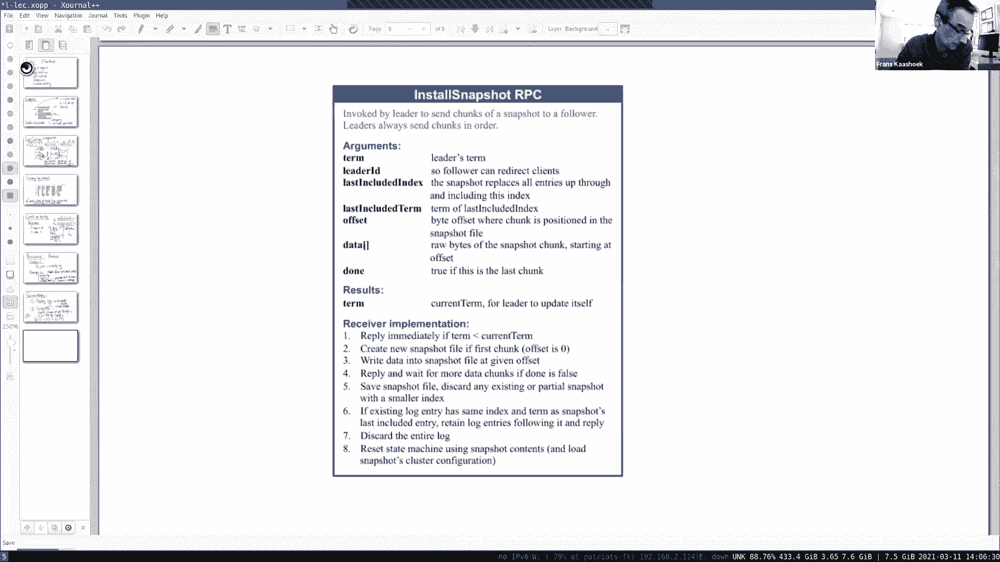
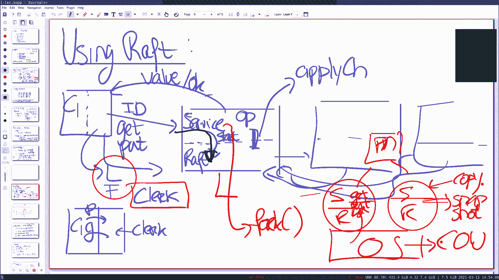

# MIT 6.824 2021 分布式系统 [中英文字幕] - P7：Lecture 7 - Fault Tolerance - Raft (2) - mayf09 - BV16f4y1z7kn

好的，下午好，声音检查，大家能听到我说话吗？是的。谢谢，好的，下午好，晚上好，早上好，晚上好，无论你在哪里，今天我要更多地谈谈 raft ，我们想要涵盖以下不同的主题，将与实验相关。所以，首先。

我想更多地谈谈日志分叉，在上一节课结束时，我们遇到了一个[扣人心弦]的问题，我们进行了一次关于图 6 的讨论，我想恢复那次讨论。我想谈谈日志追赶和发生了什么，跟随者如何追赶，然后是一些持久化。

比如什么状态必须，什么 raft 状态必须在存储中持久化，与 2c 和 2d 相关，并讨论状态到快照。是的，如果有任何问题，请随时提出来。最后，我想谈谈线性一致性，以及论文中经常提到的标准。

在很多地方也会用到，这将让我们再谈一谈，关于这些服务器如何使用 raft 。所以，这些就是我们计划谈论的话题，你现在有任何问题，请随时提问，当然，在任何时候都可以加入进来。好的，我们上周看过了。

我们开始谈论 raft ，我们看到领导者完成工作，将日志复制到跟随者上，但是由于领导者选举的崩溃，系统的状态，日志可能有很大的差异，图 6 是一个示例，为什么，怎么会发生这种事，领导者可能会停机。

它们可能追加更多的条目，所以有很多不同的场景，我们的系统最终处于的，图 6 、图 7 显示了其中的一些，而这个图表出现的主要原因是，它强化了领导者选举规则，所以一旦领导者停机，我们需要选举一个新领导者。

有一些限制是必须应用，以确保我们最终能够在正确的日志上收敛。所以，首先，这其中的一部分是，任何领导者都需要获得多数，这是这个想法的一部分，为了避免脑裂的问题，在某种程度上我们可以确保。

在之后的任何两次选举中，至少会有一个节点，它参与了这两个多数，因为两个多数必须重叠，而那个节点必须有，最近的 term 上的操作。多数是重要的，但它实际上有点[微妙的]，你可能会认为。

最长的日志应该足够了，因为最长的日志具有最多的信息，所以我们选择它为下一个领导者，然后我们就可以了。事实证明并非如此，领导者规则是有些微妙的，大多数加上至少是最新的，至少是最新的。所以。

领导者选举开始运行，跟随者，候选者开始参与领导者选举，[接近]很多跟随者，而跟随者投了赞成票，如果候选者至少像它们一样是最新的。这意味着，最后一个日志条目必须具有相同的 term 。

或者如果它们有相同的 term ，最长的一个会获得胜利。所以，这是领导者选举规则，我们上周看到了这个问题，作为家庭作业的一部分，（以下情况）会发生什么，如果这个节点，更糟糕的是领导者停机了，它消失了。

谁可能成为领导者，很快就发现，有很多节点不能成为领导者，但在很多情况下，一些节点可能会成为领导者。尤其是，我们认为 a 可以成为领导者，c 可以成为领导者，d 可以成为领导者。然后。

这可能是整个讨论中最重要的部分，谁能成为领导者。[]有一个问题。稍等一下。好的。所以谁能成为（领导者）是最重要的部分，有一些不同的场景，a 可以成为领导者，有一些场景， c 可以成为领导者，有一些场景。

 d 可以成为领导者。然后讨论集中了一点，比如，至少有一种特殊的情况，其中一个可以成为领导者，多种情况下成为领导者，特别关注这个讨论集中在 a ，因为 a 可以成为领导者的一种方式是。

当 c 和 d 停机的时候，因为 c 和 d 都停机了，a 将与 b e 和 f 交互，形成一个数量为 4 的大多数，它有最新的日志，注意即使 f 是一个更长的日志，但它不是最新的一个。

所以 a 成功成为领导者，然后事情从那里继续。但是有一个有趣的问题出现了，是否有其他情况下， a 可以成为领导者，或者有没有一种情况，即使 c 和 d 都是启动的，或者可联系，或者参与。

有没有可能 a 成为领导者，所以当 c 和 d 是启动的，所以问题是 c 和 d 是否总是投票给 a ，如果 a 是候选人。事实证明，这有点复杂，这不是很直接的，所以，如果 a 开始这次选举。

假设它在 term 7 开始选举，所以，如果它联系 c 和 d ，c 是[正常]的，因为 a 是至少是最新的，所以，我们将能够达到大多数，但是 d 是可能的，有一条额外的规则，如果 d 有。

如果跟随者在更高的 term ，位于更高的 term ，它当前的 term 更高，那么这个候选人，那么它就可以停止选举，因为它会回应说，嘿，我的 term 比你高。

我现在的 term 比你的 term 要高，所以，你必须成为一个跟随者，a 将从候选者改回跟随者。这是可以发生的，在 d 的情况下，这个 d 可能已经看到了 term a 。

从这张图片我们不能很好地判断，结果到底会是什么，让我们假设这个例子，它已经运行了一次，并将 term 增加到 8 ，它没有成为成功的领导者，然后它的当前 term 是 8 ，当 a 要求它投票时。

d 会拒绝，说我不会投票给你，此外， a 的当前 term ，a 将看到这个消息，它比 7 高，所以， a 会下台，成为一个跟随者，然后在后来的某个时候，假设 d 的选举定时器过期，那么它会运行。

所以这个简短的故事，这张图片是这样的，这是绝对可能的，a c d 可以在不同类型的场景中成为领导者，这可能是摆脱这一局面的主要原因。教授。嗯。所以，我想问一下，因为我不确定我是否理解正确。

你说 a 可能会在 term 7 当选，是不是有任何原因它不能在 term 7 当选，即使 d 停机了，对吧，因为像 d 已经在 term 7 获得了多数。d 在 7 中获得多数。

因为它能够完成一些事情，所以你是对的，很好的观察，所以它必须是这样的，已经有很多人进入 term 7 ，而且这张图并不完整，我们不知道当前的 term 是什么，到目前为止人们所看到的。好的。好的？是的。

我的意思是唯一的事情是，我认为大多数服务器已经在 term 7 投票给了某人，所以。当然， a 将进入 term 8 ，我们开始 term 8 的选举，但是出于同样的原因，d 可能已经在 9 了。

这完全取决于当前的 term 是什么，这些参与者的身份是什么。但是主要结论，最主要的结论是，a 肯定可以成为领导者，当 c 和 d 掉线时，c 可以成为领导者， d 可以成为领导者。谢谢。好的，那么。

我们现在知道，raft 可以处于日志分叉的状态，所以，这需要修复，raft 协议的一个关键组件是，做他们所说的日志[追赶]，所以我稍微谈一下。这就是你要在实验的 b 部分要处理的问题。

所以我可能会更容易用这张图来说明，所以让我们，让它变得简单一点，我们有 3 台服务器，这是 S1 ，它有 term 3 在索引 10 中，索引 11 没有条目，以及 12 ，这里有 S2 。

S2 有条目 3 3 5 ，这是索引 10 11 12 和 13 ， 13 补全这个。这是 S4 ，抱歉， S3 ，让我们来看看场景 3 3 4 和 10 11 12 13 。

我不会展示 10 之前的索引，它们没什么关系。使用时间线，这些不同的服务器。让我们从假设开始，S2 成为领导者，因为它有最高的，它有最新的，它在最后一个日志条目中具有最高的 term 编号，所以。

它成为了领导者。现在，我们需要这个协议是，用来同步这些日志，使用的方式是发送[]，要么追加条目，因为新的日志条目附加，或因为心跳，它是没有新条目的附加条目。所以我们假设领导者发送了心跳，事实上。

它是这样做的，选举发出了一个心跳，所以它会发出心跳，心跳没有日志条目，但它表明了另外两个信息，也就是上一个 term ，所以上一个 term ，在本例中是 5 ，以及上一个索引，是 12 。

所以领导者 S2 发送给 S3 ，S3 看到这个，会说，好的，看一下我的上一个 term ，不是 5 ，而是 4 ，所以，它会发回一条消息说不，我还活着，但是我不能做你的追加（操作），我不是最新的。

现在 S2 有一些信息可以让它更新，它的工作方式是，有两个变量很重要，一个是，对于每个节点， S2 保持一个变量 nextIndex ，nextIndex 当它成为领导者时，会初始化它。

这是一种乐观的变量，它假设日志是最新的，所以当 S2 成为领导者时，它将其设置为 13 ，与它本身的值一样。这是可以的，因为这只是个猜测，是 S3 可能在的（索引），S3 可能落后了。

因为这个 no 消息，领导者会知道这个。所以，当它收到这个 no 消息，在未优化的版本中，所以我首先讨论未优化的版本，领导者只是对 nextIndex 减 1 ，所以它把 13 减到 12 。

然后在某个时刻，我们将发送另一个附加条目，而这一次，它实际上会说，好的，我们使 nextIndex 是 12 ，发送日志条目 5 ，以及上一个 term 3 ，而上一个的所以将是 11 。所以。

当 S3 收到这条消息时，检查上一个 term 3 ，上一个索引是 11 ，一切都解决了，它看到追加 5 ，所以它会抹去 4 ，然后在里面插入一个 5 ，然后回复好的。因此，在这一点上。

领导者日志是最新的，因为你收到了一条 ok 消息。第二个在这里扮演重要角色的变量，是 matchIndex ，也是 raft 维护的，领导者为每个跟随者维护的。所以 S3 有一个 nextIndex 。

S1 有一个 nextIndex ，类似的， S1 S2 S3 还有一个 matchIndex ，这是一种，你可以认为这是悲观的或下限的，所以当领导者变为领导者时，它只将值设置为 0 。

用来表示当目前为止，S3 没有任何日志条目，所以，它还没有向应用程序传递任何日志条目，所以，对于 S2 ，还必须非常小心，它可以传递给应用程序的内容，它需要知道，至少大多数跟随者。

拥有特定日志条目的复制，然后条目才能交付。所以开始是悲观的，但是，一旦它知道了，例如，一旦它知道跟随者是好的，我们收到了附加消息的确认，它可以更新悲观或下限的 matchIndex 。

从 0 到 13 ，因为它了解到，跟随者在 13 之前都是最新的，期望的 nextIndex 是 13 。在这个时间点上，它了解到两个不同的，日志条目 5 现在至少复制到两个节点上。你可能会觉得很好。

它已经复制到两个节点中，我们可以交付给应用程序，因为大多数已经有它，我们处于很好的状态。不幸的是，事实并非如此，这几乎是真的，但不完全是真的，这与图 8 有关，所以我想稍微谈谈图 8 。

这里事情变得稍微复杂的真正原因，你也应该觉得有点可疑。所以这个领导者 S2 从 S3 的日志中擦除了值，有人把它放进去了，擦除它，是的，这看起来有点危险，所以有一个边界条件，在那里你必须小心一点。

当你交付，当你定义一个消息提交时。事实证明，图 8 说明了这一点。所以，让我来讨论一下擦除日志条目。我们将看到的规则，当消息可以传递到应用程序时，比仅仅计算复制次数要稍微微妙一些。让我们看看，图 8 。

把它加载进来。好的，这是图 8 ，和通常的结构一样。好的，让我们回到聊天中的问题上来，所以这是图 8 ，让我们来看看这里的场景是什么，图 a 中，日志条目 1 被每个节点提交，在 term 2 。

 S1 或 S2 成为领导者，它们提交或开始附加条目 2 ，还没有被提交，因为它不是绝对的大多数，那么实际上发生的，S5 肯定是断开的，[]这个 term 2 ，在 term 3 成为领导者。

在它的日志中附加一个条目，这肯定是没有提交的，因为没有大多数，然后我们到达 c ，也许 S5 又断开了，S1 在 term 4 成为领导者，它开始复制日志条目 2 到其他节点，而且交付它，它会回来。

像上一张幻灯片中显示的那样，它们在 S2 和 S3 中。事实证明，你可能会想，好的， S1 知道，3 个节点有这个特定条目的复制，所以我也许能交付它，事实证明这不是真的。

还有更微妙的原因需要发生才能提交，也就是说，你只能提交。哦，抱歉，你可以提交，在领导者在它的 term 提交一个条目之后，如果我们考虑这个数字 2 ，它不是，领导者在 term 4 ，所以。

提交规则不允许，将 2 提交到服务器，因为这是来自前一个 term ，而不是来自当前 term ，例如，你的代码用于确定，是否可以将一些东西交付给 apply channel ，需要考虑到这个。

你需要考虑的原因如 d 和 e 所示，基本上发生的是，S1 可能处于不同的情况下，其中 d 变成了，之后， d 成为领导者，例如 S1 断开，它可能会开始连接，它可以形成大多数，它开始将它的条目复制到。

好的，它擦除了 2 ，复制它的 3 到，它的 term 3 的条目到之前是 2 的（地方），这就是我们在上一张幻灯片中谈到的擦除。所以我们会看到，尽管它是在大多数节点上，在大多数节点上，还是被擦除了。

所以就是我在这里所说的规则，因为使用 e 描述，一旦 S3 S1 在它自己的 term 提交了条目，所以它知道每个，在它自己的 term ，有一个大多数，在这一点上，它可以把 4 交付给应用程序。

结果就是，任何节点在前面的 term 中提交的，也可以交付给应用程序。所以你在这里可以看到，日志条目的擦除，使提交规则稍微复杂一些。这是 raft 设计者们所做的设计决定，他们可以用不同的方式来做。

他们本来可以计数，如果他们想的话，让 2 也存活，但他们决定采用这种方法，理由是，他们认为这更简单。好的，这是突然出现的，在实验的测试案例中，所以，你必须对提交规则稍微小心一些，然后你就能正确地实现它。

好的，到目前为止，如果你回到这张图片，这个协议的优化版本有点令人沮丧，比如，如果你稍微想一想，让我们来看看 S1 发生了什么。让我们来看看，让我交换一下东西，让我们看看， S2 尝试使 S1 保持最新。

也会做同样的事情，发送附加条目，使用空条目，发送上一个 term 5 ，和上一个索引 12 ，它会说不，真正的上一个索引是 10 在 term 3 ，所以，它会。

这个会把它的 nextIndex 从 13 降到 12 ，然后我们再次做同样的事情，我想是发送日志条目 5 ，它会将上一个 term 设置为 3 ，上一个索引设置为 11 ，它会被拒绝。

然后索引从 12 到 11 ，现在它成功了，我们在这里看到，对于每个日志条目，我们将对附加条目进行一次往返，事实证明，这可能是昂贵的，比如，真正的问题是，跟随者能远远落后吗？我来问一下，我们暂停一下。

你可以思考这种情况，有没有可能一个跟随者可能远远落后于某个领导者？如果一台新机器加入集群？是的，新加入集群是一个很好的例子，还有其他的例子吗？一台机器崩溃了，很多 term 之后才重新上线。是的，没错。

它可能在一天之后又回来了，它可能已经远远落后了，这意味着，在未优化版本的协议中，你需要对日志条目一个接一个的返回。所以这有点贵，所以，这篇论文讨论了一种优化，用来快速赶上。这个想法基本上是。

不是像我之前说的那样后退，nextIndex 是乐观的，只是猜测，它不一定真的那么准确，所以观察到的是，我们不需要一个接一个地回去，让一个 term 回去也是完全可以的。这是符合逻辑的。

也许这是一个节点，它是几个 term 之前，我们回退几个 term ，然后我们从那里开始扫描。好的，为了说明它是如何工作的，让我使用一个完整的例子，我使用两台服务器，即使可能需要 3 个才能获得大多数。

但让我们假设还有第三个，它只是在正常运行。所以，这是 S1 ，这是 S2 ，假设这个节点有 5 5 5 ，这是 1 2 3 4 5 索引，假设 S2 有 4 以及全是 6 ，所以， S1 是非常落后的。

因为真正对齐的只有第一个条目，第一个，也就是 term 4 。因此，在未优化的方案中，我们一个接一个地后退，一个接一个直到我们最终到达那里。为了优化这一点，论文描述了一种优化，不幸的是。

性能并没有描述为，如图 2 那么详细，所以实际上，在 2c 中，要通过 2c ，你必须要有这种优化，实现一个这种形式的优化，你可以自由地实现它，因为论文并没有非常准确地描述，你应该怎么做。

然后你必须做一点工作。但它的基本思路如下，不只是投票或说不或是，如我们在之前的幻灯片看到的，拒绝，所以你说不，拒绝包括一点更多的信息，然后这些信息将，帮助领导者更快地后退。

所以包括他们所说的冲突 term ，作为对冲突索引的响应。这个冲突 term 基本上就是，让我说得更清楚一点，假设这是 S1 时间线，这是 S2 ，所以 S2 在 7 选举领导者，因为它有最新的日志。

它向 S1 发送一个心跳消息，在心跳中，它会说上一个 term 是 6 ，以及上一个索引是 5 ，现在，当 S1 得到这个，查看这个日志，看到上一个 term 是 5 ，所以，不是。

它会在回应中包含冲突 term ，term 在那个索引冲突，索引是 5 ，我们会找到条目，然后它还包括这个日志中这个 term 的第一个索引，所以我们查看这个 term 5 5 5 ，在日志中。

和索引 5 一样的（term）第一次出现在索引 2 ，所以我们也会包括它，我们会把它送回给领导者，这里 S2 是领导者，所以我们要发回 5，2 ，这就是冲突信息，领导者使用这些信息向后跳到更远，事实上。

它是从，所以最初它的猜测是 S1 的 nextIndex 是 6 ，根据这些信息，它的[缩小]为 2 ，所以它变成了 2 ，然后，下一个追加条目将包括从 2 开始的所有内容，所以它将包括 5 5 5 。

以及上一个 term 是 4 ，上一个索引是 1 ，现在 S1 可以[]，将新的日志条目复制到，条目 2 3 4 5 上，更新为最新的。所以这减少了心跳的次数，为了追赶跟随者。

一次一个 term 而不是一次一个条目。有什么问题吗？我们如何确保我们不会使带宽超载，想象一下，如果你有，你尝试发回所有这些日志条目，这导致了数据包过大的问题。是的，这是一个很好的问题。

它表明了另一种方案，但是回到这里，除了做出这种乐观的猜测，为什么要猜测，只是发送所有东西，领导者可以发送它的所有日志，那就太好了，然后任何跟随者都可以找到它们需要的，对吧，这将是另一种实现方式。

很可能我们不喜欢这种实现方式，因为日志可能很大，这将是一个问题。所以我想这里正在进行的猜测是，在通常的典型情况下，跟随者希望是足够近的，所以，回退几个条目就足够了，如果不是。

那么我们可能会回退一个 term ，但不是所有 term 。所以，我们将发送一个 term 的日志条目，这可能会很多，这可能会很多，我们很快就会看到，我们如何绕过这一点，快照将帮助。

减少我们必须发送的日志条目的数量。有一个问题，你是否需要在实验 2c 中实现这种版本的优化方案，答案是肯定的。至少我相信，在没有实现一些优化的情况下，我无法通过测试。我有一个问题，在我的代码中。

我通过后退到提交来进行优化，所以我在回复中包含了上次提交的索引，然后我从那里开始，这是不是更糟？你可能会遇到麻烦，测试记录了你发送的字节数，并给你一个预算，如果你把预算翻得太多，然后测试就会说。

你发送了太多数据，因为你的方案可能是这样的，我认为你会发送比实际需要更多的数据，无论需要是什么意思，但是。聊天中有一个问题。是的，我是不是画错东西了，是的， 6 6 6 6 ，抱歉，谢谢，6 6 6 。

我不想让跟随者覆盖领导者的日志条目，抱歉，找得好。还有什么问题吗？好的。好的，那么让我来谈谈持久化。首先，我们在聊天中有一个问题。好的。他们想知道为什么拒绝必须，将拒绝 term 和索引一起发回？好的。

这很大程度上取决于你如何实现，你在领导者维持什么状态，以及领导者是如何决定回退的，你是否需要发送一些 term 回去，因为你需要[]，响应延迟很长一段时间，你当然应该拒绝，完全不相关的 term 信息。

我知道这个回答有点含糊，但它在很大程度上取决于你如何实现它。好的，持久化，我们谈了一点持久化，在第一节 raft 课程中，我们注意到，跟随者每个 term 只能给一个候选者投票，所以。

它需要记住投票给了谁，以及当前的 term 是什么，但是关于持久化还有一个更大的问题，其中一个问题提到了这一点，你们中的一个刚刚问到，也就是，重启后会发生什么？你可以想到两种可能的策略，一种策略是。

策略 1 是，节点是新增的，新增，当一个节点崩溃并重新启动时，它只是不再参与了，它必须重新加入 raft 集群，这意味着，当重新加入时，你应该重放日志，必须接收日志中的每个条目，然后重放它们。当然。

如果一个节点出现故障，或者节点停机一天或两天，或者即使它只是停机一会儿，但是这个系统已经启动一年了，这个数字意味着你必须重放大量日志条目，所以这有一点令人讨厌。所以，人们更喜欢策略 2 。

也就是你可以回退，可以再次参与其中，所以你追赶，你从持久化状态开始，想法是，这只是一次快速重启，你崩溃了，你可以从任何快速的网络故障恢复，也许其他的可以继续向前一个 term ，你拥有所有的状态。

应该用来快速追赶。所以，真正的问题是，什么需要，什么状态需要持久化通过重新启动。我们已经讨论了投票给谁，这需要持久化，因为你不能在同一 term 内投票给其他候选人，但是 raft 包含了更多的信息。

并且将日志保持在磁盘上或处于持久化状态，以及当前 term 。对于每个，我们都应该问自己这个问题，为什么要维持持久化状态，因为这意味着每当我们更新状态时，每当我们将条目附加到日志时。

每当我们递增 term 时，或者每当我们修改 votedFor 时，我们必须写入磁盘或稳定存储，而稳定存储是很昂贵的，所以，很可能，例如，写入稳定存储可能会成为瓶颈。

所以我们已经讨论了 votedFor ，所以我要讨论一下日志，为什么日志必须写入持久化存储，我们能不能重建。从另一方面来说，你有一个问题，假设我们不写入稳定存储，什么会被打破？是的。

聊天室里有人回答这个问题，你可能会在丢失提交写入条目的大部分。所以这是一个场景，raft 复制操作到大多数节点上，所以大多数节点已经提交，已经交付，已经应用那个日志条目，所以领导者看到了提交。

它通过 apply channel 交付操作消息给服务器，服务器执行这个操作，并让客户端知道操作已经成功。所以现在暴露了一个事实，[]复制到大多数节点的操作到客户端。所以如果我们不是。

如果收到条目的跟随者，没有把它放到磁盘上，当重新启动时，它们仍然拥有它，我们可以遇到这种情况，就是聊天中的答案，我们丢失了已经提交条目的大多数，那个条目不会交付给其他副本到服务器。

所以客户端会看到一些奇怪的东西，它看到一个已经完成的操作，稍晚一点（再次）出现，实际上操作还没有发生。所以，它很重要，这个在稳定存储上，我们向领导者承诺提交，我们不能回退这个承诺。好的？对于这个。

有什么问题吗？为什么我们需要记住磁盘上的当前术语，为什么它需要稳定储存？嗯，这个 term ，你在每个 term 投票给不同的人，所以如果你不记住 term 是什么，那你不能，你不知道投票给了谁。是的。

没错，你投票给了谁，这也是当前 term 总是要上升的问题，你不能在 term 中下降，因为你要使用它，来检测过时的领导者和过时的候选人的 RPC ，它总是要上升的。好的？关于持久化，有什么问题吗？

是的，更多是你放东西的方式，但是你说有两种策略，对吧，它们需要一个日志，并且从持久化状态开始。是的。我的意思是你描述的从持久化状态开始的方式，你是不是重放，我想这张幻灯片上没有说，比如，如果你假设。

你显然也有一个快照。我还没有讨论快照，我们稍后会讨论这一点，这是下一个话题。好的，但是。重点是，好的，两种策略在节点崩溃之后，有两种方法可以处理那个节点，一种是有一个全新的节点，它从未在系统中出现过。

所以，当它出现时，你把它添加到集群中，就像它是一个新节点，所以集群来自，假设你开始有七个节点，一个崩溃了，集群还有六个节点，它只是快乐地继续，无论其他节点做它们的应用程序和所有类似的事情。

然后第二个节点会重新启动。所以有两种方式可以加入，一种方式是，我忘记所做的一切，我会再次加入集群，其他六个节点将带我到最新的，它们把日志发给我，我会重放操作，这可能会很昂贵，即使使用快照。

所以第二种策略是，如果相同的节点 7 再次恢复，它试图用它的持久化状态重建，基本上是希望，比如，停机几纳秒、微秒或毫秒，根本没有什么需要追赶，因为它已经在状态中了。但它会，除了日志，还有一个状态机。

对吧，用来[应用改变]。是的，让我们来谈谈这个，所以这是下一个话题。我想这里，那么关于服务恢复呢？对不起，我还有另一个关于持久化的问题。好的。服务器什么时候决定持久化？好的，好问题，你是怎么想的。

我相信你已经想过这件事了。我认为一个简单的答案是，每次这些变量中的一个发生变化，但这似乎是一件非常昂贵的事情。我认为这是正确的答案，每当这些变量中的一个发生变化，你要刷新到磁盘或写入，在我们的例子中。

在实验中，你写入到持久化模块。好的，还有。例如，当领导者通过 start 接受一个条目，并追加到它的本地日志中，它必须持久化那个条目。是的，是否持久化工作也是逐步进行的，比如一旦你获得了新的日志条目。

你附加或获取整个状态，并将其重写到文件中。好的，在现实生活中，你要追加，你不会重写整个日志，你只需要在日志中附加一个条目，这是日志很酷的原因之一，因为你只需要在末尾递增地追加，在我们的实验中。

整件事都是假的，持久化并不是真正的持久化，它在崩溃之间保持对象，因为崩溃也是假的，测试器会停止节点，重启它们，给它们一个新的状态，但是在真正的系统中，你会附加，所以日志应该是一个文件。

你可以在文件中附加一个条目。谢谢。是的，你将不得不，一个真正的系统，如果你附加日志条目，你的第一个附加日志条目，然后响应，所以，在附加条目中，如果你更新日志，所以，如果追加条目在跟随者上。

接收一组新的日志条目，它会将它们附加到本地持久化日志中，然后它可以回复，因为在附加之前做出回应是错的，因为那样你可能会失去，如果你在追加之前响应，你可能会进入一种情况，刚好在真正的追加发生前，你崩溃了。

所以你没有持久化日志条目，所以你会，你可能会丢失提交的条目。好的？好的，那么服务恢复呢，所以服务保持它自己的状态，例如，在实验 3 中，你实现一个键值存储，键值存储维护从键到值的 hash 映射。

你需要重放那些状态。同样地，它有两种可能的方法，策略 1 是重放日志以重建状态，所以，基本上，这与上一张幻灯片中的策略 1 有些类似，你使用日志，重放日志中的所有条目，这应该创造出完全相同的状态。

像以前一样，因为这种复制状态机方法的全部意义是，所有操作按整体顺序执行，操作没有[副作用]，所以如果你从同样的状态开始，然后重放所有的操作，你应该获得完全相同的状态，在任何其他节点，所以这是一种可能。

这是重建状态的一种方式。当然，这很昂贵，如果这项服务已经运行了几年，然后你必须从开始时间重放日志，这并不是那么[令人向往]。所以人们并不遵循策略 1 ，而是遵循另一种策略，我们制作周期性的快照。

这样做有两个原因，一个是以过去的方式重建服务状态，这样做的第二个原因是，为了能够压缩日志，甚至 raft 状态本身可以裁剪，从[前缀开始]可以裁剪。基本的[]是，如果应用程序运行了一段时间。

它应用了前一千个操作或前一百万个操作，那么状态构建了那个点，这些状态将包含到 i 的所有操作，i 可能是一千或者一百万，无论什么，所以，考虑的一种方式是，状态复制和日志复制或重放之间存在[二元性]。

你可以在一千次操作后保存状态，然后你得到完全相同的东西，重做从 0 到[]的每一次操作。这就意味着，一旦你有了快照，你将快照以持久状态存储在磁盘上，你可以裁剪，你可以通过 i 裁剪日志。所以。

这允许你控制日志的大小，定期请求服务器执行快照，然后服务告诉 raft 库，是的，我已经通过 i 做了快照，然后 raft 可以说好的，我只需要记住直到 i 的任何东西，当然。

这意味着快照必须存储在稳定存储上。这对恢复也有好处，这使我们的恢复方案变得更加复杂，比我在上一张幻灯片中描述的，它必须发生的是，当跟随者在快速重启后回来时，它加载它的持久化状态，它包括持久化状态。

我们在上一张幻灯片中说的，这些信息，但是它的最近的快照，安装最近的，加载快照到内存中，服务所做的。然后我们可以重放任何日志条目，为了让跟随者成为最新的。好的？对于这个，有什么问题吗？我有一个问题。

我不确定我能不能说得很清楚，但是我想，在我的印象中，所以我想这是不是打破了一些抽象层，以前存在于 raft 上的应用程序和 raft 本身之间，因为它现在需要理解状态机是如何。

比如如何将命令应用到状态机，而不是只是把命令给一些外部状态机。是的，很好的观察，当然，这里有一些，raft 库和服务必须放在一起，因为首先，（如果）服务撒谎，它给出关于应用到什么程度的错误信息。

然后我们将得到不一致的结果，我们不会假设谎言，但很明显情况就是这样，服务和 raft 库必须合作。而且你可以使用抽象[违规]，我认为他们这样做的原因是，限制我们必须维护的 raft 库的状态数量，否则。

 raft 库不知道什么时候可以裁剪日志。所以没有办法绕过它，服务会告诉它，比如，我有一个通过 i 的快照，所以，你可以删除从 0 到 i 的日志条目。你会看到，所以这可能是一个很好的点。

这将在 2d 中出现，实验 2d 将完全围绕快照和日志压缩，正如论文上所说的。这里必须有一个 API ，在服务器和 raft 之间，进行协作，基本上在 2a 和 2b 中，甚至在 2c 中。

这个 API 是非常简单的，唯一存在的 API 是，在 apply channel 上传递日志消息，几乎没有任何东西从服务到 raft ，除了服务可能会执行 start 。

raft 使用 start 在日志中添加一个条目。在 2d 中，必须有更多的 API ，在服务和 raft 库之间，事实证明，你可以使用很多可能的方式设计这个 API ，有很多方法可以做到这一点。

有很多方法，这篇论文并没有列出你应该使用什么 API ，论文没有提到这个，所以这取决于你，有时取决于我们，弄清楚 API ，为了能够做 2d ，我们必须在服务和 raft 之间声明一个 API 。

你会看到，你今天所做的，那个 API 有一些[]，可能和你想象的不一样，我们必须选择一个 API ，在那个 API 中，一个操作叫做[条件安装]，它的语义。

允许你以原子的方式修改 raft 状态和服务状态，在一个操作中。从某种程度上说，这个操作存在，用来限制抽象边界。好的？事实证明，你可以用不同的方式做到这一点，你并不需要，你可以用不同的方式写它。

但是我们，[]是一种更简单的方法。但它会在 2d 后变得更加清晰。你会发现，在服务和 raft 之间存在某种互动，在某种程度上，它们必须一起。你如何重复，当 raft 在快照进程中与服务通信时，所以。

快照是由服务驱动的，所以服务每隔一段告诉 raft ，我做了一个快照，这是我的快照，这是一个包括通过 i 的所有操作的快照，然后 raft 写入快照并裁剪日志到 i ，并将所有这些信息写入磁盘。

这就是正常操作所有发生的事情，定期快照。然后是另一种情况，你必须考虑当重启发生时。所以，当跟随者重新启动时，它是从持久化状态重启的，所以包括它的快照，所以，当跟随者重新启动时，从一个持久化磁盘加载快照。

并重新构建应用程序状态，即键值存储，你们将在实验 3 中完成这项工作，这不是实验 2 的问题。实验 2 唯一会有问题的是，因为追随者，因为日志被裁剪，比如不是在日志中包含 0 到 i 的所有条目。

加上更多， i 到 n ，日志从 i 到 n 被裁剪，这是日志压缩的一部分，但这也意味着，如果跟随者远远落后，例如，新节点加入系统，并且没有日志的开头，也没有快照，然后。

 raft 必须将快照传递给那个跟随者，所以，在这种情况下，跟随者是在 i 之前，因为重新加入 raft 集群，领导者必须设置快照给跟随者，而跟随者从那里开始。这一点将在 2d 中显现出来。

所以会有一个额外的 RPC ，称为快照 RPC 或安装快照 RPC ，这一点在论文中得到了描述，然后你将在 2d 中实现。事实上，这给我带来了一个好的观点，让我去[]，把我带到了家庭作业的问题上。

这是[等效]图 2 的安装快照 RPC ，然后快照 RPC ，你必须在 2d 中实现，出现的一个问题是，在今天的家庭作业问题中，在 raft 是不可能的，避免它的是不可能的，状态机回滚，比如。

领导者可能发送，也许一个旧的快照出现在一个跟随者那里，这是否可能，如果可能，如果跟随者安装那个快照，然后隐式地回滚状态机，也许它已经看到了更多信息，当然这是不对的，所以问题是，raft 是如何绕过它的。

所以也许这里可以暂停一下，你可以对作业问题进行几分钟的讨论，然后我们回来，我们将更多地讨论有关快照的内容。

Lily ，怎么样？Lily 不在，不如我试试。等一下，我得让你来主持，然后你就可以了，好的，你现在是主持人了。好的。好的，应该好了。好的，谢谢。我会继续，让你做主持人。太好了，谢谢。

让我看看，分享我的屏幕。好的，所有人在线了吗，我们继续，有人能回答就好了。好的，我听到了。好的，很好，我听说，有时候人们，因为这里有分组会议室，[]很快就中断了，不过，助教[]会议室[]。

我不知道该怎么做，我想容错的课程有点[不幸的]，人们直接掉线了。好的，所以任何，我认为这一次的家庭作业问题是很合理的，必须是这种情况，你不能安装旧的快照，因为项服务可能有更新的快照。

可能已经回复了客户端，说操作成功了，然后，如果你要恢复旧的快照，然后你会回到状态，客户机会看到，这里有旧版本的服务器，所以这肯定不是合法的，所以有一点，你应该拒绝所有快照，但你必须稍微小心一点。

如果跟随者的日志超出了快照的范围，你必须将剩余的部分保留在日志中，因为你已经向领导者承诺了，你已经接受了一条消息，所以，你不能删除其余的日志，那些不是快照所覆盖的。好的？好的，让我回来。我们有个问题。

好的，继续。所以在论文上说，如果跟随者接收到快照，这是它的日志的前缀，由快照覆盖的日志条目被删除，但其余的都保留下来。是的。在这种情况下，是否状态机不会被覆盖，在这种情况下。好的，有趣的问题是。

快照如何与状态机通信，正如你将在实验 3 中看到的，它通过 apply channel ，所以，状态机通过 apply channel 获得一个快照，然后它来做正确的事情。好的。好的？好的，很好。

我有一个后续的问题，抱歉，虽然我有一点，这对我来说是有意义的，让我感到困惑的是，在图 13 中，方框描述安装快照 RPC ，在第 6 条，它说。

如果现有日志条目与最新包含的条目有相同的索引和 term ，稍等，我可能看错了。好的，你先想着它怎么样，看看。（如果）我有问题，我会再问。我会把它[离线]，如果你需要的话，我们在课后做。好的。

我想回去几分钟，我们剩下的，讨论如何使用 raft ，这是我们在这里已经讨论过的问题，关于服务器，所以，我再次将重点放在复制键值服务上，这将是实验 3 的主题。所以，让我们回到几乎第一张幻灯片上。

我在 raft 课程开始时画的，这是我们的方框，与三个复制相对应，每个复制都有分成两个部分，一个是服务部分，一个是 raft 库，我们知道它们通过 apply channel 通信。

除了信息从 raft 流向服务。所以，客户端与服务进行交互，而不是直接使用 raft ，所以我们这里有个客户端，它发送操作，比如 put 操作或 get 操作给服务，服务接收这个操作。

它对那个操作调用 start ，然后 raft 和其他 raft 库[聊天]，消息可能回来，在操作提交后的某个时刻，然后 raft 会说，好的，这个操作已经准备提交了。

通过 apply channel 发送它，然后服务执行这个操作，并发回响应，在它执行完操作后，向客户端返回响应，好的， get 20 的值是这个，所以这是一个 get 操作或 put 。

这是 get 的值，或者 ok ， put 成功。好的？我们还在上一节课中发现，可能是这样的，客户端向服务发送 RPC ，而 RPC 丢失了，所以客户端必须重新发送，在重新发送的时候。

领导者可能不再是领导者了。所以在这种情况下，它必须将自己重定向到另一个领导者，所以这里有一些代码，关于考虑这件事的方法。在客户端有一些代码，对复制状态机有一些了解，它维护着一些信息。

它维护着比如谁是领导者，还有谁是其他的跟随者，所以如果有必要，可以在它们之间切换。我们也，上一次我们谈到了它的可能性，操作是可以重复的，因为客户端可能会向服务发送一个 put 操作，客户端没有收到响应。

但是服务收到了，所以它遍历整个操作序列，开始 raft 追加，通过 raft 活动，然后将其发送给 apply channel 。所以，客户端可能会发送第二个消息，对于重复，可能也会通过 raft 库。

在 apply channel 中出现，所以你必须做一些重复检测，有多种方式可以做到，但无论哪种方式，你都必须做重复检测。所以，除了维护一些信息，关于领导者和跟随者是谁。

put 和 get 也有一个 id ，与之相关联的 id ，我们将保留最后一个 id ，它在试图通过，它用来做重复检测。这一小段代码通常被称为 clerk ，clerk 与服务交互，它会做一些工作。

与[]服务进行协作，我们有多个客户端，都有 clerk 库，就是一个 Go 包，客户端使用 put 和 get 通过那个接口，在 clerk 中维护这些 id 。

或者为外部的 put get 操作维持一个 id ，还有关于谁是集群的一部分的信息。好的？这能理解吗？这是一种基本的结构，raft 如何[融入]一幅更大的图景。一个总是被提出来的问题是，保证是什么。

由服务和 clerk 一起向客户端做出的（保证），关于这些 put 和 get 操作。所以，这意味着什么是正确的标准。到目前为止，我们描述的方式是，我们对这个很草率，或者我对这个很草率，我说过。

应该像一台机器那样，即使这样，定义也有一点不准确，因为会发生什么，如果两个客户端同时执行 put 或 get 操作，这些操作的正确结果到底是什么，所以我们需要更精确，我觉得，可能像一台机器是正确的直觉。

但我们需要更精确的定义。这个定义在论文中的术语，被称为线性一致性，线性化规定了，put 和 get 操作可以返回的值，特别是 put 返回操作，以及 get 可以返回什么，它表示，什么东西是允许返回的。

什么东西是不允许返回的，与你的实现方式无关，它只是纯粹的规范。线性一致性由三个部分组成，线性化一致性是指，如果你看到一些操作序列，其中一些正在执行，必须是这种情况，这里有一个整体顺序。

所以你可以按整体顺序安排所有的操作，put 或 set 操作。第二，它必须实时匹配，我的意思是，如果一个操作在第二个操作开始之前完成，即使这些操作在不同的机器，必须是这样，在这个整体顺序中。

第一个操作出现在第二个操作之前，这能说得通吧，如果它的行为像一台机器一样，你在一个操作只有开始另一个操作，那么一台机器将始终返回第一个操作的结果。最后是读取操作，就像我们的示例中。

键值服务器只有一个读取操作 get ，但读操作应始终返回最后一次写入的结果。所以在我们的例子中，我们有 get 操作，而 put 操作发生在它之前，并且首先完成。

那么 get 操作应该观察到最后一次 put 。好的？所以这是三个条件，用来确定系统是否具有线性一致性。你也可以考虑线性一致性，就像一台机器那样。所以让我说得更具体一点，因为这有一点抽象。

人们对线性一致性的思考方式，或者证明系统具有线性一致性，是查看历史或执行，然后看看你是否能利用历史，如果你能把它变成一个整体顺序，即使这些操作可能是并发执行的。让我给你们举一个例子，一个微不足道的例子。

假设我们有三个客户端 C1 C2 C3 ，它们做一些 put 和 get ，所以通常的方式，它必须有操作开始的起点，以及在操作结束时的终点。所以，当客户端从服务获得响应时。

所以我们假设这个写操作到变量 x ，我们给它写入 1 。所以，客户端 1 在某个时刻开始，写操作对变量 x 写入 1 ，并在这里的某一时刻结束。也许有第二个，写入 2 。然后可能我们有所有的操作。

具有线性一致性是，当操作同时发生时，所以一些操作是在另一个操作完成之前开始的，例如，我们可能具有以下操作，客户端 2 执行读取操作，在我们的情况下，是一个 get ，是一个读取 x 。

并且这个操作返回的值是 2 。然后我们遇到了类似的情况，当客户端 3 开始一个操作，一个读取操作，读取 x ，并返回 1 ，让我把画得更清楚一点，这个操作返回，在写入 2 操作结束前。

对于 Rx1 也是一样的，然后出现的问题是，这是线性一致性的执行吗。如果是线性一致的，那么这意味着，这种情况也可以发生在一台机器上。那么，这种情况会发生在一台机器上吗？我们可以像抽象的思考它。

而不是真正地，这是不是合法的结果，我们需要看的是 C2 和 C3 的结果，这是不是合法的执行。我不确定，我不知道这意味着什么，write 花费这么长时间。好的。花费长时间带来的影响。

如果你从客户端的角度考虑，它向服务发送请求，所以这是写入的开始，我在某个时刻从服务中得到返回值，就是写入的结束。所以在这中间发生了很多事情，它传递给服务，服务传递给 raft 。

raft 到 apply channel 等等，发生了很多事情，我们真正关心的是，在某个时刻这个实现做了什么响应。所以你可以想想，这里有三个并发客户端，它们发布了并发操作，我们想知道这是否是合法的结果。

我认为这不可能发生在一台机器上，因为写入 2 完成在读取开始之后，哦，抱歉，是的，没错，但是写操作应该在读操作之前发生，在这种情况下，它不会发生，如果写入开始，如果写入完成在读取开始之前，是的。是的。

所以人们考虑的一种方式是，我们可以移动，我们必须构建一个整体顺序，我们可以构建一个整体顺序，所有的操作都排成一列，那么这是一段有效的线性一致性历史。所以，让我们来构建一个整体顺序。

然后回到你刚才问的这个问题，所以这是一个整体顺序，所以，我将首先执行写入操作（Wx1），然后是 Rx1 ，然后是 Wx2 ，然后是 Rx2 。这是一个整体顺序，现在所有的操作都是按顺序进行的。

我们需要检查整体顺序是否正确，对应于线性一致性定义，它必须是这样的，操作开始，如果一个操作在某个操作之后开始，结果是它在整体顺序中靠后。所以我们来看看这个，让我们来看看这个。

这个必须在 Wx1 之后开始，这在整体顺序中是正确的，Rx1 必须在 Wx1 之后开始，因为它返回了这个值，在整体顺序中，也是这样的，Rx2 必须在 Wx2 之后开始，因为它观察到这个写入的结果。

这也是好的，我们可以，一种考虑它的方式是，即使它们以这种方式执行，我们必须重新安排，以符合整体顺序。所以，如果我们考虑这个，这是一个完全合法执行，操作[]顺序，就像是一台机器做的。

所以一台机器可以执行 Wx1 Rx1 Wx2 Rx2 ，都是可以的。好的？所以，让我们考虑一下，非线性一致性的历史。让我看看第二个，我会回到第一个的，别担心，如果还没有理解，但这是另一个。我有 C1 。

同样的 Wx1 ，然后这里是 Wx2 ，然后会有一个读取 x1 ，抱歉， Rx2 ，然后我有 C2 C3，C3 开始另一个读取并返回 1 。这里的[]是，不可能构建一个整体顺序，与线性一致性匹配。

一种方式，一个指示是这个读取返回 x1 ，在返回 2 的读取之后开始，稍后我会把它说得更精确一点，但在一个真正的单机系统中，这不可能发生，因为这意味着，这个值在 RX2 和 RX1 之间发生了改变。

通过我们在白板上的几个操作，情况必须是这样的，这个 RX1 在那次写入之后发生，而这次写入肯定是在那次写入之后发生的，因为它们，在那里，我们必须尊重 C1 单机顺序。

所以不可能把 RX1 放到整体顺序中，根据这张图片，它应该在 Rx1 之后，但这是不可能的，因为如果它在 Rx1 之后，也意味着在 Wx2 之后，所以它一定是写入 2 ，而不是 1 。

所以这不是线性一致性的，不是可线性化的执行历史。另一种说法是，这里的 Rx 返回的，返回了旧的值，这是不允许的，如果机器行为像一台机器，或者复制服务器的行为像一台机器。所以我会回到这里，在下周的课程上。

当我们谈到 zookeeper 时，因为这是非常重要的，这种线性一致性的概念，在论文中出现，这种旧值的概念也会出现。因为我的时间快到了，我下周再继续。好的？有什么更多的问题，人们需要离开，请随意离开。

我希望你已经这么做了，我不想你错过其他的课程。这是不是一个考虑因素，什么类型的一致性被认为是强一致性。这被认为是强一致性，对什么是强一致性的准确定义，就像我们关于什么是强一致性的直觉是。

表现得像一台机器一样，人们在技术文献中使用的准确定义就是线性一致性。他们是如何决定这个性质，比如他们为什么决定这个性质？有几件事，一个原因，好的，所以这是有道理的，如果你从这个角度来看，你希望行为。

你希望复制系统的行为类似于单台计算机，或复制计算机，并且你希望只允许输出，对应于单台计算机可以完成的执行，线性一致性是非常直观的定义。数据库世界也有一些其他术语，比如可串行化。

这也是一个将在后面的学期中出现的术语，基本上线性一致性和串行化之间的唯一区别是，可串行化不需要实时匹配。所以，人们对强一致性有不同的定义，如果你愿意，我们最有可能看到的就是线性一致性。

最接近于机器的行为，复制机器像一台机器。谢谢。不用谢。我有一个问题，网络分区期间会发生什么的问题，所以我知道，如果一个领导者完全被分隔了，它们最终会[爬]出来，但如果它们有一些跟随者的话。

它们将继续保持为领导者，它们不能提交任何东西，因为它们是少数，它们将成为一位新的领导者，它们将会，那么，那个领导者会不会意识到，也许它是一个旧的领导者，或者我们只是假设，最终如果分区消失，它会修复。

因为我担心如果有客户端与旧的领导者交互，那个客户端会做什么。不，好的，这是一个关于这张图片很好的问题，希望这能有所帮助，所以客户端访问这个节点，比如谁是领导者，你看这张图，我再确认一下，你可以看到。

我可以看到。我们假设第一个方框是领导者，客户端访问了那个领导者，那个领导者不能提交任何操作，所以，它不会提交 apply channel 上的任何东西，所以它永远不会对客户端做出回应。

因为它的操作没有被执行，所以客户端只会重试，永远重试，直到客户端可能尝试另一个，其他跟随者之一，它保持着，它也在组之中，或者直到网络恢复，然后领导者提交一个操作。明白了，等等，所以领导者不马上回复那些。

说我收到了你的请求，还是要等到提交后。不，在实验 3 中，客户端不知道提交，直到处理了请求，这意味着操作通过 raft 运行，从 apply channel 出来，并由服务执行。好的。这能理解吗？是的。

所以客户端可以实现一个超时，在一段时间内，它们没有收到提交，也许我应该尝试另一个节点，然后如果它得到了新的领导者，或跟随者变成新的领导者，它就会恢复正常。例如，那是这个 clerk 所做的。

服务之外的地方，做你刚才所说的。明白了，好的，谢谢。不用谢。抱歉，你能再重复一遍吗， cleak 是怎么做的？clerk 就是一个 stub ，是一个客户端连接的小的库。

客户端调用 put 和 get ，clert 是它交互的接口，clerk 可以保留一些信息，比如谁是 raft 集群的一部分，谁是领导者，谁是跟随者，至少它认为是领导者和跟随者。

当它向服务发送 RPC 时，发送给领导者，它认为的现任领导者，当前的领导者，领导者可能会回应说，比如，嘿，我不是领导者，应该发送到其他地方，然后，它会尝试其他（节点），并更新信息。

我们还将标记每个 put 和 get 操作，它从客户端接收的，并以唯一 id 发送到服务，所以服务可以执行重复检测。这些都是在实验 3 中出现的，所以你会在那里看到，在实验 2 中。

没有真正的 clerk ，因为测试在 raft 接口的上面，并不是通过 clerk 交互，但在实验 3 中，会通过 clerk 进行交互。那么客户端如何生成唯一 id ，我认为它们会彼此冲突。随机的。

很大的随机数字。好的，所以我们只是猜测和希望，而不是真正地保证，比如增量。有一种方法可以让它更有保障，例如，获取 IP 地址并附加一个随机数。一个关于家庭作业的问题？嗯。所以我想它可以在时间回退。

比如我读论文，它在第 12 页写着，它说如果有冲突，跟随者只需丢弃整个日志，以及前面的快照，所以我想知道为什么。再一次，让我猜猜，我不太清楚你说的到底是什么，我得再查一下。哦，在第 12 页。

在第 12 页的末尾，这里的第二栏，倒数第二段。所以日志可以回退，但状态机不能。哦，日志可以回退，但状态机不能，状态机是提交的条目，是吗。是的，日志可以回退，因为未提交的条目，我们可以回退。

就像我们之前谈到的擦除问题。好的，所以日志可以回退，而不是状态机，就是你已经做出的提交。是的，日志永远不会回退，永远不会[]已经提交的操作，它只能擦除未提交的操作。是的，没错，好的。所以。

这是你要问的问题。我可以问一个关于第三张幻灯片的问题吗？是的。在这个之前的那个，所以你能快速介绍一下吗，在写入时， matchIndex 是怎么做的，比如，当 S2 与 S3 通信时。好的。

所以它从 0 开始。是的，所以 S2 和谁通信？S3。是的，所以，好的，所以这里的 matchIndex 是 0 ，所以， m 写下来是 0 。嗯。好的，然后你返回。

所以 matchIndex 保持为 0 。好的。什么都没有，但现在它可以回退，那么这意味着什么，这意味着它发送什么，它为索引 13 发送心跳，S3 回应 ok ，所以这意味着，S3 是最新的。

直到 13 ，它的 nextIndex 预计是 14 。所以， S2 现在知道，在这个消息之后，它的日志直到 13 都匹配。它是到 13 还是到 12 ？它匹配到 13 ，所以。

下一个要发送的内容是索引 13 。所以， nextIndex 和 matchIndex 会是 13 ？是的， nextIndex 还没有使用，也就是空的。好的。所以方式，无论哪种方式。

你要么保存最后一个，或者第一个会是，或者第一个 next 是 1 ，在这种情况下，他们[使用]第一个下一个。所以在这种情况下，下一次它们都是 13 。是的，所以你可以考虑这个阶段，比如。

在所有绿色的东西都发生之前，3 的 matchIndex 是 13 ，并且本身 2 的 matchIndex 也是 13 。明白了，太棒了，谢谢。不用谢。我能问你一个后续问题吗，所以。

当它发现匹配的东西时，例如，在这里的位置 11 上，它看到了匹配，那么可以保证之前的一切也是匹配的。是的，对，因为，稍等，让我再确认一下，你在说这个消息。是的，比如你检查时，它说 ok 。是的。

因为这是整个原因，前一个 term 或前一个索引与跟随者通信，为了再次检查它只会回复 ok ，如果确实是这种情况，在前一索引 11 返回了 3 ，如果这是真的，意味着之前的一切都必须匹配，就是这样的。

无论他们的[声明]是什么，这个变量初始化保持不变，如果某样东西在一个索引上匹配，在那个之前的任何东西都必须匹配。哦，好的，这对我来说[]。我还有一个跟这个问题有关的后续问题，在这节课上，我写的问题。

我问了有关快照的写入时复制的问题，我想我不明白复制是什么意思，是页表还是什么。我想我已经回复了你的电子邮件。是的，我收到了电子邮件，但是。好的，等一下，[]，这个，好的，场景是快照可能会很昂贵。

因为快照可能很大，上千兆字节的键值页表，抱歉，是上千兆字节的存储，然后你需要把上千兆字节写入磁盘，当你向磁盘中写入数据时，如果你不做点聪明的事，你不能处理任何其他 put 和 get 操作。

通过 channel 来的，让我拿出这张图片。很好，所以服务决定在某个时刻设置检查点，你必须将千兆字节写入磁盘，这太昂贵了。所以我想报纸暗示的计划，服务说做的，它调用 fork 。

所以当它想创建一个检查点时，它调用 fork ，然后 fork 复制那个进程，现在我们运行了操作系统，我们现在有两个进程，对应于这个应用程序，服务 raft ，服务 raft ，这个是复制，子进程。

操作系统使用写入时复制，所以，当它复制第二个进程时，只复制页表，不复制物理内存，所以，这两个进程共享相同的物理内存，其中包含我们的键值存储。所以现在的想法是，当子进程开始运行时，它开始创建检查点或快照。

我可以写下键值，键值存储到磁盘。同时，父进程可以开始，处理新的 get 和 put 操作，因为如果它执行 put 操作，它想要修改，它将写入与键值存储对应的页面，这会导致页面错误。

操作系统将出现页面错误，所以操作系统将在那个时刻复制页面，然后，第一个[]进程可以更新，这对子进程来说都是透明的，子进程拥有整个地址空间的一致性快照，在 fork 的时候。所以。

这允许父进程和子进程同时运行，仍然可以创建一致性快照，而父进程处理新的 put 和 get 操作。这样说清楚了吗，好吗？哦，好的，我明白了，所以，写入时复制，内存持有键值存储，好的，我明白了，是的。

这已经很清楚了，非常感谢。不用谢。还有什么问题吗？是的，我有一个，我想这是一种奇怪的场景，我不确定这是否能，但是如果，所以想象一下，我们总是在同一个 term ，然后在某个时刻，一些节点断开。

但它们仍然是同一个 term ，领导者仍在同一个 term ，然后在某个时刻，它们会创建快照，然后所有日志都会被压缩，然后它们继续前进，现在，日志再次被填充，然后，假设添加了 15 个日志。

然后在 10 之后，它们压缩了它们，然后它们又回到了索引 5 ，然后其他节点重新加入，它们也处于同一 term 的索引 5 。这是个问题吗，比如，如何，这就像是它们处于快照[]或。好的。

所以旧的快照对应一个索引，所以。是的。所以，好的，让我们画一下你的场景，所以，我们有一个服务器有一些日志，我觉得，你说的是 10 ，它在 10 做了一个快照。是的。是的，所以我们说，所以前 9 个操作。

可能包括 10 在快照中。然后，有另一个节点是相同的 term ，所以所有这些条目都有相同的 term ，不管怎样，比如 1 1 1 1 1 1 1 1 1 。是的。所以，这个节点。

但这个节点只到 10 ，然后这个到 15 。我们看看，我想这就是你想说的，这里是 1 ，这里是 1 。好的，我想我的想法是，有一个我可以回答的问题，当你做一个快照时，你是重置你的索引还是继续计数？

继续计数。哦，好的，我想象它像一个数组，你看到你的索引回退了，所以，你可能会有，两个不同的条目在同一个 term 中有相同的索引。是的，这是不允许的。好的，我明白了。所以，好的，这是有道理的。

当你重置索引的时候。当你切割日志的这一部分时，索引保持为 10 。明白了，明白了。所以，当你在 2d 中做这个时，这可能有点烦人，因为你可能利用了日志的起始值为 0 ，你现在要得到的是。

0 的开始可能是 10 ，人们不得不。你有某种偏移量。是的，你必须在所有地方加上那个偏移量。是的，然后是最后一件事，我认为我之前感到困惑的原因，是在实验 2 的代码中。嗯。有一个注释说。

我们应该立即从 start 返回。是的，哦，是的。我的意思是，好的，让我回到这张图片上。它会变得很拥挤，所以我们得到一个操作，然后我们进行 start 操作，我们调用 start 。哦。

立即返回并不一定意味着回复，是不是。是的，就是这样，它只是意味着回复到服务，而不是对客户端。我明白了，好的，是的，我想在假设下，返回总是回复，但并不总是这样。不，不是这样的。

我认为这会在 lab 3 变得更清楚，比在 lab 2 中，实验 2 有点奇怪，没有应用程序。好的，谢谢，这真的很有帮助。不客气。非常感谢。好好休息。你也是。再见。

