# MIT 6.824 2021 分布式系统 [中英文字幕] - P9：Lecture 9 - Zookeeper - mayf09 - BV16f4y1z7kn

谢谢。好的，下午好，早上好，傍晚好，晚上好，无论你在哪里，所以今天我想谈谈 zookeeper ，以及它的背景，我们今天布置的论文，是 2010 年的。所以我们会回顾上几节课的内容。

我想我们在 raft 上了解相当多的细节，包括查看代码，从现在开始的课程将更加概念化，探索分布式系统 zookeeper 的想法，而 zookeeper 是与我们有关系的，因为它有一点关系。

正如我们将在实验 3 中看到的。所以，它允许我们讨论实验 3 的一些属性，特别是线性一致性，但 zookeeper 更重要的，它很有趣，因为它是一个在实践中广泛使用的系统，来自 Apache 。

来自雅虎，是一个开源的 Apache 项目，它仍然是活跃的。对我们来说特别有趣的是，在今天这样的课程中，是高性能，高性能，我的意思是，比实验 3 要高得多的性能。关于这一点，我会详细地谈一谈。

它之所以高性能，有两个原因，一个是，它的客户端操作是异步的，这里高性能的意思是，系统每秒可以处理更多的操作，所以它是一个吞吐量指标，第二个高性能的原因是，它没有提供强一致性，它有一个有趣的一致性定义。

它给了我们一些自由，可以在任何复制上执行读取操作，因此读取[]是可以扩展的。然后 zookeeper 有趣的第二个方面是，除了高性能之外，它是一种通用的，他们称之为协调服务，这里的重点是。

有很多应用程序，你需要跟踪哪些是这个集群的一部分，以及谁是 master ，所以想想 mapreduce 或 GFS ，GFS 中的 master 需要跟踪，或者每个块，谁是服务的服务器。

那个服务块是 master ，所以跟踪配置信息，来自许多不同的分布式应用程序中，zookeeper 是为了支持这种东西而设计的，所以你可以把所有的配置管理交给 zookeeper 。

然后专注于你的应用程序其他部分的开发，你的分布式系统的其他方面。好的，这是一个简短的介绍，我们要讨论的话题。

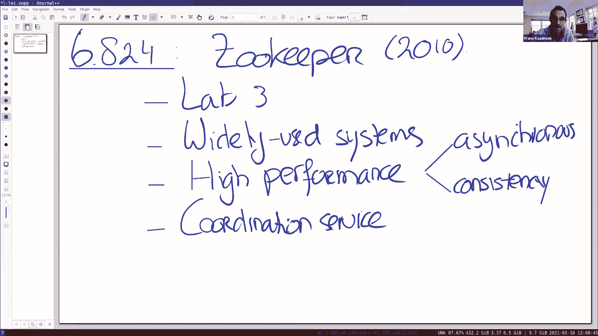

像往常一样，你可以随时打断我，或者在聊天中发布一些东西，让我来调出聊天。好的，我们从 zookeeper 的基础开始，复制状态机，像我们所看到的复制状态机一样。所以，让我们来画一个通常的图。

我们有一些服务器，在这种情况下，它将是 zookeeper ZK 。它接收来自客户端的请求，创建 znode ，它分发这些操作的方式，它有一个独立的库，把这个想象成跟 raft 库类似，在他们的情况下。

它被称为 ZAB 。基本上，领导者把操作放入，相当于 raft 库的地方，与其他库或其他节点进行交互，这创建一个日志，通过所有这些操作和这些机器，然后操作的日志返回给[]，在我们的示例中。

通过 apply channel 给服务，服务应用该操作以响应客户端，所以，我们有不同的[]在运行。到目前为止，在实验里，主要专注于，实验 2 是关于这一部分，在我们的示例中，实现 raft 。

而不是 ZAB ，从一个很高的级别来看，你可以把 ZAB 当成另一个 raft ，提供类似的保证，但是实现方式不同，它提供了所有操作的顺序，[]故障，网络分区等等，不会有脑裂的问题。

都是与 raft 库联系在一起的东西。我们在实验 3 要关注的是，在它上面实现一个服务，这篇论文讨论的了 zookeeper 协调服务，我们将在实验 3 中实现键值存储，数据结构只是从键到值的映射。

所以我们在那里支持的操作是 put 和 get ，所以客户端可能发送 put get 操作给服务，服务通过 raft 运行，然后将它们逐个应用到键值存储。在 zookeeper 中，结构略有不同。

这里有一个 znode 组成的树，但基本的操作是应用相同的，下层的 ZAB 库，ZAB 库对所有操作进行排序，以相同的顺序应用到所有的副本，因为它们都以相同的顺序应用，没有非确定性的（操作）。

每个副本上的结果状态将是相同的。好的？这是这篇论文的基本背景，也是它们之间的关系，实验 3 和 zookeeper 服务之间的（关系）。在这节课中，主要讨论的是，关注 zookeeper 本身。

不讨论 ZAB ，因为你会认为，它和我们在实验 2 做的事情很相似。

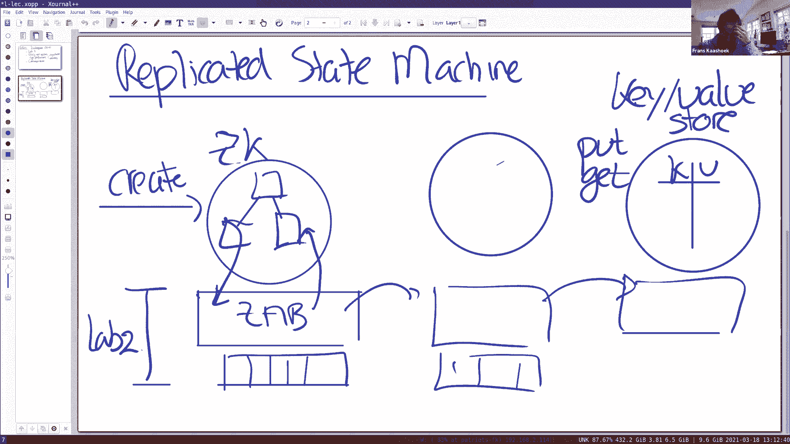

好的，我们稍微谈谈，你会看到什么样的性能，如果完成实验 3 ，并且测量每秒通过的 put 或 get 操作，因为这篇论文的一个成功就是高性能。所以让我们稍微想一想，我们假设有一个 put 操作进来。

并且 put 操作是由领导者进来的，所以我们选择正常的情况，比如标准的情况，一切都正常，没有网络故障，分区，没有任何事情，一切都很完美。这是领导者，我们有两个跟随者。现在可能协议[完全地]。

第一件事当然是，领导者调用 start ，start 写入 put 操作到领导者的日志，然后领导者将它的日志传播给其他跟随者，在它并行发生前，发送那个参数，让我稍微重画一下。

它几乎同时向不同的跟随者发出一系列 RPC ，当然，每个跟随者将条目附加到它的日志中，所以需要向持久存储写入，这里也是一样的，然后它们会做出响应。所以这是响应，在这种情况下，大多数都做出了响应。

领导者可以接受操作，领导者在这里对[]应用操作，执行 put 并将响应发送回客户端。令人好奇的是，我们每秒能得到多少次 put ，在这个背景下。考虑一下，当你做[]估算，我们并不关心确切的数字。

但是一次往返，我们至少需要一次往返才能找到大多数，领导者需要与至少一个访问跟随者以保持多数，所以，我们至少需要一条往返消息。然后，你需要看对稳定存储的写入，因为那些往往很昂贵，在这种情况下，我们会看到。

我们将有两次写入，因为会有一个写入到领导者，一次写入到跟随者，在这一点上，我们至少有两个节点具有副本，所以那个消息将会提交，如果没有更多故障，所以至少我们需要 2 次写入。所以这是你能做的最好的。

在我们在这里讨论的这个简单的方案中，在某种程度上，我们可以考虑成本是多少，在一个往返中，也许这些运行在数据中心，网络不通过互联网，这个可以降到 1 毫秒，我们大概在附近 1 毫秒，可能会快一点。

但我们并不关心，只是使用 1 毫秒。我们将行两次写入到稳定存储，写入稳定存储似乎很昂贵，取决于使用什么介质和什么技术来做稳定存储，假设我们使用固态硬盘，这是很典型的，那么可能一次顺序写入需要 2 毫秒。

我们必须确保写入最终会在固态硬盘，所以，我们可能必须进行同步写入，所以这意味着一次写入需要 2 毫秒，所以两次写入大约是 4 毫秒。所以我们结束了，将有 5 毫秒。那么，每秒有多少次操作？

只是想看看有没有人还醒着。200 。是的，所以每秒会有 200 次 put 。对这个有什么问题吗，能理解吗？好的，现在让我们来看看 zookeeper 。写入的往返是什么，抱歉，我错过了。写入没有往返。

有一个往返，领导者访问跟随者，以及两个写入，一个是在领导的稳定存储，一个是在跟随者的稳定存储，两次写入最终是 4 ，往返大约 1 毫秒，所以一次 put 的总计是 5 毫秒。

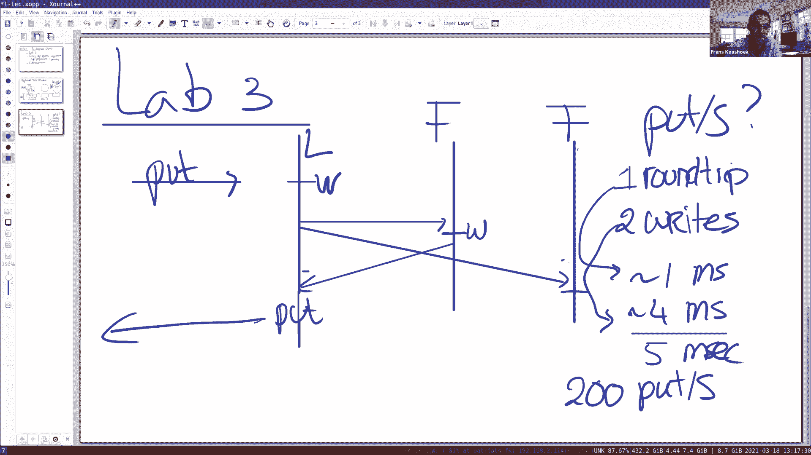

好的，让我们来看看 zookeeper ，再说一次，论文感兴趣的指标是吞吐量指标，你有很多客户端，它们发出很多请求到 zookeeper ，并积极地[输送]它们。让我们来看看结果是什么。

所以让我拿出论文的图。

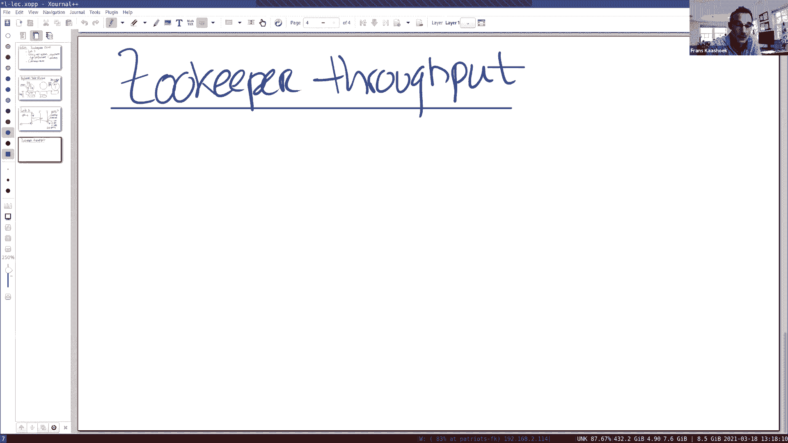

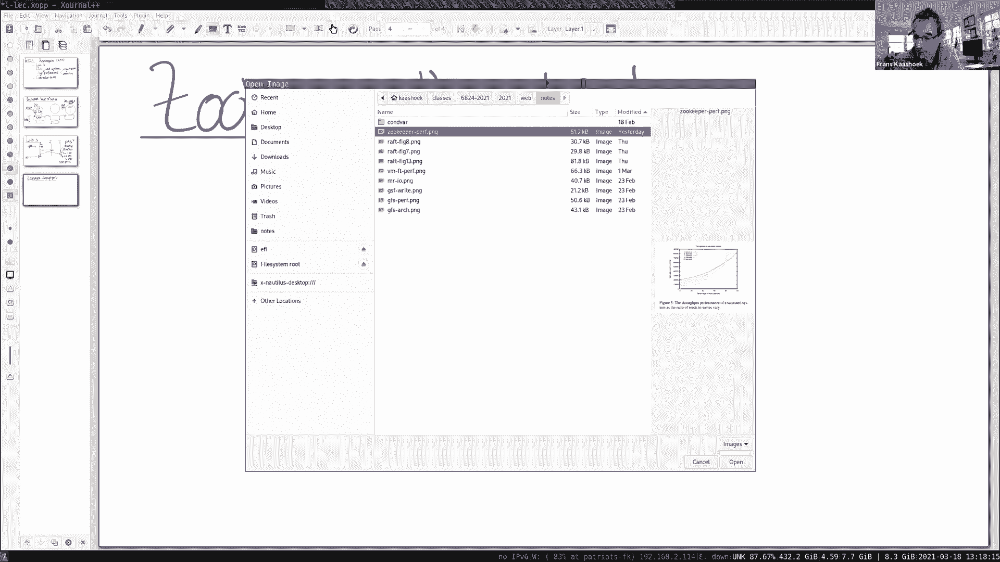

稍微看一下论文，这张图。

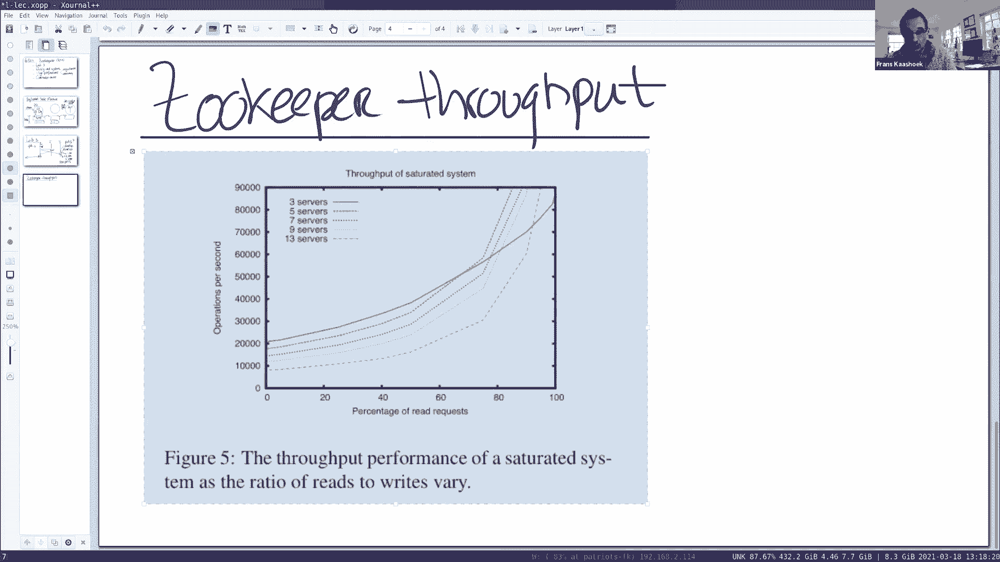

有几件事应该是要注意的，x 轴上是读请求百分比，我们很快会看到，区分读操作或写操作非常重要，写操作是修改的操作，任何写操作都会修改状态，读操作是完全不修改状态的操作，在我们实验的三个术语中。

put 是写操作，get 是读操作。在 y 轴上是每秒的操作次数，让我们来看看 3 台服务器的情况，你注意到的第一件事是没有读，只有写操作，它会修改状态，我们得到大约每秒 21k 次操作的吞吐量。

如果系统只有读，它得到了更多，到达 60-70 的区域，实际上发生的是，读次数，读吞吐量与服务器数量成正比。所以，如果你有 3 台服务器，你可以得到一台服务器的读性能的 3 倍，如果你有 5 台服务器。

你可以得到一台服务器的读性能的 5 倍。当然对于写不是这样的，如果你看这张图，你可以看到，如果有更多的服务器，写入性能实际上会下降。这样的原因大概是，领导者必须访问更多服务器，让操作可以通过。所以。

当我们只进行写操作时，我们是有限的，我们不能期望比单台服务器更高的性能，实际上，增加服务器将降低性能。所以，这个 21k 每秒，即使对于单台（服务器），对于配置 3 台服务器的写操作。

是一个令人印象深刻的数字，比我们在实验 3 中的简单[]要高得多，实验 3 完全不会靠近这个数字。所以我们想要了解，你想在这个设计中看到，设计者做了什么，获得这样的性能。我之前提到的，有两个关键的想法。

1 ，任何东西都是异步的，或者客户端可以一次向 zookeeper 提交多个操作，它们排队，考虑 zookeeper 客户端的方式，说，请开始执行这个 put ，但是不等待 put 的响应。

直接发送第二个 put ，然后是第三个，第四个，第五个，比如，很多 put 放在一起，也许只有一条消息传递给领导者，领导者将同时应用所有它们，事实上，领导者只向持久久存储写入一次，对于批量的操作，所以。

不是每个操作一次写入，而是多个操作一次磁盘写入，这是一个原因，他们在写入操作上获得非常好的性能。第二件事是，他们为读操作做了一些特殊的事情，他们允许读操作在任何服务器处理。所以。

不是通过领导者来执行所有的操作，他们允许任何服务器处理操作。所以。我们想要更多地谈论它。

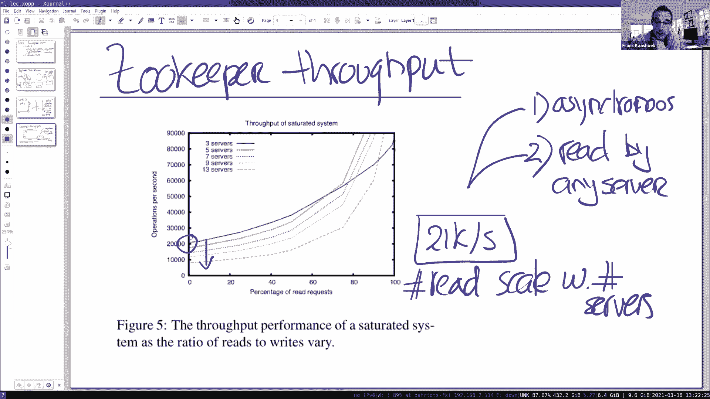

我想我们可以做些类似的事情，比如，我们想要在实验 3 中做的，我们做相同的事，这里我们想要的是，从任何机器或任何节点读取。所以，图片如下所示，我们有一个领导者，我们有两个跟随者。

我们使用 3 个节点的情况，我们有一个客户端。我们考虑可能发生的事情，如果我们遵循这个策略，我们将从任何地方阅读，我们使用客户端，领导者当我们执行 put 时，它们都通过领导者，客户端执行读取。

假设这个 put 已经完成，与此同时，几乎在 put 完成时，客户端发出一个 get ，并访问任意一个跟随者，我们使用这个，它没有访问领导者，然后跟随者回应，问题是， get 观察到的值是什么。

那么客户端可能得到的值是什么，比如，我们读取键 x ，x 的初始值是 0 ，而这个 put 使 x 变为 1 。那么 x 返回的值是什么，如果我们不做任何特别的事情。所以有一个关于设置的问题。

所以如果我们假设 raft 是这里的基础设施，而 get 是另一个命令，那么跟随者会不会将应用重定向到领导者，put 或 get 请求到领导者。不，[]，我们可以做的事情很多。

但我们想要获得这种完美的可扩展性，所以，为了获得完美的可扩展性，对于读操作，跟随者不能访问领导者，所以读操作是由单个跟随者直接执行的，没有沟通，我们获得完美的可扩展性。所以，这里甚至没有通信。是的。

我只是在按计划行事，我们的目标是获得完美的可扩展性，就像 zookeeper 所做的，我们想要理解的这是困难的还是容易的，或者这到底是什么意思，所以，首先要做的是，领导者和跟随者什么都不做。

跟随者执行读操作并返回值。什么能，所以另一个问题是，这张图中，客户端可以观察到什么值。可以是任何一种，因为可能你执行 put ，然后它们会通过领导者的磁盘。是的，它可以是任何一种，所以要么返回 0 。

要么返回 1 。所以它可能返回过时的数据。假设我们做，假设返回 1 ，对于[]实验，这个 get 返回 1 ，然后客户端执行另一个 get ，现在 get 会得到什么，但是，我们可以看到什么值。

对这个 get 的回应。假设没有其他写入，这应该是 1 ，对吧。是的，不幸的是，因为我有 3 台服务器，如果我有 5 台服务器呢？为什么会不同？好的，我们让它不同。所以肯定会返回 1 ，我们同意。

因为如果跟随者响应第二个 get 请求，访问一个看到过 put 操作的跟随者，它们中的大多数都看到过 put 操作，我们会到到 1 ，对吧。真正的问题是，它能不能看到 0 。

尽管它早些时候观察到了 1 。我想你可以看到 0 ，即使在 3 台服务器的情况下，因为假设你拥有大多数服务器。让我来做前 5 个的情况，因为它更容易看到。我们是否假设客户端总是请求相同的节点？不。

可能会有一小段时间的网络分区或断线，所以你不需要访问上次一样的节点，对吧。是的，所以在这种情况下，它可以访问不同的节点，那个节点可能返回 0 。所以，这是可能的，所以我们会有一些奇怪的行为，在这配置中。

你可能会看到最近的，在第一种情况下，我们可能会看到最近的值，然后我们读到一些过去的东西。是的。所以我们没做什么特别的事，只是天真地从任何节点读取，我们有两种不同[类型]的问题。

get 可以返回过时的数据，get 返回过去的数据。所以。抱歉，这不是 3 个跟随者也可能的吗，因为大多数是领导者和一个跟随者，你可以访问另一个（跟随者）。如果你见过那个，是的，这绝对是有可能的。

3 个也是可能的，我认为 5 要更清楚，这是可能的。

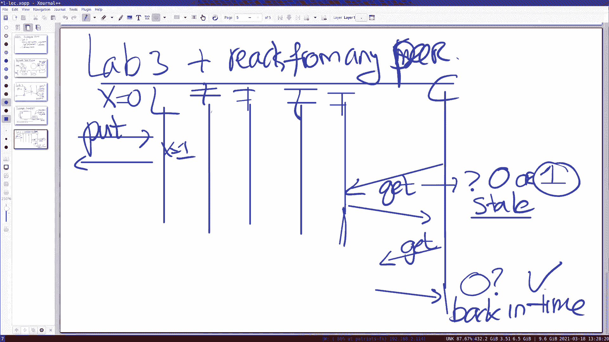

好的，所以。所以，现在我们要回去，稍微考虑一下这种行为。

返回那些值，可以吗？

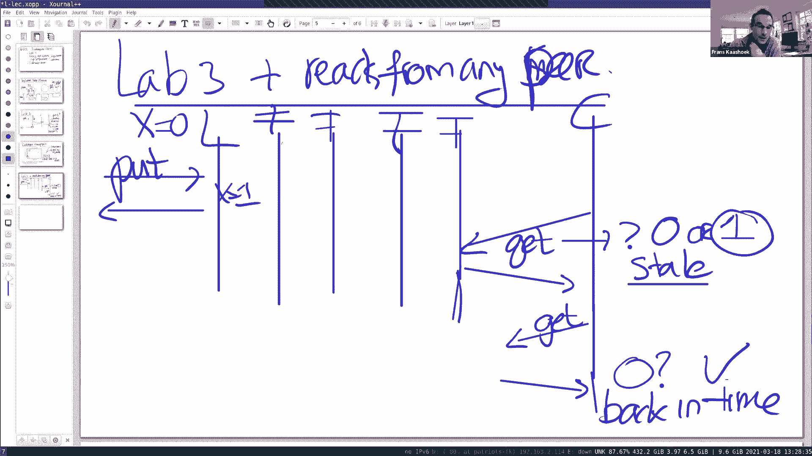

这是一个非常有趣的问题，这取决于你说的正确是什么意思。如果某件事是正确的，取决于我们的正确定义是什么。我们所说的正确性的定义，在学期开始的前几节课中，是线性一致性的概念。它的意思是。

我在一周前谈过这件事，行为像一台机器，这是我们从学期开始一直使用的直觉，但是线性一致性的定义要更精确一点，试图确定像一台机器是什么意思，所以，当某个东西表现得像一台机器时，首先，必须是这样的情况。

即使操作实际上同时进行，你可以按整体顺序对它们进行排序，所以，可以构建所有操作的整体顺序，因为归根结底，这是一台机器，它的行为像一台机器，只有一台机器，虚拟机器可以以整体顺序执行操作。

关于整体顺序有一些属性是真的。所以，一个必须为真的属性是，顺序与真实时间匹配，真实时间我的意思是，如果操作在另一个开始前完成，那么，在整体顺序中，第一个操作必须在第二个操作之前。然后是第三个属性。

读操作返回最后写入的值。这是线性一致性的官方定义，你可以认为这是，一种更精确的定义，更准确的表述，对于第一个直觉，也就是整个行为像一台机器。

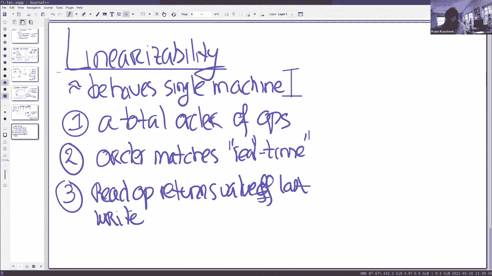

现在我们回来，想一下这种场景，刚才在白板上的，也就是两种情况，过时的数据和时间回退。

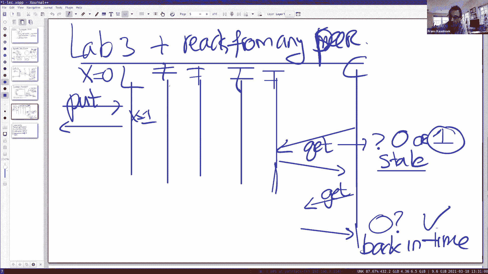

想想线性一致性是否允许它们。所以，我们首先关注第一个问题，所以我们有一个客户端 1 ，你把它画出来的方式，合理的线性一致性是，你可以使用这种形式画一张图，左边是操作的开始。

右边是对执行操作的客户端的确认，在这种情况下，比如 put 到 x ， put 值 1 。然后我们有另一个客户端或者同一个客户端，我们画其他客户端，执行读取，读取在 put 操作之后很久才开始。

有一个 get x ，我们有一种情况，get 返回 0 ，这是第一种可能性。这就是上一张白板发生的事情，现在我们想考虑一下，这种执行是线性一致性允许的吗，这是我们正在寻找的正确性的定义。

然后我们看这个执行，实际发生的操作的顺序，至少我们看这在实践中是可能的，这是线性一致性允许的吗，是不是我们的正确性标准。这是线性一致性允许的吗？不是。不，为什么不是？

因为 C2 操作是在 C1 完成之后开始的，所以在整体顺序中，你有 put x 1 ，所以 get x 必须是 1 ，因为它应该读取最后一次写入。是的，所以在构建的整体顺序中，这个（操作）。

这个操作必须在那个操作之后，因为它开始得比较晚。你可以看到，这违反了规则 3 ，操作返回最后一次写入的值，实际上并不是这样，返回的是前面的值，所以这是不可线性化的。这能理解吗？当然。

这完全符合我们的直觉，因为任何一台机器都不可能发生，你写入一个值到一台机器，然后你再读取，它肯定不是其他值，而是之前的值，所以这是不允许的。好的，让我们再看另一个示例，所以我们又有了一个客户端 1 。

只是 put ，画得更紧凑一点，因为我没有太多的空间。我们执行一个 put ，然后我们做，一个读取或 get ，get 返回 1 ，所以我们不是在第一种情况下，而是第二个，另一个案例中，然后。

我们 get 得到 0 。

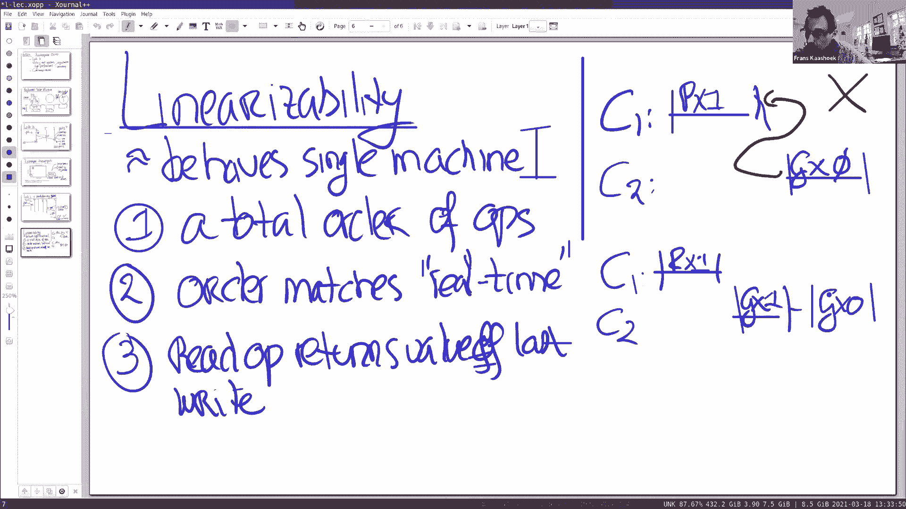

这是我们看到的第二种情况，在这张图片中，时间倒流的情况。

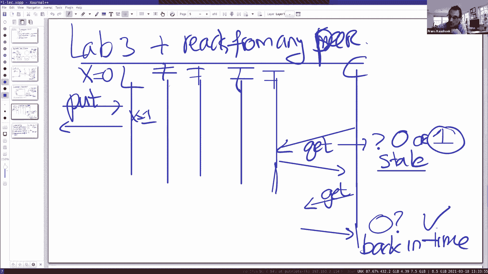

我们再次问自己同样的问题，它是否是线性一致性所允许的？不是，因为 read 不是返回最后一次写入的值。是的，这是相当直截的观察，不是那种情况，事实上，与第一种情况类似，因为这些操作必须按这个顺序进行。

但这是不可能发生的，这违反了规则 3 。好的，这给了你关于线性一致性含义的感觉。

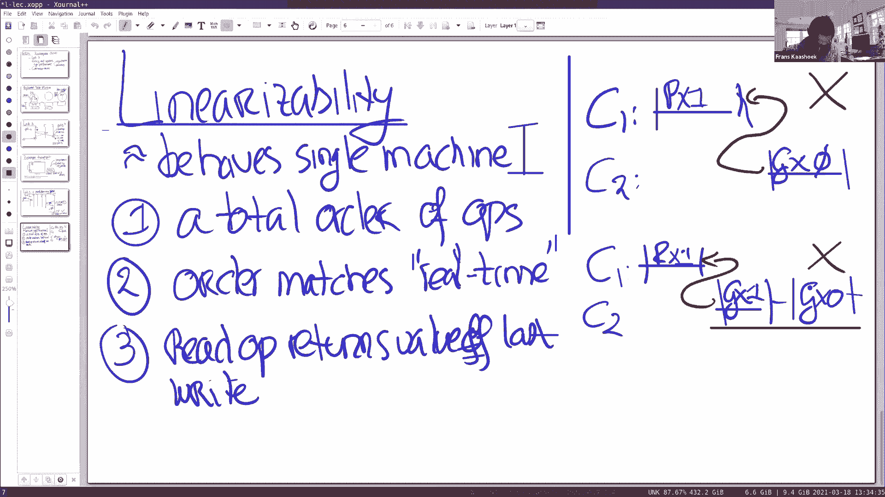

你如何考虑它，基本上，如果我们不做任何特别的事情，我们做这个天真的方案，如果你在实现实验 3 ，你遵循这个天真的方案，那么你不会通过测试，因为测试假设或实验 3 的目标是。

对 put 和 get 提供线性一致性。所以像这样的场景是不允许的，你的实现必须以一种方式，这些结果不会出现。

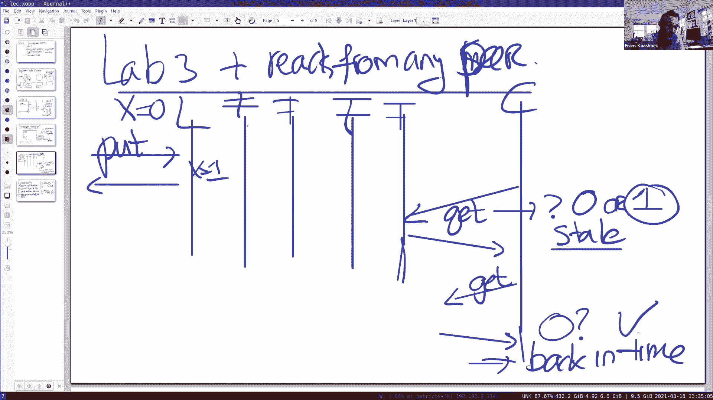

这能理解吗？所以我们要做实验 3 是关于线性一致性的尝试，什么是获得线性一致性的简单方法，我们如何确保 put 或 get 操作是可线性化的。

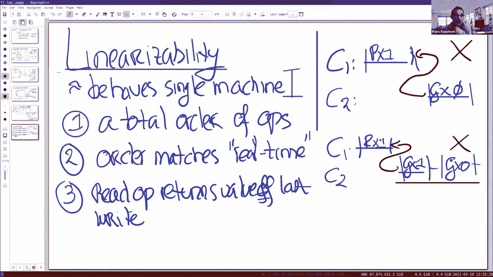

我的意思是，如果你真的用一台机器，那么它就是可线性化的，对吧。是的，那么什么是简单的解决方案，我们所有读取都通过领导者运行。所以，获得线性一致性的简单解决方案。

事实上，这就是我们在实验室 3 中要做的事情，实验 3 要做的是，读取或 get 操作操作要通过日志，通过 raft ，正如你所观察到的，如果它们都通过一台机器，它们可能不是通过一台机器。

领导者可能会随着时间而改变，我们知道领导者总是有整体顺序，日志是有整体顺序的，所以我们能够构建一个整体顺序，顺序与真实时间匹配，每个读取的返回值是最后一次写入的。因为 raft 协议将保证。

日志中的所有条目都是按整体顺序排列的。当然 raft 协议做了大量的工作，才能真正实现这一切，尽管网络故障，尽管网络分裂，raft 协议会保证我们，所有的操作都是按整体顺序进行。事实上。

整个复制状态机方法都是基于这个想法的，所有操作在一个整体顺序中，并以相同的顺序在所有节点应用，结果，看起来像一台机器。所以，解决这个问题的简单方法就是，通过领导者运行所有读取，无论领导者在哪个时间点。

这会给我们线性一致性。让我暂停一下，有什么问题吗？抱歉，匹配真实时间是意味着，如果操作 1 在操作 2 开始之前结束，那么 1 在 2 前面。是的，对于 raft ，你会看到这是自动发生的。

因为如果操作完全结束，肯定是这种情况，领导者响应给一个客户端，如果客户端开始操作较晚，一定在领导者的日志中较晚。所以这是[真的]。而且，只是确认一下，也许重复了，在实验 3 中。

所有客户端请求都是同步的？是的，确实是。好的，很好，所以，[]所说的这个方案，我们回去，如果你很仔细地看 raft 论文，有一个针对只读操作的优化，但这个优化，也需要一些通信。所以。

如果我们遵循这个天真的（想法），这个方案的[技巧]来获得线性一致性。这对性能意味着什么，往回考虑一下对比 zookeeper ，比如，读操作的数量是否随着服务器数量的增加而增加？不。

因为现在所有的东西都要经过领导者。没错，所有东西也要通过领导者，所以我们再一次，这不是我们希望的。所以它给了你一个即时的问题是，这怎么可能，当你使用 zookeeper 时。

zookeeper 有很好的性能，因为我们看到的这个简单方案并不起作用，或者至少违反了线性一致性。

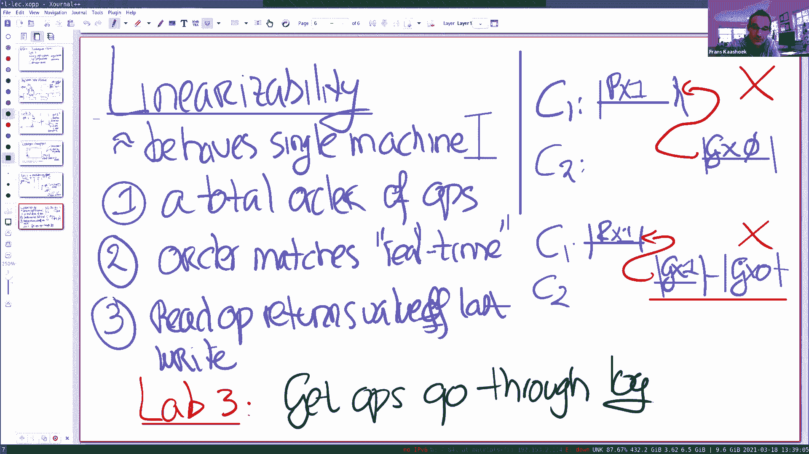

所以我们想讨论一下，理解 zookeeper 是如何做到的。所以首先要注意的是，可能是最重要的部分，就是 zookeeper 没有提供线性一致性，它改变了正确性的定义。所以 zookeeper 服务。

它的行为不像一台机器一样，它会产生在一台机器永远不会发生的结果。所以，它是什么，它提供了什么。它提供了线性化的写入，所以所有的写入操作都要通过领导者，通过日志，以相同的顺序写入到每个节点的日志中，所以。

它们也将以相同的顺序应用，所以我们仍然有这个复制状态机方案，应用所有写入操作，（应用）修改数据的操作以一个整体顺序。但是，它还有几个特性。但是它不提供读取的线性一致性，而是提供了两种不同属性。

所有操作以 FIFO 客户端顺序出现，这在一定程度上与异步有关，客户端可能会一个接一个地提交多个请求，而不等待回复。zookeeper 会保证，如果客户端 1 提交了请求。

然后客户端 1 提交了另一个请求，那么第二个请求将会较晚出现，（第二次）结果会观察到第一次操作的结果。所以，写入使用客户端顺序，然后读取是我们感兴趣的性质，读取观察到最后一次写入，好的。

读取观察到同一客户端的最后一次写入。所以这是有意义的，就像读取你自己写的东西，如果你执行写入操作，你立即执行读取操作，你至少可以看到自己写入的结果。但是，对于来自其他操作的，来自其他客户端的的写入。

zookeeper 不保证那个[性质]，相反，它所保证的是，读取会观察到日志的某些前缀。这意味着你可以看到旧的数据，可能从一个跟随者读取，那个跟随者有一个日志的前缀，但没有日志中的最新条目。

因为也许稍微落后了一点，尽管如此，跟随者允许返回一个值，因为 zookeeper 唯一保证的事，读取可以观察到日志的前缀。所以现在操作可以不按顺序进行，一旦它们在日志中，你不能，读取操作可以不按顺序。

它真的是一个日志的前缀。然后还有第二个要求，你不能从过去读取，这意味着如果你看到了前缀 1 ，然后你发出读取前缀 1 ，然后你执行第二次读取，那么第二次读取必须至少看到前缀 1 或更多。

它可能只是前缀 1 ，但不能回到过去，所以它不能看到比前缀 1 更小的前缀。所以这个。

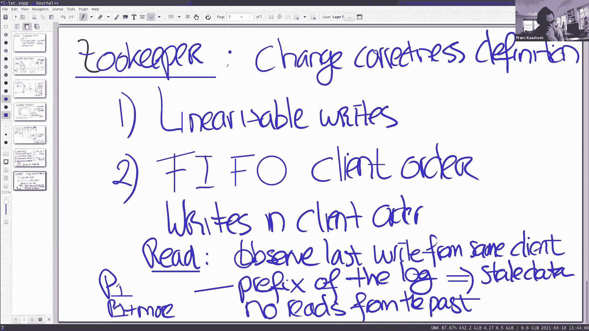

所以如果我们看回这张图，在某些情况下， zookeeper 允许这样做，也就是说，如果两个客户端不同，但它不允许这样，你永远不能回到过去。

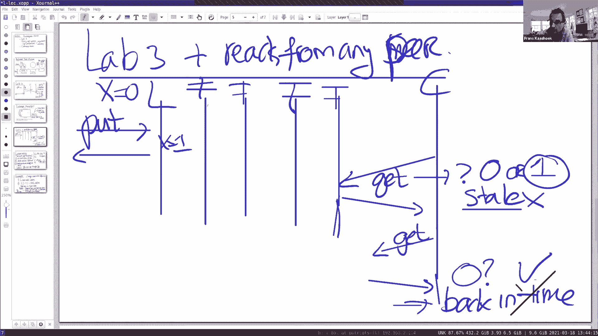

好的？所以我有一个概念性的问题，所以我们有两个一致性保证，可线性化写入和 FIFO 客户端顺序，如果我们暂时忽略第二个约束，如果我们只关注第一个问题，可线性化写入的定义真的有意义吗，因为线性化的定义。

取决于具有读操作和写操作。稍等一下，因为，他们定义可线性化写入的方式，不是写入在整体顺序，但是在读取和写入之间存在关系，所以稍等一下，我们会回来，我们马上就到了。

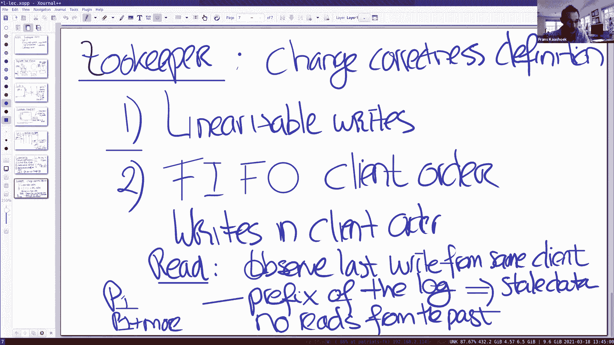

比如一个幻灯片，我想再说一个幻灯片，好吗？听起来不错。好的，就像，让我们来看看，zookeeper 是如何提供这些保证的。凭直觉来看，你如何实现这个，论文没有非常明确地说明他们是如何实现这个的。

我会给你们一个大概最好的猜测。所以，这是一个 zookeeper 客户端，它在客户端机器上运行，在实验 3 中，我们称它为 clerk ，所以这是一个软件库的部分，与服务进行协作。

在 zookeeper 论文术语中，它是有个 session 的东西，所以，当你加入时，当客户端想要连接 zookeeper 服务时，它会创建了一个 session 。

它使用 session 信息连接到领导者，并在整个 session 期间维护状态。所以我们在 zookeeper 中有一个领导者，还有跟随者，基本上这有些相似，与我们在实验 2 中所做的。

zookeeper 客户端发出一个写入到领导者，因为写入是可线性化的，事实上，写入基本上遵循，与 raft 库中大致相同的策略，所以，会有一个日志，在日志中，所有写入都会被记录到插槽中。

假设领导者将写入放到这个索引中，所以这有一个索引，在论文中，他们将这个索引称为 zxid ，所以，我认为你可以将 zxid 视为日志中的索引。当领导者提交时，一个条目写入到日志中。

它将 zxid 返回给客户端，所以，客户端维护该状态，所以与 session 相关联的是上次写入时的 zxid 。好的？当客户端稍后读取时，读取不一定要到领导者，因为这是获得更高性能的目标，所以。

读取可能会到其中一个跟随者，但是，读取将使用 zxid 标记，那个客户端上次写入完成的（zxid）。那么这意味着什么，好的，假设这个在后面，它有两个条目，但还没有观察到那个写入。

因为领导者可能通过其他跟随者提交它。在这种情况下发生的是，这个跟随者的读取不会立即返回，而是等待相同的 zxid ，一旦我们看到了 zxid ，它会做出回应。当然还会有另一个客户端，也许在某个时候。

这个写入会通过，可能那个客户端会执行另一个读取，所以它没有看到过其他的 zxid ，让我再画一个跟随者，假设这里有另一个跟随者，它还没有观察到最后一次写入，让我。所以还会有另一个，假设还有另一个客户端。

它执行其他一些写入，这是我想要谈论的情景，还有另一个客户端将 w 附加在 cxid 之后，就在这里，但还没有观察到那个写入，我们在这里的，我们有两个插槽，我们要写入。

但是绿色文字还没有出现在这个跟随者上，所以，如果客户端现在发出第二个读取，也许它会传给另一个跟随者，这是相同的 zxid ，因为它没有看到任何新的，那么客户端没有发出任何新的写入，它会到达那里。

而那个（跟随者）允许立即做出回应，因为它已经看到了[]的 zxid ，已经看到那个客户端的 zxid ，当然，它遗漏了一些写入，来自其他客户端的，已经由大多数服务器处理的，但它不需要返回那个数据。

所以它可以直接返回。所以，这可能返回旧的值，但这是 zookeeper 正确性保证定义所允许的。教授，我有个问题。好的。首先，我想，我不确定，但是，我知道客户端读取， session 读取是有粘性的。

所以通常它们会去一样的（节点）。是的，但是，当然可能会有一点，可能有一个快速网络分区或类似的事情，所以在这中间，它可能已经切换到另一台服务器。好的，然后。另外， zookeeper 做了一些负载均衡。

但是无论如何，这是会发生的。是的。另一件事是，你说写入总是到领导者，然后领导者用 zxid 回应，是不是领导者在回应之前必须先达成共识，或者类似。好的，我想是的，它提交了，否则就没有提交。

我认为确切的协议，我在协议的细节上做了一点抽象，我只是大概描述一下它是如何工作的。我相信你是对的，它很可能返回，在条目真正提交之后。然后，抱歉，最后一件事，你说过它总是到领导者。

但我认为论文描述它可能会到跟随者，写入到跟随者，然后读取。但是最后回到领导者，对吧，所以最终会到领导者。谢谢。好的。只是确认一下，当你说等待 zxid 时，比如第二个跟随者，当我们等待 zxid 时。

我们实际上是在等待它被提交，仅仅[]是不够的。是的，它必须被提交。明白了。等等，但是，那时它已经提交了，比如一个客户端不会得到一个未提交的 zxid ，像以前一样。哦，是的，但这是正确的。

所以如果这个点，在这点上，跟随者看到 zxid ，写入在这个 zxid ，现在它肯定已经提交了，因为客户端不可能获取那个 zxid ，除非那个 zxid 已经提交。谢谢。另外，你说读取到旧数据。

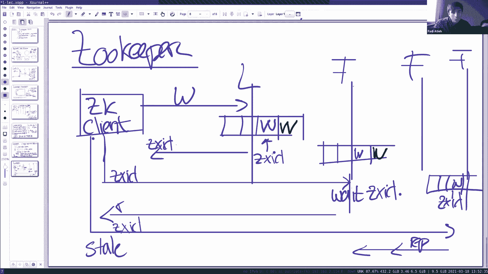

就像最后一个箭头那样，但是在读请求中的客户端，它在提供了这些 zxid ，就像客户端想要日志中的那个位置一样，它以 zxid 为索引，那么它不是故意请求日志特定前缀吗？不是。

但是这个 zxid 实际上说的是，它是时间倒流的计数器，所以，你拥有的 zxid ，作为跟随者，你必须返回到你的结果，至少通过 zxid [结束]了日志的前缀，你可能会有更多，那也没问题。

但至少到 zxid ，这阻止了你读取过去的情况。好的，太棒了，谢谢。好的，所以现在你可能会想，这显然不能提供线性一致性，人们对线性一致性感到兴奋的一个原因是，因为它的行为像一台机器，所以它更容易编程。

你执行 put ，你执行 get ，你大概知道你会得到什么，没有双关的（返回），但在这里，你有一个编程模型，不同于单一的机器。

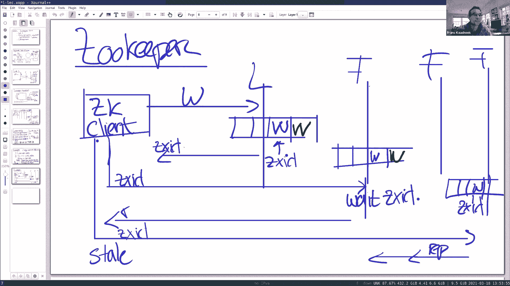

所以，你如何对这个东西进行编程。事实证明。

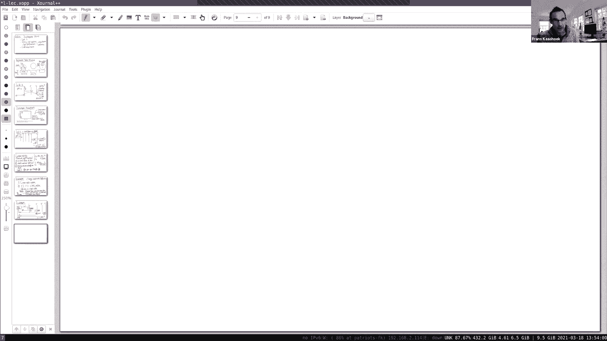

这里的规则，zookeeper 使用的正确性定义，你可以把它想象成，它足够好来达到帮助编程的目的。

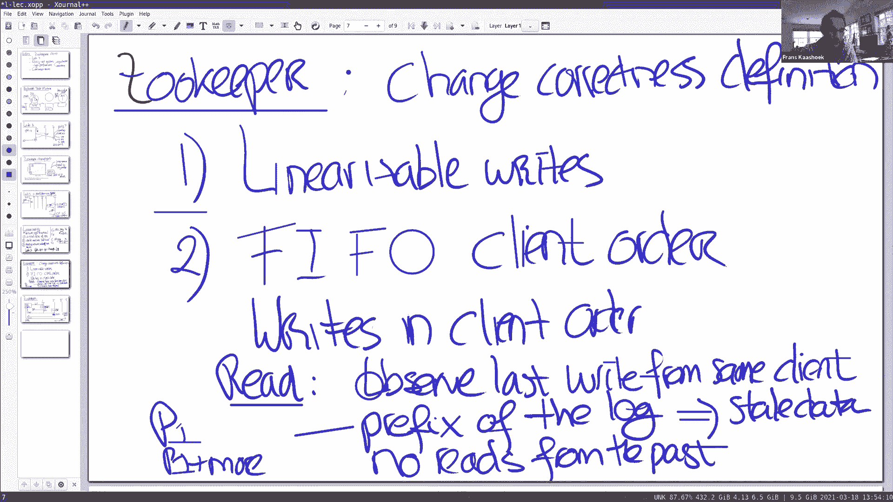

所以，我想谈一谈这一点。所以真正的问题是，有了线性一致性，很明显这有助于编程，以及编写直观的程序，你的想法会有一点不同，我们想要了解，如果事情进展顺利，它是否像[]程序中的[]一样，是完全无法使用的。

所以，让我们来看看这篇论文中提到的一个关键例子。我想做的第一件事是，忽略同步操作，因为你可以通过使用 sync 使每个操作线性化，在你读取之前，但这当然会让一切再次变得缓慢，我们得不到我们的性能。

所以我们想要避免使用 sync ，所以我要忽略 sync ，像我们没有 sync 那样编程。那么让我们来看一下以下操作，所以这是写入的顺序，一些操作，这是准备好的 ready 文件。

我们发出对 ready 文件的 delete ，比如说，这是一个新的 master ，成为新的领导者，所以需要在里面写入一个配置信息，比如谁是复制状态机的一部分，以及谁是领导者，所以它写入一些配置文件。

write f1 ， write f2 ，然后 create ready ，然后其他跟随者，其他可能是读取顺序，它们可以调用 exists ready ，所以 zookeeper 执行 exists 。

如果 ready 已经存在，那么这会是 true ，否则不是，你必须等待，所以让我们暂时忽略这个案例，假设第二个客户端，这是一个客户端执行写入操作，第二个客户端执行读取操作，如果它存在，然后。

客户端读取 f1 ，然后读取 f2 。所以我们想要了解的事情，f1 这个 read 可以返回什么值。我们考虑的事情是，它可能会返回之前写入的结果，比这里还早的（写入），或者必须注意到这个写入。

我想论文中提到了，读取可以 watch 某些内容，并在变化时得到通知。是的，我们假设文件确实存在，所以 create 是立即成功的，我们稍后再来讨论通知。所以这个 exists 立即返回。

没有使用 watch ，只是使用 exists ，然后第二个客户端执行读取 f1 。我认为它应该读取第一个客户端写的东西，因为操作是按 FIFO 顺序进行的。是的，所以我认为真正的事情。

如果我们看到了这个值，对于前面的写入，这意味着我们在回到过去，对吧。这是不允许的，规则是禁止的，这个读取必须观察到这个写入的值，因为这个 read 前的 exists 观察到这个写入。

所以我们知道这个 exists id，一定看到了这个 create 对应的 zxid ，也就是说，这个读取操作必须看到最后一次写入操作，这是按照总的顺序进行的，执行这个 create 。

所以最后一个写入的关键顺序，在它之前是这个写入，因为所有写入都是线性化的。所以，必须是这种情况，这个 read f1 观察到 write f1 的结果。所以这很好，对吧。

因为如果某个新领导着成为了 primary ，得到一个配置文件，我们肯定知道，我们将会看到最新的配置文件，由新领导者创建的。所以我们在这里看到了一个例子，这些规则是经过精心挑选的，一些你可能关心的事情。

如果你编写一个配置服务器，那么它确实是可行的。抱歉，我之前可能没听懂你在说什么，但在这种情况下，如果它存在，如果检查 exists ready 。

read stuff 不能在 delete ready 之前吗？好的，所有写入都是按整体顺序的，这些写入按整体顺序，那个写入按整体顺序，那个 create 按整体顺序。

所以这个在另一边的 read 观察到那个 create ，所以不管 read 要做什么，往回走，在整体顺序中，在整体顺序中观察到的最后一次写入，而最后写入 f1 就是这个。但是 exists 是写入吗？

不， exists 是读取，但是 exists 观察到了这个写入。哦，你是说。你不能读取回到过去，对吧，那是总的目标。是的，但我们怎么知道它观察到了，那个 exists 。我告诉你，我说就像文件存在。

所以，它一定是观察到了，exists 会返回 true 。但是它存在在删除它之前，是吧。是的，但是，好的，我们一会儿回去，好的，这是第二种情况，这是很好的观点，让我来谈谈这一点，所以还有另一种情况。

我想这就是你所担心的可能会发生的事情，这就是通知的作用。所以至少同意这是对的，是不。

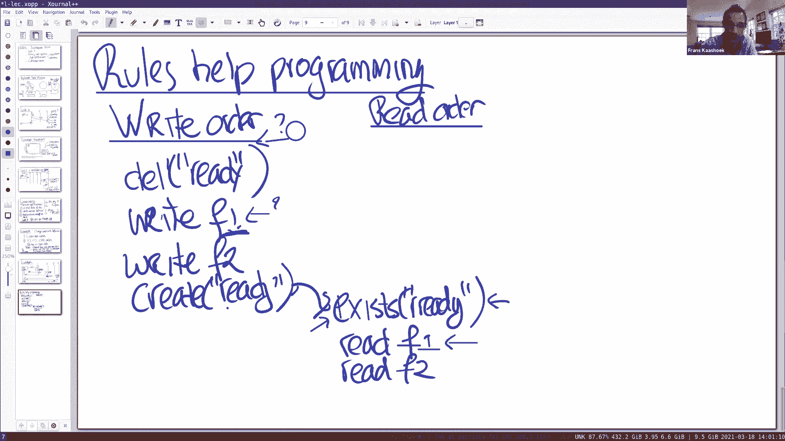

所以第二种情况，更多规则，这是很有趣的。我认为你所担心的情况是，这是我们的读取者，这是我们的写入者，读取者调用 exists ready ，除非文件在那里，执行 read f1 。好的。

我们几乎和上一个场景一样，现在，领导权发生了变化，这里有一个崩溃，恢复，所以这类事情发生，所以有一个新的 primary ，它执行 delete ready ，write f1 和 write f2 。

它像以前一样 create ready 。我们假设这个读取有一点延迟，这台机器上还发生了其他事情，现在执行 read f2 。我想这就是你所问的问题，因为这是[]的事，因为现在有了配置变化。

如果这个配置更改在中间被[淹没]，这个 read f2 会返回新的配置，相反， read f1 会返回旧的配置，显然事情会变得一团糟，这不是我们想要的情景，所以结果很糟糕。那么，这是如何得到纠正的。

或者 zookeeper 是如何处理这件事的。好的，这就是 watch 的用处，我在之前的白板上画的并不完全正确，除了调用 exists ready ，还要设置 watch 为 true 。这意味着。

这个 delete 修改 ready 文件，我们现在设置了 watch 在 ready 文件上，所以，当 ready 文件被该新的 primary 删除时，这会导致一个通知。这个通知有一条规则。

通知的规则是，每个通知都在它之后的 write 之前发送。那么情况会是，这个通知将在 write f1 之前发送。所以，这里有两种情况，如果通知在这里发送，或者通知在 read f2 之后发送。

让我把 read f1 往上移一点，或者是的，所以，它仍然发生，从时间上来说，在 write 操作之后，但根据延误情况，通知在这里送达，或者它会在这里送达。抱歉，允许这种情况发生的具体规定是什么？

基本上，我认为一种方式来考虑它，通知就像是一个写入操作，跟随者实现了，如果发生改变， delete 通知发出，通知会和 zxid 一起发送给客户端。是的，但我还是不明白为什么这能保证，它能到达之前。

等等，所以它的有效位置是，在 write f1 之前，也可以在 write f2 之后，对吗？通知在 delete ready 之后发送，并且在写入之前，在写入 f1 和 f2 之前。

或者在 create 。哦，我明白了。这只是一个规则， zookeeper 必须保证这一点。好的。好的，所以这意味着有两种情况，通知发送，在 read f1 之前或 read f1 之后。

如果它在 read f2 之后发送，会有问题吗？没有。没有，因为读操作就发生在写操作之前。所以一切都很好，这整个块都发生在 read f2 之后，是可以的，那么在这里呢？教授。

你是说 watch 就像写入某些东西吗？你可以考虑一下，watch 不是写操作，我并不是想表示这个，watch 执行使用合适的 zxid ，与这个修改有关。这些是本地的，对吗， watch 。是的。

 watch 是本地的，当它们在执行时，保证它们发生在写入时，当观察到写入，或者客户端发现[]，watch 传播 zxid 到客户端，并确保执行它。谢谢。再说一次，论文有点模糊，关于它是如何实现的。

但你可以想象不同的情景，但重要的是这些规则是保证的。好的，那么如果通知送到这里，会发生什么？客户端正在运行，exists ， read f1 ，现在通知来了。那么，你可能必须重新启动。是的。

你必须重新启动。好的？所以我们在这里看到的是，这个规则肯定会让编程变得更加困难，但并不是不可能，只要稍加小心的编程，理解这些规则，你可以得到想要的结果，可能是应用程序想要的。read f1 发生了什么？

read f1 会发生什么？你得从头开始。包括这一点。是的。好的？

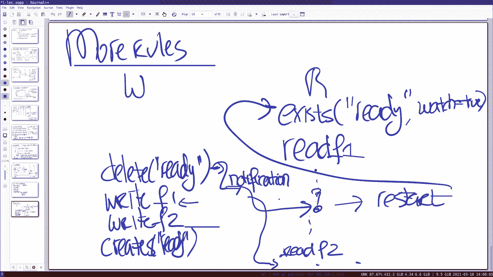

你会发现这是一个技巧，在[]中表现得很明显，就像这个想法，跳出并重新开始。好的，希望这能给你两件事的感觉，尽管人们，人们喜欢线性一致性的一个原因是，因为它非常直观，非常容易编程。

因为每件事都像一台机器一样。但是如果你想要容错，可伸缩性，很难得到好的性能，所以，获得良好性能的一种方法是，在一致性保证上妥协，在这种情况下，对线性一致性妥协，并提供一些其他的一致性保证。

正如我们所看到的，这让用户体验，程序员的体验变得复杂，但是， zookeeper 中的这些规则是经过精心挑选的，所以，事情仍然是可以解决的，它是可行的。所以，它可能获得某种程度上的写入保证。所以。

现在这个编程模型还有另一个方面，然后现在我想谈一谈，这与协调服务部分有关。比如，你需要，一个协调服务指的是什么。一个很好的例子是虚拟机容错论文，我们不久前读过的。

它有这个 test-and-set 操作，test-and-set 操作的目标是，确保没有脑裂，因为会有两个客户端运行，一个会赢得 test-and-set ，而另一个不会。

结果是赢得 test-and-set 的那个，可以得出结论，它会是 primary 。所以，这是一个例子，关于协调服务应该提供的特性。我想让你，让它更具体一点，让我们来考虑一个实验 3 。

你能在实验 3 中获得它吗。

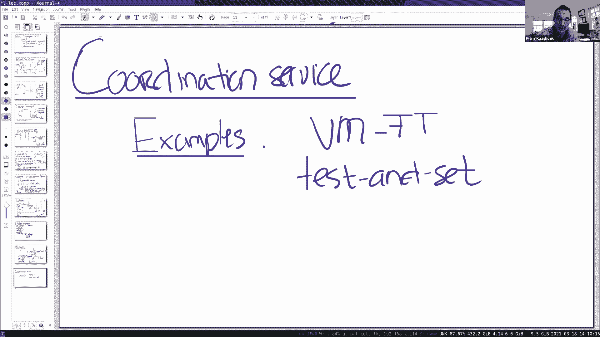

一种 test-and-set 类型的东西。好的，我们来做一个非常简单的案例，假设我们有，这是 test-and-set 的简单实现，在实验 3 中，我们只有 put 和 get 操作，没有其他操作。

这是两个操作，所以你如何编写这个，可能执行 put 到一个 key 中，比如 master ，把我的 IP 地址放进去，调用放的 IP 地址，然后你执行 get 。

我们说如果 get master 等于我的 IP 地址，然后知道作为 master 或者作为领导者。实际上，这是我们天真的实现，我们没有别的选择，因为我们只有 put 和 get 。

这就是我们可以实现这个的方式。这会带来我们想要的结果吗？哦，在 put 和 get 之间没有原子性，所以，也许有些事情发生了变化。对的，所以可以有两个客户端，对吧，两个可以同时执行 put ，然后观察。

大体上，它们可以同时做这件事，而交错涉及到，get 返回它们的 IP 地址，这样我们就得到两个领导者了。当然不是我们想要的，所以这件事的要点是，比如，你只有 put 和 get 。

要实现 test-and-set 是非常困难的。事实证明，这是可能的，但非常复杂，使用 bakery 算法，你可能能做到，但这是可笑的，在分布式系统中这样做，所以， zookeeper 所做的。

它提供了一些额外的帮助，来构建[]原语，我们一会儿会看到。另一件事是你想知道的，实验 3 没有提供任何支持，对你的配置服务或协调服务，你想知道当一些机器宕机时，例如，你想要观察，比如领导者宕机。

一些其他部分需要知道，领导者宕机了，我们就可以在需要的时候选择一个新的，至少在使用服务构建的应用上是这样的。好吧，我们有两个东西是真正想要的，一个是试图使这个获得原子性的方式。

这就是我们在 zookeeper 设计中寻找的，然后我们在 zookeeper 设计中寻找的第二个是，让应用程序了解某个节点是否宕机。

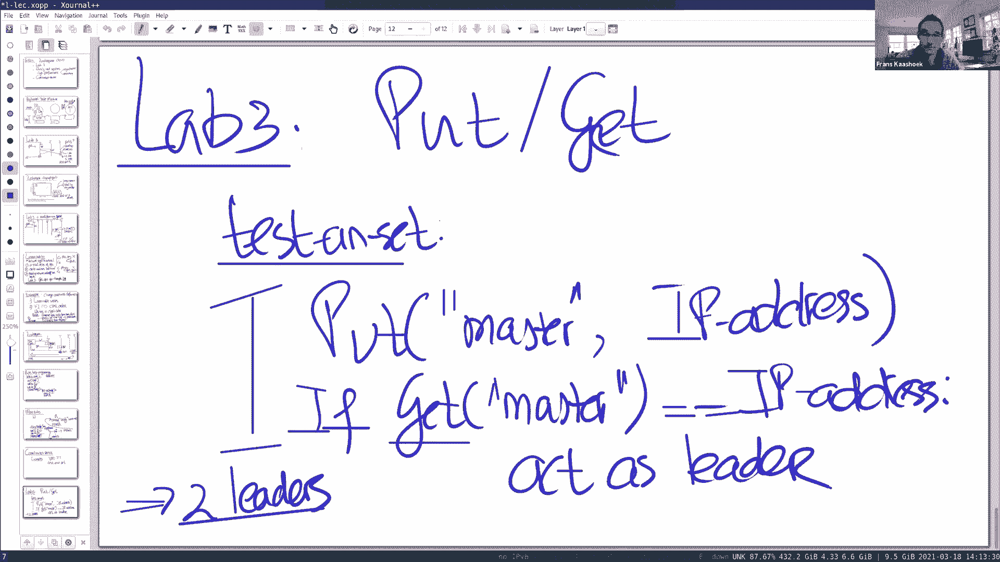

所以，让我们来看一下 zookeeper API ，我们真正想要了解的是 znode API 。你会再次看到，这是精心设计的，让它是可能的，做我们正在寻找的事情。好的，所以这个系统的组织方式是。

这里有一个 znodes 树，通常情况下，有一个 app1 作为 znode ，可能有一些子项，与 app1 中的机器相对应，比如机器 1 ， 机器2 ，比如 IP 地址或 DNS 名称，机器 3 。

它们可能有关联的版本号，或者相关联的序列号。基本上， znode 有三种类型，一，它们可以是常规的，所以它们的容错复制了所有这类东西。然后它们可能是临时的，而临时意味着节点将会自动消失。

当机器 3 的 session 离开时，要么是因为网络分区，机器 3 没有更多心跳，但在某个时候， zookeeper 认为时间已经到了，然后它会自动删除那个节点，这就是临时节点。然后第三个是顺序的。

糟糕，返回，第三个类型是顺序节点，这意味着，它们名字中与它们相关联的版本号，它们是在特定的 znode 下一个接一个创建的，所有的子节点都在它们的名字中有一个序列号，并且节点按序列号排序。

这个可能是有序列号 1 ，这个可能有序列号 2 ，这个可能有序列号 3 ，而新创建的将会有大于 3 的序列号。好的，有一个与之相关的 API ，我想谈一谈，有一个 create ，我们之前提到过。

使用一个 path ，一些 data 和 flags ，flags 对应于三种情况。然后有一个 delete ，在上一张幻灯片中，有一点误导，delete 使用一个 path ，以及一个版本号。

exists 使用一个 path 和 watch 。然后是一个 getData 原语，使用一个 path 和版本号，我们会看到这些版本号就是技巧，是获得原子性的关键。

然后 setData 有一个 path data 和版本号。还有一个 getChildren 的调用，可以获得特定 znode 的子节点，它使用一个 path 和 watch 。还有同步调用操作。

为了确保，如果你真的需要强线性一致性。好的，所以我想讨论一下，为什么这个版本号是方便的，所以，让我们来看这个简单的例子。

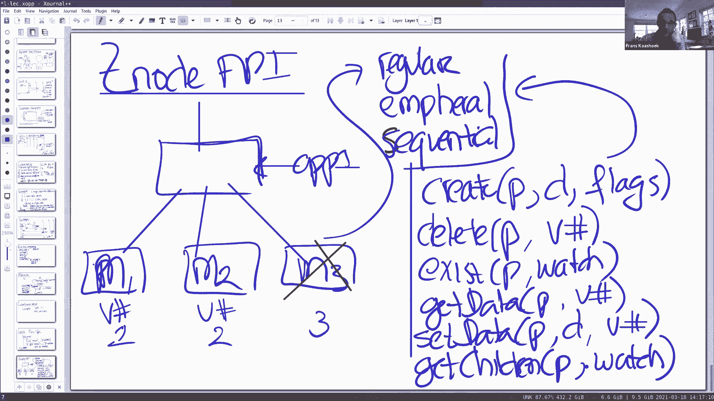

我通常想出一个实现计数器。所以你编写的方式，如果你编写，好的，首先是写入方案，所以 while true ，你实现增量的方式，所以这里是这个计数器递增的伪代码，你使用 x。

v = getData 计数器，getData count ，然后，如果 setData count ，x+1 以及版本号，如果是这种情况，然后 break 。好的，让我快速回顾一下，所以。

 getData 返回当前版本号和 key 的值，所以 key 或 path ，对于文件数量，它返回当时的值和版本号，当它们读取时，然后你调用， setData 接受三个参数，path ，更新值。

在这种情况下，它是 x+1 ，因为我们希望将值递增 1 ，然后它传入版本号，setData 的语义是，如果版本号仍然相同，那么 setData 发生，否则不发生。那么，这能防止什么呢？

这可以防止你交错 get-and-set 。所以，如果两个客户端在同一时间执行 get ，它们会读到，它们在同一时间执行 get ，它们都会获得比如 x 0 ，版本号 0 ，x 0 ，版本号 0 。

然后它们都执行 put ，就像本例中的 setData ，所以， setData 使用 x 1 ，版本号 0 ，这个也做了同样的事情，set 1 0 。你知道为什么。

所以两个客户端发出两个 set 操作，两个 set 操作[]？没有。是的，为什么不。因为其中一个版本号将是错误的。是的，两个中的一个先执行，为什么两个中的一个会执行？因为所有写入都是线性化的。是的。

所有的写入都是线性化的，它们使用一个整体顺序，所以我们可以选一个，所以我们假设这个先执行，或者这个操作先执行，所以这会增加，这会增加值到 1 ，从 0 到 1 ，而且也会执行，因为版本号是匹配的。

因为版本号 0 就是当前的版本号，所以版本号匹配，增加会发生，并且 setData 返回 true 。第二个会发生什么，第二个，版本号将不匹配，因为版本号会增加，由于之前的 setData 操作。

所以第二个 setData 操作将会失败，然后客户端将会循环并重试，试着再做一次，执行增加。所以在这种情况下发生的事情，即使两个客户端同时执行这个操作，如果交错不好，这段代码会执行写入。

第二个客户端将重试，结果就是，最终的值会是 2 而不是 1 。好的？这能理解吗？如果你在过去做过任何类型的无锁编程，那么你现在可能看起来很熟了，所以这种无锁的风格。

zookeeper 鼓励这种无锁的编程风格。好的，我想做的是，因为我快没时间了，最后时间，我想谈几点关于日志的问题，但我会在下次这么做，下一节课。

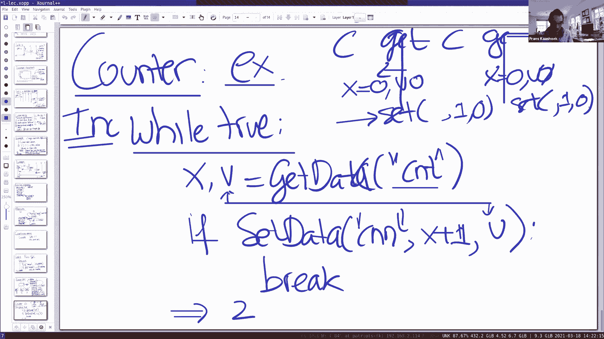

现在让我来总结一下，我们到目前为止所学到的东西，然后我将在下一节课中更多地谈论 zookeeper 。所以，作为总结，所以这是一个非常成功的设计，被广泛使用，你可以在 gitHub 上下载。

如果你想的话，你可以玩它，其中有趣的一点是，与我们目前看到的所有系统相比，它的一致性较弱，较弱的一致性，我的意思是，它不提供线性一致性，我们看到一个精心设计的 API 。

至少我们已经看到了精心设计的 API 的某些方面，尽管它具有弱的一致性，你仍然可以使用它，事实上，你可以把它用在非常重要的应用上，你可以将 zookeeper 用作配置服务，比如它的主要目的是跟踪。

比如谁是 primary ，什么是复制等等，所以，对于这种作为配置服务的关键操作，这必须是正确的，因为否则我们就会有脑裂的问题，API 精心设计，所以，如果你正确使用 API 。

你仍然可以在其上实现这个关键的应用程序，尽管这提供了弱一致性。最酷的是，这种区别，精心设计的 API 和弱一致性，允许 zookeeper 获得高性能。我们将在后面的课程中看到，更多这种技巧。

试着减弱一致性保证，为了获得更好的性能，或者即使网络分区，也能够继续。好的，让我停在这里，然后我会继续一段时间，下一次[]课程。有什么问题吗？像往常一样，如果你一定要走，请随意。

如果你想留下来问更多的问题，也请随意提问。抱歉，你能看一下幻灯片，test-and-set 的失败的例子。

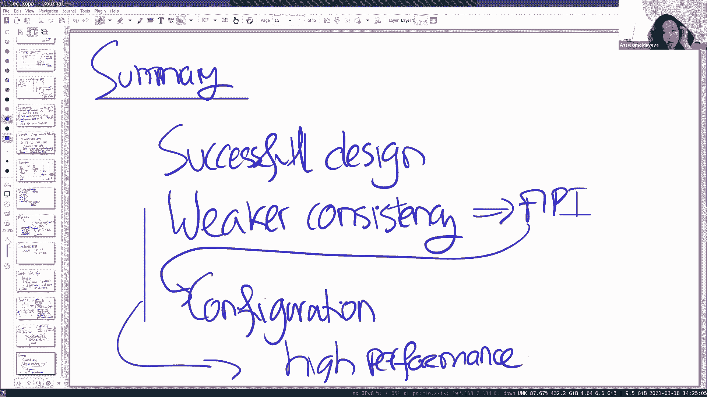

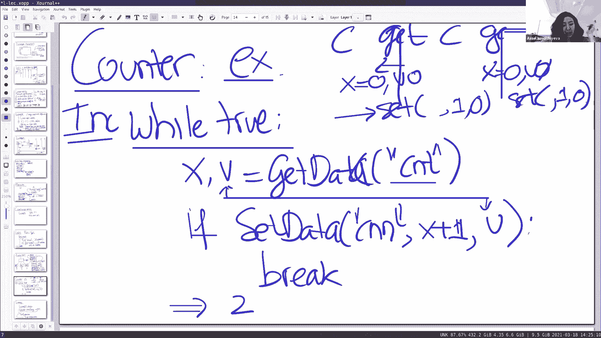

我想是倒退两张幻灯片。这一张？是的，所以新的设计，它能够修复那个写入。是的，我的意思是 zookeeper 提供的 API 。在[]版本写入。是的，如果你必须这么做，我没有这么做。

但这将在课程的其余部分讨论，如何使用版本号实现 test-and-set 。

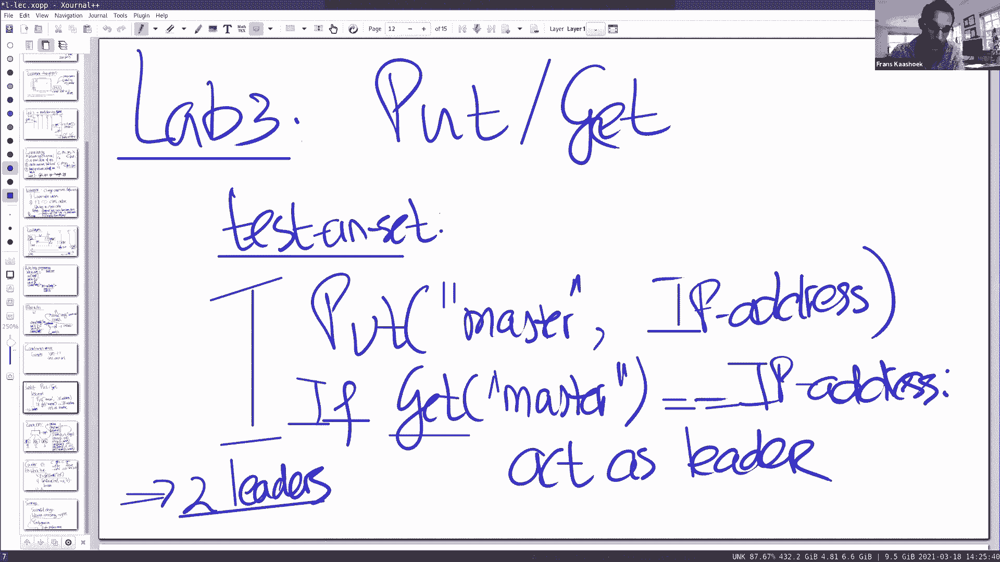

很明显，增量表明你可以，因为这是相同的序列。是的。哦，这和 master 是一回事，好的。是的，就是这样。好的，非常感谢。不客气。我有一个关于防止锁的版本，为了实现无锁编程，这是不是像更高效的无锁编程。

因为你还需要读取，反复尝试那个操作，直到它成功写入。是的，这个 test-and-set 有类似的属性，如果 test-and-set 失败了，你想增加，你必须再做一次，所以，通常是这种情况。

在这种无锁风格的编程中，你有这些循环，用来重试。所以，如果有很多[争论]，你会有很多次重试，因为没有争用，所以没有重试，通常情况下，这些无锁算法都很小心，在如何进行后退方面，所以它们不会立即重试。

他们有后备计划。好的，但这比标准锁有什么好处，因为无论哪种方式，如果你有很多争论，你会在那里并反复尝试。是的，所以让我们，是的，所以，所以，增量计数器是一个例子，隐式地执行锁。

因为如果我们在 zookeeper 中实现锁，使用 zookeeper API 实现锁，如果你用这个愚蠢的锁，你也可能会有这个争执的问题，当然，有可以实现更智能的锁的方法，他们无伤大雅地谈论着。

然后你可以做得更好，所以我希望下一次能谈到。好的，谢谢。我认为真正的问题是，你可以使用这些原语来进行无锁编程，而使用实验 3 提供的接口是不可能的。理解了，谢谢。

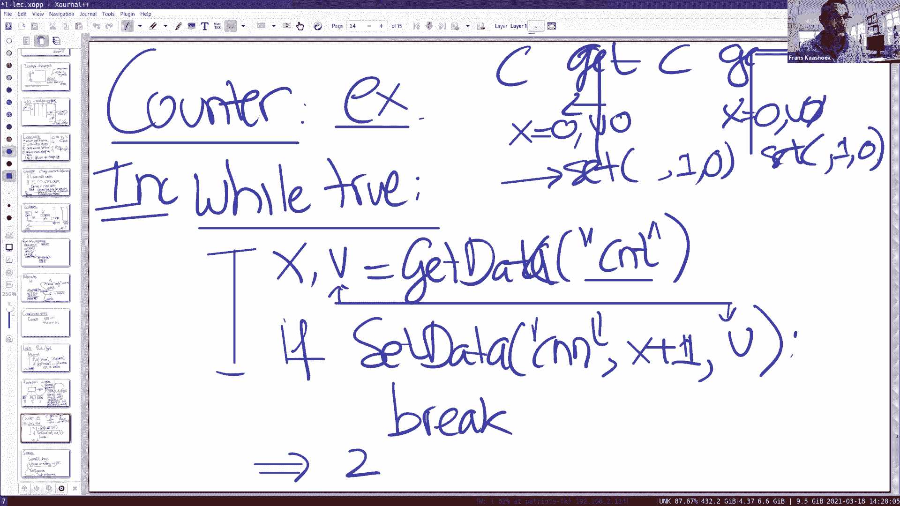