# P1：Lecture 1 - Introduction - mayf09 - BV16f4y1z7kn

你们可能注意到了，我在共享屏幕上放的网页部分，大部分课程是跟据课程表的，我稍后再说这件事，但是，希望你能找到链接，然后找到课程表。稍后，我会更详细地谈到这个。

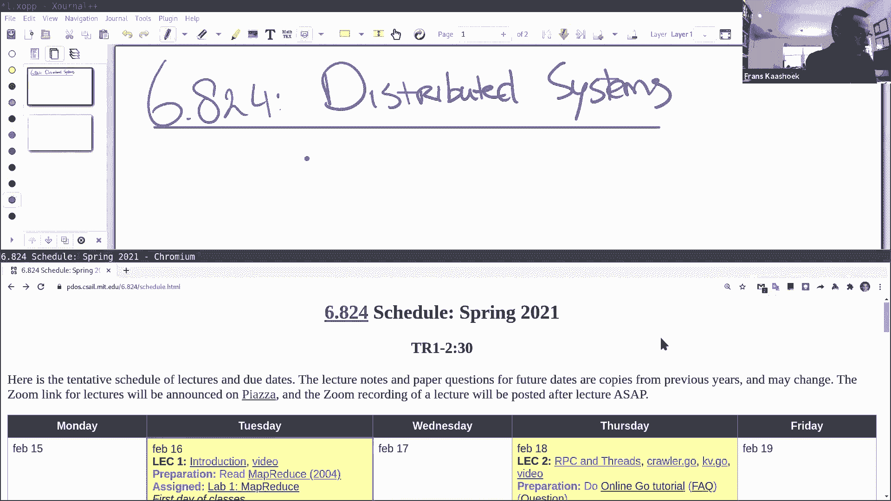

好的，那么今天的计划是什么。我会讨论一下，什么是分布式系统。它是什么，或许还有一些背景信息，分布式系统在过去几十年里是如何发展的。然后是一些你想知道的课程结构，然后讨论我们在整个学期中会反复出现的主题。

我们看这些主题中的第一个，也就是今天的案例研究， mapreduce 论文，这也是第一个实验的主题，你可以从 Piazza 上看到，我们在 Piazza 上发布了一个实验，一个链接，你可以去做。

直到下周五。

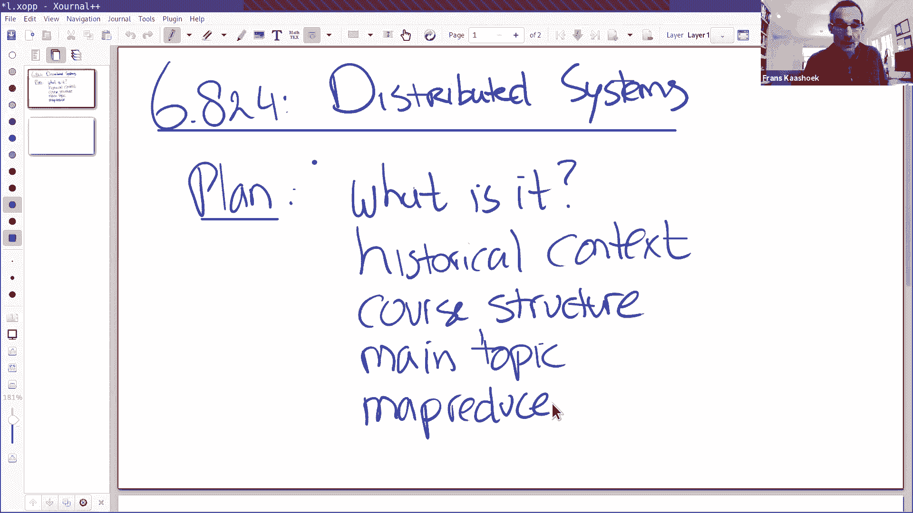

好的，让我们从基础开始，讨论一下什么是分布式系统。可能从一些图片开始会比较容易，这个是互联网，连接很多客户端，也许还有服务器，可能是完整数据中心的服务器，客户端，以及数据中心本身内部是分布式系统。

通过内部网络连接，数据中心本身可能通过内部连接，在互联网之外，很多计算机通过网络连接，从非正式的角度来说，我认为它是，分布式系统是，多个计算机通过网络连接，所以它们只能通过发送或接收数据包进行交互。

而不是多处理器，那里可以通过共享内存来做交互，它们合作来提供一些服务。这是四个关键词，定义了分布式系统。通常，你可能没有意识到分布式系统的交互性，你可能在使用一些客户端，比如， Zoom 客户端。

但是在 Zoom 客户端的背后，有巨大的数据中心或多个数据中心，来支持这个分布式应用。从某些方面来说，我们不会有这些使用 Zoom 的课程，如果有更多，如果没有分布式系统，所以。

它们通常作为基础设施的主干，来支持应用程序。好的？那么为什么分布式系统很有趣，或者分布式系统的主要作用是什么。

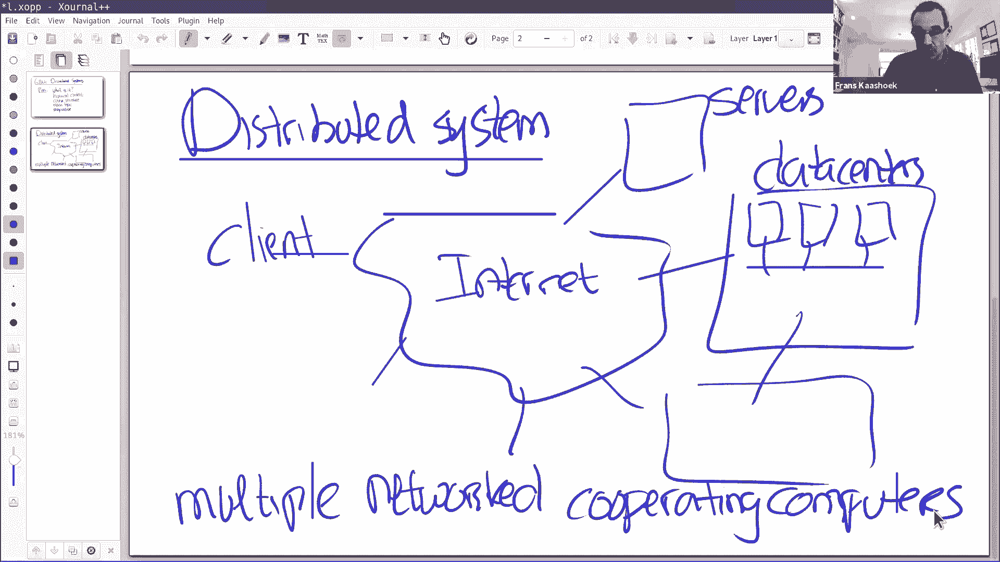

一般来说，有四个主要原因。一个是用来连接物理上分离的机器，你可能有，关系到我们所有人，正如我们在简介中看到的，或者在不同的地方看到的，我们通过笔记本电脑或手机或 iPad，连接到一些服务器。

它们可能位于世界上完全不同的地方。这可能是你关心分布式系统的基本原因，因为你有两台在物理空间上分隔的机器，你想连接它们，一旦你把它们连接起来，还有一个额外的好处，它可以允许用户之间的共享。

所以如果你和我可以连接到同一台计算机，那么我们就可以共享数据了，这使得各种合作成为可能，无论是文件共享，还是共享屏幕，还是共享计算基础设施，这些都是可以的，因为我们可以连接到物理上分隔的机器。

这可能是一个非常重要的原因，但还有其他几个非常重要的原因。一个是，通过并行来提高性能，我们今天布置的论文，第一个实验的主题是什么，mapreduce 论文，是这方面一个很好的示例，但另一个示例是。

例如有很多 Zoom 的会话同时发生，zoom。com 必须全部支持，它需要大量的计算机来提高性能，来支持所有这些并行的 Zoom 会话。另一个重要原因是容忍错误，因为计算机可能在物理上是分开的。

有一部分可能会宕机，希望不会影响到另一部分服务，以便始终能够提供服务，可以获得高可用性，我们将把它作为这门课的一个重要主题。然后最后一个是，在某种程度上，也是利用了物理上的隔离，就是会获得安全性，例如。

如果你有一个非常敏感的服务，这个服务用来管理你的客户的密码，用来登录到你的服务，你肯定想保护那台机器，不与其他任何人分享，或者不与任何其他程序共享，在它上面运行任何应用程序。

所以你对这台机器要有很少的接口，它让你得到更好的安全性，因为你只需要保护一个小的接口，所以，通过把东西放在不同的计算机上，进行隔离，你可能会得到，这是获得安全性的重要一步。这些是我认为的四个主要原因。

为什么分布式系统如此流行。我要稍微讨论一下，给出一些分布式系统的历史背景。

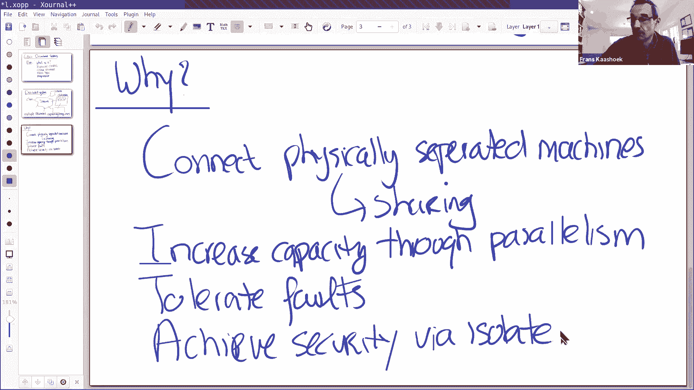

[]从哪里来，以及近几十年来发生了什么。基本上分布式系统是，就像我们现在看到的或者我们认识到的方式，它们可能是随着局域网出现开始的，在 80 年代初。比如，在麻省理工学院有一个校园网络，连接到工作站。

比如 Athena 集群，连接到 Athena 服务器，比如 AFS ，那是一种典型的分布式系统，AFS 也可以追溯到那段时间，当然，互联网也在那里，但当时没有大规模的互联网应用。

像我们现在使用它们的方式，互联网规模的分布式系统主要是 DNS ，即域名服务系统，我们仍然在使用，然后还有电子邮件。所以在早期，当我学习分布式系统时，这些都是主要的例子，是我们必须讨论的。

现在情况发生了很大的变化，从 20 世纪 80 年代以来，分布式系统的重要性大大增加了，有一点很重要，它就是数据中心，数据中心的兴起，是与大型网站相伴而生的。

我们这里谈论的大概是 20 世纪 90 年代或 90 年代初的情况。所以发生的事情是，在 80 年代末的某个时候，80 年代，政府或国会允许互联网上的商业行为，然后导致了繁荣，开始有大型网站。

为大量用户提供支持。那些时候的应用程序，比如，网络搜索，能够搜索所有不同的网页，在万维网上的网页，还有购物和。这些应用程序产生了两种情况，一个是巨大的数据集，使用索引来支持网络搜索。

将互联网上的所有网页写入索引，这意味着收集爬取所有的网页，然后计算倒排索引，然后你可以把它用在搜索引擎上，这是海量的数据，不能放在一台计算机上，以及执行第一次索引的计算量，对于同一台计算机也太多了。

所以，数据中心应运而生，公司开始，将大量的计算机放到数据中心，让它可以支持这种类型的应用程序，这是第一个，大量数据。第二个是，大量用户，大型网站拥有数亿用户，这并不少见。

这需要大量的机器来支持所有这些用户。所以，我们看到在一段时间内有大量的创新，我们还在继续，我们读到的一些论文，比如 mapreduce 论文，就是从那段时间开始的。整个事情加速发展，随着云计算的出现。

早在 2000 年的中后期，所以，我们在这里看到的用户或客户，将他们的计算和数据转移到数据中心，还有其他人，比如你所知道的亚马逊、谷歌、微软这样的公司，所以人们很多日常的计算。

过去运行在他们桌面或笔记本上的，转到了云计算上，应用程序变更，不是在本地计算机上运行应用程序，而是在云上运行应用程序。这意味着这些数据中心可能需要进一步增长，并支持新的应用程序，不仅如此。

客户将它们的计算转为云计算，也开始运行自己的大型网站，并且自己进行大量的计算，机器学习有很大的数据集，或任何其他类型的计算，所以你可以看到，用户自己想要建立大规模的分布式系统，这意味着云提供商。

开始建设大量的基础设施，允许其他人向上扩展他们的分布式系统到大量机器上，实现高并行，高性能，并存储大量数据。所以，现在的状态是，这是一个非常活跃的研究领域，在开发中也是如此。实际上，这很困难，也很活跃。

跟上发展是很困难的，有很多发展，即使在这门课中，我们将花费整个学期来学习分布式系统，我们只能看到，所有东西中的一小部分，所有人们已经在实践中建立的分布式系统。有一件事对我们来说很酷。

对于分布式系统的老师或学生，早期构建这些数据中心的人员，尽管他们是为自己的内部基础设施建立分布式系统，他们发表了关于这方面的论文，我们可以读这些论文，所以在这学期里，我们会读很多这样的论文。

是由面临大规模分布式系统的挑战的人们发表的，我们可以看到他们是如何解决的，并从中学习。随着云计算的出现，这一速度进一步加快，在数据中心的早期，这些服务中有许多是内部的，比如微软、谷歌、亚马逊或雅虎。

它们自己，随着云计算的兴起，这些服务变成了其他人使用的公共服务，所以突然之间，有了更多的系统基础设施，有很好的文档和可用性，所以我们也会研究其中的一些案例。所以如果你回顾这 40 年，这是巨大的涨幅。

分布式计算的重要性，就像我之前说的，我在 20 世纪 80 年代完成了分布式系统方面的博士论文，这是一个重要的领域，在重要性上，它并没有让我大吃一惊，在实用上，更多局限于这样的局域集群。现在你知道。

它在研究领域和开发领域一样蓬勃发展。关于分布式系统的历史背景，有什么问题吗？好的，让我来谈谈这些挑战，你会在实验里看到它们。

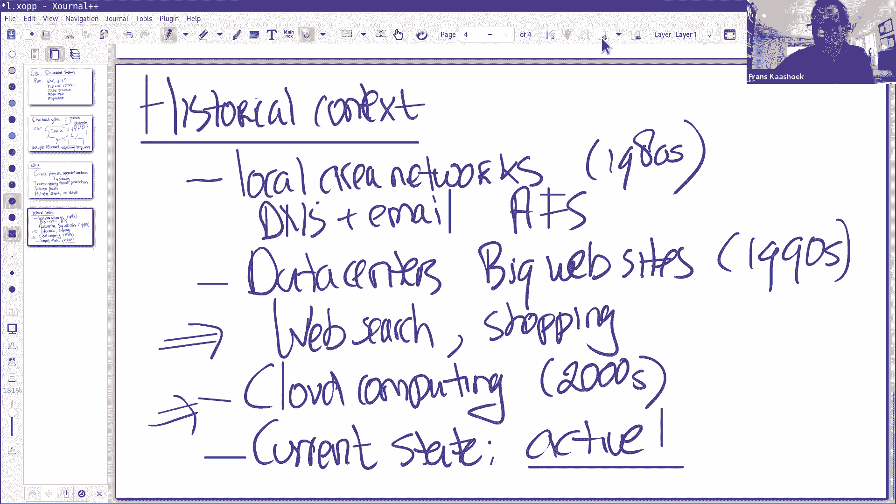

那么，为什么这么难，值得花费一个学期来学习。有两件事导致分布式系统很难，一是有很多并发的部分。那些数据仓库，今天的计算机会并行运行数十万台计算机，有时候都在同样的工作上。

我们今天看了 mapreduce 论文，是从 90 年代初开始的，2000 台机器处理同一个问题，所以有很多并发，很多并发软件，很多事情同时发生，很难推论出，理解为什么事情是正确的。更难的是。

分布式系统必须处理部分故障，这些机器中的一台可能真的会宕机，但这并不意味着整个[比赛]停止，其他的机器可能会继续运行，可能接管发生故障的机器的一些负载。这两件事一起导致了复杂性。

这让理解系统是否正常工作变得越来越困难，尤其是部分故障让事情变得非常复杂，因为系统的一个部分可能认为系统的另一个部分出现故障，但事实并非如此，有一种可能发生的事情是，有一个网络分区。

所以分布式系统的两边继续计算，可能与客户端交互，甚至可能与同一组客户端交互，因为客户端可以访问两个部分，但是两部分之间不能互相访问，这就是所谓的脑裂，这让设计分布式系统协议变得很复杂，正如我们将看到的。

所以这是某种深层次的智力问题，然后我发现各种挑战的方面，要实现性能优势是很困难的，理论上在分布式系统中可能实现的。到目前为止，我们一直在谈论你想要增加容量，或者你想要并行运行，你购买更多的机器。

或者购买另一个数据中心，当然，只有任务完全并行，这种方式可行吗，通常在实践中，事实并非如此，所以实现这样的高吞吐量，吞吐量随机器数量的增加而增加，这并不是直截了当的。让我转到下一个话题。

为什么你要选择 6。824 。我认为有四个原因，一是很有趣，它是困难的技术问题，有非常强大的解决方案，问题很困难，但是解决方案很强大，我们会在整个学期看到这些解决方案。第二个原因是，在现实世界中使用。

人们很希望，理解并能构建分布式系统。如果你是研究生或者考虑研究的本科生，这是个很棒的领域，因为这是一个非常活跃的研究领域，还有许多悬而未决的问题，我们会在这学期遇到它们，所以这是一个很好的研究领域。

最后，如果你喜欢构建东西，这是一种独特的编程风格，所以，在 6。824 的情况下，你会获得实际经验，通过构建实验室中的分布式系统，你会发现它是，一是很难把它们弄对，它建立了另一种编程技巧类型。

那些在过去可能做不到的事情。让我在这里暂停一下，看看有没有什么问题，也可以在聊天中发言，我会看聊天，如果有什么问题，或者有人举手，如果你有任何问题，我相信助教们也会注意聊天中的举手，如果我错过了什么。

他们会提醒我。到目前为止，任何问题清楚吗？我理解安静就是清楚了。

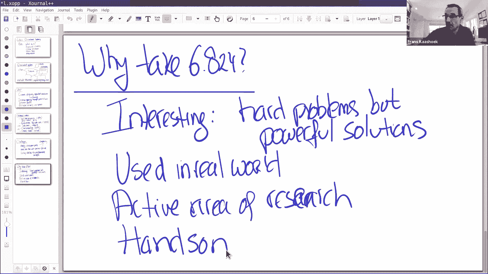

让我简单谈谈课程结构，在对分布式系统进行了快速介绍之后。课程结构如下，我们有像今天这样的讲座，集中在大的想法上，讲座通常是由我们看到的论文推动的，这些论文通常是案例研究，是我们在课上会讲到的重要的想法。

论文都发布在日程表页面上，对于大多数论文，我们要求你回答一个问题，同时也要问一个问题，我们试着在讲座中回答这些问题，所以重要的是，我们这么做的部分原因是，因为我们想让你在讲座前看一下论文。

这样我们可以更深入地了解这些论文，所以，我强烈建议你们在上课前阅读它们。课程的另一个组成部分是实验，编程实验，一共有四个，它们被分成了几部分，但是四个主要的。一个是 mapreduce 实验。

我们今天发布，下周五需要提交，你要构建自己的 mapreduce 库，与论文中描述的一致。第二个实验是重点在复制的实验，在存在故障和分区网络的情况下，我们使用称为 raft 的协议来实现复制。

这是一个由多个部分组成的实验，但到了最后，你有一个库，可以用来构建复制状态机，也就是复制状态机或多台机器，如果其中一个宕机，其中一台机器宕机，而服务会继续运行，你将使用这个库构建一个复制服务，实际上。

你将在实验 3 中构建一个复制键值服务。实验 3 中使用多台机器，提供容错能力，让应用构建一个服务，不幸的是，正如我们看到的，仅仅使用复制并不能带来更高的性能，因为这些机器必须按特定的顺序执行，所以。

为了真正获得性能，在实验 4 里，你可以构建分片键值服务，它是由实验 3 中的多个实例组成，并发运行并负责一个分片的键值服务，这样你会得到并行性，所以，你可以使用它来提高吞吐量，另外。

我们将移动键或键值对，从一台机器到另一台机器，以响应负载变化。所以实验 2 3 4 是有递进关系的，所以如果你在实验 2 中有一个 bug ，可能会在实验 4 里影响你，我们为它们三个提供了测试用例。

所有的测试用例都是公开的，我们在那些测试案例中给你打分，所以你提交了解决方案，我们在我们的电脑上做同样的测试，复查你是否通过了测试，如果你通过了所有的测试，你会得到满分，这些测试用例是很困难的。

我们会尝试检查你的系统中的各个角落，所以，它们是很难通过的，它们也很难调试，你可能会在某个角落发生错误，可能很难追踪到，什么时候发生的，为什么会发生，让你来修复它，所以的建议是尽早开始实验，通常情况下。

如果你在前一两天开始，你会很难通过所有测试，因为你可能会卡住，调试一个特殊的方面，就没有时间让其他测试用例正常工作了。有一个可选的项目，除了做实验 4 ，你可以做另一个项目，这个项目的想法是。

你可以和两三个同学组成一组一起工作，然后做一个你们自己的项目，这些项目是以前的相同类型的系统，我们在论文中看到的，你提出了一个你想要构建的，我们会给你一些反馈，我们会告诉你们，也许你应该做实验 4 。

但如果你对做项目很感兴趣，我们当然鼓励这个，你现在就应该开始思考，然后我们能讨论一下，然后选定做些很酷的事。好的，最后，这门课程还有两次考试，一个在期中，另一个在期末，我们希望你完成所有实验。

提交论文的读写作业，然后还有两次考试，如果你看一下 6。828， 6。824 的网页，你会看到不同部分在评分方面的分配，实验是最重要的，两次考试是 20% 或 30% ，然后还有一些课堂活动。

但是详情在网页上。为了帮你通过这个学期，我们有优秀的课程工作人员，我们有 4 名助教，我们有办公时间，为了帮助你通过实验，让我来简单[介绍一下]，或许助教们可以自我介绍一下，你至少知道他们是谁。

Lily ，你想先说吗？当然，我是 Lily ，我是 PDOS 的三年级研究生，Frans 是我的导师，所以我知道他教得有多好，所以你们可以学到很多，是的，我很期待这学期和你一起工作。

下一个我交给 David 。大家好，我是 David ，我是第二学期的学生，我在去年春天参加了 6。824 ，当时一半是面对面，一半是远程，希望这学期我们能得到最好的[]，我很兴奋，是的。

然后是 Jose 。我是 Jose ，我是四年级研究生，致力于解决机器学习问题，我读研究生的第一年上了这门课，我真的很享受它，是的，接下来是 Cel 。是的，我是 Cel ，我用这个发音。

我是 PDOS 的第一届硕士研究生，像其他人一样，几年前我上过这门课，并且很开心，所以我很高兴能帮助大家学习它。好的，谢谢，在聊天中有一个问题，实验的分布式系统是如何运行的，机器系统是模拟的吗，是的。

我们是通过运行许多不同的进程来模拟许多机器，实际上，这些实验有自己的 RPC 库，假装你在不同的物理机器上运行，但实际上，你在同一台机器上运行许多许多进程。好的，到目前为止，有什么问题吗。

在我继续讨论一些技术内容之前。实验 4 的结果，它与现有的任何程序类似吗？是的，你要构建的东西，与一些流行的键值服务很像，比如 redis 或者其他的，会有不同之处，当我们在这学期学习的过程中。

但键值服务是非常有名的，是数据中心内部的公共服务，很多公司都在运行，其中一些知名公司，很多人在使用，它们都在处理相同的问题，如同你在实验中处理的问题，我们将构建一个具有相当强语义的应用程序。

一些比人们实践中更强的语义，我们也会讨论为什么会发生，但是，是的，这与人们在实践中所做的非常接近，例如， raft 在实践中得到了广泛的应用。还有其他问题吗？是的，也是关于实验的问题。

如果我们在实验 2 中有一个 bug ，可能没有被测试用例发现，我们会得到一个答案吗，用于后续的实验，还是我们继续使用我们的代码。是的，你将继续使用你的代码，我们尽了最大努力让实验测试尽可能好。

但我相信有些情况下很难完成这项工作，每次我们发现我们遗漏的东西，我们会改进测试，所以你构建的，一旦你通过了测试，我们乐观地认为你已经实现了，可以支持其他用例，我们要学本学期剩余时间所做的。

人们重写一次或两次的情况并不少见，你将在实验 2 和实验 3 中看到，这个结构体，你必须花相当多的时间，来考虑应用程序或库的结构，随着你的学习，你可能想要回去重新做一次。为了帮助你们。

今年我们要做一些与过去几年不同的事情，我将举办几场问答讲座，我们将分享我们的解决方案，或者我们将演示我们的解决方案，希望能告诉你一些关于，你可以从中学习，看看与你自己的解决方案有什么不同。

或许能为未来的实验获得一些想法。还有其他问题吗？好的？再说一遍，随时可以打断我，我想让它更具互动性，我们可能会上几节课，但我们能到达那里。

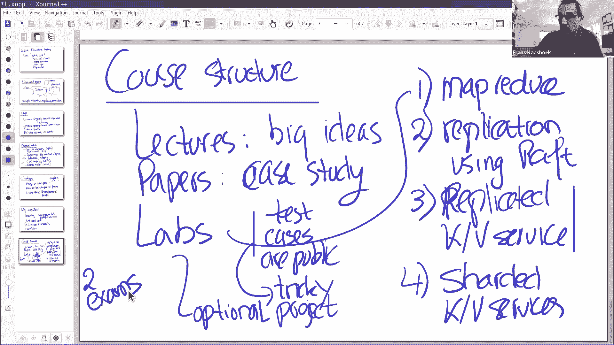

好的，我想讨论一下，为今天的案例研究做准备，但在此之前，我想说一下对这门课的一些看法，我们在这门课的重点将放在基础设施上，你可以从实验中或多或少地看出这一点，就是我们刚讨论过的，所以会有人。

在这些分布式系统上编写应用程序，我们完全不关心应用程序，我们主要关注，支持这些应用程序的基础架构，基础设施分为三个不同的类别，或者非常宽泛地说，存储基础架构，比如键值服务器、文件系统等。计算框架。

用来编排或构建分布式应用程序，比如经典的例子是 mapreduce ，我们稍后会谈到。然后第三类是通信，我们在通信上花费更少的时间，它更多是关于 6。829 网络系统的话题，但它会出现，从某种意义上说。

网络系统和分布式系统之间是有关联的。这是一个重要的话题，比如，第一天我们将讨论远程过程调用 RPC ，这是所有实验构建的基础，这是一种通信模式，这里的问题是，RPC 系统提供了什么样的语义，最多一次。

恰好一次，至少一次，我们将在周四的课程中讨论这一点，这就是通信和分布式系统关联的地方。查看这三个种类，存储，可以持久地存储数据，计算，用来运行计算，通信，用来在不同的部分互相通信。

所以这是三个基本的事情，我们构建分布式系统。我们寻找某种抽象，已被证明对构建分布式系统非常有帮助，有些抽象，比如远程过程调用或 mapreduce 库，或者存储系统，比如键值服务。通常我们的目标是。

为了使分布式抽象，看起来非常像普通的标准顺序抽象，你已经熟悉的，比如，我们构建一个存储系统，我们希望我们的分布式存储系统，或多或少像单机顺序存储服务器一样，像笔记本电脑上的常规文件系统一样，除了。

我们希望存储系统有更强的容错性，因为它们使用复制，可能会有更高的性能，因为它有很多机器，我们要找的系统的行为类似于，我们要找的抽象类似于单个机器。但是在实践中是很难做到的，你会看到，它看起来像。

但不完全是，这是一个会多次出现的主题。实际上，这引出了课上会反复出现的主题，我们会一遍又一遍地看到。主要主题是容错，这并不令人惊讶，这有两个方面，定义一下容错是什么意思。一个是可用性，所以我们研究技术。

我们研究使系统高可用的技术，所以我们的意思是，它们在失败的情况下继续提供它们的服务，这通常被表示为多个数字 9 ，0。999 的可靠性，所以这是容错的一个方面。我们关心容错的第二个方面。

我们称为可恢复性，当机器崩溃或故障时，我们想在它重新启动后返回系统，这样我们可以保持可用性，因为如果我们不修复系统，然后所有的机器都会一个接一个宕机，直到没有机器，然后我们就没有服务了。

所以重要的是我们要修复分布式系统，我们修复分布式系统的方式是，在机器重新启动时，我们需要恢复它的状态，然后我们开始重新参与分布式系统，这实际上很难，这是个困难的方面。可用性的关键技术是复制。

我们用来实现可恢复性的关键技术是，日志或事务这样的东西，将东西写入持久存储器，这样当电力中断，机器重启之后，数据还在磁盘上，这就是容错方面。第二部分是所谓的一致性，这个协议是，服务器对操作提供。

在具有并发性和故障的情况下，所以粗略地说，当我们考虑一致性时，理想的行为是与任何一台机器都提供的行为相同，所以，我们有一个复制的容错高性能文件系统在多台机器上，它的行为几乎与时序机器相同。

所以这里的关键问题是某种形式。假设我们有一个键值服务器做 get 操作，返回最后一个 put 的值，如果你运行一台机器，完全没有并发操作，一个接一个地执行操作，比如 put put put 。

然后 get get get ，当然，这个问题很难回答，你会假设 get 将返回最后一次 put 存储的值，但是一旦我们有了并发和失败，我们有很多机器，这其实不是非常明显，什么样的方式。

什么样的协议是好的，我们会看到很多不同的协议，我们看到一些有很强的一致性，行为几乎就像一台顺序机器，或者一些有非常宽松的保证，提供非常不同的[]，比如，它们提供最终一致性。

最终你会看到 get 会返回 put 的结果，但不是立即的。原因是，有不同类型的一致性，与性能直接相关，通常分布式系统的目标之一是提供高性能，比如扩展多台机器，为了实现性能，这与一致性和容错性是冲突的。

为了达到强一致性，需要不同机器之间的通信，这可能会降低性能，类似地，为了实现容错，我们需要复制数据，意味着我们必须将数据从一台机器传送到另一台机器，如果我们将机器数据也写入持久久存储器。

这个操作是很昂贵的，所以，复制会降低性能。所以，同时实现这些是三件事情，这是非常困难的，人们在实践中所做的是，他们做了不同的权衡，他们牺牲一些一致性来获得更好的性能。

或者（牺牲）一些容错性来获得更好的性能，所以我们会在整个学期中看到，很多的不同类型的设计，用不同的方式进行权衡。稍微说明一下性能，它有两个方面，一个是吞吐量，你买更多的机器。

希望吞吐量能随着机器数量的增加而增加，但是性能还有另一个方面，基本上很难实现，这就是低延迟，这一点在一些网站中尤为重要，你有几千台机器，当你点击 url ，会有一个用户请求，需要很多这样的机器参与。

如果其中一台机器非常慢，也许它有一些机械故障，可能磁盘不是百分之百正常工作，或者其他一些方面工作不正常，一台慢的机器可能会导致整个用户体验变慢，这通常被称为尾部延迟。这个[担心]，会在整个学起不断出现。

当我们讨论不同的机器时，甚至出现在今天的论文中， mapreduce 论文。所以另一个最后的话题会出现很多次，至少在课堂上，特别是实验的实现方面，这就是如何管理并发性，如何实现远程过程调用。

自己构建分布式系统，会面临严重的实现挑战，这会在整个学期一遍又一遍地出现。部分原因是，我们希望获得性能、一致性和容错性，减少并发中的失败，这使得[磁盘]驱动器变得非常复杂。这些都是主要的话题，对这部分。

有什么问题吗？好的，那我们开始深入研究，看第一个案例研究。

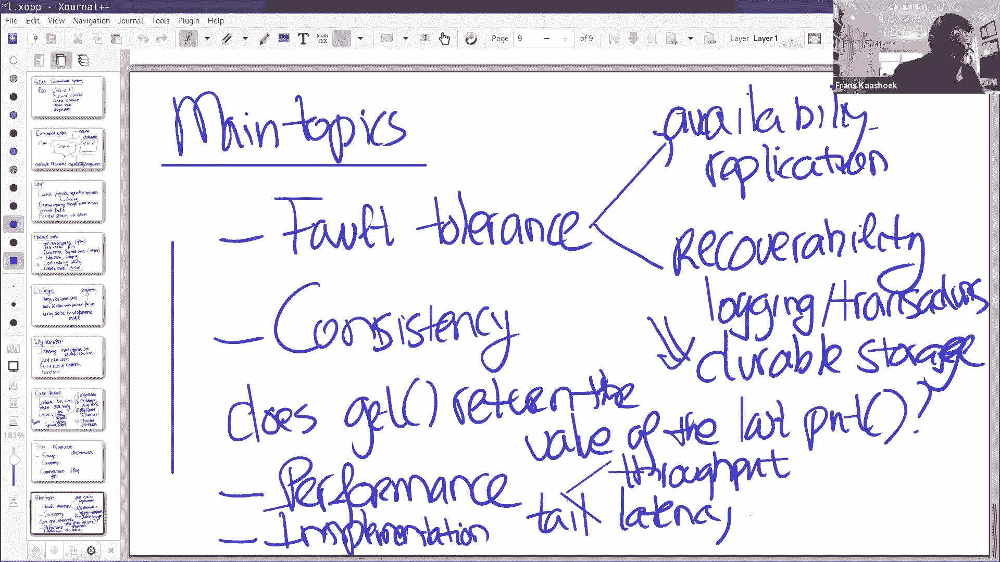

通过 mapreduce 论文。这是 6。824 中的许多话题的解释，我们要讨论容错，我们要讨论性能和尾部延迟，我们在整个学期中会看到的各种问题，我们将看到一个系统来处理这一问题。

很多话题都很好地说明了这一点，这篇论文也很有影响力，虽然 Google 内部并没有完全使用本文描述的 mapreduce ，他们使用从这个 mapreduce 派生的系统，他们仍然在日常使用。

还有其他库类似 mapreduce ，它们被广泛使用，它还启发了 mapreduce 之外的不同类型的计算模型，我们会在本学期晚些时候看到一两个，所以是很有影响力的论文。最后，这是实验 1 的话题。

是讨论它的另一个很好的理由。你们中很多人可能已经看过 mapreduce 论文，在 6。033 课程中，如果你是麻省理工的本科生，否则你可能会在其他地方看到，但是我们要比 6。033 稍微深入一点。

因为你必须实现自己的 mapreduce 库，而且和往常一样，当你实现一些东西时，你之前可能不会认真考虑的问题，会突然冒出来。所以到了最后，你会真正理解 mapreduce 。有什么问题吗？好的。

让我给你一点关于这篇论文的背景，这篇论文是由 Google 的两位工程师撰写的，非常有名，背景是早期的数据中心，Google 有一个搜索引擎，需要构建万维网的反向索引，允许用户查询互联网。

而这些计算要跑好几个小时，处理 TB 级别的数据，多个小时计算，在 TB 级别的数据上。所以考虑网络索引，网络爬行，特别是网络索引，其中一个[]应用程序，Google 在内部构建这样的应用程序。

Sanjay 和 Jeffrey Dean ，两个[]，他们在这方面很在行，但他们发现，还有许多其他谷歌工程师，也想要编写这种类型的应用程序，他们希望编写自己的数据分析，针对所有被爬行的网页。

他们意识到编写这类应用程序是很困难的，因为如果你在许多机器上运行多个小时的计算，很有可能其中一台机器会在计算过程中崩溃，所以，你必须制定一些容错计划，一旦你开始这么做，就要求你已经掌握了类似 6。

824 的课程，并且能够构建这种复杂的系统，他们的目标是走出这种困境，并使它对非专业人士编写分布式应用程序变得容易。这就是这篇论文的动机，以及为什么你对此非常兴奋。所以他们采取的方法。

mapreduce 采用的是，它不是一个通用库，你不能接受任何应用程序，使用 mapreduce 使其具有容错能力，它必须写成一种特殊的格式，也就是使用 map 函数和 reduce 函数。

这些函数是函数式的或无状态的，但是这些都是程序员编写的顺序代码，这两个函数， map 和 reduce 函数是一种框架，mapreduce 框架处理所有分布式的[]。它将安排应用程序。

或程序的二进制文件在多台计算机上运行，或安装在多台机器上，并处理负载平衡，它处理的是某些速度很慢的机器，它处理崩溃的机器，所以应用程序编写者，编写 mapreduce 函数的人，根本不必担心这个。

他们透明地得到了所有东西。为了实现这一点，这个库不是通用的，比如，您想要编写一个键值服务，你可以使用 mapreduce 库，因为它假设一种特殊的计算模型，你的应用必须符合这一点，这个计算模型像。

他们在 Google 经常看到的一些东西，比如人们想要做大数据分析，在整个世界的所有网页上，有许多类型的计算需要处理大量数据，并根据这些数据计算值。这就是 mapreduce 的目标应用程序类型。

关于这篇论文的上下文和动机，有什么问题吗？

好的，让我继续。所以，让我先画一个抽象视图，然后我们将深入探讨更多细节。所以，你需要了解背景，并理解 mapreduce 是如何工作的，当你在做实验 1 的时候，这是非常重要的。这里有一堆输入文件。

比如 f1 f2 f3 ，当然，在 Google 的案例中，会有更多，但是只是出于教学上的原因，还有我能展示的大小，我只有三个文件。对于每个文件，都是由 map 函数处理的，由程序员编写的。

并产生一些输出，中间输出，比如，讨论 mapreduce 的经典案例是字数统计，计算一个词在数据集中出现的次数，或者数据集包含很多文件，比如，我们正在对文件一运行字数统计函数，它为每个单词生成键值对。

键值对包含单词作为键和计数 1 ，如果 a 在文件 f1 中出现多次，它会包含多个键值对 a，1 。可能这个文件包含很多单词，可能会包含 a，1 和 b，1 ，这个文件包含两个词，类似的。

map 函数对文件 f2 做同样的事情，并产生一些键值对，假设可能只有 b 这个词在文件中出现了一次。map 函数也会处理文件 f3 ，让我们假设，我们假设 a 只出现了一次，并且词 c 出现一次。

所以这些 map 函数都是并行运行的，彼此完全独立，它们之间没有通信，在它们的输入文件上，所以这将给我们带来高吞吐量，或者扩展更大的数据集，他们在这些中间值中产生，这些键值对，a，1 b，1 或者 a。

1 c，2 。然后，第二步通常称为 shuffle ，也就是在每一行上运行 reduce 函数。所以在这里我们得到了所有的一排 a ，我们将运行 reduce 函数，reduce 函数使用一个键。

聚合所有，reduce 函数获取输入，键加上聚合值，聚合从不同 map 中输出的组合值，所以在这种情况下，reduce 函数会获取两个中间结果，键 a 和两个值 1 1 。在这种情况下。

在字数统计的情况下，我们只要把它们加起来，所以它会产生值，键值对 a，2 。我们所做的，我们对每一行执行 reduce ，所以这会产生 b，2 ，然后最后一个是 c，1 。

一旦我们做了 shuffle ，这些 reduce 函数可以完全彼此独立地运行，它们可以处理任何它们的行数据，并且完成它，所以唯一非常昂贵的部分，是这个中间的 shuffle ，reduce 函数需要。

从每个 mapper 获取它们的输入，当所有的 mapper 都完成后，reduce 函数需要，需要联系每个 mapper ，提取输出，reduce 函数对应的 map 的输出，按照键进行排序。

然后运行 reduce 函数。所以我们假设，就像论文指出的那样，昂贵的操作是，在 mapper 和 reducer 之间的 shuffle 数据，对于这个抽象图，有什么问题吗？好的？抱歉，我有个问题。

那么，是不是，我知道不是所有的问题都可以在 mapreduce 阶段表达出来，但是比如数组进行排序，有没有可能。是的，排序是他们在论文中谈论得最多的应用之一，这是完全由 mapreduce 完成的。

你可以将输入文件拆分成很多部分，mapper 对这些部分排序，然后，他们拆分输出为 r 个桶，然后每个 reduce 函数对 r 个桶进行排序，给出一个完整的文件。我明白了，好的。在这种情况下很有趣。

因为输入、中间值和输出的大小相同，其他一些函数，比如 map 函数，可能会将中间状态减少为比输入尺寸小得多的值，在排序的情况中，不是这种情况。好的，我们来看论文，让你知道如何编写它们。好的，看我能不能。

那太烦人了，我的菜单丢了。稍等一下。好吧，这不是很好，给我点时间。

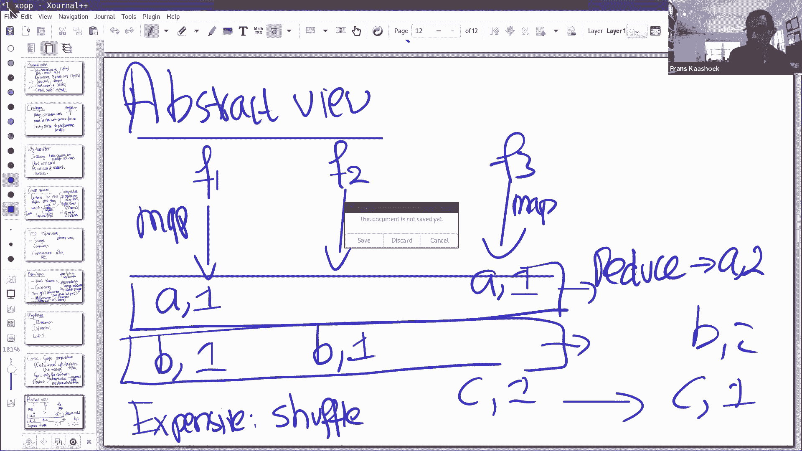

在这里，所以我们保存。

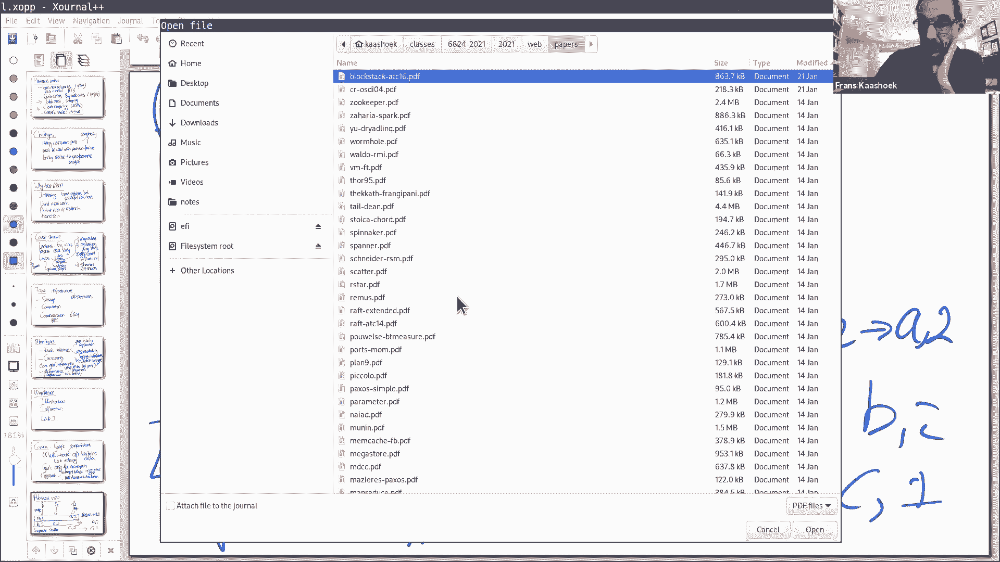

好的，这里是 mapreduce 。

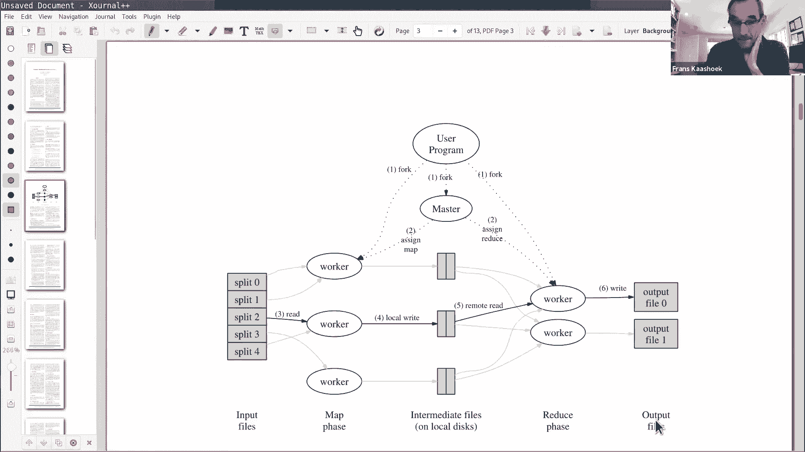

好的，大家能看到这个吗？好的，这里有几个问题，让我暂且不提这些问题，稍后我们会更详细地讨论，如果我没有回答你的问题，请再问一遍。所以我想做的第一件事是。

查看论文中的一个关于 map 和 reduce 函数的示例，对应于字数统计示例，在某种程度上[抽象地]讨论。这是 map 和 reduce 函数，你可以看到 map 函数获取 key value 。

key 在这里并不重要，它是文档名称，比如 f1 或 f2 ，value 字符串是文件的内容，所有在文件 f1 中出现的单词，它是遍历，伪代码遍历文件中的单词，作为中间值，发出这些 a，1 b，1 c。

1 等。从程序员的角度来看，根本不会看到这些中间键值对，你只需编写这个简单的 map 函数。然后， reduce 函数大概是这样的，它获取两个参数，比如 key 是 a ，并且在这种情况下。

字数统计的 values 是 1 1 1 1 ，是单词 a 在中间输出中出现的次数，这个函数的作用是，它只是遍历 values 列表，然后加 1 ，加 1 ，加 1 ，加 1 ，然后是最终结果。

这是你可以从这段代码中看到的，程序员基本上总是编写，[完整的]简单的顺序代码，不可否认，这个应用程序非常简单，但是更复杂的应用程序的代码也是简单的，顺序可能是更多的代码，但它还是简单的顺序代码。

在这段代码中，程序员根本不用担心，机器可能会崩溃，可能会有负载均衡，这些都是由 mapreduce 库的处理的。所以希望，我认为这已经被证明是真的，这让很多人编写分布式应用程序，并处理海量数据集。

完全没有办法放在一台机器上，比如，整个万维网。这能理解吗，关于程序员能看到什么。

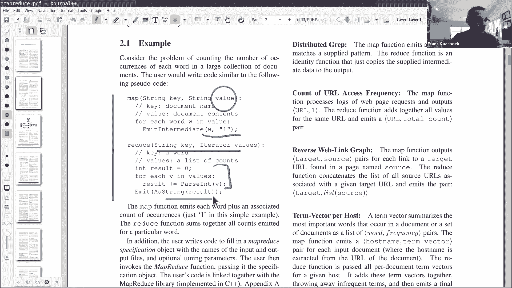

好的，让我们来谈谈实现的问题。

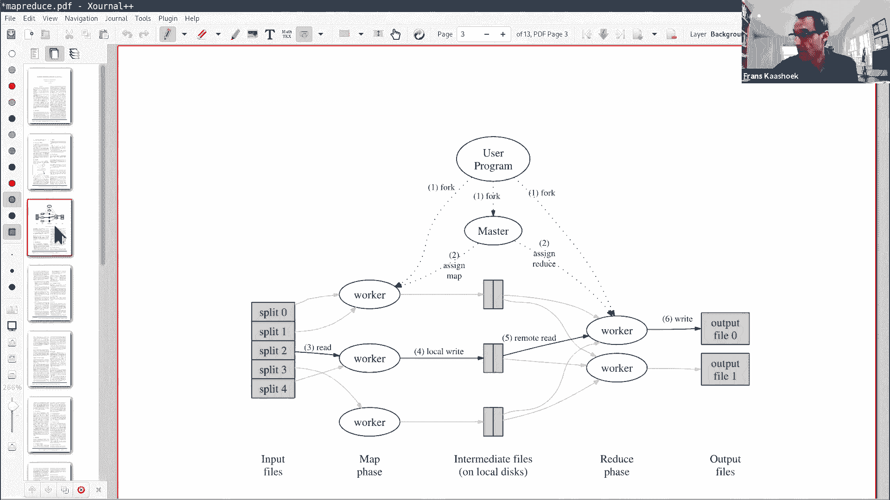

我用的是论文上的这个图表，我们有了用户程序，用户程序就像我们刚才看到的 map 和 reduce 函数，你把 map 和 reduce 函数提交给，你链接它与 mapreduce 库，形成二进制文件。

然后把这个交给 Google 作业调度器，它会找到很多机器，在那里运行他们称为 worker 的东西，调度器将会，比如在我们稍后会看到评估中，这里大约有 1800 台机器，在这 1800 台机器上。

调度器将运行 worker 进程，它会实际来工作，并在适当的时候调用 map 和 reduce 函数。还有另一个重要的进程，在论文中称为 master 进程，在实验中称为协调器。

协调器[]编排 workers ，把 map 工作交给它们，关于术语，下面是一个完整的 mapreduce 作业，确定的 reduce 或确定的 map 则称为任务。

所以协调器会把文件分配给特定的 worker ，然后， worker 在那个特定文件上调用 map 函数，它会产生一些中间结果，这里的中间结果，这些中间结果存储在机器的本地盘上。

实际运行那个 map 函数的机器。当 worker 已经完成运行了特定的 map 函数，就会告诉 master ，我完成了 map 函数，并告诉 master 中间结果在哪里。然后。

当所有 map 都完成时，协调器会开始运行 reduce 函数，reduce 函数将收集来自不同 mapper 的中间结果，从结果记录中指定的位置，获取数据，按键排序，然后 reduce 运行。

在每个 key 和 values 列表上调用 reduce 函数，这会产生一个输出文件，每个 reduce 函数有一个输出文件，你可以聚合输出文件，连接输出文件以获得最终输出。这就是结构。

输入文件在一个全局文件系统中，称为 GFS ，Google 现在使用的是不同的全球文件系统，但这个论文使用的是 GFS ，我们下周会看 GFS 的内容，输出文件也会发送到 GFS 。

中间文件不保存在 GFS 中，它们存储在 worker 运行的本地机器上。关于调度器的粗略实现，有什么问题吗？我有一个关于远程读取文件的问题，在远程读取进程中，文件是否会传输到 reducer ？是的。

中间结果生成或存储在，运行 map 函数的机器的磁盘上，然后 reduce 出来，从每个 mapper 获取 key 的集合。在这里，数据是通过网络传输的，所以网络通信发生在这里，这里很少有网络通信。

完全没有网络通信的原因，是因为 worker ，协调器给 worker 分配文件的方式是，worker 在同一台机器上运行，每台机器都同时运行 worker 进程和 GFS 进程，worker 发送。

map 函数运行在文件存储在 GFS 的机器上，这相当于本地读取，通过 GFS 到本地磁盘，然后文件产生或 map 产生中间文件，也存储在本地磁盘上，所以在图片的这部分没有发生通信。

然后当 reduce 函数运行时，它们通过网络获取文件，然后写入 GFS ，这里会有一些网络通信，当 worker 产生文件到全局文件系统时。我还有一个问题，协调器是否负责对数据进行分区。

并将数据放到每个 worker 或机器上？不，不是， mapreduce 运行用户程序，比如我想在 f1 f2 f3 f4 上运行，所有这些输入文件，这些输入文件在 GFS 中，作为工作规范的一部分。

通常会说哪些文件需要处理。好的。抱歉，排序是怎么工作的，比如谁做排序，怎么做。mapreduce 库进行的一些排序，在传递给到 reduce 函数之前，比如，中间结果可能有。

比如所有的中间结果键 a b c 到一个 worker ，这里有很多键值对，比如 a，1 b，1 另一个 a，1 ，还有 c，1 。mapreduce 库所做的是，它首先按键排序。

所以首先把所有的 a 放在一起，然后所有的 b 放在一起，然后所有的 c 在一起，然后将来自单个键的所有值连接在一起，并将其传递给 reduce 函数。谢谢。好的，现在我想稍微谈谈容错，所以回到。

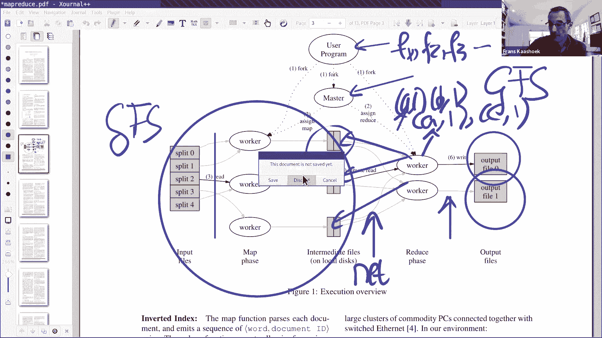

我可以问一个关于 mapreduce 论文的问题吗？一个更大的想法，很多函数式编程可以归结为 mapreduce 问题？是的。好的。好的。实际上，这个名字暗示了。

因为 map 和 reduce 函数的概念，在函数式编程语言中非常常见，并且在函数式编程语言中广泛使用，或任何类型的函数式编程风格，这就是灵感的来源。好的？那么现在转到容错性，这个想法是。

如果一个 worker 失败了，然后协调器注意到 worker 失败了，然后重启那个任务，协调器重新运行 map 和 reduce 函数，当然，协调器本身不会重新运行它们，但协调器会说。

那个特定的 map 函数需要再次运行，因为对协调器来说，它交给任务的机器没有响应，所以困难的事情是，如果机器在一定时间内没有响应，协调器就假设机器崩溃了。这意味着当另一个 worker 空闲时。

在寻找一个新的任务，它会分发相同的任务，之前分发的，然后再次分发。这就是容错的基本方案，如果协调器没有收到，worker 反馈任务已经完成了，我们将重新运行该任务。所以，立即出现一个问题。

map 函数是否可以运行两次，甚至完成两次，在这个框架里有没有可能，一个特定的 map 会运行两次。我想是的，因为如果机器坏了，你并不能区分是在哪个点，多少个 map 任务已经执行了。

在 mapreduce 实际完成的过程中，所以我想你需要重新运行所有任务。是的，我们通常一次只考虑这一项任务，比如机器完成一个任务，然后向协调器请求下一个任务，这可能是另一个 map 任务。

所以当协调器没有收到回应，它会让另一个 worker 也运行那个 map 任务，它可能是你提出的这种情况，第一台机器实际上并没有崩溃，只是碰到了网络分区，或者比如协调器不能与机器通信，但实际上。

它仍然在运行 map 任务，它会产生一组中间结果。所以，同一个 map 函数可以运行两次，所以 map 和 reduce 是编程式的原因之一，是因为（这种执行两次的情况）是可以的。

如果它是一个函数是程序，如果你使用相同的输入上运行相同的程序，如果你使用相同的输入上运行函数程序，它会产生完全相同的输出。所以它运行两次很重要，在这两种情况下，产生的输出是完全相同的。

这就是函数式方面非常重要的地方，它必须是函数式性的或确定性的。每次运行 map 函数都必须产生相同的输出，因为会使用其中的一个到总的计算中。类似的， reduce 函数可以运行两次吗？是的，我想是的。

是的，出于同样的原因，我的意思是，机器运行 reduce 函数和 map 任务没有什么不同，从容错的角度来看，map 任务和 reduce 任务之间并没有太大的区别。

如果运行 reduce 任务的机器没有反馈，但也完成了工作，另一台机器可能也在运行相同的 reduce 函数，它们将产生输出。现在有趣的方面是，这两个 reduced 函数都会写入。

将最终输出文件写入 GFS ，如果你注意到它，你会注意到它们所做的是，它们首先在全局文件系统中的产生一个中间文件，然后进行原子重命名，将文件重命名为实际的最终名称，因为它是原子的。

这两个 reduce 函数中的一个将获胜，但谁获胜并不重要，因为它们会产生完全相同的结果，因为它们是函数式的。我想确认一下，如果我们有一台机器正在执行 map 任务，一台机器可以做多个 map 任务。

假设它正在执行 10 个 map 任务，它在第七个任务中，然后由于某种原因，它失败了，然后 master 知道这台机器失败了，然后 master 将安排所有 7 个已经完成的 map 任务。

分布式的重新执行，可能分散在不同的 map 机器上。是的，除了，这是对的，虽然我认为它通常一次只有一个 map 函数，所以，基本上一台机器运行一个 map 函数或一个 reduce 函数，而不是多个。

好的，谢谢。但是在 worker 完成 map 任务后。

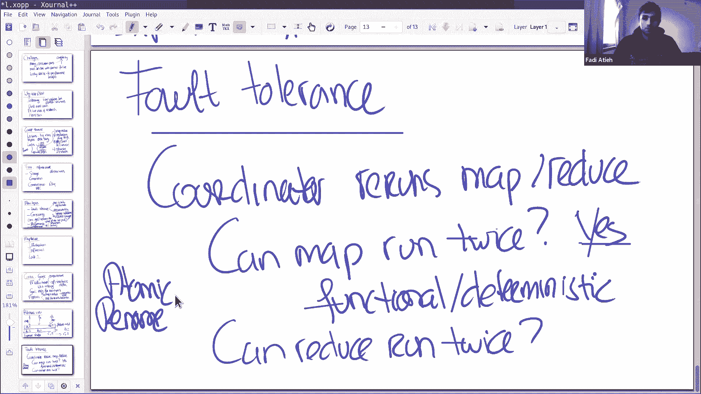

它是否会直接将其文件写入其他机器可见的位置，或者它只是将文件保存在文件系统中。它保存，map 函数总是在本地磁盘上产生结果，所以它在本地文件系统中。好的，所以即使你一次只做一个 map 任务。

在你做了多次的场景下，然后机器崩溃，你会丢失中间的工作，是吗。不，它位于文件系统中，所以当机器恢复时，可能东西就在那里。哦，我明白了。所以这些数据是持久化保存的。哦，我明白了，好的。

并且 map 或 reduce 函数直接访问，包含中间结果的机器。好的，让我快速谈谈其他几个失败，你们问的问题都是很棒的问题，这一切都会显现出来，当你实现 mapreduce 时，你必须决定你要怎么做。

所以还有其他几件事，协调器会失败吗？我不这样认为。没错，就像，是猫，协调器不能失败，所以当协调器失败时，整个作业必须重新运行。在这个特殊的实现中，他们没有协调器失败的计划，这使更强的容错性更困难。

因为它是一种状态，一种被修改的状态，每次 map 函数完成或 reduce 函数完成时，所以它是更复杂的，所以，这个特殊的库，协调器不能失败。我们在后面的学期会看到技术，我们可以用它来使协调器容错。

如果我们愿意，但他们决定不这么做。他们决定不这么做的一个原因是，因为一台机器，他们希望，运行协调器的那台机器不太会崩溃，更可能的是，运行 map 程序的数千台机器中的一台很可能会崩溃。好的？

那么慢的 worker 呢？另一种类型的失败，讨论机器可能会慢的问题，因为在上面运行的其他计算一样，比如 GFS 也在同一台机器上运行，可能它会使用大量的机器周期或带宽，或者可能硬件本身的问题。

他们有做什么特别的事吗？我想我读过一些关于，当工作接近尾声时，协调器将剩余的任务分配给另外的机器，防止有机器落后的情况，然后他们会取先完成的结果。是的。

速度慢的 worker 称为 straggler ，他们所做的是备份任务，比如，当他们接近，实际上，你会看到，当计算快要完成时，比如剩下几个 reduce 任务，或者剩下几个 map 任务。

协调器只是运行第二个实例，或者那个任务的第三个实例，在另一台机器上。这完全没问题，这样做完全没问题，对吧，因为它是函数式的，所以我们多次运行相同的计算是没有问题的，因为它产生完全相同的输出。

因为它的输入是相同的，希望这些实例中的一个能很快结束，因此，性能不受制于最慢的 worker ，而是那些被复制的中最快的。所以这是其中一个问题，这是一个应对 straggler 的普遍做法。

为了处理尾部延迟，就是试着复制任务，然后获取第一个完成的。好了，我想是时候结束了，你可以去上其他的课，但这些是一些主要问题，出现在 mapreduce 库中的，你很可能会艰难地进行。

实现 mapreduce 库最困难的部分，是做容错方面的工作，但是你应该记住，当你这样做时，所有使用或将要使用你的库的程序员，不用考虑所有的分布性，那些你必须去处理的。所以你处于不幸的情况。

你不是 mapreduce 论文的目标，让你轻松编写 mapreduce 程序，你在[等式]的另一边，你必须面对这种分布性，并成为一名专家。好的？我会在这里一段时间，所以如果你们想走，可以随意。

如果你想问更多的问题，可以随意提问。

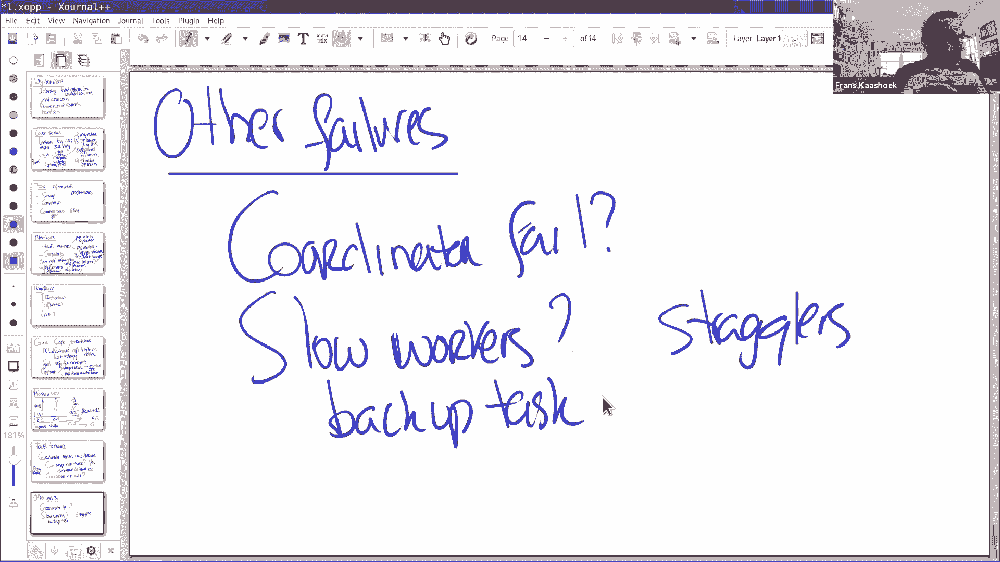