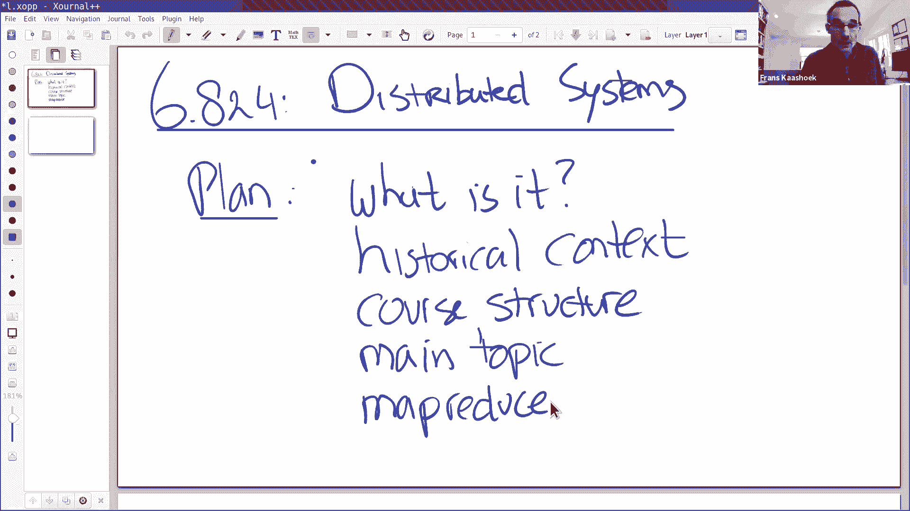
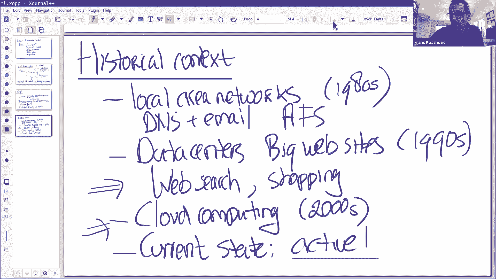
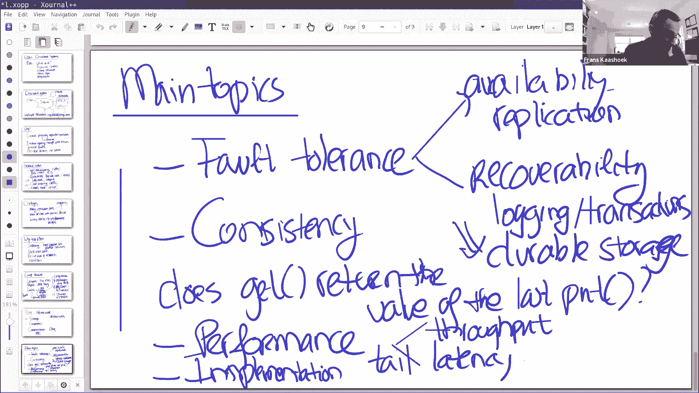
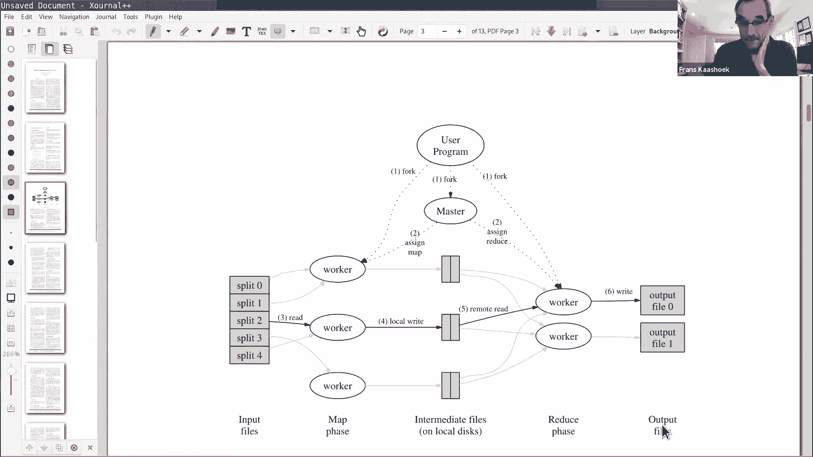

# 课程 P1：分布式系统导论 🚀


在本节课中，我们将要学习分布式系统的基本概念、其发展历史、核心挑战以及课程的整体结构。我们还将通过一个具体的案例研究——MapReduce论文，来初步了解分布式系统的实际应用。

## 什么是分布式系统？ 💻


分布式系统是由多台通过网络连接的计算机组成的集合。这些计算机只能通过发送和接收数据包进行交互，而不是像多处理器系统那样通过共享内存。它们协同工作，以提供某种服务。

从非正式的角度来说，分布式系统有四个关键词：**多台计算机**、**网络连接**、**数据包交互**和**协同服务**。通常，用户可能意识不到分布式系统的复杂性，例如在使用Zoom客户端时，其背后是庞大的数据中心在支持。

## 为什么需要分布式系统？ 🤔



一般来说，构建分布式系统有四个主要原因：

1.  **连接物理分离的机器**：允许位于不同地理位置的设备（如笔记本电脑、手机）连接到服务器，实现远程访问。
2.  **实现资源共享**：连接起来的计算机可以共享数据、计算资源或基础设施，支持协作（如文件共享、屏幕共享）。
3.  **通过并行提升性能**：将任务分配到多台机器上并行处理，可以显著提高处理能力和吞吐量，以支持大量并发用户（如Zoom会话）。
4.  **提高容错性与安全性**：
    *   **容错性**：部分机器故障不会导致整个服务停止，系统可以继续运行，实现高可用性。
    *   **安全性**：通过将敏感服务（如密码管理）隔离在独立的机器上，可以减少攻击面，提升安全性。


## 分布式系统的历史背景 📜


分布式系统大致始于20世纪80年代初的局域网（LAN）时代，例如MIT的Athena集群和AFS文件系统。早期的互联网应用主要是DNS和电子邮件。

其重要性在90年代随着数据中心的兴起而急剧增长。商业互联网的开放催生了大型网站（如搜索引擎、电子商务），这些应用需要处理海量数据和海量用户，单台计算机无法胜任。MapReduce等论文正是这个时期的产物。

2000年代中后期，云计算的出现进一步加速了发展。用户将计算和数据迁移到云端，云提供商（如亚马逊、谷歌、微软）建设了庞大的基础设施，使得构建大规模分布式系统变得更加容易。如今，分布式系统已成为一个极其活跃的研究和开发领域。

## 分布式系统的核心挑战 ⚠️

分布式系统之所以复杂，主要源于两个核心挑战：


1.  **大量并发组件**：现代数据中心可能并行运行数十万台计算机。管理如此多的并发进程，并确保它们正确协同工作，非常困难。
2.  **部分故障**：系统中的某台机器可能发生故障，而其他部分仍在运行。系统必须能够处理这种“部分故障”情况。更复杂的是，可能出现网络分区（即“脑裂”），导致系统的两部分彼此隔离但各自运行，这使得协议设计异常复杂。

此外，实现理论上的性能优势（如通过增加机器数量线性提升吞吐量）在实践中也颇具挑战性，因为任务往往无法做到完全并行。

## 课程6.824概述与结构 📚

选择学习6.824课程有多个原因：它涉及有趣且强大的技术解决方案；在现实世界中应用广泛；是活跃的研究领域；并且提供了独特的、构建分布式系统的实践经验。

课程结构主要包括以下几个部分：



*   **讲座**：围绕重要论文（案例研究）展开，探讨核心思想。课前阅读论文并回答问题至关重要。
*   **实验**：共有四个编程实验，是课程的核心。
    *   **实验1**：实现MapReduce库。
    *   **实验2**：实现Raft共识算法，构建复制状态机基础。
    *   **实验3**：基于实验2的库，构建一个容错的复制键值存储服务。
    *   **实验4**：构建分片键值服务，通过分片实现性能扩展和负载均衡。
*   **可选项目**：学生可以组队进行自选项目，替代实验4。
*   **考试**：包含一次期中考试和一次期末考试。

实验采用进程模拟多台机器，并使用自定义的RPC库进行通信。测试用例公开且具有挑战性，建议尽早开始。

## 课程核心主题 🔑


本课程将反复围绕以下几个核心主题展开：

1.  **容错**：
    *   **可用性**：在故障发生时继续提供服务。关键技术是**复制**。
    *   **可恢复性**：故障机器重启后能恢复状态并重新加入系统。关键技术是**日志/事务**。
2.  **一致性**：在并发和故障存在的情况下，系统对外表现出的行为。理想情况是表现得像一台顺序执行的单机。
    *   强一致性通常需要机器间通信，可能影响性能。
    *   实践中常需要权衡，例如采用**最终一致性**以换取更好的性能。
3.  **性能**：
    *   **吞吐量**：通过增加机器数量来提高。
    *   **延迟（尤其是尾部延迟）**：由最慢的机器或组件决定，是分布式系统中的一个关键难题。
4.  **并发管理**：在实现分布式系统时，如何正确、高效地管理并发操作，是一个持续出现的挑战。

这些目标（容错、一致性、性能）之间常常存在冲突，需要进行权衡。




## 案例研究：MapReduce 📄

MapReduce论文是分布式系统领域一篇极具影响力的论文。它源于Google处理海量网页数据（如构建倒排索引）的需求。目标是让普通工程师能轻松编写处理大数据集的分布式程序，而无需担心底层的容错、并行等复杂问题。


### MapReduce 编程模型

MapReduce采用特定的计算模型，程序员只需编写两个函数式（无状态、确定性）的函数：

*   **Map函数**：处理输入键值对，生成一组中间键值对。
    ```go
    // 示例：词频统计中的Map函数
    func Map(filename string, contents string) []KeyValue {
        // ... 解析内容，对每个单词word
        return []KeyValue{{word, "1"}}
    }
    ```
*   **Reduce函数**：接收一个键及其对应的所有值列表，进行归并处理，产生最终输出。
    ```go
    // 示例：词频统计中的Reduce函数
    func Reduce(key string, values []string) string {
        // ... 计算values中“1”的个数
        return totalCount
    }
    ```


MapReduce框架负责在多台机器上调度这些函数的执行，处理数据分发、容错等所有分布式细节。

### MapReduce 执行流程

1.  **Map阶段**：将输入文件分割，并由多个Worker并行执行Map任务，生成中间结果（存储在本地磁盘）。
2.  **Shuffle阶段**：框架根据中间键将数据重新分区和排序，确保同一键的所有值被发送到同一个Reduce任务。
3.  **Reduce阶段**：多个Worker并行执行Reduce任务，读取已排序的中间数据，调用Reduce函数，并将最终输出写入全局文件系统（如GFS）。

### MapReduce 的容错机制


*   **Worker故障**：Master（协调器）会周期性地Ping Worker。如果Worker无响应，Master会将其标记为失效，并将该Worker上已完成的或正在进行的Map/Reduce任务重新调度给其他Worker。
*   **任务重复执行**：由于网络延迟或Worker临时故障，同一个Map或Reduce任务可能会被多次执行。这之所以可行，是因为Map和Reduce函数被设计为**确定性**的，即相同的输入总是产生相同的输出。多次执行的结果是幂等的。
*   **应对慢节点（Straggler）**：当作业接近完成时，Master会启动剩余任务的“备份任务”（Speculative Execution）。多个Worker同时处理同一任务，取最先完成的结果，以避免个别慢节点拖慢整体进度。
*   **Master故障**：在论文描述的简单实现中，Master是单点，其故障会导致整个作业需要重启。更复杂的系统会采用复制等方式使Master具备容错性。

---


本节课中我们一起学习了分布式系统的基本定义、其发展历程、面临的核心挑战以及本课程（6.824）的结构和目标。我们还深入探讨了MapReduce这一经典案例，了解了它如何通过简单的编程模型和强大的框架，将分布式计算的复杂性隐藏起来，让开发者能够专注于业务逻辑。在接下来的课程和实验中，我们将继续探索分布式系统的其他关键技术和设计权衡。