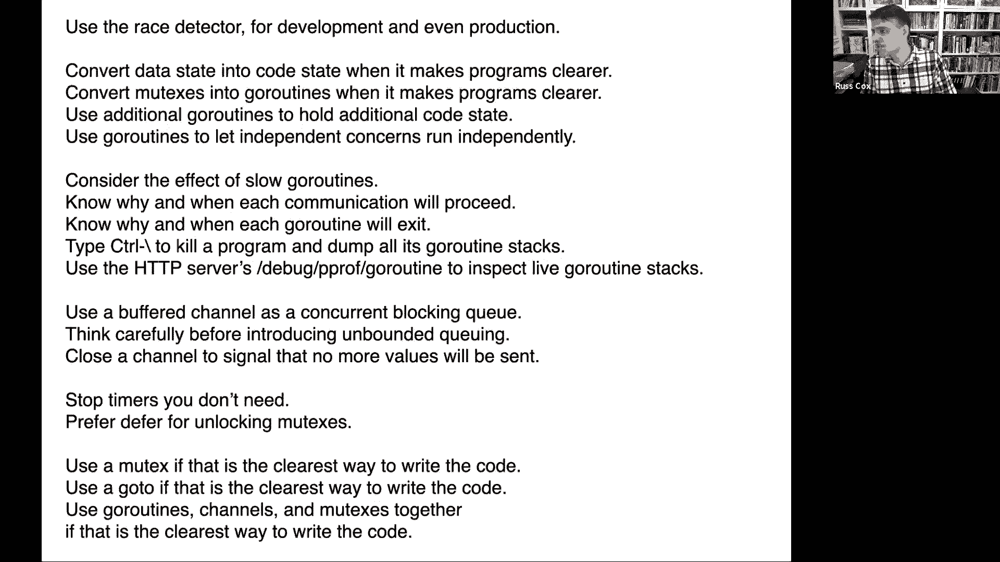

# P10：Lecture 10 - Guest Lecture on Go - Russ Cox - mayf09 - BV16f4y1z7kn

好的，下午好，早上好，傍晚好，晚上好，无论你在哪里。让我们重新开始吧。所以，今天我们有一个嘉宾课程，可能演讲者需要一些介绍，Russ Cox 是 Go 项目的联合负责人之一，我们会更多地讨论这个问题。

让我说几句话，不让 Russ 太尴尬，Russ 在分布式系统方面有着长期的经验，他是一个 Plan 9 的开发者和贡献者，当他是哈佛大学的本科生时，他参加了麻省理工学院的博士项目，我们在那里认识的。

如果你上过任何形式的 PDOS 课程，那里会有，你会看到 Russ 在上面的[工作]，当然，在 6。824 上，对我们来说，切换到 Go 是一件很棒的事情，但如果你有不同的意见。

当然可以向 Russ 提问并提出建议，他总是欢迎提出任何想法。就这样， Russ ，交给你了。太好了，谢谢，你们能看到幻灯片吗，还能用吗？好的，很好。所以我们构建 Go 支持编写分布式系统。

那些我们在 Google 构建的，Go 非常适合，下一代的云软件，也非常适合 6。824 。所以，在这节课中，我将试着解释，我是如何考虑用 Go 编写程序的。我将介绍程序的设计和实现。

通过常见的四种不同的模式。在此过程中，我将尝试强调一些提示或经验法则，你可以在设计自己的 Go 程序时牢记。我知道教学大纲链接到了一个较老版本的幻灯片，所以你可能已经见过它们了。

我希望课程的形式更容易理解，比只看幻灯片。我希望这些模式足够通用，或许它们自己能帮上忙，但是你也会，提示会帮助你做好需要实现的东西的准备。所以，首先区分并发性和并行性很重要。并发性是关于如何编写程序。

能够独立编排独立执行的控制流，无论你称它们为进程、线程还是 goroutine ，这样你的程序就可以同时处理很多事情，而不会变得一团糟。另一方面，并行性是关于程序是如何执行的，关于允许多个计算同时运行。

这样程序可以同时做很多事情，而不是一次处理很多事情。所以并发性很自然地适合并行执行，但今天的关注点是，如何使用 Go 的并发支持来使你的程序清楚，而不是让它们更快，如果它们变得更快了，那很好。

但这不是今天的重点。所以我说，我会通过一些程序的设计和实现，我经常看到的四种常见的并发模式，但在我们到达这些之前，我想从一个看似微不足道的问题开始，但这说明了一个最重要的点。

关于使用并发来构建程序意味着什么。在设计并发程序时，一种反复出现的决定，是将状态表示为代码还是数据。作为代码，我指的是程序中的控制流，假设从文件中读取字符，我们需要扫描一个 C 样式的引号字符串。哦。

你好，幻灯片没有变。是的，它会的，你现在能看到 goroutines 状态的序言吗？不，我们看到标题幻灯片。哦，不，是的，我在想这个问题，因为当我开始时，这里有一个[边框]环绕着，然后它就消失了。所以。

让我先取消分享，再重新分享。我必须弄清楚如何在 Zoom 中做这个。不幸的是， Keynote 菜单想要打开，我不知道怎么才能进入 Zoom 菜单。啊，我的屏幕分享暂停了，为什么我的屏幕分享暂停了。

我可以继续吗，我们开始吧。好的，我不知道，Zoom 说你的屏幕分享暂停了，所以，现在边框又回来了，所以我会看的。好的，我回到了这里，所以你读取一个字符串，这不是并行程序，一次读取一个字符。

没有并行的机会，但这是一个很好的并发机会。所以我们并不关心字符串中的确切转义序列，我们需要做的就是匹配这个正则表达式，我们不必担心要准确地理解，我们会回到它的意思上，但你所要做的就是实现这个正则表达式。

你们可能都知道，你可以将正则表达式转换为状态机，所以，我们可能会使用一个工具来生成这些代码，在这段代码中，只有一个变量状态，那就是机器的状态，循环遍历 state 一次一个字符，根据状态读取字符。

并且字符转为不同的状态，直到它到达结尾，所以这是一个完全不可读的程序，但这是一种东西，自动生成的程序可能看起来的样子。重要的一点是，程序状态存储在数据中，在这个变量中，称为状态。

如果你可以将其更改为将状态存储在代码中，这通常会更清楚。所以我的意思是，假设我们重复 readChar 调用到 switch 的每个 case 中，所以在这里我们没有做任何语义上的改变。

我们只是将顶部的 readChar 移到了中间。现在，不是设置 state ，然后立即执行 switch ，我们可以把它们改成 goto ，然后我们可以进一步简化一点。

这里有一个 goto state1 ，正好在 state1 标签之前，我们可以去掉它。然后，我想，是的，这里只有一种方法到达 state2 ，所以，我们不妨将 state2 代码拉上来。

并将其放到 goto 出现的 if 中，然后，现在 if 的两边最终都到 goto state1 ，所以，我们可以把它拿出来。现在剩下的是一个非常简单的程序，state0 永远不会跳入。

所以它只是从那里开始，然后 state1 只是一个常规循环，所以我们不妨让它看起来像一个常规的循环。现在，这看起来像是一个程序，最后，我们可以去掉一些变量，进一步简化。然后，我们可以旋转循环。

我们不会在循环中间返回 true ，我们在结束时返回 true 。所以现在我们有了这个程序，它相当不错，值得一提的是，有可能清理不那么令人震惊的例子，如果你试着手写这个，你的第一次尝试可能是左边的东西。

你得到了这个额外的状态，然后，你可以应用相同类型的转换，将状态移动到实际的控制流中，最终，同一个程序会变成右边这样，这个程序更清楚。所以这是一个有用的转换，任何时候你有状态，这看起来像是在[重申]。

程序计数器里发生了什么。所以你可以看到，如果是原始 state ，如果 state 等于 0 ，程序计数器在函数的开始处。

如果 state 等于 1 或者如果 inEscape 等于 false 或其他版本，程序计数器就在 for 循环内，而 state 等于 2 在 for 循环中更靠下。

这样写而不是使用 state 的好处，是它更容易理解，比如我可以浏览代码并向你解释，如果你通读代码，你读到一个左括号，然后开始循环，然后直到你找到右括号，你读取一个字符，如果下一个字符是反斜杠。

你就跳过下一个字符，这就对了，你可以从纸上读它，这是你在原始（代码）中做不到的。这个版本也碰巧运行得更快，尽管这对我们来说并不重要。但正如我提到的，我将强调我认为重要的教训。

作为设计你自己的 Go 程序的提示，这是第一个，将数据状态转换为代码状态，它会使你的代码更清楚。再说一次，这些都是暗示，对于所有这些，你应该考虑它，你确定它有帮助的时候。所以，这个提示的一个问题是。

并不是所有的程序都有权完全控制它们的控制流，所以这里有一个不同的例子，不是有一个可以调用的 readChar 函数，这个代码是使用 ProcessChar 方法，你必须一次传递给一个字符。

然后 ProcessChar 别无选择，只能编码 state 到一个显示的 state 变量，因为在每个字符之后，它必须返回，所以它不能保存 state 在程序计数器和栈中。

它必须有 state 在实际变量中。但是在 Go 中，我们有另一个选择，因为我们不能把 state 保存到栈和程序计数器中，但我们可以创建另一个 goroutine 为我们保持状态。所以。

假设我们已经有这个调试 readString 函数，我们不想以其他方式重写，我们只是想重复使用它，它可以工作，也许它很大很复杂，它比我们看到的任何东西都要复杂，我们只是想重复使用它。所以。

我们在 Go 中做到的方法是，我们可以启动一个新的 goroutine 来完成 readString 部分，readString 与之前相同，我们传递[字符读取]。现在。

 Init 方法使这个 goroutine 执行字符读取，然后，每次调用 ProcessChar 方法时，我们通过 char channel 发送一个消息给 goroutine ，表示这是下一个字符。

然后我们收到一条消息，表示告诉我当前的 status ，当前 status 总是，要么是我需要更多的输入，或者它是不是好的。所以，这让我们可以移动程序计数器，那个我们不能在第一个栈上完成的。

到 goroutine 的另一个栈中。所以，使用额外的 goroutine 是保存额外代码状态的好方法，并让你有能力进行这种清理，即使问题的原始结构看起来做不到。Russ 。继续。

我想你不介意别人问你问题。是的，当然。我只是想确认一下。是的，当然可以，请随意打断。所以，这里的提示是，使用额外的 goroutine 来保存额外的代码状态，但有一点需要注意。

创建 goroutine 不是免费的，你必须确保它们退出，否则，你会把它们累积起来。所以你必须考虑，为什么 goroutine 会离开，比如它会被清理干净吗。在这种情况下，我们知道 q。

parse 将会返回，q。parse 在哪里。抱歉，这不对。哦，抱歉，这里的 readString ，readString 会返回，任何时候它发送一个消息，表示需要更多输入。在哪里。

这张幻灯片遗漏了一些东西。抱歉，我昨晚才写的这些。所以当我们进去的时候，我们进入了 Init ，我们启动这个 goroutine ，它将多次调用 ReadChar ，然后我们读取一次 status 。

第一个 status 就会发生，因为第一次调用 readString 的 ReadChar，会说我需要更多的输入，然后我们会发回一个字符，我们会在 ProcessChar 中发回字符，然后。

每次调用 ProcessChar 时，它返回一个 status ，所以直到你需要更多的输入，你会得到。抱歉，这不起作用，每次你想读取一个字符时，都会得到更多的输入。然后当它完成读取字符后。

我在这里没有展示的，似乎是遗漏的东西，当事情退出时。让我们看看，它是否在这张幻灯片上。是的，所以有一个 return Success 和一个 return BadInput ，这是我忘记的。所以。

这些返回不同的 status ，然后就完成了。所以，当 ProcessChar ，在 readString 版本中，当它返回 BadInput 或 Success 时，这件事已经完成了。当调用者继续。

调用直到它得到一些东西，不需要更多输入，然后 goroutine 就会结束，但是如果我们早点停止，如果调用者遇到 EOF 并自动停止，没有告诉我们已经完成，会有一个 goroutine 剩下，所以。

这会是一个问题。所以你需要确保，什么时候以及为什么 goroutine 会退出，好的是，如果你出现一个错误，你让 goroutine 卡住了，它们只是在那里，像是世界上最好的 bug 。

因为它们只是在那里，等着你看它们，你要做的就是记住去寻找它们。所以这是一个非常简单的程序，这些 goroutine 运行一个 http 服务，如果我们运行这个程序。

它会启动很多 f goroutine ，它们都会阻塞尝试发送到一个 channel ，然后它成为 http 服务器。所以如果我运行这个程序，它就会停在那里，如果我在 Unix 系统上输入 ^\ 。

我得到一个 SIGQUIT ，这使它崩溃，并 dump 出 goroutine 上的所有栈。你可以在幻灯片上看到，它会一遍又一遍地打印，这是一个 goroutine ， h 调用自 g 调用自 f 。

在 channel send 中。如果你看一下行号，你可以确切地看到它们在哪里。另一种选择是，因为我们是在 http 服务器中，http 服务器导入了 net http pprof 包。

你可以访问 http 服务器的 /debug/pprof/goroutine 链接，这会给你所有运行的 goroutine 的堆栈，与 crash dump 不同，它做了更多的努力。

它根据它们的堆栈复制 goroutine ，然后根据每个堆栈的[数量]对它们进行排序，所以如果你有 goroutine [泄漏]，[泄漏]出现在最高层。在本例中。

你获得 100 个 goroutine 堆栈，h 调用自 g 调用自 f ，然后我们可以看到还有其他 goroutine ，我们并不是关心它们。所以这是一个新的暗示，它非常有用。

通过这个端点获取 goroutine 堆栈。好的，这算是热身了。现在我想看看第一个真正的并发模式，就是发布订阅服务器。发布订阅是组织程序的一种方式，你将不同部分解耦。

将发布有趣事件的部分与订阅它们的部分（解耦），中间有一个发布订阅服务器，连接这些，所以，单独的发布者和订阅者，不需要知道其他的确切身份。比如在你的安卓手机上，一个应用可能发出电话呼叫事件。

然后拨号可能会订阅它，然后开始帮助拨号。所以，在真正的发布订阅服务器上，有方法可以根据事件的类型过滤事件，当你发布一个电话事件时，它不会进入你的电子邮件程序。但是现在，我们只假设过滤是单独处理的。

我们只是考虑发布和订阅，以及它的并发性。所以这是我们想要实现的 API ，任意数量的客户端，可以调用 Subscribe 使用一个 channel ，之后，发布的事件将发送到那个 channel 。

然后当客户端不再感兴趣时，它可以调用 Cancel 并传递相同的 channel ，表示停止向那个 channel 发送事件，而 Cancel 的方式将发出信号。

当它完成发送事件到那个 channel ，它将关闭那个 channel ，这样接收方呼叫方可以继续接收事件，直到它看到 channel 关闭，然后它知道 Cancel 已经生效。

所以注意到信息只在 channel 上单向流动，你可以发送到 channel ，然后接收者可以从它那里接收，信息从发送者流向接收者，它从来不会走另一条路。所以关闭也是发送者给接收者的信号。

但是所有的发送都结束了，接收者不能关闭 channel，告诉发送者我不希望你继续发送，因为这是相反方向的信息。所以这会更简单，如果信息只有一个方向，当然，如果你需要双向通信。

你可以使用两个 channel ，事实往往是，这些不同的方向可能有不同类型的数据流动，就像我们之前看到的，runes 是一个方向，status 更新是另一个方向。那么我们如何实现这个 API 。

这里有一个非常基本的实现，它可能已经足够好了。我们有一个 Server ，Server 状态是注册发布者的 map ，由锁保护，我们初始化 Server 通过分配 map ，然后，为了发布事件。

我们只需把它发送到每个注册 channel ，为了订阅新 channel ，我们只需把它添加到 map ，为了取消，我们把它从 map 中删除。然后，因为这些都是。

这些都是可以从多个 goroutine 调用的方法，我们需要调用 lock 和 unlock 来保护 map ，注意我在 lock 之后写了 defer unlock 。

这样我就不用记得之后 unlock 了，你们可能都见过这个，一个不错的 lock unlock 的习惯用法，然后我有一个空行，让它在代码中有自己的段落。我想指出的一件事是。

使用 defer 可以确保 mutex 被解锁，即使函数有多个返回值，所以你不会忘记，但它也能确保，在你出现 panic 时，会被解锁，比如在 Subscribe 和 Cancel 中。

有 panic 的滥用。这里有一个微妙的地方，如果你可能不想解锁 mutex ，如果 panic 发生在，被锁定的东西处于某种不一致的状态时，但我暂时忽略这一点，一般来说。

你尽量避免发生可能会引起 panic 的事情，当你可能处于不一致的状态时。我还要指出，在 Subscribe 和 Cancel 中使用 panic ，隐含你信任你的客户端不会滥用该接口。

这是一个程序错误，值得拆解整个程序，才有可能发生这种情况。在一个更大的程序中，其他客户端正在使用这个 API ，你可能希望返回一个错误，而不会可能让整个程序停止，但目前， panic 让事情变得简单了。

错误处理不是今天的主题。与 panic 相比，这个代码更重要的问题是，如果 goroutine 接收事件的速度很慢，会发生什么？所以这里的所有操作都完成了持有 mutex 。

这意味着所有的客户端都必须步调一致。所以在 Publish 中，有一个循环在 channel 发送，将事件发送到每个 channel ，如果一个订阅者落后了，下一位订阅者不会收到事件。

直到缓慢的订阅者醒来，并从 channel 上获取事件。所以，一个速度慢的订阅者可能会拖慢其他所有人的速度，强迫它们这样步调一致地进行并不总是一个问题，如果你记录了限制，无论出于什么原因。

你知道客户端是如何编写的，你知道它们永远不会落后太多，这可能完全没问题，这是一个非常简单的实现，而且它有很好的属性，比如从 Publish 返回，你知道事件已经被移交给其他每个 goroutine 。

你不知道它们已经开始处理了，但你知道它已经被转手了。所以，也许这已经足够好了，你可以停在这里。第二种选择是，如果你需要容忍订阅者稍微慢一点的话，然后你可以说。

它们需要为你提供一个缓冲区 channel ，有空间在缓冲中有一些事件，这样当你发布的时候，只要它们不在太远的后面，总是有空间让新事件进入 channel 缓冲区，然后。

 Publish 不会阻塞太长事件。再说一次，也许这已经足够好了，如果你确定它们永远不会落后太多，你可以到此为止。但是在一个非常大的项目中，你希望更优雅地处理任意缓慢的订阅者。

所以接下来的问题是你会做什么。通常你有三个选择，你可以降低事件生成器的速度，这是以前的解决方案隐含的做法，因为发布停止，直到订阅者跟上。或者你可以删除事件，也可以对任意数量的过去事件进行排队。

这几乎是你唯一的选择。所以我们讨论了发布和减慢事件生成器的速度。有一个中间立场，你可以合并这些事件，也可以丢弃它们，这样订阅者可能会发现，嘿，你错过了一些事件，我不能告诉你它们是什么。

因为我没有保存它们，但我至少要告诉你，你错过了五个事件，然后，也许它可以做一些事情来试图赶上。这是我们在 profiler 中采用的方法，在 profiler 中，如果你使用过它，如果。

有一个 goroutine ，通过分析事件在一个信号处理器中填充了[分析]，然后有一个单独的 goroutine ，它的工作是读出数据，将其写入磁盘或发送到 http 请求。

或者任何你使用分析数据所做的。这中间有一个缓冲区，如果来自分析数据的接收者落后，当缓冲区填满时，我们开始添加最终分析条目，它只有一个条目。

它是一个函数名为 [runtime last profile data] ，所以如果你看一下 profile ，你看到程序花了 5% 的时间在[最后的]分析数据上，这意味着分析读取器太慢了，它没有跟上。

我们丢失了一些 profile ，但我们很清楚知道 profile 中的错误率是多少，你几乎看不到这一点，因为所有的读取者都跟上了，但是为了防止它们没有，你有一个很清晰的信号。

一个纯粹丢弃事件的例子是系统信号包，那里你必须通过一个 channel ，它做好接收信号的准备，像 SIGHUP 或 SIGQUIT 这样的信号，当信号进来的时候。

运行时尝试向订阅这个信号的每个 channel 发送，如果它不能发送给它，它就不发送，它就会消失，因为在信号处理器里，我们不能等待，所以调用者必须做的是，它们必须传递给缓冲 channel 。

如果它们传递给缓冲 channel ，缓冲长度至少为 1 ，它们仅把 channel 注册到单个信号，那么如果有信号进来，你肯定会被告知这件事，如果它进来两次，你可能只会被告知一次。

但这与 Unix 为信号处理提供的语义相同，所以这很好。所以，这两个都是放弃或合并事件的例子。然后第三种选择是，你可能不想丢掉任何事件，它可能很重要，你不能丢失任何东西，在这种情况下。

你可以对任意数量的事件进行排队，你可以通过某种方式安排程序，保存慢订阅者没有看到的所有事件，稍后将它们提供给订阅者。在你这么做之前，仔细考虑一下是很重要的，因为在分布式系统中，总是有速度慢的计算机。

总是有计算机下线或者别的什么，它们可能会离开一段时间，一般来说，你不想引入无界队列，在这样做之前，你需要非常仔细地考虑，想想，无界是多么的[]，我能忍受吗。所以。

这就是为什么 channel 没有有无界缓冲的原因，这几乎从来都不是正确的选择，如果这是正确的选择，你可能要非常仔细地构建它。但是我们将构建一个，看看它会是什么样子。在此之前，我想稍微调整一下程序。

所以我们在代码中有这个 mutex ，mutex 是保持状态的一个例子，你是否在状态变量中加锁，但我们也可以把它移到程序计数器变量中，把它放在不同的 goroutine 中。在本例中。

我们可以启动一个新的 goroutine ，它运行一个名为 s。loop 的程序函数，它处理在三个新 channel 上发送的请求，publish subscribe 和 cancel 。

在 Init 中，我们创建 channel ，然后启动 s。loop 。而 s。loop 则是前面方法体的一种合并，它从三个 channel 中的任何一个接收。

publish subscribe 或 cancel 请求，它会做任何被要求的事情，现在 subscriber map 可以只是 s。loop 中的一个局部变量。所以这是相同的代码。

但是现在这些数据显然归 s。loop 所有，其他任何东西都不能访问它，因为它是一个局部变量。然后，我们只需要更改原始方法，将工作发送到 loop goroutine 。

大写的 Publish 现在发送给小写的 publish channel ，事件想要发送的（channel），类似地 subscribe 和 cancel 。它们创建具有 channel 的请求。

我们想要订阅，也有一个 channel 可以获得回复，它们将其发送到循环中，循环返回答案。我将程序的这种转换方式称为，将 mutex 转换为 goroutine 。

因为我们获取了 mutex 的数据状态，里面有一个锁位，现在锁位隐含在循环的程序计数器中。很明显，发布和订阅不能同时发生，因为这只是单线程代码，只是序列执行。另一方面，原始版本有一种类似的状态清晰度。

在那里你可以对它进行检查，推出这是一个重要的状态，在 goroutine 版本中，比较难看出什么是重要的状态，附带的状态是有一个 goroutine 。在给定的情况下，其中一个可能比另一个更重要。

几年前，我做了所有的实验，当它换成 Go 的时候，raft 是一个很好的例子，你可能更喜欢使用 mutex 状态，因为 raft 与大多数并发程序非常不同，每个复制节点对自己的状态的不确定性。

比如状态转换，一瞬间你是领导者，下一瞬间你被罢免，比如一瞬间你的日志有 10 个条目，下一瞬间只有 2 个条目，为了能够直接操纵这种状态，而不是不得不以某种方式进出程序计数器。

对于 raft 来说更有意义。但在大多数情况下，这是非常独特的，将状态放在程序计数器中更清楚。好的，为了应对缓慢的订阅者，现在我们将添加一些 helper goroutine 。

它们的工作是管理特定的订阅者积压，并防止整个程序被阻止。这就是 helper goroutine ，主循环 goroutine 会将事件发送给 helper ，我们信任的，因为是我们编写的。

不会随意落后，然后， helper 的工作是对事件进行排队，并将其发送给订阅者。好的，这里有两个问题。第一个是，如果队列中没有任何东西，则 select 尝试提供 q[0] 是错误的，事实上。

仅仅计算 q[0] ，select 的开头就会出现 panic ，因为队列是空的，因此，我们可以修复这些，通过将参数与 select 分开设置，我们需要创建一个 channel sendOut 。

它会是 nil ，它永远不能在 select 中进行，正如我们知道的，当我们不想发送，它将成为实际的 out channel ，当我们想要发送时，然后我们必须有一个单独的变量，来保存我们要发送的事件。

它从 q[0] 读取，如果队列中有东西。错误的第二件事是，我们需要处理输入 channel 的关闭，因为当输入 channel 关闭时，我们需要[冲掉]剩下的队列。

然后我们需要关闭输出 channel 。所以，为了检查这一点，我们修改 select ，从 e 等于从 in 接收，变为 e， ok 等于从 in 接收，逗号 ok 将会表示。

channel 是否发送真正的数据，否则它是关闭的。所以当 ok 为 false 时，我们可以把 in 设置为 nil ，表示我们停止从 in 接收，那里没有东西，我们被告知它已经关闭了。然后。

当循环正常时，当队列最终为空时，我们可以退出循环，所以，我们更改了 for 条件，表示我们希望继续执行循环，当输入 channel 为真时，并且有一些内容要写回输出 channel 。

一旦这两个都不再为真，是退出循环的时候了，我们关闭输出 channel ，我们就完事了。现在我们已经正确地传播了，输入 channel 的关闭到输出 channel ，所以那就是 helper 。

而 Server loop 过去是这样的，为了更新它，我们只需修改订阅者 map ，之前它是一个从订阅者 channel 到 bool 的映射，基本上只是一个 set 。

现在它是从订阅者 channel 到 helper channel 的映射，每次我们收到新的订阅，我们创建一个 helper channel ，我们启动一个 helper goroutine 。

我们将 helper channel 记录在订阅映射中，而不是实际的 channel 中。然后，循环的其余部分几乎没有改变。所以我想指出的是，如果你想使用不同的策略，对落后太多的客户端。

这些都可以放在 helper goroutine 中，现在屏幕上的代码完全没有变化，所以，我们完全分离了 pubish subscribe ，维护了订阅者的列表映射，如果事情变得太慢，你会怎么做。所以。

这非常好，你将关注点清晰地分离到完全不同的 goroutine 中，这可以帮助你的程序更简单。这就是一般的提示，你可以在很多时候使用 goroutine 来分离独立的关注点。好的。

今天的第二个模式是工作调度器，你在第一个实验 mapreduce 中做了一个，我要做的就是它，这并做不所有的 RPC 功能，它只是在某种程度上假设，一种基于 channel 的接口，对于所有服务器。

所以我们有这个函数 Schedule ，它使用一个 servers 列表，和一个运行的任务数，它有一个抽象的函数调用，你可以调用它在特定的服务器上运行任务，你可以想象，它是做 RPC 等事情。所以。

我们需要一些方法，来跟踪哪些服务器可用于执行任务。一种选择是使用我们自己的堆栈或队列实现，但是另一种选择是使用 channel ，因为它是一个很好的同步队列。

因此我们可以发送到 channel 以添加到队列中，然后从它那里得到一些东西。在本例中，我们将队列设置为服务器队列，我们将从一个空闲的服务器队列开始，现在没有为我们做任何工作的服务器。

我们开始对它进行初始化，通过将所有已知服务器发送到 idle 列表。然后我们可以循环执行任务，对于每一项任务，我们都启动一个 goroutine ，它的工作是将一个 server 从空闲列表中拿出。

运行任务，然后重新把 server 放回。这个循环是使用 goroutine 的早期提示的另一个示例，比如独立的事情独立运行，因为每个任务都作为单独的关注点运行，它们都是并行运行的。不幸的是。

这个程序有两个问题。第一个是作为新的 goroutine 运行的闭包，引用循环迭代变量，即 task ，所以当 goroutine 开始执行时，循环可能继续，并完成 task++ ，所以。

它得到了错误的 task 值。你可能已经看过了，当然，捕捉到这种情况的最好方法是，运行竞态检测器。在 Google ，我们甚至鼓励团队，设置金丝雀服务器来运行竞态检测器，并将大约 0。

1% 的流量分给它，为了抓住可能存在于生产系统中的竞争。用竞态检测器找到一个 bug，比之后不得不调试一些错误要好。所以，有两种方法可以修复这个竞争，第一种方法是给闭包一个显式参数并将其传入。

Go 语句需要专门为此进行的函数调用，所以你可以设置特定参数，在原始 goroutine 的上下文中计算的，然后复制到新的 goroutine ，所以在本例中，我们可以声明一个新参数 task2 。

我们可以将 task 传递给它，然后在 goroutine 中，task2 是一个完全不同的 task 的复制，我把它命名为 task2 只是为了让它更容易讨论。当然，这里有一个 bug 。

这个 bug 是，我忘了更新函数内的 task ，引用 task2 而不是 task ，我们基本上从来不这样做，取而代之的是，我们给它相同的名字，所以，现在是不可能的。

对于 goroutine 中的代码引用错误的 task 复制。这是修复竞争的第一种方法，还有另一种方式是，第一次看到它时，你会觉得有点神秘，但这等同于一件事，也就是，你只需在循环体内复制变量即可。

所以每次 ：= 的时候，就产生一个新的变量，所以在外部 for 循环中，开头有一个 ：= ，而循环的其余部分中没有，所以这是整个循环的一个变量，如果我们在函数里放一个 ：= ，每次我们运行循环的迭代时。

都是一个不同的变量，所以，如果 Go 函数闭包捕获了那个变量，那些都是截然不同的。所以我们可以做和 task2 一样的事情，这一次我记得更新函数体，但是像以前一样，很容易忘记更新函数体。

所以通常写 task ：= task ，第一次看到它时有点神奇，但这就是它的作用。好的，我说程序中有两个 bug ，第一个是任务的竞争，第二个问题是，在启动所有任务后，我们没有做任何事情。

我们不是在等它们完成。尤其是，我们启动得太快了，因为如果有一百万个任务就会启动一百万个 goroutine ，它们都会坐在那里等待五个服务器中的一个，这是一种有益的做法。所以，我们所能做的是。

将下一个空闲服务器的从 goroutine 中拿出。我们把它从 goroutine 上拉出来，现在，我们仅在有空闲服务器可用时启动 goroutine 。然后我们就可以开始，使用那个服务器。

然后把它放回去，使用服务器并将其放回并发运行，但是在循环内获取空闲服务器会减慢速度，现在只有正在运行的服务器数量，而不是任务数量。而接收器产生一些背压来减慢循环，因此，它不会走得太远。然后我提到。

我们必须等待任务完成，所以我们可以在循环的末尾做到这一点，再次查看列表并取出所有服务器，我们已经从空闲列表中删除了合适数量的服务器，这意味着它们都完成了。所以这就是完整的程序。对我来说，最重要的部分是。

你仍然可以编写一个 for 循环来迭代任务，在很多其他语言中，你必须使用状态机或某种回调来完成，你不能奢侈地在控制流中对此进行编码，所以这是一种更干净的方式，你可以只使用常规的循环。

但是我们可以做一些改变，一些改进，一个改进是注意到，在特定时间，只有一个 goroutine 向服务器发出请求，所以，不是为任务分配一个 goroutine 。

也许我们应该为每个服务器分配一个 goroutine ，因为服务器数量可能会少于任务数量。要做到这一点，我们必须从一个由空闲服务器组成的 channel。

转变为一个由尚未完成的任务组成的 channel ，所以，我们将空闲 channel 重命名为 work 。然后我们还需要一个 done channel，来计算完成了多少任务。

这样我们知道什么时候完全完成了。所以这里有一个新的函数 runTasks ，这将是每台服务器的函数，我们为每个服务器启动一个。runTasks 它的工作是在 work channel 上循环，运行任务。

当服务器完成时，我们发送 true 给 done ，服务器告诉我们它已经完成了，当 work channel 关闭时，服务器退出，这让 for 循环停止。然后你启动了服务器，我们可以在一个循环中。

将每个任务发送到 work channel ，关闭 work channel ，表示没有更多的工作要做了，所有服务器应该完成，然后退出，然后等待所有的服务器告诉我们它们完成了。所以在实验里。

有一些复杂的东西，一个是，你可能会在任何时间获得新服务器，我们可以修改它，通过说服务器来自 channel string ，这非常适合目前的结构，当你获得新的服务器时。

你只需要启动一个新的 runTasks goroutine ，所以我们现在唯一需要修改的是，把这个循环放入自己的 goroutine 中，当我们向服务器发送任务时，我们仍然可以接受新的服务器。

并启动 runTasks goroutine 。但是现在我们遇到了这个问题，我们没有一个好的方法，来判断所有的服务器什么时候都完成了，因为我们不知道有多少台服务器，我们可以尝试保持服务器到来的数字。

但这有点棘手，取而代之的是，我们可以计算已经完成的任务的数量，所以我们把发送 true 给 done [向上对齐]，不是对每个服务器执行这个操作，我们现在每个任务这样做，在循环结束时，在函数结束时。

我们只需等待合适数量的任务完成即可。所以，现在我们又一次知道为什么这些将会结束，这里仍然有死锁，也就是，如果任务的数量太大，事实上，我认为总是这样的，你会得到死锁，如果你运行这个程序，你得到这个好东西。

它告诉你，你的 goroutine 停止了，问题是，我们有这个 runTasks 服务器循环，服务器循环试图说，嘿，我完成了，你想说，嘿，还有更多的工作要做，如果你有不止一个任务，你就会陷入死锁。

当你尝试将下一个任务发送到服务器时，我想这是比服务器多的任务，你尝试将下一个任务发送到服务器，所有的服务器都尝试说，嘿，我完成了前一项任务，但你不是在那里接收来自 done channel 的。

所以再一次， goroutine 等待是很好的，等着查看它们。我们可以解决这个问题，解决这个问题的一种方法是添加一个单独的循环，它执行一个 select ，要么发送一些 work 。

或者一些工作完成的计数，那很好，但更干净的方式是，就是把 task 发送循环，并将其放入自己的 goroutine 中，所以现在它独立于计数循环运行，计数循环可以运行，未阻塞的服务器某些任务已完成。

而其他任务仍在发送中。但解决这一问题最简单的办法是，把 work channel 做得足够大，你永远不会用完空间。因为我们可能会决定，一个 goroutine 的 task 是，任务有几千字节。

但是 channel 中的整型是 8 个字节，所以，你可能会在每个任务上花费 8 个字节。所以如果可以的话，你只要把 work channel 做得足够大，你知道发送给 work 的不会阻塞。

你总是很快地进入到最后的计数循环。这样做为实验中的其他[]做好了准备，那就是有时调用可能会超时，在这里，我通过调用返回一个 false ，表示它没有工作。所以，在 runTasks 中，很容易看出。

很容易看出，如果调用失败，那么，抱歉，如果调用成功，你就完成了，但如果失败了，就把这项任务重新放回 work 列表中，因为它是一个队列，而不是一个堆栈，把它放回 work 列表中，会把它交给其他服务器。

所以，这很可能会成功，因为它是另一台服务器，这都是假设的，但这是一个非常，它非常适合我们创造的结构。好的，最后的修改是，因为服务器 goroutine 发送工作，我们必须等到关闭它，直到它们发送完毕。

因为在它们完成发送之前，你不能关闭。所以我们需要把 close 移动到，我们数完所有任务之后，有时我们会走到这一步，人们会问为什么你不能直接杀死 goroutine ，比如为什么不能说。

在这一点上杀死所有的服务器 goroutine ，我们知道它们不再需要了。答案是 goroutine 有状态，它与程序的其余部分相互作用，如果它突然停止了，有点像卡住了，也许它持有一把锁。

也许是在通信的过程中，与一些其他等待回复的 goroutine 。所以我们需要想办法更优雅地关闭它们，那就是明确地告诉它们，嘿，你完成了，你可以走了，然后它们可以清理它们需要清理的东西。说到清理。

我们还有一件事要做，就是关闭正在监视新服务器的循环，所以我们必须在这里放一个 select ，在那里在服务器 channel 上等待新服务器，我们必须去告诉它，好的，我们已经完成了，停止监视新服务器。

所有的服务器都不见了。我们可以把这个问题变成调用者的问题，但这是相当容易做到的。好的，这里是模式 3 ，一个复制服务的客户端。这是是我们要实现的接口，我们有一些服务，我们想要它为了可靠性是复制的。

客户端可以与这些服务器中的任何一个进行交互，所以复制的客户端给一个服务器列表，Init 的参数是服务器列表，还有一个函数允许你调用其中一个服务器，使用特定的参数，并获得回复。然后在 Init 的过程中。

复制的客户端提供一个调用方法，不会告诉你它将使用哪个服务器，它只是寻找一个好的服务器来使用，它尽可能长时间地使用同一服务器，直到它发现服务器不好为止。所以，在这种情况下，你几乎不需要共享状态。

从一次调用到下一次调用唯一保持的状态是，我上次使用的服务器，因为我要尝试再用一次。所以在这种情况下，使用 mutex 是完全没有问题的，我只想把它留在那里，使用 mutex  总是可以的。

如果这是编写代码的最干净的方式。有些人从我们谈论 channel 的次数中得到了错误的印象，但是，如果需要的话，使用 mutex 总是可以的。所以现在我们需要实现这个复制 Call 方法。

它的工作是尝试发送到许多不同的服务器，但是首先尝试一下原来的服务器。那么，如果尝试失败了意味着什么呢，没有明确的方法让它在上面失败，它只是总是返回一个回复，它失败的唯一方式是如果它花的时间太长。

所以我们假设，如果花了太长时间，就意味着它失败了。所以，为了应对超时，我们必须在后台的另一个 goroutine 中运行该代码。所以我们可以做这样的事情，在那里我们设置了超时，我们创建一个计时器。

然后使用 goroutine 在后台发送，然后在最后，我们等待，要么得到超时，要么得到实际的回复，如果我们得到了实际的回复，我们会返回它，如果我们得到超时，我们就得做点什么，我们必须弄清楚该做什么。

必须指出，你必须调用 t。Stop ，否则定时器位于定时器队列中，它将在一秒钟内退出，所以如果这个调用花了一毫秒，你有一个计时器等待下一秒，然后你在一个循环中做这个，你有一千个定时器在那个队列里。

在它们开始消失之前。所以，这是一种在 API 中的工作，但它一直在那里，我们没有修复它，所以你只需要记得调用 stop 。然后现在我们必须弄清楚，在超时的情况下我们该怎么做。所以，在超时的情况下。

我们需要尝试不同的服务器，所以我们要写一个循环，我们将从 id 0 开始，如果收到回复，那很好，否则我们将重置超时，并再次循环，并尝试发送到不同的服务器。注意到。

这个程序中只有一个 done channel ，所以，在循环的第三次迭代中，我们可能会等待，然后最后第一个服务器给我们一个回复，这完全没问题，我们会接受这样的回复，这很好，所以我们会停下来，并把它返回。

但是，如果我们把整个循环都做完，这意味着我们已经将请求发送到每一台服务器，在这种情况下，不会再有超时，我们只需要等它们中的一个回来，这就是[]的接收和最终的返回。然后需要注意的是。

 done channel 现在是带缓冲的，所以，如果你将结果发送到三个不同的服务器，你将接受第一个回复，然后返回，但其他人也想要发送响应，我们不希望这些 goroutine 永远在那里。

试图发送到一个我们没有读取的 channel ，所以，我们将缓冲区设置得足够大，它们可以发送到缓冲区，然后离开，然后 channel 会被垃圾收集。我们在聊天中有一个问题，问题说。

为什么计时器不能被垃圾收集，在没有人引用它的情况下，而不是在它离开时等待，你说会有多个等待，如果它在一毫秒内离开。问题是计时器被运行时引用，它在活动计时器列表中。

调用 stop 会将其从活动计时器列表中删除。所以，可以说，这是一种工作，就像在定时器的特定情况下，就像是只有在这个 channel 中才会被使用，我们可以有特殊的情况，通过拥有 channel 。

因为计时器内部是这个 t。C channel ，所以我们可以有一种不同类型的 channel 实现，内部表示，嘿，我是一个定时器 channel ，然后就像它上面的 select 注意到退出。

但如果你放手，它就会消失。我们想过这么做有一段时间，但我们从来没有这样做，所以，这就是 Go 的现状。但是你知道垃圾收集器不能区分，运行时内部的引用和程序的其余部分的引用，这些都只是引用，所以。

在我们使用某些方法对这个 channel 进行特殊处理之前，我们无法摆脱这一点。谢谢。当然。所以我们剩下的唯一一件事是，我们尝试使用与上一次相同的 id 。为了实现这一偏好。

我们在结果 channel 的回复中返回了服务器 id ，所以我们做同样的循环，我们循环将要使用的 id 的偏移量，首选的那个，然后我们得到了回答，我们将首选的设置为获得回答，然后进行回复。

你注意到我用了一个 goto 语句，这也是可以的，如果你需要使用 goto 的话，这里并没有[狂热行为]。好的，第四个，然后我们将做一些问题，是协议选择器。这是任何 RPC 系统的核心逻辑。

这经常被提起，我觉得我在研究生的时候写了很多这样的东西，以及在那之后的几年里。协议多路复用器的基本 API 是，它是从某个 Service 开始，我们会把它传递给 Init 方法。

然后使用 Service 进行初始化，你可以调用 Call ，给它一个请求消息，然后它会在某个时候向你返回回复消息，它需要从服务中获得多路复用，给定一条消息，它必须能够提取唯一标识消息的标记。

并标识该回复，因为它会返回一个匹配的标记，然后它需要能够发送消息和接收消息，但它们发送和接收消息都是任意的，不匹配。这是多路选择器的工作，为了匹配它们。所以，首先。

我们有一个 goroutine 负责调用 send ，另一个 goroutine 负责调用 receive ，两者都在简单的循环中。所以为了初始化服务，我们设置结构体，它将启动发送循环和接收循环。

然后我们还有一个待处理请求的 map ，map 从我们在消息中看到的 id 编号，到回复会去的 channel 。发送循环相当简单，你只需要遍历需要发送的东西，然后将它们发送出去。

这会产生要发送的调用的串行化效果，因为我们不会强制服务实现，同时处理从多个 goroutine 发送的内容，我们序列化它，所以它可以认为一次只发送一个包。然后接收循环稍微复杂一点。

它从服务中拉出一个回复，同样，它们也是序列化的，每次读取一个，然后它从回复中取出标签，然后它说，哦，我需要找到发送这个信息的 channel ，因此它将 channel 从 pending 映射中拉出。

它把它从 pending 映射中拿出来，这样如果我们意外地得到了另一个，我们不会尝试发送它，然后它会发送回复。然后为了实现 Call ，你需要在映射中设置好自己，然后发送它并等待回复，所以我们开始。

把标签拿出来，创建我们的 done channel ，我们将标签放入映射，第一次检查 bug ，然后，我们发送参数消息给 send ，然后我们等待 done 的回复。这非常非常简单。

我以前用 C 语言写这些东西，情况要糟糕得多。这就是我想展示的所有模式，我希望这些东西最终会对你有用，在未来编写的程序时，我希望它们是好主意，即使在非 Go 项目中，但是考虑它们。

当你去做其他事情的时候， Go 也可以帮助你。所以我把它们都放回去。然后我有一些 Frans 发送的问题，来自你们所有人的。我们可能还会有一些时间来回答聊天中的问题。

我不知道在 Zoom 中聊天窗口在哪里，所以当我们谈到这个时，大家可以大声说，不幸的是，我不是每天都使用 Zoom 。正常情况下，我知道如何使用 Zoom ，但随着演示的进行，Zoom 的这一小部分。

不是我常用的东西。不管怎样，有人问我 Go 花了多长时间？目前为止，它已经大约 13 年半了，我们从 2007 年 9 月下旬开始讨论，我从 2008 年 8 月全职加入，当我从 MIT 毕业时。

在 2009 年 11 月，我们进行了最初的开源发布，我们在 2011 年 10 月发布了的第一个稳定版本 Go 1 ，抱歉，计划是 2011 年 10 月，Go 1 本身是 2012 年 3 月。

从那时起，我们就一直按照常规的日程安排，下一个重大变化将是泛型，添加泛型可能是在 Go 1。18 ，将是在下一次在 2 月份。有人问，构建一门像 Go 这样的语言需要多大的团队？在最初的两年里。

我们只有五个人，这足以让我们发布一些东西，可以在生产中运行，但它相当原始，它是一个很好的原型，它是一个可靠的工作原型，但它不像今天这样，随着时间的推移，我们已经扩大了相当多的规模。

现在我们有大约 50 人，受雇于 Google ，直接在 Go 上工作，然后有大量的开源贡献者，我是说，有成千上万的，在过去 13 年里帮助我们，当然不可能完成它，即使有 50 个人。

没有来自外部的所有不同的贡献。有人问到，设计的优先顺序和动机。你知道我们是为自己构建的，优先级是构建一些对 Google 有帮助的东西，事实证明， Google 领先了几年。

我们只是处在一个非常幸运的位置，Google 领先行业其他公司几年，现在必须编写分布式系统，每个人使用云软件，编写与其他程序交互的程序，发送消息，现在几乎没有单一机器的程序了，所以我们在某种程度上。

构建语言，世界其他地方几年后需要的（语言）。然后另一件优先考虑的事情是，让它为大量程序员工作，因为 Google 有大量的程序员在一个代码库中工作，现在我们有了开放源码，即使你是一个小团队。

你也依赖于大量由其他人编写的代码，所以，很多问题出现，许多程序员在这种情况下仍然会出现，所以，这些都是我们试图解决的问题。对于所有这些事情，我们花了很长时间，在我们把一些东西放在语言中之前。

比如在核心原创小组中的每个人都达成一致，这意味着，我们花了一段时间才得到我们想要的部分，但是一旦我们到达那里，它们非常稳定，坚实，非常好，合作得很好。同样的事情现在也发生在泛型上，我们感觉。

我个人对泛型的感觉很好，就像 Go 的其余部分，但我们收到的提案却并非如此，即使在几年前，更不用说早期的那些了。有人说他们很喜欢 defer ，这是语言中独有的。我也是，谢谢。但我想指出的是。

我们确实为 Go 创造了 defer ，但是 Swift 已经采用了它，我想 C++ 也有一个采用它的提议，希望它能稍微走出去一点。有一个问题是关于 Go 是用大写来导出。我知道就像一些东西。

当你第一次看到它时，有点[不协调]，这背后的故事是，我们需要一些东西，我们知道我们会需要一些东西，但是一开始，我们只是说，任何东西可导出，任何东西都是公开可见的，我们以后再处理这件事，大约一年后。

很明显，我们需要一些方法，让程序员对其他程序员隐藏一些东西，你知道 C++ 有这个 public： 和 private： ，在一个大的 struct 中，这很烦人，你查看定义时，你必须向后滚动。

并查找最近的 public： 或 private： 在哪里，如果真的很大，可能很难找到，所以，很难判断一个定义是公共的还是私有的。然后在 Java 中，它当然位于每个单独字段的开头，这似乎也有点过分。

打字太多了。所以我们又环顾了一下周围，有人向我们指出，Python 有这样的约定，你在前面加下划线来隐藏一些东西，这看起来很有趣，但你可能不希望默认设置不被隐藏，你希望默认设置隐藏。然后我们想了想。

我们可以在名字前面加一个加号，然后有人建议，如果大写字母可以导出怎么样，这似乎是个愚蠢而糟糕的主意，真的是这样，但当你仔细想想，我真的不喜欢这个主意，我对坐在房间里的情景记忆犹新，当我们讨论这个问题时。

但我没有合乎逻辑的理由反对它，事实证明，这太棒了，它从审美上看起来很糟糕，但这是我现在最喜欢的 Go 的东西之一，当你查看某个东西的使用时，你可以立即看到，你得到那个位，这是不是其他人可以访问的东西。

每次使用时，因为如果你看到代码调用一个函数，来做无论什么事情，你考虑，哦，哇，其他人也能这么做吗，你的大脑会处理这些问题，但现在我转到 C++ ，我看到这样的调用，我真的很担心，其他类也可以获取它吗。

事实证明，拥有这一位对于阅读代码非常有用。有几个人问起了泛型。如果你不知道，我们有一个关于泛型的活跃的提议，我们正在积极地实现它，我们希望在今年晚些时候发布，到今年年底，我们将有一个完整版本的泛型。

你可以使用，这将是一个预览版，真正的发布我们希望是 Go 1。18 ，也就是明年的二月，也许下一次课程，我们会用到泛型，让我们拭目以待。我当然很期待有一个通用的 min 和 max 。

我们没有这些的原因是，我们必须选择它们是哪种类型的，或者你有一整套这样的东西，这看起来很愚蠢，似乎我们应该等待泛型。有人问，在编程领域，Go 可能不是最好的语言，但它仍然在使用？答案是绝对的。

这种情况在每种语言中都会发生。我认为 Go 是一门很好的全能语言，但你可能会把它用在不完美适用的东西上，仅仅因为你的程序的其余部分是用 Go 写的，你想要与程序的其余部分进行相互操作。

有一个网站叫做整数数列线上大全，它是一个搜索引擎，你可以输入 2 3 5 7 11 ，它会告诉你这些是质数，事实证明，这一切的后端都是用 Go 编写的，如果你输入一个序列。

它对这些数字做了一些非常复杂的数学运算，所有大数字或类似的东西，所有这些都是用 Go 写的，因为跳出做一些数学计算，做一些跨语言的事情，即使你更愿意在这些语言中实现，所以你总是会遇到这样的妥协，这很好。

有人问， Go 应该很简单，这就是为什么没有泛型和集合的原因，但它不也是为软件开发人员的吗，软件开发人员不需要所有这些东西吗，重建它是愚蠢的。我认为这是有些人的意思，但是。

省略东西的简单性从来不是我们的目标，比如像集合，映射看起来很像集合，你有一个映射，其中的值为空或布尔值，就是一个集合，对于泛型，你记得我们在 2007 年开始 Go 。

Java 刚刚结束了泛型推出的失败，所以我们真的很害怕这样，我们知道如果我们试着去做，我们会把它做错，我们知道我们可以在没有泛型的情况下编写很多有用的程序。这就是我们所做的。然后我们又回到了这个问题上。

当我们觉得已经花了足够多的时间编写其他程序，我们了解了更多关于我们需要 Go 支持泛型的信息，我们可以抽出时间与真正的专家交谈，我想，如果在五年或十年前拥有它们会很好，但我们就不会有现在这样好的。

所以我认为这可能是正确的决定。这里有一个问题，关于 goroutine 与 Plan 9 线程库的关系，这些都是协同调度的，以及 goroutine 是否对进行了适当的调度，这是否会造成问题？

绝对是这样的，Go 和 goroutine 运行时，灵感来自于之前在 Plan 9 上的经验，有一种不同的语言称为 Alef ，在早期版本的 Plan 9 上，它是汇编的，它有 channel 。

它有 select ，它有一些我们称之为 task 的东西，有点像 goroutine ，但它没有垃圾收集器，这在很多情况下让事情变得非常烦人，以及 task 的工作方式，它们绑定在一个特定的线程上。

所以，你可能在一个线程中有三个 task ，在另一个线程中有两个 task ，在第一个线线程的三个 task 中，它们一次只跑一个，它们只能在 channel 操作期间重新调度，所以，你可以编写代码。

其中这三个 task 都在相同的数据结构上运行，你知道，因为当你写它的时候，它就在你的脑海中，这是可以的，这两个不同的 task 在相同的数据结构上[涂鸦]，因为它们永远不可能同时运行。同时。

在另一个线程中，不同的数据和不同的任务也有相同的情况，然后六个月后，你又回到了同样的项目，你完全忘记了哪个 task 可以写入不同的数据，我肯定我们有无数的竞争，我的意思是。

它是小型程序的一个很好的模型，对于一段长时间的编程，这是一个糟糕的模式，或者一个其他人参加的大型程序。所以，这从来不是 Go 的模式，Go 的模式总是，有这些轻量级的 goroutine 很好。

但它们都独立运行，如果它们要分享任何东西，就需要锁，或者它们需要使用 channel 进行通信和协调。这无疑比以往任何一种简单的方式都要好得多，有时候人们听说 goroutine 是协同调度的。

它们认为更多类似的事情，在早期是真的，goroutine 并不是你知道的抢占式调度，所以在非常非常早期的时候，唯一的抢占点是当你进入运行时时，在那之后不久，抢占是任何时候你进入一个函数。

但如果处于一个紧密的循环中很长一段时间，这永远不会抢占，这将导致垃圾收集器延迟，因为垃圾收集器需要停止所有的 goroutine ，有一些 goroutine 被困在一个紧密的循环中。

要完成这一循环将需要永远的时间，所以在最近的几个版本中，我们终于开始，我们发现，如何以正确的方式将唯一的信号传递给线程，所以，我们可以有正确的[簿记]，能够使用抢占式机制。所以现在的情况是。

我认为垃圾收集的抢占延迟最终完成了，但从一开始，模型就是它们在抢占运行，当它们抢占时，它们无法控制。接下来的问题，有人问到，在哪里可以在源代码树中看到。

学习 goroutine 和 goroutine 调度器。答案是，这基本上是一个小的操作系统，就像一个建立在其他操作系统之上的小操作系统，而不是在 CPU 之上。所以首先要做的是学习 6。828 。

我的意思是我在 6。828 和 xv6 上工作，在我做 Go 运行时的上一年，所以，这与 Go 运行时有很大的联系。在实际的 Go 运行时目录中，有一个名为 proc。go 的文件。

你知道 proc 表示进程，因为它在操作系统中就是这样的，我会从那里开始，这是开始的文件，然后继续探索。有人问到了 Python 的负索引，你可以写 x[-1] ，这引起了很多人的注意。

尤其是来自 Python 程序员，这看起来是一个非常棒的想法，你写这些非常好的优雅的程序，如果你想得到最后一个元素，你只需要写 x[-1] 。但真正的问题是，你有 i 的 x ，你有一个循环。

从 n 到 0 倒数，你可以在某处减去 1 ，现在 x[-1] ，而不是 x[i] ，i 是 -1 ，而不是一个错误，你会说，这有一个 bug ，我需要找到它，它只是默默地从数组的另一端获取元素。

这就是 Python 所做的，简单只会让事情变得更糟，这就是为什么我们没有做，因为我们认为它会隐藏太多的 bug 。你可以想象这样的情况，比如 x $-1 ， len-1 ，不是 x 的 len 。

只是 len ，但这看起来太特殊了，事实上，这一点还不够多。有人问到，Go 的哪个方面最难实现？老实说，这其中的许多事情并不是很难，我们以前已经完成了大部分工作，我们已经编写了操作系统。

以及读取库和 channel 实现，所以，再做一次是相当简单的，最难的可能是垃圾收集器，Go 在垃圾收集语言中是唯一的，它让程序员可以更好地控制内存布局，所以，如果你想要一个内部有两个不同结构的结构。

这只是一大块内存，它不是一个指向其他内存块的指针的结构。正因为如此，你可以获取结构中第二个字段的地址，并将其传递，这意味着垃圾回收器必须能够处理指针，可以指向已分配对象中间。

这是 Java Lisp 和其他东西所不能做到的。这使得垃圾收集器更复杂，在如何维护它的数据结构方面。我们也从一开始就知道，你想要低延迟，因为如果你正在处理网络请求，你不能暂停 200 毫秒。

阻塞所有正在进行的请求进行垃圾收集，它需要低延迟，而不是停止东西，我们认为多核处理器在那里会是一个很好的机会，因为我们可以让垃圾收集器在一个核心执行，而 Go 程序使用其他的核心，这可能工作地很好。

事实证明，这确实工作地很好，但这需要聘请一位真正的垃圾收集专家，来弄清楚怎么做，并让它工作，但现在它真的很棒。我有一个简短的问题，你说如果它是结构，如果它在另一个 struct 中定义。

它实际上是一大块内存。是的。你为什么要这样实现，这背后的原因是什么？好的，这里有几个原因，一个是垃圾收集器，它是一项服务，垃圾收集器上的负载与你分配的对象数量成正比，所以。

如果你有一个由五个东西组成的结构，你可以只分配一次，这是垃圾收集器负载的五分之一，事实证明，这一点非常重要。但另一件重要的事情是缓存位置，例如，如果处理器正在获取一大块内存，以 64 字节块或其他。

整体地读取内存更好，比起分散地读取内存。我们在 Google 有一台 Git 服务器，名为 Gerrit ，它是用 Java 编写的，它开始在 Go 刚出现的时候。

我们刚好错过了编写 Gerrit 和 Go ，我想是一年，我们和编写 Gerrit 的人聊过，他说 Gerrit 中的一个最大的问题是，你只有[？很短的 hash] ，你有 20 个字节的想法。

在 Java 中是不可能的，你不能在 struct 中有 20 个字节，你必须具有指向对象的指针，这样的对象，你甚至不能在对象中有 20 个字节，你必须声明五个类似的不同[]，来获得 20 字节。

而且没有好的方法去做，这只是一件如此简单的事情的开销，真的[很有道理]。所以我们认为，让程序员控制内存是非常重要的。所以，另一个问题是关于自动并行化，比如 for 循环之类的东西。

我们不会在 Go 标准工具链做这样的事，有 Go 编译器， Go 前端 GCC 和 LLVM ，在某种程度上，Go 做了类似 C 语言中的这种循环优化，我想我们从 Go []那里得到了同样的东西。

但这不是通常我们在 Google 需要的那种并行化，更多的是很多服务器运行不同的东西，所以你知道那种，比如那种大的矢量数学之类的东西，不会出现太多的问题，所以这对我们来说并不那么重要。

然后我现在的最后一个问题是，有人问到，你如何决定何时获得释放锁，为什么没有可重入锁？对于这个，我想回顾一下幻灯片，让我看看，是的，在这里，在课程中，我说了像锁，mu 保护 map 或保护数据。

但我们在这一点上真正的意思是，我们说的是，锁保护了一些不变量的集合，适用于数据，我们拥有锁的原因是，为了保护依赖于不变量的操作，有时会暂时使彼此之间的不变量失效。所以当你调用 lock 时，你的意思是。

我需要利用这个锁保护的不变量，当你调用 unlock 时，你说的是我不再需要它们了，如果我暂时让它们无效，我已经把它们放回去了，这样下一个调用 lock 的就会看到正确的不变量。所以在 Mux 中。

我们需要不变量，每个注册的 pending channel 最多得到一个回复，为了做到这一点，当我们从 map 中取出 done 时，我们还会在解锁之前将其从 map 上删除。

如果有一些单独的 cancel 操作，也直接操作 map ，它可以锁定，它可以调用 lock ，它可以将东西拿出来，调用 unlock ，然后，如果它找到了，它会知道，没有人发送到那里了。

因为我把它拿出来了，如果我们编写这个代码，有额外的 unlock 和 relock，在 done 等于 pending[tag] 和 delete 之间，那么你就不会再有不变量的保护了。

因为你会把东西放回去，你已经 unlock 又 relock ，不变量就被打破了。所以，这一点非常重要，正确地考虑锁是为了保护不变量。所以，如果你有可重入锁，所有的东西都丢失了，在没有可重入锁的情况下。

当你调用了 lock ，在下一行，锁被获取了，所有不变量都是真的，如果你有一个可重入锁，你所知道的是，所以不变量都是真的，对于第一次加锁的，出现在我的调用堆栈上，你什么都不知道。

这就使得你很难去假设什么，所以我认为可重入锁是 Java 遗留下来的不好的一部分。可重入锁的另一个大问题是，如果你的代码调用某些东西，并且它依赖于可重入锁，或者你已经在上面获得了锁，然后，在某个时候。

你说，我想暂停一下，或者我想在其他 goroutine 这么做，在我等待其他事情的时候，当你将代码移动到不同的 goroutine 时，可重入总是意味着锁在同一堆栈上，这可能是唯一可信的意思，所以。

如果你移动代码，执行可重入锁的代码移动到不同的堆栈上，然后它就会陷入死锁，因为死锁现在是一个真正的锁获取，它会等着你释放锁，你不会放手，因为你认为代码需要完成运行。所以，它从根本上与重构完全不兼容。

你使用代码，并在不同的线程或不同的 goroutine 中运行。所以，我的建议是，只考虑锁保护不变量，然后避免依赖可重入锁，它真的不能很好地扩展到真正的程序。所以我会把这张清单放回去。

我们有足够长的时间，我可以试着解决，停止演示。

然后我可以再回答几个问题，有人有问题吗？我有个问题，我的意思是，我认为来自 Python 的东西非常有用，使用标准函数操作是非常常见的，比如 map 或 filter 等东西，比如列表解析。

当我转到 Go 开始编程时，过去我查了一下，人们说你不应该这样做，用 Go 做这个。是的。我想知道为什么。好的，我的意思是，你可以用另一种方式，所以你可以使用自己的方式，但一个更大的问题是。好的。

这是一个答案，另一个答案是，如果你这么做的话，你最终创造了大量的垃圾，如果你不想给垃圾收集器带来太多的负担，这是另一种避免这种情况的方式，如果你有一个 map ，然后是一个 filter 。

然后是另一个 map ，你可以对数据进行一次循环，而不是对数据进行三次循环，每一次都会产生一种新的垃圾。但是你知道现在我们有了泛型，你可以编写这些函数，之前你不能写出类型[]的那些函数，所以从字面上看。

你不可能写出它们，Python 可以逃脱这一点。因为它没有静态类型。但现在我们有一种方法可以做到这一点，我完全期待一旦泛型进入，将是一个 slices 包，如果您导入 slices 。

你可以执行 slices。map slices。filter 和 slices。unique 等操作，我认为这些都会发生，如果这是对的，那就太好了。谢谢。好的。我有。你有过的一个提示。

它是关于并发运行独立的 goroutine ，其中一些代码的例子，我想我没有理解，在我看来，你可以在同一个线程中调用函数，而不是在不同的线程中，我不知道你为什么在另一个线程调用它。所以。

通常是因为你想让它们独立进行，所以在其中一个例子中，有一个循环将发送任务到工作队列，但服务器在不同的 goroutine 中运行，从工作队列中读取并做工作，但是当它们完成的时候，它们发送，嘿，我完成了。

发到 done channel ，但是，一个发送， Go 没有完成，直到接收与之匹配时，所以，如果在工作队列中发送的内容，不会从 done channel 接收，直到它完成对所有工作队列的发送。

或者发送工作队列中所有任务中的所有工作，那么现在你会陷入死锁，因为主线程，主 goroutine 正在尝试将新工作发送到服务器，服务器不接受新的工作，它们试图告诉主线程它们已经完成了。

但是主线程不会开始，从 done channel 读取，直到它完成了所有的工作，所以它们只是互相凝视，等待着不同的事情发生，如果我们使用这个循环。

如果我们只是将 goroutine 放在发送工作的循环周围，然后就可以去别的地方了，然后它就可以独立进行了，当它卡住，等待服务器获取更多工作时，服务器停滞等待主 goroutine。

确认它已经完成了一些工作，现在，主 goroutine 进入了循环，确认完成工作，从 done channel 读取的工作，所以这是一种分开的方式，这是逻辑上两件不同的事情。

它们不一定要一个接一个地发生，因为这些事件一个接一个发生，会导致死锁，通过拿出一个，移动它，让它独立运行，就消除了死锁。非常感谢。好的。你能谈谈 Go 的竞态检测器是如何实现的吗？当然。

这是 LLVM 竞态检测器，所以这可能没有帮助，但这是 LLVM 所说的 ThreadSanitizer ，我们链接了一个小的二进制 blob ，因为我们不想所有依赖于 LLVM 。

但这是 LLVM 竞态检测器。LLVM 竞态检测器的工作方式是，它分配了大量额外的虚拟内存，然后根据正在读取或写入的东西的地址，它在虚拟内存中有另一个点，在那里记录了最后一个线程的信息，它认为是线程。

但它们是 goroutine ，当最后一个线程执行读取或写入，然后，每次异步事件发生时，从一个 goroutine 到另一个的通信，这相当于，在两个不同的 goroutine 之间发生。

如果你得到了一些你可以读取或写入，它们的序列不正确，比如，你有一个读取，然后它发生在另一个 goroutine 之前，然后再进行写入，这是好的，但是如果你有一个读取和写入，在连接它们的序列之前没有发生。

那么这就是一个竞争，它有一些非常聪明的方法，来快速动态地计算出，这个读取是否发生，是否在[]之前发生，在发生读取和写入之间，它可能会使程序速度减慢 10 倍，但是如果你只转移少量的流量，这可能是好的。

如果是为了测试，那可能也没问题，这比不知道竞争要好得多，所以这绝对是值得的。老实说，十倍或二十倍是很棒的，原始的 ThreadSanitizer 更像是百倍千倍，这是不够好的。好的，竞态探测器叫什么。

 LLVM ？它叫做 ThreadSanitizer ，但它是 LLVM 的一部分，也就是 clang C 编译器，现在几乎每个人都在用的那个，是 LLVM 项目的一部分。你能谈谈切片和设计选择吗。

将它们作为数组的视图，这让我一开始就很困惑。是的，一开始有点令人困惑，最重要的是，它希望能够高效地遍历一个数组，或者你可以快速排序或合并排序，你有一个数组，现在你想说，现在对这一半排序。

然后对另一半排序，你想要能够有效地说，比如，这是前一半，对它进行排序，所以，在 C 语言中，你这样做的方式是，你只需要传入，第一个元素的指针和元素的数量，这就是切片的所有，然后是另一种模式经常出现。

当你尝试高效地使用数组时，就是你需要都它们扩展，所以你不想对每个新的元素调用重新分配，你想摊销这个，所以你用 C 语言来做的方式是，你有一个基础指针，你有现在使用的长度，你有你分配的长度，然后。

要添加一个，你检查长度是否大于分配的数量，如果是这样，你重新分配，否则你就继续向前推进，切片只是这些[习语的编码]，因为这是管理内存的最有效的方式。

所以在任何类型的 C++ vector 或类似的东西中，这就是下面发生的事情，但这使得更困难，比如 C++ vector ，因为所有权的原因，向量被绑定到实际的底层内存。

它很难获取一个子 vector ，这只是合并排序的下半部分的视图。所以这就是我的想法，所有这些模式，用来高效访问内存，来自 C 语言，我们试图让它们适应 Go ，以一种惯用的方式，以一种安全的方式。

你能谈谈你是如何决定，实现 Go 远程模块系统，你可以直接从 URL 导入。是的，我的意思是我只是不想运行一个服务，很多像 Ruby gems 的东西，这些并不是当时我脑海中浮现的，因为它们是新的。

但我使用过 Perl ，比如 CPAN ，我觉得它太疯狂了，每个人都在争夺 db 这样的短名字，可能应该有一场争论，关于谁将获得 "db" 包。所以，把域名放在最前面，似乎是分散它的一个好方法。

这对我们来说也是一个不运行任何服务器的好方法，因为我们可以说，我们会识别主机名，然后 Go 从源代码管理获取，从其他人的服务器上，我认为这是一个非常棒的主意，因为我们没有那种相同的基础设施。

其他东西所依赖的。但在 Java 世界中，它很有问题，有多个，没有一种标准的 registry ，但它们都用这些短名字，像 maven 可以配置为从多个不同的 registry 进行构建。

如果你是一家开源软件包提供商，你必须四处走动，确保你把它上传到所有不同的 registry ，因为如果你错过了一个，并且它变得流行起来，其他人会将不同的代码上传到那里，然后。

 maven 只取先回来的那个，它只是向所有发送请求，无论最先返回的是什么，如果有人想要恶意复制你的软件包，它可以找到人们使用但是你没有上传的 registry ，他们有时会赢得竞争。

所以这是一个真正的问题，我认为拥有域名，有助于以非常重要的方式拆分所有权。谢谢。好的。也许在这里稍作停顿，如果大家必须走可以走，我相信 Russ 愿意多待一段时间，并回答任何问题。

但我要感谢 Russ 的这次课程，希望这帮助你编写更多好的 Go 程序，使用这些模式，所以，谢谢你， Russ 。不客气，很高兴来到这里。然后是更多的问题，请随意提问。是的。哦，只是一点后勤上的事情。

6。824 网站上的幻灯片，与 Russ 的幻灯片不完全相同。我去给 Frans 一个新的 PDF 。一个更普遍的问题，什么时候写一门新的语言，解决问题的最佳方案。这是一个很好的问题。

它几乎从来都不是最好的解决方案。但是当时我们有大量的程序员，数千名程序员在一个代码库中工作，[汇编工作]耗费了很长时间，因为 C++ 不适合高效的增量编译。另外。

 threading 库这样的东西很糟糕，人们不使用线程，我记得在 MIT 的第一天，我和 Robert 聊天，Robert 对我说，在 2001 年他对我说，我们不使用线程，因为线程很慢。

这完全是正常的，这就是当时的世界。在 Google ，我们遇到了很多麻烦，因为它都是 C++ 上基于事件的回调，有这些多核机器，我们不知道如何在它们上面工作，因为 Linux 线程不是你可以依赖的东西。

所以我们最终，如果你有一台四核机器，你运行四个不同的进程，web 服务器的完全独立的进程，把它当作四台机器，这显然不是很有效率，所以，有很多很好的理由去尝试一些东西。但是需要大量的工作。

达到今天的 Go 的水平，我认为，很多不是语言，我们在语言中做了一些重要的事情，使其他考虑成为可能，但很多成功的语言，围绕它建立的生态系统，和我们在 Go 命令中建立的工具，所有这些都不是语言上的东西。

所以，主要语言，专注于语言本身的人，我觉得有时候会被周围的事情分心，他们忘记周围的一切。哦，我能问得更多吗？当然。我想知道现在 Go 有什么不同，因为它比以前更成熟了。哦，这是个好问题，在早期。

做出改变是很容易的，现在要做出改变很难，我认为这是最重要的事情。在早期，所有东西都在一个源代码仓库，从字面上看，世界上所有的 Go 代码都在一个源代码仓库，那些日子我们改变语法。

以前每次设置 channel 都有 * 在 chan 之前，因为它下面是一个指针，所有的东西都被曝光了，所以你总是说 *chan int 而不是 chan int ，map 也是这样，在某个时刻。

我们意识到这很愚蠢，你不得不说星号，让我们把它拿出来，我们对编译器进行了修改，我在我的编辑器中打开世界上几百个 Go 源文件，整个团队都站在我身后，我输入一些正则表达式，我们观察了对文件的影响，是的。

看起来是对的，保存它，编译它，我们完成了，今天，我们不能做出向后不兼容的改变，甚至做出类似的新改变，它影响很多人，所以，你提出了一些建议，这些对我是行不通的，你可能会试着去调整它。这要困难得多。

我们估计世界上至少有 100 万，也许 200 万 Go 程序员，与只有四五个非常不同。不确定这是不是一个有效的问题，但是 Go 是用什么语言写的，也是用 Go 写的，或者不是。现在它是。

最初的编译器运行时是使用 C 编写的，但几年前，我们经历了一个大的，我们编写了一个程序将 C 转换为 Go ，它只适用于我们的 C 代码，但仍然足够好，这样我们不会丢失代码中的所有编码[知识]。

关于为什么事情是这样的以及事情是如何运作的，所以我们不是从头开始，但现在它是用 Go 编写的，以及一些汇编。这意味着人们可以，知道 Go 的人可以在 Go 项目上提供帮助，而在以前。

如果你想对编译器或运行时工作，你必须非常了解 C ，我们没有让很多人真正了解 C ，并不是按比例有那么多，此外，我们的所有用户群是 Go 程序员，而不是 C 程序员。

所以迁移到 Go 是一件非常重要的事情。我想知道，你如何确定，语言添加哪些功能的优先级，我知道泛型，我们提问的，你知道如何选择要做的工作？我的意思是，我们认为语言已经冻结了一段时间。

所以我们没有增加太多，有很长一段时间，我们说过不会增加任何东西，然后在过去的几年里，我们增加了一些东西，要引导泛型，甩掉 Rust ，当你改变语言中的某些东西时，什么会破坏。

所以现在你可以在数字和长数字之间加下划线，诸如此类的事情。但你知道，泛型显然是下一步需要发生的事情，我们只需要弄清楚如何做到这一点。通常，我们只尝试添加东西，与其他功能没有奇怪干扰。

我们试图添加真正重要的东西，这些东西将帮助许多人编程，我们为 Go 定的目标，像分布式系统之类的东西。好吗？谢谢。哦，我有个问题，所以，我注意到，Go 没有像 min 或 max 这样的基本函数，是的。

那么这是不是像你正在考虑的事情，比如添加泛型的东西，也许这就是你没有这么做的原因。完全正确，因为你不能有 min_int ，它们有不同的名字，这有点烦人。所以现在我们可以只写一个通用名称。

任何具有小于运算符的类型。嗯。那就太好了。老实说，对于 min 和 max 的情况。编写代码并不那么难，我知道。我想说，我开始觉得我们应该把它们构建起来，就像 print 之类的东西。

这样你就可以一直拥有它们，但即使我们不这么做，你会有 math。min ，至少会在那里。嗯。我们不想构建它们，直到我们能表达它们的类型，在泛型出现之前，我们无法做到这一点。因为浮点数有一个 min 。

是的，我知道这有点奇怪，因为 math 库是从 C math。h 复制过来的，一样的东西。嗯。这是很好的观点，我们不能把它们放在 math 上，因为它们已经在那里了。好的。但是。嗯。我们会弄清楚。

我觉得我们应该把它们放进语言里，但我们必须首先有泛型。还有一件事，我注意到你参加了 USACO 竞赛编程，我也这么做了。酷。是的，那么你是如何，我把这个包括在我提交的一个问题中，让我把找出来。

所以我的问题是，你是怎么从竞技编程，到你现在在 Google 工作在 Go 上，从竞赛编程到系统是如何转变的，最后是什么让你决定进入系统，它与编程代码有什么关系？我的意思是，当时的竞赛编程。

它并不像我现在那样耗费精力，比如，你可以实现一个简单的动态编程，比如两个 for 循环，这很好，现在你必须使用复杂的算法，和所有我能做到的东西，所以在某种程度上，它是不同的。但是，我更感兴趣的是系统。

从一开始就开始，而编程竞赛只是在业余时间做一些有趣的事情。噢。这并不是一个巨大的转变，我从来不喜欢实现复杂的算法，最大流量和诸如此类的东西。另一方面，当你开始学习一门新语言时，你可以写你很多核心的东西。

比如有人必须编写排序函数，而且它必须是一个很好的通用排序函数，就像我上个月花了一段时间，比如研究[DIP]算法，很好地匹配了背景，所以，它确实出现了。但是，这只是一种不同的编程。哦，那么。

你认为它更多的是一种业余的东西，当时，没有。是的，这绝对不是我主要的事情，当我编写程序时。是的，因为今天，它就像是主要的东西。我知道，如果你不全职做，你根本做不好。好的。

他们只是想要那些在 1995 的人关心。是的，二十年后。

我要问一个相关的问题，那么，你如何决定从学术工作进入，我的意思是，你的工作仍然有一点不同，比起普通的软件工程，仍然是。是的，我很幸运，我在新泽西州贝尔实验室附近长大。

这就是我为 Plan 9 做了一些工作，在高中和大学里。所以我大概知道，我会去读研究生，然后我的计划是回到贝尔实验室，但当我还在读研究生的时候，它有点崩溃了，随着互联网泡沫和互联网崩盘。

Google 当时在[]博士，系统博士，做一些非常有趣的事情，我是说，你可能，我不知道，我没看过今年的教学大纲，但是那些东西，比如 Spanner Bigtable Chubby 等东西，他们有一大堆。

好的分布式系统在运行。所以，能够参加这个也是一种幸运。在我毕业的时候，我还查看了工业研究实验室，比如微软的研究和类似的地方，所以那里肯定有研究东西的机会，但不是在学术界，如果这是你想要的。

现在更难找到了，我的意思是，大多数地方，比如微软的研究，也在几年后崩溃了。但是，这仍然是一种选择，这是一条略有不同的道路，你最终，我从学术界看到的不同之处在于，你最终更关心的是。

让事情百分之百地运转起来，并支持它们十年或更长时间，当你完成你的论文，你可以把它放在一边，在某种程度上，这真的很好。这对我是奇怪的，编辑我之前写的源文件，在某些情况下，是在 20 年前。

因为我用了很多我已经写好的代码，当我们开始的时候。这想起来很奇怪。