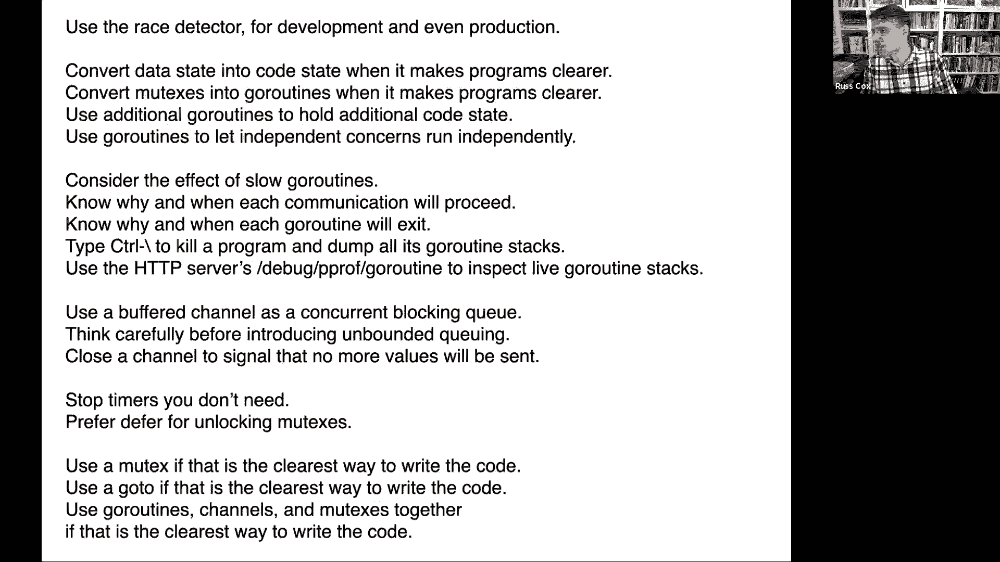

# 🎓 课程10：Go语言嘉宾讲座 - Russ Cox

在本节课中，我们将跟随Go语言联合负责人Russ Cox，学习如何用Go设计和实现并发程序。我们将通过四种常见的并发模式，理解如何利用Go的并发特性编写清晰、高效的代码，并掌握一些实用的设计原则和技巧。

---

## 🔄 并发与并行

首先，区分并发性和并行性很重要。

**并发性**是关于如何编写程序。它指的是程序能够独立编排多个控制流（如进程、线程或goroutine），从而同时处理多件事情，而不会使程序结构变得混乱。

**并行性**是关于程序是如何执行的。它指的是允许多个计算同时运行，使程序能够同时做很多事情，而不是一次处理很多事情。

并发性很自然地适合并行执行，但今天的关注点是**如何使用Go的并发支持来使你的程序结构更清晰**，而不是单纯地让它们运行得更快。

---

## 💡 核心设计原则：状态即代码

在设计并发程序时，一个反复出现的决定是：将状态表示为**代码**还是**数据**。

*   **数据状态**：将状态存储在变量中。
*   **代码状态**：将状态隐含在程序的控制流（如程序计数器和调用栈）中。

将数据状态转换为代码状态，通常会使代码更清晰、更易读。

### 示例：解析字符串

假设我们需要从文件中读取并扫描一个C风格的引号字符串。一个基于状态机的实现可能将当前状态存储在一个变量中：

```go
state := 0
for {
    ch := readChar()
    switch state {
    case 0:
        if ch != '"' { return false }
        state = 1
    case 1:
        if ch == '"' { return true }
        if ch == '\\' { state = 2 } else { state = 1 }
    case 2:
        state = 1
    }
}
```

这个程序的状态完全存储在`state`变量中。我们可以通过将状态移动到控制流中来重写它，使其更清晰：

```go
// 状态0: 寻找起始引号
if readChar() != '"' {
    return false
}
// 状态1: 在字符串内循环
for {
    ch := readChar()
    if ch == '"' {
        return true
    }
    if ch == '\\' {
        // 状态2: 转义字符，跳过下一个字符
        readChar()
    }
    // 循环回到状态1
}
```

**提示1：将数据状态转换为代码状态，它会使你的代码更清楚。**

---

## 🧵 使用Goroutine保存代码状态

有时，我们无法完全控制程序的控制流（例如，必须通过回调函数处理数据）。在这种情况下，我们可以创建额外的goroutine来保存代码状态。

### 示例：无法控制流的字符处理

假设我们有一个`ProcessChar`方法，必须一次处理一个字符并返回，无法在同一个函数调用中保持循环状态。

```go
type Parser struct {
    chars chan rune
    status chan Status
}
func (p *Parser) Init() {
    go p.readString()
}
func (p *Parser) ProcessChar(ch rune) Status {
    p.chars <- ch
    return <-p.status
}
func (p *Parser) readString() {
    // 这里可以包含之前清晰的、基于循环的解析逻辑
    // 它通过p.chars接收字符，并通过p.status发送状态
}
```

通过启动一个专门的goroutine来运行`readString`，我们将状态（解析进度）保存在了这个goroutine的栈和程序计数器中，从而实现了清晰的代码状态。

**提示2：使用额外的goroutine来保存额外的代码状态。**

**注意**：创建goroutine不是免费的，必须确保它们能正确退出，避免goroutine泄漏。

---

## 🔍 调试：检测Goroutine泄漏

Go提供了强大的工具来检测未退出的goroutine。

*   在Unix系统上，向程序发送`SIGQUIT`信号（通常按`Ctrl+\`），程序会崩溃并打印所有goroutine的堆栈跟踪。
*   如果程序是HTTP服务器，并且导入了`net/http/pprof`包，可以访问`/debug/pprof/goroutine`端点来获取所有运行中goroutine的堆栈信息，它会聚合相同的堆栈，使泄漏更容易被发现。

**提示3：使用`/debug/pprof/goroutine`端点来调查goroutine泄漏。**

---

## 📡 模式一：发布订阅服务器

发布订阅模式用于将程序中产生事件的部分与处理事件的部分解耦。

### API设计

```go
type PubSub struct {
    // ...
}
func (s *PubSub) Subscribe(ch chan Event)
func (s *PubSub) Publish(e Event)
func (s *PubSub) Cancel(ch chan Event)
```
*   `Subscribe`：注册一个channel来接收事件。
*   `Publish`：向所有注册的channel发送一个事件。
*   `Cancel`：取消订阅，并关闭对应的channel（通知接收方）。

### 基础实现（带互斥锁）

```go
type PubSub struct {
    mu   sync.Mutex
    subs map[chan Event]bool
}
func (s *PubSub) Publish(e Event) {
    s.mu.Lock()
    defer s.mu.Unlock()
    for ch := range s.subs {
        ch <- e
    }
}
```

**问题**：如果一个订阅者处理事件很慢，`Publish`中的channel发送操作会阻塞，拖慢所有其他订阅者。

### 解决方案：分离关注点

我们可以将核心逻辑移到一个专用的goroutine中，将“互斥锁保护的状态”转换为“goroutine内的局部状态”。

```go
type PubSub struct {
    publish chan Event
    subscribe chan chan Event
    cancel chan chan Event
}
func (s *PubSub) loop() {
    subs := make(map[chan Event]bool)
    for {
        select {
        case ch := <-s.subscribe:
            subs[ch] = true
        case ch := <-s.cancel:
            delete(subs, ch)
            close(ch)
        case e := <-s.publish:
            for ch := range subs {
                ch <- e
            }
        }
    }
}
// Publish, Subscribe, Cancel 方法现在只是向对应的channel发送请求。
```

**提示4：使用goroutine来分离独立的关注点。**

为了处理慢速订阅者，我们可以在核心循环和订阅者之间增加一个“助手goroutine”来进行缓冲、丢弃或合并事件，防止一个慢速订阅者影响整体系统。

---

## 👷 模式二：工作调度器

这个模式类似于MapReduce实验中的协调者，它负责任务的调度。

### 目标
给定一个服务器列表和一系列任务，将任务分配给可用的服务器执行。

### 使用Channel作为队列

```go
func Schedule(servers []string, numTasks int, call func(string, int) bool) {
    idle := make(chan string, len(servers))
    for _, s := range servers {
        idle <- s
    }
    for i := 0; i < numTasks; i++ {
        go func(task int) { // 注意：捕获循环变量
            s := <-idle
            call(s, task)
            idle <- s
        }(i) // 将当前i值作为参数传入，避免数据竞争
    }
    // 等待所有任务完成（略）
}
```

**关键点**：
1.  **避免闭包捕获循环变量**：在goroutine中使用函数参数或`task := task`来创建局部副本。
2.  **控制并发度**：通过从`idle` channel中获取服务器来控制同时运行的任务数量，避免创建过多goroutine。
3.  **等待完成**：需要额外的机制（如`sync.WaitGroup`或`done` channel）来等待所有任务完成。

更高级的版本可以为每个服务器创建一个专用的goroutine，从任务队列中拉取工作。

---

## 📞 模式三：复制服务的客户端

当服务被复制到多台服务器以提高可靠性时，客户端需要能够尝试多台服务器，直到成功。

### 接口

```go
type ReplicatedClient struct {
    servers []string
    mu sync.Mutex
    preferred int // 上次成功使用的服务器索引
}
func (c *ReplicatedClient) Call(args Args) Reply
```

### 实现：尝试多个服务器并处理超时



```go
func (c *ReplicatedClient) Call(args Args) Reply {
    c.mu.Lock()
    pref := c.preferred
    c.mu.Unlock()
    done := make(chan Reply, len(c.servers)) // 缓冲channel防止goroutine泄漏
    for offset := 0; offset < len(c.servers); offset++ {
        id := (pref + offset) % len(c.servers)
        go func(serverID int) {
            done <- c.sendCall(c.servers[serverID], args)
        }(id)
        select {
        case reply := <-done:
            c.mu.Lock()
            c.preferred = id // 记住成功的服务器
            c.mu.Unlock()
            return reply
        case <-time.After(timeout):
            // 这个服务器超时，尝试下一个
            continue
        }
    }
    // 所有服务器都尝试过，等待第一个返回的（无论成功与否）
    return <-done
}
```

**注意**：使用`time.After`创建的计时器需要及时停止（`timer.Stop()`），否则可能造成资源浪费。在上面的循环中，每次迭代都会创建新的计时器。

---

## 🔀 模式四：协议多路复用器（RPC核心）

这是RPC系统的核心，负责匹配请求和响应。

### 职责
*   发送请求消息。
*   接收响应消息。
*   通过唯一的标签（tag）将响应与等待的请求配对。

### 实现

```go
type Mux struct {
    send chan Message
    recv chan Message
    pending map[int]chan Reply
    mu sync.Mutex
}
func (m *Mux) loop() {
    // 发送循环
    go func() {
        for msg := range m.send {
            m.service.Send(msg)
        }
    }()
    // 接收循环
    go func() {
        for {
            reply := m.service.Recv()
            tag := reply.GetTag()
            m.mu.Lock()
            ch, ok := m.pending[tag]
            if ok {
                delete(m.pending, tag) // 取出后立即删除
            }
            m.mu.Unlock()
            if ok {
                ch <- reply
            }
        }
    }()
}
func (m *Mux) Call(args Args) Reply {
    tag := getUniqueTag()
    done := make(chan Reply, 1)
    m.mu.Lock()
    m.pending[tag] = done
    m.mu.Unlock()
    m.send <- Message{Tag: tag, Args: args}
    return <-done
}
```

**关键点**：`pending`映射由互斥锁保护。在接收循环中，一旦从映射中取出回复channel，就立即删除该条目，确保每个请求只被回复一次。

---

## 🎯 总结与核心提示

本节课我们一起学习了用Go设计和实现并发程序的四种常见模式：

1.  **发布订阅服务器**：解耦事件生产者和消费者，使用goroutine分离关注点，处理慢速消费者。
2.  **工作调度器**：使用channel作为工作队列，协调多个worker goroutine，注意控制并发度和避免数据竞争。
3.  **复制服务的客户端**：实现容错调用，尝试多个服务端，处理超时，并记住上次成功的节点。
4.  **协议多路复用器**：RPC核心，匹配请求与响应，管理并发访问的映射。

贯穿这些模式，我们强调了几个核心设计原则和提示：


*   **状态即代码**：尽可能将状态存储在控制流中，而非变量里，使逻辑更清晰。
*   **Goroutine作为状态容器**：当无法在单一控制流中保持状态时，使用goroutine。
*   **分离关注点**：使用独立的goroutine处理不同的逻辑模块。
*   **Channel用于通信**：使用channel在goroutine间传递数据和信号，注意方向性。
*   **谨慎对待共享状态**：使用互斥锁保护共享数据，并清楚锁所保护的不变量。
*   **避免Goroutine泄漏**：始终规划goroutine的退出路径，并利用工具进行检测。
*   **竞态检测器是你的朋友**：在测试中积极使用`go run -race`来发现数据竞争问题。

Go的并发模型提供了一套强大的工具，其目标不仅是提升性能，更重要的是帮助你编写出结构清晰、易于推理的并发程序。希望这些模式和提示能对你在6.824课程及以后的并发编程中有所帮助。