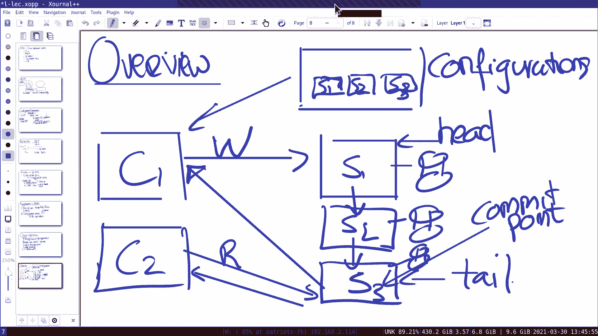

# 课程 P11：第 11 讲 - 链式复制 🧬

在本节课中，我们将要学习链式复制（Chain Replication），这是一种用于构建复制状态机的主备复制方案。我们将探讨其工作原理、故障处理机制，并将其与之前学过的 Raft 等共识算法进行比较。

---

## 概述

链式复制是一种主备复制协议，它假设存在一个外部的配置服务（如使用 Raft 或 Paxos 实现）来管理服务器链的成员和角色。该协议将写操作定向到链的头部，并沿链向下传播，直到尾节点应用操作后向客户端确认。读操作则由尾节点直接处理。这种设计提供了线性一致性、简单的故障恢复以及良好的读性能扩展能力。

---

## 复制状态机的两种构建方法

在深入链式复制之前，我们先回顾构建复制状态机的两种常见方法。

上一节我们介绍了复制状态机的通用模型。本节中我们来看看两种具体的实现路径。

**方法一：单一共识协议**
所有客户端操作（包括读写）都通过一个共识协议（如 Raft、Paxos）来排序和执行。我们的实验 3 键值存储就采用了这种方法。服务状态完全由共识库管理。

**方法二：配置服务 + 主备复制**
这种方法将系统分为两层：
1.  **配置服务**：一个独立的、状态较小的服务，使用共识协议（如 Raft）运行，负责管理元数据，例如决定哪组服务器构成一个复制组、谁是主节点（在链式复制中对应头尾节点）。
2.  **主备复制服务**：负责实际的数据复制和客户请求处理，其协议（如链式复制、GFS 的主备协议）由配置服务协调。这种方法常用于数据量巨大的场景，因为主备同步可以更专业化，而不必受限于共识协议的状态转移机制。

链式复制属于第二种方法中的“主备复制方案”。

---

## Zookeeper 锁的补充说明 🔒

在进入链式复制的核心内容前，我们先简要补充上节课关于 Zookeeper 锁的讨论，因为锁是实现协调原语的重要工具。

Zookeeper 提供了强大的原语，可以用来实现分布式锁。需要注意的是，Zookeeper 锁与编程语言中的互斥锁（如 Go 的 `mutex`）语义不同。

以下是 Zookeeper 锁的两个关键特性：
*   **Ephemeral（临时）节点**：当创建锁的客户端会话失效时，Zookeeper 会自动删除该临时节点，从而自动释放锁。这避免了因客户端崩溃导致的死锁。
*   **Watch（监视）机制**：客户端可以在一个 Znode 上设置监视，当该节点发生变化（如被删除）时，Zookeeper 会通知客户端。

基于这些原语，可以实现两种锁：

### 简单锁（可能引发羊群效应）
以下是其伪代码逻辑：
```python
def acquire_lock():
    while True:
        if create("/lock-file", ephemeral=True): # 尝试创建临时锁文件
            return # 创建成功，获得锁
        else:
            exists("/lock-file", watch=True) # 设置监视，等待锁文件被删除
            wait_for_notification() # 收到通知后循环重试

def release_lock():
    delete("/lock-file") # 删除锁文件，触发其他人的监视
```
**缺点**：当锁释放时，所有等待的客户端会同时被通知并蜂拥而至地重试创建锁，造成“羊群效应”，给服务器带来巨大压力。

### 改进的锁（使用顺序节点避免羊群效应）
以下是其伪代码逻辑：
```python
def acquire_lock():
    n = create("/lock-", ephemeral=True, sequential=True) # 创建顺序临时节点，如 lock-001
    children = get_children("/") # 获取所有锁节点
    if n is smallest(children): # 如果自己的节点编号最小
        return # 获得锁
    else:
        p = get_prev_node(n) # 找到编号刚好在自己前面的节点
        exists(p, watch=True) # 在该前驱节点上设置监视
        wait_for_notification() # 前驱节点被删除（锁释放）时获得通知，然后检查自己是否变为最小
```
**优点**：所有客户端形成一个隐式的队列，每个客户端只监视其前一个节点。锁释放时，只有队列中的下一个客户端会尝试获取锁，彻底避免了羊群效应。

**Zookeeper 锁的用途**：它们常用于**领导者选举**或作为**软锁**。软锁允许在常见情况下任务只执行一次，但在持有者故障时允许任务被重新执行（例如，确保 MapReduce 任务至少执行一次）。

---

## 链式复制详解 ⛓️

现在，让我们聚焦于今天的主题——链式复制。我们假设已经存在一个配置服务（Master），它知道链中有哪些服务器，以及谁是头（Head）和尾（Tail）。




### 正常操作流程

考虑一个由三台服务器 S1（头）、S2、S3（尾）组成的链。

1.  **写请求（更新）**：
    *   客户端向配置服务查询后，将写请求发送给头部服务器 **S1**。
    *   **S1** 在本地应用该更新（例如修改其键值状态），然后通过一个**可靠、先进先出（FIFO）的通道**（如 TCP 连接）将更新发送给 **S2**。
    *   **S2** 在本地应用更新后，同样将更新发送给 **S3**。
    *   **S3** 在本地应用更新后，**向客户端发送确认响应**。此时，该写操作被视为已提交（Committed）。

2.  **读请求（查询）**：
    *   客户端将读请求直接发送给尾部服务器 **S3**。
    *   **S3** 使用本地状态立即响应客户端。

**关键点**：
*   **提交点**：当尾部服务器应用了更新时，该更新才被提交。因为后续的所有读操作都会访问尾部，所以它们一定能看到这个已提交的更新。
*   **线性一致性**：该协议保证了线性一致性。写操作在头部全序发起，并在尾部提交。任何在写操作确认**之后**发起的读操作，都会访问尾部，因此一定能读到该写操作的结果（或更晚的结果）。

> **思考**：如果让头部服务器在收到写请求后立即响应客户端，而不是等待尾部确认，会破坏线性一致性吗？
> **答案**：是的。因为此时写操作可能还未传播到尾节点，如果另一个客户端立即从尾部读取，将无法看到自己的写入，这违反了线性一致性。

### 故障恢复

链式复制的故障恢复方案相对简单，主要分为三种情况。配置服务负责检测故障并重新配置链。

1.  **头部服务器（S1）故障**：
    *   配置服务检测到 S1 故障，将 S2 提升为新的头部，链变为 [S2 -> S3]。
    *   **无需特殊恢复操作**。任何仅在故障的 S1 中而未传播到 S2 的更新都将被丢弃，由于它们未被提交（尾部未确认），这是允许的。

2.  **中间服务器（S2）故障**：
    *   配置服务检测到 S2 故障，通知 S1 和 S3 形成新链 [S1 -> S3]。
    *   **需要状态同步**：S1 必须将那些已发送给 S2 但 S3 尚未收到的更新（即 S1 有而 S3 没有的后缀更新）直接发送给 S3，以使 S3 的状态追赶上。

3.  **尾部服务器（S3）故障**：
    *   配置服务检测到 S3 故障，将 S2 提升为新的尾部，链变为 [S1 -> S2]。
    *   **无需特殊恢复操作**。所有已提交的更新都已经存在于 S2，未提交的更新会继续从 S1 传播到新的尾部 S2。

与 Raft 等需要处理众多复杂故障场景的协议相比，链式复制的恢复逻辑更加清晰和有限。

### 添加新副本

为了维持可用性，需要向链中添加新的服务器。通常最方便的是添加到尾部。

1.  新服务器 **S_new** 启动，并开始从当前尾部 **S_tail** 复制完整状态（这可能是个耗时过程）。
2.  在复制期间，写更新仍通过旧链 [S1 -> ... -> S_tail] 进行。S_tail 需要记录在 S_new 复制开始后收到的所有更新。
3.  当 S_new 完成基础状态复制后，S_tail 将积累的更新发送给 S_new。
4.  S_new 应用所有这些更新后，通知配置服务。配置服务将 S_new 置为新的尾部，并通知客户端更新访问路径。

---

## 链式复制的特性与扩展

### 与 Raft 的对比

| 特性 | 链式复制 | Raft |
| :--- | :--- | :--- |
| **读写负载分离** | 是。写请求到头部，读请求到尾部。 | 读写通常都通过领导者。 |
| **写操作通信开销** | 头部只需发送一次更新给下一个节点。 | 领导者需要将日志条目发送给所有追随者。 |
| **读操作开销** | 仅涉及尾部一个节点，可立即响应。 | 即使使用只读优化，领导者仍需联系多数派以确保自己仍是领导者。 |
| **故障恢复** | 场景简单，恢复逻辑清晰。 | 场景复杂（如领导者变更、日志不一致）。 |
| **故障期间可用性** | 任何节点故障都需要重新配置链，可能导致短暂中断。 | 只要多数派存活，写操作可继续，无需服务中断。 |

### 扩展读性能：多链分片

链式复制的一个强大扩展是使用**多条链**，并将数据对象（或“分片”）分布到不同的链上。

例如，有三台服务器 S1, S2, S3：
*   **链1** (负责分片A): Head=S1 -> S2 -> Tail=S3
*   **链2** (负责分片B): Head=S2 -> S3 -> Tail=S1
*   **链3** (负责分片C): Head=S3 -> S1 -> Tail=S2

**优势**：
*   **读性能线性扩展**：每个服务器都是某个链的尾部。对不同分片的读请求可以被不同链的尾部并行处理，总体读吞吐量随链（服务器）数量增加而提升。
*   **保持线性一致性**：对于同一个分片（对象）的操作，仍然由同一条链处理，因此强一致性得以保持。同时，负载被均匀地分散到所有服务器上。

这种方法结合了可扩展的读性能和强一致性保证。

---

## 总结

本节课中我们一起学习了链式复制。我们首先回顾了构建复制状态机的两种方法，并指出了链式复制属于“配置服务+主备复制”的范畴。我们详细分析了链式复制的正常操作流程，其核心在于写请求沿链传播并由尾部提交，读请求由尾部直接处理，从而保证了线性一致性。


我们探讨了链式复制简洁而有效的故障恢复机制，包括头部、中间节点和尾部故障的处理方式。最后，我们对比了链式复制与 Raft 的优缺点，并介绍了通过多链分片来扩展读性能的巧妙设计。链式复制以其清晰的设计和良好的特性，在实际系统中有着广泛的应用。