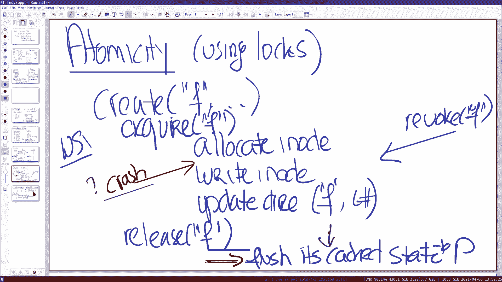
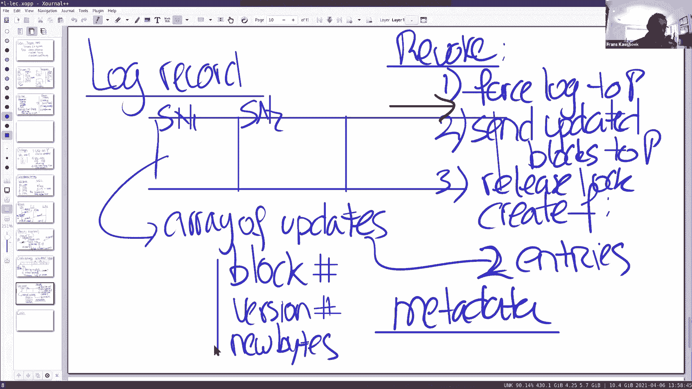
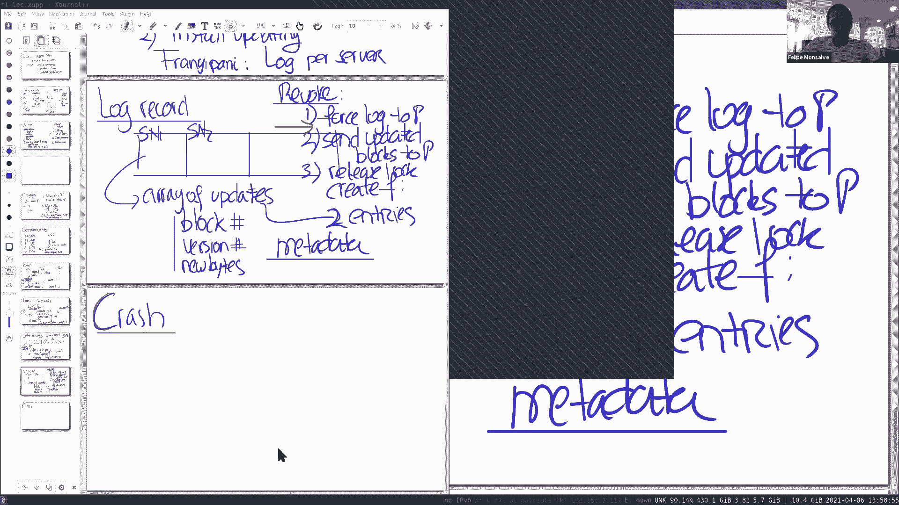
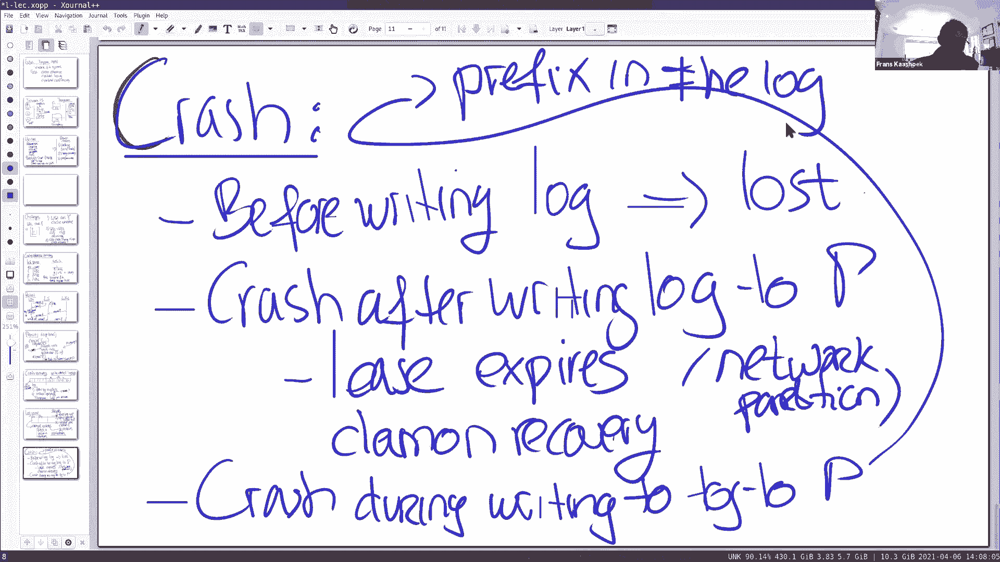
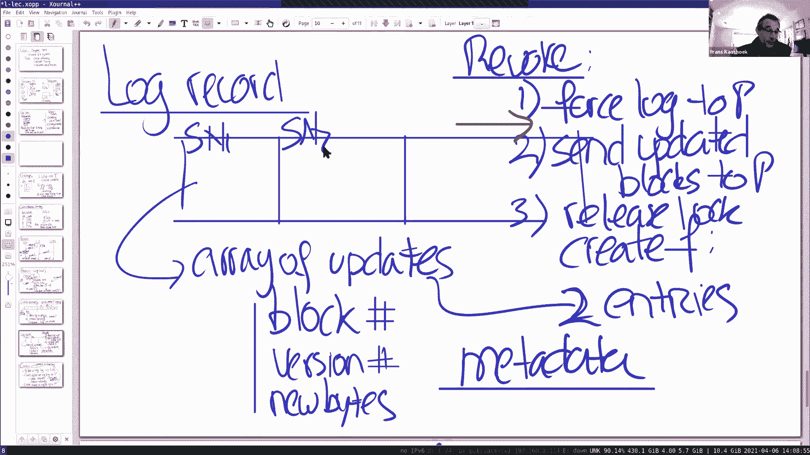
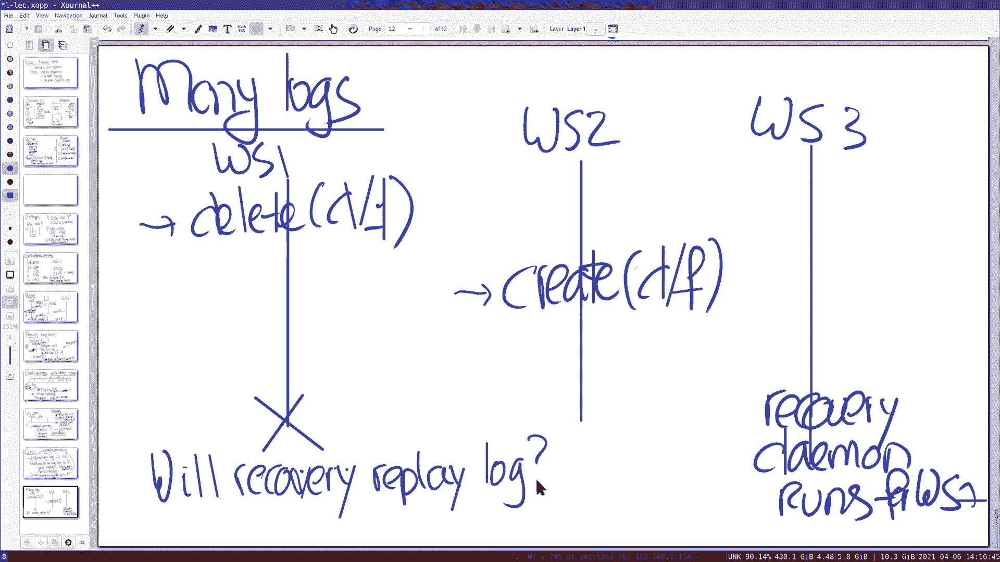
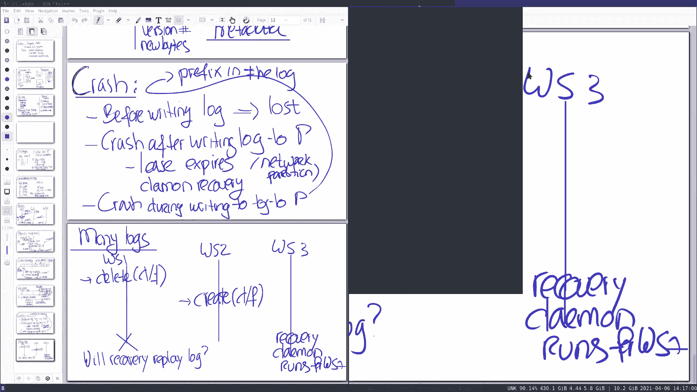
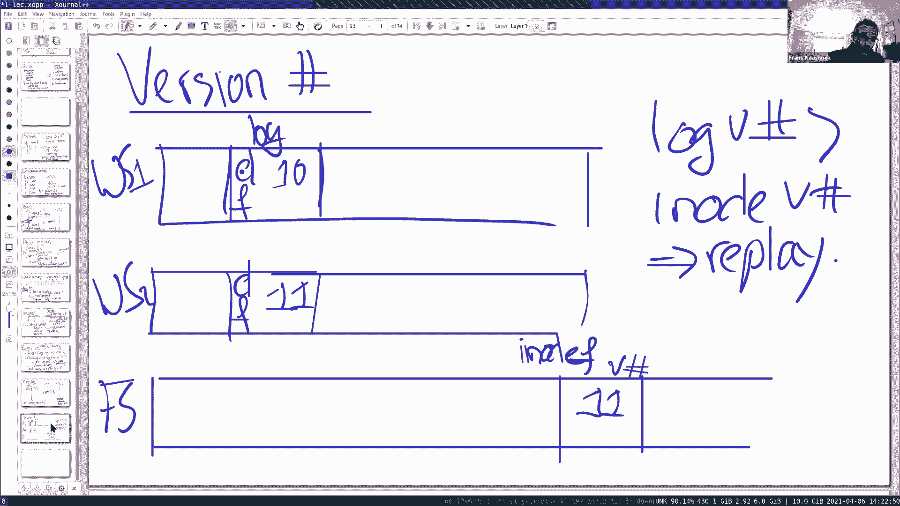
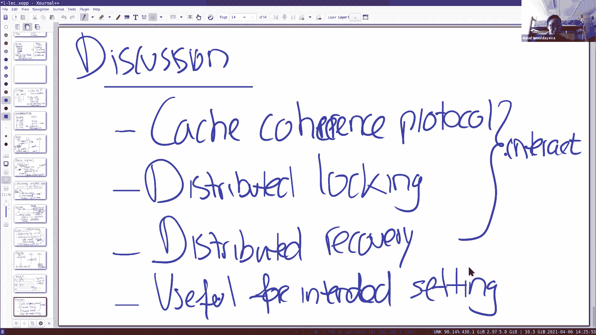
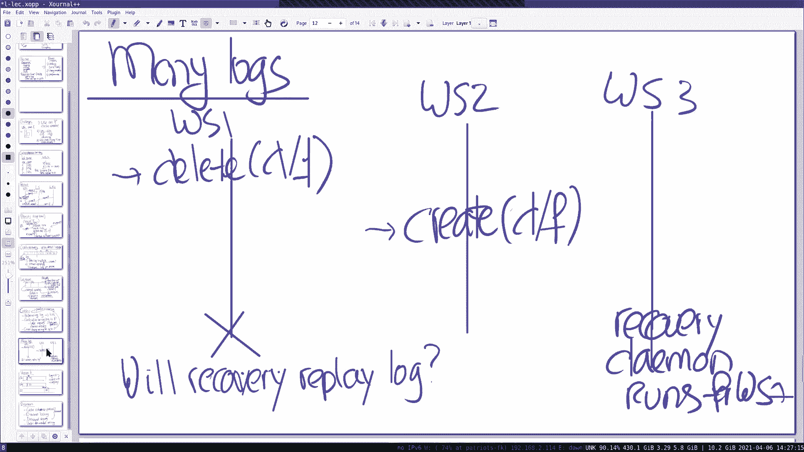

# 课程 P12：Frangipani 缓存一致性协议 🧠

在本节课中，我们将学习一篇1997年的经典论文《Frangipani》。这是一个关于网络文件系统的研究，其核心目标是在一组用户之间共享文件。虽然 Frangipani 本身未被广泛使用，但它引入了三个在未来分布式系统中反复出现的重要思想：**缓存一致性协议**、**分布式锁**和**分布式崩溃恢复**。本节课将对这些概念进行平和的介绍，为后续学习更复杂的事务系统打下基础。

## 系统设计背景

上一节我们介绍了课程概述，本节中我们来看看 Frangipani 的设计背景和与传统网络文件系统的对比。

传统的网络文件系统（如 Athena AFS）设计通常采用集中式架构。在这种设计中，多个客户端通过网络连接到一组文件服务器。文件服务器负责实现所有复杂的文件系统操作（如 `open`、`close`、`read`、`write`），并以抗崩溃的方式将数据写入磁盘。客户端相对简单，主要职责是将应用程序的文件系统操作请求转发给文件服务器。

这种设计受欢迎的一个原因是安全性：文件服务器通常是可信的，而客户端可能不可信。

Frangipani 采用了一种截然不同的、更加去中心化的设计。在 Frangipani 中，并没有传统意义上的专用文件服务器。相反，**客户端本身运行文件服务器代码**。多个客户端共享一个大的虚拟磁盘（由名为 Petal 的系统实现）。Petal 内部使用多台机器和 Paxos 协议来复制磁盘块，确保操作顺序正确，但从外部看，它就像一个提供 `read` 和 `write` 块接口的普通磁盘。

这种设计的优势在于可扩展性：通过增加工作站（客户端）的数量，可以获得更多的 CPU 处理能力，因为繁重的计算（文件系统操作）直接在客户端机器上完成，无需经过集中的文件服务器。在传统设计中，文件服务器往往成为性能瓶颈。

## 设计目标与用例

了解了基本架构后，我们来看看驱动 Frangipani 设计的具体目标和用例。

Frangipani 的设计源于一个研究实验室的环境，目标用户是50到100名研究人员和工程师。他们的典型工作负载包括编译程序、编辑文档。这个用例有几个关键特点：
1.  **用户可信**：所有机器和用户都是可信的，安全问题不是首要考虑。
2.  **工作负载私有性高**：用户大部分时间都在处理自己的私有文件。
3.  **需要高性能**：用户是重度计算机使用者，需要与文件系统进行高性能交互。
4.  **存在共享需求**：用户间需要协作（如合写论文），或者同一用户会从多个工作站访问文件。

这些用例直接驱动了 Frangipani 的两个核心设计选择：
*   **缓存**：由于工作负载主要是私有的，将数据缓存在本地工作站可以避免大多数读/写操作都需要网络传输到 Petal，从而获得高性能。Frangipani 使用**回写式缓存**，数据先留在本地缓存，稍后才批量写回 Petal。
*   **强一致性**：当确实发生共享时，系统需要提供强一致性（或称连贯性）。例如，一个用户写入文件后，其他用户读取该文件时必须能看到最新的更改。

为了对比，可以考虑 Google 文件系统 GFS。GFS 是为 MapReduce 这类顺序读取大文件的应用设计的，它不进行客户端数据缓存，因此也不需要缓存一致性协议。而 Frangipani 旨在提供标准的 POSIX/Unix 兼容性，允许直接运行 `vi`、`gcc` 等传统应用。

## 核心挑战与解决方案

基于上述设计，Frangipani 需要解决三个主要的挑战：缓存一致性、原子性和崩溃恢复。下面我们逐一探讨。

### 挑战一：缓存一致性 🔄

当多个工作站缓存同一文件时，如何确保一个工作站的写入能被其他工作站看到？这就是缓存一致性问题。

Frangipani 的解决方案核心是一个**分布式锁服务器**。锁服务器维护一个表，记录每个文件（通过 inode 编号标识）当前被哪个工作站加锁。工作站本地也维护类似的表，记录自己持有的锁及其状态（“忙”或“闲”）。

缓存一致性协议的基本规则是：**要缓存一个文件，必须先获取该文件的锁**。

以下是协议中关键的四种消息：
1.  **请求锁**：工作站向锁服务器申请某个文件的锁。
2.  **授予锁**：锁服务器检查文件未被锁定后，将锁授予该工作站。
3.  **撤销锁**：当另一个工作站请求已被持有的锁时，锁服务器向当前锁持有者发送撤销消息。
4.  **释放锁**：当前锁持有者收到撤销消息后，将本地修改写回 Petal，然后通知锁服务器释放锁。

**工作流程示例**：
1.  工作站1请求并获取文件 `f` 的锁，然后读取/修改 `f`，修改暂存于本地缓存。
2.  工作站2后来也请求 `f` 的锁。
3.  锁服务器向工作站1发送撤销 `f` 锁的消息。
4.  工作站1收到撤销消息后，将其对 `f` 的修改**写回 Petal**，然后释放锁。
5.  锁服务器将 `f` 的锁授予工作站2。
6.  工作站2现在可以从 Petal 读取包含工作站1最新修改的 `f` 文件。

通过这个协议，强一致性得以保证，因为任何工作站只有在释放锁（并写回修改）后，其他工作站才能获取锁并读取数据。

### 挑战二：原子性 ⚛️

文件系统操作（如创建文件）通常包含多个步骤（分配 inode、初始化 inode、更新目录等）。需要确保这些操作是原子的，即不会让其他工作站看到中间状态。

Frangipani 同样利用**锁机制**来实现原子性。在执行一个复合操作前，工作站需要获取所有相关资源（如目录 inode 和文件 inode）的锁。持有这些锁期间执行所有步骤，操作完成后才释放锁。这确保了在操作过程中，其他工作站无法访问这些中间状态。

为了防止死锁，Frangipani 要求所有工作站以**全局固定的顺序**（例如按 inode 编号排序）来获取锁。

### 挑战三：崩溃恢复 💥

工作站可能在执行复杂文件系统操作（尤其是写回 Petal 的过程中）时崩溃，导致数据不一致。

Frangipani 采用 **预写式日志** 技术来解决这个问题。每个工作站都有自己的日志区（位于 Petal 上）。在将修改写回真正的文件系统区域之前，工作站先将修改**作为日志记录写入日志**。日志记录包含序列号和描述元数据更改（如 inode、目录块更新）的“更新数组”。

**关键的两阶段提交**：
1.  **写日志**：将包含所有元数据更改的日志记录原子性地写入 Petal 日志区。
2.  **施日志**：日志写入成功后，再将日志记录中的更改应用到真实的文件系统数据结构上。

如果工作站**在写日志前崩溃**，则更改丢失，但这没问题，因为锁尚未释放，其他工作站看不到不一致状态。
如果工作站**在写日志后、施日志前崩溃**，则恢复守护进程（一个负责清理的服务）会检测到未应用的日志，并重放这些日志记录，完成文件系统状态的更新，从而保证元数据的一致性。

需要注意的是，**用户文件数据本身不经过日志**，而是直接写入 Petal。这主要是出于性能考虑，因为数据量可能很大。这意味着应用程序级别的原子性（如保证一个大文件的所有块同时写入）需要由应用自己通过其他方式（如先写临时文件再重命名）来保证。

#### 多日志与版本号

由于每个工作站有自己的日志，一个潜在的问题是：工作站1的日志中有一个删除操作，工作站2的日志中有一个创建操作（针对同一文件），如果工作站1崩溃后其日志被重放，可能会覆盖工作站2的创建。

Frangipani 通过 **版本号** 机制避免这个问题。文件系统中的每个元数据块（如 inode）都有一个版本号。每次更新日志记录时，都会包含目标块的新版本号（旧版本号+1）。恢复守护进程在重放日志记录时，会检查日志记录中的版本号是否**高于** Petal 中该块的当前版本号，只有更高时才会应用该更新。这样就确保了后来的操作不会被先前的日志重放所覆盖。

## 总结

本节课我们一起学习了 Frangipani 分布式文件系统设计。我们首先了解了其去中心化的架构，即客户端本身运行文件服务代码并共享一个虚拟磁盘。接着，我们探讨了由其特定用例（可信环境下的高性能私有工作负载与强一致性共享）所驱动的设计选择：客户端缓存和回写策略。

然后，我们深入分析了 Frangipani 为解决分布式环境下的三大核心挑战所采用的机制：
1.  **缓存一致性**：通过一个基于锁服务器的协议来管理文件缓存权限，确保数据的强一致性视图。
2.  **原子性**：利用细粒度锁并以固定顺序获取，来保证复合文件系统操作的原子性。
3.  **崩溃恢复**：借助预写式日志（WAL）和版本号机制，确保在客户端崩溃后文件系统元数据能恢复到一致状态，并处理了多客户端日志可能存在的冲突。

Frangipani 优雅地将缓存一致性、分布式锁和崩溃恢复这三个思想结合在一起，为理解后续更复杂的分布式事务系统提供了重要的基础。