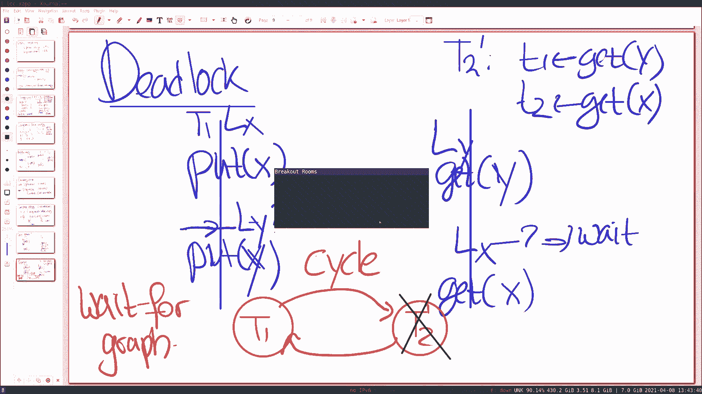

# 课程 P13：分布式事务 🧩

在本节课中，我们将学习分布式事务的核心概念。事务是数据库系统中用于保证一组操作原子性、一致性、隔离性和持久性的强大工具。在分布式环境中，我们需要跨多台机器协调这些操作，这带来了新的挑战。我们将重点探讨两个核心机制：**两阶段锁**和**两阶段提交**，它们是实现分布式事务隔离性和原子性的基石。

---

## 事务简介

事务允许程序员将一系列操作（例如，读取和写入数据）分组为一个逻辑单元。这个单元要么全部成功执行，要么完全不执行，即使在并发操作或系统故障的情况下也是如此。这通过 `BEGIN`、`COMMIT` 和 `ABORT` 三个关键操作来实现。

事务的语义通常由 **ACID** 属性概括：
*   **A - 原子性**：事务中的所有操作要么全部完成，要么全部不发生。这与故障恢复相关。
*   **C - 一致性**：事务必须保持数据库的内部一致性约束（如参照完整性）。本节课不重点讨论。
*   **I - 隔离性**：并发执行的事务不会看到彼此的中间结果。一个事务看到的所有写入，要么是另一个事务的全部写入，要么完全没有。
*   **D - 持久性**：一旦事务提交，其结果将永久保存在稳定存储中。

在分布式场景中，例如一个分片的键值存储，事务的目标是跨多台机器执行原子操作。考虑一个转账例子：客户端需要从服务器A的账户 `x` 转出1美元，并存入服务器B的账户 `y`。我们希望这两个 `PUT` 操作要么都发生，要么都不发生，并且其他客户端不能看到转账的中间状态（例如，`x` 已扣款但 `y` 未收款）。

---

## 隔离性与可串行化

上一节我们介绍了事务的基本概念和ACID属性。本节中，我们来看看隔离性的具体含义以及如何定义“正确”的并发执行。

隔离性的标准定义是 **可串行化**。这意味着，尽管多个事务可能并发执行，但最终结果必须等同于这些事务按某种**串行顺序**（一个接一个）执行的结果。

### 理解可串行化

假设账户 `x` 和 `y` 初始值均为10。我们有两个事务：
*   **T1（转账）**：`x = x - 1`; `y = y + 1`
*   **T2（查询）**：读取并打印 `x` 和 `y` 的值。

合法的串行结果只有两种：
1.  先执行T1，后执行T2：输出 `(9, 11)`，最终账户为 `(9, 11)`。
2.  先执行T2，后执行T1：输出 `(10, 10)`，最终账户为 `(9, 11)`。

任何导致其他结果（例如，T2读到 `x=9, y=10`）的并发执行都是非法的，必须被禁止。可串行化比线性一致性（Linearizability）略弱，因为它不要求事务的排序与其实时顺序完全一致，但它仍然是一个强大且便于编程的保证。

---

## 并发控制：悲观 vs. 乐观

为了实现可串行化，系统需要采用**并发控制**机制来禁止那些非法的执行交错。主要有两类方法：

**悲观并发控制**：在执行操作前先获取必要的“许可”（如锁），确保不会发生冲突。如果无法获取许可，则等待。
**乐观并发控制**：先直接执行操作，在提交时检查是否存在冲突。如果存在冲突，则中止并重试事务。

可以类比为：悲观方法是“先获得许可再行动”，乐观方法是“先行动，如果错了再道歉”。本节课我们聚焦于悲观方法，特别是**两阶段锁**。

---

## 两阶段锁

上一节我们了解了并发控制的两种哲学。本节中，我们深入探讨实现可串行化最常用的悲观协议之一：**两阶段锁**。

在两阶段锁中，每个数据项（如变量 `x`）都关联一个锁。协议遵循两条核心规则：
1.  事务在读写任何数据项之前，必须先获得该数据项的锁。
2.  事务在获得一个锁之后，在**提交**或**中止**之前，**不能释放**这个锁。

规则2中“持有锁直至事务结束”的阶段划分，正是“两阶段”的由来：第一阶段是**增长阶段**（不断获取锁），第二阶段是**收缩阶段**（在事务结束时释放所有锁）。

### 为何需要持有锁至事务结束？

考虑转账事务T1（`x--, y++`）和查询事务T2（`read x, read y`）。如果T1在写入 `x` 后立即释放 `x` 的锁，那么T2可能读到 `x` 的新值（9）和 `y` 的旧值（10），这是一个非法状态。持有锁至提交确保了其他事务无法看到任何中间状态。

### 死锁处理

两阶段锁可能导致死锁。例如，T1先锁 `x` 后请求锁 `y`，而T2先锁 `y` 后请求锁 `x`，双方互相等待。

以下是事务系统处理死锁的两种常见策略：
*   **超时**：如果一个事务持有锁时间过长，则假定其可能陷入死锁并中止它。
*   **等待图**：系统动态维护一个图，其中节点是事务。如果事务A等待事务B持有的锁，则添加一条边 `A -> B`。当图中出现环时，即检测到死锁，系统可以选择中止环中的一个事务。

被中止的事务会释放其持有的所有锁，从而让其他事务得以继续。应用程序通常可以选择重试已中止的事务。

---

## 两阶段提交

前面我们讨论了如何通过锁在单机或多核环境下实现隔离性。现在，我们转向分布式环境中的核心挑战：如何跨多台机器实现事务的**原子提交**。这就是**两阶段提交**协议要解决的问题。

在一个典型场景中，有一个**协调者**（Coordinator）和多个**参与者**（Participants，例如分片服务器A和B）。客户端向协调者发起一个跨分片事务（如从 `x` 转账到 `y`）。

### 协议流程（无故障情况）

1.  **执行阶段**：协调者向所有参与者发送事务操作（如 `PUT`）。每个参与者**锁定**所需数据项，**预写日志**，但**不提交**。完成后，参与者回复“已准备”。
2.  **准备阶段**：协调者向所有参与者发送 `PREPARE` 消息，询问是否可提交。
3.  **投票阶段**：每个参与者检查自身状态（如日志是否成功写入）。如果可以提交，则回复 `YES` 并做出**不可撤销的提交承诺**；否则回复 `NO`。
4.  **决定阶段**：
    *   如果协调者收到**所有**参与者的 `YES`，则决定**提交**。它将 `COMMIT` 决定写入持久日志，然后向所有参与者发送 `COMMIT` 消息。
    *   如果收到**任何一个** `NO`，则决定**中止**。它向所有参与者发送 `ABORT` 消息。
5.  **完成阶段**：参与者收到 `COMMIT` 后，将数据正式写入数据库并释放锁；收到 `ABORT` 后，丢弃预备数据并释放锁。然后回复协调者“完成”。

### 故障处理

两阶段提交的强大之处在于它能处理各种故障：

*   **参与者在回复 `YES` 后崩溃**：恢复后，参与者必须查看日志。如果发现自己处于“已准备”状态，则必须**继续等待**协调者的最终决定（`COMMIT` 或 `ABORT`），而不能单方面中止。这期间它持有的锁不会释放。
*   **协调者在发送 `COMMIT` 前崩溃**：如果协调者尚未做出决定（未写入日志），它可以重启后单方面决定中止。
*   **协调者在做出 `COMMIT` 决定后、发送消息前崩溃**：恢复后，协调者从日志中读取到 `COMMIT` 决定，并重新向参与者发送 `COMMIT` 消息。参与者可能处于阻塞等待状态。

**关键点**：一旦参与者回复 `YES`，它就进入了一个“不确定”状态，必须等待协调者的最终指令。这是导致2PC可能**阻塞**的原因——如果协调者永久故障，某些参与者可能永远等待。实践中，常通过**复制协调者**（例如使用Raft共识算法）来使其高可用，从而避免此问题。

### 2PC 与 Raft 的区别

虽然2PC和Raft都涉及多节点协调，但它们解决不同问题：
*   **Raft**：用于在多个副本间**复制相同的状态**，实现高可用。
*   **2PC**：用于在持有**不同数据**的多个节点间，就一个分布式操作的**原子提交**达成一致。

---

## 总结

本节课中我们一起学习了分布式事务的核心机制。

我们首先回顾了事务的ACID属性，并明确了在分布式环境下对**隔离性**和**原子性**的追求。对于隔离性，我们学习了**可串行化**的标准以及通过**两阶段锁**实现它的方法。2PL通过规则性地获取和持有锁，确保了并发事务的正确交错。

对于跨机器的原子提交，我们深入探讨了**两阶段提交**协议。2PC通过“准备-提交”两个阶段，协调所有参与者达成一致的决定，即使在部分节点故障时也能保证原子性。我们也分析了其潜在的阻塞问题及解决方案。

理解2PL和2PC是阅读现代分布式事务系统论文的基础。在接下来的课程中，我们将看到这些思想如何在真实的工业级系统中被应用、优化和扩展。