# 课程 P14：Spanner 分布式数据库系统 🗄️

在本节课中，我们将要学习 Google 的 Spanner 分布式数据库系统。Spanner 是一个支持跨广域网（WAN）事务的强大系统，它允许数据被分片并存储在全球不同数据中心的服务器上，同时为应用程序提供具有 ACID 语义的事务支持。我们将重点探讨其读写事务和只读事务的实现机制，特别是如何利用快照隔离和同步时钟来实现高性能的只读操作。

---

## 高层架构概览 🌐

上一节我们介绍了 Spanner 的基本目标，本节中我们来看看它的高层组织架构。

Spanner 系统包含多个数据中心。为了便于理解，我们可以假设有三个数据中心：A、B 和 C。数据被组织成多个分片，每个分片包含一部分数据库行或键值对。例如，一个分片可能包含键 `a` 到 `m`。

为了获得容错能力和高可用性，每个分片会在不同的数据中心之间进行复制。这些位于不同数据中心的副本共同组成一个 **Paxos 组**。这类似于实验 3 中的 Raft 组，但运行在全球范围的数据中心之间。

使用多个分片可以实现并行性。如果事务涉及不同的、互不相交的分片，它们就可以完全并行地执行。

Paxos 协议不仅提供了数据复制，还带来了额外的好处：它允许系统在仅获得多数副本响应的情况下继续运行。这意味着系统可以容忍单个数据中心故障或网络延迟，而不会对整体性能产生太大影响。

最终，Spanner 的客户端（通常是某个 Google 服务的后端服务器，如 Gmail 服务器）可以与地理位置最近的副本进行通信。特别地，只读事务可以由本地副本执行，无需与其他数据中心进行任何通信。

---

## 核心挑战与目标 🎯

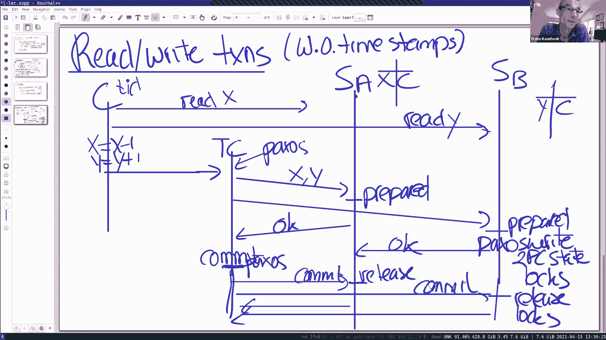

在了解了高层架构后，我们来看看 Spanner 设计时需要应对的几个主要挑战。

以下是 Spanner 需要解决的三个核心挑战：

1.  **高效的只读事务**：我们希望只读事务无需与其他服务器通信，但必须确保读取能看到最新的写入，并保持强一致性（如线性一致性）。
2.  **跨分片事务**：Spanner 需要支持跨多个分片的事务（例如银行转账），并保证其 ACID 语义。
3.  **事务的串行化**：所有事务（包括只读和读写）都必须是可串行化的，Spanner 实际上提供了更强的“外部一致性”保证。

对于读写事务，Spanner 使用了**两阶段锁（2PL）**和**两阶段提交（2PC）**协议。我们首先讨论读写事务，然后深入探讨只读事务如何实现高性能。

---

## 读写事务的实现 🔒

上一节我们提到了核心挑战，本节中我们来看看读写事务的具体实现。

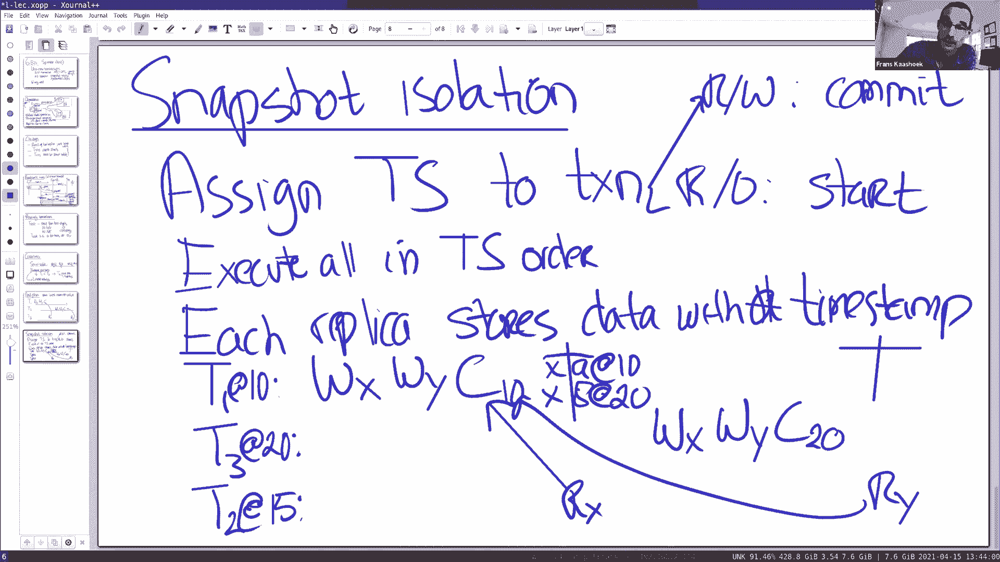

读写事务通过**两阶段锁（2PL）**和**两阶段提交（2PC）**来实现。我们通过一个简化的银行转账例子来说明：从账户 `X`（位于分片 A）转账 1 美元到账户 `Y`（位于分片 B）。

1.  **客户端读取与加锁**：
    *   客户端（例如 Gmail 后端服务器）启动事务，读取账户 `X` 和 `Y` 的当前值。
    *   读取请求会发送到相应分片（Paxos 组）的**领导者**。
    *   每个分片的领导者维护着一个**锁表**，它会为这个事务在 `X` 和 `Y` 上记录并持有锁。锁表存储在领导者内存中，**并未复制**。如果领导者在事务过程中故障，事务将中止。

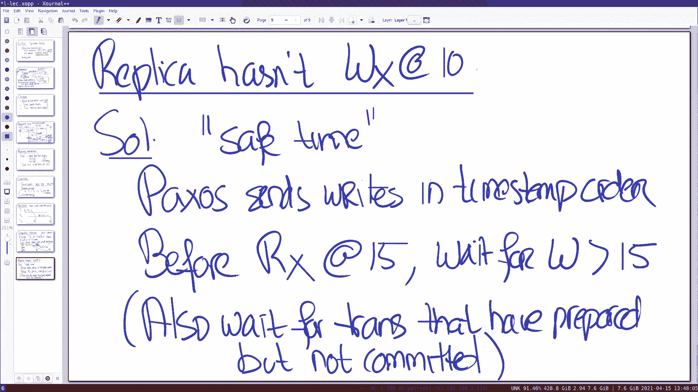

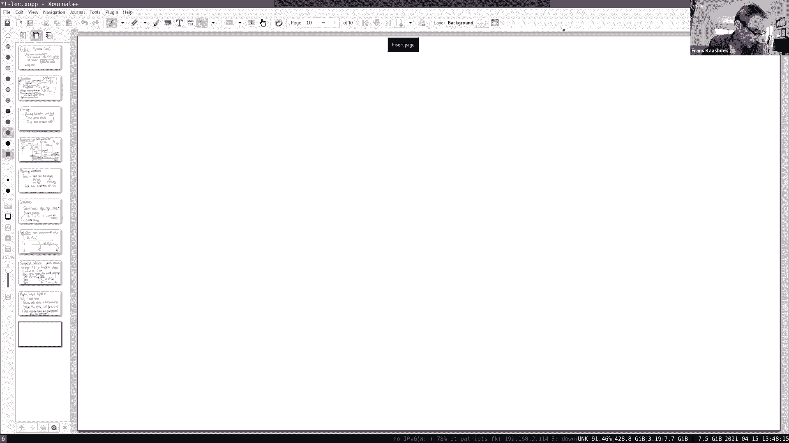

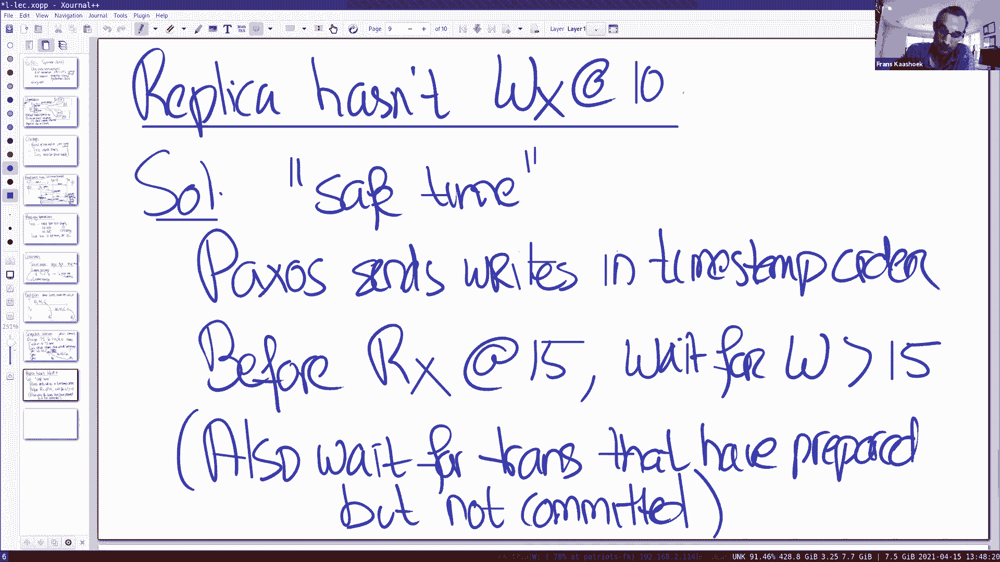

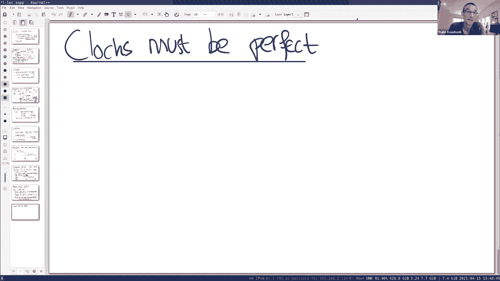

2.  **本地计算与提交**：
    *   客户端在本地执行计算（从 `X` 减 1，向 `Y` 加 1）。
    *   完成后，客户端将事务提交给一个**事务协调者**。协调者本身也是一个 Paxos 组，以确保高可用性。

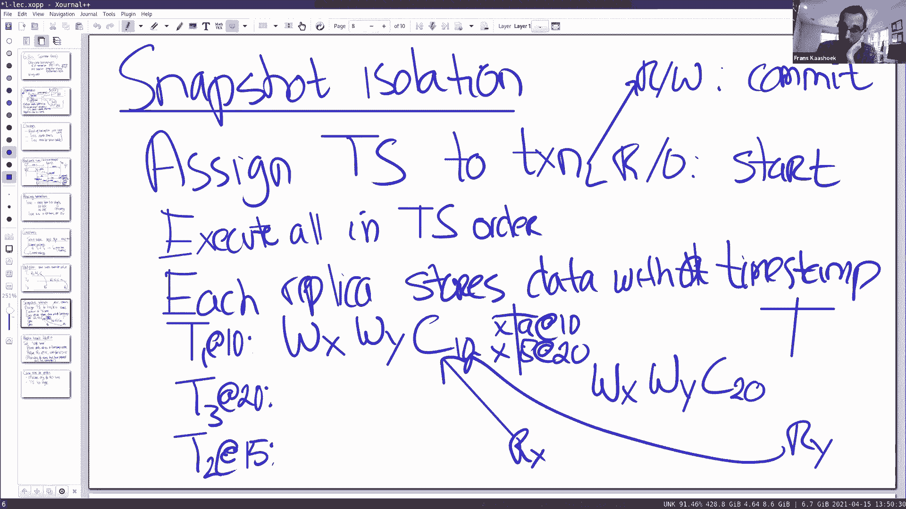

3.  **两阶段提交（2PC）流程**：
    *   **准备阶段**：协调者将更新发送给分片 A 和 B 的领导者。领导者们将修改写入预写日志（WAL），并将“准备就绪”状态通过 Paxos 复制到其组内，确保持久化。此时，锁被升级或保持。
    *   **提交阶段**：当所有参与者都回复“准备就绪”后，协调者通过 Paxos 写入“提交”决定。然后通知各参与者。参与者收到后，正式提交修改，并释放锁。

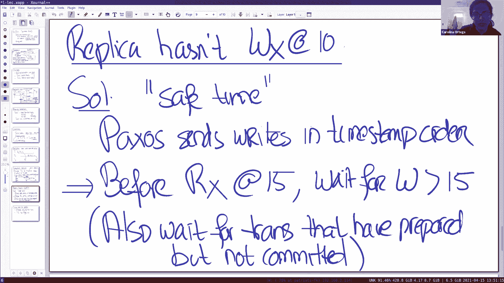

**关键点**：与经典 2PC 的主要区别在于，**事务协调者和每个参与者都是高可用的 Paxos 组**。这避免了因单点故障导致的事务阻塞。

---

## 只读事务与快照隔离 📸

读写事务虽然强大，但涉及广域网通信，延迟较高。本节中我们来看看 Spanner 如何让只读事务变得非常高效。

只读事务只进行读取操作，不进行写入。Spanner 通过以下设计使其非常快：
*   从**本地副本**读取，无需跨数据中心通信。
*   不获取任何**锁**，因此不会阻塞读写事务。
*   无需参与**两阶段提交**。

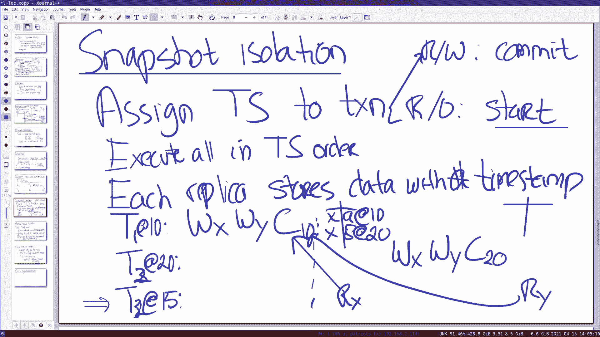

根据论文中的性能数据，只读事务的延迟在 5-10 毫秒级别，比读写事务快约十倍。

当然，挑战在于如何在不加锁、不进行全局协调的情况下，依然保证正确性（可串行化和外部一致性）。Spanner 的解决方案是**快照隔离**。

**快照隔离**是一个标准的数据库概念。其核心思想是：
*   为每个事务分配一个唯一的、全局有序的**时间戳**。
*   对于读写事务，时间戳在**提交开始时**分配。
*   对于只读事务，时间戳在**事务开始时**分配。
*   数据存储是**多版本**的。每个键值对会保存其历史版本及对应的时间戳。
*   事务在其时间戳对应的“快照”上执行。读取一个键时，返回的是该时间戳之前提交的最新版本。

**公式表示**：对于一个在时间戳 `T_read` 发起的只读事务，读取键 `K` 时，返回的值 `V` 满足：
`V = argmax_{V_i} (TS(V_i) <= T_read)`，其中 `TS(V_i)` 是值 `V_i` 被写入时的时间戳。

这种机制自然地提供了可串行化，因为所有事务都按时间戳顺序生效。

---

## 外部一致性与同步时钟 ⏰

快照隔离提供了可串行化，但 Spanner 还追求更强的**外部一致性**。本节中我们来看看这个目标以及实现它的关键——同步时钟。

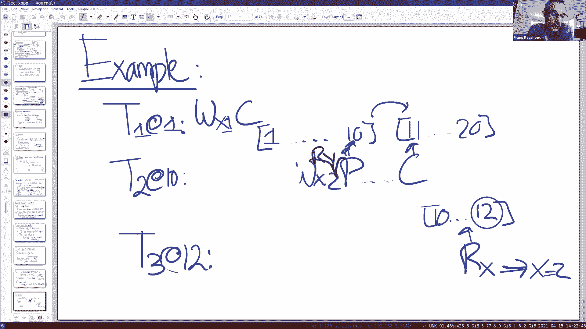

**外部一致性**要求：如果事务 `T2` 在事务 `T1` **提交之后**才开始，那么 `T2` 必须能看到 `T1` 的所有写入。这类似于线性一致性，但是是在事务级别。

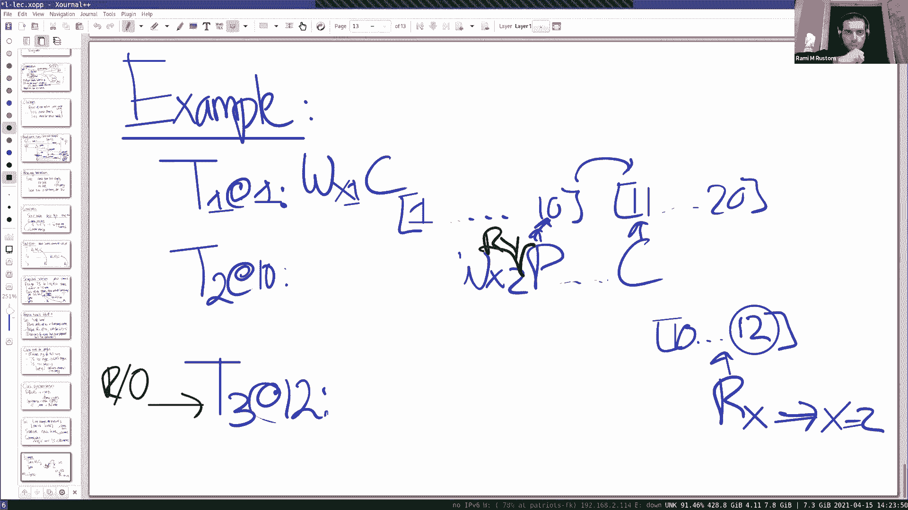

为了按时间戳顺序执行事务以实现外部一致性，整个系统必须对“时间”有统一、准确的认识。这就要求不同服务器上的时钟必须高度同步。

Spanner 使用了一个称为 **TrueTime** 的全球时间同步服务。TrueTime 不直接返回一个精确的时间点，而是返回一个时间区间 `[earliest, latest]`，并保证真实的当前时间一定落在这个区间内。这个区间的宽度 `ε` 就是时钟的误差范围，通常在几毫秒以内。

基于 TrueTime，Spanner 修改了事务协议中的两条规则：

1.  **开始规则**：为事务分配时间戳时（只读事务在开始时，读写事务在提交开始时），选择从 TrueTime API 获取的时间区间的 **`latest`** 值。这确保了事务的时间戳**一定晚于**真实的开始时间。
2.  **提交等待规则**：对于读写事务，在协调者做出提交决定后（即选定了提交时间戳 `T_commit`），它必须**等待**，直到 TrueTime API 返回的时间区间的 **`earliest`** 值大于 `T_commit`。这确保了事务的提交在真实时间中**一定发生**在 `T_commit` 之后。

通过这两条规则，Spanner 保证了事务时间戳的全局顺序与真实时间的先后关系一致，从而实现了外部一致性。虽然提交等待可能引入少量延迟，但由于时钟精度高（`ε` 小），这个延迟通常很小。

---

## 总结 📝

本节课中我们一起学习了 Google Spanner 分布式数据库系统的核心设计。

*   **读写事务**通过**两阶段锁（2PL）**和**两阶段提交（2PC）**实现，且所有参与者（分片）和协调者都是**Paxos 组**，从而获得了高可用性。
*   **只读事务**通过**快照隔离**和从**本地副本**读取来实现极低的延迟。它们不加锁，不参与 2PC。
*   为了保证更强的**外部一致性**（类似线性一致性），Spanner 依赖全局的**TrueTime**时钟服务。通过**开始规则**和**提交等待规则**，系统确保了事务时间戳的顺序与真实时间的因果关系一致。

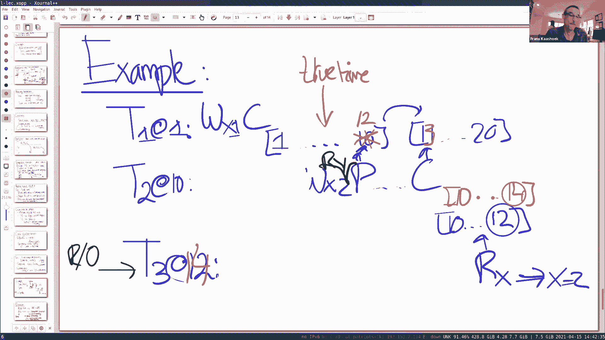

Spanner 的强大之处在于，它为程序员提供了一个跨越全球数据中心、支持强一致性 ACID 事务的简单编程模型，同时通过精巧的设计，使常见的只读操作保持了极高的性能。