# 课程15：乐观并发控制 (FaRM) 🚀

在本节课中，我们将要学习 FaRM 系统。FaRM 是一篇 2015 年的研究论文，旨在探索如何构建一个高性能的事务处理系统。其核心目标是实现极高的吞吐量，例如在 TATP 基准测试中，使用 90 台机器达到了每秒 1.4 亿个事务。这与我们之前学习的 Spanner 系统（每秒处理 10 到 100 个事务）形成了鲜明对比。FaRM 专注于单个数据中心内的高性能内存数据库，并提供严格的可串行化保证。

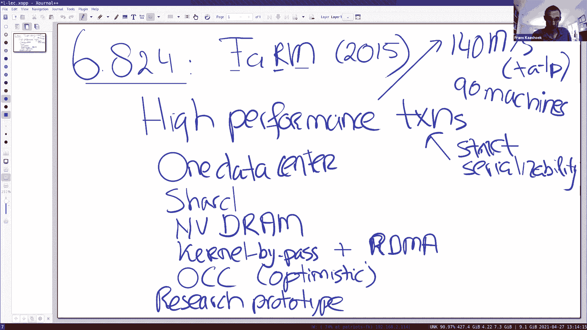

为了实现高性能，FaRM 结合了多种关键技术：数据分片、非易失性 DRAM、内核旁路以及支持 RDMA 的网卡。这些技术共同消除了传统系统中的存储、CPU 和网络瓶颈。特别地，FaRM 采用了**乐观并发控制** 方案，这与我们之前常见的悲观锁方案不同，它允许读取操作无需获取锁，从而更好地利用 RDMA 的低延迟特性。

## 系统架构与设置 🏗️

上一节我们介绍了 FaRM 的高层目标和技术概览。本节中我们来看看 FaRM 的具体系统架构是如何组织的。

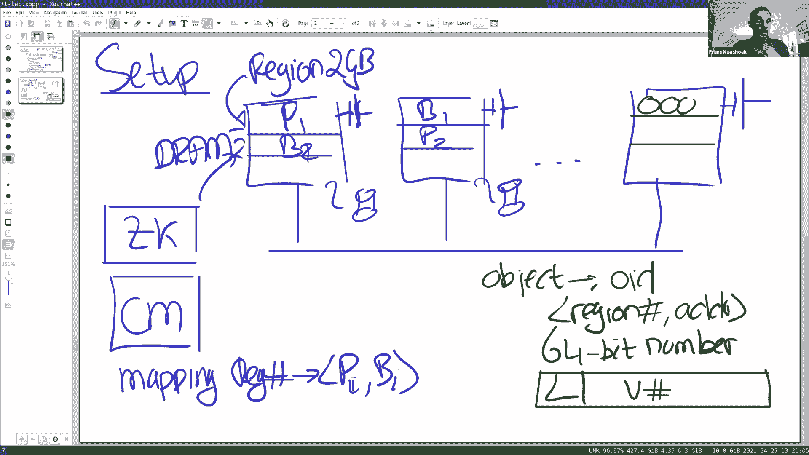

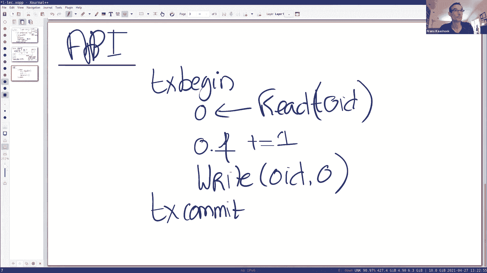

FaRM 系统由多台机器通过高速数据中心网络连接而成。数据被划分为多个 **区域** ，每个区域大小为 2GB，并存储在机器的 DRAM 中。整个数据库的数据集必须能够容纳在所有机器的 DRAM 总和之内。

为了实现容错，每个区域会被复制到多台机器上，采用主备复制模式。一台机器可能同时是某些区域的主节点和其他区域的备节点。一个独立的 **配置管理器** 与 ZooKeeper 协同工作，负责维护区域到其主、备节点的映射关系。

为了处理整个数据中心的故障（如断电），每台机器都配备了不间断电源。在全局停电时，UPS 提供足够的时间让机器将内存中的数据（包括区域内容和事务日志）刷新到 SSD 中。待电力恢复后，系统可以从 SSD 重新加载状态。

以下是系统架构的关键组件列表：
*   **区域**：2GB 大小的数据分片，存储在内存中。
*   **主备复制**：每个区域有一个主节点和一个或多个备节点，用于容错。
*   **配置管理器**：跟踪区域到主备节点的映射。
*   **非易失性 DRAM**：配合 UPS 和 SSD，处理相关故障。

## 内存布局与 API 💾

了解了整体架构后，我们来看看数据在内存中是如何组织的，以及应用程序如何与 FaRM 交互。

在 FaRM 的内存中，每个区域本质上是一个大的字节数组。对象存储在其中，并通过一个唯一的对象标识符 **OID** 来寻址。OID 由区域编号和区域内的偏移量组成。每个对象都有一个 64 位的头部，其中最高位是**锁位**，低 63 位是**版本号**。版本号在乐观并发控制中起着至关重要的作用。

应用程序通过一个简单的事务 API 与 FaRM 交互。

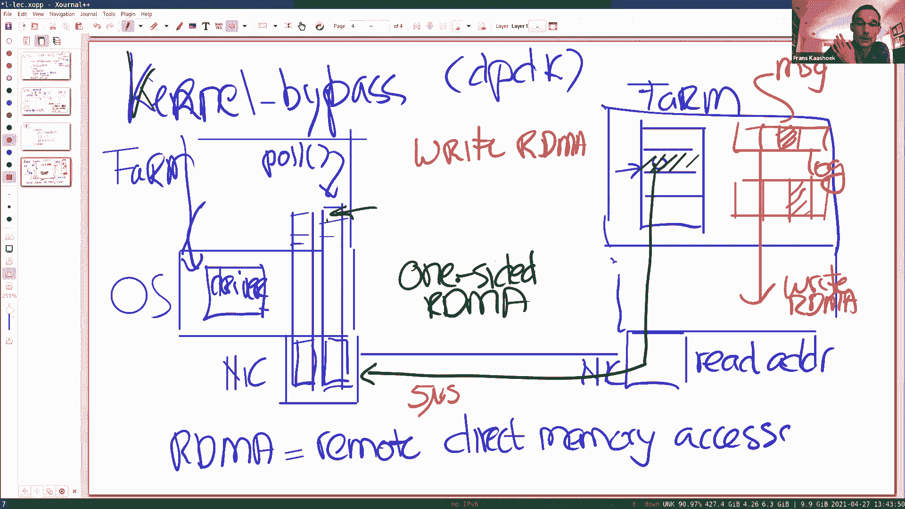

以下是事务 API 的主要调用：
*   `txbegin()`：开始一个新事务。
*   `read(oid)`：读取指定 OID 的对象。
*   `write(oid)`：准备写入（更新）指定 OID 的对象。实际的修改在应用程序本地内存中进行。
*   `txcommit()`：提交事务。可能成功，也可能因冲突而中止，此时应用程序需要重试事务。

一个事务可以读写多个位于不同区域的对象，因此 FaRM 需要一种跨区域的原子提交协议，这类似于两阶段提交。

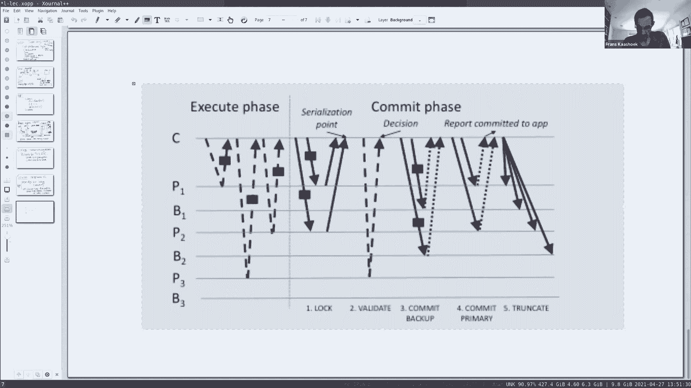

## 性能关键技术：内核旁路与 RDMA ⚡

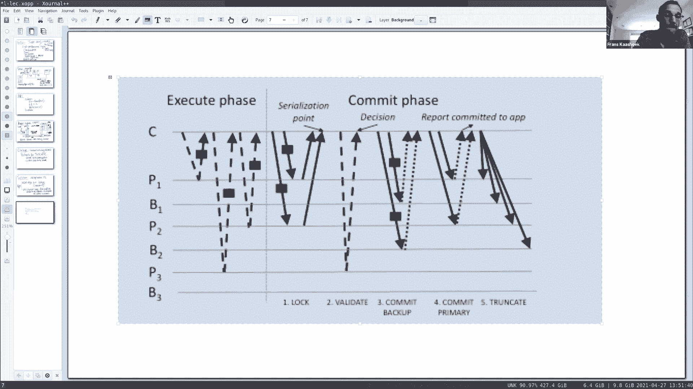

我们已经知道 FaRM 将数据全放在内存中以避免存储瓶颈。接下来，我们看看它如何通过内核旁路和 RDMA 技术来进一步降低 CPU 和网络开销。

**内核旁路** 允许用户态应用程序直接与网卡交互，绕过操作系统内核。FaRM 进程可以将其地址空间的一部分直接映射到网卡的发送和接收队列上。这样，应用程序可以直接向队列写入数据包或从中读取，无需进行昂贵的系统调用。同时，FaRM 使用轮询线程来检查接收队列，避免了网卡中断带来的开销。

**RDMA** 允许一台机器的网卡直接读取或写入另一台机器指定内存地址的内容，而无需远程服务器的 CPU 参与。FaRM 主要利用两种 RDMA 操作：
1.  **单边 RDMA 读**：客户端网卡可以直接从服务器内存中读取数据（如对象及其版本号）。
2.  **写入 RDMA**：客户端网卡可以直接将数据（如日志记录）写入服务器内存的特定位置（如日志区域），并等待网卡确认。

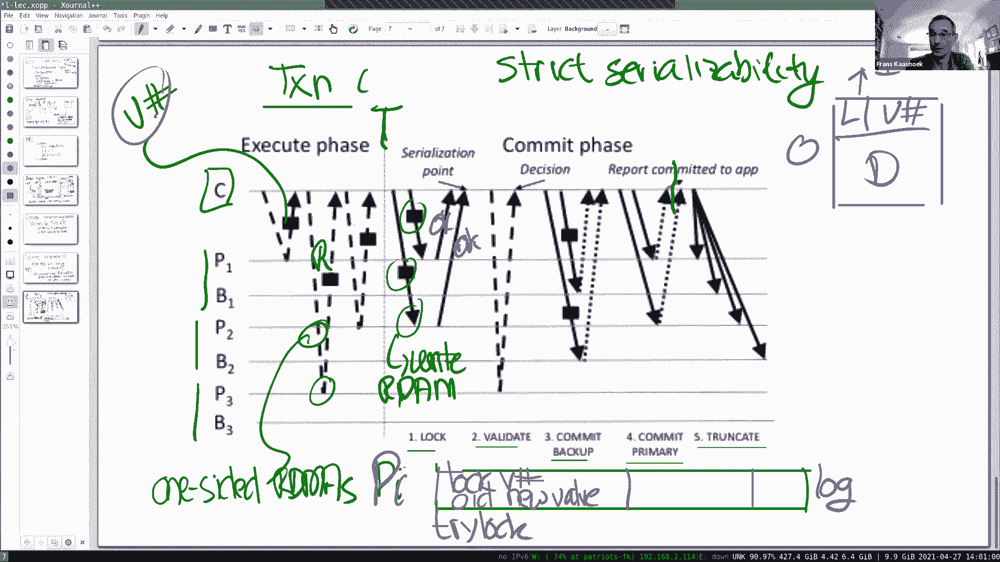

此外，FaRM 还利用写入 RDMA 来实现高效的 RPC：客户端将消息直接写入服务器的消息队列，服务器端的轮询线程发现后进行处理并回复。这些技术使得远程内存访问的延迟极低（约 5 微秒）。

## 乐观并发控制协议 🔄

上一节介绍的技术（尤其是 RDMA）带来一个核心挑战：如何在不要求服务器端过多参与的情况下实现事务。这直接推动了 FaRM 采用乐观并发控制方案。

在 OCC 中，事务的执行阶段**不获取任何锁**。事务读取对象时，通过单边 RDMA 获取对象数据和当前的版本号，并在本地进行修改。在提交时，才进行**验证**，检查所读对象是否被其他并发事务修改过。如果所有读取对象的版本号都未变，则提交；否则，中止并重试。

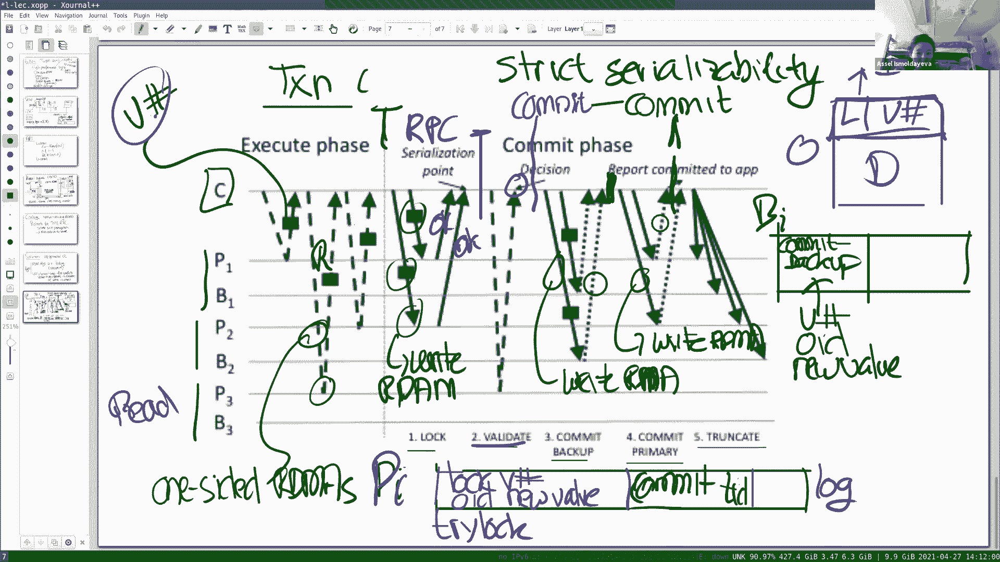

这种方案特别适合 FaRM，因为读取操作可以完全通过高效的单边 RDMA 完成，无需服务器端处理。而写入操作则需要在提交阶段通过一个类两阶段提交协议来原子化地完成。

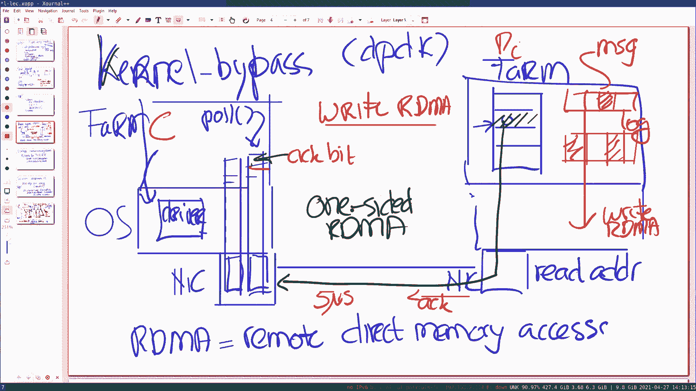

## 事务提交协议详解 📝

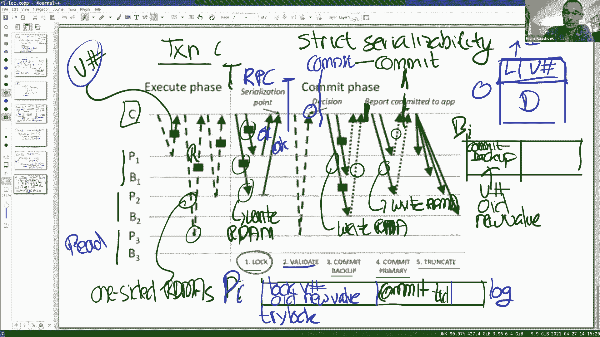

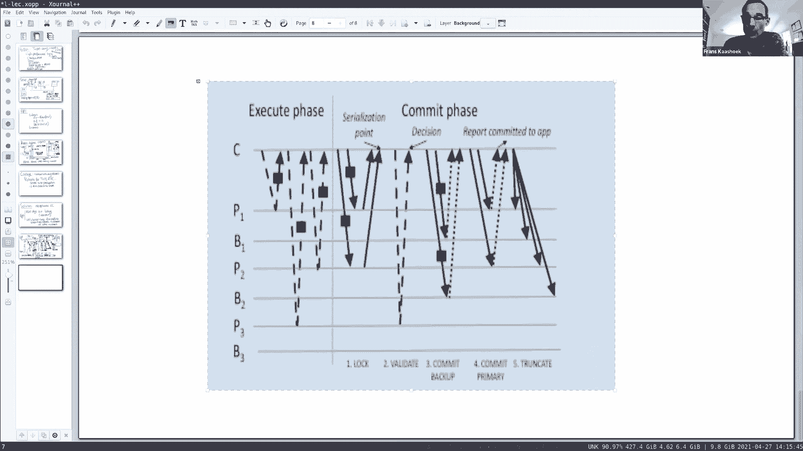

现在，我们深入探讨 FaRM 事务提交协议的具体步骤。该协议分为五个阶段，确保了严格可串行化和容错性。

假设一个事务读取了对象 R（位于区域 3），并要写入对象 W1（区域 1）和 W2（区域 2）。提交协议步骤如下：

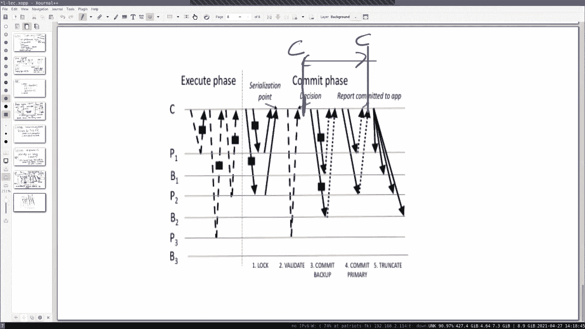

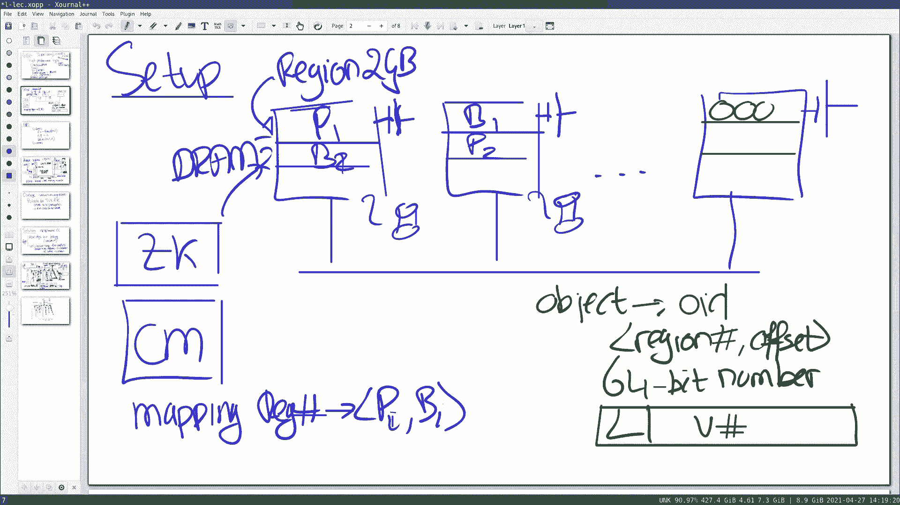

**第 1 阶段：加锁**
协调者（即运行事务的客户端）向所有待写入对象所在的主节点发送 **写入 RDMA** 请求，将一条**锁记录**追加到主节点的日志中。锁记录包含事务ID、对象OID、新值以及读取时的版本号。
主节点上的一个线程轮询日志，看到新记录后，尝试使用原子操作（test-and-set）获取该对象头部的锁位。
*   如果成功上锁，则通过 **写入 RDMA** 向协调者的消息队列发送“锁获成功”消息。
*   如果锁已被占用，则发送“锁获失败”消息，协调者将中止事务。

**第 2 阶段：验证**
协调者对所有**只读但不修改**的对象（如本例中的 R），发起**单边 RDMA 读**，获取其当前的 64 位头部信息（包含版本号和锁位）。
协调者检查：1) 锁位是否被置位（表示正被其他事务修改）；2) 版本号是否与事务开始时读取的一致。
如果任一检查失败，协调者将中止事务（并通知相关主节点释放锁）。否则，进入下一阶段。**此时事务通过了验证，达到了逻辑上的“提交点”**。

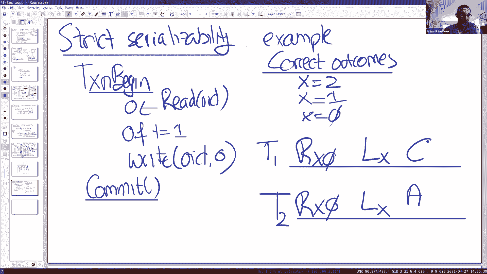

**第 3 阶段：提交至备份**
协调者向所有相关备份节点发送 **写入 RDMA**，将**提交备份记录**（内容与锁记录相同）追加到备份节点的日志中，并等待网卡确认。这一步确保了即使主节点故障，数据也不会丢失。

**第 4 阶段：提交至主节点**
协调者向所有相关主节点发送 **写入 RDMA**，将**提交记录**（主要包含事务ID）追加到主节点的日志中，并等待网卡确认。
**一旦任一主节点的提交记录确认到达，事务即被视为永久提交**。协调者可以通知应用程序提交成功。

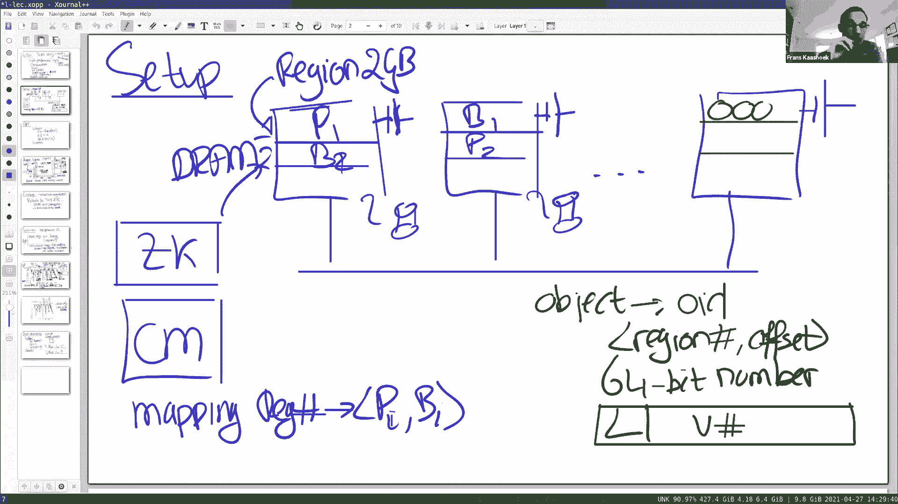

**第 5 阶段：截断**
这是一个后台清理阶段，用于截断已处理完毕的日志条目，释放空间。

## 正确性示例与总结 🎯

最后，我们通过一个简单例子来理解协议如何保证正确性，并对本节课内容进行总结。

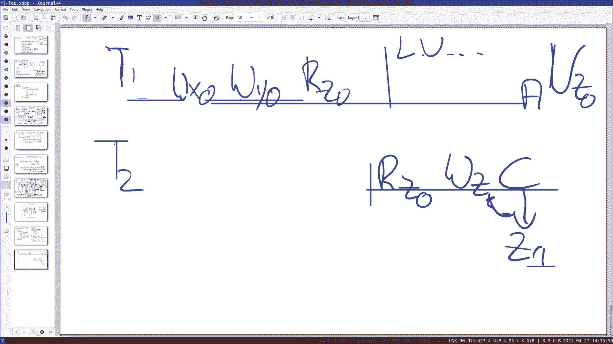

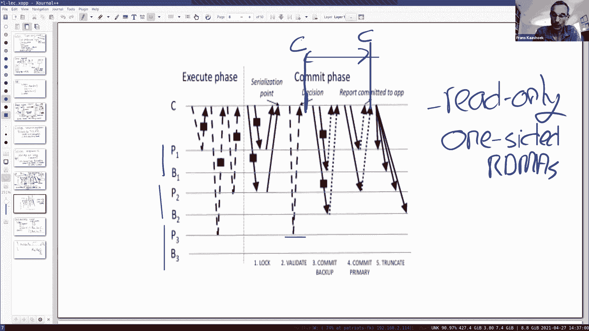

考虑两个并发事务 T1 和 T2，都执行“读取 x，然后 x++，写入 x”的操作。假设 x 初始版本为 0。
*   T1 和 T2 都通过单边 RDMA 读取到 x=0（版本0）。
*   在提交阶段，T1 和 T2 都进入锁阶段。假设 T1 先成功获取 x 的锁。
*   T1 随后通过验证（版本未变），并成功完成提交，将 x 更新为 1，版本号递增为 1。
*   T2 在锁阶段可能因锁已被占而直接失败，或者在验证阶段发现 x 的版本号已变为 1 而与读取时的 0 不符，从而中止。
*   中止的 T2 可以重试，此时它会读取到 x=1（版本1），并可能成功提交，将 x 更新为 2。

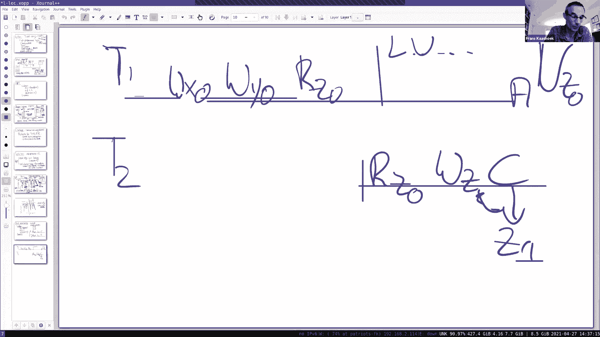

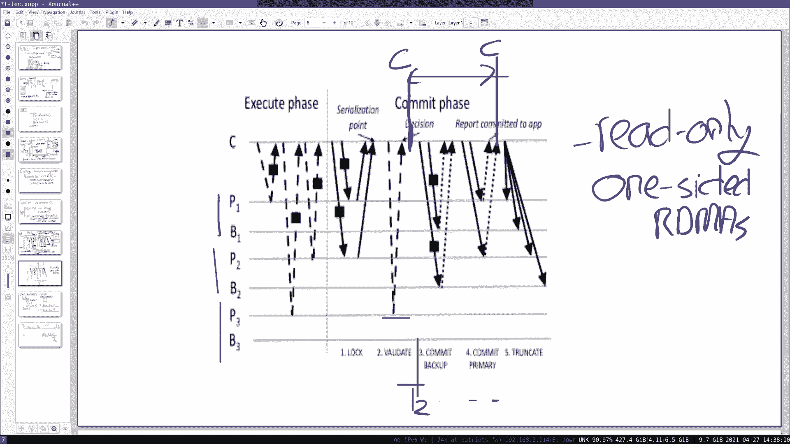

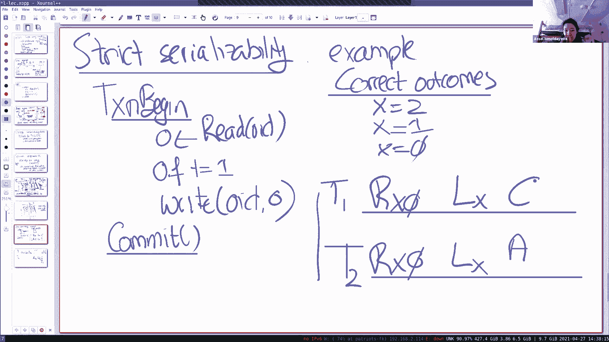

这个例子展示了 OCC 如何通过提交时的验证来解决写-写冲突，确保事务的串行化执行。

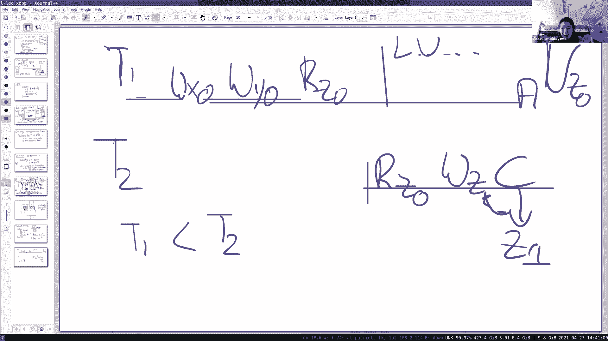

**本节课总结**
在本节课中，我们一起学习了 FaRM 系统，一个追求极致性能的内存事务处理系统。我们了解了其架构如何利用数据分片、非易失性 DRAM、内核旁路和 RDMA 网络来消除性能瓶颈。重点是，FaRM 为了充分利用 RDMA 的低延迟、无服务器端参与的特性，采用了乐观并发控制协议。我们详细剖析了该事务提交协议的五个阶段：加锁、验证、提交至备份、提交至主节点和截断。这个协议在保证严格可串行化和容错性的同时，使得只读事务和低冲突的写入事务能够获得极高的性能。FaRM 代表了在特定假设（数据全内存、低冲突 workload、数据中心内）下对事务性能边界的一次成功探索。