# P16：Lecture 15 continued - Optimistic Concurrency Control (FaRM) pt. 2 - mayf09 - BV16f4y1z7kn

好的，下午好，傍晚好，晚上好，早上好，无论你在哪个时区收看这个课程。再次检查声音，大家能听到我说话吗？是的。是的。好的，今天我要谈两件事，我想结束我们对 FaRM 的讨论，然后我会讨论 Spark 。

只想提醒大家，所以每个人，我们（讨论）更多 FaRM ，我们讨论了执行事务，没有任何失败，我们看了一个例子，事务是否提供了外部一致性或严格的可串行化。所以，我想再谈一个例子，来讨论可串行化。

然后讨论一下容错，但在此之前，提醒一下可能会有帮助，提醒我们事务是如何工作的，如果没有故障。在 FaRM 中，应用程序分为两个阶段，执行阶段，从不同的分片获取对象，然后是提交阶段。所以我们回到这张图片。

有一个执行阶段，三个对象被读取，每个来自不同的分片，我们有分片一，分片二，分片三，每个分片都有一个备份，所以，这个系统可以容忍一个故障。所以一个对象读取，两个对象正在被修改，正如我们稍后会看到的。

一旦三个对象被读取，两个对象被修改，应用程序可能决定提交，然后，整个提交阶段就开始了，整个故事从第一步到第五步，在第一步中，事务获取锁，在写入的对象上，我们在这里可以看到，事务已经写入了两个对象，所以。

我们传播锁记录给每个 primary ，所以，每个 primary 都将拥有这个事务的锁记录，对于事务中涉及的对象，锁记录包含一个对象 id ，唯一地标识对象，一个版本号，在事务读取对象时。

它会得到一个版本号，得到这个 64 位数字，其顶部是锁位，其余是版本号，然后是一个新的值。所以， primary 1 和 primary 2 会有，primary 会有对象 1 的锁记录。

primary 2 会有对象 2 的锁记录，然后有一个单独的阶段用于验证只读操作，或者对象只读，没有修改的操作，是只读但没有修改的对象，正如我们在这些验证步骤中所看到的，虚线表示单边 RDMA 。

正如我们周二谈到的，它们不涉及服务器，发送者能从服务器的内存中读取一个对象，不需要，不需要中断在服务器上运行的计算，所以它们往往非常快，不像我们在这里看到的这些操作，它们是写入 RDMA ，它们也很酷。

在某种意义上，你必须写入，追加到日志记录中，不需要中断服务器，但服务器必须处理这些日志记录，本例中的服务器，一旦它处理了这些日志记录之一，试图获取锁，如果它成功地获取锁，因为版本号没有改变。

或锁位或没有其他事务获取该锁，然后它会回复，用另一个写入 RDMA 说 ok 。所以，我们在获取锁上看到，需要在服务器上执行操作，但用于读取验证的单边 RDMA ，不需要在服务器上执行任何操作。然后。

就是这样，如果一切顺利，事务能够获得这些写入锁，并验证读取操作，它会做出提交的决定，为了提交，它首先联系每个备份，对象改变了，写入提交备份记录，这取决于每个，对于已修改的对象的备份，同样。

它是锁记录的复制，oid 在那里，版本号在那里，新值在那里。一旦所有备份都回复，它们有对象的复制，现在我们处于很好的状态，因为 primary 有复制，备份有复制，[]primary 并不知道。

事务是否已经提交，所以，最后一步是，事务协调者写入并提交记录，并提交主记录，通知 primary 事务已经提交。一旦收到其中一个网卡的确认，由虚线表示的，它向应用程序报告，说这个事务已经提交。

所以我们现在要做的是看两个案例，一个我们想更多地讨论一下可串行化，为了看看并发控制是否起作用，然后我们会稍微谈一下容错，看看容错是否起作用。让我首先从可串行化开始，也许在这么做之前，我想问问。

目前有没有什么问题，或者是否每个人都切换，成功切换想起 FaRM 。长方形在这里是什么意思？抱歉？长方形是什么，这意味着什么？它是对象。哦，这是对象，好的。好的，还有其他问题吗？好的，让我们。

所以我们从并发性的角度来看一下正确性。

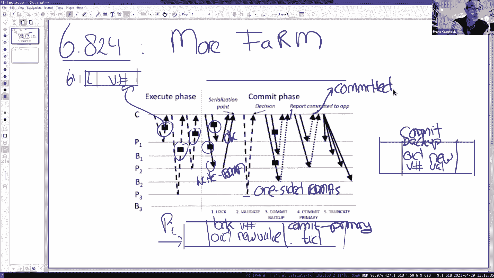

所以严格串行化的正确性。在周二，我们研究了，没有涉及写入验证的事务，因为对象被读取，而不是写入，所以这一次我要看看另一个事务，在那里验证阶段发挥了作用。所以我们来看两个事务，这是，这是一个经典的例子。

用来测试协议是否提供可串行化，当然，它不会被证明，但它是关键的例子之一，总的来说，对了解协议是如何工作的非常有帮助。协议，事务是，如果 x 是 0 ，然后我们设置 y 为 1 ，如果对象 x 是 0 。

我们设置对象 y 1 ，事务 2 正好相反，它是，如果 y 是 0 ，则设置 x 为 1 。之所以这样，这是一个很好的可串行化测试，无论事务 1 应该在 T2 之后进行，或者 T2 应该在 T1 之后。

根据您运行的顺序，要么 y 是 1 ，要么 x 是 1 ，但你永远不会有，你永远不会有结果 x 是 1 ， y 也是 1 。这是不允许的，因为这肯定违反了可串行化。这能理解吗？好的，我们要做的是。

测试 FaRM 是否成功，我们想要了解需求，实际上， x 是 1 ， y 是 1 是不可能产生的。那么让我们来看看时间线，假设这里有 T1 ，这里有 T2 时间线，它们都处于准备或执行阶段。

都读取这些对象，所以我们假设它们同时运行，我们读取 x 和版本号 0 ，我们读取 y ，版本号为 0 ，这里也一样。当然 T1 会更新 y ， T2 会更新 x ，它们在某个点上，开始提交阶段，让我们。

让我们假设 T1 先开始，它需要对 y 加锁，因为它将写入 y ，我们假设 x 成功地获取了 y 的锁，所以它会设置对象 y 的锁位和版本号。然后我们假设，因为它要读取，它读取了 x 。

但它不像读取 x ，但它不是在修改 x ，而是在验证 x ，x 是读取版本号 0 ，在验证阶段，所以 x 并没有改变，那里的版本号仍然是 0 ，我们是按这个顺序执行的，所以一切都很好，在某个时候。

这个事务可能会提交。那么让我们来看看 T2 ，假设 T2 在 x 的验证之后运行，所以它获取锁，它需要读取 y ，所以它需要对 y 进行验证，这将对 y 进行验证，问题是，这个验证是否会成功。不会。

因为之前的另一个操作已经获取修改值的锁，所以这与它最初读到的不一样，是的，所以版本号可能还是一样的，但是 T1 已经设置了对象 y 的锁位，在这一点上，这个验证将失败，因为这不一样，或者锁位已经设置。

所以，对于 T2 事务， T2 事务将会中止。好的，这能理解吗？所以我们至少在这个特定的例子中看到，情况就是这样，T1 和 T2 都提交，将导致这个不正确的结果。对此有什么问题吗？我有个问题。嗯。是的。

所以，对于事务来说，所以这些必须有更新事务，比如重新写入，只是读取，无法做到这一点。好的，继续。我只是在想，如果它们是读取操作，你可以用无锁来做，而且只要。

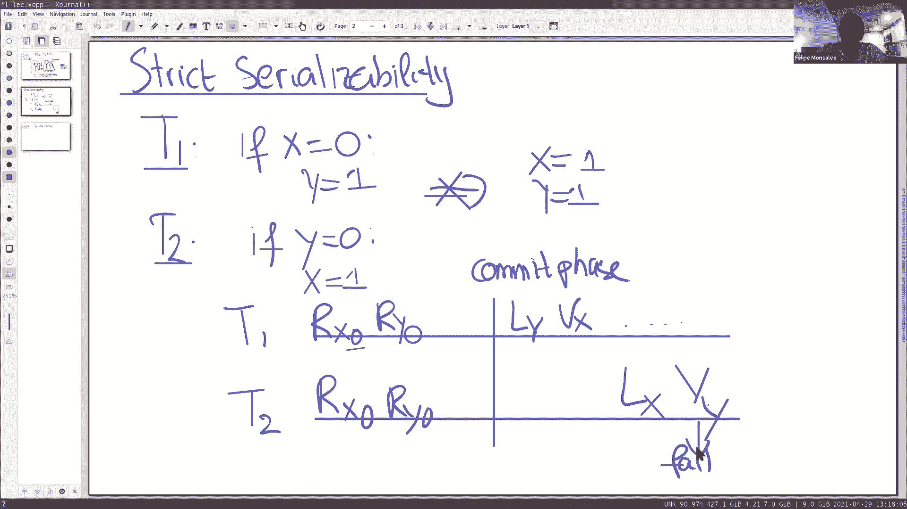

是的，所以这是，让我们回到这张图片上，让我们来看一下，比如，这个事务中根本没有涉及写入，比如，两个对象读取，保存在 P1 和 P2 。所以我们假设这些并没有参与，所以这些对象没有写入，所以。

发生的唯一操作是对这个对象进行读取。你可以看到，协议是精心设计的，所以如果你只做读取，你只做单边 RDMA ，在这里的执行阶段，一个 RDMA 来进行验证，没有锁被拿出来，没有任何写入。

没有附加任何记录，这是唯一发生的事情。所以这是 FaRM 的一个很酷的特点，如果事务只做读取，可以只使用单边 RDMA 执行，不需要写入任何锁或获取锁，这就是它们能获得极高性能的原因之一。这也是为什么。

锁步骤和验证步骤是两个不同的事情，因为在只读事务中，没有锁步骤。好的？关于这个问题，对于只读事务，为什么我们需要第二个，为什么我们需要验证阶段，因为你不是只读取值吗，然后你在它之后验证版本，看起来像是。

可能是另一个事务修改对象，如果事务在之前运行或开始并提交，好的，并发事务写入可能会修改对象，现在，我们回来，所以事务写入，然后后面的事务，应该观察到最后的写入。但如果它们同时发生。

然后我们可以以任何一种方式对它们重新排序。在同一时间，我们可以对它们重新排序，是的。所以在我看来，第二个校验，因为你第一次读取它，第二次直接[]，看到版本是相同的，在我看来，第二次验证似乎是不必要的。

你可能是对的，我还没好好想过这件事，如果事务只是只读事务，那么验证肯定是不必要的，我非常仔细地考虑过，当有混合事务时，你需要验证。是的，如果是这样的话，如果你读取一个值，你希望原子地读取两个值。

在读取值之后，有事务修改了另一个值。是的，这是一种可能。它不会。是的，我不是很确定。

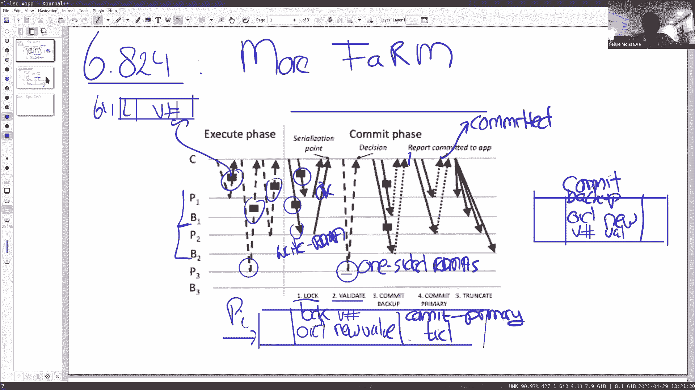

在这种情况下，如果这是问题所在。比如在这种情况下，这个 T1 和 T2 的案例，非常关键的一点是 y 做了验证，即使事务 T1 只读取 y ，但是，如果事务 2 只是 x 等于 1 ，而没有那个语句。

盲写。嗯？如果这是盲写。是的，它只是 x 等于 1 ，然后在 T1 验证后执行。是的，这是好的。但是。我不确定问题是什么。哦，所以如果 T2 只是，比如写入 x 等于 1 ，在验证步骤内。

在 T1 的验证步骤之后，那么 T1 不会认为 x 等于 0 吗，但是在提交之前， x 变成了 1 。好的，也许我们可以先等一下，因为我要重画这张图，弄清楚你所说的场景到底是什么。好的。

也许我们可以在最后回到这个问题上。抱歉，我有个问题，正常事务的用例是什么？如果回想一下 Spanner 和这个论文，很多情况下，这些工作负载， TPC-C 工作负载和 TATP 工作负载。

有一个只读的事务，我计算一组账户的余额，什么都没写，但是很多账户被读取。谢谢。好的，我们在这里看到，验证阶段是至关重要的，T1 和 T2 事务，在[]，发挥作用了，我们得到了严格的可串行化，当然。

这不是证明，但它给了你这个例子，一种棘手的情况，FaRM 解决得很好。好的，所以这是关于并发控制的，然后第二部分。

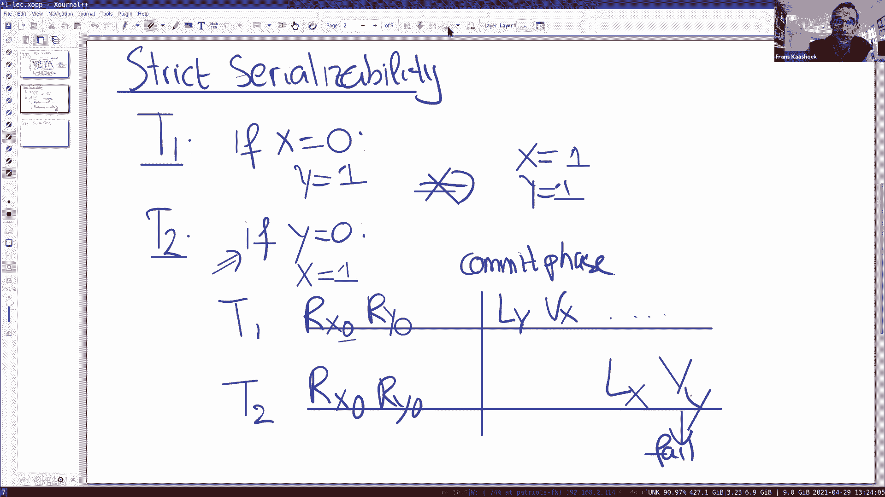

我们想讨论一下容错。这里不会很深入，只想谈谈关键挑战，建立一些直觉，为什么我们希望 FaRM 解决关键挑战。所以关键的挑战是，所以我们面临的关键挑战是，在通知应用程序后，会发生崩溃，然后它必须是这样。

事务持久化，因为我们已经通知应用程序事务已提交，所以，我们不能丢失事务已完成的所有写入。所以我们可以再看一下这张图片。

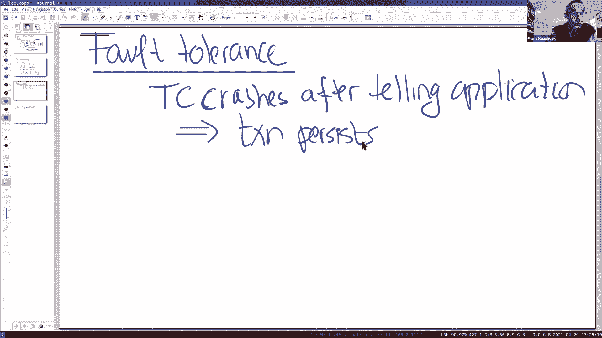

看看我们，希望这是这种情况。

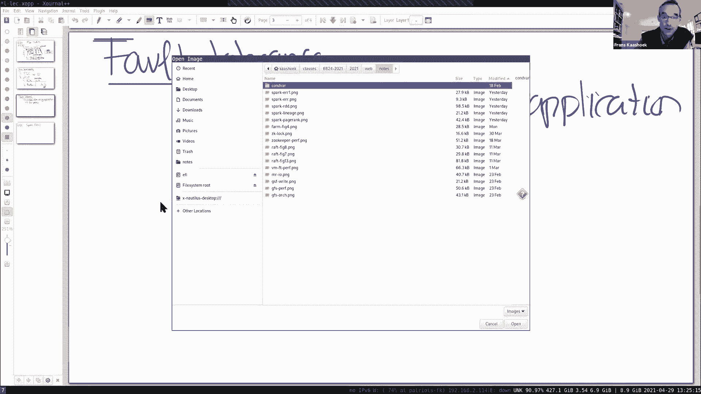

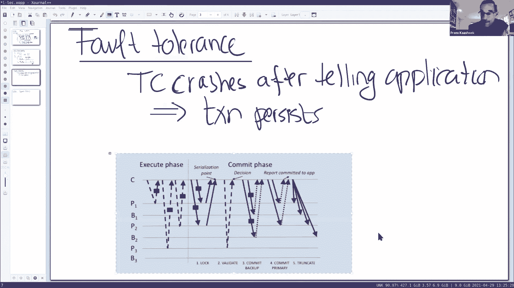

所以有几个事情需要观察。

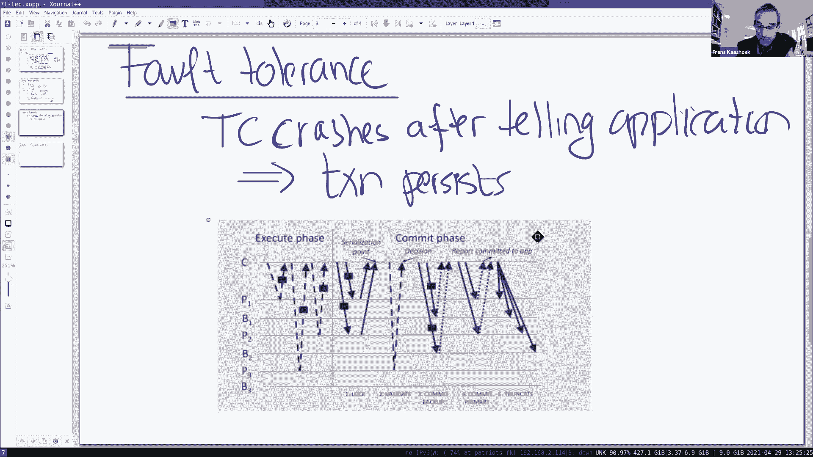

在锁阶段之后，情况是这样的。

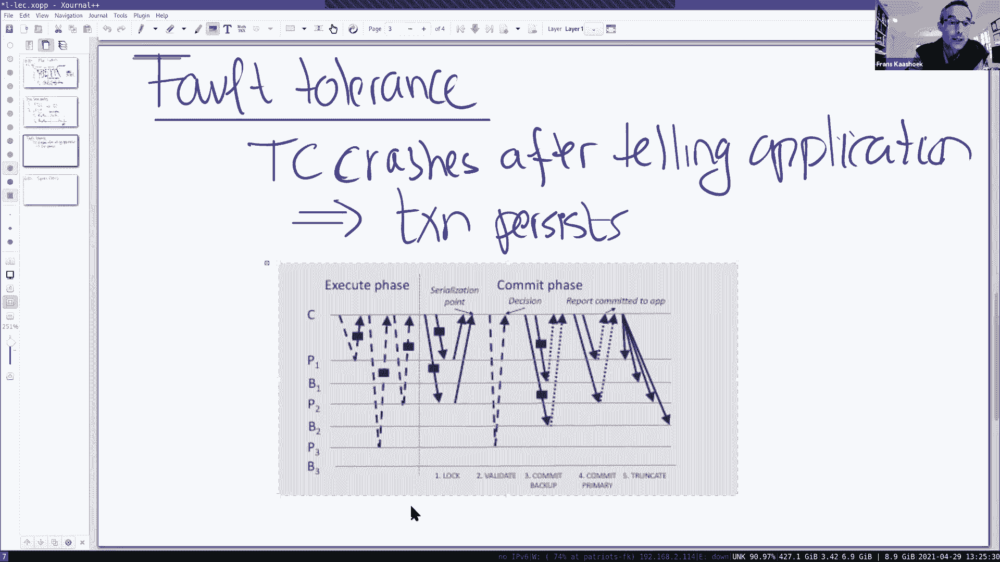

在锁阶段之后，两个 primary P1 和 P2 具有锁记录，描述了更新，我们不知道事务，那个记录没有说，事务是否已经提交，但我们有关于事务的信息，然后，在这步骤之后，到达提交备份步骤。

我们知道备份 B1 和 B2 有提交记录，然后在事务，事务协调者向应用程序报告之前，它必须是成功的，我们知道其中一个 primary ，假设 P1 也有提交记录，我们假设这里发生了崩溃。

所以在那个特定的提交点之后，系统崩溃了，我们想要说服自己的是，如果有一次失败，对于每个分片，事情是正常的，所以最坏的情况是， B2 失败了，所以这里 B2 失败了，所以我们失去了提交记录，它就在那里。

primary 可能还没有提交记录，因为它在我们看到一个 primary 的确认后崩溃了，所以，我们假设 P1 有提交记录，在这种情况下， P1 有提交记录，当然备份有 B1 的提交记录，所以。

这在恢复时有足够的信息，事务已经提交，因为我们有提交记录，这是 tid 提交，我们有备份中的所有信息，即锁以及描述写事务的提交记录，在备份上，所以，在恢复期间，我们有足够的信息来确定。

事务是否已实际提交。所以这是足够的，当然这是一个复杂的协议，需要操作，看看事务留下的所有部分，有足够多的事务留下的部分，对于新的协调者，恢复进程来决定，这个事务已经提交，应该持久化。好的？

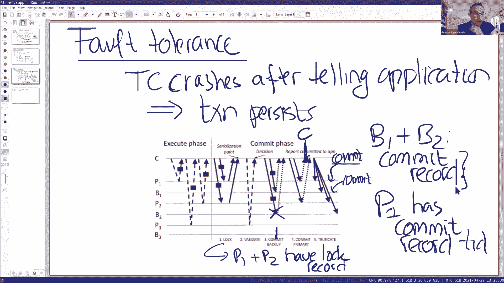

好的。所以让我总结一下 FaRM ，在我们进入关于 Spark 的讨论之前。所以高级别的，FaRM 最酷的地方就是快，它每秒可以执行很多事务，当然 FaRM 有一些限制，你不能一直这样做。所以，首先。

它假设很少有冲突，所以使用这个乐观并发控制方案，之所以使用这种乐观并发控制方案，因为想把锁拿出来，因为它想要做这种单边 RDMA ，不需要任何服务器参与。所以使用乐观并发控制方案，这意味着。

如果你想要好的性能，避免事务中止，工作负载更好，很少有冲突，我们看到了新的创新，有两个基准测试，在事务文献中用来衡量系统，对于这两个基准，做得非常好，意味着它们没有那么多冲突。它提出的第二个假设是。

数据必须存储在内存中，这意味着如果你有一个非常大的数据库，你必须买更多的机器，或者如果你的数据太大，你不想买更多的机器，那么你不能使用 FaRM ，你必须回到更传统的数据库，有持久存储。

你可以在更大的存储设备上读取或写入记录。复制只是在数据中心内进行，所以这种方式，它和 Spanner 有很大不同，整个目标必须是，跨数据中心同步事务，同步复制，为了支持应用程序，它必须存活或继续。

在一些数据中心停机时，FaRM 不是这样的，它不是针对那些类型的应用程序的。最后一点是，它需要非常奇特或奇异的硬件，尤其是有两样东西，UPS ，在数据中心完全故障中存活下来，更重要的是。

使用这种 RDMA 网卡，获得很高的性能。好了，这是关于 FaRM 我想说的，除非有任何进一步的问题。好的，这结束了 6。824 的事务的论文，所以我们做了三节关于事务的课程，这是关于事务的讨论的结束。

也会出现在其他论文上，但我们不会谈论更多细节，事实上，我们已经完成了，讨论分布式系统中最具挑战性的部分，即构建容错存储系统，我们看到了各种不同的设计，包括一些设计，它们支持非常强大的事务编程抽象。

所以在接下来的这节课里，这节课的剩余部分以及随后的课程，我们将讨论不同的主题。

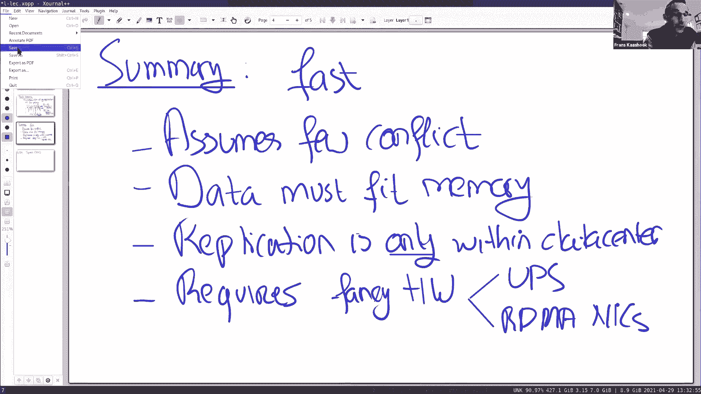