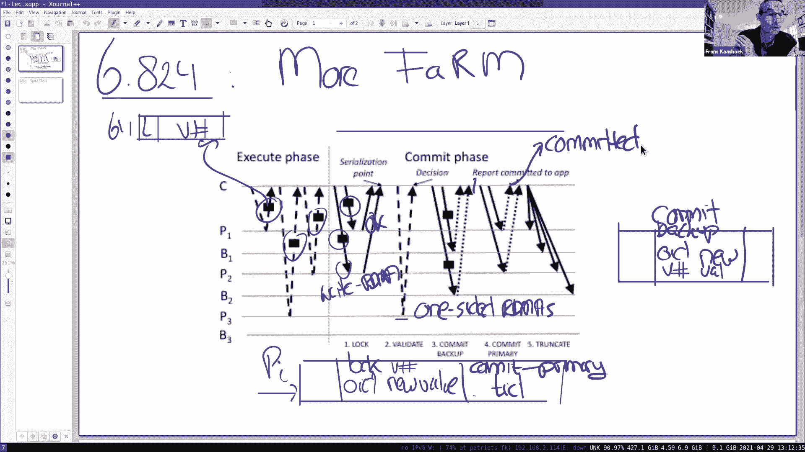
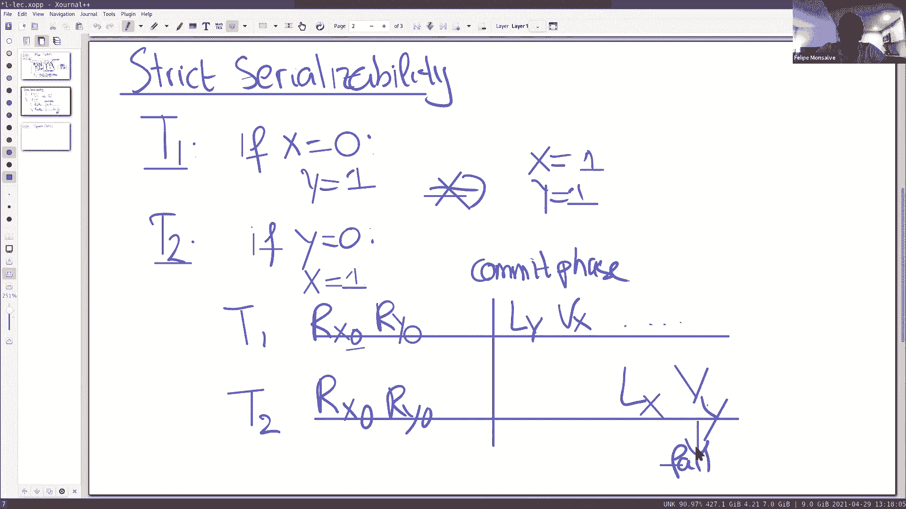
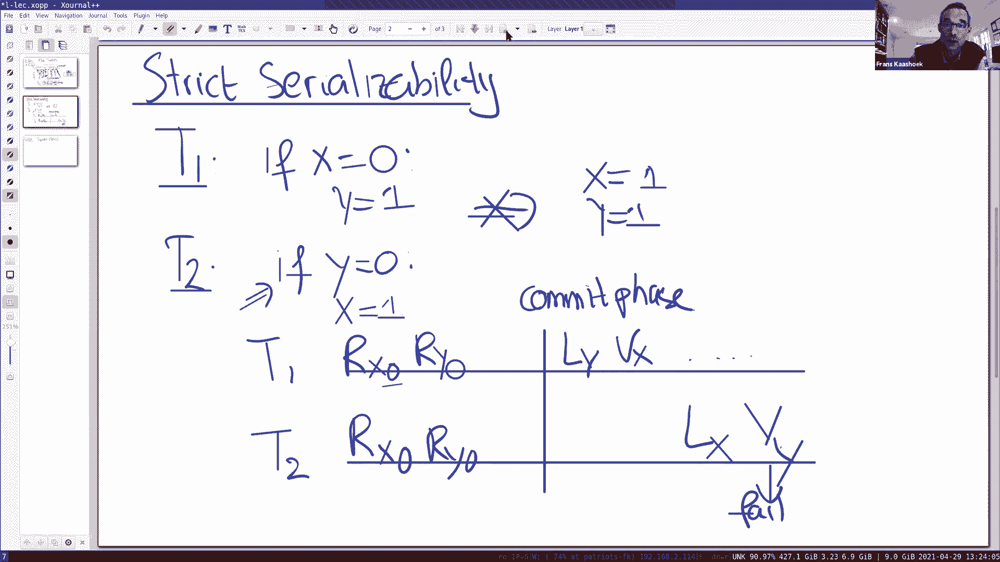
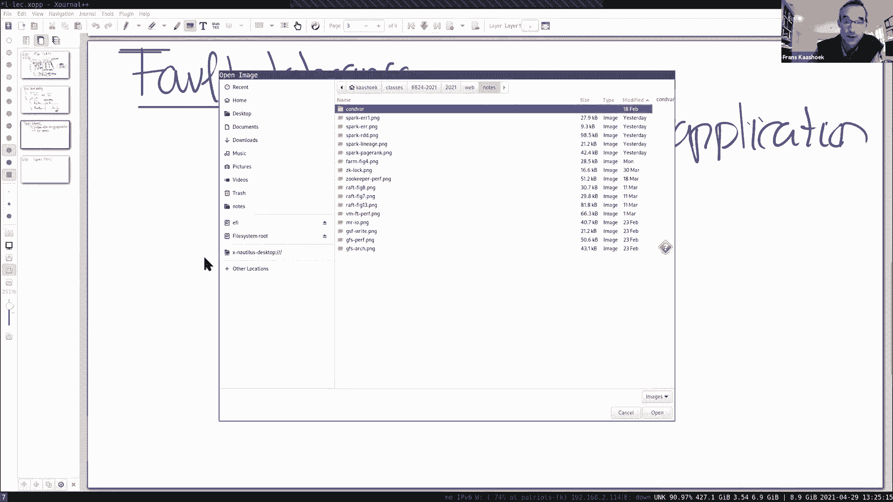
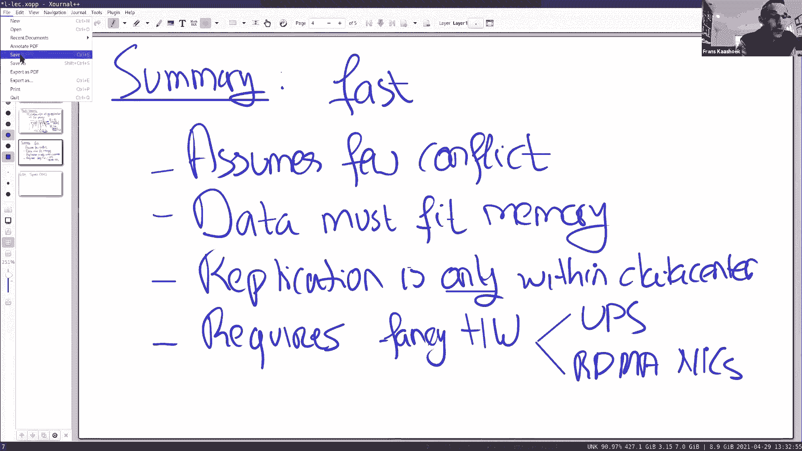

# 课程 P16：第15讲（续） - 乐观并发控制 (FaRM) 第二部分 🚀

在本节课中，我们将继续学习 FaRM 系统。我们将通过一个具体的例子深入探讨其如何保证严格的可串行化，并简要分析其容错机制的工作原理。最后，我们将总结 FaRM 的特点与局限性。

---

## 回顾：无故障时的事务流程

上一节我们介绍了 FaRM 事务在没有故障时的基本流程。本节中，我们来看看一个更复杂的并发场景。

在 FaRM 中，应用程序事务分为两个阶段：
1.  **执行阶段**：从不同分片读取对象。
2.  **提交阶段**：包含锁获取、读取验证、备份复制和最终提交等步骤。

关键点在于，对于**只读对象**，验证通过单边 RDMA 操作完成，无需服务器参与，速度极快。对于**写入对象**，则需要获取锁并在服务器端处理。

---

## 并发控制与严格可串行化 🔄

为了检验并发控制的正确性，我们来看一个经典的测试案例，它涉及两个事务 T1 和 T2。

以下是两个事务的逻辑：
*   **事务 T1**：如果 `x == 0`，则设置 `y = 1`。
*   **事务 T2**：如果 `y == 0`，则设置 `x = 1`。

根据可串行化要求，最终结果只能是 `(x=1, y=0)` 或 `(x=0, y=1)`，而 `(x=1, y=1)` 是**不允许**的，因为它违反了任何串行执行顺序。

### 场景分析

假设 T1 和 T2 几乎同时开始执行：
1.  两者都读取到 `x=0` 和 `y=0`。
2.  T1 需要写入 `y`，T2 需要写入 `x`。
3.  假设 T1 先进入提交阶段：
    *   它成功获取了对象 `y` 的锁。
    *   它验证读取的对象 `x`，由于 `x` 未被修改，验证成功。
    *   T1 提交。
4.  接着，T2 进入提交阶段：
    *   它尝试获取对象 `x` 的锁（成功，因为 `x` 未被锁定）。
    *   它尝试**验证**读取的对象 `y`。此时，由于 T1 已经获取了 `y` 的锁并可能更新了它，`y` 的版本号或锁位已改变。
    *   因此，T2 对 `y` 的**验证失败**，事务 T2 将**中止**。

通过这个机制，FaRM 防止了 `(x=1, y=1)` 这个非法结果的出现，保证了严格可串行化。

### 关于只读事务的说明

以下是关于验证阶段的一个关键点：

*   对于**纯只读事务**（不修改任何对象），协议仅通过单边 RDMA 读取和验证版本号即可完成，无需获取任何锁，这是 FaRM 高性能的重要原因之一。
*   验证阶段对于**混合事务**（同时包含读和写）至关重要，它确保了事务读取数据后，在提交前这些数据没有被其他事务修改。

---

## 容错机制简介 🛡️

讨论完并发控制，我们来看看 FaRM 如何应对故障。核心挑战是：在向应用程序报告“事务已提交”后，若发生崩溃，必须确保该事务的所有写入都不会丢失。

我们再次回顾提交阶段的几个关键步骤和持久化信息：
1.  **锁记录**：存储在对象的 Primary 副本上，包含对象ID、版本号和新值。它不指明事务是否已提交。
2.  **提交备份记录**：存储在对象的 Backup 副本上，是锁记录的副本。
3.  **提交主记录**：事务协调者通知 Primary 副本事务已提交。

### 崩溃恢复场景

假设在最终提交后，系统发生了部分故障。FaRM 的复制设计（每个对象有一个 Primary 和一个 Backup）确保了数据的可恢复性。

考虑一个最坏情况：某个对象的 Backup 副本和另一个对象的 Primary 副本在提交确认后崩溃。恢复进程可以通过检查存活的副本上遗留的**提交记录**和**锁记录**，来重构并确定哪些事务已经提交，从而持久化其写入。

这种设计保证了，一旦协调者向应用程序返回成功，即使在后续发生故障，事务的结果也是持久化的。

---

## 总结：FaRM 的特点与局限 📊

本节课中我们一起学习了 FaRM 如何通过乐观并发控制处理复杂的事务冲突，以及其容错机制的基本原理。最后，我们来总结一下 FaRM 系统的核心特点与局限：

**主要优势：**
*   **速度极快**：利用 RDMA 和单边操作，尤其擅长处理只读和低冲突事务。
*   **内存存储**：所有数据常驻内存，访问延迟极低。

**假设与局限：**
1.  **低冲突工作负载**：其乐观并发控制机制在事务冲突频繁时会导致大量中止，性能下降。
2.  **数据全内存**：数据库容量受限于集群总内存大小，成本较高。
3.  **数据中心内复制**：不支持跨地理区域的同步复制，无法应对整个数据中心级别的故障。
4.  **特殊硬件依赖**：严重依赖 RDMA 网卡和不同断电源 (UPS) 等硬件来保证高性能和持久性。

FaRM 代表了在特定硬件和负载假设下，追求极致性能的分布式事务系统设计。它结束了我们关于分布式事务的系列讨论。从下一节课开始，我们将转向分布式系统中的其他主题。