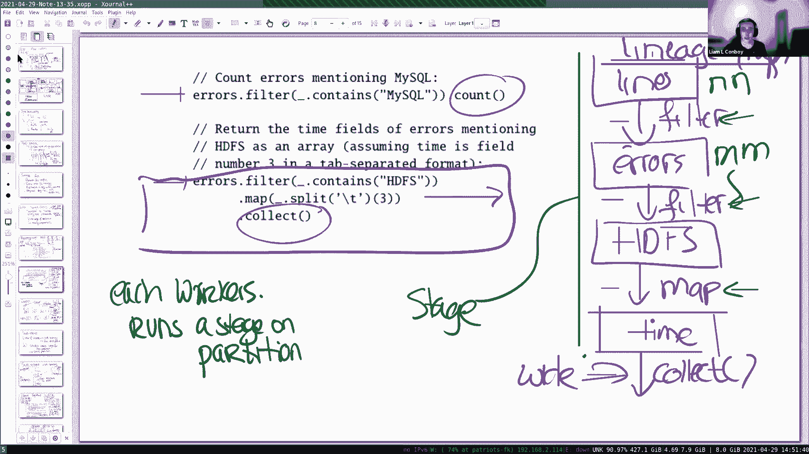

# P17：Lecture 16 - Big Data - Spark - mayf09 - BV16f4y1z7kn

我们将谈论的是 Spark ，所以这几乎可以追溯到学期开始，我们在那里谈了很多关于 mapreduce 的事情，事实上，在实验 1 你实现了 mapreduce 。事实上，非正式的。

Spark 是 Hadoop 的继任者，Hadoop 是 mapreduce 的开源版本。所以我认为今天，人们通常会使用 Spark 而不是 Hadoop 。所以它有广泛的应用。

它被广泛用于数据科学计算，所以人们有大量的数据，需要对其进行一些计算，需要大量的机器，Spark 是为这个特殊的情况而设计的，它由一家名为 Databricks 的公司商业化。

Matei Zaharia 是作者，这篇论文的主要作者，他的博士论文，和其他一些人一起开始，Databricks 公司将 Spark 商业化，但它也支持 Apache 开源 Spark 版本。

它是一个很流行的开源项目，或非常流行的开源项目。它取代 Hadoop 的一个原因是，因为它支持更广泛的，比 mapreduce 更广泛的应用程序，尤其是非常擅长这些迭代。

糟糕，发生了什么，一些东西可能崩溃了，稍等一下。

好的，幸运的是[状态很好]。好的，所以它支持广泛的应用，尤其擅长迭代应用，所以，如果应用程序需要执行多轮 mapreduce 操作，如果你有一个应用程序，需要先执行一轮 mapreduce 。

然后再执行一轮 mapreduce 计算，Spark 很适合它，它很擅长的原因是，因为它将中间结果保存在内存中，这是很好编程支持。在某些方面，如果之前的论文和这篇论文之间有任何联系，基本上没有。

但它们都是针对内存计算的，对于可以存储在内存中的数据集，在之前的论文和 FaRM 论文中，是关于在内存中的数据库，这里是数据科学计算的数据集，用于你想做的数据科学计算。当然。

自从 2012 年这篇论文发表以来，发生了很多事情，Spark 并不是与 Scala 捆绑在一起，像论文中描述的那样，比如，还有其他语言前端，但更重要的是，在这篇论文中定义的 RDD 有点过时了。

被数据帧所取代，但是考虑数据帧的方式，在我看来，这是带有显示列的 RDD ，RDD 的所有好想法也适用于数据帧。所以这节课剩下的部分，我只想谈谈 RDD ，并将它们等同于数据帧。在我继续之前。

有什么问题吗？然后快速提出另一点，也许这项研究真的很成功，被广泛应用，Matei 也获得了 ACM 博士论文奖，对于这篇论文，都是关于 Spark 的。对于一篇博士论文来说，这是相当不寻常的。

产生这样的影响。好的？所以我想讨论 Spark ，通过查看一些示例，因为我觉得最好，你了解编程模型，这是基于 RDD 的，我想最好是查看示例，你能最好的了解 RDD 。所以让我举一些例子，在论文中的。

然后我们走一遍。拿出这个，让我们从这里开始，一个非常简单的例子。所以想法是，在这个例子中，首先，你可以互动地使用 Spark ，你可以在工作站或笔记本电脑上开始 Spark ，开始与 Spark 互动。

使用输入命令的方式。那么现在这个命令做了什么，这会创建一个 RDD ，称这个为 RDD ， lines 是 RDD ，我这里表示 RDD 存储在 HDFS 中，HDFS 可能有许多分区，对于这个文件。

例如，第一个 1000 或 100 万条记录在分区 1 上，下一个 100 万在分区 2 ，接下来的 100 万在分区 3 ，这个 RDD lines 代表了这组分区，当运行这行或输入这行并回车。

什么都不会发生，这就是论文所说的懒惰计算，事实上，计算在稍晚一些执行，我们稍后会看到什么时候，但在这个特定的点上，唯一发生的事情是，RDD 中有一个 lines 对象。而且 RDD 支持广泛的操作。

我们可以看一下它支持的一些操作。是的，它有， RDD 有一个 API ，事实证明， API 的方法，或者 RDD 上的方法在两个类中，一个是 Actions ，Actions 是会导致计算发生的操作。

所以，所有懒惰的构建计算，都发生在你运行 Action 的时间点，比如，你运行 count 或 collect ，然后， Spark 计算将被执行。

所有其他 API 或方法都是 Transformations ，它们把一个 RDD 变成另一个 RDD ，每个 RDD 都是只读的或不可变的，所以，你不能修改 RDD 。

只能从现有的 RDD 生成新的 RDD 。所以如果我们看第二行，这创建了第二个 RDD ， RDD errors ，这是通过在 lines RDD 上运行过滤器创建的，所以 lines RDD 只读。

你可以对它运行 filter 方法，在这种情况下，过滤出所有记录，所以以消息 ERROR 或字符串 ERROR 开头的行，这代表一个新的 RDD ，同样，在这一点上，并没有计算出任何东西。

只是一个[配方]或创建一个数据流，或者论文中所说的计算迭代图。此外，当计算开始运行时，它还没有运行，但当它开始运行时，这些操作是流水线的，这个的意思是，比如，在第一阶段，计算这个 lines 。

第一阶段将读取一些记录，例如，从第一个分区，然后，对它进行处理，如果有什么东西，然后移交给第二阶段，第二阶段会做这个 filter ，所以在第二阶段，这个 filter 将运行。

找出 lines 中匹配的，用它产生新的 RDD ，只包含以（ERROR）开头的 lines ，以字符串 ERROR 开头的 lines 。当第二个 RDD ，第二个阶段运行。

第一阶段从文件系统中获取下一组记录，然后再把它们带到第二阶段，随着你越走越远，你有越来越多的阶段在你的管道中，或者你的迭代图，所有这些阶段将会并行运行，这就是我所说的流水线转换。好的，所以，这行描述了。

如何创建 errors RDD ，然后这一行，告诉 Spark 在内存中保留这个 RDD 的复制，如果后续计算运行，使用 errors 做更多，Spark 会将原始的 RDD 保存在内存中，这样。

它可以与以后的计算共享，例如，如果你想要重用错误文件，那么错误文件将存储在内存中，不需要从文件中重建，从 HDFS 中，允许你运行第二次计算。即使在这个简单的例子中。

你会发现这和 mapreduce 有很大的不同，在 mapreduce 作业中，你运行计算，它结束，然后，如果你想对数据重新做一些事情，你必须从文件系统重新读取它，而使用这个 persist 方法。

Spark 可以避免必须从磁盘重新读取数据，节省了很多时间。到目前为止，有什么问题吗？所以，当错误文件从 P1 中提取出来时，然后另一个错误文件从 P2 中提取出来，所以我的理解是，这是并行发生的？

是的，所以你可以考虑它，就像在 mapreduce 中，有很多 worker ，worker 在每个分区上工作，调度者会发送工作，给每个 worker ，作业是一个属于分区的任务。

worker 开始获取一个任务，然后开始运行。所以，你可以在分区之间获得并行性，你也会得到流水线中的各个阶段之间的并行性。我明白了，谢谢。是什么。抱歉。你能听见我说话吗？

lineage 和事务日志有什么不同，我们之前看到的，它是否只是操作的粒度？正如我们看到的，日志是严格的线性的，到目前为止我们看到的例子，lineage 也是线性的。

但我们稍后会看到使用 fork 的例子，其中一个阶段依赖于多个不同的 RDD ，这在日志中不具有代表性。它们有一些相似之处，比如你从开始状态开始，所有的操作都是确定性的，然后，你会得到。

如果你应用所有这些操作，将得到某种确定性的结束状态，所以在这个意义上，有一些相似之处，但是，我觉得它们很不一样。我也有一个问题，在这个 filter 的例子中，它只需在每个分区上应用 filter 。

但有时，比如我看到 transformation 也包含 join 或 sort 。好的，让我们稍微谈一下，我稍后会谈到 sort 和 join ，它们显然要复杂得多。所以。

这个 persist 是不是我们开始计算的时候？不，没有东西计算出来，仍然是所有的描述，让我们进一步讨论一下。让我们来看看产生计算的东西。所以，这是两个导致计算的命令，所以这个命令将导致计算。

因为它包含 count ，这是一个操作，这个命令将导致计算， collect 是一个操作。所以你可以，所以我们看，所以它们显示两个命令的原因，因为它们证明了你可以重复使用 errors ，所以。

如果你看一下这个计算，然后你可以画出谱系图，开始是 lines ，我们运行了一个 filter ，糟糕，抱歉，让我写的稍微不同一点，在 lines 上有一个 filter 。

我们看到产生 errors ，或者这是一种描述，如何获得 errors ，然后在这种情况下，还有另一个 filter ，它是 HDFS 的 filter ，这会产生另一个 RDD 。

RDD 在这里并没有明确的名称，但它产生了另一个 RDD ，所以我打算把它叫做 HDFS ，因为 filter 在 HDFS 上，然后，我们看到有一个 map ，这又产生了另一个 RDD ，再次。

这个 RDD 在这里没有名字，它是匿名的，我要给它起个名字，就是 time ，因为把每一个行分为三部分，从中拿出第三部分，那正好就是 time ，然后，有一个最后的操作，就是 collect 。

它统计所有的 time 出现的次数，或者在 time RDD 产生的条目的数量。好的？所以这就是这一点，在这里返回，在用户界面或交互用户界面中，在这一点上，Spark 会收集很多 worker 。

给它们发送工作，或者通知调度器需要执行作业，这个谱系图中需要执行的任务的描述。所以我们可以稍微思考一下是如何执行的，所以让我画一张图，图片如下所示，这就是所谓的驱动，这是很常见的事情，用户输入的程序。

它从收集很多 worker ，很多机器开始，几乎与 mapreduce 中的一样。这里会有 HDFS ，lines 文件，有分区， P1 P2 之类，等等。通常分区的数量大于 worker 的数量。

抱歉，数量，是的，分区的数量大于 worker 的数量 ，有负载平衡，比如一个分区很小，而另一个分区很大，你不想让 worker 无所事事。基本上调度器，有一个调度器运行计算，它有谱系图的信息。

所以 worker 加入，driver 分发代码， Spark 程序，我们刚刚构建的，worker 去找调度者，说，我应该在哪个分区工作。然后，它们作为流水线的一部分运行，所以我们看看这个。

让我把这个画得稍有不同，所以我在这里有更多的空间。所以我们看到有很多阶段，然后最后一个阶段是，最后一个操作是 collect 阶段。所以在我们刚才看到的这个场景中。

collect 阶段当然需要从所有分区收集数据，所以原则上，我们画一条绿线，基本上这一切，都是在一个独立的分区上执行的，所以每个 worker 会从调度器得到这些任务中的一个，运行东西。

最后产生一个 time RDD ，当调度者确定所有 time ，所有这些阶段，这被称为阶段，如果所有阶段都已完成，所有区间产生了 time ，然后它会运行 collect 操作做加法。

从每个分区获取信息，用来计算 collect ，这不是 collect ，这是 count ，很抱歉。所以，思考这个问题的一种方式是，这有点像 mapreduce ，其中有 map 阶段。

然后你有 shuffle ，然后运行 reduce 阶段，而 count 在这种方式上几乎是一样的，在论文中，他们提到这一点的方式是，这个依赖关系称为宽依赖。

因为 action 或 transformation 依赖多个分区，这些称为窄依赖，因为这个 RDD ，为了制作这个 RDD ，只依赖于另一个，只依赖于父分区，只需一个父分区就能计算它。一般来说。

你会希望计算有窄依赖，因为它们可以在没有任何通信的情况下在本地运行，在宽依赖之前，你可能需要 collect ，你可能需要从父分区收集，或者你可能必须从所有机器的父 RDD 收集分区。教授。嗯。

我有个问题，所以在论文中，它说窄依赖，父 RDD 的每个分区，用作最多是子 RDD 的一个分区，但它没有说任何关于控制的事情，比如，它没有说子分区最多只使用一个父分区。是的，没错，因为。是的。

如果一个子分区使用多个父分区，那么它就是一个宽依赖。如果一个父分区，抱歉。如果子分区使用分区，如果多个父分区，那么它就是一个宽依赖。例如在 count 的情况下，你有 time 分区。是的。

count 操作将收集所有来自它们的数据。是的。所以如果 count RDD ，它不是，这只是一个 action ，但即使是我们在 RDD ，那么这将需要与所有的父分区交互。我的意思是，我想恰恰相反。

我想这可能像是，我是说，我真的很困惑，在论文中，在这个特定的问题上，但正如上面所说，父 RDD 的每个分区至多由一个子分区使用，但它没有说子分区使用最多。我不确定你为什么会对此感到困惑，所以。

我们可以推迟这件事，然后回来讨论它。好的。我认为关键的是观察到有两种依赖，宽的和窄的，宽的涉及到通信，因为它们必须，从父分区收集信息。好的？谢谢。我有一个关于接口的问题，在前面一两张幻灯片上。

如果我们不调用 errors。persist ，会发生什么？如果你没有，那么，第二个计算，比如这个计算，将从头开始重新计算 errors ，如果你运行这个工作负载。

Spark 会重新计算 errors ，从开始文件开始。知道了，谢谢。关于这一点，我有一个问题，对于不调用 persist 的分区，在 mapreduce 的情况中，我们把它们存储在中间文件中。

但我们仍然将它们存储在本地文件系统中，比如，在 mapreduce 的情况下，我们在这里存储中间文件吗，我们不持久化在某些持久存储中，或者我们只是将整个流保存在内存中？默认情况下，整个流都在内存中。

除非你可以提供，有一个例外，我们稍后会更详细地讨论，你可以看到这里的 persist ，这个 persist 使用另一个标志，我认为是 reliable ，然后，集合存储在 HDFS 中。

这个称为检查点。我明白了，谢谢。关于分区，我有一个简短的问题，对于分区， RDD 最初，是否最初 HDFS 对它们分区，为每个 worker 操作是 Spark 处理。

这个 lines 在 HDFS 中，分区是由 HDFS 中的文件直接定义的，你可以重复，你很快就会看到，可能是阶段在这样做，例如使用散列分区技巧，你还可以定义自己的分区程序，提供一个分区程序对象或抽象。

所以，它已经由 HDFS 处理，但如果你想为 Spark 再来一次，那么你可以。当然，文件也是创建于，这个文件可能有旁边的日志系统创建，并且产生不同的分区，或者如果你愿意，你可以重新洗牌。理解了，谢谢。

好的，那么，所以让我，所以这是执行模型，我想讨论一下容错。所以让我们回到，这种容错，我们担心的是容错性是，也许其中一个 worker 可能会崩溃，那个 worker 已经计算了一些分区。

所以我们需要重新执行，基本上这个方案和 mapreduce 是一样的，如果一个 worker 崩溃，我们需要，在 mapreduce 中， map 任务需要重新执行。

可能 reduce 任务也需要重新执行，在这里，任务稍微复杂一些，因为像这些阶段，这意味着，如果一个 worker 失败了，我们可能得重新计算那个阶段。所以，让我们更多地谈谈这一点，从容错的角度来看。

这是我们想要实现的目标。这个与之前的不同，你在实验 2 或实验 3 实现的或 Paxos ，稳定存储以及之类的东西，这里，我们担心的是 worker 的崩溃，worker 丢失了内存，这意味着丢失分区。

后面的计算部分可能依赖于这个分区，所以，我们需要重新读取或重新计算这个分区。所以，解决方案与 mapreduce 中的很像，调度器在某个时刻注意到没有得到答案，然后重新运行那个分区的阶段。最酷的部分是。

像在 mapreduce 中一样，如果我们查看这里 Transformations 的所有 API ，所有这些转换都是函数式的，所以它们接受一个输入，它们将 RDD 作为输入。

它们产生另一个 RDD 作为输出，是完全确定性的。就像在 mapreduce 中，这些 map 和 reduce 是函数式计算，如果重启一个阶段，来自同一输入的一系列转换，然后，你将产生相同的输出。

所以，你重新创建相同的分区，重新创建分区就可以了。好的？抱歉，这就是为什么它们是不变的吗？我想这是它们不变的原因。好的，有一个棘手的例子，我想谈谈，对于窄（依赖）的容错。

与我们以前在 mapreduce 中看到的一样，但是，棘手的情况是宽依赖。所以假设我们有一些转换，其中一个转换依赖于，这就像是，这里有一个 worker ，这里有另一个 worker 。

以及另一个 worker ，其中一个阶段依赖于多个父分区，所以我们假设这可以是一个 join ，或者我们以后会看到其他的操作，我们在收集许多分区的信息，从那里创建一个 RDD 。

那个 RDD 可能被 map 使用，并继续，所以现在假设我们是 worker ，我们在这里坠毁，然后我们需要重建这个 RDD ，我们继续，这意味着，我们也可以重新计算这个 RDD 。

为了重新计算这个 worker 的 RDD ，这意味着我们还需要其他 worker 上的分区。所以重新构建，重新执行计算，在一个 worker ，一个分区上，可能会导致这些也需要重新计算。当然。

你可以部分并行地做这件事，你可以要求，请开始重新计算这个，重新计算那个，然后再次产生最终的 RDD ，但是当然，一个 worker 失败可能导致许多分区的重新计算，这有一点浪费。所以，解决方案是。

作为一名程序员，你可以检查点或持久化 RDD 的稳定存储，所以你可能会决定，例如，这是一个 RDD，你不想在失败的情况下重新计算，因为它需要重新计算所有不同的分区，你可能希望对这个 RDD 设置检查点。

然后这个阶段，当这个计算需要重新执行的时候，将读取来自检查点的分区的结果，而不是从头开始重新计算它们。这就是 Spark 支持检查点的原因，这就是他们对宽依赖的容错故事。对于这个，有什么问题吗？

我有一个问题，所以你使用一般的持久化，但是他们也提到了一个 RELIABLE 标志。嗯。所以我想知道，比如，只持久化和使用 RELIABLE 标志有什么不同？持久化只是意味着你将 RDD 保存在内存中。

你不会把它扔掉，所以你可以在以后的计算中重复使用它，在内存中使用，检查点或 RELIABLE 标志意味着，你将整个 RDD 的副本写入 HDFS ，而 HDFS 是持久或稳定的存储文件系统。

有没有一种方法可以告诉 Spark 不再持久化某些东西，因为，如果你持久化了 RDD ，而且你做了大量的计算，但是后面的计算不在使用那个 RDD ，你可能会把它永远留在内存中。是的，我想你可以。

或者 Spark 使用了一个通用的策略，他们稍微谈了一下这件事，如果真的没有空间了，它们可能会将一些 RDD 放到 HDFS 或删除它们，论文对他们的具体计划有点含糊。谢谢。当然，当计算结束时。

用户退出，或停止你的驱动，那么我想那些 RDD 肯定已经从内存中消失了。好的？好的，这就是 Spark 的故事，我们看到了 RDD 是什么，我们看到了执行是如何工作的，我们看到了容错计划是如何工作的。

我想谈的另一个例子，展示 Spark 闪耀的地方，这是一个迭代的例子。所以在包含迭代结构的计算中，而我想要谈的是 PageRank 。我想你们大多数人都熟悉某种形式的 PageRank 。

这是一个对网页赋予权重或重要性的算法，这取决于指向网页的链接的数量，例如，如果你有一个网页 U1 ，指向它自己，你可能有一个网页 U3 ，所以我将使用一个例子，以及网页 U2 。

U2 有到自己和到 U3 的链接，也许 U3 有到 U1 的链接。基本上 PageRank 是基于这些连接性的算法，计算网页的重要性，PageRank 是早期的一个算法，驱动 Google 搜索机器。

从这个意义上说，如果你有一个搜索结果，你对搜索结果排名的方式是，如果搜索结果出现在更重要的网页上，那个结果会在列表中提升到更高的位置，这是早期的原因之一，Google 搜索引擎会产生更好的搜索结果。

更重要的信息，或更重要的网页是在顶部。所以，论文介绍了 Spark 中 PageRank 的实现。所以这是 Spark 的 PageRank 实现，像之前那样，这只是一个描述，所以我们来看一下每一行。

这些只是如何计算 PageRank 的方法，在这个示例中，如果你在后面做 ranks。collect ，然后，计算会在机器集群上进行，并使用我们之前看到的某种执行模式。所以我想更详细地介绍一个这个例子。

为了得到一种感觉，为了得到更好的感觉，为什么 Spark 在迭代的情况下是闪耀的。所以，这里有两个 RDD ，我也会谈论一些在 Spark 中很酷的优化，其中之一是 links RDD 。

links 表示了图的连接，准确地说，它可能有一条线，我将这样写它，每行一个 URL ，所以这是 U1 ，它有两个出链接 U1 U3 ，我在这里漏掉了一个链接。然后是 U2 条目。

指向 U2 和 U3 。这里有一个条目 U3 指向 U1 。所以这是对万维网的的描述，当然我的小的例子，我有三个网页，但如果在 Google 的规模上运行这项工作，你会有十亿个网页。

所以这个文件是巨大的，它被分到不同分区。这就是 links 。然后 ranks 是一个类似的文件，它包含这些网页的当前排名，所以你可以认为这些是，U1 逗号，它的排名，我们假设排名初始为 1。0 。

然后这是 1。0 ，然后 U2 1。0 ，U3 1。0 。我们看到 links ，links 是保存在内存中，这与 error 文件的方式相同，我们之前看到的 error RDD 。然后 ranks 。

它被初始化为某些东西，然后是迭代次数的描述，以产生新的 ranks RDD 。你可以看到这是如何进行的，我们注意到的一件事是，links 在每次迭代中都会被重复使用。

links 与 ranks join ，join 这个是什么意思，这个操作创建一个 RDD ，我们想知道 RDD 是什么样子的，RDD 看起来会像，U1 以及 ranks join links 文件。

所以会是 U1， U1 U2， U3 ，出链接加上 U1 的排名，我要把它写成 R1 。RDD 就是在这里产生的，所以对于 U2 也是一样的，对于 U3 ，是 U1 和 R3 ，基本上合并这两个。

字面上基于 key 连接两个文件。好的？然后它在这里运行一个 flatMap 的计算，而 flatMap 本身内部有一个 links 的映射，所以它会运行，[]会运行通过这个列表。

将排名划分到出 URL 。所以它会创造了三元组的形式，让我用绿色来写，U1 R1/2 ，U1 或者 U3 的出链接，所以给 U1 1 ， U3 1 ，这是 U3 R1/2 ，等等。

它创造了这种三元组的形式，所以它计算出，划分排名到出边上，把这些 ranks 的值给出边，所以出边，所以我们有一个很大的 RDD 包含这种格式，产生 contribs RDD 。然后是最后一步。

我认为它首先是 reduceByKey ，所以把所有 U1 放在一起，然后对它们相加，所以这样的结果是，所有的权重或分数权重，U1 收到的都会加起来，U1 当然会收到自己的权重，这个，与 U3 相关。

所以加起来，会有 R1/2 ，R3/1 ，这就是创造出来的总和。这给了我们一份总和列表，然后再把它们加起来，并计算成最终的值。它产生了新的 ranks RDD ，它有相同的形状，像我们之前看到的。

也就是这个，对于每个网页，都有一个数字。这能理解吗？所以，这样的描述是很有趣的，首先，你可以看到，PageRank 的描述相当精确，这是一个例子，如果你以 mapreduce 样式运行过这个。

那意味着这个循环的每一次迭代，在迭代结束时，你将结果存储在文件系统中，然后你重新读取结果给下一次迭代，在这个 Spark 系统中，每一次迭代都直接在内存中运行，将结果留在内存中。

所以下一次迭代可以在那里找到它，此外，这些 links 文件在所有迭代之间是共享的。好的，为了更有意义一点，比如为什么，还有一个很酷的，查看它的方式是，查看这个计算的谱系图。让我们来看一下谱系图。

所以这是 PageRank 的谱系图。所以我想指出几件事，首先，这些谱系图是动态的，糟糕，随着迭代的次数不断增长，当调度器计算新的阶段时，然后，它继续前进，我们可以看到阶段是什么，因为。

循环的每一次迭代都是一个阶段，并且会将转换的一部分附加到谱系图中。所以我们看到这是输入文件，这是 links ，正如我们所看到的， links 创造了一些，然后保存在内存中，不是在磁盘中，而是在内存中。

并且被多次重复使用，比如每一次循环迭代， ranks 会被重新使用，再次，把它与 mapreduce 比较，如果你写过这个使用 mapreduce 方式，你没有这个重新使用，这当然是非常出色的性能。

因为正如我们之前所说的， links ，它是一个巨大的文件，相当于世界中每个网页的一行。另一个观察到有趣的事情是，我们在这里看到了宽依赖，这是一个宽依赖，可能是宽依赖，稍后我会对此做得更复杂一些。

因为这些 contribs ，当我们生成 contribs 中间结果，它是一个 ranks 和 links 的 join ，所以它需要来自 links 的分区，而且它需要来自 ranks 的分区。

来计算分区， contrib 分区，抱歉。所以，这需要一些网络通信，但他们有一种巧妙的优化，这是对早些时候关于分区的问题的回应，你可以指定分区 RDD ，使用 hash 分区。这意味着。

links 和 ranks 文件，这两个 RDD 将以相同的方式分区，它们是按键或 hash 键分区的。所以我们回来看之前的图片，ranks 的键是 U1 U2 U3 ，links 的键，抱歉。

 ranks 的键是 U1 U2 U3 ，links 的键也是 U1 U2 U3 。客户端为了优化，这是数据库文献中的标准优化，如果你按键分区 links 和 ranks 。

那么这个 U1 会在一台机器上，也许 U1 也在一台机器上，ranks 也会是一样的，U1 在一台机器上，事实上， U1 会在同一台机器上，以及 links U2 U3 。所以。

即使这个 join 在感知上是宽依赖，它可以像窄依赖一样执行，因为计算这两个的 join ，对于 U1 ，对于第一个分区 P1 ，你只需查看 links 的 P1 和 ranks 的 P1 。

因为键是以相同的方式散列到同一台机器上的。所以调度器或程序员可以指定这些散列分区，调度器看到，join 使用散列分区，相同的散列分区，因此不需要做这个宽依赖。

不需要像 mapreduce 那样做一个完整的屏障，我可以把这当做窄依赖。所以，这很酷，然后，再一次，如果一台机器出现故障，我们早些时候谈过这个问题，这可能是痛苦的。

因为你可能需要重新执行许多循环或一次迭代，所以，如果你可能认真地写这个，然后，程序员可能会说，比如每 10 次迭代，就是检查点，这样你就不必从头开始重新计算了。哦。

所以我们并不是每次都重新计算 links 或其他东西，比如我们不持久化，抱歉。我们不持久化，一点也不，唯一持久化的只有 links ，这是唯一有 persist 调用的东西。哦，我们做了持久化。

links ，我们做了。好的。但不是中间的 RDD ，因为它们基本上每次都是新的 RDD ，比如 ranks 1 是一个新的 RDD ，ranks 2 是一个新的 RDD 。但你偶尔可能想持久化它们。

保存到 HDFS 中，如果你有一个故障，你不必回到迭代循环 0 来计算所有东西。好的，这能理解吗？哦，抱歉，不同的 contribs ，它们可以并行计算吗？在不同的分区上，是的。因为这条线是垂直向下的。

垂直向下的，是流水线，只有两种类型的并行，有阶段并行，以及不同分区之间的并行性，我们可以考虑整个事情，在不同的分区上运行多次。所以，在这种情况下，在最后的 collect 是唯一的宽（依赖）。是的。

没错，collect 是唯一的，不管什么，这里我们有更多的分区，我把这张图片弄乱了，但会从每一个获取。好的？我希望大家都能看到这很酷，仅仅通过表达这些计算，以及谱系图或数据流计算，调度器有一个组织。

比如这个[]散列分区，我们获得很多的并行性，我们也可以重复使用，我们可以将一个 RDD 的结果保存在内存中，这样我们可以在下一次迭代中重复使用它，你可以看到，这些技术结合在一起。

将给你带来显著的性能优化，并允许你表达更强大或更有趣的计算。也许我总结一下这节课。所以有几件事，RDD 是由函数式转换创建的，它们以谱系图的形式聚集在一起，你可以把它想象成一个数据流图，这允许重复使用。

它还允许通过调度器进行一些巧妙的组织。而且它也更，它的表现力比 mapreduce 本身更强，这带来了良好的性能，因为很多数据都留在内存中。所以，如果你对此感到兴奋，你可以试一下。

你可以下载 Spark palyground ，然后写一些程序，或者去 databricks。com ，创建账户，然后你可以运行 Spark 计算，在他们的集群上。所以如果你对此很兴奋，并想试一试。

要做到这一点很容易，不像 FaRM ，你不能操作，但是这个，你可以出去试一试。好了，说到这里，我想今天在这里停止，那些想留下来问更多问题的人，请随意这样做，我唯一想提醒人们的是。

4b 的最后期限还有点远，但我只想提醒大家， 4b 是相当棘手的，需要一点设计，所以，不要开始得太晚。就这些，我会在周二见你。再一次，我很乐意回答问题。谢谢。我有一个关于检查点的问题。

我想他们提到了自动检查点，使用关于每次计算所需时间的数据，我不太确定他们这么说是什么意思，但是，他们将针对什么进行优化。可以创建一个完整的检查点，这是一种优化，创建检查点是昂贵的，需要时间。

但在重新执行时，如果机器出现故障，也要花很多时间，比如，如果你从不做检查点，那么你要从头开始计算，但如果你定期创建检查点，你不需要重复计算，你在检查点之前所做的，但检查点需要时间，所以。

如果你频繁地创建检查点，你不需要重新计算很多东西，但你把所有的时间都花在了创建检查点上。所以这里有一个优化问题，你想要创建检查点，一些间隔，重新计算。好的，所以可能计算检查点，需要非常大的计算。是的。

或者在 PageRank 的情况中，也许每 10 次迭代做一次。谢谢。当然，这取决于，是否决定创建检查点，如果检查点很小，你可以创建检查点频繁一点，但是在 PageRank 的情况中，那个检查点会很大。

每个网页都会有一行或一条记录。理解了，谢谢。不用谢。我有一个关于 driver 的问题，应用是不是，driver 是不是在客户端，或者。是的。好的。是的， driver 。如果它崩溃了。

我们会丢掉整个图，这没问题，因为这是应用程序。是的，我也不知道会发生什么，因为调度器有[]，调度器容错，所以我不知道会发生什么，也许你可以重新连接，我不知道。我有一个关于为什么依赖优化的问题。

你提到他们会进行散列分区，这是怎么回事？好的，我再多说一点，所以这不是，散列不是今天的主题，这是某些东西，是一个标准的数据库分区方案，这很酷，因为如果你需要计算机加入，你不需要做很多通信。

所以让我开始一张新的幻灯片，因为它有点难读。所以散列分区，所以，如果你有两个数据集，这是数据集 1 ，这是数据集 2 ，它们有键， K1 K2 ，它们有一套相同的键，你使用散列分区所做的。

你将数据集分成多个分区，所以等等，你对键做散列，所以对 K1 散列，你对 K2 散列，这取决于分区的结果，具有相同散列的所有键，都出现在同一位置，比如这是机器 1 ，机器 2 ，机器 3 。

所以你把散列 K1 放在这里，你对 K2 散列，可能在文件中的其他地方，你将它散列到这个分区，你对其他数据集执行相同的操作，这是数据集 1 ，这是数据集 2 ，比如 links 和 ranks 。

接下来会发生的是，这个数据集中的所有记录，与其他数据集中的记录具有相同的键，这些键或记录会被放在同一台机器里，所以，你对这个分区，K1 也会在这里，同一台机器上，其他键也是一样的。

因为你使用相同的散列函数，你有一套相同的键，所以，这允许你将数据集分区，以相同的方式，使用这种散列技巧。这很酷，因为现在你可以对两个数据集做 join ，例如，如果你需要 join 这两个数据集。

你可以 join 分区，而且你不需要通信，这些机器中的每一台都不需要与任何其他机器通信，因为它知道它拥有另一个数据集拥有的所有键，它们都在同一台机器上。明白了，它是尝试排序，不是排序。

就像把不同的东西放入同一台机器，这样它就不需要通信了。好的，非常感谢。这意味着散列函数必须确保，没有 links ，必须使用另一台机器上的计算？是的，因为它们使用相同的散列函数，而且它们有相同的键。

这是会发生的。好的。我有个问题，我想回到我之前问的那个问题上。是的，很好。所以，让我打开。是的，我想我也打开论文。还有其他人有问题吗，因为这可能需要一点时间。是的，我有一个简短的问题。

关于 FaRM 的容错能力，所以为了弄清楚到底发生了什么，所以，如果在决策点之前发生故障，然后整个事情就中止了，但它发生在决定点之后，然后在出现故障的计算机重新启动后，它们必须重新询问协调者。

是否应该承诺。它们并不重新询问，这里发生的是，在失败之后，有一个恢复程序运行，恢复进程查看所有日志[]，然后恢复进程查看系统的状态，基于系统的状态，并决定如何处理事务，要么中止，要么提交。

这个协议的关键方面是，在这一点上，为了确保，事务协调器已经向应用程序报告，这个事务已经成功提交，必须是这样的，系统中留下了足够多的证据，所以在恢复过程中，这个事务肯定是被提交的，这就是我们的方案。

有足够证据的原因是，因为有日志记录在这里，这里有提交备份记录在这里，这里有一个提交记录。我明白了，所以如果有什么事，比如，如果在 primary 上发生故障，在 primary 提交之前。是的。

那里发生了什么？这很有趣，所以有足够的备份记录，来决定这个，每个备份，每个分片已经提交，所以，这是足够的信息，让恢复过程说，我要运行那个事务，因为它可能已经提交了。明白了。

所以在这种情况下不需要 primary ，可以使用备份，因为备份有。是的，就是这样。明白了，谢谢，如果备份失败，会发生什么情况？好的，如果其中一个备份失败，这意味着提交记录仍在那里，再一次。

有足够的信息来决定，这个事务需要提交，有足够的备份来了解新的值，或者还有日志条目包含，所以如果 primary 开始，它将有一个日志条目，将有一个提交的条目，加上备份完成事务。谢谢。哦。

抱歉要跟进这件事，你说如果 primary 失败了，然后，你可以使用备份来完成操作，如果它们的数量足够多，所以我们需要选举新的 primary 吗？我想这一切都发生在。

你可以将恢复过程看成是 primary ，它完成了所有的事情。哦，所以做恢复工作的就是 primary 。是的。好的，理解了，谢谢。我不认为他们明确地选择 primary ，只是继续并完成它。

什么是足够多的备份？嗯，我们有 f+1 ，所以这意味着，如果一个丢失了，我们还是好的，所以我们可以有 f+1 失败，我们只能有 f 个故障，在这个图中， f 是 1 ，所以每个分片只剩一台机器。好的。

理解了，谢谢。不用谢。好了， Felipe ，只有我和你了。好的，除非还有其他人问问题。是的，我和你。所以他们在第 6 页解释了。好的，让我。在表 3 下面。好的。

有一段以 the most interesting question 开始，它接着定义。是的，我们发现它足够且有用，将依赖分类两个类型，窄依赖，父 RDD 的父分区，由最多一个子 RDD 使用。

所以这就是。是的。所以让我们画出这个，这里我们有一个父分区。是的。假设这里有一个 map ，这里我们有一个子分区。好的？好的。好的，这是窄（依赖）的情况。是的，但是我想，我想的例子是。

每个父分区最多子的一个分区使用，但是子，它没有说什么东西，它说的，它不一定意味着它是一对一的关系。嗯，或多或少，假设我们有一个宽（依赖），这里我们有父分区 1 ，这里，也许它有 n 个，这是 2 。

这是 n ，在宽（依赖）中，子分区。好的，我想说的是，我想根据论文中给出的定义，这可能是一个窄分区，事实上，我的意思是，如果你看一下，比如 join 输入共同分区，比如你有。是的，哈希分区。

将宽依赖变成窄依赖。是的，但你仍然有一个子分区，是从几个父分区计算出来的。明确提到这个，我想这是唯一的例子。是的，但是。我觉得那句话打错了。我的意思是，我不确定，是的，我不确定是不是，他们是什么意思。

关于[]。好的，我们知道我们的结论是，这是两种情况，比如我有。是的。我想，而且没有其他情况，我们可以运行每个操作，然后我们可以看它是窄的还是宽的。好的。所以，一旦编程者定义这些操作。

表明它是宽分区还是窄的，宽依赖还是窄依赖，这就是图 3 所示的内容。是的，我想说的是，通常，就像我在论文中看到的，比如，你的宽（依赖）的例子会是，可能是一种窄依赖，除非你有几个子分区，而父分区是。好的。

所以总的来说，好的，当然是这样的，如果这里还有另一个子分区，好的，也许这就是为什么我们想要，所以让我们分开，真实的图是这样的，它有另一个子分区，基本上，操作，转换是。没错，是的，而且这肯定是窄的。这个。

在右边，这个是宽的。抱歉，是宽的，是的。这就是我的意思，这肯定宽的。我想我画的另一个也是宽的，比如，如果你执行 join ，如果你做一个 collect 操作在最后，它就是宽依赖。好的，好的。它没有说。

它必须来自不同的 RDD ，它只是说它必须来自不同的分区。所以这是窄的，所以我认为窄的只是一对一的情况。好的。窄的就是，窄的就是没有通信。好的，好的，是的。是的，我想我困惑的那个情况是，比如多对一。

我想根据论文上的定义，多对一的关系还是窄的。不，我想他们的意思是。是的，但严格来说，[]，是的，我想也许你会看到的实现，是的，你说的，它是宽的，我就是，我想如果你读到。是的，你可能困惑。论文实际上。

是的，你可能会对多对一的关系感到困惑，但是一对多显然是宽的，但是，好的，听起来不错。好的。是的，我认为这篇论文总体上容易理解。好的。好的，好的。它比 FaRM 论文简单吗？哦，是的，当然。是的。

我想它们是最[重]的两篇论文，我们在这学期看到的。好的，很好。FaRM 和 Spanner ，我认为剩下的要更（简单），我要直截了当地说，可能更少的[可移动部分]。好的。好的，太棒了，谢谢教授。

我能问最后一个问题吗，我刚刚意识到，是关于谈话的，你可以[]，如果它是不同的分区，但如果它，你说的如果它在。是的，阶段，这里有流并行，或者流水线并行。让我看看能不能找到一张图片，这里有一张。

我得找到谱系图，不，不，在这里，这是谱系图，好的，也许这是一张图片我们可以修改。你看到了吗？是的。好的，这是 collect 的谱系图，所以这是一个阶段。

调度器运行一个阶段在每个 worker 或每个分区，每个 worker 在分区上运行一个阶段，所以所有这些分区，所有这些阶段在不同的 worker 上并行运行，然后在一个阶段内，也有并行。

因为每个 filter 都是流水线的，这个的意思是，你读取最前面的 n 个记录，然后你应用 filter 操作，然后产生 n 个记录，然后下一个 filter 处理这 n 个记录。

当处理这 n 个记录时，第一个 filter 读取下一个 n ，产生它们，然后把它们传递下去，然后产生一些记录，再一次，它不停继续，所以所有这些，糟糕，所有这些转换都是流水线的，所以它们几乎同时运行。

它们不是真正同时运行，它们是以流水线方式运行的。哦，我刚说了这是批次的事情，他们谈论。是的，所以事情过去，分批进行，管道的每个阶段都是批处理的。好的，好的，说得很清楚，是的，非常感谢。

这是一节有趣的课程，谢谢。好的，不客气，很高兴你喜欢，这是一个很酷的系统。抱歉，抱歉，你现在能听到我说话吗？是的，我疑惑你在。没问题，我很抱歉，抱歉，我在听，我意识我们会很晚。

我会试着让这个问题变得非常简短，我以前也用过 Spark 。谢谢，非常感谢。所以，是的，我真的很感谢这节课，Spark 是我在未来的工作中会用到的东西，所以我很感谢你教我这个，只有一个。

也许我不确定这是否对你编写 Spark 程序有帮助。不，我是说我当实习生的时候，不知道我在做什么，但这给了我更多的背景信息。所以我想我要问的 Spark 程序的问题是，我对 Spark 作业的理解方式。

Spark 如何构造所有任务的有向无环图。是的，这就是你所说的宽分区和窄分区。我想它们被称为依赖，而不是分区。哦，是的，好的，好的，好的，抱歉，有了 RDD ，我想，好的，这是不同的术语。

依赖是所有任务的有向无环图中的这些任务，但是 RDD ，比如，这个图中的每个任务通过 RDD 表示。让我回去，也许这些图片是对的。哦，我很感谢你留在这里，如果你一定要去，请告诉我。不，不，没关系。

我有更多的时间。所以，好的，这是一个 RDD ，让我画另一种颜色，这样我们可以[]，这是一个 RDD ， RDD 有一堆分区，这是另一个 RDD 。好的，是的。这些箭头是，这里是一样的故事。

让我完成这张图，在这一边，有更多的分区，这是 RDD ， RDD ， RDD ，这些转换是在 RDD 之间的，所以这些箭头，让我选另一种颜色，这些箭头是转换。明白了。

这是 Spark 作业有向无环图的一部分，每一个转换都会导致创建另一个 RDD ，理解了，理解了。好的，唯一的问题是，有些箭头是宽的，有些是窄的，从图中，你不能区分，哪些是窄的或哪些是。

哪些变换是窄变换或宽变换。你说的图是 Spark 程序展示给你的吗？是的，这个谱系图，你不能。明白了，好的，好的。是的，这里，所以看一下这张谱系图，比如这个转换，那个转换，那个转换，所有转换都是窄的。

因为这是单个箭头，但这不是真的，比如，最后一个必须是宽的，因为它将从所有收集信息。明白了。好的，然后我想，比如，你有没有关于资源的建议，可以向我展示 Spark 如何解决。

如何构建有向无环图来完成所有这些任务。是的，看看调度程序，仅此而已。是的，我在论文上看到了，我在尽我所能理解这篇论文，但这很难，但是。它总是很难读懂，所以，我想我会先回到论文，[]论文。

我肯定有一个调度器。明白了。

