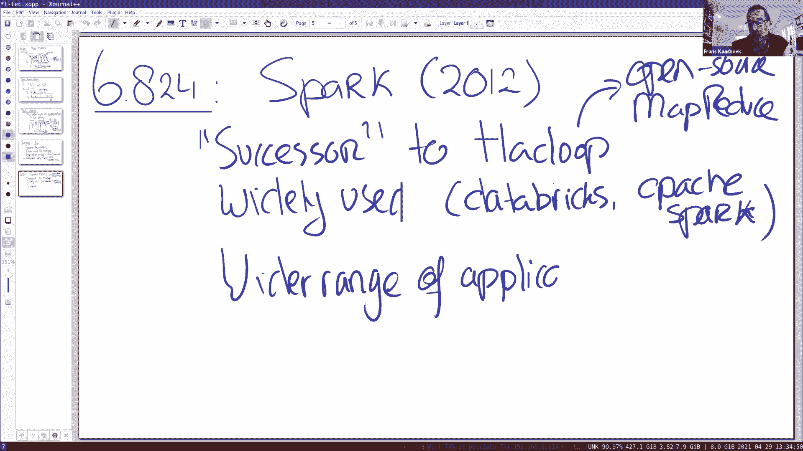

# 课程 P17：Lecture 16 - 大数据 - Spark 🚀




在本节课中，我们将要学习 Spark，这是一个广泛用于大规模数据处理的分布式计算框架。我们将了解其核心概念、编程模型、执行方式以及容错机制，并通过具体示例来理解其优势。

## 概述

Spark 是 Hadoop MapReduce 的继任者，被设计用于处理大规模数据科学计算。它支持比 MapReduce 更广泛的应用，尤其擅长迭代计算。Spark 由 Databricks 公司商业化，同时也是一个非常流行的开源项目。

## Spark 的核心：RDD 与编程模型

Spark 的核心抽象是弹性分布式数据集（RDD）。RDD 是一个不可变的、分区的数据集合，可以通过一系列确定性转换来创建。

### RDD 的特性

RDD 具有两个关键特性：
1.  **惰性计算**：转换操作（如 `filter`, `map`）不会立即执行，而是构建一个计算谱系图（lineage）。只有遇到行动操作（如 `count`, `collect`）时，计算才会真正触发。
2.  **不可变性**：RDD 是只读的。任何转换都会生成一个新的 RDD，而不会修改原始 RDD。

### 转换与行动

RDD 的 API 主要分为两类操作：
*   **转换（Transformations）**：将一个 RDD 转换为另一个 RDD，例如 `filter`, `map`, `join`。这些操作是惰性的。
*   **行动（Actions）**：触发实际计算并返回结果给驱动程序或写入存储系统，例如 `count`, `collect`, `save`。

以下是一个简单的代码示例，展示了如何创建和使用 RDD：

```scala
// 创建一个代表文本文件的 RDD（此时并未读取数据）
val lines = sc.textFile("hdfs://...")
// 定义一个转换，过滤出包含“ERROR”的行
val errors = lines.filter(_.startsWith("ERROR"))
// 将过滤后的 RDD 持久化到内存中，以便后续重用
errors.persist()
// 触发第一个计算：统计错误行数
errors.count()
// 触发第二个计算：收集所有错误行（由于已持久化，无需重新计算）
errors.collect()
```

上一节我们介绍了 RDD 的基本概念和惰性计算特性。本节中我们来看看 Spark 是如何执行这些计算的。

## 执行模型与依赖

当行动操作被调用时，Spark 调度器会根据 RDD 的谱系图创建一个执行计划。这个计划被组织成多个**阶段（Stage）**。

### 窄依赖与宽依赖

阶段划分的依据是 RDD 之间的依赖关系：
*   **窄依赖**：父 RDD 的每个分区最多被子 RDD 的一个分区使用。例如 `map`、`filter` 操作。这类操作可以在单个节点上独立、并行地执行，无需跨节点通信。
*   **宽依赖**：父 RDD 的分区可能被子 RDD 的多个分区使用。例如 `groupByKey`、`reduceByKey` 操作。这类操作通常需要**Shuffle**，即跨节点混洗数据，是计算中的关键屏障。

调度器会将连续的窄依赖操作**流水线化（pipelining）**，合并到同一个阶段中执行，以提高效率。而宽依赖则会划分出新的阶段。

### 执行流程

1.  **Driver 程序**：用户编写的 Spark 程序作为 Driver 运行，它定义了 RDD 的转换和行动。
2.  **集群管理器**：Driver 向集群管理器（如 YARN、Mesos 或 Spark Standalone）申请资源。
3.  **任务执行**：集群管理器分配 Worker 节点。Driver 将根据阶段划分，将任务（Task）发送给各个 Worker。每个任务处理一个 RDD 分区。
4.  **流水线计算**：在同一个阶段内，多个窄依赖转换会以流水线方式在同一个任务中连续执行。

我们了解了执行模型后，自然会关心在分布式环境下如何处理节点故障。接下来，我们将探讨 Spark 的容错机制。

## 容错机制

Spark 的容错基于 RDD 的不可变性和确定性转换这一特性。

### 基于谱系图的恢复

由于每个 RDD 都记录了它是如何从其他 RDD 转换而来的谱系图，当某个分区的数据丢失时（例如存储该分区的 Worker 节点故障），Spark 可以通过重新执行该分区谱系图中的所有转换来重建数据。这与 MapReduce 的重新执行失败任务思路类似。

### 检查点（Checkpointing）

对于包含宽依赖的漫长谱系图，从头开始重新计算可能代价很高。为此，Spark 提供了**检查点**功能。程序员可以将某个关键的中间 RDD 持久化到像 HDFS 这样的可靠存储中。

```
// 将 RDD 设置检查点（会物化到可靠存储）
rdd.checkpoint()
```

设置检查点后，如果发生故障，恢复过程可以从最近的检查点 RDD 开始重新计算，而不是从最初始的数据开始，从而节省大量时间。检查点操作会触发一个额外的作业来保存数据，因此需要权衡检查点的频率。

理解了基础原理和容错后，让我们通过一个实际案例来看看 Spark 如何优雅地处理复杂计算。

## 案例研究：PageRank 算法

PageRank 是一个迭代算法，用于计算网页的重要性。它完美展示了 Spark 在迭代计算和内存重用方面的优势。

以下是 Spark 实现 PageRank 的简化代码：

```scala
// 加载链接关系图 (url, neighbor-list)
val links = sc.parallelize(Array(("A", List("B", "C")), ("B", List("C")), ("C", List("A")))).persist()
// 初始化排名
var ranks = links.mapValues(v => 1.0)

for (i <- 1 to 10) {
  // 将当前页面的排名贡献（rank/size）发送给它的所有出链页面
  val contribs = links.join(ranks).flatMap {
    case (url, (neighbors, rank)) =>
      neighbors.map(neighbor => (neighbor, rank / neighbors.size))
  }
  // 将所有页面收到的贡献值求和，得到新的排名
  ranks = contribs.reduceByKey(_ + _).mapValues(0.15 + 0.85 * _)
}
ranks.collect()
```

### Spark 在此案例中的优势

1.  **内存中迭代**：`links` RDD 通过 `persist()` 被缓存在内存中，在每次迭代中重复使用，避免了像 MapReduce 那样每轮迭代都要从磁盘读取的巨大开销。
2.  **数据局部性优化**：如果 `links` 和 `ranks` 都使用相同的键（如 URL）进行**哈希分区**，那么 `join` 操作可以转化为窄依赖。这意味着具有相同键的数据会位于同一台机器上，`join` 可以在本地进行，无需昂贵的网络 Shuffle。
3.  **清晰的编程模型**：算法逻辑通过一系列 RDD 转换清晰地表达出来，与单机思维类似，易于理解和维护。

## 总结


本节课中我们一起学习了 Spark 分布式计算框架。我们首先了解了其核心抽象 RDD 及其惰性计算和不可变性。接着，我们探讨了其执行模型，包括基于窄依赖和宽依赖的阶段划分与流水线执行。然后，我们分析了 Spark 基于谱系图重建和检查点机制的容错设计。最后，通过 PageRank 案例，我们看到了 Spark 如何高效支持迭代计算、利用内存缓存以及通过分区优化来提升性能。Spark 通过将数据保留在内存中并提供丰富的转换操作，实现了比传统 MapReduce 更强大的表达能力和更优的性能，使其成为大规模数据处理的重要工具。