# 课程 P18：第17讲 - 缓存一致性 - Facebook的Memcached 🚀

在本节课中，我们将学习Facebook在2013年发表的一篇关于Memcached的经验性论文。这篇论文并非介绍全新的系统构建思想，而是总结了如何利用现成组件（如MySQL、Memcached）构建一个能够支持每秒数十亿请求的大型系统的实践经验。我们将重点关注其设计背后的性能驱动因素，以及如何在性能与一致性之间取得平衡。


---


## 概述 📋


Facebook的Memcached系统设计主要受性能需求驱动，旨在支持极高的读取吞吐量。其一致性模型与我们之前讨论的提供线性一致性的系统不同，它追求一种更弱的一致性——最终一致性，这对于Facebook的许多应用（如新闻推送）来说是足够的。系统的核心挑战在于保护后端数据库免受过载，并处理由此引入的各种一致性问题。

---

## 网站架构的演变 🏗️


上一节我们介绍了论文的背景和目标，本节中我们来看看一个典型网站随着用户增长，其架构是如何演变的。

### 阶段一：单机架构

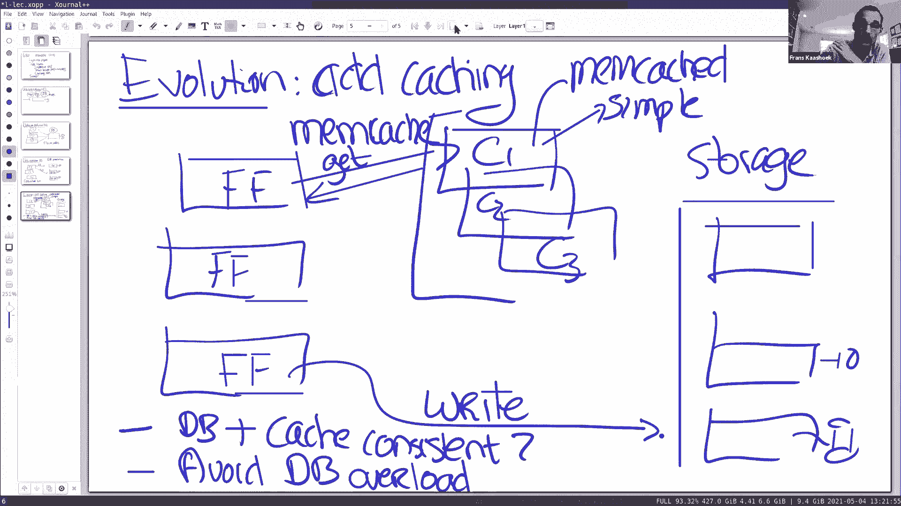

如果你刚开始建立一个网站，用户量很少，架构可以非常简单。


*   **网络服务器**：例如 Apache。
*   **应用框架**：例如 PHP、Python。
*   **数据库**：例如 MySQL，用于存储所有持久化状态。

客户端连接到网站，应用代码在服务器上运行并与数据库交互。所有状态都存储在数据库中，便于备份和容错。

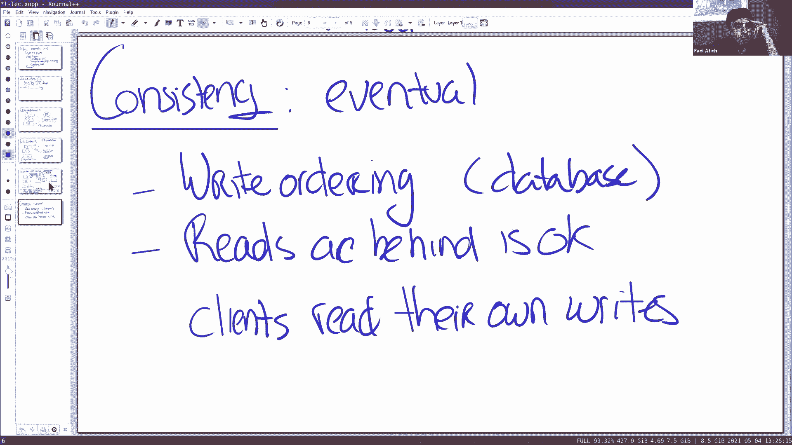

### 阶段二：前端横向扩展


随着用户量增加，第一个瓶颈通常是应用服务器的计算能力。

解决方案是保持单台数据库服务器不变，但横向扩展**无状态**的前端服务器（Web服务器 + 应用代码）。所有前端都连接到同一台数据库。这个方案很简单，因为前端无状态，易于扩展，且所有写入都通过单一数据库，不存在一致性问题。

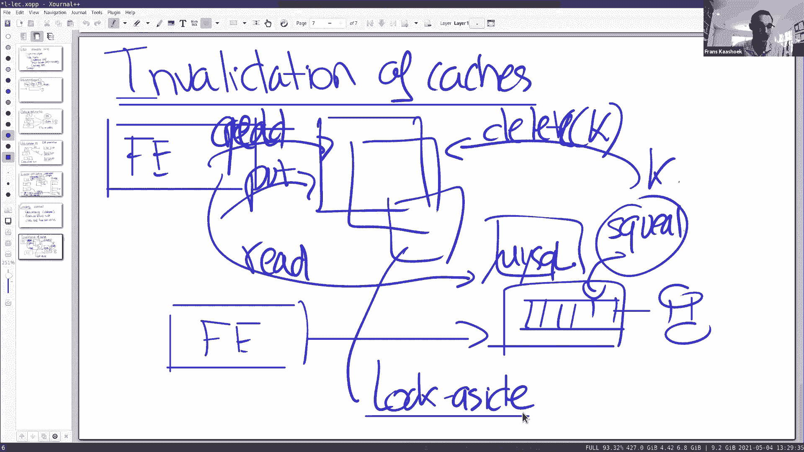


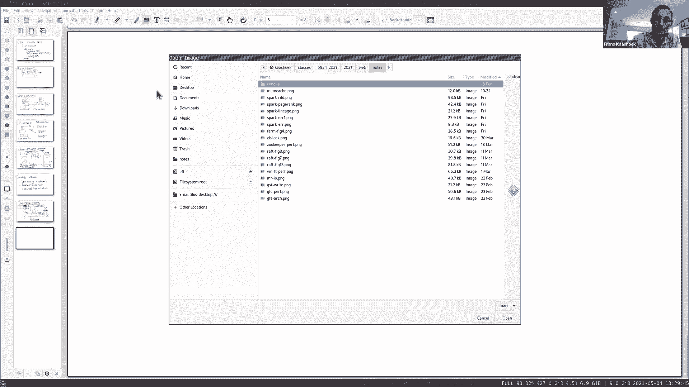


### 阶段三：数据库分片

当单台数据库无法承受读写压力时，下一步是对数据库进行**分片**。

将数据按键分布到多台数据库机器上。前端需要知道每个键位于哪个分片。这提供了数据库层面的并行处理能力，提高了吞吐量。但此步骤引入了跨分片事务的复杂性。


### 阶段四：引入缓存层

为了进一步扩展，特别是应对重读的工作负载（如Facebook的时间线浏览），可以引入缓存层。


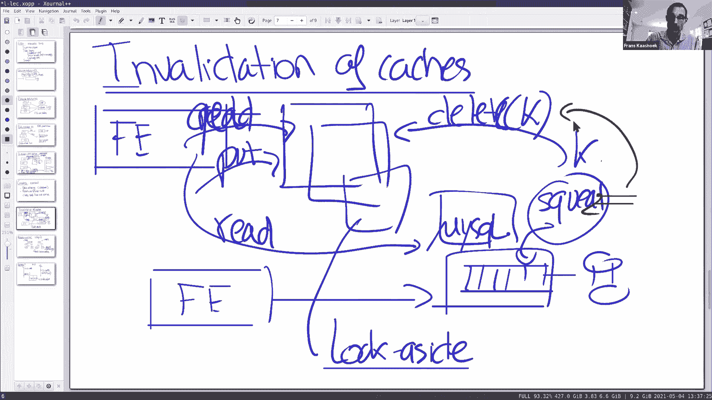

以下是引入缓存后的基本架构组件：
*   **前端层**：大量无状态的Web服务器。
*   **缓存层**：由Memcached或Redis等开源缓存软件组成的集群。
*   **存储层**：分片的数据库。


基本工作流程如下：
1.  读取时，前端首先尝试从缓存获取数据。
2.  若缓存命中，则快速返回。
3.  若缓存未命中，则从数据库读取数据，进行一些计算（如生成HTML），然后将结果**设置**到缓存中，以供后续请求使用。
4.  写入时，前端直接更新数据库，并**使缓存中对应的键失效**。

这种设计被称为**旁路缓存**，因为缓存位于数据库“旁边”，由应用程序显式管理数据的存入和失效，而不是透明地代理所有请求。

引入缓存带来了两个主要挑战：
1.  如何保持缓存与数据库的一致性。
2.  如何确保数据库不会因缓存失效或故障而过载。

---


## 性能优化策略 ⚡


上一节我们了解了基础架构，本节中我们来看看Facebook为了追求极致性能所做的特定优化。


获得高性能主要有两种策略：**分区（分片）**和**复制**。


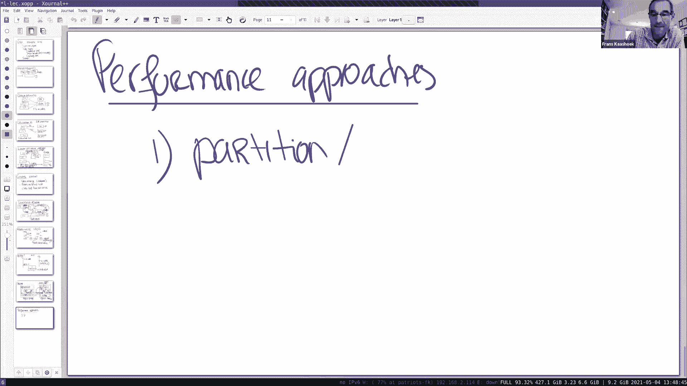

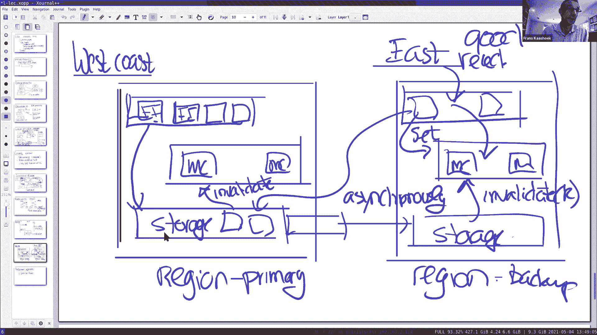

### 策略一：分区


将数据分布到多台缓存服务器上，可以增加总容量和并行性。这适用于存储大量不同的键。


**核心概念**：使用一致性哈希等算法将键映射到特定的缓存服务器。
```python
# 简化的伪代码：确定键k应访问哪个缓存服务器
server_index = hash(k) % number_of_servers
target_server = cache_servers[server_index]
```

### 策略二：复制


将相同的数据复制到多台服务器上，有助于应对**热键**问题（即大量请求集中在少数键上）。复制还能减少每个前端需要连接的服务器数量，缓解网络拥塞。

Facebook在多个层面运用了复制：

1.  **跨区域复制**：在西海岸和东海岸建立两个完整的数据中心副本。所有写入都发送到主区域（西海岸）的数据库，然后异步复制到备份区域（东海岸）。这为地理上分散的用户提供了低延迟的读取。
2.  **区域内集群复制**：在单个数据中心内，将前端和缓存层划分为多个独立的**集群**。每个集群拥有自己的一组缓存服务器。用户被负载均衡到不同集群。
    *   **优点**：热键在每个集群内都被复制，减轻单点压力；减少了网络连接数和“Incast拥塞”。
    *   **缺点**：冷数据在多个集群中冗余存储，浪费容量。
    *   **解决方案**：引入一个跨集群共享的**区域池**，用于存储不常访问的冷数据。


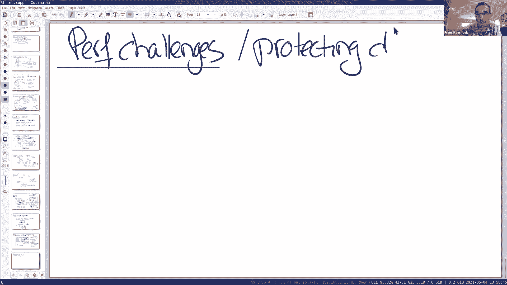

---

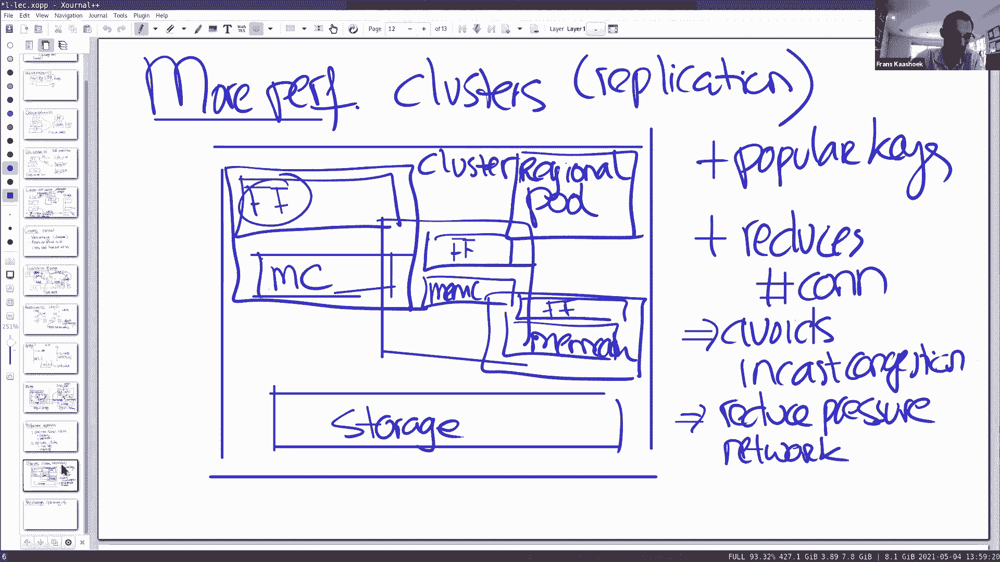

## 保护数据库：关键挑战与解决方案 🛡️

缓存系统的核心目标之一是保护后端数据库。以下是Facebook解决的一些关键挑战：

### 挑战一：惊群效应

当某个热门键失效后，大量并发的读取请求会同时缓存未命中，并涌向数据库，导致数据库过载。

**解决方案：租约**
1.  当缓存未命中时，Memcached可以向客户端颁发一个短期的、针对该键的**租约**。
2.  只有持有有效租约的客户端，才能将数据设置回缓存。
3.  如果某个键被删除（失效），其对应的所有租约也将被作废。
4.  其他未持有租约的客户端在获取时会收到一个“重试”提示，从而将请求分散开，避免了向数据库的请求风暴。

### 挑战二：缓存服务器故障

当一台缓存服务器故障时，原本指向它的所有请求会直接落向数据库，造成风险。

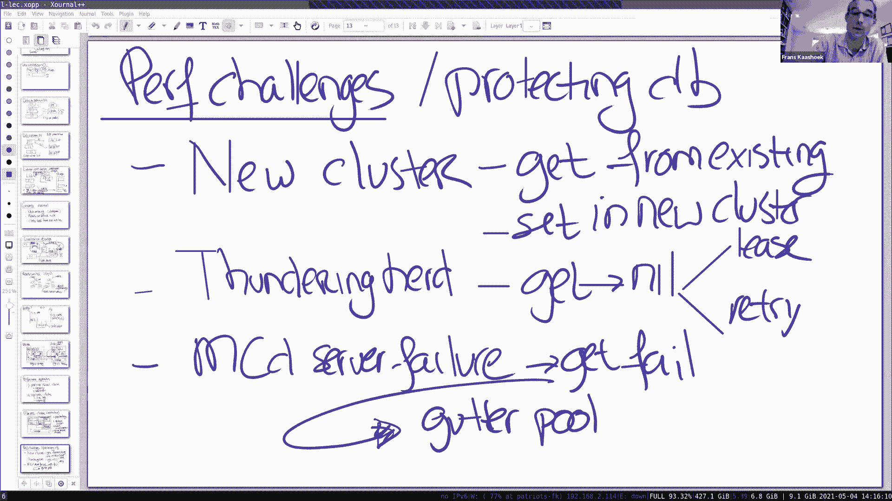

**解决方案：Gutter池**
1.  维护一个额外的、小型的缓存池，称为Gutter池。
2.  当客户端无法从主缓存服务器获取数据时（例如超时），它转而尝试从Gutter池获取。
3.  第一个在Gutter池未命中的客户端会从数据库读取并填充Gutter池。
4.  后续请求便可以从Gutter池获取数据，直到故障的主缓存服务器被替换或恢复。
5.  **注意**：为了减轻Gutter池的压力和简化设计，写入失效消息**不会**发送到Gutter池。这意味着Gutter池中的数据可能是过时的，但它作为一个临时避风港，核心目的是保护数据库。

### 挑战三：新集群上线

启动一个新的、空的缓存集群时，所有请求都会未命中并访问数据库，可能导致数据库过载。


**解决方案：从暖集群预热**
新集群中的客户端在缓存未命中时，不是直接查询数据库，而是先向已有的、数据已预热的老集群（暖集群）请求数据，获取后再设置到自己的新集群缓存中。这平滑地填充了新集群的缓存，避免冲击数据库。

---


## 一致性模型与竞态条件处理 ⚖️

尽管系统追求的是最终一致性，但一些基本的正确性仍需保证，例如“读己之所写”。高性能的优化措施引入了一些微妙的竞态条件。

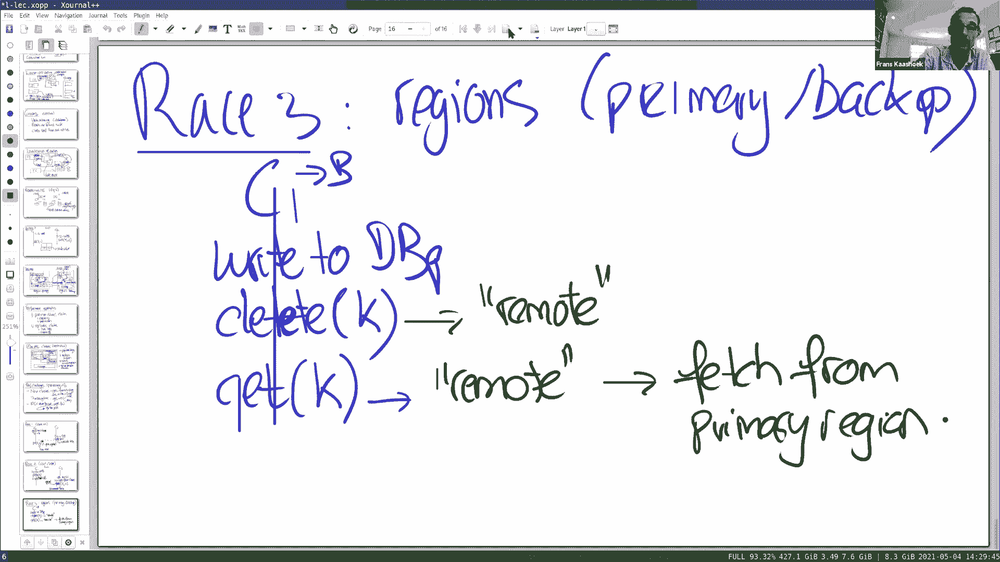

### 一致性目标
*   **非目标**：不提供线性一致性。
*   **目标**：提供最终一致性。写入按顺序应用到数据库，但读取可能滞后几秒钟，这对Facebook的应用是可接受的。
*   **额外保证**：客户端必须能读到自己的最新写入。

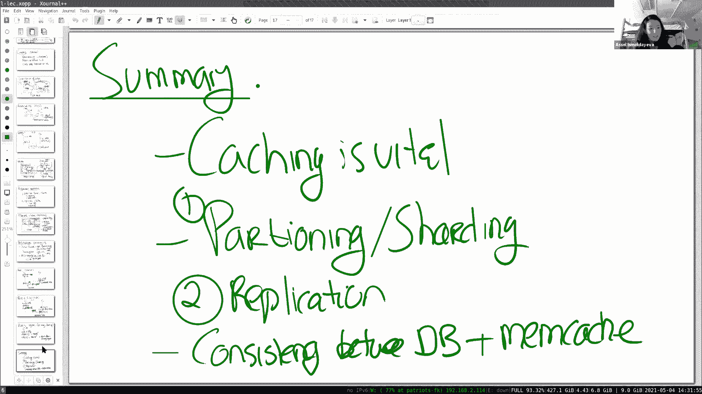

### 竞态条件一：陈旧设置


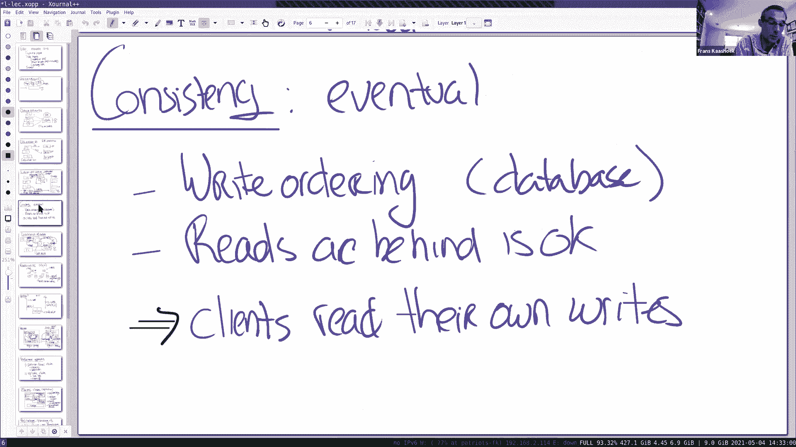

**场景**：
1.  客户端C1读取键`k`，缓存未命中，从数据库读到值`v1`，并获得租约`L1`。
2.  在C1将`(k, v1)`设置回缓存前，客户端C2更新了`k`为`v2`，并删除了缓存中的`k`（同时使租约`L1`失效）。
3.  随后，C1尝试用已失效的租约`L1`执行`set(k, v1)`。
4.  如果成功，缓存中将永久保留陈旧的`v1`。

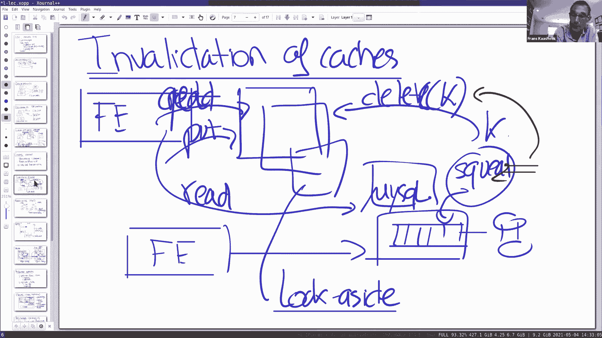


**解决方案**：租约失效机制。
C2的删除操作会使所有该键的未完成租约失效。因此，C1的`set`操作会因为租约无效而被Memcached拒绝。C1需要重试读取，此时将从数据库获取到最新的`v2`。


### 竞态条件二：冷集群预热


**场景**（发生在新集群预热期间）：
1.  键`k`在数据库中的值为`v2`，在暖集群缓存中为`v1`（已过时）。
2.  客户端C1在冷集群中读取`k`，未命中。
3.  C1从暖集群获取到陈旧的`v1`。
4.  C1将`(k, v1)`设置到冷集群的缓存中，导致陈旧值被固化。

**解决方案**：延迟设置。
在集群预热阶段，对刚刚因写入而失效的键，在短时间内（如2秒）禁止任何`set`操作。这给了数据库更新传播到所有副本的时间。

### 竞态条件三：跨区域读取自己的写入

**场景**：
1.  位于备份区域的客户端C1向主区域数据库写入，更新键`k`，并立即删除本地（备份区域）缓存中的`k`。
2.  紧接着，C1在备份区域读取`k`。此时，主区域的数据库更新可能尚未异步复制到备份区域的数据库。
3.  因此，C1的读取请求在本地缓存未命中后，会查询备份区域的数据库，从而**读不到自己刚刚的写入**，违反了“读己之所写”的保证。


**解决方案**：远程标记。
当备份区域的客户端执行删除时，可以在本地缓存中为该键设置一个“远程标记”。当带有此标记的键被读取时，系统会引导客户端去主区域获取最新值，而不是查询本地的备份数据库。一旦主区域的更新复制完成，该标记即可被移除。

---

## 总结 🎯

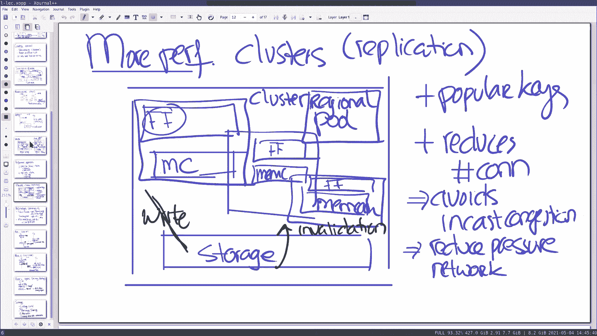

本节课我们一起学习了Facebook Memcached系统的设计精髓。

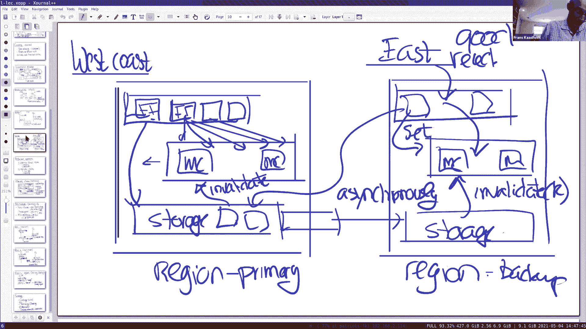


*   **核心目标**：利用现成组件构建支持每秒数十亿请求的超高吞吐系统，性能是首要驱动力。
*   **架构演变**：从单机到引入缓存层，采用**旁路缓存**设计，由应用管理缓存内容。
*   **性能策略**：结合**数据分区**来提升容量与并行性，以及**数据复制**（跨区域、区域内集群）来处理热键和优化访问延迟。
*   **关键挑战**：核心在于**保护数据库**免受过载。我们探讨了通过**租约**解决惊群效应、通过**Gutter池**处理缓存故障、以及通过**预热**平滑上线新集群。
*   **一致性**：系统提供最终一致性，并尽力保证“读己之所写”。为了实现高性能，系统引入了一些竞态条件，我们分析了三种主要竞态（陈旧设置、冷集群预热、跨区域读己写）及其解决方案（租约失效、延迟设置、远程标记）。


这篇论文展示了一个现实世界大型系统如何在性能与一致性之间进行精妙的权衡，并通过一系列务实的优化和补丁机制，构建出一个极其成功的分布式缓存架构。