# P2：Lecture 2 - RPC and Threads - mayf09 - BV16f4y1z7kn

好的，今天的主题是线程和 RPC ，6。824 第二讲，我们将主要关注 Go 的线程和 RPC ，我们在实验中使用的编程语言，这节课的大部分内容都是量身定做的，帮助你了解实验用的 Go 编程。

希望你完成了入门教程和爬虫练习，我们将在稍后的课程中详细讨论它们，但在讨论细节之前，让我用更多的代码调用，来打破[]并让大家提问。也许你可以回答这个问题，你在哪里，你觉得这个教程怎么样。

你对 Go 的第一印象是什么，也许我会。Evan Feldman 你觉得怎么样？大家好，我是 Batman ，我在 Newton ，在大波士顿的郊区，这个教程很有趣，这是我第一次接触到面向对象的语言。

所以，这是一种框架的改变，适应这一点很有趣。好的，Brendan Wall 怎么样？Brendan ，你在吗？是的，我只是在找取消静音按钮，抱歉，问题是什么，我刚加入。你在哪里。

你对 Go 的第一印象是什么？是的，我以前在实习中用过 Go ，那是我第一次处理并发的东西，我喜欢 Go ，使用 goroutine 来工作，一开始很难想清楚。

比如主线程和所有的 goroutine 一起结束，解决早期的一些概念问题，但这很有趣。[Connor Prisby] 怎么样？[Connor]，你在吗？好的，试试其他人， Dory Shen 。嗨。

我现在在剑桥，我发现 Go 非常有趣，我把教程的第一部分看了一遍，比如我学习了 for 循环，以及它们 for 循环的方式，我觉得这很有趣，比如它的组成方式，我想比如线程，我发现它有点难，当它结束时。

比如有时函数会在所有例程之前结束，[比如结束]，所以这想起来很有趣，我学到的更多，所以这很酷，我喜欢它。好的，希望你们在这学期都会有一个好的 Go 的体验。让我说一下为什么使用 Go 吗？理论上。

有很多编程语言，可以用来做分布式编程，Go 绝对不是唯一一个，但我们在 6。824 中选择 Go 有一些原因。首先，它对线程和 RPC 有很好的支持，这两点对于分布式编程非常重要，所以这是有道理的。

Go 与这个很匹配。我们非常喜欢它的第二个原因是，它有一个垃圾收集器，如果你做共享内存式的并发，多个线程共享一个结构体或变量，那么有垃圾收集器是很好的，因为这样线程就不用考虑。

谁是最后一个引用了这个内存的线程，因此应该重新分配，垃圾收集器负责处理所有这些问题，这很方便。它是类型安全的。它很简单，是一种简单的编程语言，学起来很容易。这些想法，希望你在 Go 教程中感受到了。

你完成了 Go 教程，你就知道了 Go 的大部分。最后，它有一个编译器，所以它是编译的，与 Python 不同，或者编译器产生可用的代码，所以运行时开销不是很大。我想 6。

824 使用 Go 的最后一个原因，我很喜欢使用 Go 写程序，这可能也是一个重要原因。所以我要做的是，我将简单介绍一下线程和 RPC ，讨论一下使用线程编程的不同方面，其中一些是很好的教程。

你在我[抱歉]之前见过的，我会很快介绍它，它不是对并发编程的全面介绍，但希望可以提醒你，问题是什么，以及你应该注意的是什么。我们还会花一些时间讨论一下爬虫。所以我向你们分享一个解决方案。

我有两个解决方案，一个使用 channel ，另一个使用 mutex ，我们会把它们都看一下。在我开始之前，有什么问题吗？好的，我们从线程开始，线程是执行线程的简写，在 Go 中。

线程称为 goroutine ，但是在 Go 的世界中，人们还称它为线程的线程，所以，考虑这个问题的方法是，当你使用 go run 时，Go 在你的操作系统上创建一个进程，在这个进程中。

是 Go 运行时系统，当 Go 开始的时候，它只有一个执行线程，即主线程，但是它有用于创建新线程的原语，所以你可以这样想，这里有很多执行的线程并行运行。你可以认为单线程是一种顺序程序行。

程序有一个程序计数器，有自己的栈，并且有自己的一套寄存器，所以这就像一个顺序程序，你可以执行指令一和指令二，以及指令三和指令四，可能让过程调用在栈上分配内存，从过程调用、递归调用返回，所有标准顺序编程。

就像一个顺序线程。有趣的是，这些线程可能与其他线程共享内存，因为所有线程都在相同的地址空间中运行，相同的操作系统地址空间，是相同的进程地址空间，它们可以共享内存，所以，比如一个线程可以写位置 10 。

然后其他线程可以读取位置 10 ，这样它们可以交流信息。另一种考虑线程的方式是，将其视为运行库支持的某种抽象，运行时在线程上执行多个操作，一个操作，我们已经看过很多次了，你已经看到过多次，来创建线程。

这就是 go 语法， go 关键字。线程可以退出，通常退出是隐式的，比如当一个线程从这里返回时，如果你使用 go 关键字创建一个函数，从函数中返回时，那么这个线程就隐式退出了。

Go 运行时还有几个高级操作，如果你愿意，它可以停止一个线程，比如，如果线程向 channel 写入数据，而这个 channel 上没有读取者，那么这个线程可能会被阻塞，所以 Go 运行时停止这个线程。

把它放在一边，这样可以在处理器上运行另一个线程，也许稍后会恢复那个线程。所以，第三个原语是 resume 线程。而 stop resume 线程的真正含义是，获取线程的状态，比如程序计数器。

栈指针和寄存器，把它放在一边，在处理器上运行另一个线程，然后在某个时刻，决定恢复处理器，也就是把程序计数器，栈指针和寄存器加载回处理器，让它开始运行。这是对线程的一种非常[机械的]看法。

那么为什么要有线程，这是一个值得讨论的重要问题。因为在某些情况下，线程唯一能做的是，让你作为程序员的生活变得更加复杂，比如编写顺序代码比编写并行代码更容易。有它的主要原因是，在 6。824 中。

我们非常关心的主要原因是表示并发性，有两三种不同类型的并发性，是我们关心的，所以，考虑我们的进程，我们有运行时运行线程。我们非常关心的一种并发类型是 IO 并发，所以有一个线程在这里运行。

它可能在做一个网络调用，通过网络连接到另一台机器，为了实现分布式应用程序，比如 mapreduce ，当它发起一个调用，它会被阻塞，等待回复，当它被阻塞，等待回复时，你需要的是运行一些其他线程。

所以我们[]更多，我们运行，比如我们要发出多个请求，多台机器大致并行，我们可以发起一个 goroutine 去做，发起另一个 goroutine ，另一个 goroutine ，所有发送。

连接到其他远程机器上。这是我们非常关心它的原因之一， IO 并发性。我们关心的第二个原因是，允许多核并行。所以我们有多个核心，计算机或处理器，然后我们让一个线程运行。

一个 goroutine 运行在一个核心上，另一个线程或另一个 goroutine 运行在另一个核心上，直接并行。比如，我们实现了键值服务器，然后我们可以处理不同键的请求，键值服务使用不同的核心并发。

增加我们的吞吐量。所以这是我们非常关心并发性的两个主要原因，但是线程，还有第三个原因，就是比较方便。实验里会有很多案例，比如，我们希望定期执行一些事情，可能每隔一秒或每隔 200 毫秒。

现在我们可以为它启动一个线程或 goroutine ，有 200 毫秒的睡眠时间，做它需要做的事情，然后它回到睡眠状态 200 毫秒，所以执行这些后台活动是很方便的，需要定期完成的，你可以用线程来做。

当然你可以用其他方式，但线程是很方便的。另一个经常出现的问题是，在一些讲座中出现的问题，你可以创建多少线程。我认为 Go 设计者想要你考虑的是，你应该根据需要创建尽可能多的线程，它们肯定不是免费的。

它们会占用一些内存，因为你会有栈，这会带来性能开销，我们启动它们时，但你应该认为它们非常轻，你也被鼓励应该按需创建线程。关于为什么要有线程的基本原因，有什么问题吗？好的，让我，就像我之前提到的。

线程面临着挑战，使用线程进行编程具有挑战，所以，让我来谈谈这些挑战。我不打算在这里深入探讨，我希望它们是能理解的，如果我们看一些例子，就会变得更清楚。可能线程具有挑战性的主要原因是，你会有竞态条件。

比如一个基本的竞态条件，假设你有两个线程，这是 t1 ，这是 t2 ，它们共享变量 n ，假设初始值为 0 ，它们都执行，都执行 n = n + 1 的语句，当然，你可能会认为这个语句是原子操作。

或者是不可分割的，但事实并非如此，Go 语句会编译成，处理器正在执行的指令，所以我们不能假设这是原子指令，实际上它是，它可能包含一个 load ，将 n 的内容存入寄存器，然后递增寄存器，然后。

将寄存器取回到内存。所以如果你非常不走运，这两个线程都试图，执行这条特定的指令，然后我们会有一个糟糕的事件序列，其中，两个线程都执行 load 指令，加载变量到寄存器 r0 中，这边也在 r0 中。

然后增量，所以 r0 变成 1 1 ，然后使用 store 指令把它写回，把结果写回到内存中的变量 n 中。所以，如果在这种情况下，在这种场景下，是真正并行的，那么在这两个线程都递增之后。

 n 的值是多少。是 1 。是的， 1 ，这个值应该是什么，我们期望它是什么。2。是的，希望它是 2 ，所以， 1 肯定不等于 2 ，这里有一个错误。所以，这就是竞态条件的核心。

如果线程是糟糕的事件队列，线程共享状态，更新可能会没有正确反映出来，当然，大多数情况下，这都会正常工作，因为你必须处于这个非常，处于这个非常特殊的条件，在它出现之前。通常情况下，你们中有人报告说。

我没有对我的竞态条件加锁，我一直查着顺序，我的程序运行得很好，这就是竞态条件的真正问题所在，它们通常工作得很好，但有时会出错。所以，有两种方法可以解决竞态条件。第一种方法是避免分享，不要共享变量。

这是一种 Go 鼓励的编程风格，通过使用通道，通道用来通信值，但你并不需要直接共享内存，所以这是一种方法。所以避免共享一种方法，另一种方法是使用锁，让一系列指令变为原子操作，稍后我们会更详细地讨论这个。

我想指出的一点是，这真的很酷，一个实用的工具，Go 其实有一个竞态检测器，你将要做的大多数实验，推荐你运行 Go 使用 -race 标志，这虽然不能捕捉所有可能的竞争，但它在识别竞争方面做得非常好。

所以，默认情况下，你应该在启用竞争检测器的情况下运行 Go 。好的，这是一个关于线程的挑战。第二个关于线程的挑战是协调。它通常情况下是，一个线程必须等待另一个线程，在完成某件事之前。

教程中的很多 Go 练习有这种形式，有两种方式， Go 有两个原语，处理它的一个是通道，通道允许你同时通信和协调，或者，我们稍后会讨论条件变量，两者都很有用，我会更多地谈到这一点。最后的挑战是。

一个大的挑战是死锁，所以，如果一个线程等待，比如 t1 等待 t2 ，而 t2 等待 t1 ，比如在其他程序之前，释放你的锁，它们称为死锁，双方都在等待对方，结果是什么都没有取得进展。

一种微不足道的 Go 的死锁方式是，比如你只有一个线程，根本就没有其他线程，而你在写入通道，这会阻塞那个线程，直到其他人从通道中读取，但如果根本没有其他线程，这会导致死锁，就是最简单的可能的死锁。

Go 会抓住这种情况，抛出运行时错误，表示没有线程可以运行，你有一个死锁。但是如果涉及多个线程，可能会出现更复杂的死锁，当你通过实验和学期的学习时，我肯定你会遇到一些。所以往后退一步。

考虑 Go 的这些挑战，我刚才谈到的。粗略地说， Go 有两个方案，来应对这些并发挑战。一个方案是通过通道，另一个方案上是通过和条件变量。在我看来，有些人对此相当武断，是否一个方案比另一个方案好。

我在的总体方案是，我找一个更适合我的方案，我要运行的。一般来说，我不会共享，我需要两个线程通信，但我不共享内存，我倾向于使用通道。如果有两个线程可以共享内存，因为共享内存很方便，比如。

我编写一个键值服务，我想要共享键值表，然后我使用锁和条件变量。所以，我的总体方法不是[戏剧性]的，可以采取任何方法，对解决问题是最方便的。这个教程很好地讲了通道，提到了锁，不太涉及条件变量。

所以我认为有必要讨论一下条件变量，确保你知道它们的存在。我会使用一个很小的例子来说明，为了说明这些问题，这个小例子是，我们有一点启发，它是受实验启发的，有一个线程 t1 ，t1 需要收集一些选票。

从远程机器上，比如，需要确定它拥有多数席位，所以，可以提交一些值，稍后你会在 raft 实验里看到，作为你需要的原语之一，要做到这一点，t1 会 fork 出其他线程，比如 t2 。

t2 不会做一些昂贵的事，只是通过与远程机器通信来获得选票，然后向 t1 报告投票结果，t1 需要收集它们获得的所有选票，然后达到大多数，然后宣布胜利。所以有一个相当简单的程序，我要给你们展示一下。

它让我可以说明几个问题，我们要切换到另一个屏幕。

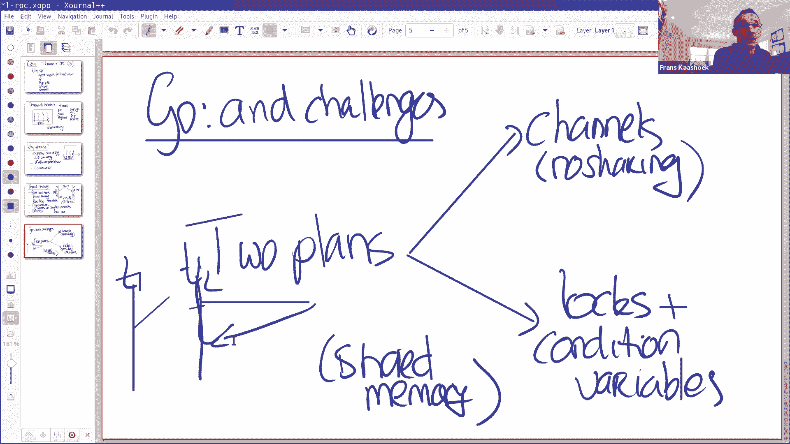

都能看到这个吗？所以，这里我有一个非常简单的程序，投票的事情，这又是一个像玩具的例子，希望让人们理解这一点。这里两个变量共享 count 和 finished ，count 统计投票数。

finished 表示我们已经完成，这里有一个 10 次的循环，创建一个 Go 的匿名函数，匿名函数并行调用函数 requestVote ，requestVote 模拟。

在远程机器上执行一项长时间昂贵的操作，它模拟方式是使用 Sleep ，它会阻塞一段时间，然后返回，然后如果返回的投票是肯定的，那么 count 增加，实际上，如果我们再有一个线程投票，然后我们就完成了。

所以会 fork 出 10 个线程，每个线程都会调用 requestVote 并报告结果，然后在最后，我们会检查 count 是否小于 5 ，这里我们知道我们失败了，输掉了选举。

如果我们的票数大于等于 5 ，我们就赢得了选举，所以这是一个非常简单的程序。这个能理解吗？让我来运行它，只是为了好玩。我们要运行几次，有些输了，有些赢了，这是合理的。

所以这个程序看起来工作正常而且是正确的，它真的是正确的吗？抱歉，这是个问题吗，这个程序是否是正确的。是的，它似乎产生了结果。我认为这里有一个竞态条件。

比如所有不同线程都实现了 count 和 finished 变量，而且，我也不清楚，那个 finished 必须达到 10 ，有没有可能它不会。让我把这些一一拿出来，然后看你的第一个观点。

这才是我真正想要的，很明显这是，我们这里有两个变量， count finished ，它们被不同的 goroutine 访问，所以这是一个明显的危险信号，可能是一个严重的问题，一旦你有一个变量。

可以由两个不同的 goroutine 访问或修改，这里会有一个问题，所以运行 Go 竞争检测器，它会抓住它。如你所料，Go 竞争检测器告诉你，这个程序里确实有一些问题，并列出出问题的行号。

所以它给你提供了一个很好的线索，表示有些东西不符合[]这个程序，所以我们分几步来修复它，希望为计算机编程带来更多的启示。所以让我给出这个程序的第二个解决方案。在这种情况下，我们将在稍后讨论通道。

因为我想先说明锁和条件变量，因为它们在教程中强调比较少。所以一个简单的解决方案，Go 引入一个锁，锁完全独立于变量，你遵循一些惯例，这个锁 mu 保护 count 和 finished ，所以。

当你访问 count finished 时，你必须将其包装到 lock 和 unlock 语句中，我们在这里看到两个 go 函数同时运行，在 requestVote 之后。

是关于投票核 finished 的，我们对它加锁，然后 Go 有一个很好的特性， defer 声明，如果你退出基本区块，将会运行由 defer 声明的函数，在关键字 defer 之后。

这意味着我们可以执行，我们让 Go 函数可以自动解锁，这很方便，因为那样你就不会忘记解锁了，所以，它很适合写到加锁的地方，所以你可以直接写 defer unlock ，然后你就不必担心。

如果有多个 exit 通过 goroutine 或函数，你可能会忘记解锁。所以现在我们在临界区域，我们持有锁，我们更新投票 count ，然后函数返回并自动解锁。同样地，在最后。

当我们每次访问 count finished 时，因为它们是共享的，我们需要用锁把它围起来，有一个简单的方法，我们也可以在这里写 defer unlock ，这样就可以了。所以我们可以运行这个程序。

让我们看看。所以我们运行它，竞争检测器看起来没问题，希望我们有一个更好的程序。好的？我有一个关于作用域的问题，看起来，当我们有匿名函数时，然后我们有 mu ，我们有 count 和 finished 。

看起来匿名函数可以访问，函数外部定义的变量，那么作用域是如何工作的？是的，任何，在一个匿名函数中，在函数中使用的不是在函数中声明的任何变量，会指向外部作用域的变量，也就是静态作用域。像互斥锁的作用域呢。

比如你要声明多少次，或者它的范围是什么。defer 语句的作用域是这个基本块。不，我的意思是，当你声明互斥锁数据结构时。像任何其他变量一样，它的作用域与 finished 或 count 相同。

所以它与其余部分中声明的任何变量。是的，我们可以这样想，互斥锁不直接与任何变量相关联，它只是一把锁，一个名字，作为程序员，你可以决定锁保护的是什么，但是有两个独立的概念。

如果你在 goroutine 中使用 i 会发生什么，那是不行的吧，你需要把它传进去。是的，这是个好问题，你们中很多人在邮件中问过，所以会发生什么，如果我们在这里使用 i ，用它做点什么。

比如 count = i ，这是不是可行的？i 会是什么值，当这个线程运行时，如果 go func 在某个时刻运行，i 会是什么值。i 会是那个运行时刻的值，被外部的 for 循环修改。是的。

所以这并不是很好，它可能不是我们想要的，我们希望 i 对应那次循环，那么我们要如何做，如果我们必须解决，我们要怎么做。你可以把它作为匿名函数的参数，并把它传进去。

所以它会在创建 goroutine 时被求值。是的，所以我写下这个，然后传进去，在这个时刻会发生，在我们创建 goroutine 的这个时刻，i 被捕获，然后传参。好的？我还有个问题。

局部变量是怎么分配的，比如 count finished 是本地变量，它们不会在主函数退出后被销毁吗，比如这个函数是由其他函数创建的，如果[命中]函数在 goroutine 之前退出会怎样。

主体分配在栈中，可能其他函数，有指向它们的内存地址，所以是这样的，它的主函数返回了，那么这些栈分配的变量就消失了，所以通常你会在 Go 程序中看到，你会在堆上分配，使用 new 创建一个新的结构体。

所以，你会遇到段错误，或者。是的，我们会得到。好的。我有一个问题，我不记得这是不是正确的方法，但是除了把它传递进去，是否可以在 for 循环的第一行，使用 i ：= i ，然后你有一个。

我不知道作用域在 for 循环中是如何工作的，因为我认为这会产生一个新的变量 i ，goroutine 可以访问，并且不会再次更新。是的，你可以这样做。这可以避免传入参数，不过有点难看。好的。

我喜欢传参，但这是另一种方式，稍后我将展示一个示例。所以有人问，我们会不会遇到段错误，我们不会直接得到段错误，往回一点，因为一个线程仍然持有引用，所以垃圾回收器不会删除该对象，只有最后一个线程。

只有当没有线程持有引用时，垃圾回收器才会会删除该对象，这是最酷的地方之一，关于使用垃圾回收语言和共享内存编程，你不必担心这种情况。好的，那么。是的。这个代码会不会出现死锁。

因为如果 goroutine ，第一个 for 循环退出，然后第二个会，比如，好的，没有关系。好的，这里肯定有一些问题不完美，所以让我来谈谈它们，其中之一是这个循环有点烦人，这个 for 循环是。

除了等待 count 达到 5 ，没有别的，它这样做的方式，它是在旋转，所以它很快地对这个值加锁，对它解锁，然后再次旋转，所以就是在处理器上旋转，实际上什么都不做，应该有更好的方式来表示它。

所以 Go 可以放弃核心，让另一个线程就运行。这样做的方法就是使用条件变量，这是我的下一个实现，或者我向你展示另一个实现，一种完成的方法，不是很好，比如，有人建议，在这里睡眠一段时间。

与其疯狂地放弃旋转，只是睡眠一段时间，睡一段时间，然后回来。当然，这个解决方案是有效的，但它的缺点是，你应该睡多久，你很想这样，比如，假设这个变量到了 5 ，然后你唤醒，你可以唤醒这个主线程。

所以我往前跳了一点，但这就是条件变量的作用，这是使用条件变量的解决方案，所以，我们分配一个新的条件，这里是分配条件变量，它与这个锁关联，我们稍后会看到，为什么这很重要。现在的主线所做的，它获取锁。

因为它需要获取锁来检查 count 和 finished ，否则可能会有竞态条件，然后，如果条件仍然不成立，它只是在这个条件变量上调用 Wait ，它所做的是原子地进入睡眠状态。

并且释放与条件变量关联的锁，因为 mu 与条件变量关联，可以等待解锁并睡眠，在一个原子操作中，当它从 cond。Wait() 返回时，它会再次获得锁，所以这些是肯定的，如果调用者返回，将会再次持有锁。

所以，这也是安全地，查看 count 和 finished ，然后再次调用 Wait 。好的？所以这个线程会进入睡眠状态，然后 goroutine 收集选票，与之前相同的代码。

mu lock 和 unlock 或 defer unlock ，然后当你完成时，更新 count 和 finished ，条件变量上有两个原语，一个是 Signal ，一个是 Broadcast 。

Signal 等待一个等待者，Broadcast 等待所有的等待者，这里只有一个等待者，所以我们可以用它们中的任何一个。所以当它达到 5 ，或者某些时刻是 10 ，所以每次 finished 递增。

主线程会被唤醒，你可以检查条件，然后继续。好的？所以这很方便，所以，你可以把条件变量看成，两个不同线程之间的协调原语，它们非常方便，当你使用锁来保护你的共享状态时。这是使用通道实现这个程序。

基本上是一样的方式，当然除了没有锁，但是主线程创建通道，传递 goroutine 匿名函数，作为一个单独的线程创建，将 rquestVote 写入通道，然后主线程会在这里阻塞，当它开始从通道读取时。

一旦它得到一些东西，当一些东西写入通道时，就会解锁，查看值，如果为真，就累加，否则， finished 总是递增的。这里发生的一切，我们不需要锁，因为 count 和 finished 没有共享。

只有一个线程更新 count 和 finished ，也就是主线程。好的？这个。这个主线程，抱歉， requestVote 线程总是写入通道，可能在通道中并发写入。

但是通道是 Go 中线程安全的东西之一，所以，多个线程可以写入通道。关于这个解决方案，有什么问题吗？有缓冲的通道是怎么回事？是的，通常情况下，当你写入通道时，没有人从通道读取，或者没有线程从通道读取。

那么发送者会立即阻塞，你可以指定一个缓冲区为 10 或 20 的通道，这会允许通道有多个值，在 6。824 实验中，我从来没有用过缓冲通道，我用过两三次，我后悔了，所以我一般不用它。但这一点很重要。

这个程序其实还不是很好，比如，当，在这个例子中没有关系，但在某些实验中，可能会出现，一旦 count 达到 5 ，就会发生什么。它停止监听新的频道，所以任何其他线程都会被阻塞。是的。

这意味着如果前 5 个线程投了赞成票，那么接下来的 5 个线程将在这个通道中阻塞，它们会被困住。在这种情况下，这不会是一个问题，因为你们大多数人都注意到了，如果主线程退出，它也会清除所有其他线程。

但是如果这是一个长期运行的服务，这不是很好，在这里我们会泄露线程，它们阻塞在一边，在通道中什么都不做，所以这很不方便，这是一个需要注意的东西。这出现在爬虫上，我想对许多人来说，另一方面。

如果主线程在任何 requestVote 完成之前退出，那么你也有一个问题，所以，对线程的管理通常是一个棘手的问题。有没有在不退出主线程的情况下杀死线程？好的，你可以发送给一个变量到通道上，表示请退出。

但你必须自己协调它。我要回到关于条件变量的一个很酷的事情上，你可能会认为这里也存在同样的问题，这个线程运行，在这个线程中，它可能会被阻塞，比如，如果它达到 5 ，这个主线程在做它的事情。

而其他线程可能还在这里，注意在这种情况下，它们不会被阻塞，因为会获得锁，然后调用 Broadcast ，Broadcast 不是阻塞操作，所以不同于向通道写入，那是一个阻塞操作，如果没有线程在接收。

cond。Broadcast 不是阻塞操作。所以在这个项目中起作用的，通过它自己。好的？好的，很好。关于这两个例子，还有什么问题吗？

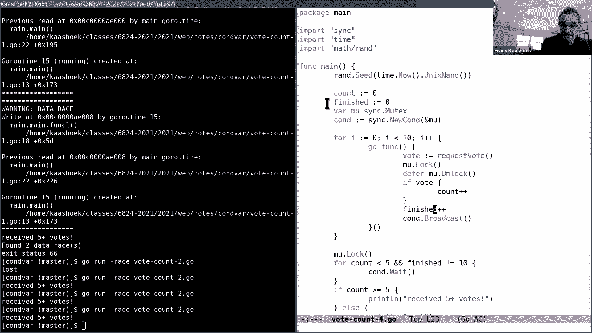

好的，那我们来谈谈爬虫，爬虫是并发编程的一个更现实的例子。提醒你一下，基本上这个想法是，你从一些网页的 url 开始，你获取的可能包含更多 url 的网页，当你继续的时候，然后取回那些网页。

查着这些 url ，并继续前进。这个想法是爬取整个互联网，存在的所有网页，当然，一些 url 可能指向你已经访问过的网页，所以目标是不会两次访问同一个网页。所以这个练习有几个目标，你想达到的。

一个是 IO 并发性，爬取操作可能需要很长时间，也许一个网页，它在世界的另一边，可能它是通过低速网络传输的，当一个线程正在爬取那个页面时，你希望能够爬取其他页面，另一个目标是正确性目标或性能目标。

即只爬取一次 url ，假设你的目标是开发多个核心，你有多个核心并行工作。好的？所以，我想做的是，在真正讨论并发解决方案之前，首先，让我展示一个简单的顺序的解决方案，所以我们。

让我们有一些东西可以作为基线来谈论。

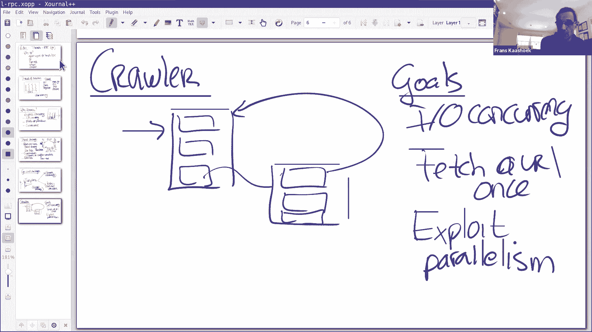

所以，这里我有三个解决方案。运行它们，go run。一个顺序的解决方案，一个使用互斥锁，一个使用通道，你看到，它们产生的结果或多或少是一样的，两个找到，一个丢失，两个找到，唯一的区别是。

输出的顺序偶尔会略有不同，当然，它必须进行并发操作。好的，主函数调用的 Serial ，使用起始 url ， fetcher ，然后是一个空映射，顺序方案是一种标准的顺序递归解。

我们首先检查是否已经访问了传递给我们的 url ，如果我们访问了，我们会立即返回，否则我们把它标记为访问，我们去获取 url ，这是一堆 url ，我们查找所有的 url 。

然后再次调用 Serial ，这就是顺序解决方案，正是我所期望的。你的目标是编写这个的并发版本。所以，我想做的是，让课堂变得更具互动性，我想切换到分组会议室，我们要做的是。

让你们四到五个人在一个分组会议室，大概十分钟，我希望你们做的是，分享你们的解决方案，并进行讨论，所以也许最好的办法就是，你们中的一个人，你进了一个房间，房间里的一个人，通过屏幕分享他们的解决方案。

并讨论其中一个问题，你所遇到的，其他人可以评论或分享其他解决方案，让我们来讨论一下，并看看班上的其他同学。对于这个，有什么问题吗？

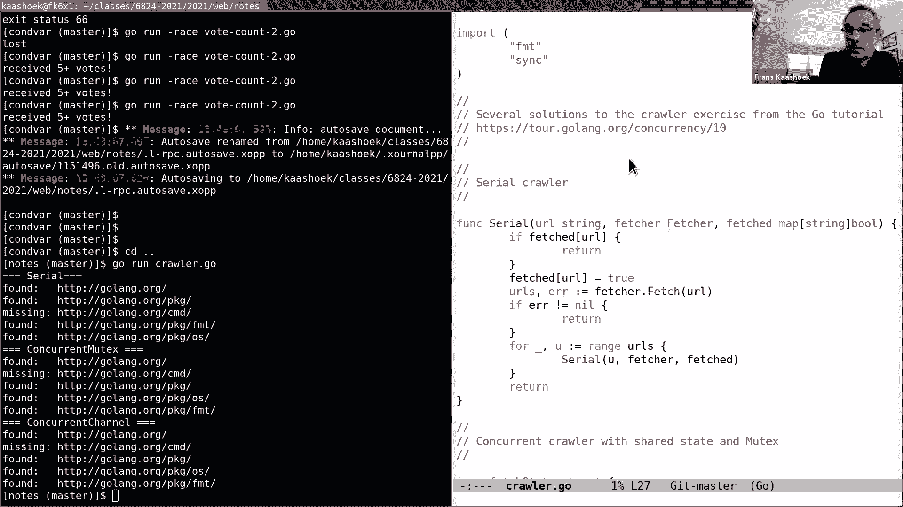

好的，让我回去，再次分享我的屏幕，大家能不能再看到我的屏幕。是的，看起来不错。很好，谢谢你。好的，希望这很有趣，让我谈论一下我的解决方案。

它们已经放在课程表页面上。

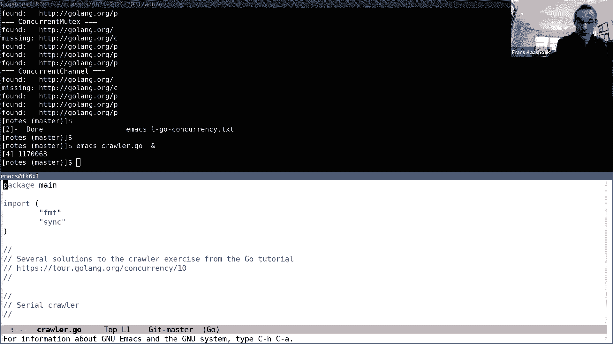

如果你还没有，你可以和我一起看，如果你想的话。让我先看一遍互斥锁版本，稍后再看通道的版本。所以，这是互斥锁版本，互斥锁版本声明了具有映射和互斥锁的结构，映射需要由互斥锁保护，因为会对映射进行并发访问。

映射本身并不是线程安全的，取决于程序员使映射是线程安全的。互斥锁版本跟顺序版本很像，除了有一个阶段使用了锁，所以我们获取锁，我们查看 url 是否已经被爬取，如果它没有被爬取，我们现在把它标记为爬取。

还没有被爬取，我们解锁，我们保留这个 already 的值，决定我们是否应该返回。然后，这个 goroutine 开始爬取页面，取回一堆 url ，然后对于每个返回的 url 。

它在这边创造了一个新的 goroutine ，传入 url ，goroutine 会爬取。这里唯一有趣的是，它使用了关于 WaitGroup 的一些东西，WaitGroup 是一个非常方便的原语。

用于跟踪你有多少活动线程，什么时候可以终止。这是这次任务中的一个大问题，如果你终止得太早，那你还没有爬取网页。所以你需要跟踪，还有什么网页需要抓取，sync。WaitGroup 非常简单。

每次你调用线程，调用 Add ，然后当线程终止时，调用 Done ，我们可以方便的在 defer 语句中做到。然后主线程等待所有线程结束，只是等待，Wait 将返回，直到每个线程。

开始时的每个 Add(1) ，如果所有这些线程都已经退出。这是互斥锁的版本。你可以将 sync wait 看作是，条件变量的内部实现。好的，让我来看看通道版本，这是通道版本。

基本上是按照 mapreduce 实验组织的，有协调者和工作者，所以，我们开始创建一个协调者线程，我们做这一点的方式是，我们创建一个通道，然后将通道传递给 coordinator 。

coordinator 当然必须从开始 url 开始，所以我们需要在通道上提供这些信息，这是最方便的事情，我们马上会看到。但是，要把它发送给通道，我们需要创造一个 goroutine ，否则。

我们会陷入死锁，这是一件困难的事情，我们将在通道上发送那个值。让我们来看一下 coordinator ，这是 coordinator ，它不使用任何锁，因为数据结构，这里没有实际共享的数据结构。

比如 fetched ，映射跟踪哪些 url 被爬取，只在 coordinator 中访问。所以 coordinator 获得，当我们初始调用它的时候，我们得到，它有一个 url 。

检查 fetched 映射，对于每个 url ，然后它循环到达通道，使用 range 语句，它所做的是，只要继续读取通道，然后获取下一个值，获取下一个值，获取下一个值，所以就是获取 url 。

我们知道有一个初始化，因为我们在创建它时，放入的。然后，对于那个 url ，我们做的事情类似于，并发类似于互斥锁版本，我们看到 url 已经被获取，如果已经获取，那我们完成了，否则。

我们创建一个 Go worker 来获取那个 url 。我们会记录我们有多少 worker ，n 是统计 worker 的数量，只有当 n 为 0 时，我们才会终止 coordinator 。

确保我们已经获取了所有网页，我们想要爬取的。如果你查看 worker ，worker 调用 Fetch ，这个调用是与其他 worker 并行发生的。如果它从网页获取了一些 url 。

它将所有这些 url 写入通道，coordinator 通过 range 语句获取所有这些通道，然后当它完成的时候，通过通道写入所有 url ，然后 coordinator worker 退出。

在某一时刻，减少 n ，然后在最后，基本上就是这样。好的？所以这就是两个解决方案，关于这些，有什么问题吗？都清楚了吗？聊天中有个问题。好的，让我找回我的聊天列表。好的，所以问题是，当 ch 有值时。

当所有其他线程空闲时，如果是这种情况，由于这不是缓冲通道，通道中同时只会有一个请求，所有线程都会被一个接一个地加到通道中。但这不是让程序顺序化了吗，因为没有两个线程并行运行，除了主线程和一个线程。好的。

 fetcher 仍然会并行发生，这些是昂贵的操作，这些需要通过互联网。知道了，谢谢。好的，让我切换回我的另一个屏幕。

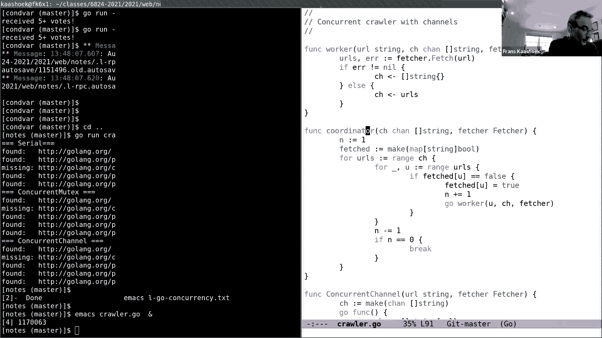

稍微讨论一下 RPC ，因为这是实验里需要的另一个工具。关于这个我们不会说太多，但是 RPC 表示远程过程调用。RPC 系统的目标，比如一个目标是，RPC 的行为与过程调用大致相似。

在栈上运行的本地过程调用，所以目标是，如果你有一个客户端，在 RPC 术语中，调用方通常称为客户端，被呼叫方称为服务器。所以你有一个函数 fn ，使用 x y 调用，然后在服务器上，有这个函数的实现。

所以有一个函数 fn(x， y int) ，它返回，无论做什么计算，可以返回 x+y 。所以，我们希望发生的事，或者我们考虑的模型是，当客户端调用该函数 fn 时，RPC 系统会确保。

在服务器端发生对应的应用程序，将参数 x 和 y 传递给服务器，代码在服务器上运行，它会返回你看到的结果，那个结果是向客户端发回信息，然后 fn 恢复，返回，客户端会返回，将返回 x+y 。

返回 x+y 的值到 z 。所以这看起来，尽管这些程序运行在不同的计算机上，它们实际上在这里是有界限的，看起来像做一个普通的过程调用，我们一会会看到，实际上，我们可以找到很多相似之处。

所以让它们的行为非常相似，但你也会发现有一个根本的不同，与分布式计算有关系。但在到达那里之前，首先我大概说一下它是如何工作的。这是一种粗略的 Go 说做的。所以，你可以这样想，当客户端。

所以这是我们的程序，当客户端使用 x y 调用函数 fn 时，它实际上调用的称为 stub 的东西，stub 是本地函数，调用 fn ，并用两个参数 x 和 y ，stub 所做的。

考虑这是一个 stub 过程，stub 过程所做的，构建一个消息，表示哪个函数需要被调用，函数的参数，参数的类型，参数的值等等。然后 stub 所做的，它通过网络发送，到服务器上对应的 stub 。

服务器接收到这个消息，取得这个消息，反序列化它，这是一个术语，它用来，将值从字节数组转换回值，然后在服务器上调用这个函数 fn ，这是 fn x 等等。所以， stub 调用这个函数。

这个函数返回到 stub ，这个 stub 序列化响应值，比如 z x+y ，它返回到客户端 stub ，而且客户端 stub 仍在等待，所以，客户端 stub 的工作方式，它发出请求，然后等待响应。

当响应回来的时候，它反序列化，然后将值返回给客户端。所以，这两个 stub ，使远程过程调用看起来像是常规过程调用，因为你几乎看不出来。这些键，这些 stub 通常是自动生成的，在 Go 的编译器中。

会为你生成两个 stub ，并为你序列化和反序列化参数，这就是它说做的。所以当你从服务器到客户端时，还有另一个 stub 吗？你会返回到第一个 stub 。所以这个 stub 发出一个过程调用。

发出一个过程调用 fn ，这个过程直接返回到 stub ，因为 stub 调用的它。哦，这是同一个 stub 。没错。明白了。好的？好的，让我来展示这是如何在 Go 中进行的。

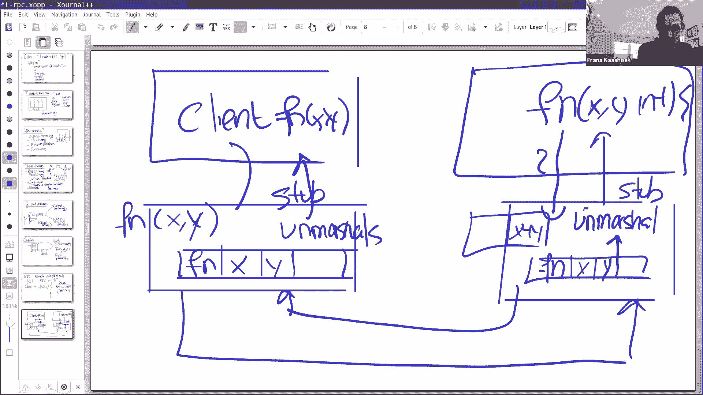

通过展示一个非常简单的键值服务器。你会看到，它看起来不完全是我们的过程调用，但已经很接近了。所以典型的情况是，在 Go 中的典型转换，你声明参数结构，所以，我们将实现两个过程，两个远程过程。

一个是 put ，一个是 get ，put 的参数是，参数通过 put ， put 返回响应，类似地，有一个 get 参数请求，参数通过 get 请求，然后返回。所以让我先来看服务器，这里有两个函数。

是我们要在服务器上调用的两个函数，我想我先跳过这一步。

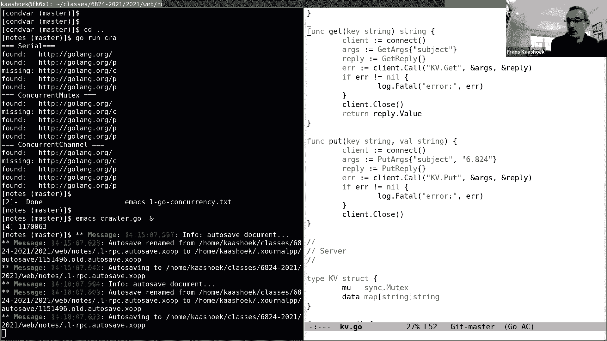

所以我们实际上。

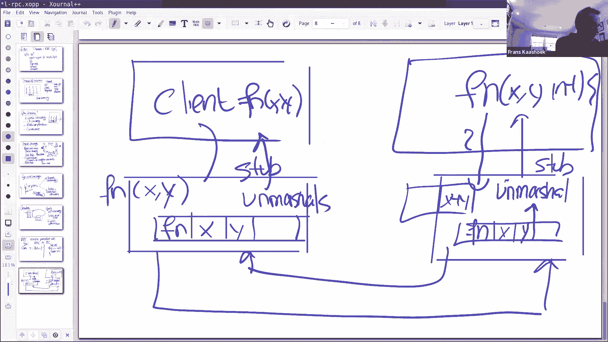

让我稍微说一下，这是客户端，客户端调用一个函数 get ，在 get 之中，这个函数连接到服务器，看看这到底是什么意思，它填充了参数，并分配响应，然后调用这个过程调用 client。Call 。

你可以认为这是一个通用的 stub ，使用需要在服务端调用的方法，以及参数和响应，所以 Call 有三个参数，方法，参数和响应，而 Call 内部会发送序列化的参数，通过连接发送消息到服务器。

等待响应返回，当响应回来时，reply 结构由 Call stub 填充，然后当这件事完成后，然后返回到 Call 调用。基本上， put 看起来是完全一样的。所以，在服务器端。

让我们看看这是如何实现的，服务器有键值映射，只是一个常规的 Go 映射，让我看看键值结构，在某个地方声明的，哦，抱歉，它就在上面。所以这里有一个结构叫做 KV ，它有一个互斥锁和一个映射。

这个映射是我们要放入和获取操作的。这里有一个小的前言，你需要编写来设置服务器，但就是这样，基本上，分配一个新的服务器对象，然后这里是键操作 rpcs。Register(kv) ，注册所有方法。

在 RPC 服务器上 KV 结构上实现的方法，不同的是，这些由大写字母命名的方法，用大写字母的方法会被记录，Go 使用大写字母名称来表示公共方法，而小写的方法是私有方法，所以， rpcs。

Register 只导出大写的方法，例如，下面是一个方法，这里是 Get 方法，它有大写字母，通过调用 Register ，这个方法可以通过客户端调用服务端。所以，在服务器内部。

它创建一个 TCP 连接，并等待 TCP 连接，获得 TCP 连接的返回，然后调用 rpcs。ServeConn 来提供 TCP 连接，基本上，每一条通过连接的消息，它会自动找到正确的方法。

与消息相关联，使用反序列化的参数调用方法，并序列化回复。例如，如果客户端调用 GET ，它使这个连接存在，然后，如果客户端使用 Get 调用 Call ，然后将运行这个 Get 函数。如你所见。

这个 Get 函数，它做的第一件事是，它先获取一个锁，因为多个客户端可能会调用服务器，会有多个 goroutine 同时运行，也许会调用 Get 和 Put ，它们同时操作映射，所以，我们需要确保。

这些是以原子的方式完成的，所以，我们使用锁。所以， Get 函数查看映射中的键，查看映射中的键，然后返回值，如果映射中没有条目，它将返回 ErrNoKey ，否则，它会返回适当的值，就是这样。

在服务器端，当这些 Get 函数返回时，它会序列化自己的回应，将响应发回客户端，客户端对其进行反序列化，并将其返回给调用者。好的，这能理解吗？所以这是在做一个简单的键值服务器。

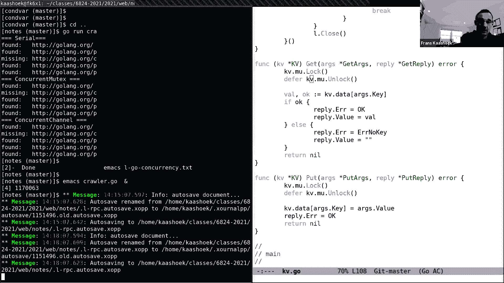

好的，我想再说一点，这是很重要的一点，最后，重要的是要考虑的是，RPC 失败的语义是什么。所以可能存在不同类型的语义，某些东西称为至少调用一次，这一切所做的，如果服务器发生故障，客户端所做的事情。

我们假设客户端发送了请求，然后服务器崩溃了，当然，在某个时刻，客户端将会超时，它不知道操作是否真的发生了，至少一次 RPC 语义意味着，客户端将自动重试并继续，所以它至少执行一次。至少一次的缺点是。

同一个操作可能会被多次执行，比如，如果你做一个 put ，put 可能会被执行多次，在至少一次 RPC 系统中。所以这并不适用于许多应用程序，所以，另一种语义，常出现在 RPC 系统中的是最多一次。

相应的服务器请求执行零次或一次，但不会超过一次，它实现的方式是通过过滤重复，你会在后面的实验中做这个，可能是这种情况，两个请求到达，也许网络临时分裂，服务器收到了这两个请求，服务器必须安排。

它检测到重新发送的请求，并且不执行两次。当然，理想情况下，你可能需要正好一次，因为这是正常过程所做的，就像你在一个正常的顺序程序中调用过程，正好执行一次，它永远不可能是至少一次或最多一次。事实证明。

这很难[安排]，这需要管理状态在磁盘上，而且往往很昂贵，事实上，很少有 RPC 系统是正好一次，虽然在实验中，你要在实验 3 中构建一个，你需要构建一个正好一次的 RPC 系统。好的？实际上。

 Go 的 RPC 系统是最多一次，所以如果你发起一个调用，你通过 TCP 通道进行调用，TCP 通道将确保不存在重复项，RPC 系统要么执行一次，要么根本不执行，然后在这种情况下，返回一个错误。

然后当然应用程序可以重试，但这是应用程序的责任，处理重复和失败消息的问题。好的，这就是关键点，它们的失败，使 RPC 与过程调用不同，所以目标是，让它们看起来尽可能地相似，实际上并不完全相同。

导致出现差异的是故障或服务器崩溃。关于 RPC 的快速介绍，有什么问题吗？好的，如果没有，我就在这里结束了，所以有些人需要离开，或者学生需要上下一节课，你可以去下一节课，我会在线，所以如果还有什么问题。

我很乐意回答，在这里逗留一段时间。

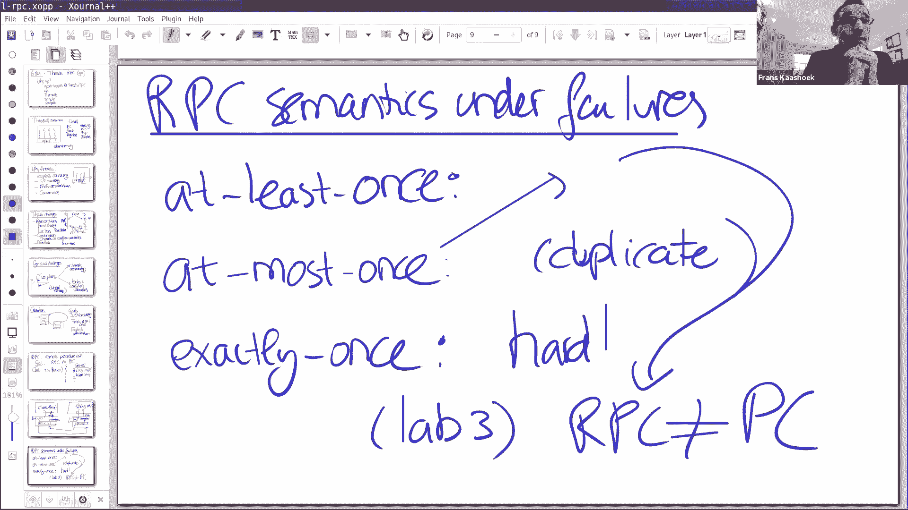