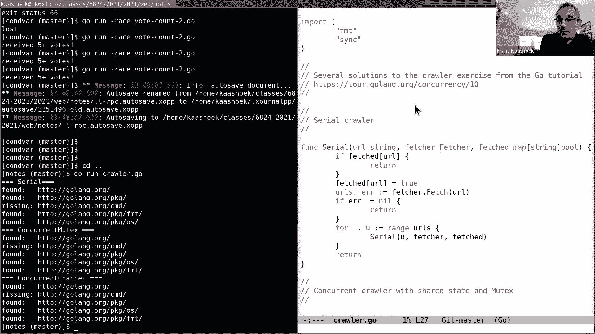
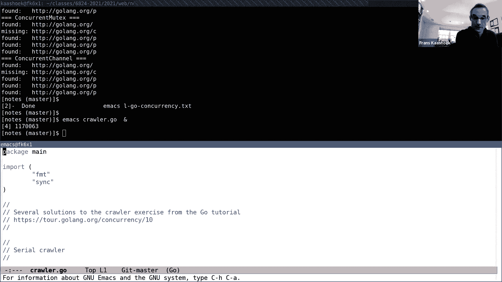
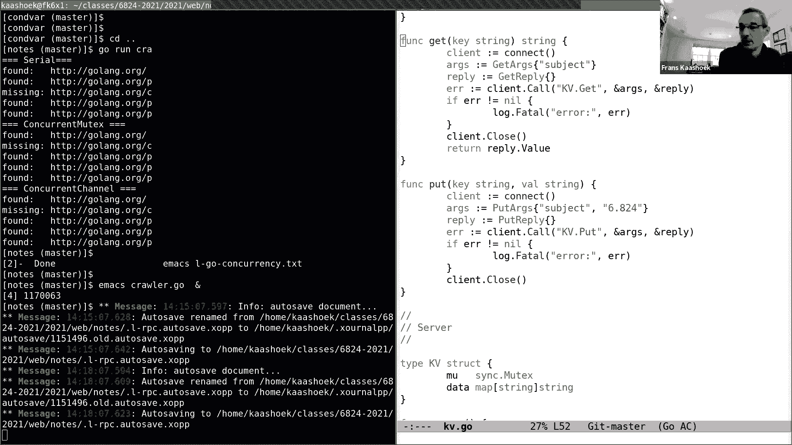
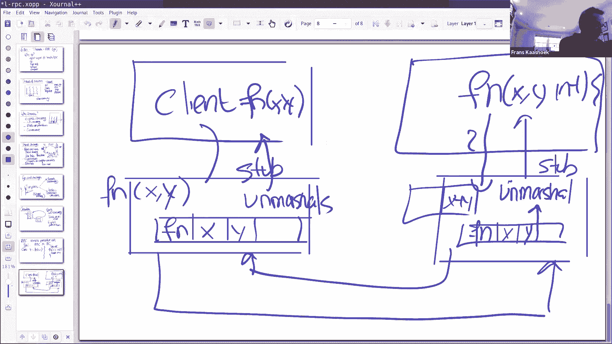
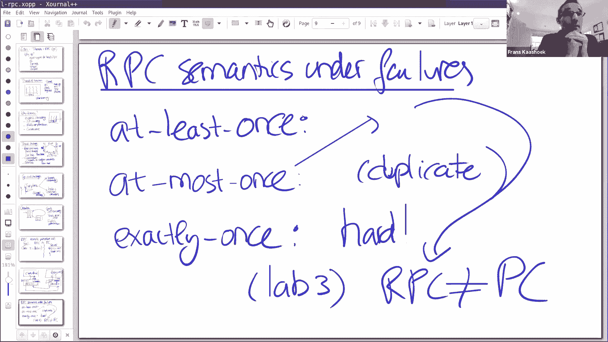

# 课程2：线程与RPC 🧵📡

在本节课中，我们将学习分布式编程的两个核心概念：线程（在Go中称为goroutine）和远程过程调用（RPC）。我们将重点讨论Go语言中的实现，因为这是本课程实验所使用的语言。通过理解这些概念，你将能够更好地完成后续的实验项目。

## 概述：为什么使用Go？🤔

首先，我们来探讨一下为什么本课程选择Go语言。理论上，有许多编程语言可用于分布式编程，Go并非唯一选择。我们在6.824课程中选择Go有几个原因。

首先，Go对线程和RPC有出色的支持，这两点对于分布式编程至关重要。其次，Go拥有垃圾回收器。在进行共享内存式并发编程时，多个线程共享结构体或变量，垃圾回收器能自动管理内存，无需线程操心谁是最后一个引用者，这非常方便。Go还是类型安全的，语言本身简单易学。最后，Go是编译型语言，运行时开销较小，且编写Go程序是一种愉快的体验。

## 第一部分：线程（Goroutine）🏃‍♂️

上一节我们介绍了选择Go的原因，本节中我们来看看线程的基本概念。线程是执行线程的简称，在Go中称为goroutine。你可以将其视为一个顺序执行的程序，拥有自己的程序计数器、栈和寄存器。

当你运行`go run`时，Go会在你的操作系统上创建一个进程。在这个进程中，Go运行时系统最初只有一个执行线程，即主线程。但Go提供了创建新线程的原语。

### 线程的创建与操作

线程可以与其他线程共享内存，因为它们都在相同的进程地址空间中运行。这意味着一个线程写入内存位置后，另一个线程可以读取该位置，从而实现信息交换。

以下是关于线程操作的几个关键点：
*   **创建线程**：使用`go`关键字。
*   **线程退出**：通常在线程函数返回时隐式发生。
*   **线程阻塞与恢复**：例如，当线程向一个没有读取者的通道（channel）写入数据时，它会被阻塞。Go运行时会停止该线程，稍后在适当时机恢复它。

### 为什么需要线程？🎯

使用线程编程有时会使程序员的生活更复杂，因为编写顺序代码通常比编写并行代码更容易。但在分布式系统中，线程至关重要，主要原因有三点：

1.  **I/O并发性**：当一个线程因网络I/O操作（如等待远程机器回复）而阻塞时，其他线程可以继续运行，从而允许程序同时发起多个请求。
2.  **多核并行性**：现代计算机拥有多个核心。线程允许不同的goroutine在不同的核心上并行运行，从而提高吞吐量。
3.  **编程便利性**：线程便于执行定期任务（如每隔一段时间执行某些操作）或后台活动。

### 线程的挑战与应对策略 ⚠️

尽管线程强大，但使用它们进行编程也面临挑战。

**1. 竞态条件**
当多个线程共享并修改同一变量时，可能会发生竞态条件。例如，两个线程同时执行`n = n + 1`，由于该操作并非原子性，可能导致最终结果错误（期望为2，实际为1）。

有两种主要方法解决竞态条件：
*   **避免共享**：使用通道（channel）进行通信，而不是直接共享内存。这是Go鼓励的风格。
*   **使用锁**：通过锁（如互斥锁`sync.Mutex`）确保一系列指令以原子方式执行。

**提示**：Go内置了竞态检测器。建议在运行实验代码时使用`-race`标志，它有助于识别潜在的竞态条件。

**2. 协调**
线程间经常需要协调，例如一个线程必须等待另一个线程完成某项工作。Go提供了两种主要原语来处理协调：
*   **通道**：允许通信和协调同时进行。
*   **条件变量**：与锁配合使用，用于等待特定条件成立。

**3. 死锁**
当两个或多个线程相互等待对方释放资源时，就会发生死锁，导致程序无法继续执行。最简单的死锁例子是：一个线程向无人读取的通道写入数据，而程序中又没有其他活动线程。Go运行时会检测到这种简单死锁并报错。


### Go的并发方案：通道 vs 锁/条件变量 🛠️

Go提供了两种主要的并发编程方案来应对上述挑战。

*   **通道方案**：适用于线程间需要通信但无需共享内存的场景。它通过传递数据来协调线程。
*   **锁与条件变量方案**：适用于线程间需要方便地共享内存的场景（例如，共享一个键值表）。

选择哪种方案通常取决于问题的便利性。本课程教程重点介绍了通道，对锁和条件变量涉及较少，因此我们将通过一个示例来补充说明条件变量的用法。

### 示例：使用锁和条件变量进行线程协调 📊

考虑一个场景：主线程`t1`需要从多个远程机器收集选票（例如在Raft协议中）。它创建多个goroutine（`t2`, `t3`...）来并行获取选票。`t1`需要等待，直到收集到足够多的选票（例如5票）或所有请求完成。

以下是使用互斥锁和条件变量的解决方案核心逻辑：

```go
var mu sync.Mutex
var cond = sync.NewCond(&mu)
var count int
var finished int

// 主线程
mu.Lock()
for count < 5 && finished < 10 {
    cond.Wait() // 等待条件满足，会原子性地释放mu并进入睡眠
}
mu.Unlock()

// 每个投票goroutine
go func() {
    // ... 模拟远程调用获取投票 ...
    mu.Lock()
    defer mu.Unlock()
    if vote {
        count++
    }
    finished++
    cond.Broadcast() // 通知等待的主线程
}()
```
**解释**：
*   主线程获取锁后检查条件。如果条件不满足，调用`cond.Wait()`，这会使其睡眠并释放锁。
*   投票goroutine在更新共享变量（`count`, `finished`）后，调用`cond.Broadcast()`唤醒所有等待者（此处是主线程）。
*   主线程被唤醒后会自动重新获得锁，再次检查条件，如此循环。

### 示例：使用通道进行线程协调 📨

同样的投票问题也可以用通道解决。在这种方案中，共享变量`count`和`finished`仅由主线程访问，避免了锁的使用。

```go
ch := make(chan bool)
for i := 0; i < 10; i++ {
    go func() {
        // ... 模拟远程调用获取投票 ...
        ch <- vote // 将投票结果发送到通道
    }()
}
for i := 0; i < 10; i++ {
    v := <-ch // 从通道接收投票结果
    if v {
        count++
    }
}
```
**注意**：此方案需小心处理goroutine生命周期。如果主线程在收集到足够票数后提前退出，可能会留下阻塞在通道写入操作上的goroutine，造成资源泄露。

## 第二部分：爬虫实践 🕷️

上一节我们通过投票示例了解了线程协调，本节我们来看一个更实际的并发编程例子：网络爬虫。爬虫的目标是从一个起始URL开始，获取网页内容，提取其中的新URL，并继续爬取，同时确保不重复访问同一URL。

其核心挑战在于：
1.  **I/O并发**：网络抓取很慢，需要并发进行以提高效率。
2.  **正确性与性能**：确保每个URL只被抓取一次，并利用多核并行处理。

### 顺序爬虫解决方案

首先，我们有一个简单的顺序递归解决方案作为基线：

```go
func Serial(url string, fetcher Fetcher, fetched map[string]bool) {
    if fetched[url] {
        return
    }
    fetched[url] = true
    urls, err := fetcher.Fetch(url)
    if err != nil {
        return
    }
    for _, u := range urls {
        Serial(u, fetcher, fetched)
    }
}
```

### 并发爬虫解决方案：互斥锁版本

以下是使用互斥锁和`sync.WaitGroup`的并发解决方案要点：


```go
type fetchState struct {
    mu      sync.Mutex
    fetched map[string]bool
}

func (fs *fetchState) testAndSet(url string) bool {
    fs.mu.Lock()
    defer fs.mu.Unlock()
    if fs.fetched[url] {
        return true
    }
    fs.fetched[url] = true
    return false
}


func ConcurrentMutex(url string, fetcher Fetcher, fs *fetchState) {
    if fs.testAndSet(url) {
        return
    }
    urls, err := fetcher.Fetch(url)
    if err != nil {
        return
    }
    var done sync.WaitGroup
    for _, u := range urls {
        done.Add(1)
        go func(u string) {
            defer done.Done()
            ConcurrentMutex(u, fetcher, fs)
        }(u) // 注意：将u作为参数传入，避免循环变量捕获问题
    }
    done.Wait()
}
```
**关键点**：
*   `fetchState`结构体包含一个互斥锁和一个记录已抓取URL的映射。
*   `testAndSet`函数在锁的保护下检查并设置URL状态。
*   `sync.WaitGroup`用于等待所有为子URL创建的goroutine完成。

### 并发爬虫解决方案：通道版本




通道版本的爬虫采用了“协调者-工作者”模式：



```go
func worker(url string, ch chan []string, fetcher Fetcher) {
    urls, err := fetcher.Fetch(url)
    if err != nil {
        ch <- []string{}
    } else {
        ch <- urls
    }
}

func coordinator(ch chan []string, fetcher Fetcher) {
    n := 1 // 跟踪活跃工作者数量
    fetched := make(map[string]bool)
    for urls := range ch { // 持续从通道读取URL列表
        for _, u := range urls {
            if !fetched[u] {
                fetched[u] = true
                n++
                go worker(u, ch, fetcher)
            }
        }
        n--
        if n == 0 { // 所有工作者都已完成
            break
        }
    }
}

func ConcurrentChannel(url string, fetcher Fetcher) {
    ch := make(chan []string)
    go func() {
        ch <- []string{url}
    }()
    coordinator(ch, fetcher)
}
```
**关键点**：
*   协调者（`coordinator`）维护已抓取URL的映射，并负责创建工作者goroutine。
*   工作者（`worker`）执行抓取任务，并将找到的新URL列表发送回通道。
*   协调者通过计数`n`来跟踪活跃工作者，当`n`为0时结束。
*   所有数据通过通道传递，避免了显式的锁。

## 第三部分：远程过程调用（RPC） 🌐

上一节我们探讨了单机内的并发，本节我们将视野扩展到多台机器，学习远程过程调用。RPC的目标是让跨网络的过程调用看起来和本地过程调用一样简单。

### RPC工作原理

在RPC模型中，调用方（客户端）调用一个本地函数（stub），该函数负责：
1.  将函数名和参数序列化成消息。
2.  通过网络将消息发送到服务器。
3.  等待响应。
4.  将响应反序列化，并返回给客户端。


服务器端有一个对应的stub，它：
1.  接收网络消息。
2.  反序列化出函数名和参数。
3.  调用服务器上真正的函数实现。
4.  将函数返回值序列化，发送回客户端。

### Go中的RPC示例：简单键值存储

以下是一个简单的键值存储服务器的RPC实现框架：

**1. 定义参数和响应结构**
```go
type PutArgs struct {
    Key   string
    Value string
}
type PutReply struct {
}

type GetArgs struct {
    Key string
}
type GetReply struct {
    Value string
}
```


**2. 客户端调用**
```go
func (ck *Clerk) Get(key string) string {
    args := GetArgs{key}
    reply := GetReply{}
    ok := ck.srv.Call("KV.Get", &args, &reply) // 调用远程方法
    if !ok {
        return ""
    }
    return reply.Value
}
```



**3. 服务器端实现**
```go
type KV struct {
    mu   sync.Mutex
    data map[string]string
}



func (kv *KV) Get(args *GetArgs, reply *GetReply) error {
    kv.mu.Lock()
    defer kv.mu.Unlock()
    val, ok := kv.data[args.Key]
    if !ok {
        return errors.New("key not found")
    }
    reply.Value = val
    return nil
}

// 设置服务器
func server() {
    kv := &KV{data: make(map[string]string)}
    rpcs := rpc.NewServer()
    rpcs.Register(kv) // 注册可供调用的方法
    // ... 网络监听与连接处理 ...
}
```
**说明**：
*   服务器结构`KV`包含互斥锁，因为多个客户端RPC调用可能并发访问共享的`data`映射。
*   只有首字母大写的方法（如`Get`, `Put`）会被RPC系统导出供客户端调用。
*   `rpcs.Register`会注册所有导出的方法。

### RPC的故障语义 ⚡

RPC调用与本地调用一个关键区别在于对故障的处理。常见的RPC语义有：


*   **至少一次**：客户端在超时或失败后会重试，确保操作至少执行一次。但可能导致操作被执行多次。
*   **最多一次**：服务器通过去重机制，确保同一个请求最多执行一次。Go的RPC系统（基于TCP）通常提供最多一次语义。如果调用失败，会返回错误，由应用程序决定是否重试。
*   **正好一次**：这是最理想但最难实现的语义，需要结合持久化状态和复杂的恢复机制。你将在本课程的后续实验中构建一个提供“正好一次”语义的系统。

## 总结 🎉

本节课中我们一起学习了分布式编程的两大基石：线程和RPC。

*   我们了解了**线程（goroutine）** 在Go中如何创建和运行，以及它们为何对实现I/O并发和多核并行至关重要。我们探讨了使用线程时面临的竞态条件、协调和死锁等挑战，并学习了通过**通道**和**锁/条件变量**两种方案来应对这些挑战。
*   我们通过**爬虫示例**实践了并发编程，对比了使用互斥锁和通道两种不同风格的解决方案。
*   我们学习了**远程过程调用（RPC）** 的基本概念，它使得跨网络的函数调用像本地调用一样方便。我们了解了Go中如何实现一个简单的RPC服务，并讨论了**至少一次**、**最多一次**和**正好一次**这些重要的RPC故障语义。



掌握这些概念将为你完成本课程关于分布式系统的实验打下坚实的基础。