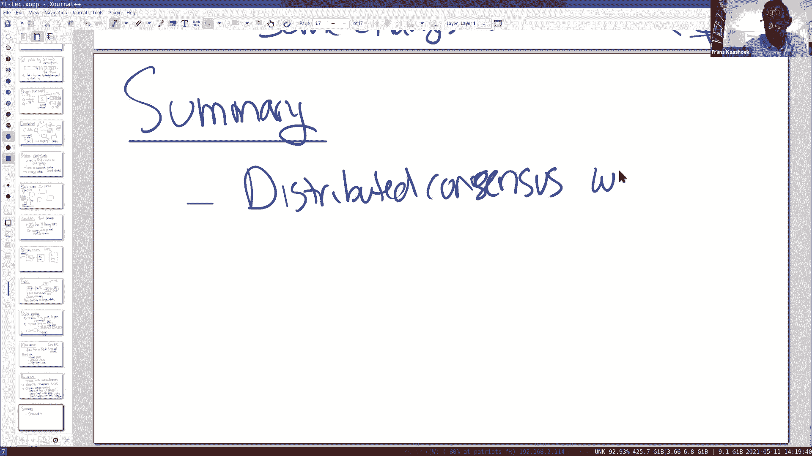
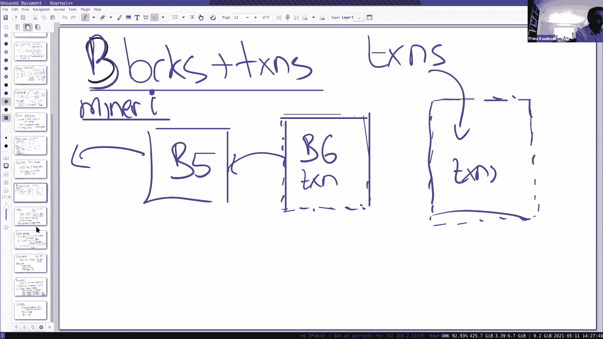

# P20：Lecture 19 - Peer-to-Peeer - Bitcoin - mayf09 - BV16f4y1z7kn

好的，下午好，早上好或晚上好，我们开始吧，今天我想谈谈比特币。我想谈这件事的原因是，它解决了一个困难的问题，也就是与拜占庭参与者达成共识。我想它解决了，所以拜占庭参与者是，它可能是恶意的或敌意的。

它在一个完全开放的系统中解决了这个问题，人们可以随意加入和离开这个系统，其中一些可能是恶意的，并在事务发生的顺序上达成共识。这是一个非常具有挑战性的情况，是涉及到钱的。

这个设计有点像 SUNDR 的一些方面，在这个意义上，有一个有签名的操作日志，在这个事务的例子中。我们知道在 SUNDR 中，可以处理 fork ，所以，关于比特币的大部分，很多有趣的方面。

我主要将重点放在，这篇论文的分布式系统方面。这篇论文有点不同寻常，或者说相当不同寻常，首先，这不是一篇来自科学文献的论文，目前为止我所读过的，它来自世界上不同的地方，它是匿名的，而且它有特别的[]。

对于一家金融机构，你可以有各种各样的意见，关于通常的比特币和加密货币，但从分布式系统的角度来看，这是一个[]成功的系统，这是一个真正开放的系统，可以容忍拜占庭参与者，并达成共识。所以这节课的重点。

你在试图理解，如何实现这一特定方面。有任何问题吗，在开始讨论之前？好的，就像我刚才提到的，这里的背景是金融交易。所以，这里有一个压倒一切的担忧，当涉及到交易时，在涉及金钱交易时，首先。

当然担心完全的伪造，人们凭空捏造交易，并将它们输入到日志中，试图误导其他参与者，实际上他们是在花自己的钱，同时花别人的钱，这个问题很容易解决，以一种非常短的类似于 SUNDR 的风格，从根本上说。

签名操作使伪造变得困难，事实上，这里的大体情况，它和 SUNDR 是一样的，拜占庭参与者非常强大，我们将假设，密码系统是工作的，不会被攻破。所以，许多核心功能或基础，我们可能会包括，一切都很安全。

一切是好的，基于基础密码学是正确的这一事实，所以这是一个挑战。第二个挑战是，论文花了很多时间讨论的是双重花费，所以你有一些比特币，你积累的，一个拜占庭参与者试图花费同一个比特币两次，当然。

我们想要避免那个特别的问题，我们将看到的主要想法是，所有交易的公共账本或公共日志，所以你可以看到交易是否，没有钱已经在早期的交易花费，并试图在日志中的内容达成共识，是这篇论文的核心。当然除了这两个之外。

另一个显而易见的问题，但论文没有太多地谈到，我们也不会谈论太多，也就是偷窃，有人偷了别人的私钥，因此可以花钱或使用比特币，使用这个特定私钥，这是一个严重的问题。

人们将他们的钱包和他们的签名密钥存储在计算机上，电脑可以被破解，因此，人们可以打破它，偷窃别人的钱。我认为这在实践中是一个严重的问题，我不会花太多时间谈论这件事，再一次，我想集中讨论分布式系统方面。

对这些挑战，有什么问题吗？好的，我们来看看交易，它里面是什么。所以这是什么在账本中，我将大大简化这一过程，因为一些细节对讨论不重要，我们将要进行的（讨论），你能想到的第一个[顺序]是。

每一笔交易都是一个记录，并且记录具有公钥，对于持有钱的用户，所以这就是目的，之前交易的哈希，对于这种特殊的比特币来说，以及签名，我们有私钥，U2 是这个比特币的前所有者，在这种情况下。

你可以认为这是来源，所以 U2 操作，同意将比特币从 U2 转移到 U1 ，这样 U1 可以花掉它们。当然，里面还有很多其他的东西，比如有一个金额，一个零钱金额，可能有许多目的地和许多来源，有很多进出。

我们都会忽略它，只专注于一种简化的描述，事实证明，交易也是编码的，而不是某种被动记录，但是一种小的脚本语言，也会忽略所有这些方面。我将开始专注于这件事，然后讨论，展示一个小例子，所以我们得到一点了解。

我们所看到的就是这一挑战。所以，我们将查看一个示例账本，试图理解，比特币意味着什么或者币是什么，这不是一件单一的事情，这可以归结为，上一笔交易的 sha1 ，这就是硬币的本质。所以，假设 y 有一枚币。

从 x 那里收到，所以这意味着在账本的某个地方，这个交易，转移钱或币或币的一部分给 y ，让我们看看，在某个地方，可能有一个条目在账本中，在一段时间内， x 收到了一些比特币，现在已经把它给了 y 。

所以在账本上还有另一笔交易，记录了这样一个事实，所以它可能有 y 的公钥，目的地交易 6 的哈希值，所以这唯一标记了标志，唯一标识交易 6 ，所以我们有交易 6 的账本或记录。

现在我们可以重新计算这个交易的哈希值，与存储交易 7 相比，确定了事务 6 ，这笔交易的来源是什么，或者它是基于之前交易 6 ，对于这个币，它是由 x 签名的。现在，这是一种情况。

y 从 x 获取一些比特币，y 想要花掉，例如，也许 y 想从 z 买一杯拿铁，所以它向 z 的转一笔钱，所以也许我们会在账本上看到另一笔交易，这将是一种形式，这是 y 要加上，pub(z) 。

上一个币的哈希值，那枚币的最后一笔交易，是 T7 ，并由 y 签名。z 想做的，在 z 把拿铁给了 y 之前，z 需要做一些验证，以确保这是合法的交易，所以查看交易 7 ，计算哈希值，进行检查。

哈希值对应于，交易 8 中列出的哈希值，如果哈希值已通过，所以这是交易 7 ，我们相信交易 8 所指的，z 在交易 7 中查找 y 的公钥，通常是公钥 y ，然后验证使用这个公钥，来验证这个交易的签名。

签名当然涵盖了整个交易，如果签名通过了，然后 z 可以自信地，账本包含一个交易，将一些钱从 y 转移到 z ，所以在这一点上， z 验证了，如果它是好的，给出拿铁，如果不是，就拒绝，又一次。

就像在 SUNDR 中，所有这些方案都在这里，y 很小心地使用它的私钥，所以我们必须假设，y 没有以任何方式透露它的私钥，因为如果有人知道这个私钥，那么任何人都可以签名，他可以花掉 y 的钱。

虽然可能从接受者的角度来看，并不是真的在乎。好的，所以，这是一个基本的计划，就有记录而言，我是说，这很好，我是说，有交易的记录，当 z 接收到交易，可以检查这是否是有效的交易，这允许决定。

接受资金和交付货物。所以，其中一个关键挑战，所说的，我们看到完全伪造是很困难的，但我们需要考虑一下双重花费，所以，双重花费问题如下所示。假设不是创建一个记录，在这个交易 8 的例子中，z 创建了。

 y 创建了两个记录，一个记录是你看到的那个 T8 ，y 到 z ，以及 T7 的哈希值。让我们来看看，让我们假设 y 试图双重花费它的钱，所以它创建了第二个交易 T8' ，记录基本上是一样的。

除了钱流向了 Q ，它有 T7 的哈希，当然也有 y 的签名，由 y 签名。现在，假设 q 和 z 都是拿铁咖啡店，如果 z 接受了 T8 ，它会这么做，因为一切检查都通过了。

正如我们在上一张幻灯片中所看到的，然后 z 会把一杯拿铁给 y ，q 不知道任何事情，可能关于另一笔 T8 交易，因为这个 T8 交易，检查这个，确实是这样，T7 中的钱被转移到了 y 。

检查了 y 的签名，如果有效，会说好的，很好，哦，谢谢你的钱，我也会给你一杯拿铁，现在我们的处境很糟糕，因为 y 成功双重花费并得到两杯拿铁，这是那个问题，论文致力于解决的问题。基本的方法是。

有点类似于做过的事情，我们记录所有的交易日志，从它们一开始，在日志中包含所有交易，包括顺序，所以，让我们看看，所以我们把交易放进去，我们这里有 T6 ，这里有 T7 ，所以如果有公共记录。

它对所有交易进行排序，T8 或 T8' 先开始，假设 T8 先开始，然后 T8' 进入日志中，这会发生，那么你一点问题都没有，因为这是从 y 到 z 的交易，这是从 y 到 q 的交易。

当 Q 确认的时候，当 z 确认交易时，一切看起来都和以前一样完美，当 Q 确认交易时，除了检查，我们查看，它在日志中查找，Q 在日志中查找，看到 T7 已经花掉了，当然，你后退日志，遇到 T8 。

看到钱已经花掉了，所以，它将拒绝 T8' 。好吗？所以，这就是基本计划，所以产生了一个问题，比如我们如何确保，系统中的所有参与者都同意这个日志，所有的交易都在同一个位置。

包含相同的内容、相同的散列、相同的签名，所以，我们可以验证交易，使用这个幻灯片中列出的方案。这就是共识问题的作用，有时，人们将这一解决方案，称为中本聪共识协议。现在，在深入研究协议之前。

我想勾勒出可能的解决方案，它们是行不通的，只是为了得到更好的感觉，比如挑战是什么，这种中本聪共识所解决的。所以设计 1 ，这并不是真正的设计，它更像是一种考虑的方法，然后拒绝。

设计 1 可能是最简单的设计，假设我们有服务器 S ，而且服务器是受信任的，然后我们有客户端，有一些交易，不管是 T6 ，1 2 ， x y z ，它们只是把这些交易提交给可信服务器。

所有的客户端都信任这个服务器，服务器可以生成一个日志，有所有的交易，对它们进行排序，等等。所以，如果我们假设有一个受信任的服务器，这个问题很容易解决，我们所处的环境，我们处于很好的状态。

可能使用某种 Raft 类型的协议复制服务器，我们会有一个容错服务器，这个特殊过程的唯一缺点是，如果客户端不能同意单个可信服务器，以比特币为例，当你想做交易的时候，也许，世界其他国家会信任美国政府。

正确地实现服务器并生成日志，在这种情况下，我们有多个不同的客户端，因为你无法同意一个受信任的服务器，然后这个解决方案，这个服务就不管用了。所以这是一种解决方案，这是简单的一个，但在去中心化设计的情况下。

没有信任的任何核心组件，这不是一个可行的解决方案。所以，现在我们考虑使用像 SUNDR 的方法，对方案稍加修改，然后说，好的，好的，我们知道如何处理不可信的服务器，事实上，我们上周读了关于它的论文。

所以，让我们假设这些服务器是不受信任的，你玩的是 SUNDR 的游戏，客户端生成日志，从服务器读取日志，将记录追加到日志中，将其提交回服务器，所以，服务器基本上不做其他任何事情。

它在不同的客户端之间转发日志，我们上周已经看到，这种方法确实效果很好，它可以被使用，但是，正如我们所见，它有一个缺点，也就是说，服务器可以呈现两种不同的世界观，通过 fork 日志。

所以也许日志有一些前缀，T1 T2 到 T5 T6 T7 ，但现在这里有 T8 ，还有另一个日志，包含 T7 。 和 T8' 。所以在一个 fork ，我们得到 T8 ，在另一个 fork 。

我们有 T8' ，现在我们选择一个 fork ，服务器将这两个世界分开，比如 z 在一个世界，Q 在另一个世界，y 总是得到第一个日志，z 总是得到第二个日志，正好相反，然后，你知道，然后它们会假装。

好的，好的，是的，在这个日志中没有之前花费 T7 ，所以 Q 中的 T8 会接受，在这个世界的 T8' ，这里 z 将接受 T8 ，所以， y 成功地实现了双重花费。所以，这个设计不能工作。

对于这个问题，我们需要一些解决方案，这也是共识的地方。我们需要一些解决方案，让不受信任的客户端，能够解决它们在哪个 fork 。好的，所以，让我们稍微想一想，所以想一想更加去中心化的设计。

我们将用计算机网络取代服务器。所以，在那里，这离比特币设计更近，那里有一个节点网络，所有这些都在某种程度上合作，以提供这个单一日志，尽管有些参与者可能是恶意的，尝试做一些不同的事情。所以我们的想法是。

当客户端创建交易时，然后交易在节点网络中分发，事实上，客户端 1 自己可能是一个节点，所以，交易将传播到各处，网络中的每个节点都维护着一个日志，并将交易附加到它的日志中。我们剩下的问题是。

如何就顺序达成一致。我们以前见过这样的系统，比如在 Raft 中，我们有多个计算机，它们能够就顺序达成一致，基本的技巧，在其中使用的是，计算某个大多数，有大多数节点达成一致，插槽 6 是事务 T8 。

在插槽 7 中，将是 T8' 。而且，这很有效，如果我们确切地知道系统中有多少个节点，我们知道系统中有 5 个节点，然后大多数是 3 ，我们收到了 3 个参与者的回复，我们知道，好的。

我们可以提交那个位置。这里真正的问题是，这是一个去中心化的系统，这是完全开放的，系统节点甚至可能在任何时间离开、到来，在系统中没有所有参与者的列表，所以，也不清楚在这样的系统中到底什么是多数。

因为它是完全开放的，所以大多数的概念能够找到。所以我们需要一些像往常一样的游戏，对大多数进行投票，然后接受多数人的结果是不会奏效的，这是 Raft 的游戏，即使这是一个共识协议，也不会奏效。

因为我们在处理的环境是，一个去中心化的开放分布式系统，而不是像 Raft 设置中的封闭系统。到目前为止，能理解吗？让我暂停一下，在进入更技术性的部分之前。好的？好的，那么比特币是如何解决这个问题的？

关键的想法是所谓的工作量证明，基本上规则是，一个节点需要完成大量的工作，才能扩展日志，在基本规则中，你知道的工作机器证明中的赢家，工作量证明的胜利者，机器能够解决那个难题，首先，它决定下一个日志条目。

基本的想法，这可能会让你得到一些直觉，为什么这个操作有效，因为很难冒充获胜者，解决这个特殊的工作量证明难题，需要能够添加到日志中，实际上需要一台计算机，在一个月的计算时间，来解决这个问题，所以。

如果你能解决，并证明你解决了问题，可以肯定的是，有人花了一个月的时间去做，这在某种程度上足以让你相信系统的其余部分，需要花费真正的资源，以便能够追加到日志条目，也许你可以想到其他类似的方案。

比如唯一的 IP 地址或类似的东西，但所有这些东西都很容易被篡改，所以工作量证明的想法是核心，为了证明，花了一个月的时间，计算出下一个[]，能够将日志条目追加到日志中。一个，这个方法。

这种工作证明方法的一个缺点是，它在浪费能量，事实上，比特币会如此成功，很多人都在下面，挖掘和做这项工作量证明，能量账单或者能量消耗，所有矿工统计在一起是难以置信的大，它很大，所以。

这种方法的负面影响是浪费能源。近年来，出现了其他加密货币或其他设计，基于不同的想法，不是工作量证明，而是基于称为权益证明的东西，这是一种游戏，假设你拥有 3% 的货币，然后你可以，因为你拥有 3% 。

你可以决定 3% 的日志条目，哪个可以被追加。所以，这是一种完全不同的方法，这不需要解决计算密集型难题，它似乎得到了相当多的关注，而且有使用它的加密货币，事实上，看起来以太坊是最重要的一个。

正在使用权益证明的方法。但是比特币使用的是工作量证明方法，所以，我们将继续进行这个设计。有什么问题吗？所以，我只是在想，冒充获胜者有多难，假设我们有服务器 A 和服务器 B 。

服务器 A 想要附加条目 e1 ，服务器 B 想要附加条目 e2 ，所以服务器 A 解决了这个难题，并发布了解决方案，我假设解决方案很容易检查，然后服务器 B 看到解决方案，并检查其是正确的。

所以它不能工作，服务器 B 只是简单地用它自己的名字重新发布解决方案，并用自己的名字签名，因为 e2 的难题和 e1 的难题是不同的，对吗？是的，好的，就是这样，我们会看到，我们将在稍后看到更多细节。

当然，在这里，这是一种基本的了解，当然，这还不够。但是，这足以决定在哪一个 fork 上，所以我们要接受，它们会 fork ，然后我们会有，比特币会接受他们的 fork ，像 SUNDR 一样。

然后有一种决定选择哪一个 fork 的方法。是的，所以我有一个关于网络分区的问题，我想知道如何，如果你能在互联网上创建一个分区，这可能是不合理的，但是你可以划分整个互联网，你不能说服，某人双重花费。

通过在分区的两边花费。是的，分区永远不会恢复吗？最终，如果你认为它会恢复，但到那时，你可能已经发送东西了。是的，所以通常我们会看到，我们会更多地谈论它，有各种各样的创建 fork 的方法，你所描述的是。

因为它会持续很长一段时间，你会看到，比特币基本上每十分钟产生一次交易日志，如果你非常保守，或者你想小心得避免双重花费，或者确保没有任何双重花费，你通常会等待多个这样的日志显示，比如 5 6 个。

所以基本上是一个小时，在真正决定接受之前，说是的，我在正确的 fork 上。谢谢。好的，所以。让我们来看看这些部分如何在一起，所以事实证明，做交易的工作量证明，它会很疯狂，因为你要花费大量的常规的能量。

为了放入一个单一的事务，这将限制你每秒钟执行的交易的数量，所以，完成此操作的一种方式是，以块为单位对组进行交易处理，工作量证明以一个块为基础。所以我们有自己的网络，它的工作方式是，我们不会创建很多块。

但我们做很多交易，我们创建了很多区块，也就是区块链。所以我们有了自己的网络，在世界各地有节点，这里的日志是一系列的块。所以节点有这些的副本，可能会创建新的，追加它们，分发它们在网络中。所以。

在非常高的级别上，块中有什么，再次，有很多细节我会忽略，它是上一个区块的哈希，所以 B-1 ，如果这是区块 5 ，这将是 B4 ，所以 B-1 ，链中前一个块的唯一标识符，交易属于这个区块。

然后是一个 nonce ，我们稍后会谈到，但这是一个在难题中发挥关键作用的东西，和时间戳，这是典型的，你稍后会看到，考虑这些大约是一个 MB 的块，所以这个游戏是，收集交易的节点，然后解决这个难题。

一旦他们解决了难题，他们会把这个区块发送给网络中的每个人，每个人都可以检查节点是否真的正确地解决了难题，如果难题在交易检查中正确，哈希检查，然后它们会接受这个区块作为链中的下一个区块。

所以说得更详细一点，当获胜者到达下一个区块，所以我们有了一个新的区块，这将是工作量证明，通常做工作量证明的一方被称为矿工，我们很快会知道为什么。我们要玩的游戏是，矿工必须计算这个新数据块的哈希。

为了包含 n 个前导零。所以，矿工可以做到的方式是，通过改变 nonce ，所以矿工对 nonce 进行随机猜测，计算哈希并检查前导零的个数，如果前导零的数量越大，那么这个块是会被接受。

你可以考虑的唯一办法是，哈希值低于某个特定难度的值，这个 N 可以随着时间的推移而改变，正如我们将在后面看到的，来调整难度，但平均而言，矿工工作是必须的，所以他们的目标是，大约一个月的 CPU 计算。

它并不是以这种方式表达的，是用每秒可以执行的哈希数来表示的，但归根结底，这是一种数字。当然，很多节点同时做这个，我认为网络目前大约有 10，000 个节点，可能有 10，000 个节点。

可能会有更多的矿工，我认为数十万矿工，他们可能会幸运，很快找到了正确的 nonce ，他们中的一些人快一点，所以，他们的目标是，第一个解决这个难题，大约需要十分钟。我的意思是，通过调整难度。

或者[]应该只是时间，其中计算这些散列能量之一所需的时间，只有这样才能真正解开这个难题。所以，无论哪个矿工首先解决了这个难题，就在整个网络中传播数据块，这么做大概需要十分钟，所以，十分钟的一个原因是。

移动 1MB 数据块需要一点时间，通过整个网络中的很多节点，而且，你要确保，有足够的时间将区块提供给许多节点，这样你就可以避免 fork ，我们一会儿就会看到，在其他人也解决了这个难题之前。嗯，教授。

所以需要一些前导零，哈希值需要被节点接受，它是每个节点单独设置的数字吗？不，不，这是协议的难题，一个商定的难题。但是，但是。这是关于 N 的共识。但我的意思是，这是协议的难题，但是，所以，所以，所以。

你可以改变，也会随着时间的推移而改变。行为良好的节点将跟随它，但是谁计算，一个中央服务器计算出 N 并将它发到所有地方。不，不，我们稍后会看到的，它是如何计算的，我可以给你一个关于它是如何计算的提示。

时间戳在里的原因之一，如果一个块之间的时间变得太短，然后难度就上升了。当然，这些时间戳是使用哈希值进行验证的，所有这些东西都在区块链中，每个人都看到相同的区块链，所以，它们将计算时间戳之间的相同差值。

并在难度方面做出同样的调整。好的。这是一个很酷的部分，有一个任何东西的日志，如果你有一些确定性的，你可以对日志的内容计算任何确定性函数。好的，好的，所以这将是一个确定性函数，但归根结底，比如。

如果我尝试发送少于 N 个零，然后网络中的每个节点都会把我赶出来。是的，它们会拒绝你的解决方案，因为你没有真正的解决方案。好的，谢谢。那么，是什么阻止攻击者，不断地向网络发送错误的解决方案？是的。

拒绝服务攻击，幸运地是检查解决方案非常容易，所以，很容易迅速拒绝一个不正确的解决方案。谢谢。如何确定时间戳，比如每个块设置自己的时间戳。是的，成功开采的矿工在块中设置时间戳。

如果他们将时间戳设置为比所用时间更长的时间，这样就不那么困难了。它不能说谎太多，他们有 10 分钟的时间，所以粗略地说，我不知道时间戳是如何检查的，我不知道，也许可以想象这是可以解决的。

获得交易的节点想要附加到块中。谢谢，这是下一行。所以，所以块和交易，所以让我们假设有一些，B5 被计算出来了，在日志中的，指向 B4 ，我们是一个矿工，我们工作在，我们有一个区块，这是一种提醒。

所以它有一些交易，我们试着计算这个难题的答案，所以新的交易来了，它们到了，新的交易调用内存缓冲区，一个缓冲，你需要一些缓冲，它们会到下一个区块，在某个时刻，这个人，假设这是一个矿工 i ，好的。

我们看到矿工 i 是幸运的，矿工 i 计算出新的 B6 。在某个时刻， B6 ，这是日志的新的下一个头部，包含一堆交易，所以，当矿工 i 试着哈希，计算很多哈希才能解决这个难题，新的交易进来。

在矿工 i 完成 B6 时，它选择交易数量，将一个新的块放在一起，部分块，这还不是那个解决的问题，来自[池]的交易，更新，无论[]需要更新，然后对这个进行哈希并希望解决它，所以。

可以在之后的某个时间将其添加到交易日志中。如果它成功了。当然，如果其他人在矿工 i 之前成功解决了 B7 ，矿工 i 将转向 B7 ，那个块删除已在 B7 中结束所有交易，并继续处理剩下的。

还不在 B7 中的交易。好的，这就是方案，关于各个区块如何交互的，在高级别上。所以，随着交易的到来，试着计算区块的 nonce ，这会给你 N 个前导零，新的交易会进来。因为它们[]。

不是那个区块的一部分，它们将在旁边，它们是下一个区块的。好的。你能不能把它们加到。那会改变哈希值。是的，但我的意思是，你只需要继续获取一个 nonce 。但你也有块大小的限制，区块大小不能大于。

协议规定的某个预定义常量，是的，还有一堆其他原因，一旦[]交易的区块，你继续计算哈希，直到你找到解决方案。好的。或者你会得到。或者你收到一个新的，然后你拒绝，继续去做下一个。好的，谢谢。

所以当矿工输了的时候，他们是不是，比如矿工永远不会从中获利，因为他们一直在输，因为他们没有足够的计算。是的，当然，如果我开始用我的笔记本电脑挖矿，我很肯定它不会赚到钱。交易池，它是本地的吗？是的。

每个节点都维护着一个交易池，当它们从网络中的其他节点接收交易时，交易池，他们使用交易池来使下一个区块失败。所以。以及各种各样的规则，比如你如何选择交易，我不打算谈论这一点。好的，所以要追加。

你需要把你的交易告诉每个人。是的，或者你告诉一群节点，它们会把它传播给其他节点，到网络的其余部分。所以，根据我的理解，当一名矿工成功挖掘或核实一笔交易时，他们会得到奖励。是的。他们做了这个核实。

但当涉及到时间戳时，他们也可以撒谎，假设你有两个验证者，并且它们都在同一块上工作，而且它们几乎同时核实，但其中一个，它们撒谎了，它们把时间戳做得更早了一点，所以有点像。困难[]一段时间。

比如在接下来的二十年里，它只会周期性地变化，你不能随意改变它。所以是什么，抱歉，我想我错过了这句话。难度并不是在每个区块改变，它会定期更改，在一定数量的区块计算出来之后。所以它是在后面完成的。

每个人都能看到这些时间戳是什么，我想每个[]有确切数量的区块，当难度调整后。我明白了。在这一点上，你已经同意了过去所有的区块，所以每个人都达成了一致，时间戳是什么，我们用来计算一个新的合法的区块。所以。

我有一个关于达成共识的问题，我想所有这一切都依赖于，几乎每个节点都运行相同的代码，或者至少非常精确地遵守规则，如果我的代码中有 bug ，会发生什么，我正在运行的代码。

也许有一个 bug 在一堆不同的节点上，这是不是抛出了一致性的概念。是的，只要大多数人是，我们会更多地讨论这个问题，拥有大多数节点运行正确的代码，就能正常工作。但如果代码里有后门，是的，你会遇到麻烦。

比如，如果 Linux 中有后门，那么你也会有问题。所以，每个节点运行相同的代码，或者是。有几个不同的比特币版本，稍后我们会更详细地讨论，但它们有一个主要的核心，有一个开源项目，像 Linux 一样。

它有维护者，代码审查和所有类似的事情。而大多数钱包和大多数节点，都会运行其中一个标准化版本。谢谢。好了， forks 。所以，我们现在知道规则是什么，谁可以扩展日志或链，你也可以有分叉。好的。

这是我们新的链， B5 B6 ，我们，有人可能真的会很幸运，几乎在同一时间计算出 B7 ，所以你有 B7' ，我们这里有 B7'' ，这对我们来说是有问题的，因为这条链中可能有一条交易。

从 y 到 z ，也许这个是 y 到 Q ，我们在某种程度上确定，我们会位于一条链上。这一变化可能会[]的原因有两个，一个是参与者找到，同时找到了 nonce ，或者大致在同一时间，第二个是。

可能存在速度较慢的网络，一个节点可能会从两个节点接收，从不同的网络上，在某一点上，有两个新的解决方案，当一个节点在这种情况下结束时，什么都不做，像往常一样，继续保留 fork 。

等待那个 fork 会扩展，也许这个会工作，下面这个会扩展， B8 ，然后规则非常简单，节点切换到最长的 fork ，所以，基本上，所有交易都会知道，在这个 fork ，上面这个 fork 中。

就这么消失了，这个在系统里不会有什么问题，因为最终，所有这些好的节点都会在最长的链上达成一致，沿着最长的链进行采矿。这是基本的方案，所以，让我们来看看，这将如何解决我们的双重花费问题。稍等。

我对你的幻灯片有个问题。是的，我将在这张幻灯片继续上一张幻灯片。哦，好的，那么。如果你有任何问题，那么。所以，即使在第二个原因中，比如网络速度慢，你能不能检测到，如果矿工包含的时间戳。

当他们找到解决方案时？是的，好的。你可能已经心存疑虑或者可能同意，什么是下一个正确的链，但这将在之后的区块得到确认，而你使用的未来的区块确实最长的链是什么。好的。好的，双重花费。

那么让我们来谈谈两个案例，第一个很容易，y 发送 ， y 到 z ， y 到 Q ，给某个节点，在这种情况下会发生的是，它是一个正常的节点，你会看到，实际上我花了两次相同的钱的交易将被拒绝。

花费相同钱两次的交易会被拒绝，收到的节点试着，或者一个矿工组件区块，它验证所有交易，在把它们放入区块之前。所以这不会奏效，好的矿工会拒绝。好的，第二个问题，更有趣，y 发送， y 到 z ，给一些节点。

然后 y 到 Q ，到另一组节点。然后可能，也许一个池比另一个大，但它可能会是一种情况，像之前一样，我们得到了链，一旦它出现计算哈希值，其中包括 y 到 Q ，另一个计算包含 y 到 z 的块。

所以这看起来像是双重花费的事情，所以如果你是 z ，z 是做决定的人，是否接受这笔交易，并发出拿铁，你要做的就是等待，你要等到直到，有很多块在它后面，所以通常是 5 6 ，对于一个非常有价值的交易。

可能不是一杯拿铁，但如果你要买车，你真的想要确定，你会拿到你的钱，而且 y 没有双重花费他的钱，所以，你可能等待一段时间，直到新的哈希结束，到一个新的区块扩展到区块链，一旦你有 5 6 个。

论文做了一些计算，你会非常自信，攻击者计算出一条新链，并且超过更长的链，假设这是攻击者，攻击者的计算能力较弱，他们在论文的假设中，弱于所有好人的计算能力，所以，如果好人有更多的计算能力，对于攻击者来说。

这是不可能的，不太可能，或者不可能，或不太可能让攻击者计算得更快，做出一个比好链更长的链。所以，这是这一切背后的关键假设，这其中原因。所以 z 只需要等待一段时间，在好人延长到足够长的链条之前。

z 完全相信，攻击者是不可能的，算力超过好人。在这一点上， z 可以接受交易，然后说，这是合法的交易，如果其他一切都没问题，然后把拿铁或者车交给 z ，或交给 y 。抱歉，一个小问题，谁分发这些难题的？

没有必要分配难题，难题是预先确定的，这个难题是，你必须通过块计算出一个哈希值，有足够的前导零，所以没有难题的分发，唯一被分发的东西可能是它的难度，但正如我们之前所说的。

这种情况通过时间以一种确定性的方式进行调整。谢谢。所以所有这些发生的交易，然后通过一些 gossip 协议或者别的什么，交易被分发给所有节点，然后达成一致，哪些交易打包成一个块。

每个人都对区块达成了一致。不，不出，矿工收到交易，我们到这里，它在哪里，区块，有一些幻灯片。我想是下一个。是的，交易中的块，所以矿工，可能是矿工 i 通过网络接收交易，它决定将哪些交易放在该块中。

然后它开始计算，如果它赢了，这就是进入那个区块的交易。我明白了。所以这决定了总的顺序，总顺序是由之前的块分发的，可以接近这个新的块，矿工 i 决定什么东西进去，而且还有一些复杂的规则，矿工们应该遵循的。

但是，矿工可以做出决定。谢谢。而且有一定的激励制度让矿工们做正确的事情。所以让我谈一下这个问题，到目前为止，我们看到了这个难题，这是工作量证明想法的核心，是真正达成共识的核心。

但是这需要矿工们做相当多的工作，他们必须计算哈希，拥有一台好的计算机，我们看到大约一个月的工作，那么为什么一个矿工要这么做，所以，有一个激励系统，来鼓励矿工扮演这个角色。这里有一条规则。

有一些比特币保留在池中，比如第一批比特币交易被创建时，矿工们从池子里拿到了奖励，所以这是第一笔交易，区块中的交易是对矿工的奖励。所以矿工可以插入交易，在第一个[]交易中的块，第一个插槽，这是矿工的公钥。

把钱从池中转到他自己身上。这就是矿工可以，他们所做的工作得到某种回报或奖励，这种奖励会随着时间的推移而变化，现在我想是，今天我想是 6。25 比特币，才能真正开采一个区块，但随着时间的推移。

这种情况会发生变化，它有一个减半规则，减少一半，几年前，是 12。5 比特币，在一段时间之后，三点几， 6。25 的一半，我记得每 21 万个区块，这个数字减半，直到它遇到了最可接受的比特币分母。

然后就会停下来。但我们还有一段时间，在这种情况之前，如果发生这种情况，然后，想法是，为了挖一个区块，每一个交易都需要支付一点费用，矿工收取区块所有交易的费用，并用这些费用奖励矿工。

即使是现在也有一些费用，但要确保做到这一点，这些交易并不是[]，所以实际上矿工的收入不仅是 6。25 ，但是费用，还有伴随交易而来的费用。好的，这是次要的激励。比特币已经变得如此成功。

是一种矿工的军备竞赛，这就像是，如果我想参与，当他们赚到一些钱，我就要输钱，因为好的矿工更擅长计算哈希，效率非常高，比你的标准笔记本能做到的。所以，在这场军备竞赛中，发生了几件事，首先是，矿工池。

所以基本的想法是，矿工们彼此合作，并相互分享收入，所以如果你的池有很多很多节点，也许来自不同的人们，来自不同人的许多电脑，人们可以分享采矿带来的收入流，因为它们是作为一个池来做的，他们更有可能赢。

当然从概率上讲，他们有一些获胜的机会，通过收入流传播，以更稳定的形式在单一池中的所有矿工之间分配。所以，如果你今天在网上看的话，有一些非常大的池，而且没有什么比得上三大池。

贡献出 50% 以上的采矿算力。抱歉，为什么，这就是你说的为什么每个块都需要大约 10 分钟的时间来挖掘，尽管它需要一个月的 CPU 能力。是的，平均一个月，但你会有一些幸运的，你选择了 nonce 。

很幸运，选择了 nonce ，可以让你更快地解决问题，总是有一个概率，nonce 是某些大数，如果你选对了数字，你可以很幸运，有很多矿工这样做，是有可能的，你只需要不到一个月的时间，这就是十分钟的由来。

等等，是一个月更重要还是十分钟更重要，因为如果只有一个矿工，预计是一个月，平均下来要一个月，对吧？是的，但是有很多很多矿工。但如果有，如果有很多矿工，矿工的能力是显而易见的。有很多变量。

但平均是 10 分钟，[]的平均时间是十分钟。好的。有没有可能，难题是不可能的？不，我不这么认为，可能要花很长时间。将会有，好的，你可以选择 nonce ，会有这种情况，哈希将落在 N 个前导零之内。

所以如何，由于比特币的价值实际上非常不稳定，那么我们如何才能确保，矿工的激励制度仍然足以，让这件事在未来继续下去，我的意思是因为奖励数量是预先确定的，假设是 6。25 比特币，如果由于某种原因。

比特币的价值下跌了，然后，对矿工来说，激励措施不够好，所以我只是觉得。是的，矿工们这样做没有任何价值，然后比特币网络崩溃了，假设这件事会解决的，就是交易费用上涨。但如果交易费用上涨，那么。

对于可能使用它的人来说，这将是一种相反的激励。是的，但是如果每个人都在比特币网络上，如果你想交易商品，你必须与比特币网络上的某个人交易，所以有各种各样的复杂分析，我不想预测结果会是什么。我明白了，好的。

我想在 2140 年，这是奖励制度用尽的时候，将完全基于交易费用，按照目前的速率。我明白了，谢谢。好的，另一件事是，人们建造特殊的硬件，有一些公司发布板，它们很擅长快速计算哈希，这些是矿工池使用的。

他们有到许多节点的高速链路，所以如果他们找到了一个区块，他们可以先把它拿出来，所以他们赢了，等等。如果你对这个感兴趣的话，你可以在网上读到很多关于它的信息，这些系统仍然是在一起的。好的。

让我来谈谈一大堆实际问题，我有点忽略了，尽管我们略有触及。所以，首先是十分钟，我认为 10 分钟是[]时间的上限，大概十次传播到网络的时间。所以比特币试图避免一种特权，特权分叉，两个节点几乎同时计算。

大致同时扩展一条链，想要尽量避免这样，所以，避免这种情况的一种方法是，为了给节点留出足够的时间，让区块到达很多节点，让大多数节点都知道它，这就是十分钟的由来。当然，区块大小决定了每秒的交易。

区块大约是兆字节，所以，大约每隔 10 分钟做一个区块，然后交易的数量被限制为，能够容纳在单个数据块中交易数量，这是你可以做到的交易数量。在今天，交易的数量是，每秒几千次的速度计算出数字，这就足够了。

例如，有一个类比，人们使它比 Visa 网络更大，Visa 可以处理更多的交易，可能还不够大，运行世界各地的所有货币交易。另一个大的，我稍后会回到这个问题上来，另一个大问题是，改变协议。

改变需要达成共识，在某些情况下，这很容易，有些改变是很容易的，有一个简单的变化，例如前导零的数量，有一种确定性的算法，根据过去的日志条目进行计算，对于未来的难题来说，难度是什么。

由于这将是日志的函数的确定性，没有什么能改变，一个简单的，在协议中还有一堆其他参数，但是另一种风格。一些变化导致了软工作，我们稍微谈了一下，比如，主要软件，主要发布，比特币的核心发布做出改变。

有一些不相容的，然后，你会有旧客户端，或使用旧软件运行的客户端，运行旧软件的节点和新软件的新节点，这会暂时产生一些分叉，当然，有一些通信正在进行，从长远来看，人们很可能会选择安装了新软件的新分叉。

有些变化导致硬分叉，例如，几年前，有很多关于这个块大小的讨论，社区里的一些人，社区想要增加区块大小，其他人不想增加块大小，然后他们分裂了，对应于两个比特币分叉，事实上，可能不止两个，但那次解决的硬分叉。

所以，有一个有趣的方面，共识进入这些系统，你会遇到这样的实际问题，它可以导致软分叉或硬分叉，因为人们不想在特定的形式上进行合作。对此有什么问题吗？在硬分叉上，发生了什么？你有两个不同的区块链。

客户端必须选择他们想要跟随哪个分叉。有意思。或者在这两个都发布他们的交易，我不知道。我的意思是，假如我有几个比特币，我会在两个分叉都有几个比特币，我可以开始花费它们，或者，比如。好的。

你有那些前缀的比特币，所以两个分叉都有前缀，所以你不能重复花钱。什么？那么，在这种情况下，当比特币有一个硬分叉，其中一个新的分叉被称为比特币现金，所有代币都是在代币的价值内复制的，你没有双倍你的价值。

比特币所减少的价值，然后减少的差额是比特币现金的价值，所以，可以把它想象成股票拆分，你得到了更多的代币，但实际价值保持不变，因为增加了代币的供应。好的，很好。谢谢。还有其他问题吗？好的。

现在让我来总结一下。所以，我们在这里看到的是分步共识，具有潜在拜占庭参与者的开放分布式系统。

让我看看，我的程序是否崩溃了，稍等一下。

所以，这种共识是潜在的拜占庭参与者的共识。事情达到共识，在这个公开账本或公开日志上，从时间开始以来的所有交易，并允许人们检查每个公钥的余额是多少，并避免重复花费，这里特别酷的想法是，工作量证明的想法。

确定允许谁扩展区块链。好的？所以这就是我想说的，所以如果你需要离开，请随意离开，这节课到此结束，任何人想留下来问更多问题，请留下来，星期四没有课，它是黑客日，如你所知，周五是最后期限。

对于最后的项目或你选择的实验 4 。所以，祝你好运，努力完成这个工作。我们将在下周二讨论下一节课。好的，谢谢。哦，你能不能再多谈一点关于权益证明？当然，我不知道该怎么说，如果你想知道更多细节。

只需要谷歌 proof-of-stake ，你会发现一种不同的比特币货币使用它，会告诉你更多细节，但基本上网络中的权力，与网络中的权益证明成正比，基本的想法是。

如果你拥有所有比特币的 3% 或 10% ，你能决定 10% 的新区块，你会得到激励，更多的权益，更高的激励来玩这个游戏。所以，在这种情况下，斗争变得更具确定性，对吗？所有都取决于协议的细节。

在算法方面，有一个周期性的领导者，还有一个委员会选举，然后委员会决定下一个区块是什么，然后有一个新的领导者，以及新的委员会选举，等等。其中的许多方面，可能是固定的和随机的，所以攻击者可能赢得游戏。

这些协议是相当复杂的。另外，为了能够挖掘，你必须拥有日志来验证交易，对吧？是的。是的，矿工复制了整个日志， GB 级别。是不是太多了？对于一台合理的计算机来说，这是完全可行的。好的，谢谢。不用谢。

这与课程无关，但是你认为是否有可能，在课堂上谈论，比如助教对实验 3 和 4 的设计，因为有更多的开放式，所以。是的，当然更多的是开放式的。我没打算这么做，我不知道我们还有时间这么做，首先。

并不是每个人都做过实验 4 ，所以我目前没有这样做的打算，当然，你可以到我们的办公时间，和助教谈谈，或者稍后再联系我，我们可以讨论实验 3 和实验 4 。听起来不错，谢谢。所以，我有个问题。

就像论文中说的，或者，抱歉，一旦硬币中最新的交易放在足够的区块中，它之前花费的交易可以放弃来节省磁盘空间。我知道区块链，从来不会丢弃交易，它保存着所有交易的完整日志，为什么要在实践中这样做。

因为为了节省空间，允许矿工节点上的空间压缩。所以，他们不必跟踪日志中的每一笔交易，每一个比特币，他们必须跟踪最后一个，并且足够，所以，一种考虑的方法是，你可以按时间计算出所有点所有值的快照。

然后你就不需要记住所有过去了。那么谁会保留整个过去呢？是的，有两件事，一个是，当你检查交易是否有效时，去扫描整个日志，人们不会这么做，而构建一个数据结构没有太大的影响。

有每一个没有花掉的硬币的最后一笔交易，你完全可以下载整个日志，从互联网上，它被维护，并由节点保存，他们会丢失所有的数据，他们可以计算出所有的余额，从一开始就运行所有的交易。但是，如果人们。

谁维护整个区块，整个交易。复制到任何地方，每个想得到日志的人。是的。但是，如果大多数人都截断交易，为什么有人会一直保持。这还不够好，真正跟踪，这让你可以决定，交易在过去发生在哪里，但它不允许你验证交易。

所以，你想要验证，就必须保留过去的交易。好的，好的，谢谢。不用谢。还有什么问题吗？

