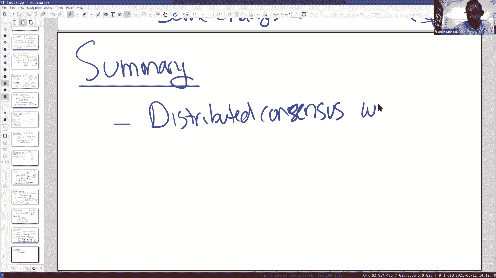

# 课程 P20：第19讲 - 点对点系统 - 比特币 🪙

在本节课中，我们将要学习比特币系统。比特币解决了一个分布式系统中的核心难题：在一个完全开放、参与者可以随意加入或离开、且可能存在恶意（拜占庭）节点的环境中，如何就交易发生的顺序达成共识。我们将重点关注其分布式系统层面的设计，特别是其共识协议。

## 概述

比特币系统旨在解决金融交易中的几个关键挑战：防止交易伪造、防止双重花费，并在一个去中心化的开放网络中达成共识。其核心思想是维护一个所有参与者都认可的公共交易账本（区块链），并通过“工作量证明”机制来决定谁有权向这个账本中添加新的交易记录。

## 核心挑战

在深入设计细节之前，我们首先需要理解比特币试图解决的几个核心问题。

### 1. 交易伪造
伪造交易是指恶意参与者凭空捏造交易记录，试图花费不属于自己的钱。这个问题可以通过密码学签名来解决，与SUNDR系统类似。我们假设基础的密码学是安全可靠的。

**核心概念**：每笔交易都需要由资金所有者的私钥进行签名。验证者使用对应的公钥来验证签名。
```python
# 简化的交易验证逻辑
is_signature_valid = verify_signature(transaction, public_key_of_sender)
```

### 2. 双重花费
双重花费是指一个用户试图将同一笔钱花费两次。这是比特币论文重点解决的问题。解决方案依赖于一个所有参与者都认可的、有序的公共交易日志。通过检查日志，可以确认一笔钱是否已经被花费过。

### 3. 密钥盗窃
虽然这是一个严重的安全问题（例如，私钥存储的电脑被黑客入侵），但本课程主要关注分布式系统层面的共识机制，因此不会深入讨论此问题。

## 交易的结构

为了理解共识如何工作，我们首先需要了解交易在账本中是如何记录的。

每一笔交易本质上是一条记录，它包含以下核心信息（进行了大量简化）：
*   **接收者公钥**：标识这笔钱的新所有者。
*   **上一笔交易的哈希值**：唯一标识这笔钱的来源（即它来自哪一笔之前的交易）。
*   **发送者的签名**：由资金的当前所有者（发送者）使用其私钥生成，以授权这笔转账。

**核心概念**：比特币并非一个具体的“币”，而是由交易链定义的。一枚“币”的本质是上一笔交易的哈希值。
```
交易 T7 结构示例：
- 接收者公钥: PubKey_Y
- 来源交易哈希: Hash(T6)
- 发送者签名: Sign(PrivateKey_X, 交易内容)
```
当用户Y想将钱花给用户Z时，会创建交易T8，其中包含PubKey_Z、Hash(T7)以及Y的签名。Z在交付商品（如一杯咖啡）前，可以验证T8中的哈希是否指向有效的T7，并使用T7中Y的公钥来验证T8的签名。

## 为何需要共识？—— 简单方案的缺陷

上一节我们介绍了交易的基本结构和验证方法。本节中我们来看看，如果仅仅有一个可被篡改的日志，会遇到什么问题，以及为什么需要复杂的共识机制。

### 方案一：可信中心服务器
假设存在一个所有客户端都信任的服务器S，由它来维护和排序所有交易日志。这很容易解决问题，但违背了去中心化的初衷，因为在开放的比特币网络中，无法让所有参与者都同意并信任某一个中心实体。

### 方案二：不可信服务器（SUNDR风格）
我们可以使用类似SUNDR的系统，让客户端维护日志，服务器只负责转发。但正如SUNDR所示，不可信的服务器可以通过“分叉”日志（展示给不同客户端不同的日志版本）来制造双重花费问题。
```
场景：
- 服务器向用户Z展示日志分支A: ... -> T7 -> T8 (Y付钱给Z)
- 服务器向用户Q展示日志分支B: ... -> T7 -> T8‘ (Y付钱给Q)
- Z和Q都检查自己的分支，发现T7尚未被花费，于是都接受了交易。
- 结果：Y成功双重花费。
```
### 方案三：去中心化节点网络（Raft风格）
用对等节点网络取代服务器，每个节点都维护日志副本。这类似于Raft等共识算法。然而，Raft依赖于一个封闭的、已知的节点集合来定义“多数派”。在比特币这种完全开放、节点可自由进出的系统中，我们无法确定谁是参与者，因此“多数派”的概念无法生效。

综上所述，我们需要一种能在开放、去中心化环境中达成共识的新机制。

## 比特币的解决方案：工作量证明与区块链

上一节我们分析了简单方案为何失效，本节中我们来看看比特币的核心创新：如何通过工作量证明（Proof-of-Work）和区块链来实现共识。

### 工作量证明的核心思想
规则很简单：只有完成大量计算工作的节点，才有权利将新的交易块追加到公共账本（区块链）上。这就像解决一个数学难题，需要付出真实的计算资源（时间和电力）。

**核心概念**：矿工（节点）必须找到一个随机数（Nonce），使得该区块数据的哈希值满足特定条件（例如，以足够多的零开头）。
```
条件：Hash(区块头 + Nonce) < 目标值
```
找到这样一个Nonce非常困难，需要大量尝试；但验证一个找到的Nonce是否正确却非常容易。这确保了“冒充”成功矿工极为困难。

### 从交易到区块
为了避免为每一笔交易都进行昂贵的工作量证明，交易被分组打包成“区块”。矿工的工作是为整个区块寻找有效的Nonce。

以下是区块内容的简化视图：
*   **前一个区块的哈希**：将区块串联成链的关键，确保了历史的不可篡改性。
*   **本区块包含的交易列表**
*   **Nonce**：用于满足工作量证明条件的随机数
*   **时间戳**

### 共识形成过程
以下是网络运作的基本流程：
1.  交易在网络中传播，被各个矿工节点接收并放入本地缓存池。
2.  矿工节点将未确认的交易打包成一个候选区块。
3.  矿工开始尝试不同的Nonce值，计算候选区块的哈希，直到找到满足难度条件的Nonce。
4.  第一个找到有效Nonce的矿工，将新区块广播给整个网络。
5.  其他节点收到新区块后，快速验证其工作量证明是否有效、其中的交易是否合法（如签名、无双重花费）。
6.  如果验证通过，节点就将这个新区块追加到本地区块链的末尾，并开始基于这个新区块挖掘下一个区块。

**网络同步与难度调整**：协议设计平均每10分钟产生一个新区块。网络会根据过去一段时间出块的平均速度，动态调整哈希难度目标，以维持这个出块速率。时间戳和确定性的调整算法确保了所有节点对难度的看法一致。

## 处理分叉与双重花费攻击

区块链可能会出现临时分叉，例如两个矿工几乎同时找到了有效的区块。比特币通过一个简单的规则来解决这个问题：节点总是选择并延长“累计工作量最大”的链（通常也是最长的链）。

### 双重花费攻击场景
假设攻击者Y想对Z和Q进行双重花费：
1.  Y同时向网络的不同部分广播两笔冲突的交易：T8（付给Z）和T8‘（付给Q）。
2.  诚实的矿工可能会将这两笔交易分别打包进两个不同的候选区块B1和B1‘，并各自进行挖矿。
3.  最终，其中一个区块（比如包含T8的B1）会先被加入到主链中。
4.  此时，包含T8‘的交易在另一条分支上。根据最长链规则，所有诚实节点都会切换到包含B1的链上，并抛弃B1‘分支。
5.  交易T8‘因此被作废。

### 安全等待确认
对于收款方（如Z）来说，仅仅看到交易被打包进一个区块（1次确认）还不够安全，因为攻击者可能秘密挖掘一条更长的链来替换它。因此，通常需要等待该交易后面又增加了若干个区块（例如6个确认，约1小时）。这使得攻击者想要成功重组链需要拥有超过全网50%的计算力，在诚实节点占多数的情况下极难实现。

## 激励与实际问题




### 矿工为何参与？
矿工投入大量算力是有经济激励的：
1.  **区块奖励**：成功挖出新区块的矿工，可以在区块中创建一笔“铸币交易”，将一定数量的新比特币奖励给自己（当前约6.25 BTC，每21万个区块减半）。
2.  **交易手续费**：区块中所有交易附带的手续费也归矿工所有。

### 其他实际问题
*   **矿池**：个体矿工通过加入矿池共享算力和收益，以获得更稳定的收入。
*   **能源消耗**：工作量证明机制因消耗大量能源而受到批评。
*   **协议升级**：比特币协议的更改需要社区共识。不兼容的升级会导致“硬分叉”，从而产生新的加密货币分支（如比特币现金）。
*   **性能**：约10分钟的出块时间和有限的区块大小，限制了比特币网络的交易吞吐量（每秒数笔）。

## 总结


本节课我们一起学习了比特币系统。它通过区块链和工作量证明机制，在一个开放、去中心化且可能存在拜占庭节点的对等网络中，成功解决了就交易顺序达成共识的难题。核心在于，它利用计算成本来制约恶意行为，并通过最长链规则来收敛状态，从而实现了无需信任任何单一实体的安全电子现金系统。尽管存在能源消耗和性能扩展等挑战，比特币在分布式系统共识领域无疑是一个标志性的成功实践。