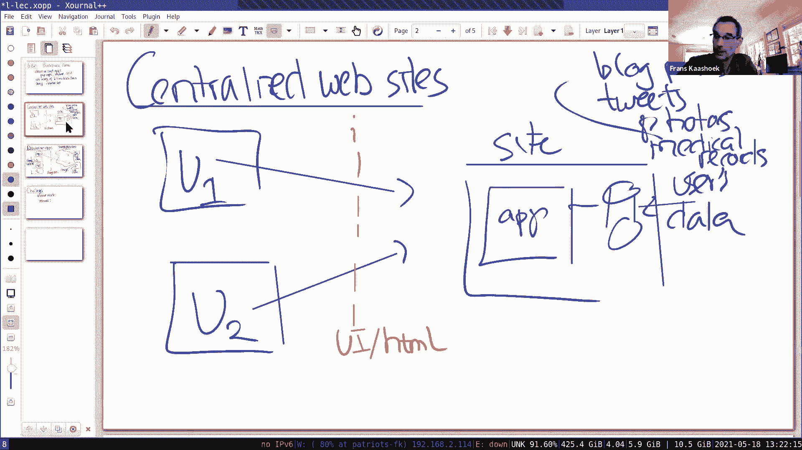
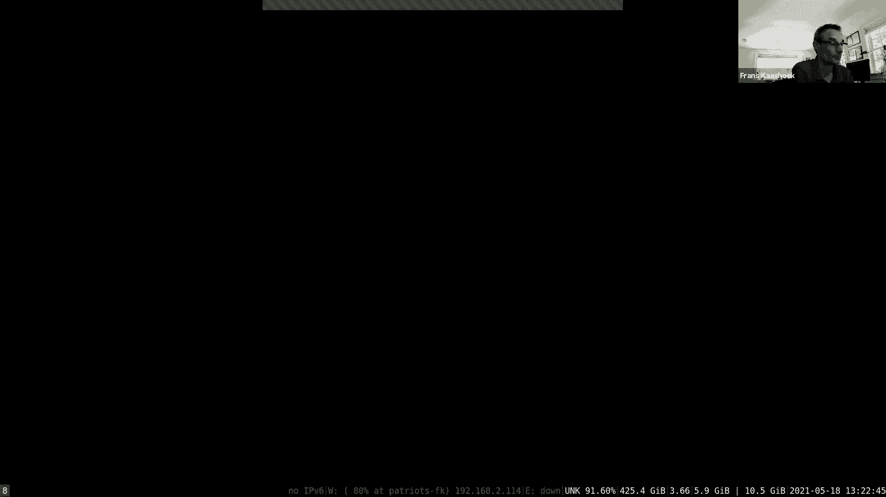
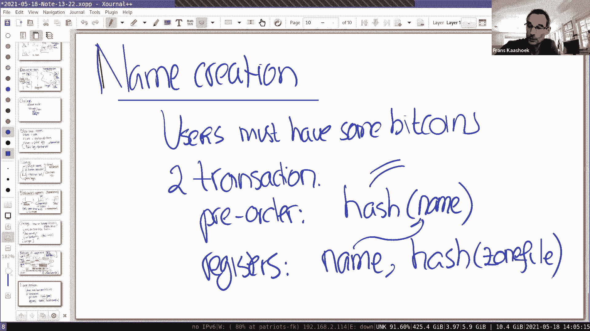
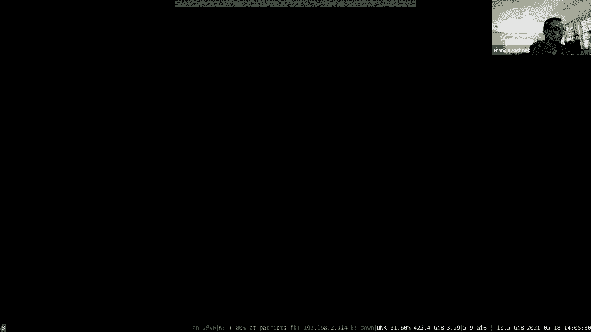
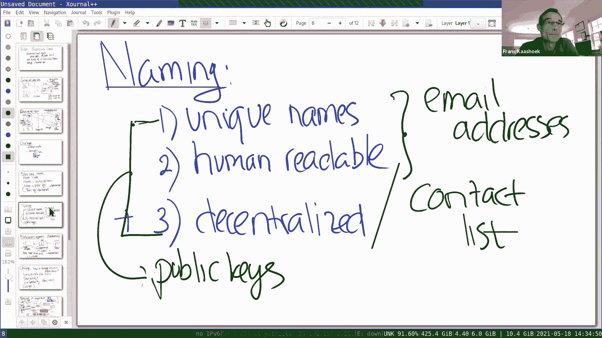

# 📚 课程 P21：第 20 讲 - Blockstack

在本节课中，我们将要学习一种构建去中心化应用程序的方法——Blockstack。我们将探讨其核心设计思想，特别是它如何利用区块链技术来解决去中心化系统中的命名挑战。与传统的中心化应用不同，去中心化应用旨在让用户控制自己的数据，而非由某个中心化网站掌控。

---

## 🎯 概述：中心化 vs. 去中心化应用

在深入Blockstack之前，我们先回顾一下构建网络应用的常见范式。典型的中心化网站（如Gmail、Twitter）运行自己的应用程序代码，并控制着存储所有用户数据的数据库。用户通过浏览器与网站交互，但数据的呈现、访问规则和所有权完全由网站控制。

上一节我们介绍了中心化应用的模式，本节中我们来看看另一种设计思路：去中心化应用。在这种模式下，应用程序代码在用户自己的设备上运行，而数据则存储在用户选择的存储提供商（如Google Drive、Amazon S3）处。用户控制着自己的数据，包括谁能访问以及使用哪个应用程序来处理数据。

---





## 🔑 去中心化应用的核心挑战与命名问题

构建去中心化应用面临一系列独特的技术挑战。其中最关键的一个是**命名**。命名系统在去中心化架构中扮演着至关重要的角色：
1.  **标识用户**：需要将可读的名字映射到特定用户。
2.  **定位数据**：需要将名字映射到用户数据存储的位置。
3.  **验证身份**：需要将名字映射到公钥，以验证数据的真实性和完整性。

一个理想的命名系统需要同时满足三个属性：**唯一性**、**人类可读性**和**去中心化**。然而，传统系统往往只能满足其中两个：
*   **电子邮件地址**：唯一且人类可读，但非去中心化。
*   **随机公钥**：唯一且去中心化，但非人类可读。
*   **个人通讯录中的名字**：人类可读且去中心化，但非全局唯一。

Blockstack（借鉴自Namecoin）的创新之处在于，它利用区块链技术，首次实现了同时满足这三个属性的去中心化命名系统。

---

## ⛓️ Blockstack 的架构：利用区块链实现命名

Blockstack 的核心思想是利用现有的区块链（如比特币）作为不可篡改的日志，来记录全局唯一的名称绑定。其架构分为多层，旨在最小化对区块链的直接写入，以解决区块链吞吐量低、写入速度慢的问题。

以下是 Blockstack 架构的关键组成部分：


### 1. 区块链层（底层）
这是基础，例如比特币区块链。Blockstack 将特殊的命名交易记录在区块链的 `OP_RETURN` 字段中。每条记录包含一个名称（如 `6.824`）和该名称对应的**区域文件（zonefile）的哈希值**。区块链提供了去中心化的共识，确保了名称注册的先后顺序（先到先得）和不可篡改性。

### 2. 虚拟链层（Blockstack 节点）
Blockstack 节点读取区块链中的所有交易，但只筛选并解释那些与命名相关的交易。它们维护一个数据库，建立从**名称**到**区域文件哈希值**的映射。这个数据库构成了去中心化的命名系统状态。

### 3. 区域文件（Zonefile）
区域文件是一个小型的、由名称所有者控制的文件，其哈希值被记录在区块链上。它包含了更具体的映射信息，例如：
*   **可变存储**：包含数据存储的 URI 和用于验证签名的公钥。
    ```json
    {
      “todo_app_uri”: “https://storage.example.com/u1/todo.json”,
      “public_key”: “0xabc123...”
    }
    ```
*   **不可变存储**：除了 URI 和公钥，还包含文件内容本身的哈希值，用于确保特定版本的数据完整性。

由于区域文件很小，可以被广泛复制和缓存。应用程序通过其哈希值来检索和验证区域文件。

### 4. 存储层
这是实际存储用户应用数据（如待办事项列表、推文）的地方。数据可以存储在多个提供商（如 S3, Google Drive）以实现冗余。Blockstack 文件系统提供了一个统一 API 来访问这些不同的存储后端。

---

## 🛡️ 工作原理示例：协作待办事项列表

假设用户 U1 和 U2 想用一个去中心化的待办事项应用协作。

1.  **名称发现**：U1 和 U2 需要先安全地获知对方的 Blockstack 名称（例如 `alice.id` 和 `bob.id`）。
2.  **解析名称**：
    *   U1 的应用查询名称 `bob.id`。
    *   Blockstack 节点在数据库中查找 `bob.id`，返回其区域文件的哈希值。
    *   应用通过路由层获取该哈希值对应的区域文件，并验证哈希值是否匹配。
3.  **定位与验证数据**：
    *   在 `bob.id` 的区域文件中，找到待办事项应用对应的 URI 和 Bob 的公钥。
    *   应用从该 URI 获取 Bob 的待办事项列表文件。
    *   使用 Bob 的公钥验证文件上的数字签名，确保数据确实来自 Bob。
4.  **数据整合**：U1 的应用将验证后的 Bob 的待办事项与自己本地的列表整合，呈现给 U1。
5.  **更新数据**：当 Bob 更新自己的待办事项时，他只需用私钥签名新文件，并上传到其区域文件指定的 URI。U1 的应用可以定期拉取并验证更新。

通过这种方式，实现了无需中心服务器的协作。然而，与中心化数据库简单的 SQL 查询相比，这种去中心化整合机制更为复杂。

---





## ⚙️ 技术细节与挑战

### 防止抢注
为了应对“抢注攻击”（即攻击者看到你广播的注册交易后，试图抢先注册同一名称），Blockstack 采用了两阶段提交：
1.  **预购交易**：将名称的哈希值（而非明文）提交到区块链。
2.  **注册交易**：等待预购交易被确认后，再提交包含明文名称和区域文件哈希的交易。

### 数据新鲜度与访问控制
*   **可变 vs 不可变**：可变存储适合频繁更新的数据，但应用程序需要自行处理版本控制以确保获得最新数据。不可变存储通过包含数据哈希来保证特定版本，但每次更新都需要创建新的区块链记录（成本高、速度慢）。
*   **访问控制**：可以通过加密来实现。例如，用目标用户的公钥加密数据，或加密一个共享密钥，然后将该密钥用各用户的公钥分别加密（即“密钥盒”模式）。

### 可扩展性与依赖
*   Blockstack 的设计最小化了对区块链的写入（仅名称注册和区域文件哈希更新），将大量数据操作转移到了链下，缓解了区块链的吞吐量瓶颈。
*   其架构不严格依赖特定区块链，可以从比特币切换到其他共识机制更高效的链。

---

## 💭 讨论与思考

Blockstack 展示了一种实现去中心化应用和命名系统的有趣路径，但它并非终极解决方案，也引发了许多开放性问题：

*   **开发复杂性**：与中心化应用相比，去中心化应用的逻辑更分散，集成不同用户的数据更困难。
*   **用户体验**：密钥管理、数据备份、寻找应用和用户名称对普通用户门槛较高。
*   **性能与规模**：虽然数据存储被划分，但大规模应用下的数据发现、同步和一致性仍是挑战。
*   **商业模式**：如何激励开发者开发高质量的去中心化应用，是一个尚未完全解决的问题。
*   **竞争方案**：与其他去中心化身份/数据方案（如 Keybase、Solid）相比，Blockstack 提供的**全局唯一、人类可读名称**是其特色，但这是否是必需属性，取决于具体应用场景。

---

## 📝 总结

本节课我们一起学习了 Blockstack，一个旨在构建去中心化应用程序的架构。我们重点探讨了：

1.  **核心目标**：将数据控制权归还用户，实现应用与数据分离。
2.  **关键挑战**：命名是去中心化系统的基石，需要同时满足唯一性、人类可读和去中心化。
3.  **解决方案**：Blockstack 利用区块链作为不可篡改的日志来记录名称绑定，并通过分层架构（区块链 -> 虚拟链 -> 区域文件 -> 存储）来平衡去中心化信任与系统性能。
4.  **工作流程**：通过名称解析、区域文件查找、数据获取与验证的步骤，实现了用户间的安全数据共享与协作。
5.  **现存问题**：该设计在易用性、开发模式、可扩展性等方面仍面临挑战，是更广泛的去中心化应用探索中的一次实践。



Blockstack 更像是一个引发思考的案例，它展示了去中心化设计的可能性与复杂性，而非一个已获验证的完美答案。去中心化应用的未来形态，仍在探索之中。