# 课程 P22：第21讲 - 项目展示 🎤

在本节课中，我们将学习多个分布式系统项目的核心设计与实现。这些项目涵盖了电子投票、隐私数据分析、协同编辑、匿名广播、容错文件系统、形式化验证等多个领域，展示了分布式系统原理的实际应用。

## 分布式私有电子投票系统 🗳️

大家好，我是Felipe，我和Caralina一起工作。今天我们将介绍我们的分布式私有电子投票项目。

这个项目的动机很简单。考虑到当前的事件和选举必须在保密限制下进行，我们提出了一个问题：投票将如何运作？我们特别关注维护选民隐私，即让投票保密。

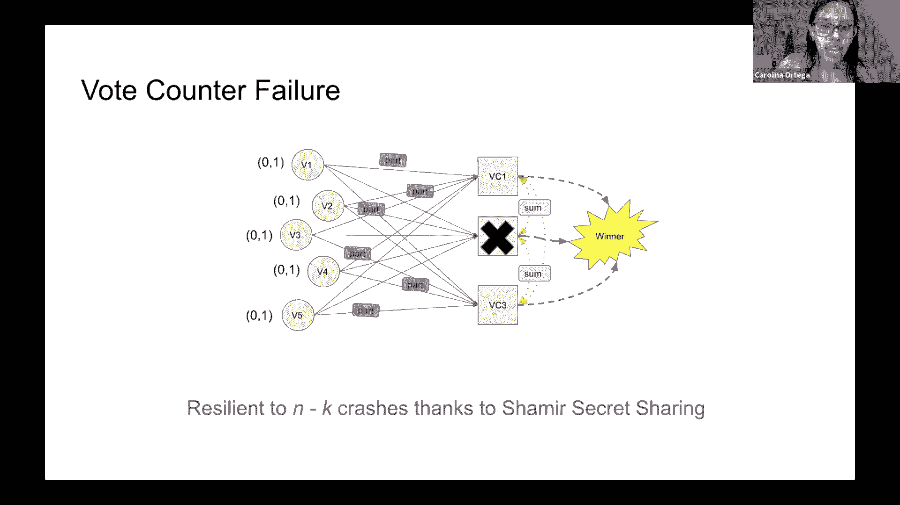

以下是投票系统的工作原理。你有一些选民，例如五个，然后是一个计票器。选民将他们的选票发送给计票器，可能会加密发送或采取某种安全措施。计票器解密选票，确保每个选民最多投票一次，并计算出获胜者。

这里的关键是，为了使计票器确定每个选民最多投一次票，每一张选票都必须以某种方式与选民身份关联，这很危险。

接下来，我们将解释我们的威胁模型。我们赋予攻击者两种能力。

第一种是制造崩溃停止故障，但不是拜占庭式故障。这意味着攻击者可以使服务器崩溃，但不能使其行为异常。这是一个合理的假设，但我们认为还有其他协议可以处理拜占庭式故障，我们在此不处理。

第二种能力是监视计票器。这是一个问题，因为正如我们所说，选票与选民身份相关联。因此，一个对服务器进行间谍活动的被动攻击者可以在某种程度上取消这些投票的匿名性。

这就是我们的用武之地。我们将展示我们的分布式投票设计，以处理第一个问题，即对手使服务器崩溃。我们将使用多个投票器。

我们的想法是，每个投票者将选票发送给所有的投票器。计票器将使用与之前相同的协议来计算获胜者。这样，即使有n-1个计票器崩溃，只要其中一个还在运行，我们就能够计算出获胜者。

然而，这对于第二种类型的被动攻击来说非常不安全。因为攻击者可以危害一台服务器，从而取消投票的匿名性。

为了解决这个问题，我们将介绍Shamir秘密共享。对于Shamir秘密共享，投票者选择一个投票（0或1）。我们不会详细解释Shamir的工作原理，它是一种加密协议，但我们将展示它允许我们做什么。

你通过Shamir传递投票，给它两个参数n和k，它将产生n个份额，允许你重新计算选票。这n个份额可以是完全随机的。最强大的是，即使有k-1个份额，你也不会获得任何关于原始投票的信息。但如果有k个或更多的份额，你可以使用Shamir重新计算那个选票。

现在，我们将展示Shamir投票方案。

首先，所有选民选择他们的选票，并将份额分享给不同的计票器。两个计票器都将接收份额。当它们获得所有选民的份额时，将这些份额相加，并将总和分享给计票器。

这里需要注意的是，这个总和看起来完全是随机的。因此，通过与其他两个计票器共享，它们无法了解任何关于收到的份额的信息。这保证了选民的隐私得到维护。

当计票器收到来自其他选民的总和（包括他们自己的份额）时，它们最终可以计算出获胜者。再次使用Shamir秘密共享，它会重新计算总和。如果我们得到的选票超过选民总数的一半，那么获胜者就是1；如果小于，则获胜者是0。最终，我们得到了获胜者。

我们方案的一些假设是：首先，选民和计票器都表现良好，并遵循协议，或者它们的份额是善意的。我们使用这个方案只处理故障停止故障。

现在，我们来处理一些情况。

首先，如果我们有一个不可靠的网络，我们在服务器中发送的所有RPC都将定期发送，直到我们收到它已被接收的确认。

其次，为了处理选民故障，我们需要持久化所有选民的信息，例如持久化他们计算的份额和他们的投票。因为如果我们重新计算份额，然后计票器有不同的份额，那么方案的正确性就会消失，它们将不能修正总和。因此，始终共享来自同一计算的份额而不修改份额非常重要。

最后，为了处理计票器故障，我们依赖于Shamir秘密共享方案。正如我们之前提到的，我们只需要k个服务器来计算获胜者。因此，系统可以容忍n-k个计票器崩溃。

现在是演示时间。我将停止共享屏幕，并共享另一个屏幕。这是我们的演示。我们这里有5名选民，3个投票器，k等于2，这意味着网络是不可靠的。

如果我们运行它，我们得到的获胜者是1。我们也可以让其中一台服务器崩溃，因为k等于2，我们仍然可以通过只有两台服务器运行来计算获胜者。现在如果我们运行它，我们得到的选举获胜者还是1。我们的展示到此结束。

非常感谢你的收听，我们将回答一些问题。

**问：** 你测试这个系统的范围有多广？比如，你有没有尝试过不同的其他配置？你们有性能数字吗？

**答：** 我们确实有不同大小的测试。我们创建了一整套测试套件，确保测试投票者故障、服务器故障，以及不同的大小。我们没有性能数据，我们没有测试过，但就失败而言，以及不同数量的投票者、投票器，我们有一套完整的测试套件。我们可以把链接放到GitHub上，或者发给你，你可以在测试中查看实现。

**问：** 你能说说6.824的想法吗？你在这个系统里应用的，而不是使用测试框架。

**答：** 这个想法来自密码学课上的披萨。从不同的角度来看它是很有趣的。现在我们关注安全问题，我需要考虑如果个别的服务器会发生什么，无论是处理投票者故障、处理投票器故障，还是网络问题。我们没有解决分区问题，因为它的工作原理类似于投票器。从不同的角度来看待这个问题是很有趣的。

---

## 隐私数据分析系统 📊

大家好，我是Kevin。今天我将介绍这个非常有创意的命名为Sys的系统。这是一种以保护隐私的方式收集汇总统计数据的系统。

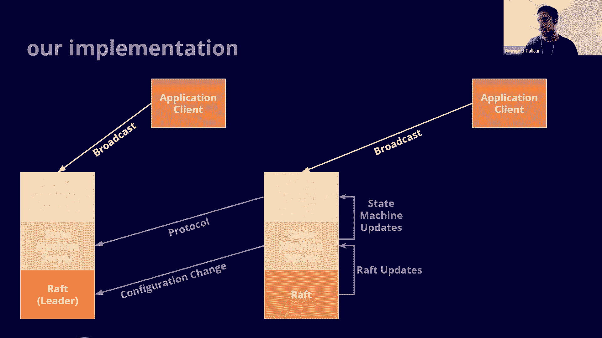

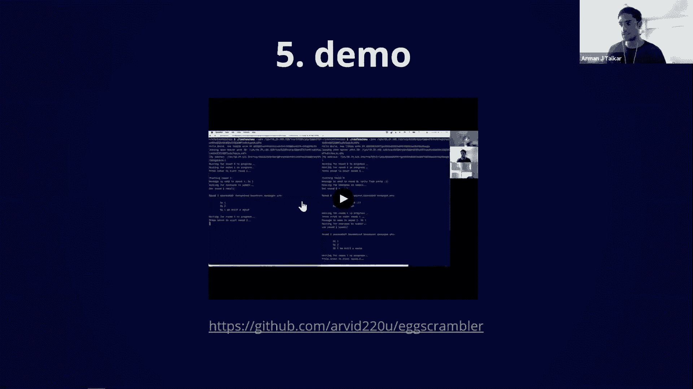

上一个演示很好地引导了我的项目。在6.824的大部分时间里，我们已经讨论了如何在拜占庭或故障的情况下建立可靠的系统。服务器可能会崩溃，客户端通常都表现得很好。但从这次演讲来看，我希望你能学到一些新概念，关于我们如何在出现拜占庭式故障的情况下建立具有强大保障的系统，代表系统内的客户端和服务器。

我们要使用的主要工具是实现这些保证的加密原语，例如多方计算和零知识证明，以及广播之类的分布式计算原语。

为了简单起见，假设我们想建立一个计算和的系统。我们将拥有一个聚合服务器，存储键值存储。键将成为某些统计数据的索引，值将是和的元组。我们会有一堆客户端，每个客户端都会有一些身份（如它的客户端IP地址），它会有他们想要增加的统计数据的索引，而且它也将有它的私有输入。

最直接的做法是让所有客户端按原样将其输入发送到服务器，它们可以计算和。但显然这很糟糕，因为服务器将获知客户端的身份、发出的索引和私有输入。

我们可以做得更好一点，我们可以私下计算这些和。如果我们部署到非合谋服务器，那么每个客户端将秘密地将它们的输入共享到每个服务器。正如我们在上一次演示中所说的，每个服务器、每个签名本身都不会泄露有关客户端私有输入的信息。但服务器仍然可以将这些份额相加，并计算出一个键值存储的本地版本。然后稍后当服务器想要恢复实际和时，它们可以合并它们本地的键值存储，重建全局键值存储。

这样好了一点。至少如果这些服务器中有一个是诚实的，那么服务器仍然会获知客户的身份和索引，但现在不是获得每个客户端的输入，它们将获得所有客户端的和。这样好多了，但这仍然是个问题，即身份索引关系仍然可以泄露大量信息。

那么我们如何才能解决这个问题？我们可以让事情匿名。我们仍将调整设置，现在我们给每台服务器提供一个公钥用于加密，并且每个客户端都将对其每个份额进行加密。并且不是让客户端将它们的份额直接发送到服务器，现在，我们将在两者之间设置一层转发代理。

接下来会发生的是，客户端将通过广播将其加密的共享发送到这些代理，并且代理将每个共享发送到它们各自的服务器。然后聚合可以像解释的那样进行。

这里的隐私保障是什么？如果这些代理中至少有一个是诚实的，代理仍将获知客户端的身份，它会获得一些计时信息（基于客户端何时设置共享），但没别的了，因为共享被加密到服务器。如果这些服务器中至少有一个是诚实的，服务器也会获得一些计时信息（基于代理转发它的时间），它还会获得统计的指标和和。最重要的是，只要代理和服务器不是同时受到危害，这个设计将身份与被导出的索引解除链接，这正是我们想要的。

但这导致了另一个问题：现在客户端可以躲在隐私和匿名保证后面发送错误的输入。假设系统预期客户端输入为0和1，在这种隐私的后面，客户端可以通过系统发送10亿的签名，从而在无法察觉的情况下扭曲这个和。这很糟糕。

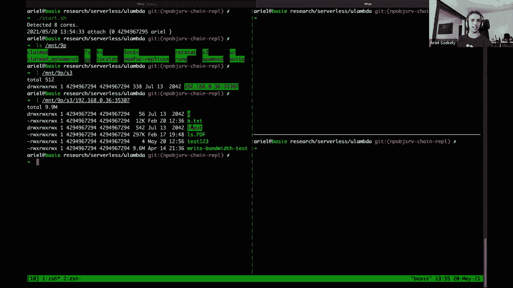

我们来解决这件事。我们想让这个系统更强大。我们要做的是让每个客户生成对它们分享的零知识证明，并将这些发送到服务器。服务器收集这些零知识证明，它们可以交互地检查客户端的输入实际上共享重建为一些格式良好的输入。因为这个证明是零知识的，它没有留下任何关于输入的内容，除了它是格式良好的。所以我们的隐私属性又一次保持不变。代理仍会获得客户端的身份和定时信息；服务器获知定时信息、索引和和。但现在我们已经保护系统不受恶意客户端的攻击，因为它只接受格式良好的输入。

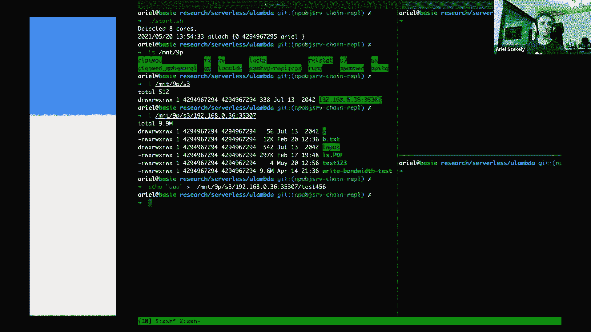

这很棒。还有另一个问题：服务器可能会崩溃，我们可能会丢失数据。我们显然需要两台服务器都在线，以便重建全局键值存储。如果我们想让系统更可靠，我们可以做我们最了解的事情，即复制服务器。我们可以使用Raft风格的复制，或者主备份式复制。

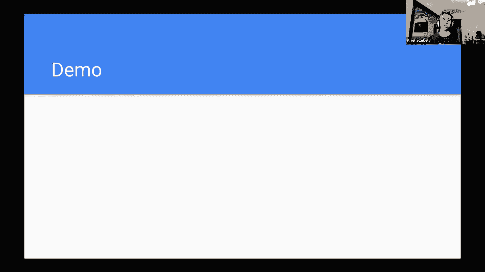

现在的问题是：所有这些复制和加密机制，在这条消息路由上，我们还能实现很好的吞吐量吗？事实证明，我们可以在这里并行服务器步骤，提供证明验证，这很可能是系统的瓶颈。接下来会发生的是，代理要对分区进行哈希，它们对每台服务器的输入，然后这些服务器中的每一个都处于reduce步骤中，将合并它们的中间键值存储，以重建包含所有和的全局键值存储。

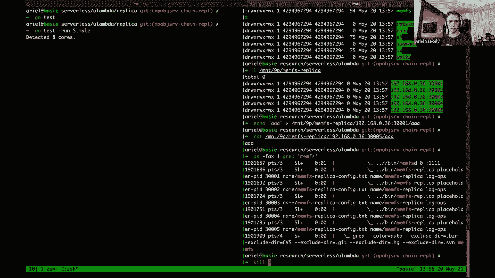

最后一个问题是：我是不是在到期日之前实现了这个？很遗憾，没有，但我确实走了很远的路。我将展示一个简单的演示，它的非复制、非并行版本。

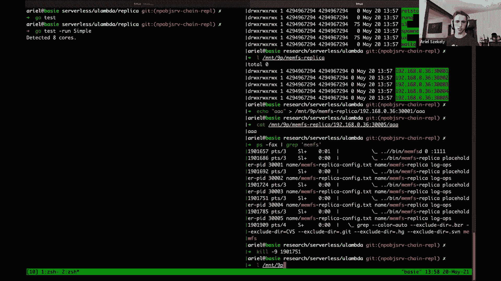

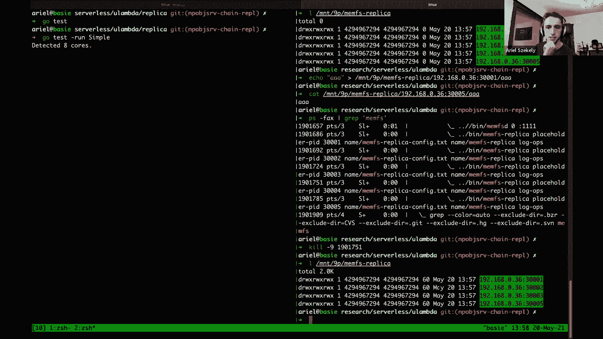

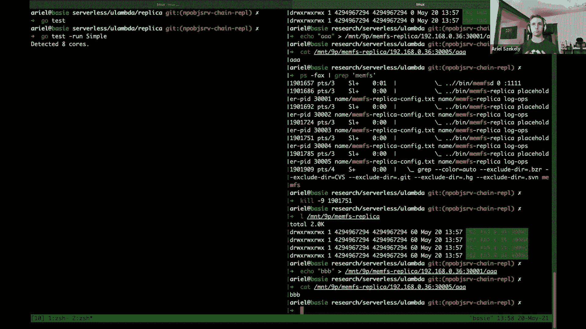

我将快速切换到我的另一台笔记本电脑。在这两个右侧的终端上将安装服务器，所以我要运行它们（它是用Rust实现的）。现在我要把中间的这两个代理连接起来，然后在左边的终端，我只想模拟一千个诚实的客户端。

现在的情况是，所有的客户端都在生成它们的输入共享，以及生成零知识证明，并通过代理发送它们，而代理只是将它们转发到服务器。最后，在服务器端，它们会检查所有的证明，如果这些输入是格式良好的，它将把它添加到本地键值存储中。然后在一段时间之后，当服务器想要重建最终统计数据时，它们只需结合它们的键值存储来恢复和。

我的演讲到此结束，我很乐意回答任何问题。

**问：** 你到目前为止实现的那样，比如什么你会接受，什么容错？

**答：** 现在实现的可靠性不是很高，主要是因为服务器没有被复制。对于代理来说，因为客户广播代理，你所需要的就是其中一个代理启动。如果我们有两个代理，我们可以容忍一个代理失败，我们仍然会获得到服务器的消息。但如果任何一台服务器出现故障，那么你就不能根据这些数据进行重建了。

**问：** 这只是对于和吗？或者，你是否实现了对所有这些输入进行操作的任何通用函数？

**答：** 目前，我只实现了和。但使用这种相加的秘密共享方案，你可以计算任何你想要的线性函数。也许更复杂的问题是可能的，但我还没有探索过这些。至少在实践中，和可能会达到90%的水平。

**问：** 你的性能数据是什么样子的？

**答：** 我们想要衡量的主要事情是客户端计算和客户端带宽。对于客户端计算，这些共享和证明只需不到几毫秒，所以它非常轻，带宽只有几千字节。对于服务器端的吞吐量，我是在使用EC2，但我只给每台服务器分配了四个核心。在四个核心上，可能每秒有一千个查询。如果每台机器并行20台服务器，它们可能每秒可以实现近22000次查询。但这些都是在同一个数据中心运行的，所以实际数字可能会比这个数字低一点。

**问：** 你如何实现零知识证明代码？

**答：** 我可以把我实现的论文发送给你。这并不太复杂，基本上，它只是一堆有限域运算。只要按照论文，遵循步骤，从这一点上来说，这是非常简单的。

**问：** 有没有可能测试它？你怎么知道它起作用了还是没有起作用？

**答：** 我只展示了诚实的客户端模拟，但是你也可以生成与提交错误证据的客户的模拟，然后你可以看到它们被拒绝了。

---

## 分布式协同编辑器 BukaDocs ✍️

大家好，我是Shannen和Nik Johan。我们将谈论BukaDocs。BukaDocs是一个分布式协同编辑器，它类似于Google Docs，只是稍微好一点。

在分布式系统中实现一致性是非常困难的。一致性可能会在很多方面出错。一个非常简单的例子是，如果你在每个节点中收到RPC的顺序不同，你可能会得到一个不一致的状态。还有一种叫做CRDT的数据结构，我们在我们的系统中使用它来缓解这个问题。CRDT实现最终一致性，通过对文档进行每一次操作全局唯一的，不仅对每个节点唯一，而是全局唯一的。所以如果我在编辑器输入字母a，不同于Shannen或Nik在他们的编辑器输入字母a。

例如，这里将一个新的海龟添加到文档中，即使它们接收到来自其他两个节点的移除请求，它们永远不会移走金海龟，因为这个操作本身不同于删除。所以移除绿海龟和移除金海龟是不同的。这就是我们实现最终一致性的方式。

对于BukaDocs，我们选择了一种名为LSEQ的CRDT，表示具有可变长度密钥的元素序列。我们的目标是，假设我们想要一个表示字母表的序列，到目前为止，我们有字母a和c。一位编辑者可能会选择尝试在它们之间添加字母b，而另一编辑者可以选择尝试在c之后添加字母d。目标是最终的一致性，最终会到达状态a b c d。

LSEQ实现这一点的方式是通过使用开始和结束token，然后它给文档中的每个字符一个单独的token在START和END之间。所以我们可以在START和END之间插入h。如果我们想要i在h之后，我们可以把它插入到7，在4和8之间。现在，如果我们想在i和文档末尾之间插入一个感叹号，我们可以把它插入到键7,2，因此我们增加键到2，在相邻两个其他键之间创建键。通过这种方式，我们始终可以在任何两个其他键之间创建一个键，所以我们可以随时插入。

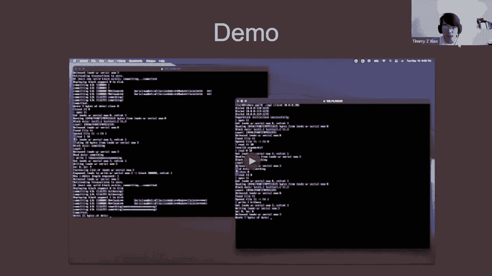

LSEQ很好地形成了，它以很少的协调努力达到了最终的一致性，它还进行了一些优化，导致键的长度增长很慢。然而，一些缺点是，为了支持删除这些元素，它依赖于因果交付和恰好一次交付。我们并不想实现这个，因为它是给予其他一些工作的。所以我们使用一种稍微简单一些的方法，也就是删除集。这是一个仅增长的集合，我们在其中添加元素。例如删除字母h和i，我们会把4 7添加到这个删除集中。然后，整个状态相当于只需要START和END token，感叹号在键7,2。

我们建立了Buka Docs服务，类似于我们实现kv Raft的方式。我们有多个服务器和多个客户端。客户端一次只与一台服务器通信，它们不断尝试操作，直到从服务器获得成功回复。客户端和服务器都维护文档中的字符的AVL树，以及我们自己删除的删除键集合。我们选择将字符存储在AVL树中是出于性能原因。

事件的链条大概是这样的：客户端将向服务器发送插入和删除，服务器将更新其自己的AVL树和删除集，并持久化保存对于所有其他服务器和客户端的更新，然后服务器会向客户端响应成功。

我们要演示一下。我们在这里为它构建了一个非常简单的用户界面。Johan和Nik现在也在从不同的客户访问这个。你可以看到他们的输入，你可以输入其他内容，我在这里输入，我想Johan是在输入hi，Nik在输入一些东西，我们还可以编辑彼此的文本。这就是Buka Docs。

我们很乐意回答任何问题。

**问：** 我很喜欢海龟的主题，你们想出了这个，我只是想知道海龟的主题是从哪里来的？

**答：** 海龟是Nik Johan和我通过网络讨论课程，海龟是我们课程的吉祥物。我们受到启发，构建Buka Docs，因为我们使用的Google Docs是一个问题文档，针对学生提问，它无法同时处理超过75个用户的输入，Buka Docs就是这样诞生的。

**问：** 为了确保我理解正确，这些数据结构非常有趣，它们存储在客户端或服务器上？如果它们被存储了，我想现在服务器没有复制，但这是你可以很容易做到的事情。但如果它们存储在客户端上，如果其中一个客户端出现故障会发生什么情况？

**答：** 数据结构存储在所有客户端和所有服务器上。我们假设客户端是完全值得信任的。如果客户端出现故障，它们没有发送到服务器的任何编辑会一直在它们那边，在它们重新上线之前，在这种情况下，它们可以发送，它将实现最终的一致性。

**问：** 为什么LSEQ胜过其他CRDT？

**答：** 我们选择LSEQ主要是因为这是我们最先发现的，我们想要开始。因为在实现可变长度键的逻辑之后，没有太多我们需要做的，以确保客户端和服务器保持一致。除此之外，它就像是消息传递，并确保每个人都收到了所有的信息。

**问：** 在这个示例中，你运行了多少台服务器，是只有一个还是多个？

**答：** 有三台服务器和三台客户端。每个客户端都连接到自己已知的服务器。

**问：** 你使用服务器用于扩展或容错，还是两者都有？

**答：** 两者都有。当我们运行性能指标时，通过将客户端请求的负载分布在多个服务器上，你可以处理稍微多一点的带宽请求。然而，这是一种权衡，因为最终一致性将需要更多的时间，因为服务器将必须发送RPC到每一台其他服务器。在我们的论文上，我们有一个完整的图表。

**问：** 它的规模有多大，随着你添加更多的服务器？

**答：** 它能够处理，如果我们将其分配给五个客户端和五个服务器上的3000个请求，它在三秒内实现了最终一致性，但这主要是因为它在计算机上，在本地主机上，RPC速度非常快。然而，这也意味着所有的计算机都在一台机器上运行。当我们把它放在真正的硬件上时，是两种方式。还有一件事是，如果你一次提出太多请求，最终一致性很难实现。例如，我们试图一次进行19000次编辑，通过100个客户端和5台服务器，它花了大约32秒才达到最终一致性。然而，如果我们只在100个客户端和5个服务器上进行3000次编辑，这只花了大约三秒钟。

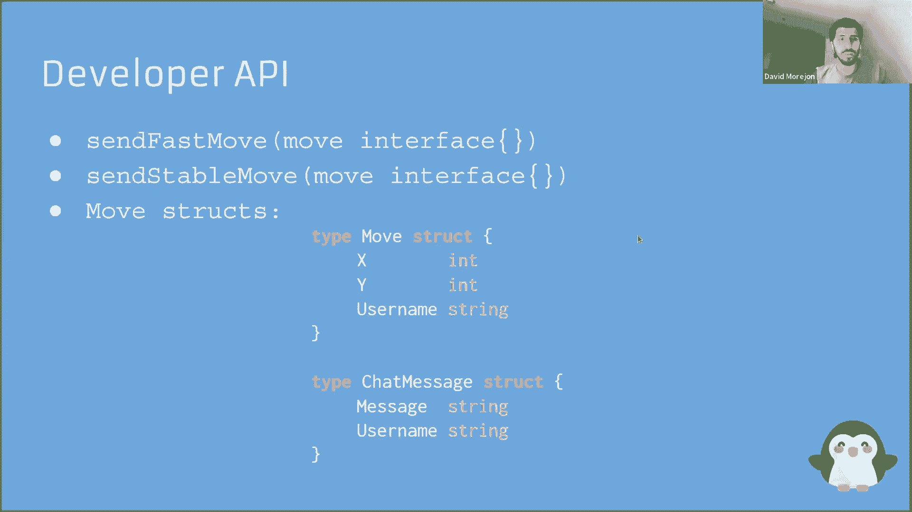

**问：** 当你说你做了19000或其他的事，就是一次发送所有这些信息，或者它是随着时间的推移而扩散的？

**答：** 每一个单独发送，每个编辑并行发送，至少在测试时。

**问：** 其中一个激励因素像Google Docs这样的协作文本编辑器，不能支持大规模更新和并发更新，所以你认为他们为什么不采用你们所提议的方法？

**答：** 我认为Google Docs使用了一种类似的方法，称为操作转换。我不确定它是否也可以并行。他们可能不想这么做，因为他们不想提供那么多的服务器能力，这可能只是为了成本效益。我不认为上百个人编辑一个文档的情况出现得很频繁，至少在Google Docs的使用中，所以可能不想