# P3：Lecture 3 - GFS - mayf09 - BV16f4y1z7kn

又起作用了。好的，今天的计划是关于 GFS ，我会分多个步骤来做。首先，我会从总体上谈一下存储，为什么它如此重要，以及为什么我们花很多时间，在这堂课上讨论它。然后我将讨论一下，从 GFS 的角度。

以及它的主要设计，我们重点关注一致性，它是这堂课的主要主题，作为一致性的一部分，我们很可能这样，希望还有时间进入分组会议室，在分组会议室讨论一下课程，或者课程贴出的问题，我们将继续讨论一致性的问题。

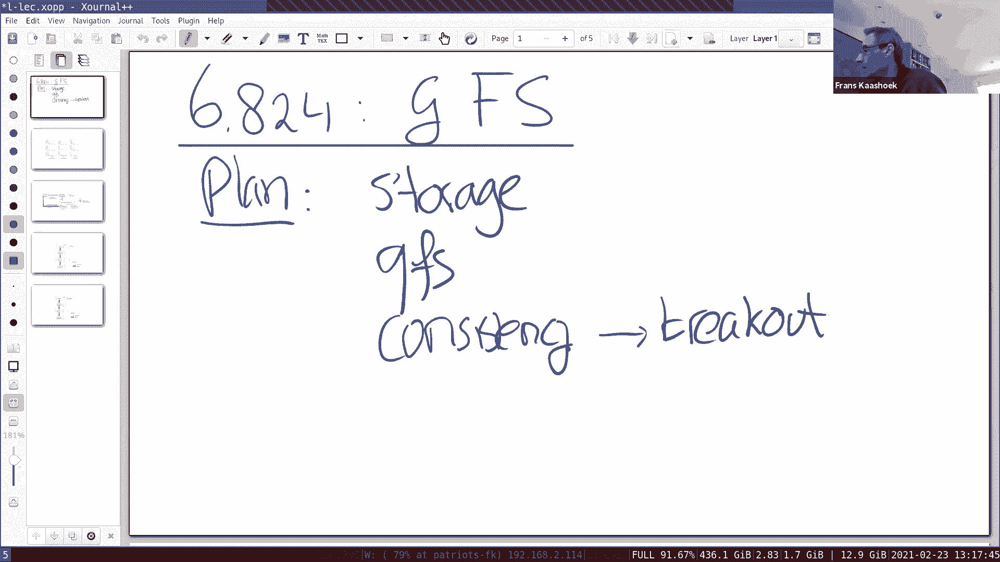

好的，所以，让我来总体上地讨论一下存储系统，以及为什么它们在 6。824 中占据重要地位，主要原因是，它是一个神奇的构建组件，用于容错系统。所以基本的想法是，如果你能建立一个持久的存储系统。

然后你可以构建你的应用程序，应用程序无状态的，然后存储保存所有的持久状态。这极大地简化了应用程序的设计，因为应用程序没有任何持久的存储空间，它必须保持自己，事实上，这些都在存储系统，所以。

你可以非常快速地启动新的应用程序，它崩溃并不重要，因为它只有软状态，没有任何硬状态，然后再重新启动，当你重新启动时，你就从分布式存储系统进入状态。你可以在任何网站上看到这个，基本上就是这样构建的。

有一个存储后端，用来保持状态，然后是应用程序，参与应用程序计算的中间层，或者运行 Javascript Go 的程序，它的前端在，在互联网上的客户端。所以，存储像一个神奇的构建组件，我想这是一个原因。

为什么我们会在这节课上反复看到这个。这意味着存储系统本身，当然必须具有高度的容错性，这是一件非常棘手的事情，这就是另一个方面，另一方面，它使应用程序的生命周期变得简单。

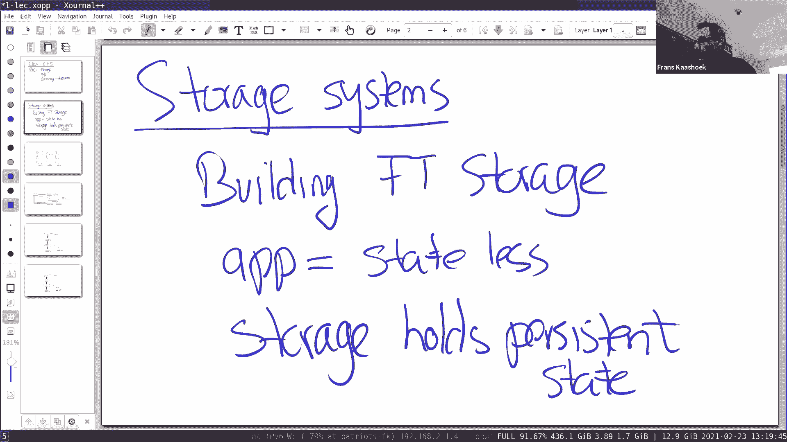

但是设计容错存储系统并不容易。那么为什么这么难，可以归结为一个原因，驱动这些设计，我们通常希望获得高性能，当你考虑今天的存储系统，GFS 的主要目标是，支持 mapreduce 类型的应用程序，所以。

它需要高性能。好的，那是什么意思，这意味着你必须跨服务器对数据分片，所以你不能使用一台服务器，你必须使用多台服务器，你想要从磁盘中读取的原因，通常特定的机器具有有限的吞吐量，如果你想读取更多。

超过一个磁盘的容量，你必须使用多个磁盘，你必须使用多个网卡，你可以立即进入这种大规模系统，在 GFS 中，有数千台机器。但是如果你有多台服务器，有些会失败，你会遭遇失败，或者你可能。

你会看到更多专有的不断的故障，假设电脑崩溃，一年一次，现在假设你有数千台机器，就像在 GFS 的论文中，比上千台机器更多，最少一千台机器，粗略地说，每天会看到多少次失败。大概 3 次。是的。

大约 3 次，这意味着计算机的失败，像我在课程开头的笔记本电脑，是一个常见的场景，如果你上升到，超过一千台，一万台机器，十万台机器，十万台机器，你使用这种数量的计算机运行应用程序，你会遇到失败。

这意味着你需要一个容错的设计。

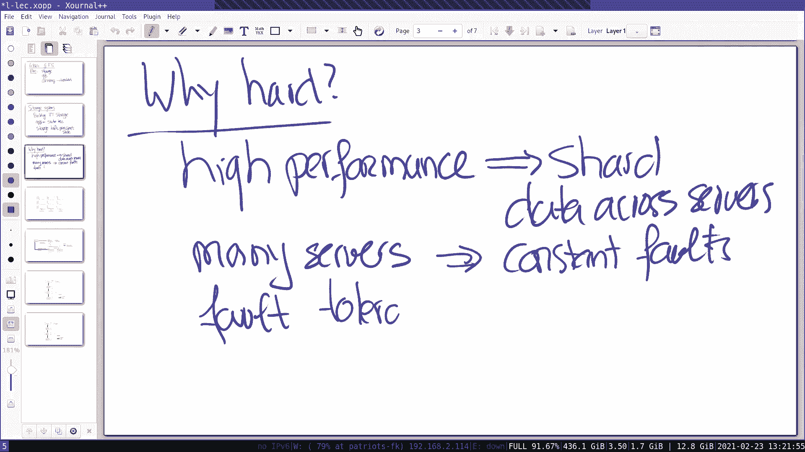

为了获得容错能力，至少在这种情况下，存储系统采用的传统方法，我们将使用复制，复制数据到多个磁盘上，这样，当这个失败时，希望另一个磁盘有数据。但是如果你使用复制，数据位于多个位置。

就会遇到数据不同步的挑战，你会陷入可能的不一致。为了避免这些不一致，如果你想要强一致性，你的复制系统的行为就像，就像未复制系统的行为。然后，你将需要一些持久性协议，这可能需要发送一些消息。

而且可能会降低性能，也许消息本身并不会带来很大的性能开销，但是我们会看到的[]知识，你可能必须读取或写入持久存储，作为协议的一部分，而且读取或写入存储，往往是相当昂贵的。所以我们在这里看到了这个难题。

我们想要高性能，我们想要容错，因为我们有很多服务器，我们希望在多台服务器上实现高性能，许多服务器意味着容错，这意味着应用程序不一致的情况，因为我们在多个地方都有数据，为了修复不一致，我们需要一个协议。

可能会降低性能。所以，这是基本挑战，在设计这些分布式存储系统时，用户在一致性和性能之间苦苦挣扎，我们将在整个学期中看到这一点。所以，让我来讨论一下一致性。

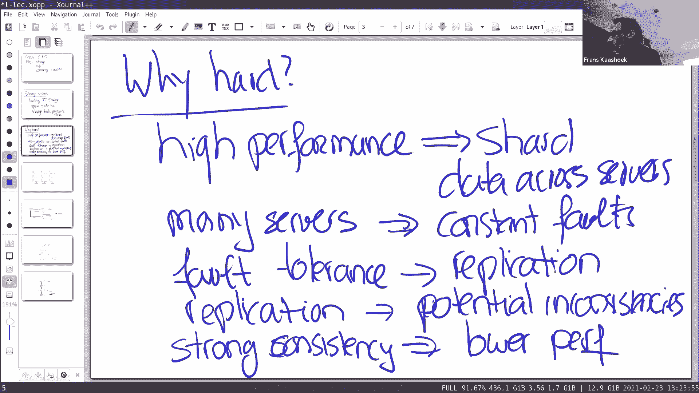

从很高的层面，我向你保证在这学期剩下的时间里，我们将会有更多的详细介绍。首先，让我们讨论一下理想的一致性，理想的一致性最简单的思考方式是，机器的行为就像一个单一系统一样，这也是我们想要的行为。

有两件事产生想要的行为，或两种危险使得这种设计行为很难实现，或者至少需要一些思考，第一个是并发性，第二个是失败。让我从消费者并发性开始，因为即使你有一台具有多个客户端的计算机，你在一台计算机中的并发性。

你也必须考虑一致性，这个原因是很明显的。假设我们有一台机器，一个磁盘，有两个请求来自不同的客户端，如果机器是多处理器机器，它们可能会在内部并行运行这些请求。所以，让我们稍微想一想，这是什么意思，所以。

假设我们有客户端 1 ，它对键 x 写入 1 ，与此同时，也有一个请求对 x 写入，但写入的值是 2 。现在，如果你想具体说明或展示一致性是什么，我们需要一些规则，比如会发生什么，在这个规则中。

通常从读者的角度表述，假设有另一个读取者进来，来自另一个客户端的另一个请求，并读取 x ，问题是，读者或客户端观察到的值是什么。看起来更复杂或更有趣，假设我们有四个客户端。

我们将更清楚地提出一致性定义这一问题，它也读取 x ，在客户端 3 读到了 x 之后。所以现在我们有了一些状态，什么是期望的结果，什么是不正确的结果，这就是一致性的真正定义。那么。

让我们来看第一种情况 C3 ，什么是一个合理的结果，对于 C3 的读取来说，什么是合理的结果，什么值，什么值会让你开心，或者让应用程序程序员开心。2。2 很合理吗？还有其他合理的值吗？1。是的。

 1 是合理的，因为操作是同时进行的，所以也许我们不知道哪一个，我们并不想限制它们的具体顺序，所以我们说随便哪一个都可以，因为是并行运行的。有哪些值观是我们不想看到的，对于 C3 读取。7。是的。

 7 ，任何其他的值，因为没人写过这些，所以这是不受欢迎的。好的，所以我们一致认为，c3 的合理结果可能是 1 或 2 。好的，那么 C4 呢？与 C3 相同。是吗，一样的吗？所以。

假设 C3 返回 1 ，我们期望 C4 返回什么？C3看到的值。是的，因为它是在 C3 之后运行的，如果返回 1 ，我们希望这里是 1 ，如果返回 2 ，我们希望这里也是 2 。这能理解吗？好的，所以。

这是一个很简短的介绍，说明我们如何定义一致性，通常我们使用 traces ，我们讨论特定[traces]的正确性，我们将看到更多这样的情况。当然，服务器可以强制这种并发性，例如使用锁。

如果你已经这样做了，如果你做了 mapreduce ，任何你写的并发 Go 程序，那是强制一致性的标准技术，在并发存在的情况下使用锁。在分布式系统中，理想的一致性有两种风险。

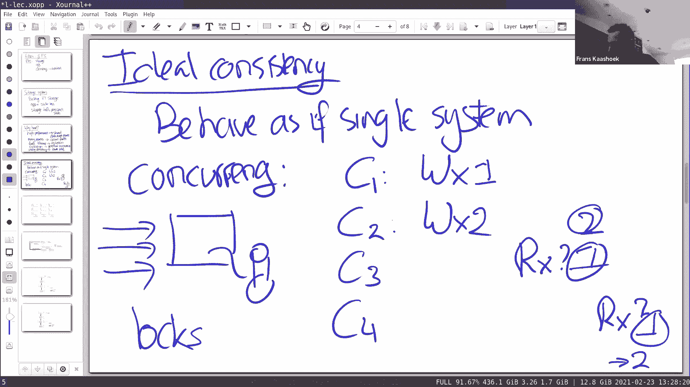

第二种风险是故障，所以一般是复制，如果我们有两台服务器，所以这是 S1 ，这是 S2 ，两个都有磁盘，我们有和之前一样的客户端， C1 和 C2 ，它们向 x 写入，只是为了说明什么样的复杂性。

说明我们必须做些什么，让我们从最笨的复制方案开始。一个非常糟糕的复制方案，所以这个特别糟糕的复制方案，我们要做的是，比如，我们将允许客户端，当客户端想要更新或写入时，我们要告诉它，我们跟据的协议是。

将客户端写入到两台服务器，无论什么，不用协调，只需写入到两者。我们有客户端 1 ，客户端 2 在运行，然后，客户端 2 可能会做同样的事情，然后，我们会问自己同样的问题，C3 实际读到的是什么。

让我们假设读取，无论使用哪种方式，我们会从任何复制中读取，像我说的，这是一个非常糟糕的复制方案，没有任何限制。那么，可能的结果是什么？这个写入 1 ，这个写入 2 ，我们是 C3 。

C3 的可能结果是什么？还是 1 和 2 。是的， 1 和 2 ，这真的很糟糕。C4 怎么样，我们读取 x ，在 C3 读取 x 之后，像在上一个白板上一样。也是 1 和 2 。是的。

也是 1 和 2 ，如果 C3 读取 1 ，但 C4 可能返回什么？1 或 2 。1 或 2 ，这是我们想要的吗？不是。不，我是说，对于应用程序编写者来说，很难读取这个。

特别是 C3 和 C4 是一回事，你首先读取 1 ，没有任何修改，然后下一秒返回另一个值，这怎么可能，这使得程序员很难编写程序。所以原因当然是，这里显示的不一致性，因为我们没有协议，来协调客户端。

读取者和写入者，所以我们需要某种形式的分布式系统，我们需要某种形式的协议来解决这些问题，并获得，确保我们获得所需的一致性。所以我们可以在这学期剩下的时间里看到，很多可能的协议。

它们在容错和一致性方面有不同的权衡。好的？你应该有这样的想法，我们要用很多不同的案例研究，今天的案例研究是 GFS 。

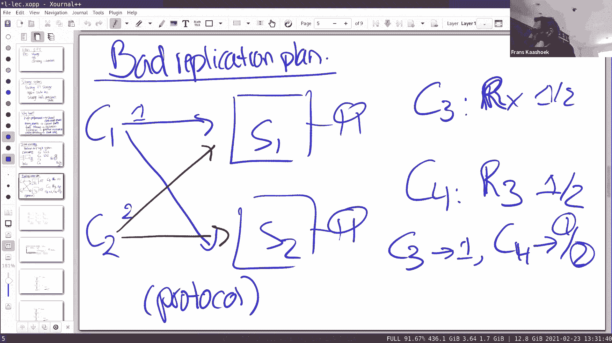

这是一个有趣的案例研究，为什么我们布置它，其中一个原因是有趣的案例研究，因为它提出了所有这些核心问题。GFS 设计旨在获得高性能，这意味着它使用了复制和容错，而且它很难保持一致性，所以这就是一些主题。

我们将在整个学期中持续看到它，都会出现在这篇论文中。为什么是有趣的案例研究的另一个原因，因为它是一个成功的系统，Google 确实使用了 GFS ，现在，据我所知，有一个后继文件系统。

名为 Colossus ，但它的灵感来自于 GFS ，还有其他类型的基于集群的文件系统，比如 mapreduce 类型使用的 HDFS ，也是从 GFS 的设计获取的灵感。有一件事其实很有趣。

在写这篇论文的时候，在差不多 2000 年的时候，分布式文件系统是容易理解的主题，人们知道容错，他们知道复制，人们知道一致性，所有这些事情都很容易理解。然而，没有人构建出系统，在上千台计算机的规模上。

这肯定会带来一些挑战，以前的系统不能解决的，而且设计也不完全规范，所以，我们正在看的设计，不是某种标准的设计，你会在当时的学术论文中看到，有两个方面是非标准的，[]我们会把更多的时间花在上面。

一个是这里只有一个 master ，master 不是复制的，只有一台机器负责，系统中几乎所有的协调，所以这是不寻常的，为什么构建文件系统容错系统，却包含单点故障，而不是当时学术文献中的人正在做的事情。

第二件事是，它有不一致，它可能有不一致之处，同样地，在那个时期的文献上，人们非常努力地构建，具有强一致性的分布式系统，而且没有异常情况，我们在上一个白板上看到的那样。好的。

就像你所熟知的许多核心技术一样，你把它们放在一起的的方式是完全不同的。因此，这让它变得有趣，特别是这个系统实际运行的规模是令人印象深刻的。即使在今天也很常见，这个问题，在容错。

复制性能和一致性之间的斗争，是一个标准问题，几乎是任何分布式存储系统重复出现问题，今天的人们构建的。它随着时间的推移而改变，比如 S3 有一段时间，它们真的有强一致性，随后，它的一致性变得更强了。好的。

因为论文驱动，设计是由性能驱动的，我想暂时回到 mapreduce 论文上。

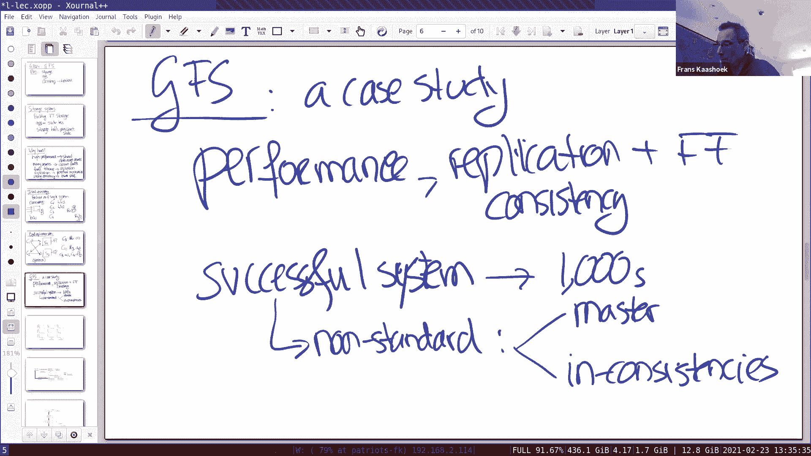

这是一张 mapreduce 的图，考虑 GFS 的一种方式是，它是 mapreduce 的文件系统，所以，我们的目标是，运行多个 mapreduce 作业并获得高性能。我们知道这是从。

我们已经可以从 mapreduce 的论文中看出，GFS 在性能方面令人印象深刻。所以如果你看这张图的这一边，这是从 mapreduce 论文中拿出来的，这是一个 mapreduce 作业的正常执行。

它有三个部分，一个是第一部分的输入，比如，读取输入文件，从文件系统到 map 的输入，他们没怎么说这件事，但这些都是从 GFS 读写的，这是我们关心的内部的 shuffle ，然后在最后。

reduce 作业将结果写回 GFS 。所以，部分性能，mapreduce 任务决定于，从哪里读取，mapper 可以从 GFS 文件系统中读取数据，无论我们同时运行多少 mapper 。

一些来自不同作业的 mapper 可能会读取相同的文件。所以我们来看一下输入，比如这里的最上面的图，以兆字节/秒为单位的显示输入，mapper 的读取，[为一项工作共同工作]，可以从文件系统中读取。

正如你所看到的，它通过超过每秒 10000 兆字节。你要问的第一个问题是，当然是一个令人印象深刻的数字，我们对这个数字印象深刻，考虑给我一个磁盘，我也可以做。有人吗？我想是的，因为它很老了，也许是的。

好的，固态硬盘，读写速率是多少？好吧，让我告诉你，在论文发表的当时，一个磁盘的吞吐量大概是，30 兆字节每秒，有时在每秒几十兆字节，所以这里我们看到，超过 10000 兆字节每秒。

这是一个令人印象深刻的数字。你必须做些工作，正如你所看到的，GFS 设计允许这种吞吐量。当然，这项技术表明 GFS ，当然，这项技术更快，这里真正的目标是什么，我们有一千台机器。

也许每个机器都有一个磁盘，每一个都读取每秒 30 兆字节，这是 1000 乘以 30 兆字节每秒才能[摆脱]它。好的？所以这个设计的驱动是，允许 mapper 从文件系统并行读取，[联合]的文件系统。

好的？

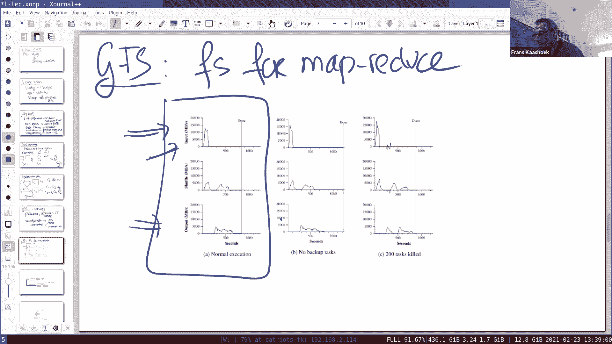

关于这个，让我再说一点，GFS 的关键属性是什么，一个大的数据集，我的意思是，你应该考虑的数据集就像 mapreduce 数据集，你将爬取整个万维网，存储在这个分布式文件系统中。必须要快，我们谈到了。

他们获得高性能的方法是进行自动分片，分片文件到多个磁盘，允许多个客户端从这些磁盘并行读取。好的？它是全局的，这意味着它是共享的，所以应用看到相同的文件系统，这很方便，例如。

如果你有多个 mapreduce 作业，对同一组文件进行操作，首先，它们可以读取所有相同的文件集，然后它们可以制作新文件，另一个 mapreduce 再次使用这些文件，所以。

在应用程序之间进行大量共享非常方便，所以拥有它是非常方便的。当然， GFS 必须具有容错能力，它们很可能会失败，我们想要自动的，尽可能自动容错，你会发现 GFS 并不是完全自动的。

但在提高容错能力方面做得相当好。好的，到目前为止，关于这一部分，有什么问题吗，对这个主题的宽泛介绍，关于 GFS 的几个介绍。好的。

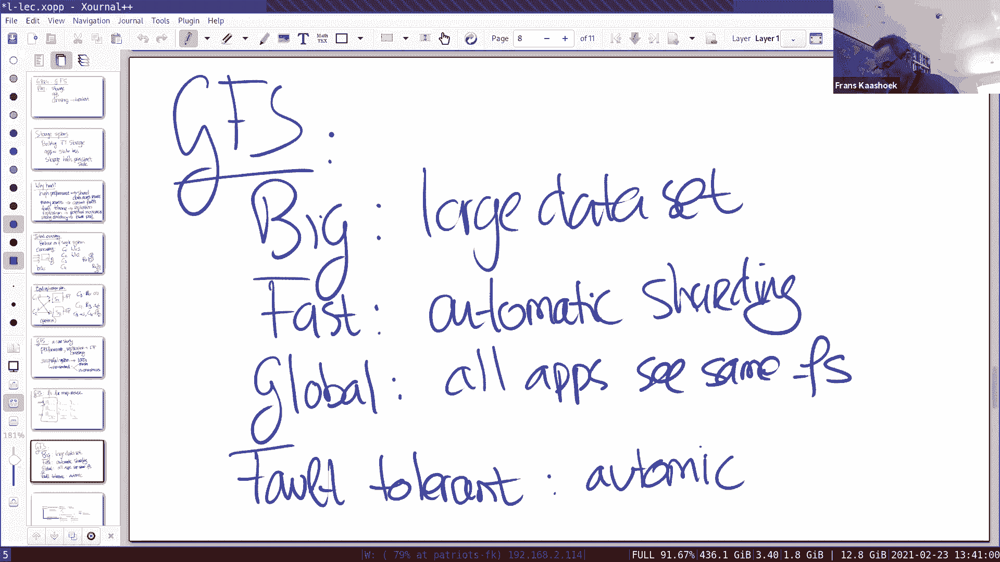

然后让我们来讨论一下设计。这里的设计，是从论文中图一看到的，有几件事我想指出，更详细地讨论一些细节。所以，首先，我们有一个应用程序，然后这个应用程序可能是 mapreduce 作业。

包含多个 reduce 任务，多个 map 任务，它们与 GFS 关联，它不是 Linux 文件系统，这不是（普通的）文件系统，你用来编辑文件或编译，它是一个专门用于，这些大型计算的文件系统。

正如我之前所说，我们的真正目标是实现一个令人印象深刻的数字，比如我们想要单个磁盘的兆字节数乘以机器数量，单个应用程序应该能够利用这个。所以他们安排的方式是有一个 master ，它负责东西在哪里。

客户端只是周期性地与 master 交互，为了获得信息，例如，它会打开文件，打开调用将导致向 master 发送一条消息，master 将回复，表示所有指定的文件名，你需要的块在这里，好的。

这些是你需要的块，并且有一个块句柄标识符，对应那个文件包含的块，这是块数据的服务器，你可以得到块句柄以及很多块位置。一个文件可能包含，如果你考虑一个大文件，它由许多块组成。

块 0 、块 1 、块 2 、块 3 等等，任何块都是很大的， 64 兆字节，应用程序想要第二个 64 兆字节，它告诉 GFS ，我想读取第二块，这个特定的文件，GFS 将使用块 1 的句柄进行应答。

以及保存块 1 的服务器。多个应用程序可能会要求从同一文件中获取块，它们都会得到，一个应用程序可能正在读取块 0 ，另一应用程序可能读取块 2 ，它们将得到不同的列表，对应这些块。

一旦 GFS 客户端知道了块位置，就会直接与块服务器交互，以网络的速度读取数据，可能每个磁盘都位于特定的区块服务器后面，直接连接到应用程序。这里你可以看到，我们获得了重大胜利，因为我们能够读取。

对于多个，多个客户端可以同时从多个磁盘读取，我们将获得巨大的性能，比如，这是一个运行的 map 任务，这是另一个正在运行的 map 任务，也是作为客户端，它们会和一组服务器交互。

有一个完整的所有数据集的块的集合，它们会并行读取，从所有不同的块服务器，这会给我们一个很高的吞吐量数字。这能理解吗，这是总体方案。为了解释完整，块服务器不是别的，只是有磁盘的 Linux 计算机。

实际上，是 64 兆字节的块，每个都作为一个 Linux 文件存储在 Linux 文件系统中。好的？好的，我想把不同的部分放大，我先从 master 开始，因为 master 跟这里的控制中心有关。

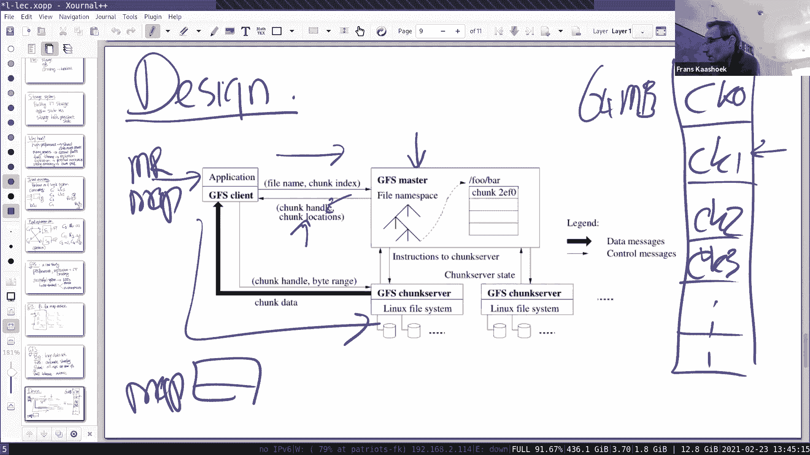

所以，讨论一下 master 维护的状态。好的，首先，它有从文件名到块句柄数组的映射，正如你在论文上看到的，其中一个目标，是维护所有这些内存，大多数信息直接在内存中。

所以 master 可以非常快速地响应客户端，而这么做的原因是因为，现在只有一个 master ，很多客户端，你希望尽可能高效地执行每个客户端操作，这样就可以将 master 扩展到合理数量的客户端。

然后，对于每个块句柄，master 包含一些额外的数字，它维护一个版本号，和一个块服务器列表，里面有块的复制。正如我们稍后会看到的，其中一个名字叫做，其中一台服务器是主服务器，而其他的则是次要的。

典型数量是块存储在 3 台服务器上，我们可以过一会儿再谈为什么是 3 。然后每个主服务器有一个释放时间，所以，也维持一个释放时间。然后还有两个大的存储组件，这些都是文件系统级别的东西，然后在实施方面。

有一个日志，还有检查点。因为 master 是关键的控制中心，每当名称空间发生更改时，可能在 GFS 中创建新文件，或者将文件映射到块和改变，所有这些操作都会写入这个日志，而日志存放在稳定的存储里。

基本的想法是，在回应客户端之前，改变使 master 首先写入稳定存储器，然后对客户端进行响应，所以，这意味着如果 master 出现故障或崩溃，然后又回来了，它可以通过重放日志来重建它的内部状态。

通过在响应客户端之前首先将其写入存储器，客户端永远不会观察到奇怪的结果，你可以用另一种方式，但那会导致一个问题，因为客户端会认为文件已创建，服务器崩溃回复，然后文件就不存在了，所以。

这是另一个一致性关键点。重放总是所有操作，从开始时间到日志当然是不想要的，这意味着如果 master 崩溃，我们只有一个，会停机很长一段时间，所以除此之外，它也会将检查点保存在稳定存储中，所以。

 master 会定期创建自己状态的检查点，和映射[]块句柄，并将其存储在稳定的存储上，然后它们只需要重放最后一段，日志中最后一个检查点之后的所有操作，所以，恢复是很快的。所以，还有另外几个有趣的问题。

我们可以问自己，比如什么状态需要放在一个稳定的存储里，对于 master 的功能来说。所以第一个要问的问题是，这个从文件名到块句柄的映射需要吗，它需要稳定储存吗，或者它可以只存在于内存中。

如果 master 崩溃，我想你可以从块服务器获得信息，所以也许只是在内存中。是的，这是问题的答案，其他人是怎么想的。所以它可以从日志中重建出来，所以当服务器崩溃时，只有日志需要存储在硬盘中。

然后它可以从日志重新加载到主存中。

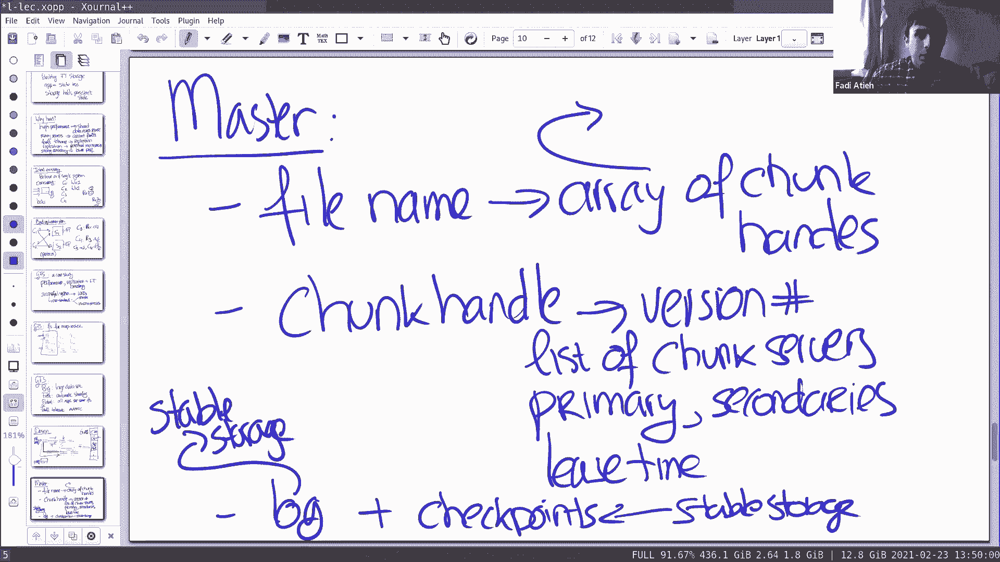

是的，它肯定在日志中，所以我们同意，这个块句柄列表必须存储在稳定的存储中，否则，我们会丢失，比如我们创建一个文件，我们没有写入存储，我们就把文件丢了，所以，从文件名到块句柄的这种映射需要在稳定的存储中。

那么从块句柄到块服务器列表需要吗，它需要[]吗？我想在论文中，他们说当 master 重新启动时，它要求服务器告诉 master ，它们拥有的块是什么。是的，所以这不是，这只是易失性状态。

而不是稳定的存储。同样的，对于主要的和次要的，以及释放时间。那么版本号呢？master 是否需要将版本号记到稳定存储中？是的，因为它需要知道，其他服务器中的块是否是旧的。是的，完全正确。

所以 master 必须记住版本号，因为如果它不这么做，整个系统崩溃了，然后块服务器又恢复了，可能块服务器包含最新的还没有出现的数据，是一个旧的版本号 14 ，然后， master 必须能够区分。

版本是 14 的块服务器不是最新的块服务器，所以，它需要在磁盘上维护版本号，可以用来区分，哪个块服务器拥有最新信息，哪个没有。好的？我有一个问题，如果 master 失败了，然后它再次出现，无论如何。

它都会连接到所有块服务器，它会找到最大的版本是什么。是的，有能力找出最新的，首先，它尝试与所有块服务器进行交互，一些块服务器可能已经关闭。好的。有可能就是那台块服务器，正好有最新版本。是的，好的。所以。

你不能使用最大的寿命的块服务器，这是不正确的。对于这个，还有其他问题吗？

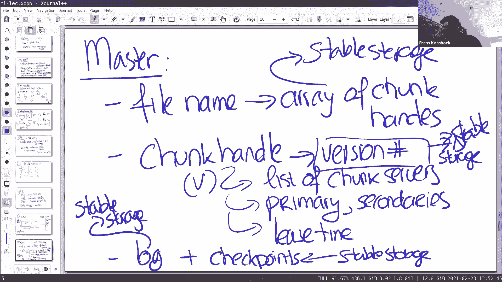

好的，让我们来看看两种基本运算，真正做到一致性，当然，这是读取和写入，所以读取一个文件，然后我们讨论如何写入文件。从某种意义上说，读取文件很简单，我们谈到的客户端发送消息。

使用文件名加上偏移量给 master ，询问请给我块服务器，以及在偏移量处保存数据的块句柄，所以找到块句柄，比如读取字节 0 ，很明显，这是列表上的第一个条目，从文件名到块句柄。所以。

 master 块句柄与 master 一起回复，用块句柄回复客户端，以及那个句柄的块服务器列表和版本号。所以客户端会收到一条消息，表示这是块 221 ，并且这是三台机器，这三台机器所有的 IP 地址。

并且版本号比如是 10 。然后，客户端缓存这个列表，然后它向最近的服务器发送一条消息，从最近的服务器读取。那么为什么客户端缓存这些信息，我们稍后再看，那造成了一些麻烦。

所以它在一段时间内不需要联系 master ，如果它想要再次读取或写入块。是的，这个为什么重要？为了减少流量，一般来说，会花费更少的时间，如果你与 master 的通信更少。是的，这是正确的。

这种设计 master 是一台机器，作为一台机器，你只拥有有限的内存和有限的网络接口，你有太多的客户端交互，它就不能服务了，所以，客户端缓存对于减少这台机器上的负载很重要。好的。

为什么要从最近的服务器上读取？最大限度地减少网络流量。是的，最大限度地减少网络流量，所以整个目标是，为了将尽可能多的数据传输到客户端，最高的吞吐量。这里面有两个问题，我们必须通过数据中心网络。

一个可能有一些拓扑，也许[]像顶层链接拓扑，可能会增加到达另一边的延迟。好的，能够访问最近的一个是重要的，同样，为了最大限度地提高吞吐量，它联合一组客户端，你可以得到，当它们从许多块服务器并行读取时。

好的？所以块服务器 S 检查版本号，如果版本号是正确的，然后发送数据。好的？为什么在那里检查版本号？检查它是不是太旧了。是的，我们尽最大努力避免读取过时的数据，我们马上就会看到。

我们没有在[]方面做得完美，但是尽量减少客户端读取过时数据的情况。好的？这些读取直截了当。

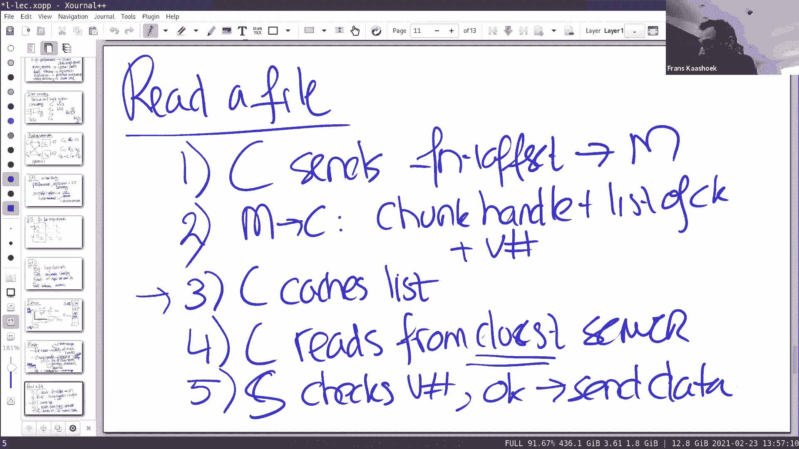

那么，让我们来看看写入。这是论文上的一张图片，所以我们假设客户端是，让我们来关注追加。他们认为，对他们来说，这是非常常见的操作，需要将记录追加到文件中，我们能知道为什么。

基于你们从 mapreduce 中了解到的情况，你知道 Google 是有道理的，为什么追加如此重要。因为在做 mapreduce 时，很大程度上，你需要，当 map 函数发出信息时。

它在很大程度上只是增加信息，而不是修改之前已经发出的信息。是的，也许 map 不是最好的例子，因为它写入本地文件而不是 GFS ，但是 reducer 是这样做的，同样的论点也适用于 reducer 。

是的，所以他们在那里工作，写入消耗了大量的信息，很快地把记录附加到文件中，与计算结果一起。好的？好的，所以第一步我们有客户端，它与 master 交互，以确定在哪里写入，master 查看表。

文件名到块句柄的表，找到块句柄，然后查看块句柄到服务器的表，找到对应的服务器列表，包含指定的东西，包含指定的块。好的，接下来会发生什么，所以有两种情况，当已经有 primary 时，第二种情况。

第一种情况，两种情况是有 primary 或没有 primary 。假设这是很早的第一次，这个客户端为了这个块访问 master ，还没有其他人这样做过，所以还没有 primary ，在这种情况下。

我们需要做的是，master 需要选出一个 primary ，它是怎么做的。我认为 master 可以选择任何可用的块服务器。是的，选出一个。

所以选出一个是 primary 和其他的都是 secondary ，在这种情况下，还涉及到哪些步骤。是的，然后 master 给那个 primary 一个租约，那个租约有明确的过期时间。是的，还有什么。

一条或多条其他关键信息。Even。增加版本号？是的，第一步是增加版本号，因为你要有一个新的 primary ，当你每次有新的 primary 时，或者无论你有新的 primary 。

你需要考虑的是进入了一个新时期，在文件系统中或这个文件中，所以增加版本号，因为你有一个新的数据，所以， master 会增加版本号，它会给 primary 和 secondary 发送一个新的版本号。

然后说，我们要开始一个新的，我们要开始一个新的改变，你需要形成一个复制组，你的复制组使用这个指定的版本号，比如版本号 12 。然后 primary 和 secondary 保存版本号。

你需要怎么保存版本号，它们是存储在磁盘上还是内存上，或者。我不知道。有人知道吗，你怎么想的？好的，让我们放到内存里，假设存储在内存中，这是一个好的设计吗？不是。

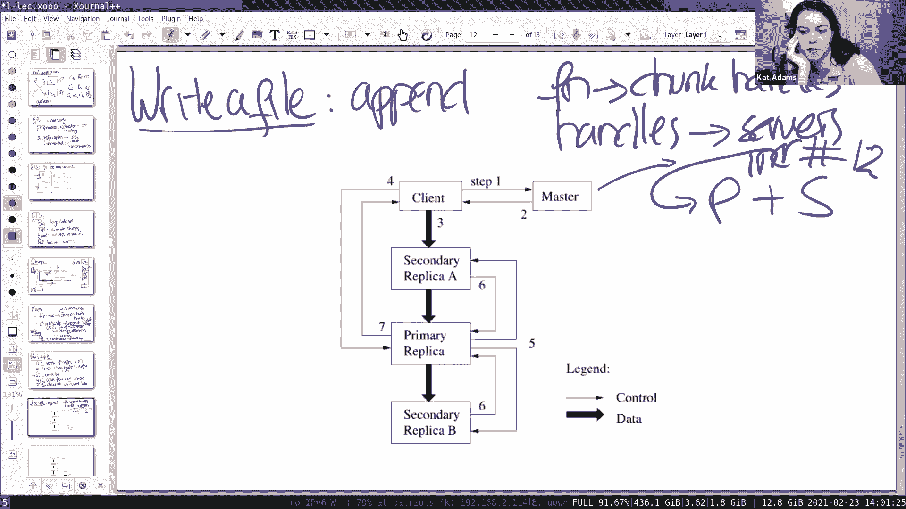

抱歉。你可以继续。我想不是，因为如果块服务器出现故障，然后它又回来了，它应该知道自己有什么版本。是的，因为否则你不能说服 primary ，你有最近一次的，primary ，抱歉。

 master 可能会很大，块服务器有最新的数据，所以它必须是这样，所以，版本号存储在磁盘上，包括块服务器和 master 。所以当 master 回来后。

来自 primary 和 secondary 的确认，它们已经将版本号写入磁盘，primary 收到了租约，然后 master 也将它的版本号写入磁盘，然后对客户端作出响应。好的？所以，要返回到客户端。

使用服务器列表作为响应，primary 加上 secondary 加上版本号。好的？然后下一步，同样，我们在这里看到，整个目标是，从网络中[输入]大量数据，客户端只是发送数据。

想要写入到 primary 和 secondary 的，它的工作方式是一种有趣的方式，联系它知道的最近的 secondary ，在这个列表上，并将数据发送到那里。

那个 secondary 将数据转移给列表中的第二个人，然后转给下一个服务器列表，通过这种方式，数据从客户端，发送到管道，到所有副本，当 secondary 收到后。

第一个 secondary 接收到一些数据，立即开始将数据推向管道。好的？这种设计的原因是，这种方式的网络接口，客户端走向[外面的世界]，使用全网络接口向管道推送数据，所以，这为我们提供了高吞吐量。

好的？好的，如果这些都成功了。

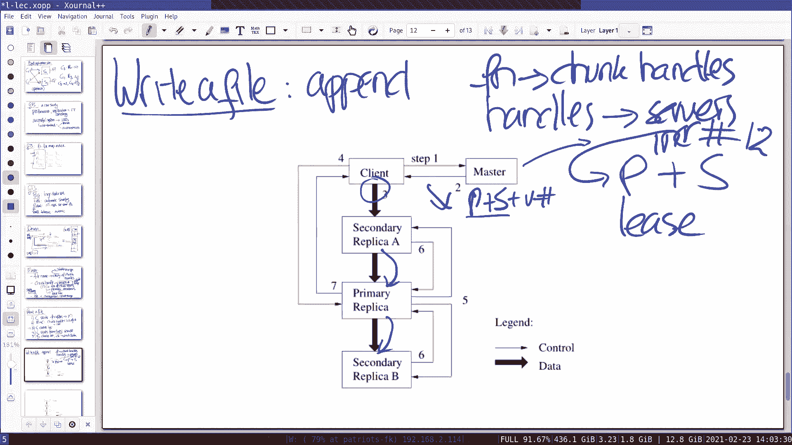

数据已经被推送到所有服务器，这些服务器还不会存储信息，它只是坐在一边，要在下一步中使用。所以下一步是，让客户端发送消息，比如一个追加消息到 primary ，在这一刻，primary 会检查版本号。

它的版本号是否匹配，如果它不匹配，那么它们不会允许这样做，primary 检查这个租约是否有效，因为如果租约不再有效，它不能接受任何改变操作，因为如果租约无效。

外面的世界可能会有另一个 primary ，所以它会检查租约，然后，如果版本号匹配，租约有效，然后会选择一个偏移量来写入。然后下一步是，我们写下刚刚进来的数据，这个记录到一个稳定存储，所以，在这一点上。

 primary 将其写入稳定存储，这个数据，然后将消息发送到 secondary ，表示请将数据写入。因为 primary 选择的偏移量，它告诉 secondary ，将记录写入文件的哪个位置。

比如你选择的偏移量是 125 ，它会告诉 secondary ，将早些时候进来的数据写入到偏移量 125 处。然后，如果一切顺利，所有 secondary 和 primary，都成功地将数据写入磁盘。

然后它会对客户端做出响应，表示，好的，你追加已经成功了。存在一种方式，写入可能不成功，或可能不成功，比如， primary 已写入自己的磁盘，但它没能写入，它没能写入其中一个 secondary 。

或许 secondary 崩溃了，或者可能 secondary 的网络不工作了，在这种情况下， primary 会向客户端返回错误，所以，如果一个 secondary 没有响应，就是错误的。

在这种情况下，客户端库将执行的操作通常是重试，它将重新发布相同的追加，并再次尝试，希望在第二次的时候，这些数据能被通过，这就是他们所说的最少一次。如果重试， primary 会选取相同的偏移量吗？

我不这样认为。不，它需要一个新的偏移量，写入新的指定偏移量，这意味着如果你查看磁盘，一个文件在三个副本上，primary S1 和 S2 ，可能是这种情况，你写入 S1 125 数据。

我们成功可能 S2 12 ，但 S2 实际上并没有发生，没有数据，然后我们再试一次，我们可能读取相同的数据 x ，也许在三个副本上都成功了。所以你可以在这里看到，副本的记录是可以重复的。

这在标准文件系统中可以发生吗，比如在你的笔记本或计算机上的 Linux 文件系统。不会。不，如果你的计算机做到这个，你会感到惊讶吗？

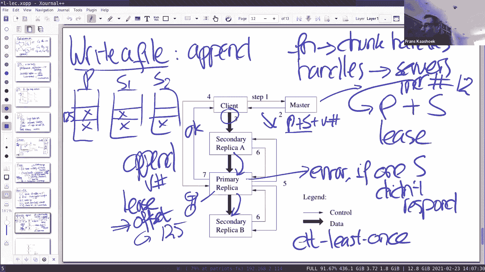

我想是的，这不是标准文件写入的工作方式。是的，有这个特性会不方便，还是没什么关系？不方便。

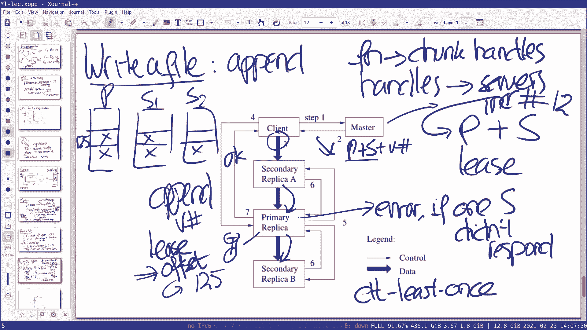

是的，这会是非常奇怪的，编译器产生结果到文件中，然后，某些数据块写入了两次，然后你不能再运行程序了，所有东西都变成了垃圾。所以这会很奇怪，就像你写了一封电子邮件，而电子邮件的正文出现了两次。所以。

这不是典型的文件系统，所以是有点奇怪的，你知道理由是什么，为什么你认为这是个好主意。我不确定什么是好主意，但我搞不懂这对 mapreduce 是如何起作用的，如果你运行 word count 。

并且这么做，一些文件，你会计数，比如单词 a ，它只出现一次，但你做了两次，因为有些事情失败了，现在你得到了 a，1 a，1 ，所以你的 a 计数会是错的。怎么回事，是的，我很困惑。是的。

它们是怎么工作的，好像如果你什么都不做，那么这真的非常不方便，它返回到应用程序，将计算错误的结果。他们说使用校验和和唯一的 ID 来检查，每一条记录都只有一次。

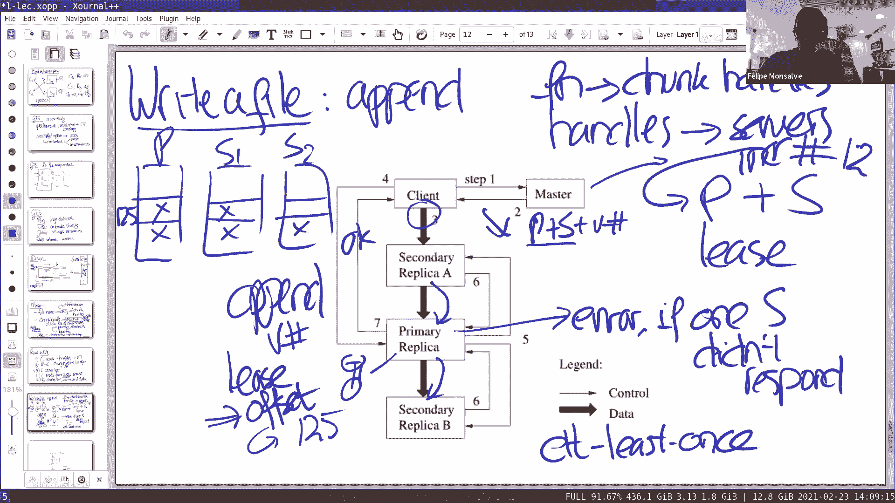

另外，当你做记录追加时，从 primary 返回给客户端的响应，为你提供文件的偏移量，你的数据实际写入的地方，而其余的部分则被认为是未定义的。是的，我认为这里的关键点是，应用程序不直接与文件系统交互。

是与某些库交互，在那个库里，如果你写入追加记录，那个库在绑定一个 id 给它，同时也使用那个库读取哪些记录，所以，如果你看到具有相同 id 的记录，可以跳过第二个，因为你知道这显然是同一个。

它们还有一个额外的东西，检查和，确保记录不会被篡改，也为了检测字节的变化，id 会帮助他们做出决定，允许库来决定，好的，这是相同的记录，我不会把它交给应用程序，或者应用程序不需要处理它。好的？

我的问题是，除了重写每个副本，记住哪个副本失败不是更好吗。

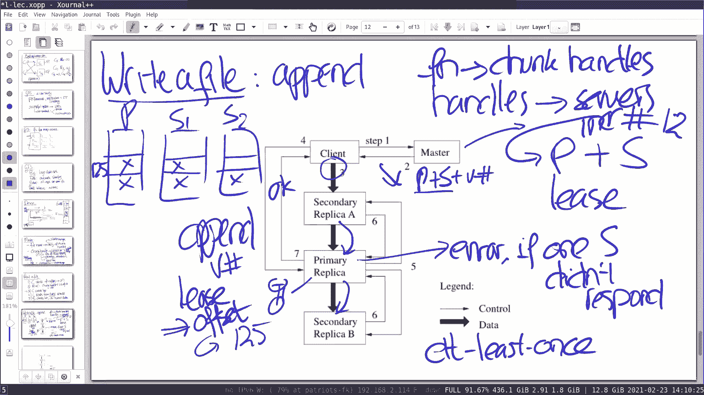

停止直到它可以被写入。是的，可能有很多不同的设计，当我们稍后再回来，我认为他们这样做的一个原因是，如果是暂时的失败，比如网络断开或租约问题，写入将会成功，它们可以继续，并且不需要做任何重新配置。

什么都不用做，写入可以继续下去，所以，写入不是必须失败。

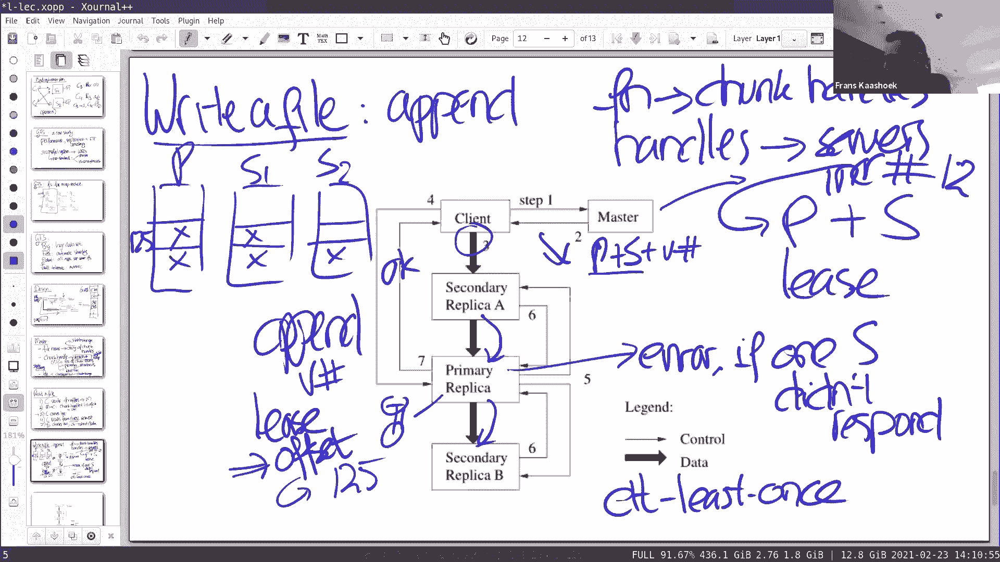

好的。我有一个简短的问题。

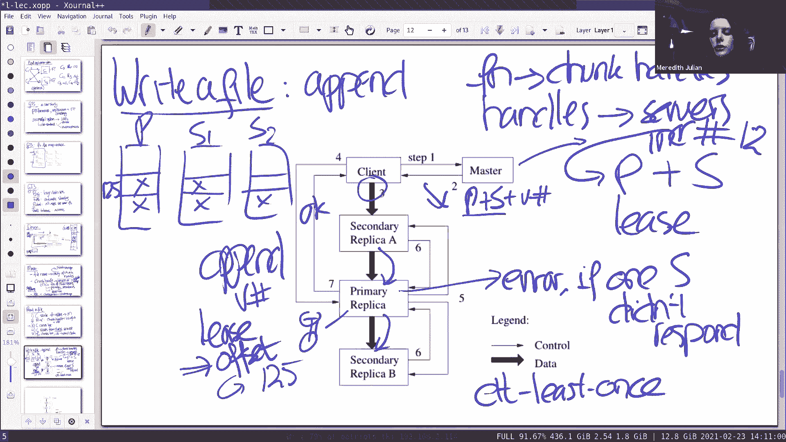

所有这些服务器都是可信的，没有。

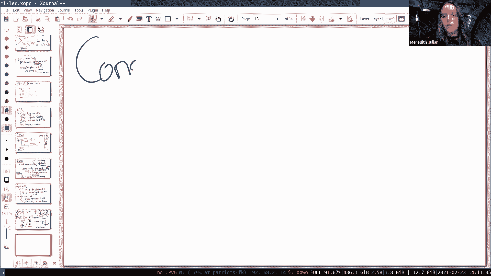

是的，当然，这是重要的一点，这不像 Linux 文件系统，有权限和访问控制写入，以及诸如此类的东西，服务器是完全可信的，客户端是可信的， master 是可信的，Google 写的软件是可信的。

整个事情都是可信的，这是完全内部的文件系统。事实上，这很酷，可能有点令人惊讶，我们甚至不知道这个文件系统的这么多细节，因为它只在 Google 内部使用，其中一件很酷的事情是，有一段时间。

他们仍然在这样做，他们撰写了论文，并描述这些系统是如何工作的，我们知道这个只有一个原因，他们这样做是非常酷的。好的。好的，我们现在了解了读取是如何工作的，写入是如何工作的，有一些有趣的行为。

我想更多地谈谈一致性，这会归结为，在你追加之后，读取会观察到什么，家庭作业的问题会在这之后，我现在想要做的是，简短休息一下，比如五分钟，所以你们可以讨论这个问题的答案，然后回来，更详细地讨论一下一致性。

好的？

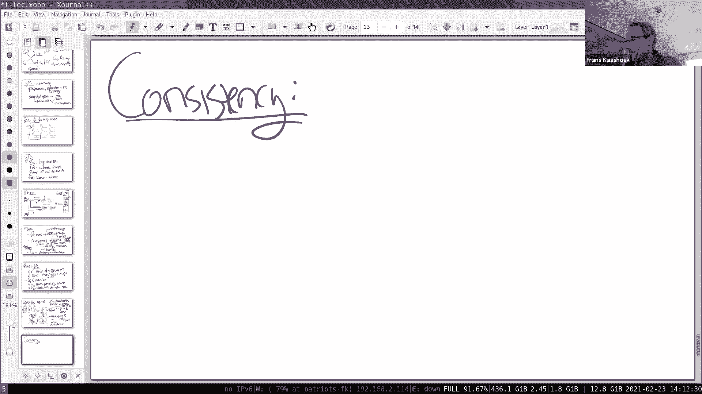

我要让 Lily （设置 zoom ）。

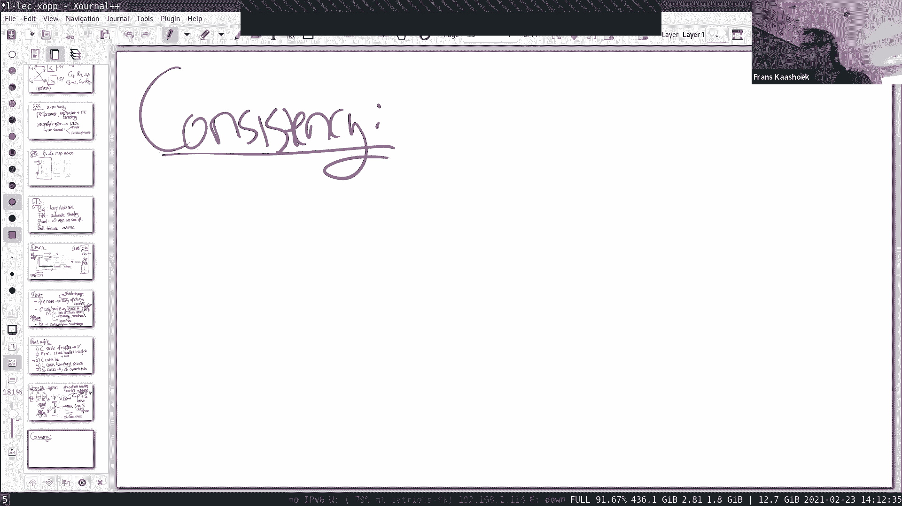

好了，大家回来了。大家能听到我吗，检查一下。是的，教授，有一个问题。

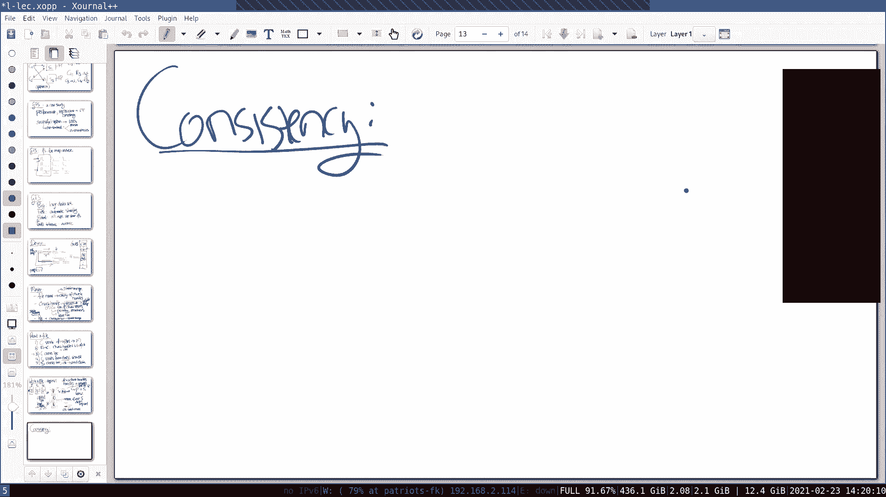

你能够回到幻灯片，当我们谈到写入时的幻灯片，就像你提到的，master 通过版本号响应客户端，如果这是关键，那有没有可能，是否需要读取旧数据，因为客户端具有版本号，而块服务器没有版本号。

这样他们可以比较这些。

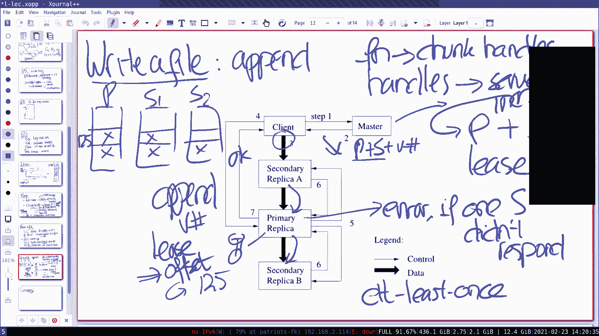

如果它们与客户端不匹配，块服务器可以说，我有一个旧数据，所以你不应该读取这个。好的，我们，是的，让我们来看一下这个场景的更多细节。让我来放大这个窗口。好的，我们来谈谈，我认为我们正在讨论的这个场景。

这会导致下面的问题，我们有 primary ，我们 secondary ，两个 secondary ， S1 S2 ，我们在这边有个客户端，我们有一个 primary ，客户端收到返回的版本号。

比如是 10 ，随后，另一个 primary 将会，好的，所以 S2 获得一些服务器，然后在某个时候，这个信息被缓存在（客户端），也许一个 secondary 比如 S2 崩溃，或者至少与网络断开。

所以 master 要做的是递增版本号，转到 11 ，消息 11 ，然后，另一个客户端可能会过来，开始写入，所以，我们为该文件的 S1 和 S2 写入一个新值，所以块现在已经更新了。

我们假设原始版本号为 10 ，现在这里是 11 ，但是情况是这样的，即使 master primary secondary 不能访问 S2 ，但是第二个客户端。

第一个客户端仍然与那个 secondary 交互，它将读取到与之匹配的版本号，它们都是 10 ，它会发回 10 ，所以，你有一种情况，写入已经完成，并确认已经成功，尽管如此。

还是有一个客户端会读取一个旧的值。那么，为什么 11 不回到客户端呢？第一个客户端，原因是第一客户端将其缓存了更长的时间，他们在协议中没有做到这个的内容。当版本会更新，当系统尝试将更新推送到 S2 时。

还是不能，或者。版本号递增只是在，版本号由 master 维护的，它们只在选择新的 primary 时才会增加，当你这样做的时候不会，他们还提到了一个序列号，但它与版本号不同，它是你写入的顺序。好的？

primary 如何知道它必须与哪个 secondary 进行检查，在完成写入之前。primary ， master 告诉它的，master 告诉 primary 你需要更新 secondary 。

所以，当 master 向 primary 发出租约时，如果当时有一个 secondary 出了故障，master 是否认为这是一次失败，或者它只是更新处于活动状态的服务器的版本号，而它只是忽略另一个。

因为它无论如何都会有一个过时的版本号。是的，论文有点[]，恢复部分，重新配置是如何工作的，但是我想，primary 与 P1 S1 S2 之间有心跳，在某个时刻， S2 挂掉了，在这个时刻，它将指向。

primary 的租约可能会到期，然后，它将创建一个新的 primary 和一个新的 S1 ，另一个 S ，实际持有，或者可能只是 S1 ，因为没有额外的块服务器，这形成了这个块的新的副本组。此外。

租约还没有到期。好的， primary 不能指定，好的，这里有一些有趣的案例。

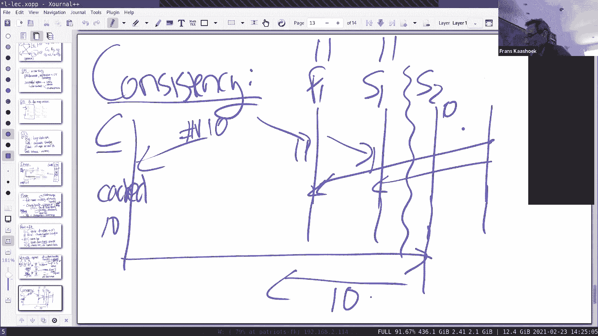

我们看一下，你们做的就是我想的，在这篇论文的基础上，你开始思考所有有问题的情况。这正是你对一致性的看法，当你开始考虑一致性时，你需要考虑所有可能的失败，并争论这些失败是否会导致不一致。所以，有一件事。

我们来谈谈这个情况，我们有一个 master ，我们有一个 primary ，我们假设 primary 和 master 断开连接，让我以稍微不同的方式来画这幅图，master 在中间。

我们这里有服务器， S1 S2 ，假设 S2 是 primary ，所以，你可能会与其他服务器交互，也许 S1 是这个 primary 的一个 secondary 。我们假设网络分裂。

所以 master 发送心跳消息，没有得到响应，什么时候 master 会指向新的 primary 。当 S2 的租约到期？是的，因为 primary 必须等待，master 必须等待直到租约到期。

因为如果租约没有到期，那么我们可能会同时有两个 primary ，P1 和 P2 同时存在，那会不会很糟糕？是的，然后我想，客户端不知道发送到哪里，master 也不知道哪一个是 primary 。

大概有些客户端还在跟这个 primary 交互，同时你也可能与这个 primary 交互，同一块的 primary 。我觉得东西会很奇怪，一些写入操作会丢失，那会是一团糟。它不会是一个[原则]。

争论哪里，所有写入的顺序，一次写入一个。所以这是一个糟糕的情况，这种情况是可以避免的，比如脑裂，有时被称为脑裂，那里你最终会得到一个有两个 master 的系统。这里避免这个问题，因为使用了租约。

master 不会指定任何其他 primary ，知道第一个 primary 的租约到期，它知道即使 primary 是运行的，但它无法达到，但对其他客户端来说可能是合理的。

那个 primary 将不再接受任何写入消息，因为租约已经到期了。这能理解吗？好的，在结束之前，让我再说一件事，抱歉，因为我有一些技术问题。

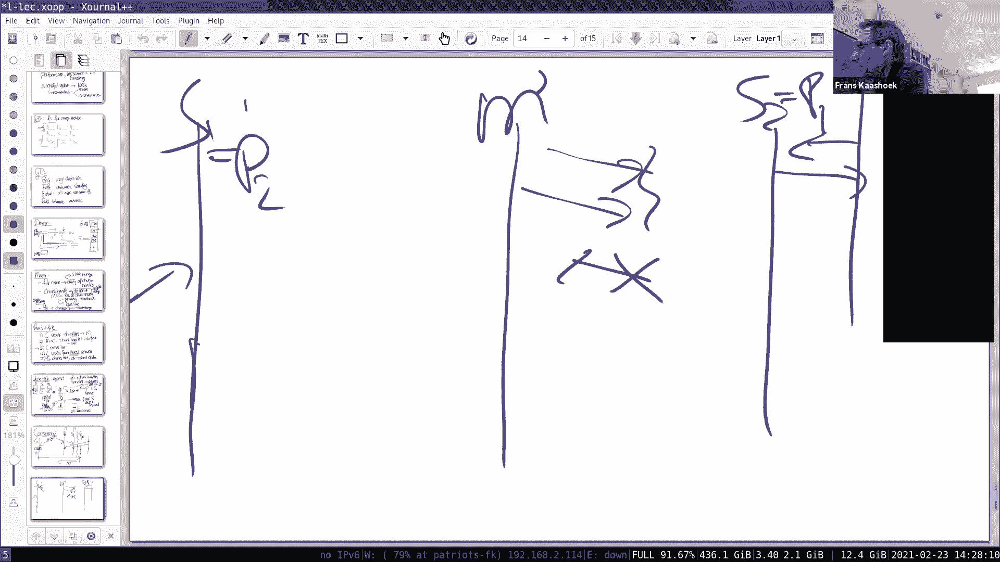

但我想再说一个点，这也是在分组会议室讨论中提出的，那就是如何才能做得更好，如何获得强一致性，或者只是变得更强，获得了相当强的一致性，不是关于的问题。所以有很多不同的方法来做，事实上，我们将要看到的。

我认为这里经常出现的一个问题是，除了获得 primary 然后报告，以增量方式写入，这可能不是个好主意，所以你可能想要做的是，更新所有 secondary primary 或者不更新。

但不是在这个设计中，有些更新了，有些可能没有更新，这对客户端是可见的。所以有很多技术或协议，改变你可以做的，会让它变得更好，事实上，你将在实验 2 和 3 中看到，你将构建的系统具有更强的属性。

处理并发的场景，从而实现一致性。事实上，如果你看看 Google 自己，我们之后会看到，Google 建造了更多的存储系统，其他一致性更强的存储系统，并且针对不同的应用领域做了定制，比如。

在学期中看的 Spanner 论文，它是具有更强大的一致性存储，甚至支持事务。但应用程序领域是完全不同的，你可以在这里看到，GFS 是量身定制的，为了运行 mapreduce 作业。好的。

我希望这是一个关于一致性的有用的介绍，开始思考这类问题，因为它们会重复出现一系列问题，将在本学期余下的时间里体现出来。很抱歉，超出一些时间。谢谢。如果你们想问更多的问题，可以继续，请随意提问。

如果你必须上另一节课。

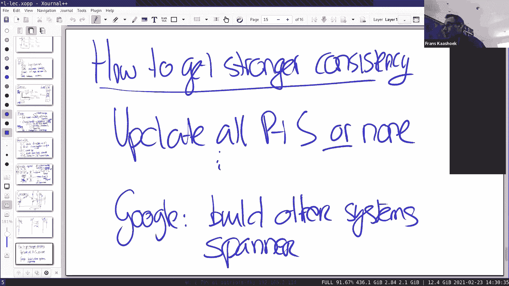