# 课程 P3：Lecture 3 - GFS 🗂️

在本节课中，我们将要学习 Google 文件系统（GFS）的设计与核心思想。GFS 是一个为大规模数据处理（如 MapReduce）而设计的分布式文件系统，它通过复制实现容错，并在性能与一致性之间做出了独特的权衡。

## 存储系统的重要性

存储系统在分布式系统中占据核心地位，主要原因在于它是一个实现容错的关键组件。基本思想是，如果你能建立一个持久的存储系统，那么你就可以构建无状态的应用程序。应用程序本身不保存任何持久状态，所有状态都交由存储系统管理。这极大地简化了应用程序的设计，因为应用程序崩溃后可以快速重启，并从分布式存储系统中恢复状态。这种架构模式在当今的网站中非常普遍：一个存储后端保存状态，而应用服务器则处理计算逻辑。

然而，设计一个容错的存储系统并非易事。

## 设计分布式存储的挑战

设计的主要驱动力是追求高性能。为了获得高性能，数据必须在多台服务器间进行分片，因为单台服务器的磁盘和网络吞吐量有限。GFS 的目标是支持 MapReduce 这类应用，因此它需要处理数千台机器上的数据。

但是，使用多台服务器就意味着会面临故障。随着机器数量的增加，故障会变得司空见惯。为了获得容错能力，传统的方法是使用**复制**，即将数据复制到多个磁盘上。这样，当一台服务器故障时，其他副本仍能提供数据。

然而，复制带来了新的挑战：**数据不一致**。如果多个副本的数据不同步，就会导致不一致。为了避免不一致，如果我们想要**强一致性**，那么复制系统的行为就必须像未复制的单一系统一样。这通常需要引入分布式协议来协调副本，而这类协议可能涉及消息传递和磁盘读写，从而可能降低性能。

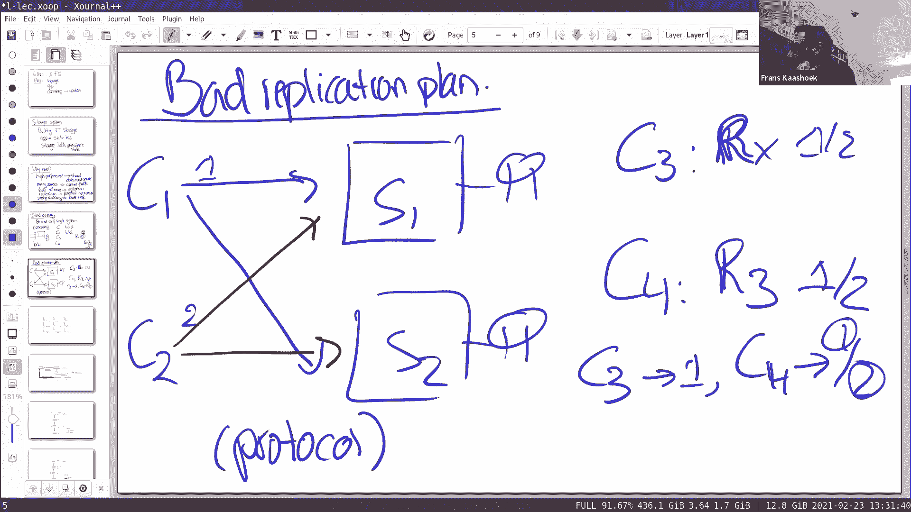

因此，我们看到了一个基本难题：我们想要高性能（需要多台服务器和复制），也想要容错（因为服务器众多），但这可能导致不一致。为了解决不一致，我们需要协议，而这又可能损害性能。这个在一致性、性能和容错之间的权衡，是设计分布式存储系统的核心挑战。

## 什么是一致性？

上一节我们介绍了分布式存储面临的一致性挑战，本节中我们来看看一致性具体指什么。从高层次看，理想的一致性意味着整个系统表现得像一台单一的、未复制的机器。

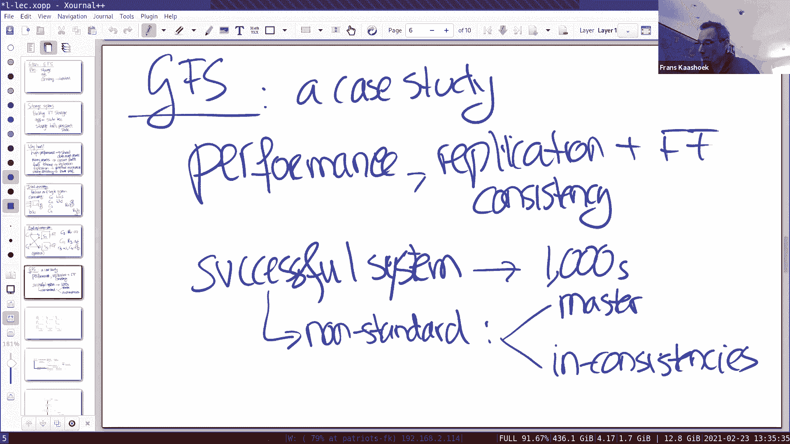

有两种主要风险使得实现这种行为变得困难：**并发**和**故障**。我们先从并发开始讨论。

即使在一台单机中，如果有多个客户端并发访问，也需要考虑一致性。例如，假设有两个客户端 C1 和 C2 同时向同一个键 `x` 写入值 `1` 和 `2`。随后，第三个客户端 C3 来读取 `x`，它可能读到 `1` 或 `2`，这都是合理的，因为写入是并发的。但如果 C3 读到了 `1`，之后第四个客户端 C4 再来读取 `x`，我们希望 C4 也读到 `1`，而不是 `2`。服务器可以通过锁等机制来强制这种顺序。

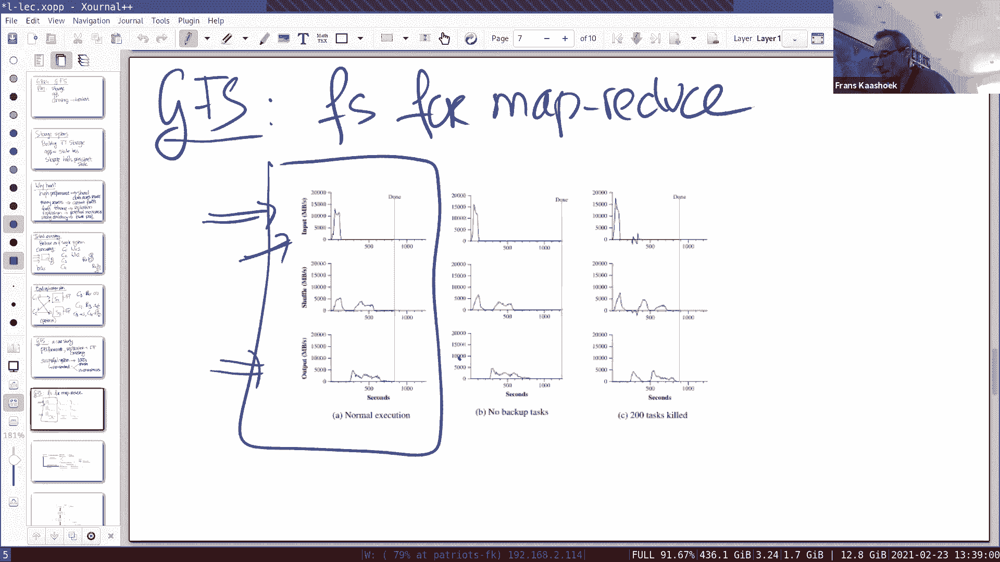

在分布式系统中，第二个风险是**故障**，通常与复制相关。

## 复制与不一致性

假设我们有两台服务器 S1 和 S2，都存储数据 `x`。我们采用一个非常简单的复制方案：客户端写入时，无需协调，直接写入两台服务器。客户端 C1 写入 `x=1`，同时 C2 写入 `x=2`。

那么，客户端 C3 读取 `x` 时，可能从 S1 读到 `1`，也可能从 S2 读到 `2`。更糟糕的是，如果 C3 读到了 `1`，而紧随其后的 C4 却读到了 `2`，这对于应用程序开发者来说将非常难以处理。这种不一致性是因为缺乏协调客户端读写的协议。

因此，我们需要某种分布式协议来协调，以确保获得期望的一致性。本课程后续会研究许多不同的协议，它们在容错和一致性方面有不同的权衡。今天的案例研究就是 **GFS**。

## 为什么研究 GFS？ 🎯

GFS 是一个有趣的案例研究，因为它集中体现了上述所有核心问题：它旨在通过复制实现高性能和容错，同时又要应对保持一致的难题。

GFS 也是一个成功的系统，被 Google 实际使用，并启发了后续系统如 Colossus 和 Hadoop HDFS。有趣的是，在 GFS 论文发表的年代（约2000年），分布式系统的概念已为人知，但没有人构建出能在数千台机器规模上运行的系统。GFS 的设计有两个非标准之处：
1.  它采用**单一主节点（Master）** 负责协调，而非当时学术界推崇的多主复制。
2.  它**容忍一定程度的不一致性**，而非追求强一致性。

这种基于实际需求（尤其是 MapReduce 工作负载）的务实设计，使得 GFS 在巨大规模下能够运行，这令人印象深刻。

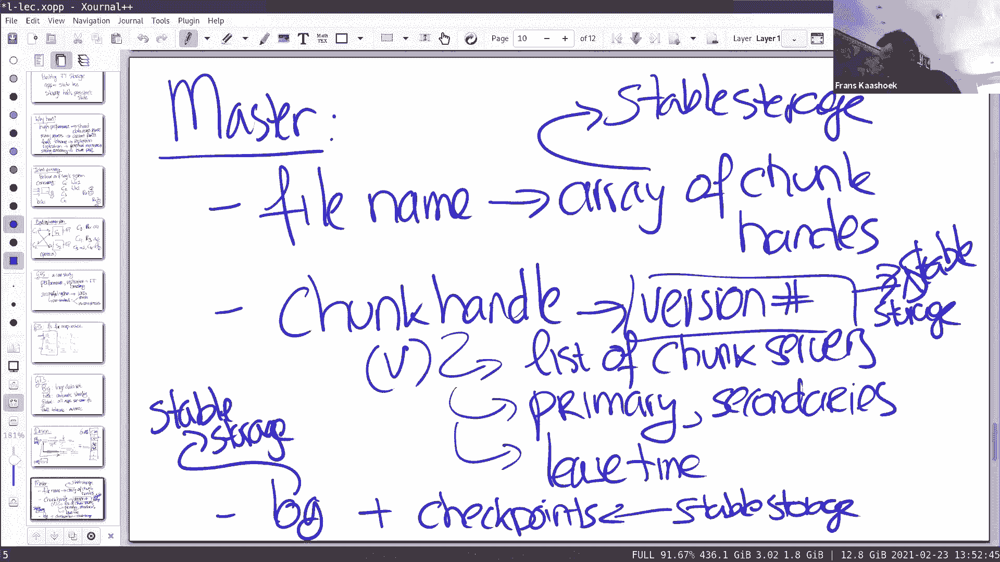

## GFS 的设计目标与性能

GFS 可以看作是 MapReduce 的文件系统。其设计目标是支持多个 MapReduce 作业并获得高性能。从 MapReduce 论文中的性能图可以看出，Mapper 从 GFS 读取输入数据的速率可以超过 10，000 MB/秒。

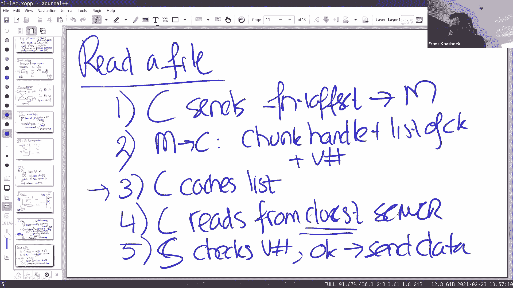

考虑到当时单个磁盘的吞吐量大约为 30 MB/秒，要达到 10，000 MB/秒，需要数百个磁盘并行工作。GFS 正是通过将文件自动分片到大量磁盘上，允许多个客户端并行读取，从而实现这种高性能。

GFS 的关键属性包括：
*   **大数据集**：存储如全网爬取数据。
*   **高性能**：通过分片和并行实现。
*   **全局共享**：所有应用看到统一的文件系统视图，方便数据共享。
*   **容错**：自动处理常见的服务器故障。

## GFS 架构总览 🏗️

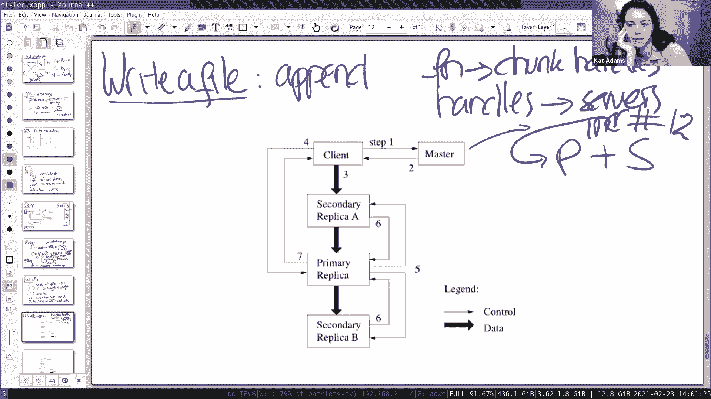

上一节我们了解了 GFS 的目标，本节中我们来看看它的具体架构。GFS 不是普通的 Linux 文件系统，而是专为大型计算设计的。

以下是其核心组件和交互流程：
1.  **客户端**：应用程序（如 MapReduce 任务）。
2.  **主节点（Master）**：单一节点，管理文件系统元数据（文件名到块的映射、块位置等）。
3.  **块服务器（Chunk Server）**：多个节点，实际存储 64 MB 的数据块（每个块作为一个 Linux 文件存储）。

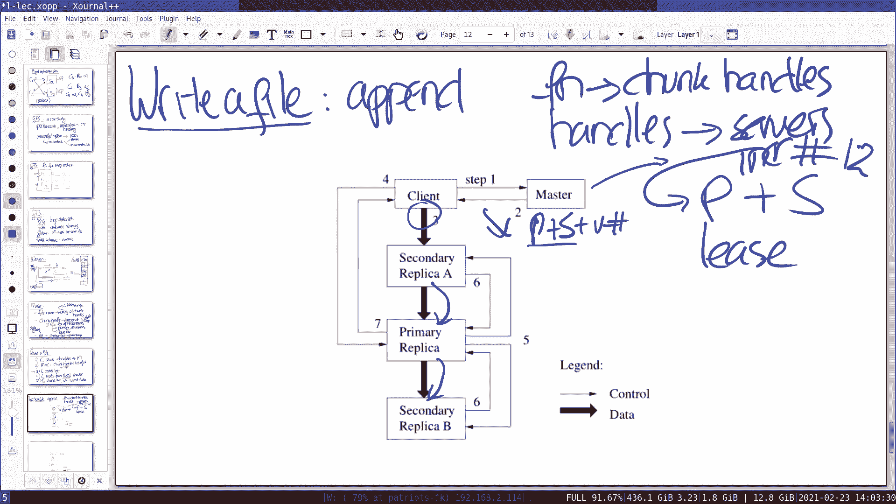

**读取流程**：
*   客户端向 Master 发送请求（文件名 + 偏移量）。
*   Master 回复对应的**块句柄（Chunk Handle）**、**块服务器列表**以及**版本号**。
*   客户端缓存这些信息，然后直接向最近的块服务器请求数据。
*   块服务器检查版本号，如果匹配则发送数据。

**写入/追加流程**（更复杂，涉及一致性）：
*   客户端联系 Master 获取块的主副本（Primary）和次级副本（Secondary）位置及租约信息。
*   客户端将数据推送到所有副本（管道式传输以优化网络利用率）。
*   数据到达所有副本后，客户端通知 Primary 开始写入。
*   Primary 为写入分配一个序列号（确定顺序），并指示所有 Secondary 写入。
*   所有副本成功写入后，Primary 回复客户端成功。若有副本失败，则回复客户端失败，客户端通常会重试。

这种设计使得数据读写可以绕过 Master，直接与块服务器进行，从而获得高吞吐量。Master 只处理元数据请求，负载得以减轻。

## Master 节点的状态与容错

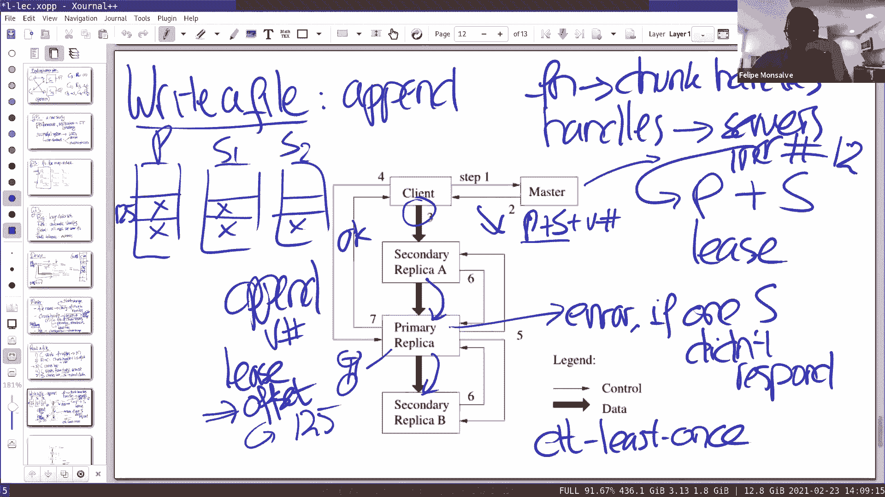

Master 是系统的控制中心，它维护以下状态：
*   **命名空间**：文件名到块句柄列表的映射。
*   **块信息**：每个块句柄对应的版本号、副本位置列表（包含 Primary 和 Secondary）、Primary 的租约到期时间。

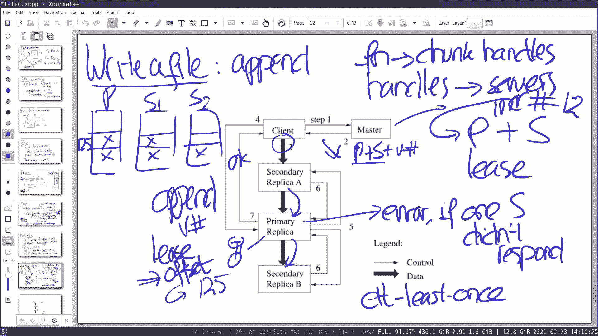

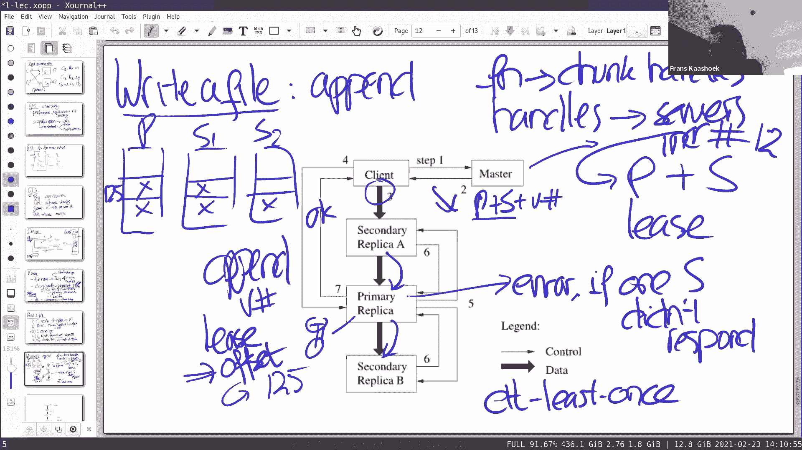

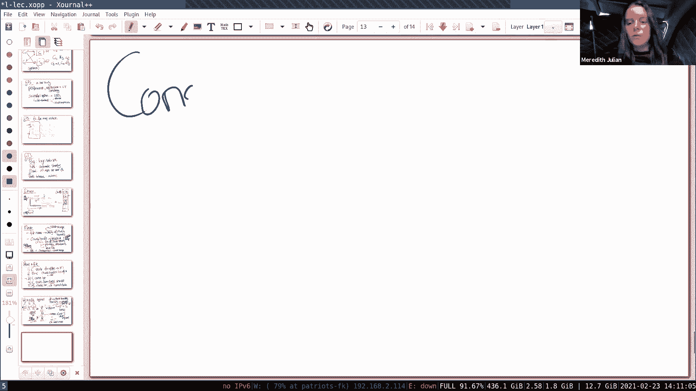

为了容错，Master 将所有元数据变更记录到**操作日志**中，并在响应客户端前将日志写入稳定存储。这样，即使 Master 崩溃重启，也能通过重放日志恢复状态。为了加速恢复，Master 还会定期创建**检查点**。

关于状态持久化的问题：
*   文件名到块的映射**必须**持久化到稳定存储（通过日志），否则文件会丢失。
*   块到服务器的映射是易失的，Master 重启后可以通过询问块服务器来重建。
*   版本号**必须**持久化，用于区分新旧副本。

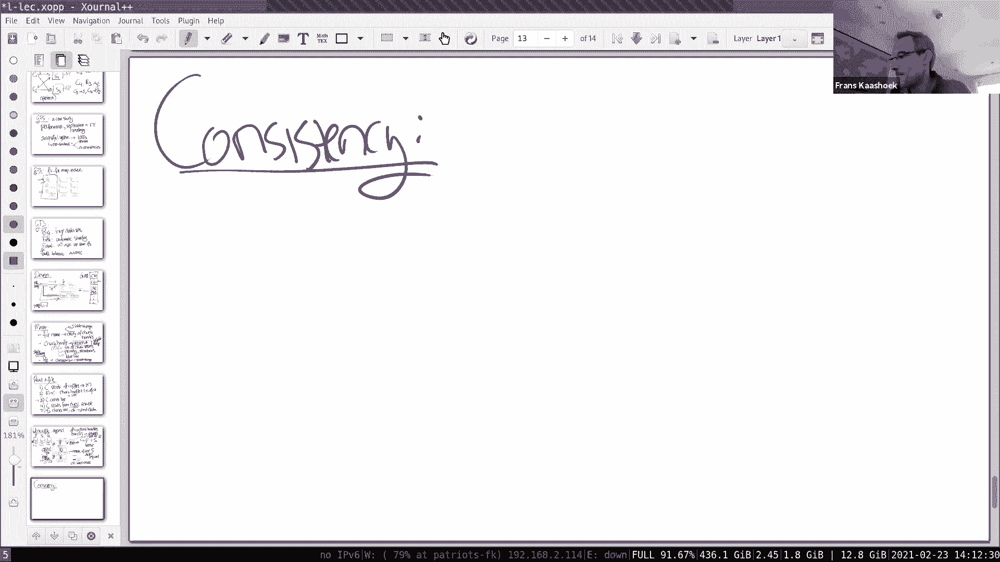

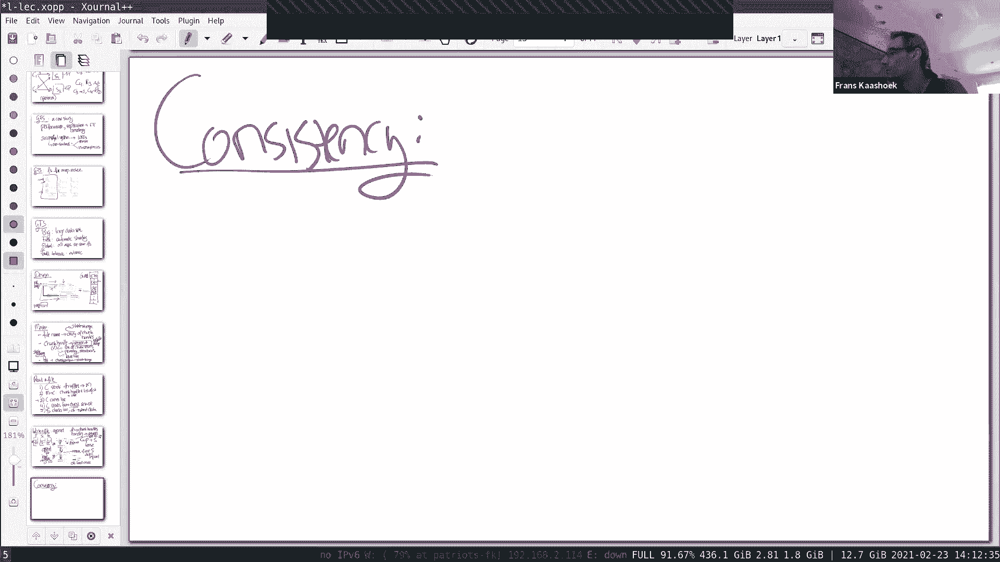

## GFS 的一致性讨论 🔍

GFS 为了性能，在某些情况下牺牲了强一致性。它提供的一致性模型可以概括为：
*   **确定性的写入**：在 Primary 协调下，所有成功的写入在所有副本上顺序一致。
*   **并发的写入**：可能被破坏，但文件区域会被标记为“已定义”（包含写入的数据）或“未定义”（可能包含重复或垃圾数据）。
*   **记录追加**：GFS 保证数据至少被原子性地写入一次，但可能会因为重试而产生**重复记录**。应用程序需要能够处理这种情况（例如，通过记录ID去重）。

以下是一些可能导致读取到旧数据（不一致）的场景：
1.  **客户端缓存了过期的副本位置**：客户端从 Master 获取了块服务器列表并缓存。之后，某个副本失效，Master 更新了版本号和副本组，但缓存的客户端仍向旧的副本读取，可能读到过时数据。
2.  **租约与网络分区**：如果 Primary 与 Master 之间发生网络分区，Master 必须等待 Primary 的租约到期后才能指定新的 Primary，在此期间系统可能无法写入，但可以避免出现“脑裂”（两个 Primary）的严重不一致。

GFS 的设计是务实的，它针对 MapReduce 这类批处理工作负载进行了优化，容忍了某些不一致性以换取极高的吞吐量。对于需要更强一致性的应用，Google 后来开发了其他系统（如 Spanner）。

## 总结

本节课我们一起学习了 Google 文件系统（GFS）。我们首先探讨了分布式存储系统的重要性及其在容错中扮演的关键角色，并分析了设计这类系统时在**性能**、**容错**和**一致性**之间面临的固有挑战。

接着，我们深入研究了 GFS 的设计。GFS 通过**单一 Master** 管理元数据、**分块存储**、**副本复制**以及**客户端直接与块服务器通信**等机制，实现了为 MapReduce 等批处理任务量身定制的高性能。我们详细剖析了其读写流程、Master 的状态管理与容错机制。

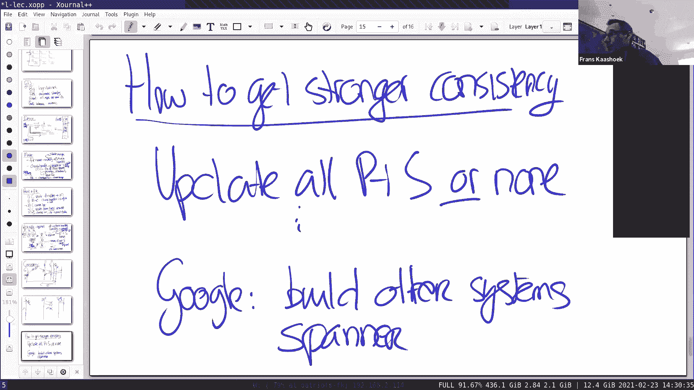

最后，我们重点讨论了 GFS 的一致性模型。GFS 并非提供强一致性，它允许在故障恢复时产生重复记录，并且客户端可能读取到过时数据。这种设计是其追求极致吞吐量所做的权衡，也体现了分布式系统设计中根据应用需求进行折衷的务实思想。理解 GFS 有助于我们把握分布式存储的核心问题，并为学习后续更复杂的系统奠定基础。