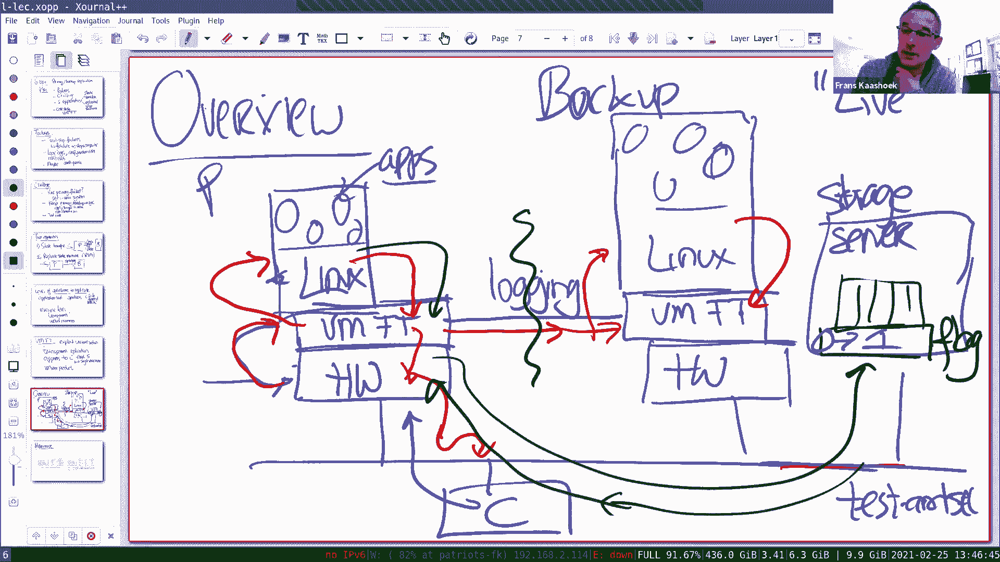
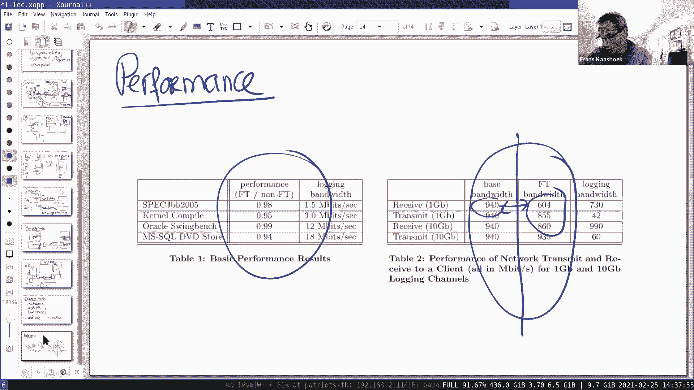

# P4：Lecture 4 - Primary-Backup Replication - mayf09 - BV16f4y1z7kn

好的，下午好，早上好，晚上好，无论你在哪里。今天我想谈谈主/备复制，是对主/备应用程序的介绍。我们将在本学期的多节课中讨论这一点，但这是[]或 VMware 容错论文，是一个非常好的介绍。

引出了很多问题，在整个学期都会出现这样的问题。今天课程的计划如下。我想谈谈失败，你可能希望使用主/备复制来容错，而有些你可能做不到。然后我想谈谈主要挑战，关于备份的方案，从广义上来讲。

然后谈谈两种主要方法，两种应用，一种是通常称为状态转移复制，第二个通常称为复制状态机。今天的论文是复制状态机方法的一个例子，实际上，实验 2 或实验 3 ，实验 4 ，也将使用复制状态机方法。

以及 GFS 论文复制块，也是使用复制状态机方法。因为这是一种相当常见的方法。然后为了让事情更具体，通过观察这个案例研究，VMware 容错方案或实施或系统。在我开始之前有什么问题吗，只是为了。

我试着回答你们通过电子邮件发送的所有问题，在前半夜之前来的，一般都会在后半夜回答，尽可能多地回答，但如果我没有回答你的问题，然后，这个话题在上课时或任何时候出现，可以随意打断，然后提问。好了。

在我们开始之前，有什么问题吗？所以，让我们从非常广泛的意义上讨论失败，你可以大致了解，我们希望复制方案能够处理的（失败）。所以，首先，通常情况下，论文中所要构建的系统，只会处理一些事情。

通常称为 fail-stop 失败，基本的想法是，基础设施故障，或计算机组件不能很好地工作，使计算机停止运行，所以假设是，计算机瞬间从工作到不工作，它不会产生奇怪的结果，因为计算机不能正常工作。

所以跟据这个协议，当你对寄存器值相加，它会产生相加值，所以我们假设，当计算机工作时，它就会正确工作，当有失败的时候，它就会停止。这会包括许多情况，比如，无论计算机风扇出现故障，计算机过热。

然后计算机自动关机，其他情况是有人跨过电源线，然后突然，整个电脑都消失了，或者切断网络连接，在这个时刻，计算机保持运行，但完全断开了连接。有时计算机本身的系统或软件。

最好的做法是将部分故障转变为 fail-stop 失败，例如，软件计算数据的校验和，然后，如果它发现校验和不正确，可以直接停止计算机。所以这些都是很常见的，要做到这一点，这个词的意思是，计算机正常工作。

然后计算停止。那么，这排除了什么，有一大堆的失败被排除了，例如，它不能很好地处理逻辑错误，比如，如果你的软件有错误，无论你除以零，或者你不应该有的错误，然后非常可能，备份也会做同样的事情。

因为其中一个软件是坏的，所以，它在主机上出现故障，也在备份机上出现故障，所以，复制不能，不能为你解决这类问题。类似地，如果你有配置错误，主/备不会为你解决这类问题，如果你指定的文件，复制说不正确。

那么系统将不能正常工作。同样，我们不在这节课上，我们会在学期末讨论，但我们不能处理恶意错误，所以不能处理试图伪造协议的攻击者，运行服务器发送错误消息，并试图戏弄整个系统，这不在我们考虑之列。

所以在这学期的大部分时间里，我们假设软件工作正常，没有逻辑错误，没有配置错误，我们关注的事情是处理停止失败。有一些失败，是可以使用主备复制处理的，或者不可以，比如，你可能会想到地震。

如果主备在物理上是分开的，在完全不同的地方，在不同的大陆或同一大陆的不同部分，在这种情况下，你可能会希望，你可能会希望，备机可以接管，如果主机因为地震发生故障，但是其他一些复制方案，情况不会是这样的。

主备在同一个数据中心，整个数据中心都会消失，那么故事就结束了。好的？希望这能给你一些背景知识，关于你试图解决的失败类型。即使只关注 fail-stop 故障，也很难建立容错系统。

我们将讨论一下会出现的一般性问题，如果我们要建立一个主备系统，在 VM FT 论文中有具体的这些问题。所以一个挑战是，如果失败发生，主机真的失败了吗？让这件事变得具有挑战性的一个问题是，在分布式系统中。

你无法区分网络分区和机器故障，所以完全有可能，网络， primary 还在运行，初选还在继续，但是有些计算机不能与 primary 交互，因为网络已经分区，比如， backup 可能会决定。

primary 已经失效，因为网络分区，但是实际上 primary 并没有，也许有些客户端还能访问 primary ，所以你必须有一些[故事]，来确保你不会陷入有两个 primary 的情况。同样地。

我们上一次讨论了，它再次出现在这篇论文中，下周也会出现，我们想要避免陷入这样的境地，有一个脑裂系统，我们有两个 primary ，一个客户端子集访问一个 primary 。

另一个客户端子集访问另一个 primary ，很明显这会产生系统状态的分歧，当网络恢复时，我们处于错误的状态，所以，我们必须不惜一切代价避免这种情况。第二个挑战是，我们如何才能保持，如何使主备保持同步。

我们的目标是，如果 primary 出现故障，然后，我们可以正常地切换到 backup ，backup 在 primary 停止的地方重新开始，这要求 backup 总是最新的。

有 primary 已经写入的最新状态，以便操作可以无缝进行，而不会向客户端返回错误或无法响应，从客户的角度来看，真正看起来，即使它是复制的，就像一台计算机，只是比一台计算机具有更强的容错能力。

事实证明，这是困难的，首先，我们必须确保我们应用所有的变更，我们必须按正确的顺序应用变更，在连续性问题中，我们必须避免非决定论，或者我们必须解决非决定论，我的意思是。

相同的更改在 primary 的行为与在 backup 上的不同，因为出于某种原因，这样并不好，我们必须确保，我们在主备上做的变更，对主备有完全相同的作用。一个经常出现的问题，一个挑战就是故障转移。

你的主机出现故障，我们需要切换到备机，当然我们必须确保，其他主机已经停机，但是，比如主机可能在操作过程中，它即将发送一个数据包，对客户端进行回复，也可能不是，所以我们要弄清楚，响应已经发送或没有发送。

或者我们可以再发一次。聊天中有一个问题，什么时候需要进行故障转移，当主机停机后需要故障转移，因为我们想要故障转移到备机，这取决于你的使用。然后，另一个故障转移的问题是，我们有多个备份。

不是今天论文中的情况，是的，我们要问的是最新的[阶段]，比如，可能在一些操作后，它们都会崩溃，它们回来，我们要确保，我们与有最新的状态服务器交互，这不是今天的一个问题，我们稍后会知道为什么。

但我们之后会在其他复制协议中介绍。是的，所以故障转移意味着备机接管。好的，这就是主要失败，我们希望处理的失败类型和主要挑战，随着我们继续，将会深入讨论这些挑战。我想谈谈两种主要的方法。

我们将在一个学期内看到，用于处理主备复制。一个是我前面提到的状态转移，这些从高层来说是非常直截了当的，我们有主机，如果客户端与主机交互，主机更新状态，响应于客户端请求而更新状态，每隔一段时间。

会有一个检查点，每隔一段时间，检查点将状态给备机，当然，如果我们希望备机和主机同步，这意味着每次主机执行操作，在响应客户端之前，它必须传输操作所做的状态变更到备机。所以这是一个方案。另一种高级别的方法。

第二种方法是，称为复制状态机，状态机复制，通常简称为 RSM 。在这里，图片是，我们仍然有主机，我们有客户端访问主机，当然，我们有主机与备机交互，以保持备备机同步，但是不是发送状态变更，从主机到备机。

而是发送操作给备机，所以，在主机响应客户端之前，执行它的操作，我们将客户端发送给我们的操作发送给备机，备机也可以执行操作，更新状态，向主机确认，主机也更新它的状态，执行操作，然后将响应发送回客户端。

所以在所有这两种方法中，计划是主机有一些状态，我们应用变更到这些状态，我们对备机做完全相同的操作，备机与主机有相同的开始状态，我们将同样的变更应用于状态，通过操作状态转移，我们最终进入了一个新的状态。

并且该状态必须与主机的状态相同。所以，如果失败了，我们故障切换到备份时，它与主机的状态完全相同，所以，它可以接管。我们会看到这是一种挑战，但这是基本的计划，两种方法都是很受欢迎的。

状态转移方法的主要缺点是，如果一个操作生成很多状态，那就会很昂贵了，对于单个操作写入千兆字节的数据，然后千兆字节的数据需要传输到备机，而且它可能要昂贵得多，便宜得多，只把操作发送给备机。

备机就可以执行操作。我们讨论的许多系统，它们使用第二种方法，它们发送操作，而不是状态转移。事实上，如果你想一想 GFS ，上周讨论的，我们可以看到，主机发送追加操作或写入操作给备机，不是执行追加操作。

然后将结果发送到备机，它实际上发送操作，所以这是复制状态机方法的一个示例，我们将发送操作。今天的论文也遵循了复制状态机的方法，操作不是追加和写入，文件系统附加，文件系统写入。

而是这些操作是 x86 指令，我们稍后会看到，但它们都是发送操作。在实验中，正如我前面提到的，实验 3 和实验 4 也是复制状态机方法，我们发送操作从主机到备机。作为。聊天中有个问题。

为什么客户端不需要发送数据给备机，在我们的复制状态机中，因为这个想法是这些操作是确定性的，所以主机，你记得，我们会更详细地讨论这个，但是主备处于相同的状态，相同的状态，如果操作是确定性的。

你把它应用于相同的状态，它们最终会和主机处于相同的状态，所以，应用程序、客户端没有理由发送数据，在这种情况下，因为只要发送这个确定性的操作，就可以保证，操作将生成相同的数据。所以接下来的问题是。

怎么知道所有程序和操作，它们是确定性的还是非确定性的，知道需要发送哪些信息。所以在复制状态机方法中的典型做法是，使所有操作都是确定性的，不允许非确定性操作，我们很快会看到如何做到这个。好的。

在你知道更多细节之前，有一种混合方法，是的，有一种混合方法，例如，你可以运行，默认情况下以复制状态机方法，实际上，这篇论文在某些方面做了这一点，如果备机失败或主机失败，你回到一台单独的机器，然后。

你需要创建一个新副本，通常对于你创建的新副本，它是通过转移现有副本的状态，或复制现有副本的状态到新的副本，不是那么频繁的操作。然后在，然后频繁地复制你正在做的操作。同时可以实时自由地提问。

而不是在聊天中打字，哪种方式都可以，但是。好的，正如我提到的，使用这种复制状态机方法，有一个问题，执行什么级别的复制，或要复制什么级别的操作。一种可能是应用程序级别的操作，所以我的意思是。

回想一下 GFS ，比如它的文件追加或写入。另一方面，好的，如果你玩一个复制状态机的游戏，在应用程序级别的操作上，这意味着必须涉及到应用程序，因为它知道这些操作的语义是什么。它知道追加实际应该做什么。

或者写入应该做什么，所以，如果你使用复制状态机方法，在应用程序级别，那么需要修改应用程序本身，以执行或作为复制状态机方法的一部分。今天我们看的论文，有一件很酷的事情，今天看的是，在机器层面的操作。

或处理器级别或计算机级别，所以状态是 x86 寄存器，内存状态，操作是传统的计算机指令，通过在这个级别进行复制，可以使你的应用程序完全透明，因为你可以使用一台计算机，在它上面运行应用程序和操作系统。

只是运行 x86 指令，并且这个复制状态机方法，自动创建特定执行的备份，所以应用程序根本不需要修改，实际上，在这个论文中，操作系统并没有被修改，应用程序没有被修改，你可以使用普通的应用程序。

甚至在编写时都不用考虑容错，使用这种机器级或指令级复制，它可以透明地复制。一件非常酷的事情，关于今天的论文，它是完全透明的。这让你想知道怎么去做，因为会发生什么，如果你查看机器，一个中断发生。

那个中断需要以某种方式直接传播到备份，因为如果你考虑 x86 机器，当然，应用程序执行的常规指令，比如加法，除法，条件分支过程调用，但是还有其他事件，比如中断，它们也需要被处理，那么你如何做到这个。

所以，一种传统的进行机器级别复制的方式，使用起来相当昂贵，从某种意义上说，你可以购买计算机或者处理器，可能复制两到三次，硬件本身会组织这些处理器，完全同步地运行，有很多硬件设备可以实现这一点。

这篇论文有一个很酷的观察，你并不需要进行真正的硬件复制，相反，你可以使用虚拟机，这就是他们的做法，纯硬件复制也会发生，例如，在[]或[]中，硬件模块通常是，双重复制或三重复制，并且有使硬件表决方案。

使处理器保持同步以检测故障，但是这种级别的容错，不是 VM-FT 论文所讨论的级别，考虑一下，你在计算机上运行商业应用程序，你希望使业务应用程序具有更强的容错能力，而采取的方法是利用虚拟化。所以。

 VM-FT 的情况是利用虚拟化，这是主要的想法，他们为解决这个问题而提出的，通过这样做，他们可以使复制对应用程序透明。当然，你不需要设计，比如应用程序的复制方案，例如在 GFS 中的复制方式。

使用这个方案，VM-FT 使用的复制方案，呈现给客户端，服务器是单独一台机器，意思是，我们稍后会看到是怎么回事，但它们会提供非常强的一致性，外部的客户端甚至看不出来。而且，这篇论文是很酷的论文。

因为它是一个真正的产品，而且它还在使用中，如果你愿意的话，可以获得这种支持。我认为目前的产品有些不同，与我们在论文上看到的，但是在高的级别上，这些问题非常相似，事实上，最大的缺点之一。

就像你们中的许多人在问题中指出的那样，论文中的一个[]，这是一个单核心解决方案，所以不存在多核支持，所以一台计算机上的多个程序或多个线程不能并行运行，稍后我们将会讨论，为什么这个解决方案不支持。

我想后来的 FT 版本可以支持，但是没有论文详细描述它，但是我认为，不是使用复制状态机方法，而是使用状态转移方法，但是我也不知道任何细节。我们将重点介绍复制状态机方法，因为我喜欢这篇论文的一个原因是。

因为它以一种非常清晰的方式说明了复制状态机方法，所有后续的复制方案，我们要看的（复制方案），都是复制状态机方法。好的，让我们来描述这个系统的概况。所以首先要注意的是，有一个虚拟机监控器。

那么什么是虚拟机监控器，虚拟机监控器使用一块硬件，并产生 n 块硬件，如果我们看一下 x86 盒子，我们可以在它上面运行一个虚拟机监视器，在它之上，我们可以有虚拟机，我们有多个虚拟机。

尽管篇论文的大部分内容我们讨论的是，在虚拟机监视器之上运行一个虚拟机。例如，我们可能有一个 Linux 操作系统，和它的应用程序一起运行在虚拟机上。这里是实际的硬件。为什么虚拟机。

这里使用的术语有时称为 hypervisor ，它被称为虚拟机监控器，在我们的例子中，这里的虚拟机监视器，实际上就是 VM-FT ，它是经过修改的虚拟机监视器程序，包括 VM-FT 的想法。

为什么这很酷，这很酷的原因是，或者对复制状态机很有用的原因是，因为即使一个硬件中断发生，硬件中断不会直接到 Linux ，事实上，硬件中断首先通过虚拟机监视器，虚拟机监视器决定。

什么时候将中断传递给 Linux 。所以，任何外部事件在被虚拟机观察到之前，可以由虚拟机监视器捕获。所以这让我们摆脱了这个困境，就像我刚才提到的，如果有外部中断会发生什么，我们如何才能复制它。

我们要在这里复制的方式是，因为虚拟机监视器会控制它。我们会看到一个非常强大的工具，真正使指令具有确定性，处理外部操作，等等。所以基本的计划是，如果出现中断，无论是从网络来的中断，或者来自硬件本身。

比如定时器中断，基本上定时器中断被传送到虚拟机监视器，然后在 VM-FT 的情况下，虚拟机监视器会做两件事，不仅会在某个时刻把它传递给应用程序，它还通过日志通道将其发送到备份计算机。

备份计算机与硬件相同的方式构建，它有一个虚拟机监视器，所以还有另一个 VM-FT ，在它上面是一台虚拟机，是运行的确定的软件，比如 Linux ，相同版本的 Linux ，以及不管什么应用程序。好的？

如你所知，这些机器在网络上都使用日志通道，也许你的客户端和硬件交互，通过网络发送数据包，实际的硬件会收到那个数据包，然后，它会发送它，虚拟机监视器获得控制权并发送它，硬件发送给虚拟机监视器。

虚拟机监视器获得它。所以，如果你仔细想想，这个数据包结果是中断，发送给虚拟机监控器，虚拟机监视器将发送中断，你会在稍后看到，然后发送给备机，也将它发送给本地虚拟机。本地虚拟机只是在运行 Linux 。

它看到我被中断了，所以它会进行正常的处理，它总是会处理中断，在某个时刻，它可能会产生回应，例如，可以写入网卡，或者至少它认为写入网卡，但它实际上是一个虚拟网卡，是由虚拟机监视器模拟的，所以。

当写入很多指令到这个虚拟网卡时，实际写入到虚拟机监视器，而虚拟机监控器会看到，这是操作系统想要发送数据包，然后，虚拟机监视器可以，将数据包发送到操作系统之外，通过对真实硬件进行编程。

然后是真正的硬件发送响应给客户端。这是一次正常的执行，这里是主机，这里是备机，基本上，在备机上也会发生同样的事，如果机器在完全相同的状态下启动，它们同时接收中断，虚拟机监视器控制何时中断。

它可以安排来确保，中断在完全相同的时间发送，以主机得到的完全相同的指令（发送）。所以，它会将中断发送到，将从主机接收到中断，可能会缓冲一段时间，直到备机随后得到主机同样的指令。

然后将中断发送给 Linux ，Linux 是一种常见的方式，它会，因为它和主机的状态完全一样，它将与主机做完全相同的事情，在某个时刻，它会，编程虚拟网卡发送响应数据包，所有这些事情都会发生。

在某些情况下，发送一个数据包，虚拟机监视器将获得控制，它知道自己的备机，所以它什么也不做，它并不会向网络上发送数据包，因为这是备机。好的，这是基本的计划，然后，这个故事还有一个组成部分。

认识到这一点很重要，那就是在一边，在机器网络上，有一台存储服务器，你可以把它想象成硬盘，对于这两个虚拟机，当应用程序写入文件时，它会变成，内核将会，文件系统可能会挂载在本地 Linux 操作系统上。

Linux 操作系统认为这是一个远程磁盘，将会格式化数据包，并将数据包发送给，让我使用不同的颜色画一下，将会发送数据包到虚拟机监视器，虚拟机监控器将它发送出去，虚拟机监视器发送。

通过网络将它发送到存储服务器，存储服务器将在某个时刻响应，在某些方面，这种通信是一样的，就像有一个客户端在网络的另一边，唯一的区别是，在存储服务器的情况下， Linux 启动通信，而在其他情况下。

客户端启动通信，绿色箭头表示与存储服务器的通信，所以一个网络数据包发送，通过 Linux ，再通过虚拟机监视器到存储服务器。所以，应用程序向文件写入，会导致这些消息，然后更新任何状态。

在存储服务器上持久化状态。正如我们在论文中看到的，存储服务器扮演一个额外的角色，在存储服务器的基础上，也就是，这里有一个特殊的标志在旁边，或者在存储服务器上有一个块，它用来仲裁失败后谁将成为主机。所以。

这一切都归结为，这是失败转移计划的一部分，所以，我们看看日志通道中断，或者到虚拟机监视器的方法是，它定期通过日志通道发送数据包，而且它没有从另一边得到任何回应，然后假设另一边，有一个问题，当然。

它不能决定，只是网络不工作，或者是计算机真的崩溃了。如果它真的崩溃了，当然，你应该接手，如果它没有真的崩溃，那么我们需要某种方式来仲裁，确保他们中只有一个继续。让我们假设网络分区，当网络分区时。

这是一个更困难的情况，比起它们中的一个崩溃，所以，这里发生网络分区，但是注意到这两个仍然可以通信，主机和备机都可以与存储服务器通信。所以在这种特殊情况下，接下来会发生的是，它们会注意到，双方都会注意到。

主机和备机将注意到，这里有些问题，我不能与主机通信，所以在某种程度上，另一个服务器很可能已经崩溃了，我想把自己提升为主机，所以备机想把自己提升为主机，或者主机说只想继续为客户端请求提供服务。

现在只想忽略备机。这就是他们所说的继续存活，我们会回到单一模式，我们想要一个主机。所以，发生这种情况的方式是，它们两个都会试着读取，它们称为 test-and-set 操作。我会更详细地谈一谈。

但两者都连接到存储服务器，并试着写入一个标志，比如 1 ，如果该标志已经被设置为 1 ，然后就结束了，因为另一个写入 1 更早，从 0 到 1 。它们都试图以原子的方式来做这件事，其中一个首先完成。

将成功地设置为 1 ，我们可以返回到旧值 0 ，所以它知道没有其他人成功地写入 1 ，因此，我应该成为主机，让它继续运行。主备的第二个，来的第二个服务器，我们会看到，我们尝试将标志设置为 1 。

已经设置为 1 ，返回值将是 1 ，因为这是旧的值，当进行 test-and-set 操作时，因此，它将决定，好的，我要放弃，因为已经有人接替我了，正如论文中所说的，它们会终止自己。好的？

所以这是一种高级别的操作，故障高级操作。在聊天中有一个问题，是一个好问题，标志何时重置为 0 。嗯，这是一个完全不同的故事，我还在讨论，会逐渐看到，就是一旦主机运行，当我们有一个服务器运行时。

会做第二个备份，所以我们又有一个备机，我们必须做修复，因为我们不做修复，那么从两台计算机开始，一台计算机出现故障，我们就只有一台计算机，然后过一会儿，一台计算机可能出现故障，那么我们就没有计算机了。

所以必须是这样，必须有一个修复方案，在 VMFT 中，修复方案是人工执行的，如果有人收到监控的通知，然后创建一个新的复制，或者基于第一个虚拟机镜像，确保它们同步，然后它会重置标志，当日志重新开始时。

然后标志会重置，当第二个主机完成备份，跟据协议，标志就重置了。好的？好的。好的，有一个好问题，比如可能日志通道中断，可能通道到服务器也中断了，所以我们不会得到回应，这就是系统停止的时刻。

直到某些东西修复，因为什么都做不了，所以从那时起，没有客户端请求处理，因为我们不知道我们是什么状态，也许在某个时刻，网络连接得到修复，那么事情又开始向前发展，所以这是一个灾难案例，灾难案例是。

主备都在运行，但是所有网线都断了。与这个案例有些相似，主备同时失败的情况。好的。问题，你能再解释一遍吗，当客户端从存储服务器读取数据时。客户端完全不从存储服务器读取数据，可能是 Linux 。

或者在 Linux 上运行的应用程序，可能从存储服务器运行，这是一种情况。第二种情况，VM-FT 可能从存储服务器运行，以读取 test-and-set 标志。所以底部的绿色箭头，从存储服务器到 C 。

是。抱歉，那个绿色的，是个错误的绿色箭头，应该一直到这里的。好的，谢谢。只是通过网络，并不打算去 C ，它是打算通过网络。谢谢你澄清这一点，认识到这一点。好的，所以。所以我想，也许我们可以中断一下。

或者一个分组会议室，特别想请大家做的，讨论一下家庭作业的问题，我们在这里谈到了，但是我想你好好想想，理解或互相讨论，说服自己，这个方案避免了[]，脑裂问题，永远不会出现两个主机。第二件事要讨论的是。

这是一个合理的设计，因为看起来我们所做的是，我们把真正的硬容错部分都放到了存储服务器中，事实并非如此，为什么不是这样？所以这是我想让你们讨论的两件事，在分组会议室里。

所以我要停止分享。我要做的参与，我要让 Lily 来主持，这样你们可以设置分组会议室，享受互相讨论。Lily ，控制权交给你了。测试看看我能不能加入不同的房间，情况看起来并不乐观。是的，我被困在这里了。

又是屏幕，大家能看到我的屏幕吗？是的。好的，很好。所以我希望你们讨论得很愉快，希望班上有比以前更多的新学生。让我们继续，讨论一下 VM-FT 的设计，并且快速总结。抱歉。

您能重复一下标志是什么时候设置为 0 吗，我觉得我们中的一些人可能错过了解释。好的，很好。好的，让我，好的，让我们再画一遍，这是类似的方式，这是我们的主机虚拟机，所有东西都在其中，这是备机。

以及里面的所有东西，日志频道在中间，连接到一个存储服务器。有一件事需要考虑一下，存储服务器扮演两个角色，所以让我们把这两个角色分开，一个是存储，用于主机和备机的磁盘，我们可以拆分它们。

并将磁盘连接到主备机，然后另一个角色是仲裁服务器，它有一个标志，标志最初是 0 ，所以现在假设，主备之间有一个分区，不能再相互通信，所以它们要访问仲裁服务器，试着提高自己作为单独存活的服务器。

作为单台服务器为客户端请求提供服务。所以它们都将数据包发送到 test-and-set 操作，一个得到 0 ，另一个得到 1 ，得到 1 的知道它是第二个尝试的，然后，第一个会成功，并继续存活。

所以让我们假设这个存活，然后这个就消失了，虚拟机会自己终止，然后完成，现在标志设置为 1 。当然，在这一点上，不再需要仲裁了，因为没有第二个复制，根本没有备机，所以真正的问题是接下来会发生什么。

在修复方面，会是这种情况，第二个新的备机拉起存活，这篇论文的 3。1 节对此进行了详细的讨论，它的工作方式是，在用户接口上，对于系统来说， VMware VMotion ，你是在说，嘿。

我想复制这个主机，复制操作会，停止处理客户端，在复制过程中，主机不需要担心，只有一个运行的系统，一个服务于任何客户端请求，VMotion 复制虚拟机，将虚拟机的状态复制到备机，所以。

这里我们有一个完全相同的主机的复制，它成为备机，所以，虚拟机的状态是相同的。一旦发生了复制操作，然后它可以自由地，用户接口也可以自由地将这个（标志）设置为 0 ，客户端请求仍未得到处理。

当这种情况真的发生时，这个系统就可以重新开始工作了，但现在有两台机器，一台主机，一台备机，并且处理客户端请求，它们通过通道发送，所以我们又回到运行中。所以回答了你的问题吗？我希望是这样的。如果不是。

我很乐意重温这一点，也许在讲座的最后仍然令人困惑。好的。好的，很好。好的，现在我想回到，这个系统的整体架构，现在我想更深入一点，我们决定考虑，这个仲裁方案至少可以让你指出脑裂问题，但这种更大的问题。

如果有两台机器在运行，我们的目标是，像一台机器一样运行。所以从客户的角度来看，应该不可能辨别出，或者至少在某种程度上证明了这一点，我们实际上有两台机器。所以回退一步，如果我们在非常高的级别考虑。

这里我们有主机，它有虚拟机寄存器，这里有内存，我们的基本方案是，确保执行完全相同的指令。砰，砰，砰，这是我们的，这是备机，这是主机，基本上当主机，所以我们开始在相同的状态下映射，然后它们开始执行指令。

例如，可能第一条指令是 inc ，第二条指令是 dec ，第三条指令是 branch ，如果它们都是从相同的状态开始，第三条指令是 branch ，它将 branch 向同一个方向。

也许 branch 到一些指令，然后比如下一条指令是 divide 等等。所有这些指令都是确定性的，所以这是非常直截了当的，比如如果我们都是从同一个状态开始，它们以相同的顺序执行完全相同的指令集。

然后我们到达状态 S' ，这两个状态肯定是相同的。现在，在设计中遇到的挑战是，任何种类的复制方案都是，可能会有差异来源，我们的目标是让它们完全一样的状态 S' ，但是会有差异来源。这是很明显的，例如。

不确定的指令就是我们的问题，那么非确定性指令的例子是什么？获取时间。是的，获取时间，为什么它是不确定的？因为它没有，比如备机没有执行。是的，这里的问题是，如果有主机和备机，在某一时刻。

会执行这个获取时间的指令，如果你愿意，它们可能不在同一时间执行，所以指令返回的值将会不同，所以，这是可能的差异来源，我们需要控制的。事实上，我们要把每一条非确定性指令变成确定性指令。

我们稍后会看到如何做到这一点。同样，数据包输入，例如当数据包通过网络到达时，你知道主机，我们必须确保，数据包执行或处理，数据包带来的中断传送，与指令流中完全相同。所以，我们回到上一页。

备机也会执行这些指令，和 dec 等等，完全相同的顺序，所以如果主机，我们得到中断传送在指令 1 2 之间，我们必须确保，备机也在 1 和 2 之间传送，因为它在指令流中以相同方式传送。

中断处理程序将运行，它们都会再次执行相同的指令。不过，备机会执行，这个时钟中断或数据包到达中断，稍晚一些在另一个流中（执行），然后系统的状态可能会有所不同，所以计算结果可能会有所不同，所以我们不能这样。

所以，它必须是，数据包或时钟中断都会同时传送，与指令流的输入一样，所以输入数据包或计时器中断，需要在指令流中的同一点上传送。所以这些都是差异的来源，我们需要处理的，还有其他差异来源吗？

所以我想论文中提到过，并发也会产生非确定性，但据我所知，由于管理程序控制中断，因为我们有单独的处理器，线程切换不是管理程序通过中断进行的吗，所以如果我们控制中断，我们可以准确地将它们传输到正确的位置。

我们不是也可以控制并发的非确定性吗？是的，我认为这是一个很好的观察，所以让我来，这是一种可能的差异，好的，首先，让我们首先同意这是一个可能的差异来源，多核。我们看到，这篇论文中的解决方案。

避免这个问题是，这是不允许的，不允许有（多核），所以，只有单个处理器，假设我们有多核，为了确保我们了解问题所在，这里的问题是，我们有两个线程在同一处理器上运行，在不同的核心上，它们抢夺一把锁。

它们中的一个会赢，这就是接下来要运行的线程，而另一个会暂停一段时间，如果我们想要在备机执行这种复制状态机方法，同样的事情也必须发生，如果两个线程运行，同时争夺锁，然后我们必须安排在主机的胜者。

也是备机的胜者。所以，这需要很多机制，额外的机制复杂性，这篇论文显然不想处理，或者不知道该如何处理，只是说，好的，我们只是排除这种差异的可能性，只是宣布处理器为单处理器。

然后线程切换和诸如此类的事情就不再重要了，总是一种计算在计算机、处理器上运行，它会切换，如果主机切换到不同的线程，备机也会切换到不同的线程，因为这是单一的指令，它们同时获得外部输入。这能理解吗？

所以在某些方面有点差劲，他们放弃了多核。正如我提到的，后来的系统，在这个产品的较新系统中，可以处理多核。我想讨论一下，我并不完全知道他们是如何做到的，可能是不同的方案，你可以想到去做的事情。

人们进行了多核重播，我想是一件必要的事情，但我也不是很清楚，我不会再谈论这个，我只想把重点放在前三项上，看看他们在这件事上，是怎么处理的。好的，有什么问题吗？哦，抱歉，只是确认一下。

它只传输应用程序发出的指令，它不会传输 Linux 生成的指令。是的，没错，这是我们接下来会看到的有趣的事情，但让我现在说得更清楚，实际上，这些指令 inc dec branch，不会发送到主机或备机。

它们都有自己的复制，我们只是在程序中的同一时间点启动它们，所以，它们的运行完全是步调一致的，几乎没有步调一致，但它们以相同的顺序执行这些命令，只有发生一些特殊的事情，在那些可能的差异点上，这篇论文假设。

大多数指令都是确定性的，所以我们不需要做什么事情，只有可能出错的指令，我们得做点什么。可能出现问题的来源之一就是中断。所以，让我们来谈谈中断的问题。所以，这里虚拟机用来，修复和解决这个问题。

我们假设这里有虚拟机管理程序，中断发生时，中断将出现在管理程序中，并且管理程序确切地知道，应用程序在什么指令上，或在这种级别上，虚拟机（在什么指令上），这里， Linux 在这个虚拟机中运行，中断发生。

当然管理程序已经接管了控制权，它知道在什么地方停止 Linux ，以接受中断。也许执行它，到目前为止，它已经执行了 100 条指令，然后这个中断进来了，管理程序想要，传递中断在 100 指令之后。

在此之前，它只是通过记录通道发送，一条信息给备机，这是备机 FT ，在那条消息中，它会说在指令 100 ，当你到达指令 100 时，传递这个中断，以及可能与该中断相关的一些数据。

所以这是两件中断发生的事情，查看指令号是多少，然后给备份发送这条消息，说，在某个时候，当你到了指令 100 ，执行这个中断。过了一会儿，中断 1 和中断 2 进来，管理程序又是完全相同的事情。

它们会发出这是指令 200 ，可能发送一条消息 200 中断，以及任何与中断有关的数据到 FT ，所以，当备机收到第一条消息时，只需缓冲消息，因为它不知道在这条消息之后会运行多长时间。

直到它知道下一步必须交付一些东西。所以在第二条消息进来的时候，对于第二次中断，启动一台计算机是完全正常的，指令 100 传送中断，并且继续运行到指令 200 。它说做的方式，大多数处理器都有这个。

x86 也有这个，你可以对 x86 进行编程，表示你应该在执行 100 指令后停止，所以，处理器会在执行 100 条指令后停止，将控制权交还给操作系统，在这种情况下，就是虚拟机监视器。所以。

这是我们的方案，这是 VM-FT 使用的方案，用来传递中断，在主机和备机上，完全按照同样的指令，这样它们完全相同，按照相同的顺序执行指令。要安排这一点，当然备机会落后一条消息。好的？所以我只想确认。

确定性操作不会，不会通过日志通道进行通信，只是可能出现差异的操作。没错。通常都是这样。确实是这样做的，所以让我们再来看看[]，然后我们再讨论。好的，继续。抱歉，所以确定性操作，不需要通过日志通道吗？

是的，它们不需要，因为它们都有一份所有指令的复制，比如二进制，比如 Linux 运行的任何东西，但是指令不是通过日志通道通信的，只有非确定性的（指令）需要。就像这个中断，我们一会儿会看到。

这里我们来谈谈第二个问题，非确定性指令，比如定时器。所以工作的方式是，这里我们有 Linux 在虚拟机上运行，我们有 FT 运行，这个 Linux 使用一个镜像，Linux 运行的程序镜像。

也许这里有一些非确定性的指令，基本上 FT 所做的，在启动 Linux 之前，你浏览 Linux 二进制文件，找到所有不确定的指令，比如获取时间，确保把它们转为无效指令。

所以当 Linux 执行这些非确定性指令时，它将控制权交给管理程序，这就是 trap 。现在监控程序知道，好的，这是指令 341 ，我知道这是一个非确定性指令，因为我写了导致 trap 的位。

它会模拟这条指令，所以，它会实现执行的所有效果，但是记录下效果的结果，例如，我们记录下执行指令结果，结果放到 a0 ，它记录值 a0 ，然后发送到备机，那个指令的输出。

比如它在 a0 中的值是 221 ，然后所有发送回，表示有不确定的指令，它的结果是 221 ，在某个时刻，备机是落后的，它会执行，因为它以相同的顺序，以相同的方式执行这些指令，它也会执行非确定性指令。

会 trap 到内核，这通常会等待，因为落后，直到收到消息，确保它使用相同的值，返回与主机上的相同的值。所以，这就是非确定性指令的处理方式。抱歉，这种情况发生在，比如修改二进制文件。

发生在当它创建虚拟机时？是的，我们认为是在引导虚拟机的时候。好的。但是备机重新执行非确定性指令，然后只是验证结果？不，它实际上做的是，如果虚拟机监视器执行该指令，然后你知道。

虚拟机监视器根本不会执行该指令，它知道需要执行这个指令，它知道事情会发生什么变化，比如哪些寄存器需要更新，作为这个指令的结果，它将消息中的值放到寄存器中，所以，在备机上运行的 Linux。

与主机上运行的 Linux 的效果完全相同。所以，这样假设管理程序事先做一些工作，在启动虚拟机之前，找出这些不确定（指令）的位置。是的，管理程序执行这些[]。所以这是一个标准的管理程序。

对于 FT 没有什么新的，除了这些人拥有丰富的管理程序经验，因为 VMware ，所以他们明白这需要什么，以及哪些指令是非确定性的。好的，所以。我还有一个问题，如果这是一个完全确定性指令的程序。

备机能不能比主机运行得更快。好的，论文中有一个完整的讨论，关于主备的速度，确保它们以大致相同的速度运行，因为你不想领先太多或落后太多，我认为你应该考虑，它们在相同的硬件上运行。

所以它们以大致相同的速度运行。事实也是这样的，在这个通道上总会有一些通信，因为中断是周期性发生的，比如每几毫秒，或者可能是一百毫秒或十毫秒，根据 Linux 编程硬件定时器的速率，会有一个定时器中断。

定时器中断会传送到备机，如果你愿意，也可以说是同步点。是的，但我的问题是，比如，你有一堆确定性的指令，通过日志通道发送指令，这意味着主机和备机，可以按照自己的速度运行这些指令，对吗？是的。所以。

我的意思是，我不知道这是否会发生，但是比如 100 条指令，并且主机转到指令 50 ，并获得定时器中断，但是备机已经是 60 的定时器了，这有可能吗。这是不可能的，因为记得备机落后一个消息。所以。

在主机完成之前，备机不会开始执行下一个日志。好的。这就是为什么它落后一个（消息）。好的。确认备份落后一条指令，这就意味着。不，不是一条指令，是通道上的一条消息。但中断是中断，所以，如果我们有，如你所说。

如果我们有 100 行指令，然后在备份和主机上运行。备机还不会开始，所以主机运行 200 条指令，备机会等待，直到主机完成这 100 条指令，在它开始运行这 100 条指令之前。所以有一种方式可以考虑。

它总是落后了一个时期。哦，所以这是一种分批计划。是的。好的，谢谢。好的，我想谈一谈关于失败的问题，因为有几件有趣的事，还有一条规则需要确保，我们得到正确的行为。所以，让我们来看看一些场景，这是主机。

这是我们的管理程序 FT ，这是我们的日志通道 FT ，它们都在网络上，这里有一个客户端，这是我们的备机。接下来我要讲几个场景，所以第一种情况是正常的情况，客户端向主机发送消息，在主机上运行的服务器。

当然是送到主机的，也在通道上发送。让我们假设一下，消息到达了管理程序，所以它知道这是一个中断，一些数据包到达，所以现在让我们假设主机发回响应，在这个时刻，计算机崩溃了，所以主机出现故障。

客户端尚未收到响应。现在，这是非常好的，因为在备机真正接管之前，它首先处理所有收到的消息，因为像我们之前说的，落后一个（消息），所以这个东西是要传送。它会，抱歉。好的，让我再小心一点，好的。

它被传送到主备机，但它不会发出任何回应，因为它仍然，做主机所做的事情，通过那个点，然后停下来。然后那个点[]，或者备机成为主机，通过仲裁服务器，客户端将会超时并重试，因为就像 TCP 包，然后得到响应。

所以重试把事情做得完美。有趣的案例是，在以下情况下会发生什么，客户端发送请求的情况下，它可以到达主机，主机进行操作，或者客户端请求的任何流程，因为消息是给容错服务器的，与此同时，好的。

它也会发送给日志通道，但是假设我们运气不好，这条消息从未通过日志通道，同时，但是主机发送响应，在发送响应之前，然后它失败了，比如，可能这个请求是将变量从 10 增加到 11 ，所以 inc 。

旧的状态是 10 ，现在新的状态是 11 ，这种情况有问题吗？是的，因为当备机接手的时候，它不知道这个增长，所以，它将继续执行，就像它没有发生一样，我想这会造成不一致的输出，对于外部的世界。是的，没错。

因为备机将会接管，而值仍是 10 ，现在如果客户端执行 inc ，它会得到 11 ，而不是 12 。所以这是不好的，那么如何避免这个问题呢？主机将数据发送到备机，然后等待确认，一旦接收到确认。

它可以发送输出，备机是否运行该命令并不重要，它只是必须拥有它，如果它需要接手主机的工作，它有它的日志，在成为主机之前，它会赶上。完全正确，这就是所谓的输出规则，规则是在你可以输出之前，你必须确保。

前面发送给备机的消息，已经在备机接收到了。所以我刚才提出的这个场景实际上不会发生，因为在这一点上，主机想要在网络上发送响应，主机 FT 将会等待，直到该消息已经被备机接收到。

并且仅当它从备机 FT 收到确认时，现在知道备机有一份这个输入的副本，所以不管它失败了，备机会执行那个输入，并且得到一台与主机处于相同状态的计算机，所以在这一时刻，发出回应是安全的。这就是输出规则。

就是你不会输出，直到前面所有你通过日志通道发送的消息，已经被备机接收到。我想确认一下，看起来输出规则就是用来解决这种不一致的，如果我们有一些非确定性的，比如，我们的输出操作是指令 60 。

而且我们没有输出规则，所以备机实际上并没有，假设由于某种原因没有接收到输出操作，或者直到输出操作才接收到，如果指令在点之间是确定性的，备机没有收到消息，直到我们进行输出操作时。

我们还会遇到不一致的问题吗？是的，因为客户端可能会注意到这一点，客户端可能会注意到现在的值是 11 。所以，当它在主机发生故障后，访问备机时，值应该只是 10 ，那是不可能的。

这显示它的行为不像一个单一的系统。我明白了。外部客户端会观察到一些错误，这就是输出规则存在的原因，在任何复制系统中，我们在这学期会看到的，都有类似输出规则的东西。结果是，比如。

你会在 raft 论文中看到，也在 zookeeper 中，有这样一种概念，有时你想直接回复读取，但你不能这么做，因为你冒着这种风险，相当于一条输出规则，试图避免像这样的问题。

因此客户端会重新执行该命令吗，比如它们会不会得到某种信号，因为备机从未确认过该命令。好的，我们假设没有收到确认，所以，我回到备机没有确认，那么客户端不会，这个响应还没有发送到客户端，备机将会接管。

客户端可能会超时，做任何它需要做的事，要么什么都不做，如果这是它们的一部分，这是服务器和客户端之间协议的一部分，最有可能的是，客户端会重新发送 TCP 连接，没有收到响应包，所以它会试着重新发送。

所以它会重新发送到备机，然后完成操作，但它不会观察到旧的值。好的？好了，现在我想说一件事，所以我认为这个系统非常酷，这是一个非常清楚的状态机复制版本，它解决了非确定性的问题，像输出规则这样的问题。

我们将在一个版本中看到，我们将在其他系统中看到类似的情况，但我想谈一谈性能，因为这个系统的一个缺点是，因为你做事情，在机器指令或中断的级别上，你会付出性能的代价。所以像论文中的表格 1 和 2 。

首先要观察的一件事是，左边的表格非常好，所以备机和主机，运行备机和主机的性能非常接近于，像没有使用备机运行，这非常令人印象深刻，包括你运行的是一台虚拟机，更麻烦的部分是这边的事情。

如果你不在主/备模式下运行，比如你的带宽和收发相当高，至少在他们所做的实验中。但是当你运行备机模式时，其实不是很好，这些数字有很大的不同，事实上，性能下降了 30% 。这 30% 是从哪里来的。

为什么会这样。因为主机是接受外部输入的。是的，我想有两种情况，在接收的情况下，主机接收来自外部的输入，这需要放在哪里。如果你看到来自客户端的数据包，数据包必须发送到备机。等等。

但是主机也是将输出发送回客户端的服务器，所以这就是使用带宽的原因。是的，这是一个原因，但我认为这里真正发生的事情是，主机必须等待，直到它可以向客户端发送响应，直到备份确认该响应。所以处理数据包。

可以获得没有备机相同的速度。所以，我们会看到性能下降。尽管如此，性能还是相当令人印象深刻，但这是有性能代价的。这是一个原因，人们不在指令层面上使用复制状态机，而是在应用程序级别，能够获得更高的性能。

但这需要修改应用程序，就像我们在 GFS 中看到的那样。好的，我想我有点超时了，所以我现在要停止了，所以我希望需要离开的人已经离开了，但我会留下来，看大家有更多的问题，我很乐意回答。我周二再跟你们讨论。

谢谢。我对之前的图像有一个问题，你画的那个，是的，就是那个，我很困惑，因为，不是这种情况，然后我们做一个增加，我们不需要发送任何东西给备机，对吗。好的，这里有两件事，所以我们看到，在消息到达的时刻。

比如来自客户端的这个增加，到达主机管理程序的 FT ，它需要将该消息转发到备机 FT ，这样它才能处理，当它需要处理的时候，它处理这个指令流中的完全相同的点。所以它发送出去，然后把它发送到主机。

然后主机上线，做它自己的事情，主机回复一个消息，所以，如果主机回复了一条消息，消息输出会停止，或者直到备机确认这个增加的回复，这将确保如果备机必须接管，它会首先处理这个增加，它也会是 11 。

在发送回复之前。好的，好的，谢谢。我搞不懂的一件事是，系统的目标是帮助提高服务器的性能吗，因为在没有管理程序的情况下处理中断并不简单，或者它是为了帮助分发虚拟机本身。它纯粹是为了让应用程序。

比如你有一个在一台机器上运行的业务应用程序，你想让它具有更强的容错性，而这一方案的作用是，它透明地为你提供容错功能，你在 FT 虚拟机管理程序上运行业务应用程序和虚拟机，FT 管理程序将确保。

这些应用程序不是按字面意思同步运行，基本上是容错复制的。所以，使用虚拟机本身在某种程度上是一个设计决策。是的，这是一个很好的设计决策，因为它允许你在透明级别执行复制。明白了，非常感谢。不客气。是的。

聊天中的问题，关于输出规则，客户端是否可能看到相同的响应两次。答案是肯定的，这是可能的，客户端完全有可能收到两次回复，他们说是可以的，因为在网络的容错模型中，总是假设网络可能重复消息，所以。

像 TCP 这样的协议完全是为处理重复消息而设计的。所以，是的，因为 TCP ，或任何复制方案，应用程序使用，客户端使用的。我对[]问题很好奇，比如主机停机了几分钟，备机开始运行，然后建立自己的备机。

把标志位换回 0 ，然后突然第一个主机又回来了，比如，回来。是的，我想我们会有这种情况，第一个主机肯定会被终止，它被清理干净，然后就消失了。嗯，好的，谢谢。问一个类似的问题，可能是个过于宽泛的问题。

你是否需要保存更多东西，除了仲裁标志和服务器之外，我的意思是除了仲裁服务器标志位之外，如果你有多个备机。是的，这是一个方案[]对于一个备机，不会超过一个备机，所以如果你有更多的备机。

我们还有其他问题需要解决，事实上，我们将在周二回到这个问题上，使用更复杂的协议，更干净地处理这些情况。好的，这太酷了，谢谢。我有一个关于性能的问题，所以你能回到那个表格吗？好的，我的问题是。

是不是只在第一个数据包上才能看到延迟，在第一个数据包之后，它只会流过通道，链路上没有额外的延迟，所以，带宽应该大致相同，或者不是。不是，对于主机接收到的每个数据包，数据包必须被转发到备机，对于每个响应。

备机等待，主机必须等待，直到满足输出规则，然后它就可以发送响应。所以在备机上会有一些延迟处理，在返回到主机之前。是的，他们稍微讨论了一下，需要完成的处理是，确认在日志通道上数据包的接收。

他们还谈了一些如何减少延迟，以确保这种确认是非常迅速的。我明白了，好的，谢谢。我有一个关于日志通道的问题，所以他们提到他们使用的 UDP ，我想这主要是为了性能，但是，如果发生一次故障。

如果单个数据包未被确认，然后，它假设备机失败，没有任何重播。不，不，是的，因为有计时器中断，定时器中断大约每 10 毫秒或更长时间触发一次，总是有多个数据包，发送一个数据包，那个数据包不会收到任何心跳。

然后它会中断几次这样的时间，在它放弃之前。好的，心跳是从主机开始[]的吗，或者它将从系统中的其他地方应用它。好的，它们从某种程度上来说来自定时器，心跳是间接的作用，因为每隔 10 毫秒。

你会通过日志通道发送一条中断消息。我明白了，好的。好的，谢谢。不用谢。我想要跟进这件事，我想它说的是要等几秒钟。是的，可以等待一段时间，他们会做几次心跳，然后等一段时间，如果没有一个能通过。

然后它就会停止。好的，几秒钟够多了吧。我记不清所有的数字了，所以可能是几秒钟，我想可能会短一点，但也许不是。我想几秒钟左右的东西，但它是坏的吗？

