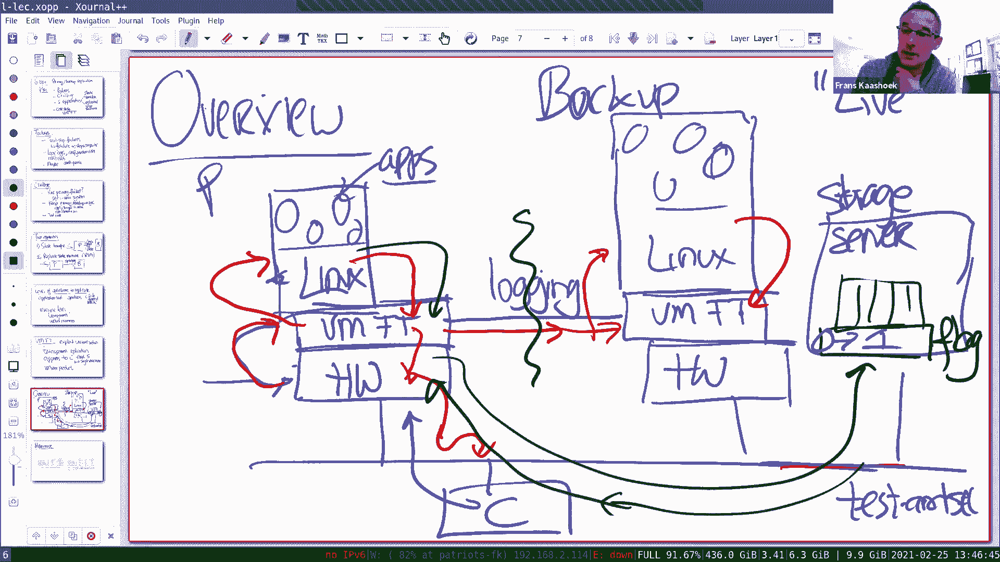
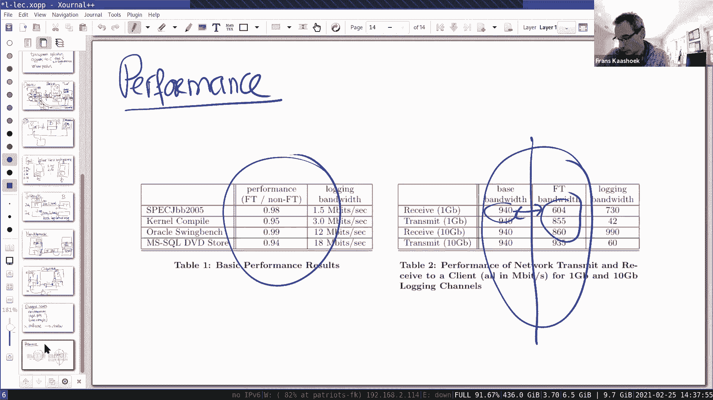

# 课程 P4：主备复制入门 🛡️

在本节课中，我们将学习主备复制的基本概念，这是一种用于构建容错系统的关键技术。我们将探讨其核心思想、面临的挑战、两种主要实现方法，并通过 VMware 容错（VM-FT）这一具体案例来深入理解复制状态机方法。

## 概述：什么是主备复制？

主备复制是一种容错技术，旨在通过维护一个或多个备份副本来确保系统在主服务器发生故障时仍能继续运行。其核心目标是让客户端感觉像是在与一台高度可靠的单一服务器交互。

## 1. 处理何种故障？

首先，我们需要明确主备复制旨在处理何种类型的故障。

### 1.1 Fail-Stop 故障

我们主要关注 **Fail-Stop** 故障。这种故障的假设是：计算机要么正常工作，要么完全停止工作，不会产生错误的中间结果。
*   **典型例子**：电源线被拔掉、风扇故障导致过热关机、网络连接完全中断。
*   **软件层面的处理**：系统可以通过计算校验和等方式，在检测到内部错误时主动停止，从而将某些故障转化为 Fail-Stop 故障。

### 1.2 无法处理的故障

主备复制无法解决所有问题，以下情况通常不在其处理范围内：
*   **逻辑错误**：如果软件本身存在缺陷（如除以零），主备机可能都会执行相同的错误操作。
*   **配置错误**：错误的配置文件会导致主备系统都无法正常工作。
*   **恶意攻击**：试图破坏或欺骗协议的恶意行为不在基础主备复制的考虑范围内。

### 1.3 物理灾难的考量

主备复制能否应对物理灾难（如地震）取决于部署方式：
*   **可以处理**：如果主备服务器物理分离（如在不同大陆），备份可以接管。
*   **无法处理**：如果主备服务器位于同一数据中心且该中心整体失效，则系统无法恢复。

## 2. 主备复制的主要挑战

即使只关注 Fail-Stop 故障，构建容错系统也面临诸多挑战。

以下是构建主备系统时需要解决的核心问题：

1.  **故障检测与脑裂**：在分布式系统中，难以区分机器故障和网络分区。必须设计机制（如仲裁）来确保不会出现两个主机同时运行的“脑裂”状态。
2.  **状态同步**：必须确保备份服务器的状态与主机严格同步，包括所有状态变更及其顺序。这需要处理**非确定性操作**（如获取当前时间、外部输入），确保它们在主备机上产生完全相同的影响。
3.  **故障转移**：当主机故障时，需要平滑地将服务切换到备份。这涉及确定主机是否真的失效、确保备份状态最新、并处理主机可能“正在发送响应”等中间状态。

## 3. 两种主要方法

有两种高级方法来实现主备复制。

### 3.1 状态转移

在这种方法中，主机在更新自身状态后，将**变更后的完整或增量状态**发送给备份。
*   **流程**：`客户端请求 -> 主机处理并更新状态 -> 主机将新状态发送给备份 -> 主机响应客户端`。
*   **优点**：概念简单。
*   **缺点**：如果单个操作产生的状态变更很大（如写入GB级数据），传输开销会很高。

### 3.2 复制状态机

这是更常见的方法。主机不是发送状态，而是将**导致状态变更的确定性操作**发送给备份。
*   **流程**：`客户端请求（操作）-> 主机将操作发送给备份 -> 备份执行相同操作 -> 备份确认 -> 主机执行操作并响应客户端`。
*   **核心思想**：主备机从相同的初始状态开始，按相同顺序执行相同的确定性操作，最终必然达到相同的状态。
*   **优点**：通常传输开销更小，只传输操作本身而非全部状态。
*   **应用实例**：GFS（发送追加/写入操作）、VM-FT（发送机器指令）、课程实验3和4。

**为什么客户端不需要直接联系备份？**
因为操作是确定性的。只要备份从相同状态开始并执行相同操作，就能得到与主机相同的结果，无需客户端介入。

## 4. 案例研究：VMware 容错

VMware FT 是复制状态机方法的一个经典实现，其独特之处在于在**机器指令级别**进行复制，从而对上层操作系统和应用程序完全透明。

### 4.1 核心架构与透明性

VM-FT 利用**虚拟机监控器**来实现透明复制。
*   **组件**：主备两台物理机，各自运行一个包含 VM-FT 功能的虚拟机监控器，其上运行相同的虚拟机（如运行 Linux 和应用程序）。
*   **日志通道**：连接主备虚拟机监控器，用于传输非确定性事件信息。
*   **外部中断处理**：所有外部事件（网络数据包、定时器中断）首先被主机虚拟机监控器捕获。监控器记录事件发生时的精确指令位置，并通过日志通道通知备份“在执行到第 N 条指令时，交付此中断”。这样确保了主备机在指令流的同一点处理外部输入。
*   **非确定性指令处理**：VM-FT 在启动虚拟机前，会修改其二进制代码，将所有非确定性指令（如 `RDTSC` 读取时间戳）替换为会陷入虚拟机监控器的指令。当主机执行这些指令时，监控器模拟执行，将结果记录并发送给备份。备份在执行到相同指令时，直接使用主机发来的结果，从而保证一致性。

### 4.2 输出规则

这是保证一致性的关键规则。**主机在向外部发送任何输出（如网络响应）之前，必须确保导致该输出的所有操作日志都已被备份接收并确认。**
*   **目的**：防止主机在备份尚未知晓某个操作时就对外响应，随后主机故障，备份接管后状态不一致，客户端观察到异常。
*   **影响**：这会引入一定的延迟，是性能开销的主要来源之一。

### 4.3 故障检测与仲裁

当主备机之间的日志通道中断时，需要区分是网络分区还是对方机器故障。
*   **仲裁服务器**：VM-FT 引入一个共享的存储服务器，其上维护一个**Test-and-Set 标志**。
*   **流程**：
    1.  主备机无法通信时，都会尝试连接仲裁服务器，并原子性地将该标志从 0 设置为 1。
    2.  首先成功设置为 1 的一方（读到旧值 0）赢得仲裁，继续作为主机运行。
    3.  另一方（读到旧值 1）知道自己失败，将自行终止。
*   **避免脑裂**：此机制确保了即使发生网络分区，也最多只有一个服务器能继续以主机身份运行。

### 4.4 性能与局限性

*   **性能**：VM-FT 提供了良好的透明性，但性能有显著下降（论文中显示某些场景下降约30%），主要源于输出规则带来的等待延迟以及日志通道的通信开销。
*   **主要局限性**：论文中的方案**不支持多核处理器**。因为多核环境下的线程调度和锁竞争会引入非确定性，使得在指令级保持主备严格同步变得极其复杂。后续产品版本可能通过其他方式支持了多核。

## 总结

本节课我们一起学习了主备复制的基础知识。我们首先明确了它主要处理的 Fail-Stop 故障类型及其挑战，特别是状态同步和脑裂问题。接着，我们分析了**状态转移**和**复制状态机**这两种核心实现方法，并指出后者因其效率更高而更常见。

通过深入剖析 **VMware FT** 案例，我们看到了复制状态机方法如何在实际系统中实现。VM-FT 通过在**虚拟机监控器层面**、**机器指令级别**进行复制，实现了对上层软件的完全透明。其关键技术点包括：通过日志通道同步非确定性事件和外部输入、使用**输出规则**保证故障前后状态一致性、以及依赖**仲裁服务器**解决故障检测与脑裂问题。尽管存在性能开销和初期不支持多核等限制，VM-FT 清晰地展示了复制状态机原理的强大与实用价值，为后续学习更复杂的分布式容错协议奠定了基础。