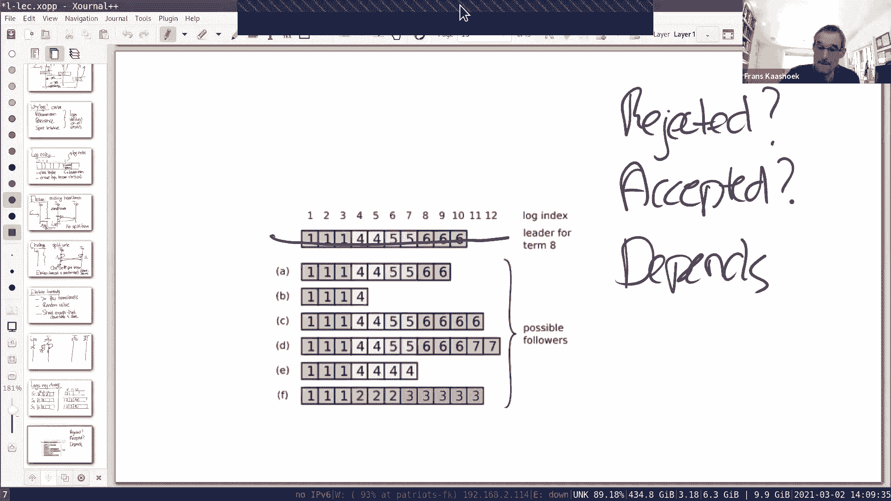
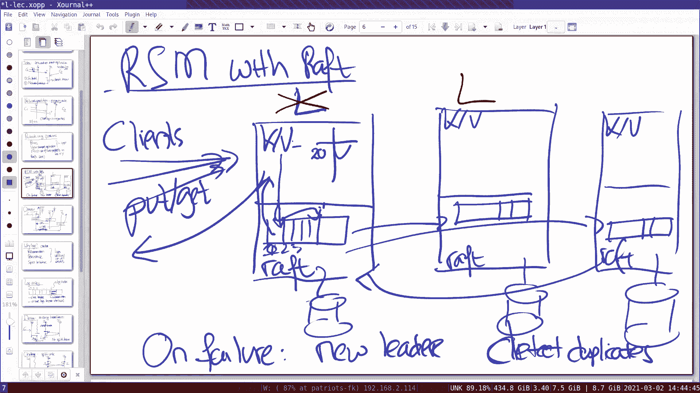

# 课程5：容错 - Raft (1) 🚀

在本节课中，我们将要学习 Raft 复制协议。Raft 是构建容错分布式系统的核心组件之一，它通过复制状态机来确保系统在部分节点故障时仍能正确运行。我们将重点关注 Raft 协议的基础概念，包括领导者选举和日志复制，这些是实验 2A 和 2B 的核心内容。下一周，我们将继续探讨快照、日志压缩等更深入的主题。

## 概述：从单点故障到多数原则

在之前的课程中，我们研究过 GFS、MapReduce、VM-FT 等复制系统。这些系统虽然通过复制实现容错，但都存在一个关键的单点故障，例如 MapReduce 的协调器、GFS 的主服务器或 VM-FT 的测试与设置服务器。引入单点主要是为了避免“脑裂”问题。

然而，完全消除单点故障是可能的。Raft 这类协议的目标就是构建一个没有单点故障、能自动处理故障和网络分区的强容错系统。在深入 Raft 之前，让我们先理解为什么简单地复制单点服务（如测试与设置服务器）会导致脑裂问题。

假设我们复制测试与设置服务器，有两个副本 S1 和 S2。客户端 C1 调用 `test-and-set`，它成功更新了 S1，但由于网络分区，无法联系 S2。与此同时，客户端 C2 可能正在与 S2 通信并成功更新。这样，两个客户端都认为自己成功了，违反了 `test-and-set` 的互斥语义。问题的核心在于，C1 无法区分 S2 不可达是因为其故障还是网络分区。

**解决方案是多数原则**。我们不运行两个副本，而是运行三个副本 S1、S2、S3。规则是：客户端必须成功更新**大多数**服务器（即至少 2 台），才能认为操作成功。这样，任何两个“大多数”集合必然存在重叠，确保了操作的唯一性。在发生网络分区时，只有包含多数服务器的分区能够继续运行，从而避免了脑裂。

这个思想可以推广：为了容忍 **f** 个故障，我们需要 **2f + 1** 台服务器。多数是指所有服务器中的大多数，包括在线和离线的。

## Raft 协议概览

在详细讨论 Raft 之前，我们先了解如何使用 Raft 构建一个复制状态机，这是我们的最终目标。

### 复制状态机架构

在实验 3 中，我们将使用 Raft 构建一个键值存储服务器。基本架构如下：
*   每个服务器实例包含两个部分：上层的键值服务（KV Server）和下层的 Raft 共识模块（Raft Library）。
*   客户端向领导者（Leader）发送请求（如 Put/Get）。
*   领导者的 KV Server 将操作传递给本地的 Raft 模块。
*   Raft 模块将该操作作为一个**日志条目**追加到自己的日志中，然后通过 RPC 复制给其他服务器（Follower）的 Raft 模块。
*   一旦日志条目被**复制到大多数服务器**，该条目就被视为**已提交**。
*   已提交的日志条目会按顺序传递给本地的 KV Server 执行。
*   领导者执行操作后，将结果返回给客户端。

如果领导者故障，会触发新的领导者选举。客户端在超时后会向新领导者重试请求，这可能导致重复操作，需要在 KV Server 层进行重复检测。

### 日志的作用

你可能会问，既然 KV Server 已经有数据表，为什么还需要日志？原因如下：
1.  **确保顺序**：日志为所有操作提供了一个全局一致的顺序。
2.  **持久化与恢复**：日志存储在磁盘上，即使服务器崩溃重启，也能从中恢复状态。
3.  **试探性操作**：在条目被提交之前，它处于“未提交”状态，日志为此提供了暂存空间。
4.  **重传**：在网络丢包或跟随者落后时，领导者可以根据日志重传缺失的条目。

每个日志条目包含：
*   **命令**：需要状态机执行的操作。
*   **任期号**：创建该条目时领导者的任期。
*   **索引**：在日志中的位置。

索引和任期号的组合唯一标识了一个日志条目。

## 领导者选举 🗳️

领导者选举是 Raft 保持可用性的关键，也是实验 2A 的主题。

### 选举触发与流程

在稳定状态下，一个领导者会定期向所有跟随者发送心跳（一种不包含新日志条目的特殊追加条目 RPC），以维持其权威。

1.  **超时**：每个跟随者都维护一个**选举超时计时器**。如果在计时器期间内没有收到领导者的心跳，跟随者就会认为领导者可能已经故障。
2.  **成为候选人**：超时的跟随者增加自己的当前任期号，转换为**候选人**状态，并首先为自己投一票。
3.  **请求投票**：候选人向集群中的所有其他服务器发送**请求投票 RPC**。
4.  **赢得选举**：如果候选人获得了**大多数**服务器的投票，它就赢得选举，成为新的领导者。
5.  **开始领导**：新领导者立即开始向跟随者发送心跳，以阻止新的选举。

### 关键机制与问题处理

*   **任期号**：每个任期最多只有一个领导者。如果候选人或跟随者发现通信对方的任期号比自己高，它会立即退位为跟随者。这防止了旧领导者在网络分区恢复后继续行使职责，从而避免脑裂。
*   **随机化超时**：为了避免多个跟随者同时超时、同时成为候选人并导致**选票分裂**（无人获得多数），Raft 让每个服务器在一个随机区间内选择其选举超时时间。这大大降低了选票分裂的概率，即使发生，也会因随机性在后续选举中快速解决。
*   **投票限制**：一个服务器在一个任期内最多投出一票（先到先得）。这确保了每个任期最多只有一个候选人能获得多数票。服务器必须将投票给谁的信息持久化存储，以防崩溃后忘记并重复投票。
*   **日志最新性限制**：在投票请求中，候选人会携带自己日志的最后索引和任期号。收到投票请求的服务器，只有当候选人的日志**至少和自己一样新**时，才会投出赞成票。这个规则确保了只有包含所有已提交日志条目的服务器才有可能成为领导者，这是保证数据安全性的关键。

## 日志复制与一致性 📝

上一节我们介绍了如何选举出领导者，本节我们来看看领导者如何通过日志复制来保证所有服务器状态的一致性。这是实验 2B 的核心。

### 正常操作流程

1.  **接收请求**：领导者收到客户端请求。
2.  **追加本地日志**：领导者将请求作为新条目追加到本地日志中。
3.  **并行复制**：领导者通过**追加条目 RPC** 将新条目并行发送给所有跟随者。
4.  **等待确认**：领导者等待大多数跟随者的成功回复。
5.  **提交与应用**：一旦收到大多数成功回复，领导者就将该条目标记为**已提交**，并将其应用于本地状态机，然后回复客户端。
6.  **通知跟随者**：在后续的心跳或追加条目 RPC 中，领导者会携带一个 **`commitIndex`** 参数，通知跟随者哪些日志条目可以被提交并应用到它们的状态机。

### 日志不一致与恢复

由于网络延迟、服务器崩溃等原因，跟随者的日志可能与领导者不同。Raft 通过强制跟随者复制领导者的日志来解决不一致问题，这称为**日志同步**。

领导者为每个跟随者维护一个 **`nextIndex`**，表示将要发送给该跟随者的下一条日志索引。当领导者和跟随者的日志不一致时，追加条目 RPC 会失败。领导者随后会递减 `nextIndex` 并重试，直到找到两者一致的位置。然后，领导者会从这个位置开始，发送之后的所有日志条目，覆盖跟随者不一致的部分。

### 提交规则与安全性

一个至关重要的规则是：**领导者只能提交当前任期内的日志条目**。如果领导者试图提交之前任期的条目，可能会破坏图7中讨论的安全性。具体来说，即使一个日志条目已经存储在大多数服务器上，如果它来自旧任期，新领导者也可能用新的条目覆盖它。只有当前任期的条目被提交后，才能间接地提交之前任期的所有条目。这个规则是 Raft 安全性的基石。

## 总结

本节课我们一起学习了 Raft 复制协议的第一部分。我们从单点故障的问题出发，引入了**多数原则**作为解决脑裂和实现容错的基础。然后，我们概述了使用 Raft 构建**复制状态机**的整体架构。

我们深入探讨了 **领导者选举** 的流程，包括选举触发、任期号机制、随机化超时以避免分裂投票，以及投票的日志最新性限制。接着，我们学习了 **日志复制** 的核心过程，了解了领导者如何复制日志、如何提交条目，以及如何处理日志不一致的情况。最后，我们强调了**领导者只能提交当前任期日志**这一关键的安全性规则。

理解这些基础概念对于完成实验 2A 和 2B 至关重要。在下一节课中，我们将继续研究 Raft 的更多方面，包括持久化、快照和客户端交互。