# 课程 P6：实验 1 问答与 Go 编程技巧 🗣️💻

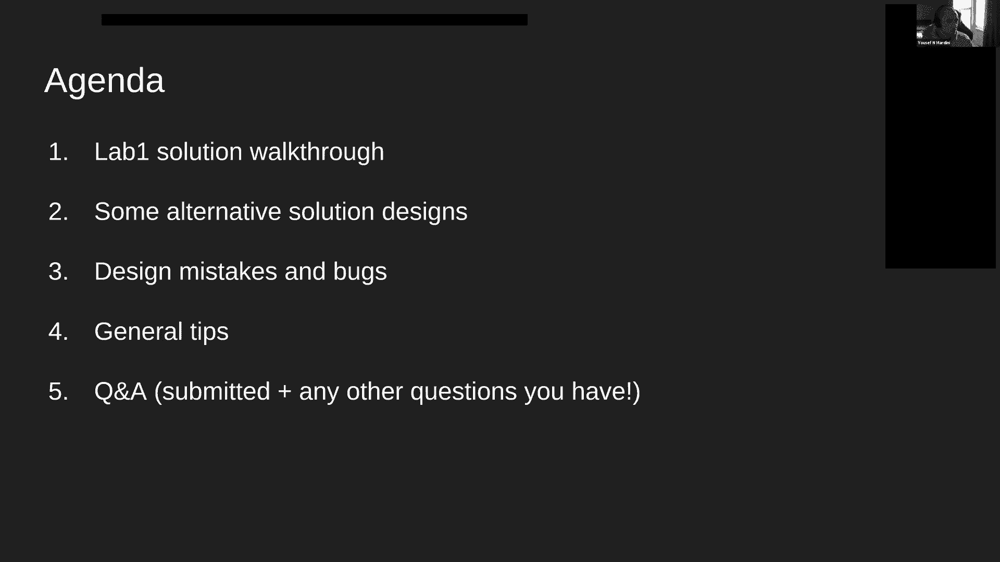

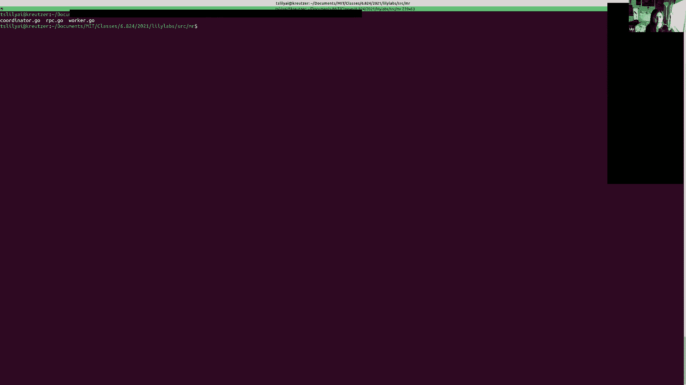

在本节课中，我们将回顾 MapReduce 实验 1 的解决方案，讨论常见的设计模式与错误，并学习一些通用的 Go 编程技巧，为后续实验做好准备。

## 概述

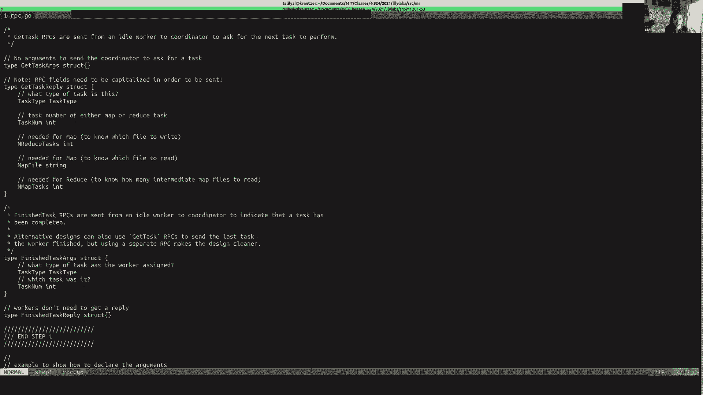


本节课内容主要包括：
1.  演示一个可行的 MapReduce 实验 1 解决方案。
2.  讨论替代的解决方案设计。
3.  分析实验中常见的错误和 Bug。
4.  提供一些通用的编程提示。
5.  进行问答环节。

---


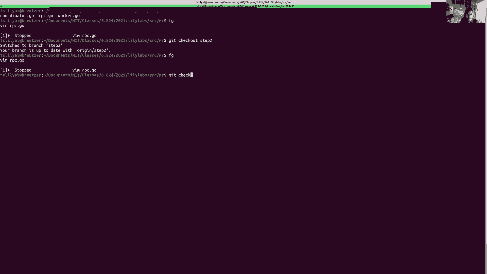

## 1. 实验解决方案演示 🧪

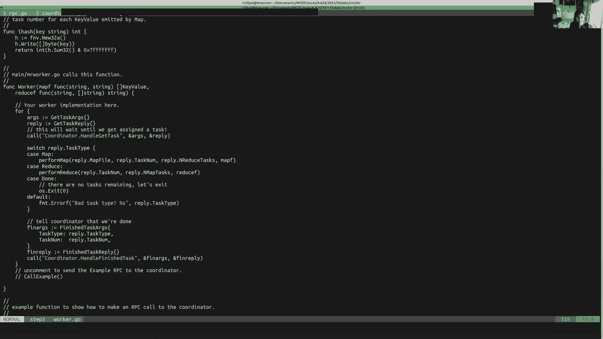


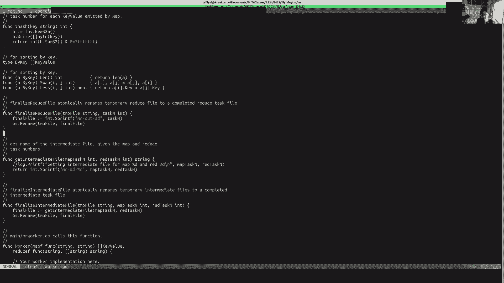

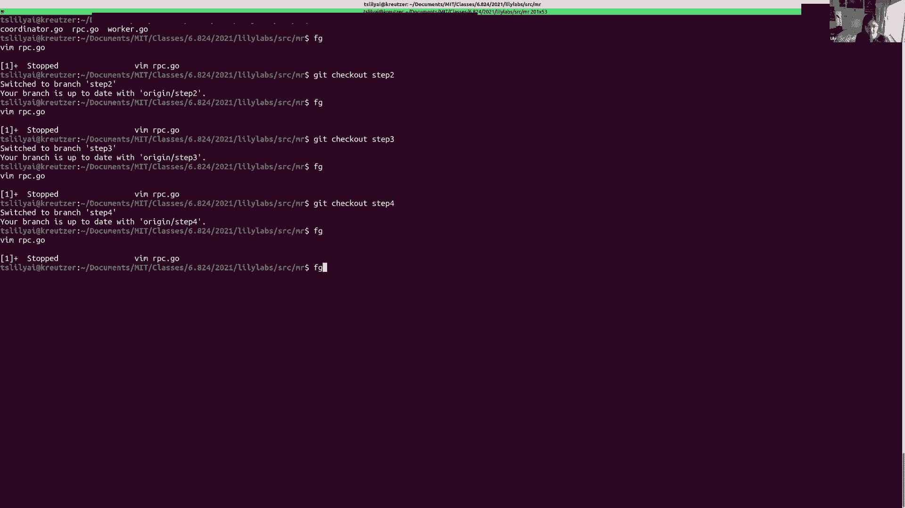

首先，我们逐步演示一个 MapReduce 实验 1 的解决方案。这个方案使用 RPC 进行 Worker 和 Coordinator 之间的通信，并利用条件变量进行任务调度。

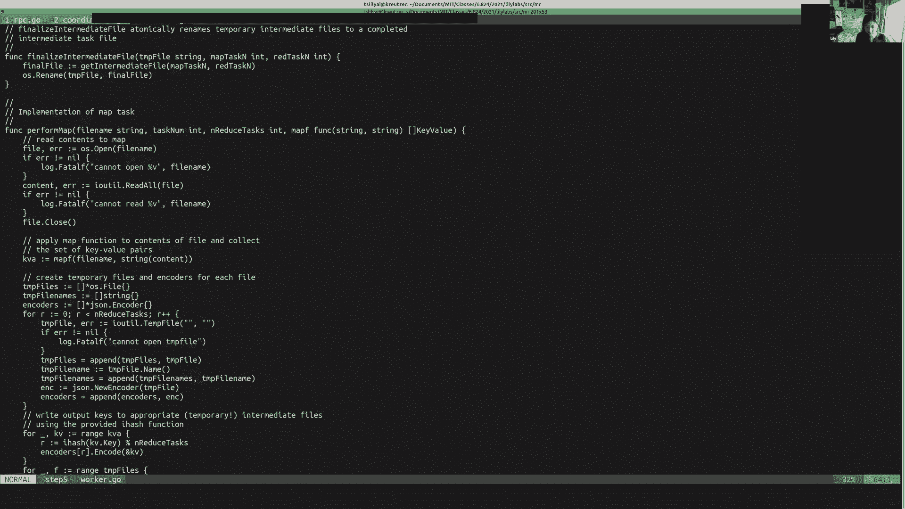


### 第一步：定义 RPC API


首先，在 `rpc.go` 中定义任务类型和 RPC 接口。

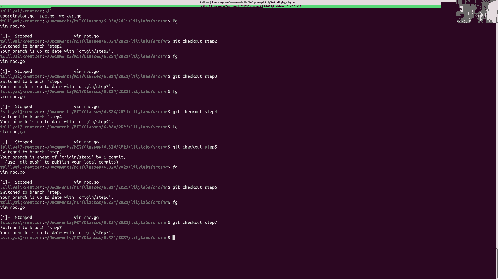

```go
// 任务类型
type TaskType int
const (
    MapTask TaskType = iota
    ReduceTask
    DoneTask // 表示协调者已完成
)

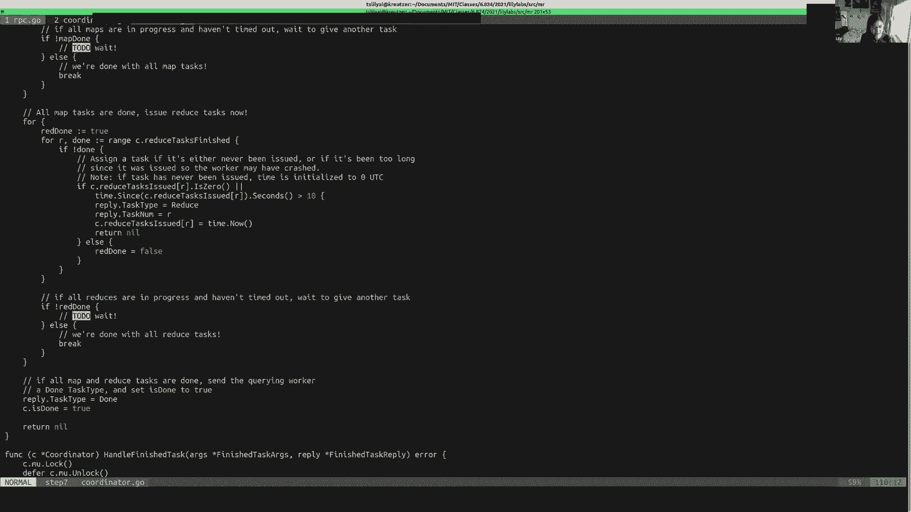

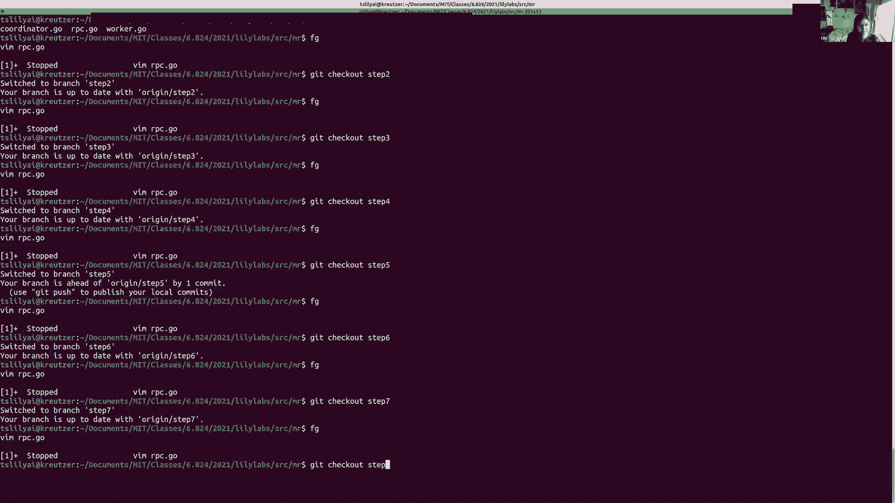

// Worker 请求任务的 RPC 参数与回复
type GetTaskArgs struct {}
type GetTaskReply struct {
    TaskType    TaskType
    // ... 其他任务所需的元数据，如文件、Map/Reduce 任务数量等
}

// Worker 通知任务完成的 RPC 参数
type FinishedTaskArgs struct {
    TaskType TaskType
    TaskId   int
}
type FinishedTaskReply struct {}
```

**核心概念**：定义清晰的 RPC 接口是分布式系统通信的基础。

### 第二步：实现 RPC 处理程序

在 Coordinator 中实现 RPC 的处理程序。Coordinator 需要维护状态，并使用互斥锁保护并发访问。

```go
type Coordinator struct {
    mu sync.Mutex
    // 状态信息：任务文件、任务状态、完成标志等
    mapFiles   []string
    mapTasks   []TaskStatus
    reduceTasks []TaskStatus
    nReduce    int
    done       bool
}

func (c *Coordinator) GetTask(args *GetTaskArgs, reply *GetTaskReply) error {
    c.mu.Lock()
    defer c.mu.Unlock()
    // 检查并分配 Map 或 Reduce 任务，若全部完成则返回 DoneTask
    // ...
    return nil
}

func (c *Coordinator) FinishedTask(args *FinishedTaskArgs, reply *FinishedTaskReply) error {
    c.mu.Lock()
    defer c.mu.Unlock()
    // 根据 args.TaskType 和 args.TaskId 更新对应任务状态为完成
    // ...
    return nil
}
```

**核心概念**：使用 `sync.Mutex` 和 `defer` 语句可以安全、简洁地管理对共享状态的访问。

### 第三步：Worker 发送 RPC

Worker 在一个循环中向 Coordinator 请求任务，并根据任务类型执行相应操作。

```go
func Worker() {
    for {
        args := GetTaskArgs{}
        reply := GetTaskReply{}
        callCoordinator("Coordinator.GetTask", &args, &reply)

        switch reply.TaskType {
        case MapTask:
            performMap(reply.MapFile, reply.NReduce)
            callCoordinator("Coordinator.FinishedTask", &FinishedTaskArgs{TaskType: MapTask, TaskId: reply.TaskId}, &FinishedTaskReply{})
        case ReduceTask:
            performReduce(reply.ReduceId, reply.NMap)
            callCoordinator("Coordinator.FinishedTask", &FinishedTaskArgs{TaskType: ReduceTask, TaskId: reply.TaskId}, &FinishedTaskReply{})
        case DoneTask:
            return // 退出 Worker
        }
    }
}
```

**核心概念**：Worker 的核心逻辑是一个简单的“请求-执行-报告”循环。

### 第四步：实现文件管理

实现辅助函数来原子性地重命名中间文件，防止冲突。

```go
func finalizeFile(tmpFile string, finalFile string) error {
    return os.Rename(tmpFile, finalFile)
}
```

### 第五步：实现 Map 和 Reduce 函数

`performMap` 函数读取输入文件，应用用户定义的 map 函数，并将输出写入中间文件。`performReduce` 函数读取属于其分区（reduce ID）的所有中间文件，对键进行排序，然后应用 reduce 函数。

```go
func performMap(filename string, nReduce int) {
    // 1. 读取文件内容
    // 2. 调用用户 map 函数，生成键值对列表
    // 3. 根据键的哈希将键值对分区到 nReduce 个临时文件中
    // 4. 原子重命名临时文件为最终中间文件
}

func performReduce(reduceId int, nMap int) {
    // 1. 读取所有 Map 任务生成的、属于此 reduceId 的中间文件
    // 2. 对所有键值对按键排序
    // 3. 对每个键，收集其所有值，调用用户 reduce 函数
    // 4. 将结果写入临时输出文件，然后原子重命名为最终输出文件
}
```

**核心概念**：Map 阶段进行“分而治之”，Reduce 阶段进行“汇总归约”。

### 第六步：实现 Coordinator 的任务调度

这是 Coordinator 最复杂的部分，负责给 Worker 分配任务，并处理超时与重试。一种实现方式是使用条件变量来等待可分配的任务出现。

```go
func (c *Coordinator) scheduleTasks() {
    c.mu.Lock()
    // 首先分配所有 Map 任务
    for !c.allMapTasksDone() {
        if taskId := c.findAvailableMapTask(); taskId != -1 {
            // 找到任务，分配给 Worker (通过 RPC 回复)
            c.assignMapTask(taskId)
            // 启动一个 goroutine 来监控此任务超时
            go c.monitorTask(MapTask, taskId)
        } else {
            // 没有立即可用的 Map 任务，等待（条件变量）
            c.cond.Wait()
        }
    }
    // 所有 Map 任务完成后，开始分配 Reduce 任务
    for !c.allReduceTasksDone() {
        if taskId := c.findAvailableReduceTask(); taskId != -1 {
            c.assignReduceTask(taskId)
            go c.monitorTask(ReduceTask, taskId)
        } else {
            c.cond.Wait()
        }
    }
    c.done = true
    c.mu.Unlock()
}


// 监控任务超时的 goroutine
func (c *Coordinator) monitorTask(taskType TaskType, taskId int) {
    time.Sleep(TaskTimeout)
    c.mu.Lock()
    defer c.mu.Unlock()
    if !c.isTaskDone(taskType, taskId) {
        // 任务超时未完成，重置状态以便重新分配
        c.resetTask(taskType, taskId)
        c.cond.Broadcast() // 唤醒调度循环
    }
}


// 在 FinishedTask RPC 处理程序中，完成任务后也发出广播
func (c *Coordinator) FinishedTask(args *FinishedTaskArgs, reply *FinishedTaskReply) error {
    c.mu.Lock()
    defer c.mu.Unlock()
    c.markTaskDone(args.TaskType, args.TaskId)
    c.cond.Broadcast() // 唤醒调度循环，可能现在有任务可分配了
    return nil
}
```

**核心概念**：条件变量 `sync.Cond` 适用于等待某个特定条件（如“有任务可分配”）变为真，比循环睡眠更高效。

---

上一节我们介绍了一个基于条件变量的 Coordinator 调度实现，本节中我们来看看其他可能的设计方案。

## 2. 替代解决方案设计 🔄

除了使用条件变量，还可以考虑其他同步和通信模式。

### 设计一：Worker 侧主动轮询

在这种设计中，如果 Coordinator 没有任务可分配，它会立即返回一个“无任务”的回复。Worker 在收到此回复后，等待一段时间再重新请求。

*   **优点**：Coordinator 逻辑简单，不会阻塞在 RPC 处理程序中。
*   **缺点**：产生更多网络 RPC 流量；Worker 的等待时间可能不够高效。

### 设计二：使用 Channel 进行任务队列

可以利用 Go 的 Channel 作为任务队列和生产-消费者模型。以下是一个概念性示例，展示了 Channel 的潜在用法：

```go
func CoordinatorWithChannels(taskChan chan Task, workerChan chan int) {
    // 将初始任务推入 taskChan
    for i := 0; i < numTasks; i++ {
        taskChan <- Task{Id: i}
    }

    // 监听 worker 加入
    go func() {
        for workerId := range workerChan {
            go func(wId int) {
                for task := range taskChan { // 从通道取任务
                    if callWorker(wId, task) {
                        // 任务成功，通知完成
                        doneChan <- task.Id
                    } else {
                        // 任务失败，重新放回队列
                        taskChan <- task
                    }
                }
            }(workerId)
        }
    }()

    // 等待所有任务完成
    for completed := 0; completed < numTasks; completed++ {
        <-doneChan
    }
    close(taskChan) // 关闭通道，使 worker goroutine 退出
}
```

**核心概念**：Channel 非常适合用于 goroutine 之间的消息传递和队列管理，能简化某些场景下的同步逻辑。但在保护复杂共享状态时，互斥锁可能更直观。

---

## 3. 常见设计错误与 Bug 🐛

在实现过程中，需要注意以下几点：

以下是实验中一些常见的陷阱：

1.  **Coordinator 过载**：将本应由 Worker 执行的工作（如排序、读取大量文件内容）放在 Coordinator，使其成为瓶颈。MapReduce 的优势在于将计算分散到 Worker。
2.  **RPC 设计冗余**：设计过多或过于细粒度的 RPC 调用（例如，先询问是否有任务，再请求任务）。应精简 API。
3.  **同步错误**：
    *   在可能阻塞的操作（如网络 RPC、Channel 操作）期间持有锁，导致整个程序停滞。
    *   误以为不同机器上的锁（或 Channel）可以跨进程同步。同步原语仅用于协调**同一进程内**的多个线程。
4.  **“良性”数据竞争**：即使你认为某个变量（如 `isDone`）的读写竞争是安全的，也**必须**使用同步机制（如锁或 `atomic` 操作）。未定义行为可能导致难以调试的问题。
5.  **超时处理不完善**：未正确处理任务超时和重试，或重试逻辑导致任务被重复执行。

---

## 4. 通用编程提示与技巧 💡

以下技巧有助于提高未来实验的编码和调试效率：

1.  **条件调试输出**：使用类似 `DPrintf` 的函数，方便在调试时输出信息，提交时无需注释大量 `printf`。
    ```go
    func DPrintf(format string, a ...interface{}) (n int, err error) {
        if Debug {
            log.Printf(format, a...)
        }
        return
    }
    ```
2.  **检查 Goroutine**：在程序运行时，可以按 `Ctrl-\`（Unix）来查看所有运行中的 goroutine 及其堆栈，帮助诊断死锁或阻塞。
3.  **善用 `defer`**：`defer` 语句能确保函数返回前执行清理（如解锁）。注意多个 `defer` 的执行顺序是后进先出（LIFO）。
4.  **代码组织**：将代码按功能分到不同文件（如 `rpc.go`, `coordinator.go`, `worker.go`）。将重复逻辑提取为函数（如 Raft 中检查任期并重置状态的逻辑）。
5.  **编辑器与环境**：配置一个带有自动补全、代码导航功能的开发环境，可以大幅提升效率。

---

## 5. 问答环节精选 ❓

以下是对课程中部分问题的解答：

*   **Q：MapReduce 适用于更复杂的计算吗？**
    *   A：是的。MapReduce 模型可用于矩阵乘法、机器学习等复杂计算。后继系统如 Spark、Google Dataflow 提供了更灵活的数据流图计算模型。
*   **Q：Coordinator 如何容错？**
    *   A：原始论文使用简单的检查点机制。对于需要强一致性的场景，可以使用 Raft 复制状态机来实现一组高可用的 Coordinator。
*   **Q：为什么 Mapper 在本地写文件？**
    *   A：在 MapReduce 论文发表的年代，网络带宽是瓶颈。本地写减少网络传输。输出阶段才写入分布式文件系统（如 GFS）。
*   **Q：如何选择超时时间？**
    *   A：在 MapReduce 实验 1 中，10秒的任务超时是合理的。在 Raft 实验中，选举超时需要仔细选择（例如 150-300ms 范围），需考虑心跳间隔，并加入随机性以防止同时选举。
*   **Q：可以混合使用锁和 Channel 吗？**
    *   A：当然可以。锁适合保护复杂的共享状态，Channel 适合 goroutine 间的通信和特定类型的同步（如等待事件）。Raft 实现中通常会同时使用两者。
*   **Q：如何干净地关闭进程？**
    *   A：一种简单方法是 Coordinator 在完成后，不再响应 Worker 的 RPC。Worker 发现连接错误后自行退出。也可以定义明确的退出 RPC。

---

## 总结


本节课中我们一起学习了 MapReduce 实验 1 的一个完整解决方案，其核心在于通过 RPC 实现 Worker 与 Coordinator 的通信，并利用条件变量进行有效的任务调度与容错处理。我们还探讨了不同的设计选择，分析了常见错误，并掌握了一些实用的 Go 编程和调试技巧。理解这些概念将为后续更复杂的分布式系统实验（如 Raft）打下坚实的基础。