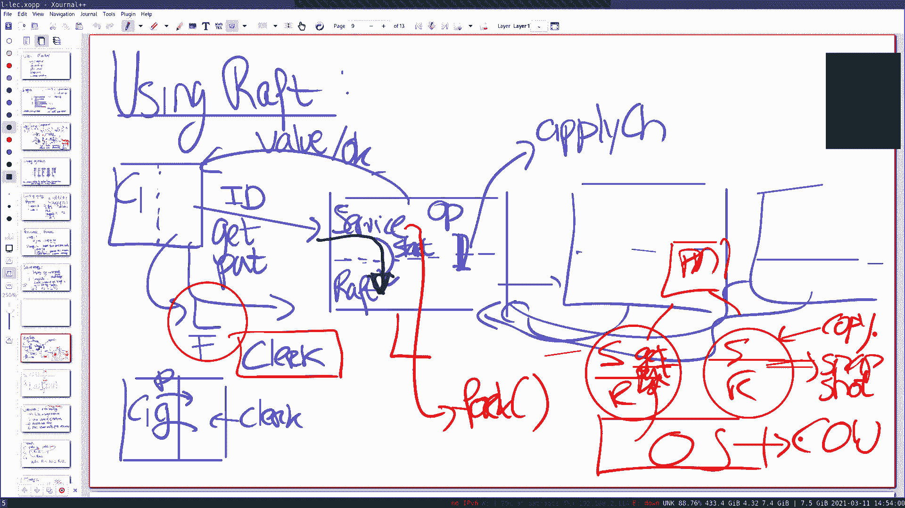

# 🧩 课程7：容错 - Raft (2)

在本节课中，我们将深入学习Raft共识算法的更多细节，包括日志分叉的处理、日志追赶机制、状态持久化、快照以及线性一致性等重要概念。这些内容对于理解分布式系统的容错机制至关重要。

---

## 📊 日志分叉与领导者选举

上一节我们介绍了Raft的基本工作原理和领导者选举。本节中我们来看看当系统出现日志分叉时，Raft协议如何通过特定的选举规则来保证一致性。

图6展示了一个典型的日志分叉场景。当领导者崩溃后，系统中的日志可能出现很大差异。新领导者的选举必须遵循特定规则，以确保集群能够收敛到正确的日志状态。

*   任何领导者都需要获得**大多数**节点的投票，以避免脑裂问题。
*   选举规则要求候选者的日志**至少和投票者一样新**。具体来说，候选者最后一个日志条目的任期号必须**大于或等于**投票者的最后一个日志条目的任期号。如果任期号相同，则日志更长的候选者获胜。

基于这些规则，在图6的场景中，节点A、C、D都有可能成为新的领导者，具体取决于哪些节点在线以及它们当前的任期号。

---

## 🔄 日志追赶机制

当新的领导者选举出来后，它需要让所有跟随者的日志与自己保持一致。这个过程称为日志追赶。

领导者为每个跟随者维护两个关键变量：
*   `nextIndex`: 对跟随者下一个日志条目的乐观估计（初始值为领导者最后日志索引+1）。
*   `matchIndex`: 已知的已复制到跟随者的最高日志索引的悲观估计（初始值为0）。

追赶的基本流程（未优化版本）如下：
1.  领导者发送心跳（包含`prevLogIndex`和`prevLogTerm`）给跟随者。
2.  如果跟随者发现`prevLogIndex`处的日志任期不匹配，则回复拒绝。
3.  领导者将对该跟随者的`nextIndex`减1，然后重试，直到找到匹配点。
4.  找到匹配点后，领导者从该点开始发送后续的所有日志条目。
5.  跟随者接受并应用这些条目，回复成功。领导者更新`matchIndex`。

未优化版本在跟随者落后很多时效率低下（需要逐条回退）。Raft论文描述了一种优化方法：
*   跟随者在拒绝响应中，额外返回冲突的任期号（`conflictTerm`）以及该任期号在日志中**第一次出现**的索引（`firstIndexForTerm`）。
*   领导者利用这些信息，可以直接将`nextIndex`回退到`firstIndexForTerm`，从而可能跳过一个完整的任期，加速追赶过程。

---

## 💾 状态持久化

为了在节点崩溃重启后能快速恢复并继续参与集群，Raft需要将一些关键状态持久化到稳定存储（如磁盘）。

以下是必须持久化的状态：
*   **当前任期号 (`currentTerm`)**: 用于检测过时的RPC请求和确保每个任期只投票一次。
*   **投票记录 (`votedFor`)**: 记录在当前任期投给了哪个候选者，防止重复投票。
*   **日志条目 (`log[])`)**: 必须持久化以确保已提交的条目不会丢失。如果只在内存中，崩溃可能导致已向客户端确认的操作丢失，破坏一致性。

每次这些状态发生变化时，都必须立即写入持久化存储，然后才能进行后续操作（如回复RPC）。

---

## 📸 快照与日志压缩

随着系统运行，日志会不断增长。重放全部日志来恢复服务状态或让新节点加入会非常耗时。Raft使用快照来解决这个问题。

快照机制的核心思想：
1.  服务周期性地对其状态（如键值对）创建检查点，生成快照。
2.  服务通知Raft库：“我已对直到索引`i`的所有操作完成了快照”。
3.  Raft库可以安全地删除日志中索引`i`及之前的所有条目（日志压缩）。
4.  快照本身也需要持久化存储。

当跟随者大幅落后（其所需的日志条目已被领导者压缩）或新节点加入时，领导者会通过`InstallSnapshot` RPC将快照发送给它们。跟随者应用快照来快速重建服务状态，然后只需同步快照点之后的少量日志。

**注意**：快照RPC必须小心处理。如果跟随者收到的快照比它当前的状态还旧，它必须拒绝或只应用快照中覆盖旧日志的部分，而不能回滚已提交的状态。

---

## ⚖️ 线性一致性

线性一致性是衡量像Raft这样的复制状态机是否正确、行为是否像单台机器的严格标准。

线性一致性要求所有操作（读/写）的集合，存在一个全局排序，且满足以下条件：
1.  **全局顺序**：所有操作可以排列成一个序列。
2.  **实时顺序**：如果一个操作在另一个操作开始**之前**完成，那么在全局顺序中，前一个操作也必须排在另一个操作之前。
3.  **读最新**：读操作必须返回最近一次写入的值（根据全局顺序）。

简单来说，线性一致性系统对外表现必须和一台**单机**处理所有客户端请求完全一样。这是分布式系统提供“强一致性”的常见定义。

在基于Raft的键值服务中，客户端通过`clerk`（客户端存根）与服务器交互。`clerk`负责维护当前领导者的信息、为请求生成唯一ID以进行重复检测，并在超时或被告知非领导者时重试其他服务器，共同协作以实现线性一致性语义。

---

## 🎯 总结

本节课我们一起深入探讨了Raft算法的几个高级主题：
*   我们分析了**日志分叉**场景，理解了严格的**领导者选举规则**如何保证安全。
*   我们学习了**日志追赶**机制，包括其基本流程和加速追赶的**优化技巧**。
*   我们明确了Raft中必须**持久化的状态**（任期、投票、日志）及其原因。
*   我们介绍了**快照**与**日志压缩**，这是管理长日志和高效恢复的关键。
*   最后，我们定义了**线性一致性**这一强一致性标准，它是对基于Raft构建的服务正确性的最终要求。

掌握这些概念，对于实现一个健壮的、容错的分布式系统至关重要。