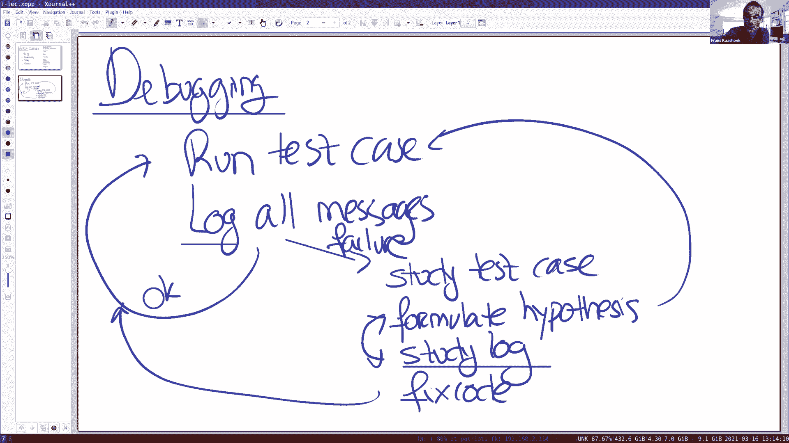
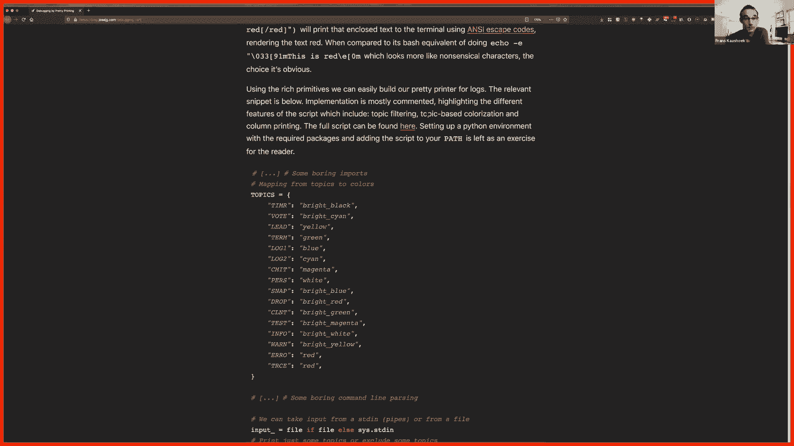
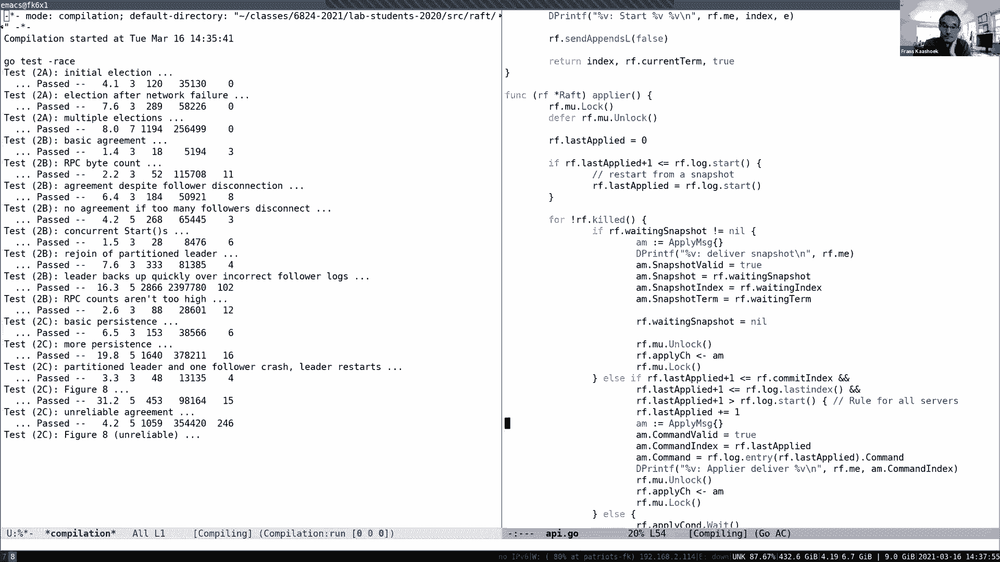

# P8：Lecture 8 - Lab 2A_2B Q&A - mayf09 - BV16f4y1z7kn

好的，下午好，声音检查。是的，我们是好的。好的，很好，晚上好，早上好，无论你在哪里，所以今天我想谈谈实验 2 a 和 b，这是一个问答环节，所以你可以随时打断我，随便问问题。

今天的课程是专门针对你们的问题的，我总结了许多问题，在电子邮件中出现一次或多次，在右边这块白板上，希望当我演示我的解决方案时，能通过它们，我将主要介绍与该解决方案相关的四个主题。我们首先要谈一谈投票。

或者投票代码，然后是心跳，然后我会讨论开始和提交。我认为这是我们在实验中提出的建议，比如你应该如何开始，第一次投票起作用，让心跳起作用，一旦你的心跳开始工作，你可以开始接受来自客户端的命令。

然后当然你必须提交，把它们交给 apply 通道。所以有一个大致的方案顺序，但是，在任何时间，你都可以随意打断。所以在深入查看我的解决方案之前，或者我在这里写的解决方案，我想谈一谈调试。

因为这是出现最多的问题，在所有你们提交的问题中。让我在很高级别上谈一谈调试，这显然是一个我们可以花上一整节课的话题，但我只想给你们一些我的高级别的方法，我通常会用来解决，通过实验。然后开始，我开始。

我们运行的第一个测试用例，当然，如果我没有写过任何代码，我会失败，但至少我有了一个起点，我可以开始写一些代码，所以想想第一个测试用例，开始编写，查看提示并编写一些代码，在编写代码时，我觉得这很方便。

在这个实验或这个实验集合中，实际上， 6。824 中的任何实验，要记录所有消息，通常使用 util。go 中的 DPrintf 函数，我很有系统地记录消息，我这样做的原因不是为了调试目的，所以。

我将编写代码，运行测试代码失败，编写一些代码以尝试通过测试用例，这里有两种情况，一个是我通过了，然后我立即转到下一个测试用例，或者我失败了，在这种情况下，我做的第一件事是，更详细地研究测试用例。

并尝试找出测试用例要测试的东西，测试用例的名称，通常非常暗示特定场景是什么，或者测试用例试图涵盖的场景集合，然后我试着自己回答，假设为什么我的代码，为什么没通过测试用例，所以这是一个反思和思考的时刻。

而且，为了理解，我脑子里想的是什么场景，似乎符合测试用例，想想我的代码，它可能是一个问题，一旦我有了一个假设，然后接下来要做的就是学习，试着确认这个假设，我的解释，为什么通过测试，可能是对的或错的。

所以，要做到这一点，我要研究一下日志，所以如果我有打印或所有消息，发送到协议的那部分，我可以看到跟踪，看看哪里出了问题，工作回退，使用这种方式，测试和完善我的假设，为什么我的代码可能是错误的。

有时这可能需要回到过去，运行测试用例测试以获得更详细的日志输出，虽然在早期我倾向于非常系统化，你不需要添加任何打印语句，但在某些情况下，是需要的，那么这给了我更多的信息，我可以真正放大场景。

我的代码没有处理的，一旦我有了一个假设，我在日志里检查，这个假设似乎是正确的，这是我的代码中的一个 bug ，我可以修改代码，然后运行测试用例。所以这是一个简短的过程，运行测试用例，如果失败。

研究测试用例和研究日志以制定假设，试图证实这一假设，然后继续修复代码，然后转到下一个，这往往是合理的，系统的。例如，我经常会在某个文件中写下，一个文本文件，我的假设是什么，并试图收集证据或反证据。

要证明或反驳我的假设，我有很好的理由来修复代码，我认为任何方法都不是非常系统化的，例如，你认为有些事情并不是百分之百正确的，也许可以改变这个，看看你是否通过了测试用例，往往效果不是很好。

我认为这需要很长时间，因为你可能错了，或者更糟糕的是，你可能是错的，实际上通过了测试用例，认为你是对的，但事实证明，你只是将 bug 从一个角落转移到另一个角落，它将在稍后再次出现。所以在非常高级别上。

这是我采取的方法，你可以看到这里的关键是记录消息。对这个方法，有什么疑问或者评论，我知道这是很高的级别上，但至少让你对我是如何处理这件事有所了解。所以这里的消息是 RPC ？是的，所有的 RPC 。

好的，好的。好的，所以有一些，所以。我有一个简短的问题，那么什么是好的方法，用于决定记录什么和不记录什么的粒度？啊，这是一个非常好的问题，我希望有人提问，我倾向于把事情做得很细粒度，[]记录所有东西。

然后，我使用，我把日志放入编辑器，或者使用像 grep 这样的 Unix 程序，找出那些有兴趣的东西。我这么做的原因是，有时候我不知道我想要研究什么粒度的东西，我不想回去再做一次测试。

我只是收集所有的东西，然后找出我关心的东西。这让我开始了，所以，有些人编写了相当多的调试基础设施，使用日志，使更容易理解，我很原始， DPrintf 和信息日志。

尽管我以清晰的方式组织我的 printf ，这样我就能看到来源是什么，目的地是什么，以及 RPC 本身是什么，我可以非常快速地找出过滤，因为所有文本行都有特定的格式。

一些人花了相当多的时间建设一些基础设施，以使一切变得更容易，TA 之一的 Jose ，当他上课的时候，他构建了一些软件，让它更容易，Python 脚本，使解析日志变得更容易，我想看看他所做的会很有趣。

我要停止分享，然后请 Jose 分享，也许还有 demo ，它的日志结构是如何工作的。

抱歉，我有一个跟进的问题。那么，如何将调试 print 写入日志而不是标准输出？

哦，通常是输出到一个文件，所以。所以，你只是使用管道将所有东西到一个文件中。是的，我把它通过管道传输到一个文件中。知道了，谢谢。我想这是 Jose 的屏幕， Jose 继续。你能听到我说话吗？是的。

我能听到。好的，太棒了，我同意这些观点，事情与 Frans 所描述的很像，[]日志，我试着去做，记录进行的每个事件，我也有一个我遵循的格式，然后我要展示的是，让我的生活更轻松，并通过日志。

高级别的想法是我在 Go 中做非常简单的结构，然后我会把这些标准输入转存到一个文件中，然后我使用 Python 脚本执行，所有的颜色和结构，因为这在 Python 中要比在 Go 中容易得多。例如。

这是我在一个 Go 测试中得到的，当我启用 VERBOSE 时，我得到一个输出，看起来像这样，我在这里记录的是，毫秒数是第一列，当你调试计时器事件时，这非常有用，诸如此类的事情。

试图了解 RPC 需要多长时间才能失败，第二栏是我称为主题，它们不是级别，因为它们是没有等级，它们只是与 Raft 上的不同时间有关，可能你们中的许多人现在已经意识到，在实验 3 中，很多事情发生。

比如定时器，选举，日志，应用与状态机通信的东西，所有这些事件发生的频率都略有不同，所以如果你想之后从它们中选择，或者决定忽略更多的那些，这样的类别真的很方便，然后第三列，可能你们中的许多人有这个。

哪个服务器在说这条消息，因为我们认为这很难对发生的事情进行推理，剩下的是一条自由形式的信息，解释了这条信息是关于什么的，尽管这只是你运行的最初始的测试，刚刚通过的，你可以进行选举的那个，你必须阅读。

遵循这里的逻辑。所以我让这件事变得更容易，这就是我在课程中所做的，把所有的主题都转换成颜色，像大多数内部支持一样，广泛的颜色支持，同样，通过使用 Python 语言做这个。

你可以使用一些出色的库来完成所有繁重的任务，你不必参与到这件事中来。在这里，是的，包括了不同颜色的不同事件，随着你对颜色越来越熟悉，例如，这里所有定时器事件都是灰色的，所以也许它们更容易被忽视。

或者我们寻找当有人投票的时候，我们可以看一下青色，它与投票有关，我们在视觉上编码，东西更容易找出来，例如，这里的黄色是我们选举，选举新领导人的时候。我们还得决定谁在说什么，为了做到这一点。

我加入了不同的列，再说一次，我现在所做的就是运行，我所做的只是运行标准测试脚本，然后通过管道到我写的脚本中，在本例中，我指定我有三列，因为在这个测试用例中有三个节点，我现在决定忽略计时器。

就像定时器主题的事件，因为它们太多了，并且如果定时逻辑工作了，我们可能不需要它们来调试正在发生的事情，如果你看一下这个日志，与我们的明文日志相比，很容易看到，发生了什么，有三台服务器在启动。

最后一个成为候选者，另外两个给它投了票，一旦获得第一票，它就会成为领导者，然后它就会在剩下的测试中心跳，没有其他东西可以看了。但现在再一次和这个相比，更容易发现正在发生的事情。

当你根据自己的喜好调整它的时候，它变得越来越高效。当你转向更难的测试时，因为你们中的许多人可能，已经看过 2B 实验的 backup 测试日志，会有很多很多的事件在进行，即使你知道你需要什么。

这可能会成为一项艰巨的任务，通过上千行的日志，你寻找失败点，并试图对发生的事情进行推理。同样，如果我们查看，使用这种类似于可视化的格式，我们可以很快看到发生了什么，我们有五个不同的服务器正在启动。

第一个成为候选者，其他人投票给它，成为领导者，通过观察不同的列，我们可以看到，例如所有紫色的[]，当提交或应用某件事时，所以我们可以看到收到了一个新条目，这个服务器正在接收。

而且由于 backup 具有非常详细的日志，我有很多 Drop RPC ，我在这里也忽略了这些话题，随着测试的进行，我们可以开始对发生的事情进行推理，所以，可能是有帮助的。

在测试代码中有一些打印语句或调试语句，你可以在那里修改，知道测试在做什么，例如，在这里，测试检测到，第一个服务器 S0 是领导者，然后断开 S2 直到 S4 的连接，就是右边的三个。

这几乎就是发生的事情，我们收到一串条目，不会被提交，因为只有两台服务器可以相互通信，然后过了一段时间，我们看到前两个现在是断开的，右边的三个重新连接在一起，现在它们可以形成大多数，这就是我们将看到的。

最后一个人成为候选者，获得多数，我们可以重复地看到绿色和紫色的颜色模式，就像这个楼梯表示，哦，接受一个条目，并将它传播到其他服务器，而这里的断开连接的服务器转换为候选者。希望我现在已经说服了你。

通过稍微改变日志的呈现方式，经历它们的精神努力会显著减少，尽管这真的很花哨，没有太多花哨的代码，我只使用了一些自带的 Python 库，主要是 rich ，大概有上百行的 Python 脚本。

如果你感兴趣的话，我写了一篇博客文章，在 Piazza 上放了网站链接，关于构建一个这样的工具的步骤，这些是如何结合在一起的，一些与此相关的设计决定。如果任何人有任何与此相关的问题，很乐意回答。

有什么问题要问 Jose 吗？

是的，我有一个关于一般日志的问题，所以我知道有一些 bug 。

当我把它们放进日志时，它们已经不在那里了，由于某些时间问题，或者可能是并发问题，那么我们该怎么办？好的，我做了几件事，首先，我记录细粒度的一个原因，始终保持细粒度，所以我总是对每件事都有跟踪。

我一般都不需要回去。另一件要做的事情是，我确实做了很多很多次测试，保存所有的日志，一旦我遇到了错误的，一旦我碰到了 bug ，那么我研究那个特定的日志。所以，比如，如果我连夜运行一些东西。

我只是保存连夜运行的所有日志，然后找出失败的那个。对于日志的话题，还有更多问题吗？好的，让我继续，在之前的，看看代码，我想谈一谈结构，我的解决方案有的，这绝对不是唯一的结构。

你可以用很多不同的方法来做这件事，你可以自由地以多种不同的方式做这件事，事实上，每年我上课的时候，我试着重写，再次实现实验，并经常尝试不同类型的实现方式。所以今天我要向你们展示的是，一个我写的[]。

是为 6。824 做准备的，然后它有如下的结构。这是一个非常标准的结构，让我画一个盒子，表示 Raft 库，有两个 API 调用，一个是 Start ，用来初始化追加条目，初始化日志操作。

输出通过 apply 通道，然后，在我们展示的一个文件中，基本上是一个 Raft 结构，它具有 Raft 库的所有状态，图 2 中的所有变量，这个有一个锁，基本上我所有的，所以我使用相当粗粒度的锁。

对于所有 RPC 处理程序，我一开始，只使用一个锁，做它们需要做的任何事情，然后释放锁，所以有几个线程，在各处运行，其中一个当然定时器线程，我们给你的，它只是等待，我稍后向你们展示。

它将等待一定的毫秒数， 50 毫秒，然后运行，然后定期检查，如果有任何超时，选举超时已经结束，做任何需要做的事情，我有一个线程专门用于在 apply 通道上写入数据，没有其他线程写入 apply 通道。

只有一个，它在一个条件变量上睡眠，当一个新的附加条目从领导者处进入时，然后提交索引会增加，然后线程将在信号上被唤醒，条件变量将唤醒那个线程，它写入 apply 通道，它将从日志中获取条目。

并把它们放在 apply 通道上。所以，这是一个原因，单个线程当然不能持有锁，在向 apply 通道写入时，你稍后可能会遇到问题，所以我只有一个线程，它在 apply 通道上写入。然后。

当然有很多东西是从外面进来的，需要传入的消息，当然，每个消息或每个 RPC 都会启动自己的线程，RPC 库会为每条传入消息启动一个线程，我处理每一条消息的方式，第一件事抓住 Raft 结构的日志。

它读写 Raft 结构，然后当它完成的时候，你可以解锁，也许在这两者之间，它也会更新条件变量中的信号。然后，当然 Start 自己，在特定的线程上运行，所以它跳入 Raft 库，这是一回事，获取锁。

然后，让我添加条目，如果领导者追加到日志结构中，然后发送附加 RPC ，因为我想并行执行附加 RPC ，它的工作方式是，对于每个 RPC ，我开始一个单独的线程，而在那个线程中上负责发送它，保留响应。

并在响应中进行任何更新，对 Raft 结构是必要的。所以，响应处理程序在响应到达时，获取 Raft 锁，然后更新任何需要的 Raft 状态，然后释放锁。所以，这里有一堆线程，你可以运行相当多的线程。

因为一些消息可能会迟到，所以这里可能有很多的线程，而且可能会有多个 Start ，可能会有 Start 是，而不是那里的多个线程，当然，你的定时器也开始了，可能会发出心跳。

那些心跳又变成了一个单独的线程，但所有这些线程都是由 Raft 锁序列化的，或通过 Raft 锁串行化。所以当我打印日志消息时，当然这是在持有 Raft 锁时做的，因为每个线程都是一个接一个地运行。

很多信息都很有意义，它们也是串行化的。类似地，我使所有 RPC 处理程序都是原子的或序列化的，所以细粒度锁，这很有帮助，我稍后会谈到，然后，你唯一要小心的是，如果你执行某种粗粒度锁，你可能陷入死锁。

特别是可能会出现死锁，如果你跨 RPC 持有锁，所以我从来不会在 RPC 上持有锁，而这部分实现了，作为一个连带效果，为每个 RPC 启动一个新线程。这就是整体结构，还有这个解决方案。

我马上就会和你们分享，同样，其他结构也是可能的，但希望这能给你一些想法，对此有什么问题吗？右边的线程是什么？右边的这些？是的。这些是传入的消息，比如，附加 RPC ，附加 RPC 请求或投票请求。

我想只有两个。我也有一个问题，什么是，让单个线程在条件变量上睡眠是否有好处，然后只有那个线程，一个程发送到 apply 通道，与让每个 RPC 线程发送到 apply 通道相比。好的。

 apply 通道的所有东西都要有序，所以你做的整个日志，在 Raft 结构中，必须在 apply 通道上发送，完全按照日志中条目的顺序，所以这更容易做到，我发现用单个线程很容易做到。

因为这要经过 Raft 日志，把条目一个一个地放入 apply 通道，而且没有必要进行任何协调。理解了，好的。好的，像我们大家都知道的，是的，这是进入了实际使用 Raft 库的服务器。好的。

再多说一句细粒度与粗粒度的对比，你们中的一些人，这在早期是一个常见的错误，当你还没做那么多并行编程，你可能会做，如果你有自己的 RPC 结构，也许你有像日志和其他一些字段，有些人，或者有时，这里有[]。

或者不合理的有多个锁，所以，不是只有一个锁，但并不是持有很长时间。而且，我认为在一般情况下，对代码进行推理有点困难，例如，你可能会做的常见事情，如果你有一个 RPC 处理程序。

比如这个 Request 处理程序，包括 Args Reply ，只是勾勒出这个，你可能会做 mu。lock ，和参数一起执行，也许更新 Raft 结构中的一些状态，并执行 mu。unlock 。

然后也许做一些其他的事情，可能与 Raft 结构没有直接关系，然后可能会再次获取锁，然后再次更新或读取 Raft 结构，然后解锁，所有这些都在一个 RPC 处理程序中。作为一种思维练习。

这种细粒度锁的风格有什么风险？我知道这有点做作，但这是一种合理的普遍现象，一种你可能会犯的早期错误。你必须重新检查你的设置，在每次再次锁定之前，对吗？是的，上这是原子执行的，这是原子执行的。

但中间可能会发生很多事情，例如，新的 RPC 可能进来，它们可能也在运行，它们可能更新了 Raft 结构或 Raft 状态，在这两个关键部分之间，在一和二之间，所以这时，你开始运行关键部分 2 。

Raft 结构可能是完全不同的，可能有完全不同的内容，所以，为了避免这种情况，我一般的做法是，有一个关键的部分，所以我不需要重新检查任何东西，我不需要在新的重新检查状态，在第二个关键部分开始时。

这能理解吗？这个问题表现在不同的方面，或者这个问题可以以不同的方式表现出来，但问题总是一样，如果你执行大量细粒度锁，你将会有额外的交错，你必须考虑并确保，你没有不正确的交错会导致不正确的行为。

我想问一下，是不是无法避免复查条件，在你在 RPC 线程中时。是的，你不能在发送时持有锁，所以你不应该，在这里，你不应调用发送 RPC ，因为当你拿着锁的时候你不能这样做，因为它们很容易导致死锁。

或者你持有一把锁，你在仍持有锁的情况下，通过 RPC 发送到一个节点，那个节点发送 RPC 给你，但你持有，你是领导者已经持有了锁和[]结构，所以响应不能被处理，也许这两者是相互依存的。

你可能会陷入死锁。值得注意的一件事是，我看到一些人在做的事情是，它们启动一个线程来发送 RPC ，在那个线程中，它们获取锁来为 RPC 准备参数，然后他们不加锁地发送 RPC ，你可以做这个。

但它通常是较少的交错，如果为 RPC 生成参数，在你启动线程之前，它发送的。说得好，我们会看到，我们在稍后展示，事实上在。但这不是导致，所以，有时它取决于实现。

我认为让其他 RPC 看到这些变化是有益的，例如，如果其他 RPC 取得了进展，你希望从最新的日志索引开始。可能是，这取决于你到底做了什么，比如你的实现是如何工作的，我不会那么做，至少。

我不认为我做了你建议的事，当我向所有节点发送 RPC 时，所有的节点都会得到相同的参数，在这两者之间没有变化。好的，好的，让我来谈一谈实现的问题，大家能看到屏幕吗？抱歉，我有一个跟进的问题。嗯。

所以我想你提到过，我们不应该加锁，发送东西到 apply 通道。是的，尽管，让我，是的，这很冒险，因为当你持有锁的时候，你发送到 apply 通道，你也可能阻塞在 apply 通道上。

因为另一端必须读取，在你解锁之前，当然，你有缓冲，缓冲会稍微改变一点，假设我们有没有缓冲的通道，只是一个无缓冲的通道，所以读取者，如果没有读取者，那么这个写入者就会阻塞，也许还会持有锁。

这可能会导致后面的问题，并导致死锁。在那上面，这不对吗，apply 通道永远不会，比如调用 Raft 的客户端，永远不会持有锁，它们是。你不是，不是真的，这是一种位于顶部的服务器，调用 Start 。

并从 apply 通道读取，但它调用 Start ，Start 取决于你如何做到它，你从一个线程开始，然后在那个线程进入 Raft 库，至少在我的实现中，Start 函数所做的第一件事是。

获取 Raft 锁，它不能获取 Raft 锁，要么是 apply 线程已经持有它，想要在 apply 通道上获取一些东西，但服务器现在不会从 apply 通道读取，取决于你如何设置它，但正如你所说的。

这其中存在风险，你得小心一点。那么，解决方案是不是创建一个新线程？是的，这里有各种可能的解决方案，我只是在警告你，在提醒你，你必须考虑一下如何安排这件事。好的？但是，使用单个线程是不是不够。

因为放入 apply 通道的线程，会继续关注数据，所以它仍然需要获得锁。好的，让我回到这里，很容易看出，这里的死锁，如果你在 apply 通道，你不是在读取 apply 通道。

因为你在调用 Start ，我可能会得到，而 Start 不能运行，因为这个持有一把锁，但它不能解锁，因为它不能写入 apply 通道，因为没有读取者，很容易构建场景，在那里你会陷入死锁，当然。

你可以避免所有这些死锁，这就是我们的目标，而避免这些死锁的一种方法是，不要在读写通道时持有锁，也有其他方法可以做到这一点，我只是告诉你在我的实现中，我发现这很方便，在写入通道时，不要持有锁。

我认为总的来说，这是一种糟糕的做法。好的，回到代码上来。好的，我将向你们展示一个特定的实现，再次，这是我在一月份编写的一个实现，为了备课，所以它没有什么特别之处，纯粹是为了我自己。

我相信关于它的一些事情，你会强烈反对的东西，但这给你一种感觉，我做了什么。所以我开始了，这就是 Raft 结构，我从图 2 复制的，正如你将看到的，在代码中，代码中有很多是图 2 的。

这是你做的主要东西，可能需要指出的主要问题是，这是 Mutex ，这是 Raft 锁，我的代码将在所有地方获取释放，以一种非常粗粒度的方式，剩下的就是，正如你所期望的，持久性状态，易失性状态。

领导者状态和快照状态，我不会太多地谈论快照，因为这是我们周五要做的事。基本上就是这样，然后，有趣的是，我将自下而上，比如在一开始，会发生什么，所以在某种程度上， tester 。

tester 将调用 Make ，这是我的 Make 调用，它构建了 Raft 状态，apply 通道，还有我提到的条件变量，它将自己设置为跟随者，选举时间到了，我稍后会谈到这一点，一开始。

把其他一些部分做成一个空的日志，然后，然后生成两个 goroutine ，一个是 applier ，这是在 apply 通道上写入的线程，然后是一个 ticker ，运行 ticker 代码，所以。

这里没有什么特别令人兴奋的事情。那么让我们来看一下 ticker 代码，有些人问到，你是不是应该把所有东西都组织成一个文件，多个文件，当然，一切都取决于你，你到底最方便的是什么，找到你的代码。

在这种情况下，我使用多个文件组成，有 vote。go ，处理所有选择部分。那么让我们来看一下 ticker ，所以， ticker 每 50 毫秒运行一次，它调用这个函数 tick 。

函数 tick 在这里，它获取，你会看到它到处都是，它获取 Raft 锁，使用 defer 来确保无论我何时离开函数，锁将被释放，然后检查什么是领导者，如果是领导者，做一件事，如果它不是领导者。

这意味着它是一个跟随者，那就检查一下选举时间是不是过去了，所以我计算的方法是，我获取现在的时间，并查看当前时间是否已过，now 是否过了选举时间，如果是这样的话，我将开始选举，首先。

我将再次设置选举超时，如图 2 所示，然后开始选举，在设置选举超时方面，第一件事，我做的方式，选举超时设置为一秒，从某种意义上说，我是从，稍等一下，我们的聊天中有一个很好的理由，选择超时一秒，当然。

你需要，在一段时间内随机化节点，我使用的间隔是 0 到 300 毫秒，再加上选举超时时间，所以，每个节点会有一个略有不同的选举超时时间，所处，它们会调用，在不同的阶段采取行动，我们有一点[]。

只有一人或几个会开始选举。我有个问题。嗯。所以，你每隔 50 毫秒检查一次，这不会导致一场竞争激烈的选举吗，就像因为你是，它没有这个限制，从技术上讲，你可以得到任何，从 0 到 300 的。不。

我可以从 1 秒到 300 ，一秒到，1000 毫秒到 1300 毫秒之间的任意值。对，所以，但到了最后，因为你每隔 50 毫秒才检查一次，这不是给了。它为我们提供了更多的粗粒度，但已经足够了。好的。

我的意思是这里有两个限制，你不想太慢，因为这意味着，你需要很长时间才能开始新的选举，你不想太快，因为那样你就会开始太多的选举，你需要留出一段时间，让选举失去一些，一些投票可能会延迟，你不想在之前重启。

在候选者改变之前，与跟随者做几轮的通信。好的，你们一些人在猜测我的大写字母 L ，这只是一种实践，对于这个实现，我遵循了惯例，可能在某些地方打破了惯例，但我遵循的惯例是，如果调用者。

被调用者假设锁被持有，然后我在函数后面加一个大写的 L ，所以 startElection 假设调用者持有锁，任何带有 L 的函数，假设了这一惯例，所以这纯粹是我自己的一种编码预防。

我认为在这个实现中尝试它是一件有趣的事情，可能并不总是这样，但我在这里是这么做的。有什么问题吗？或者我们应该看看选举部分。好的，让我们来看看选举部分，你会看到这个 startElection 。

所以它不需要锁，因为我假调用者持有它，基本上按照图 2 所示，首先，规则是，你必须对 currentTerm 加 1 ，所以我就这么做了，我把 state 设为 Candidate 。

也是由图 2 指示的，我记录 votedFor 给自己，这也是图 2 的一部分，然后这是为了实验 C ，对于 C ，你已经知道了，每当你改变状态时，都应该持久化，你必须在这之后持久化，所以，就是这样。

你可以看到我的调试信息，就像 Jose 所说的，我总是让来源在开头，这简化了我的生活，我还有一堆其他类型的，我没有像 Jose 那样好的 Perl 脚本或 Python 脚本。

但我有一堆 Unix 脚本，我用它来解析日志，打印和处理，然后我们调用 requestVotesL ，requestVotesL 就在这里，你很快就会看到，这是怎么回事，但是如 Cel 所说。

我们预先构建参数，让我来，看看 RequestVoteArgs 参数，你在这里的数据，它包含了图 2 所示的内容。

包含 Term CandiateId LastLogIndex LastLogTerm ，还有一件事，也许值得指出的是，我尝试编写 String 函数，这允许 Go ，当你输入 %v 时。

我们将调用这个结构的 String 函数，这让你可以格式化结构，（格式化） request ，以一种很好的方式，再次，这对我有帮助，帮助我处理我的日志，所以我的每一个 request 参数。

我用一种标准的方式打印，再次简化日志处理。好的，回到开始选举，所以多个跟随者同时开始，它们中的一个首先开始，它将成为候选者，而且它执行 requestVotesL ，在这里的结构参数。

把 currentTerm 放在这里，将会是 1 ，如果这是第一次选举，我是谁，log。lastindex ，假设是 0 或 1 ，我想应该是 0 ，然后条目中的 Term ，即 term 0 。

因为我们在做的，我们正在进行选举，我们需要展示之前的是什么。好的。然后在这里，这是我发送 RPC 的标准方式，只是遍历所有节点，当然，跳过我自己，我算了我投了自己的票，所以我把票数设为 1 。

然后我启动一个线程，这是将 RPC 发送到每个单独的节点，第一个参数是 RPC 发送到的节点，它们都得到相同的参数，并传递 votes 的地址，这样它们可以有一个共同的计票。对于这个，有什么问题吗？

所以，对于 requestVote ，锁被持有，然后你会发送。是的，所以。RPC 。是的，在这里的 requestVote 中，锁是不是在这个函数中持有的？不，因为这是一个新线程。是的，新的线程。

它没有持有锁，看我的命名惯例暗示，因为那里没有 L 。好的。所以， requestVote ，requestVote 当它开始运行时，它没有锁，因为只有父线程持有锁，而这个线程没有持有锁，它没有锁。

所以，每个节点的每个 requestVote 都运行一个线程，它分配一个 reply 结构，然后它发出 RPC ，这一切都是在没有持有锁的情况下完成的，然后，在某个时刻，我们得到了回复，然后在那个时候。

在响应处理程序中，我从从日志的开始获取，并执行任何必要的响应处理。好的，继续。好的，你之前说过，你不应该持有锁，当你执行 RPC 调用时，你的意思是它是可以的，对于 RPC 调用本身来说是可以的。

在 RPC 调用持有锁，但不是你在调用的时候。是的，不是在这里，当你通过网络发送它时。但是，如果你是在 RPC 内完成的，这是可以的。或者甚至回复处理程序，考虑这个是回复处理程序运行，所以回复回来。

现在有了回复，你必须处理回复。哦，我是说，在 RequestVote 中，大些的 R request ，大写的 V vote ，持有锁是可以的，至少在那里。你想持有锁的地方是哪里？

大写的 RequestVote ，是的，这就是我要说的。这个？不，是这里的函数，它是 RequestVote ，但是我想它是大写的 R ，你可能有一个方法，是 RPC 调用。我认为是接收方的 RPC 。

是的，我们稍后当然会看到，这是一种全新的思考方式，完全不同的机器，是的，绝对是。所以，这里有两个地方持有锁，例如在请求处理程序中和在回复处理程序中。好的，谢谢。抱歉，抱歉弄糊涂了。

我很高兴我们澄清了这一点。好的，所以持有锁，然后在日志中放入一个 print 语句，这样我以后我可以研究它，当然，还有基本的检查，图 2 没有说太多，但这是适用于所有服务器的规则。

term 比 reply。Term 大，比 currentTerm ，然后你必须切换到跟随者状态，对于回复你的 term ，我们马上就能看到这一点。所以如果这是候选者，出现更到的 term ，就是后退。

成为一个跟随者。好的，所以，如果跟随者回答说，我投票，然后我增加共享的 votes 加 1 ，这完全是安全的，因为我持有 Raft 锁，所以这是一个串行的，所以会有很多事情发生，会有多个回复。

它们可以并行运行，但它们会串行化，因为 Raft 锁，所以把选票加起来，如果投票超过，如果我拥有多数选票，如果我还在和开始一样的 term ，当我开始选举时，然后我就会成为领导者，我会发出第一轮心跳。

我们稍后会看到。是的，所以我想看两件事，让我们看看 becomeLeaderL 是什么，becomeLeaderL 就在这里，大写的 L ，因为它已经持有锁，将状态设置为领导者状态。

并且初始化 nextIndex ，nextIndex 上节课说的，是一个猜测，这是一个乐观的猜测，我的 lastindex 加 1 ，所以假设所有的跟随者都是最新的，如果它们不是。

我们以后会看到它们会回退，会放弃附加条目，并重试。好的，很好，所以，它已经成为了领导者，让我看看 newTermL ，所以 newTermL 没有什么很兴奋的东西，就是说我可以进入下个 term 。

它由调用者提供，我将 votedFor 设置为 -1 ，因为我在这个 term 还没有投票，我把状态改成了跟随者，因为这是一种需要持久化的状态，我调用 persist 。好的，这就是候选者一方。

现在我们想看看跟随者一方，或者可能是另一位候选者，也在并行运行选举。所以，这是 RequestVote 处理程序，这是在运行，这是在另一台机器上运行的代码，如果你愿意，我在回答这个问题时有一点困惑。

你成功的第一件事是，由 RPC 库系统投票，有它自己的线程，它做的第一件事是，它获取 Raft 结构的锁，这基本上遵循了图 2 所示的规则，这些规则是对所有服务器的，如果 args。

Term 大于 currentTerm ，那么我应该切换到这个 newTerm ，仅此而已，然后在这里，有趣的部分是，这都与图[]有关，它的意思是[]图 7 ，它的意思是最新的，你能成为一名领导者。

如果你是最新的，所以我计算 uptodate 函数，它基于 last index 或 last index 中的 term ，所以它说 uptodate 是。

如果参数中的 term 等于 myTerm ，调用候选者，LastLogIndex 大于等于 myIndex ，所以，等于最长的日志的 term 会获胜，或者如果候选者高于 term ，那么它总是赢。

候选者就赢了。这意味着它必须是最新的，因此计算 uptodate ，然后通过不同的情况，如果 term 小于 currentTerm ，这意味着调用者落后了。

所以 VoteGranted 为 false ，然后在另一种情况下，如果我没有投票，或者我已经投给这个候选人，而且候选者是最新的，那么我同意我的投票，并重置选举超时，那么为什么这里的第二个情况。

或者 votedFor 等于 args。CandidateId 。因为，候选者可能会重发，可能它们的 RPC 延迟了。是的，推迟了，或者从来没有做过。所以，基本上就是检查，这允许我为同一候选人投两次票。

但我不能投票给任何其他候选人。好的？所以为了再检查一下这里的逻辑，如果候选者有一个 term ，它比 currentTerm 大，显然，我们必须转为跟随者，并更新 term 到候选者的 term 。

但我们不会自动授予它们投票，除非他们的日志至少是最新的。是的，就是这样。太棒了，谢谢。我还想知道，每次 votedFor 都重置为 -1 ？是的，当我们进入 newTermL 的时候，总是，它总是。

每当你进入 newTermL 时。好的。我设置为 -1 ，这是发生这种情况的地方。还有什么问题吗？所以，这可能会给你整个结构有一个相当好的感觉，这就是其他一切都遵循大致相同的结构。所以让我们回到这里。

所以，让我们，假设那个候选者赢得了选举。所以它 startElectionL ，让我回溯一下，所以我们 startElectionL ，我们 requestVotesL ，我们赢得了选举。

我们成了领导者，然后图 2 告诉你要做的第一件事是，向每个节点发送心跳，这是标准的代码 sendAppendsL ，事实上，心跳代码与 sendAppendsL 代码相同，除了心跳常常会没有条目。

或者在发送给跟随者的日志中没有条目。好的，所以 sendAppendsL 与 sendVotesL 的结构相同，循环节点，如果节点不等于我，然后 sendAppendL 。是的。

所以这是 sendAppendL ，而且我们跟踪的是，下一个日志条目，这个节点应该有的，我们将其初始化乐观猜测等于我们的，所以，在这种情况下，将不会有日志条目发送，所以我现在可以跳过所有这些东西。

我们会回到这里，当我们查看 Start 的时候，我填入 AppendEntriesArgs ，我们可以看看它的结构，如果你愿意，但它和图 2 完全一样，可能是唯一要小心的事，你要小心的是。

分配切片保存需要发送的条目，在这种情况下，条目数量为零，因为我们假设每个都是最新的，然后复制日志的切片部分到 Raft 结构，到参数中的条目，所以我在这一点上，有自己日志的复制，有一点危险。

分片共享内存，这就是复制需要发生的原因，所以我从 Raft 结构复制出条目，我把日志保存在我的私有参数结构中，而且，一旦完成了，我为每个节点启动一个 goroutine ，在那个 Go 函数中。

在那个函数中，我发送了 RPC ，然后在回复处理程序中，我获取锁，只需 RPC 的回复处理程序，获取锁，然后处理回复，追加答复。这能理解吗？是的，继续，也许一个接一个。一个小问题。

所以在 sendAppendL 中，我们有循环，其中我们调用 rf。sendAppendL ，我们假设锁是在调用过程中持有的，但我们在任何线程，在某一点上，线程会获取锁，对吗？好的，这里有一个外部循环。

调用这持有锁，它调用 sendAppendL n 次，其中 n 是节点的数量减去 1 ，对于它们中的每一个，对于循环的每次迭代，我们将创建一个新的 Go 函数，那个 Go 函数运行不需要持有锁，所以。

它发送 RPC 不持有锁，同时，新的 Go 函数可能由调用者启动，它也会发送 RPC ，尽管它们发送 RPC 并行到跟随者，跟随者回应说，所有的回复都回来了，所以它会返回，当跟随者回复进来。

从发送 RPC 返回，在这一点上，获取锁来处理回复，现在，如果调用者仍然忙于向新跟随者发送 RPC ，那么回复处理程序将会阻塞，直到调用者完成，发送所有 RPC 。是的，所以，我的问题是。

我假设这会发生的原因是，因为我们有一个 defer rf。Unlock ，这是不是它不持有锁，当它启动一个线程时，或者这只是。当你启动一个线程时，你没有持有任何锁。是的，不管是什么，即使我们没有。

即使我们试着在 Go 代码之前持有锁，它也不持有它。是的，是的。好的。我是跟进，如果 ok 阻塞，defer 是从哪里调用的，从该方法的 return 语句。当这个块退出时，将调用 defer mu。

Unlock 。所以， defer 是在包围的块退出时调用。哦，不只是返回语句。不仅是返回语句，没错。好的，酷。那很酷，非常方便。你能重复一遍吗，defer 什么时候退出？

这个 defer 这个 unlock 在这个块退出时运行，或返回或退出包围的块，所以如果你从这个块返回，这个 unlock 将会发生。那真是太棒了。抱歉，为什么，你需要检查。

currentTerm 仍然是你进入的 term ，因为有些请求可能会很慢，你可能会在很长一段时间后收到回复。是的。好的。所以，我们看一下 processAppendReply 。

我想这就是你在问它是做什么的，我们已经看过了，这样我们可以看到它，实际上相当复杂，它遵循所有服务器的一般规则，你有 reply。Term 大于 currentTerm ，然后我变为一个跟随者。

然后去 newTermL ，如果它等于我的 term ，这就是你要问的，如果回复是在同一个 term 内，我发送了 args。Term ，然后我要做一个不同的函数，它完成了所有的处理。

假设至少这些 term 是匹配的。哦，抱歉，我是说在领导者里，当收到回复时，它需要检查。是的，是的，也在这里发生，这里有同样的检查。我明白了，好的。好的，这就是附加条目，回复代码。

比如响应回复的处理程序，我们知道 term 匹配并且我们检查回复成功，如果回复成功，我们更新 matchIndex 和 nextIndex ，完全遵循图 2 的规则，如果有 ConflitValid 。

然后我处理冲突，这是一段要处理的快速回退的代码，如果没有可用的冲突信息，然后我就退一步。好的？这是一个关于我们如何后退一步的问题，这难道不是问题吗，我在想这件事，我觉得这不是真的。

但我还没有完全说服自己，但有没有可能 rf。nextIndex 节点发生了更改，在我们发送它的时候，当我们处理这些回应时，你会有问题，因为文档使用的值可能已更改。可能不会，因为你的担心是合理的。

因为 Raft 结构可能已经完全改变了，等恢复进入时。事实上，虽然不太可能，因为回复是对同一个节点。所以有一个，但是对于那个节点，我可能有多个未完成的 RPC ，所以。

这些回复处理程序可能会以某种顺序运行。所以我有一个问题，为什么我们要将 nextIndex 减 1 ，如果没有冲突的话。我认为这个必须做到这一点，也许在某种程度上，我还没有实现冲突 term 的东西。

我不记得这个是不是必须的。好的，谢谢。当然像你一样，我多次更改了我的代码，当我继续实现测试的回复时，我不认为这有什么坏处，唯一的缺点可能是，我可能会在 RPC 上发送太多条目。

或者在 RPC 中发送更多条目，在下一个附加上。好的，还有什么问题吗？好的，让我简单地谈一下提交，所以你可能已经知道，跟随者提交了一些条目，我们之前不知道的，并且 matchIndex 已经更新，所以。

我总是在处理回复后检查，我是不是应该提出提交点，这基本上就是，这个代码对应于图 2 中的最后一个领导者[]，实现应该在那里发生的事情。可能这里唯一有趣的是这个的点，这与图 8 有关，场景是。

你是一个领导者，不允许提交前一个 term ，除非至少在其 currentTerm 内提交了一个条目，这就是第 5。4 节描述的那个检查，它检查当前的 log。entry ，不会出现在要提交的条目里。

它是否有一个 term 与 currentTerm 不同，如果是这样的话，我就跳过它。现在，如果那个 term 后面有另一个日志条目，在我的 term 中，我有投票的大多数，那么我会提交新的那个。

然后自动允许提交前一个。这就是图 8 的问题，然后是 signalApplierL ，applier 可能会运行，如果这里有一个，让我们来看看 applier 线程，这是 applier 线程。

signalApplierL 用于唤醒它，当可能提出提交点时，它有一个 lastApplied ，首先获取一把锁，然后 lastApplied ，然后从这里经过，执行一个检查对所有的服务器的规则。

当你提交一些时，它遵循这条规则，然后向 apply 通道写入一些内容，正如你在这里看到的，我解锁，在写入 apply 通道之前，然后，如果没有更多的东西可以供应，在这个 apply 通道上。

我只是在条件变量上等待。再说一次，有不同的方式编写这个，但这是我使用的方式。你为什么用 broadcast 呢？哦，为什么，替换信号，是的，没有充分的理由。好的。

broadcast 信号在这种情况下做的是完全相同的事情。对于 applier 吗？是的。所以我使用了一个条件变量，这似乎是很自然的事情，做这件事有什么坏处吗，比如睡眠一段时间，然后，一起观察所有东西。

我不喜欢随机睡眠的代码，我认为这是一种糟糕的代码编写风格，所以我不会那么做。嗯。我唯一使用睡眠的地方是在 ticker 中，就这样，这是你必须要做的事，否则我永远不会那么做。用 ticker 做。

有什么好处吗？抱歉？与 ticker 一起检查和更新有什么处吗，就像你有。你可以这么做，我觉得这很难解释，如果一个线程[]一件事，然后 ticker 线程一件事。

我认为有些人所有事情都在 ticker 线程上做，对我来说这是很难解释的，但这更多的是个人品味问题，而不是任何事情。好的？还有什么问题吗？好的，我想快速看一下开始部分，因为已经没有什可讨论的了。

我们讨论了投票，我们谈到了追加，还没有讨论过跟随者一方到底会发生什么，当它进入附加请求时，但是遵循图 2 ，如果我们还有时间，我们也可以看看这个。这是 Start 命令，这是调用追加条目到日志的服务。

获取锁，看看我们是否仍是领导者，如果不是，则返回 false ，否则，我们将创建一个条目，然后我们将其附加到日志中，日志必须是持久化，所以我们 persist ，然后我们 sendAppendsL 。

这完全一样，或者 sendAppendsL 与心跳完全相同的代码，除了在心跳中，现在，它将发送条目，它被附加到日志中。好的？你注意到，可能很多地方都有这个 log。lastindex 或什么东西。

这是因为我在某种程度上将日志抽象为自己的结构。这里的日志只是条目的日志，条目的切片，和 index0 ，这是 2D 部分的内容，你要截断日志的开始部分，这个全局日志，而且你需要跟踪 index 。

你需要跟踪第一个条目的索引，记录在日志中。为了隐藏大部分细节，在这个 log。go 文件中有一个抽象的方式。它们是用于附加的函数，获取日志的开始，cutend ， cutstart ，获取它的切片。

获取 lastindex ，获取指定的 entry 或获取 lastentry ，这对 2D 来说可能是方便的，尽管有很多其他的方法可以做到这个。好的，让我回顾一下人们问的一些问题。所以。

我想我到现在为止已经回答了很多问题，但如果不是，让我快速回顾一下它们，我认为我们就选举超时问题进行了相当广泛的讨论，如何计算它，如何查看超时时间已过。有一个问题是，关于总是收到领导者的消息。

我只有在收到领导者的信息后才会重置，使用我的 currentTerm ，或者在我的 newTerm ，如果我成为一个跟随者，不会[]一些落后 term 的。什么时候发送 AppendEntries 。

做这件事的不同方式，你可以只在心跳时做，有些人这样做过，所以永远不要在 Start 中发送任何东西，就像我在代码中展示的，或者有时候人们也会在回复中做，如果后面的跟随者，直接发送剩余的条目。

我不会那么做，我从来没有在回复中发送任何东西，尽管我有一个实现做过，风险在于，我认为你[]后面实验中的跟随者，或者在 2C 和 2D 的测试中。我认为一些人只是在心跳中发送条目，也就是说每一个。

你不能发送心跳超过每秒十次，在实验的游戏规则中，这意味着你可以发送附加条目，每 100 毫秒一次，或者更快一点，这可能会在实验 3 遇到问题，我们看你是否取得了足够快的进展，所以我是在心跳完成的。

我在 Start 这样做。我们非常广泛地讨论了调试，谈了很多关于代码组织的话题，我想我们谈了很多关于并发性的问题。有许多问题是关于为什么 3/5/7 台服务器，而不是更多，我想这就是原因。

因为我认为它反映了 Raft 在实践中的使用情况，3/5/7 是基于，故障间隔时间的计算得出的，在 Raft 论文中，它推测任何失败大概几个月，你使用 3 台服务器运行，一个停机。

你有足够的时间来重建第三台服务器，然后让它重新上线，所以回到之前的三个，在下一次失败发生之前，这就是为什么这是少量的服务器。我们讨论了一下什么时候应该持久化，一些很好的问题，如果在写入稳定存储时崩溃。

会发生什么，所以你可能会写入部分状态，这将是一场灾难，所以人们通常会做的是，为了确保当它们写入稳定存储时，这是一个原子操作，这会在 tester 中显示出来，因为 tester 模拟持久性存储。

然后原子地更新持久存储，在一个真实系统中，有一个磁盘，你可能会使用一个技巧，就像 MapReduce 库，执行原子地重命名，你首先将其写入临时文件，直到一切都写好，然后原子重命名。

或者使用一个预先式日志系统，但你必须这样做，这是一场灾难，如果崩溃，到稳定存储的持久化状态变得不一致。好的，让我停在这里，所以可能会有更多的时间来提问，当然，像往常一样，我会留在这里。

我可以回答更多的问题，我看到在聊天中也有大量的讨论，很遗憾可能我没有跟上所有的进度。好的，很好。好的，还有什么问题吗？我有一个关于日志的问题，你的日志代码，index0 ，它是，我想是在底层数组中。

是日志的开头，是这样吗？这基本上是实验 2D 的内容，不是，在实验 A B 和 C 中， index0 总是 0 ，在实验 2D 中，你执行快照，index0 没有快照索引号，因为你会截断日志的开头。

如果你把快照索引取为 10 ，你要截断 0 到 9 ，而 index0 将是 10 。哦，这是快照的结尾，我明白了，好的。所以任何在 index0 中的东西，包含在快照中，所以。

没有理由再在日志中维护那些状态。还有其他问题吗？我希望这是有用的，尤其是 2C 2D ，也许会有一些想法，可能会对你实现这些实验很有用。我有个问题，人们使用什么样的选举超时范围。

我想我用了心跳 100 毫秒的下限，然后超时时间在 300 到 700 毫秒之间。嗯。我不知道，这是不是。完全合理，我使用了一个更大的数字，我们给你的[]是，你应该在 5 秒内选出一位领导者。

这意味着你应该指望，而且你可能要运行几次选举，所以你选择的数字是合理的。任何人想要分享他们有过的恼人的 bug ，人们在问的一些问题，人们见过的最讨厌的 bug 是什么？

我的实现中有一个非常恼人的 bug ，我没有采纳我自己的建议，奇怪地实现定时器，在那里产生新的线程来睡眠，然后在结尾发回一条消息，这并不是一个很好的设计，它有两个不同的定时器，一个是心跳。

一个是选举计时器，我忘了停掉其中一个计时器，当服务器关闭时，其中一个很好，另一个不太好，这意味着很慢[]，一些 goroutine 运行很长时间，直到它用完了，竞争探测器崩溃了所有东西。

这令人难以置信地尴尬，因为我忘了停止计时器，但是它花了很长的时间来调试，因为我不能解决，我以为实验的 RPC 代码中有 bug ，不，没有，不，实验RPC 代码中可能没有错误，只是我曲解了数据。是的。

我说的是选举超时，我对一个 config。go 中的调用有疑问，或者偶尔不能达成协议，我意识到，如果我增加我的选举超时，加上随机间隔，增加到 1500 毫秒，大大降低了这种情况发生的频率，但我在想。

对于随机间隔，我是否应该比这个更高，这表明我有另一种 bug 。我认为这表明你又有另一个 bug ，我的第一个猜测是，当然，我也不确定，但你不需要运行这么长时间才能通过。是的，大多数时候。

当人们调整他们的超时时，而不是真正修复它们的 bug ，它只是改变了它们出现的频率。好的，谢谢。在通道中有一个 bug ，我有一个 bug 在通道中，我忘了初始化通道，这是如何表现为一个 bug 的。

哦，当我发送一些东西时，它无法接收到它，我想知道发生了什么事，事实证明，只是我从来没有初始化它，就像一个非 nil 频道。因为我不知道新频道的语义覆盖了什么，我想不起来了，我知道这方面的规则。

但我不记得规则是什么了。你对前面这一点有什么看法，考虑到选举超时，将它们设得很高，我们是不是应该试着把它们设置低一点，如果有任何 bug ，我们可以发现它们。是的，不是一个坏的方案，我觉得总是好的。

推动边界，看看是不是有其他 bug 。所以，边界应该是与论文建议的[类似]的东西。稍微高一点，因为我们设置测试的方式略有不同，每一个[]都有关于这个的讨论。实际上 Raft 论文可以作为参考。

即使它们有特定的值，他们根据参考设定一个值，参考说，你应该选举一个领导者，使用比心跳间隔大得多的时间。没错。100 ，如果你 800 到 1 秒，事情将会起作用，这是可以的，如果这些都很高。

因为这是参考，一切都变了，因为我们刚刚改变了心跳频率，因为 RPC[]。抱歉，可以在代码中看到心跳计时器吗？好的，当然。基本上每 50 毫秒，ticker 走完，ticker 调用 tick 。

如果一个领导者发送一个 RPC ，就是一个心跳，所以这里我的实现，每 50 毫秒发送一个心跳。我有一个问题，你刚才说的，超时应该，比心跳大一个数量级，但我刚开始看它可以多小。

我可以使用 100 毫秒超时，它可能会缩短到 300 到 500 毫秒，仍然有效，在没有[]的情况下，我在想，这是为什么，它们可以降到多低，为什么我们要让它们变得比，比选举超时，比心跳时间。

因为我们需要给候选人成为领袖的机会，一些消息可能会被延迟很长时间或被丢弃。好的？我有个问题，我想我错过了这一部分，也就是，哪些追加条目是从 Start 发送，哪些是来自心跳的。基本上是一样的。

是相同的代码。好的。好的，没什么区别，我只有一个，如果你看这里，这个 sendAppendsL，这是来自 ticker 的。嗯。如果你看一下 API 代码，Start 函数调用相同的函数。

但在这种情况下，哪些是，如果把它们全部从 Start 发送出去，哪些是从 ticker 发出的。ticker 可能更多是空的追加。好的，所以这两个都来自 Start ？不，一个是从 ticker 的。

或者实际的日志条目。哦，实际的日志条目都在 Raft 结构上，它们来自 Raft 结构，如果你看看 Start ，Start 做的唯一一件事，等一下，我把 Start 找出来，因为这是个好问题，好的。

找到 Start ，它会追加到这里的日志中，这就是所有的事情，ticker 和 Start 之间唯一的区别是，Start 追加一些东西到日志中，而 ticker 没有这么做。

sendAppendsL 获取，这是它们所有的循环，所以，这是单独的，糟糕，这是单独的一个，它们发送给一个节点，它从这里中抓取正确的日志条目，把它从日志中复制到 args。Entries ，如果是心跳。

最有可能的是总是有 0 ，但不总是，因为你可能是领导者，可能是跟随者，可能错过一些，但是在 Start 调用这个的情况下，你总是发送刚刚附加的东西。好的，因为，我做的，把所有的东西都在心跳中发送。

所有的条目，对与某些[]，有时我不能达成协议，我想知道这是为什么，因为这里看起来像是，大部分条目是在 Start 中发送的。不，好的，这可能不是你为什么，我认为这不会影响达成协议。

可能并不依赖于你发送的条目数量，你在附加 RPC 中发送的日志条目数量。不是？是的，我顺利通过了实验 2 ，在仅从心跳定时器发送附加条目的情况下。情况有所好转。明确地说，我不建议这么做，但是。

你可以通过实验 2 ，只是从心跳中发送，如果您不确定超时时间有多长，那么。心跳的限制是如何起作用的，与追加条目 RPC 的限制相同，或者它们的计算方式不同。心跳有一点不同，你可以发送，原则上假设。

每个 Start 都会导致追加条目调用。好的。你不能发送超过 10 个心跳。你怎么在测试中区分这一点？心跳没有条目，最典型的情况是。好的，所以进去，检查。哦，它们不是真的检查。

但我们看你是否每秒进展超过 10 次，比如实验3 中的一项测试，检查你的速度是否足够快，正是因为这个原因，可能有点烦人，但在实际应用中，如果你延迟你的附加 50 毫秒，在你做任何事情之前。所以。

如果一个客户端访问你的服务，它将会，每 50 毫秒就会有一次追加操作，这将不是一项非常可取的服务。我有一个问题，关于在没有锁的情况下访问 rf 结构部分，所以，在 sendAppendEntries 。

你是在读取节点。是的。我想切片，但我知道它是静态的，但在那里，可能是多个线程读取同一个东西两次，所以，有没有风险，竞争探测器会抱怨这个。所以让我想想，所以我想我没有在 rf。peers 持有锁，这不是。

嗯。是的，也许是竞争，因为没有抱怨，因为我总是运行竞争探测器。抱歉，你的问题是关于迭代是否会导致竞争吗？嗯。是的，不持有锁访问它。好的，这里只有[] 。没有，你不能让竞争检测器抱怨。那么 rf。

killed 呢？抱歉？rf。killed 。哦，我想这只是[]场景，如果你在做其他事情的同时杀死它，我不确定。是的，它说的不仅是修改，killed 仍然不会修改节点。好的，好的，谢谢。

我能再看看你是怎么做 apply 通道的吗，你在前面谈到，如何需要使用锁在 apply 通道？不是解锁，相反。哦，抱歉，这是什么，条件变量？是的，我有条件变量，是的。所以，好的，哦，你怎么处理条件变量？

我给它带来了一个信号，当 matchIndex 更新时，需要提交新的条目，那个线程将调用信号，并且这将唤醒 apply 线程，apply 线程将查看，是否有需要在 apply 通道上推送的东西。

在这里检查，如果是这样，我们将把它放在 apply 通道上。哦，好的。如果没有更多东西推送到 apply 通道，它又回到睡眠状态。好的。好的。

