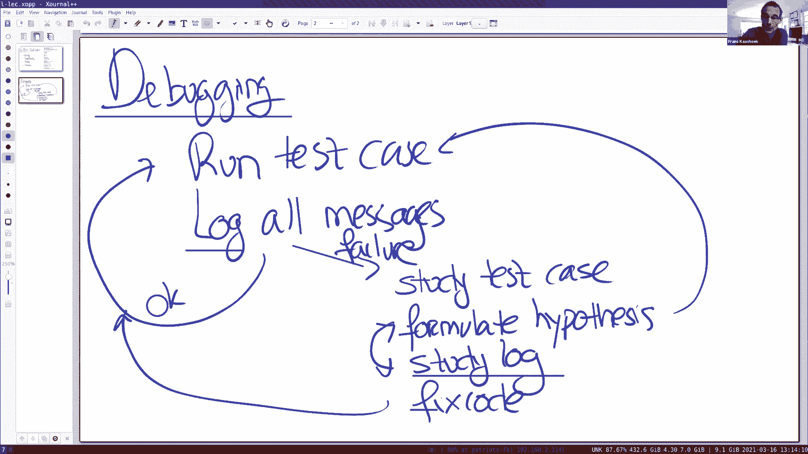
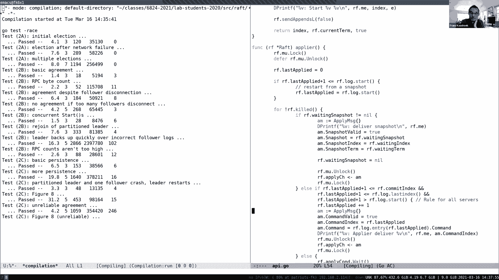

# 课程 P8：实验 2A 与 2B 问答 🧑‍🏫

在本节课中，我们将针对实验 2A 和 2B 进行专门的问答。我们将探讨调试方法、代码结构、选举、心跳、日志提交等核心概念，并分享一个具体的实现方案。

---

## 调试方法 🐛



调试是实验中最常遇到的问题。以下是一个系统化的高级调试流程。


首先，运行第一个测试用例。即使失败，它也是一个起点。在编写代码时，系统地记录所有消息至关重要。可以使用 `util.go` 中的 `DPrintf` 函数。

测试失败后，需要深入研究测试用例。测试用例的名称通常暗示了它要测试的场景。接下来，需要思考并假设代码失败的原因。

为了验证假设，需要分析日志。通过查看发送到协议的消息跟踪，可以定位问题所在。有时可能需要重新运行测试以获取更详细的日志输出。

一旦假设被证实，就可以修改代码并重新运行测试。这个过程是迭代且系统化的。建议将假设和证据记录在文本文件中，以确保修复代码的理由充分。

避免非系统化的方法，例如随意更改代码以查看测试是否通过。这可能导致 Bug 被隐藏或转移，在后续测试中再次出现。


以下是调试的关键步骤：
*   运行测试用例。
*   如果失败，研究测试用例和日志以形成假设。
*   验证假设。
*   修复代码。
*   进入下一个测试。

关于日志记录的粒度，建议记录所有细节。然后可以使用编辑器或 `grep` 等工具过滤出感兴趣的部分。一些人会构建额外的调试基础设施来简化日志分析。

关于日志输出，通常将调试信息通过管道重定向到文件中，而不是标准输出。

---

## 代码结构概览 🏗️

上一节我们介绍了调试方法，本节中我们来看看一个可能的 Raft 实现结构。这不是唯一的结构，但提供了一个清晰的范例。

整体结构围绕一个 `Raft` 结构体展开，它包含了图 2 中的所有状态变量，并使用一个粗粒度的锁进行保护。

主要的线程/协程包括：
*   **定时器线程**：周期性检查选举超时。
*   **Apply 线程**：唯一负责向 `applyCh` 写入已提交日志条目的线程，它在一个条件变量上等待。
*   **RPC 处理线程**：每个传入的 RPC 请求由 RPC 库启动一个线程处理。它们首先获取锁，读写 `Raft` 状态，然后释放锁。
*   **Start 调用**：客户端调用 `Start` 时，会获取锁，将命令追加到日志，然后释放锁。
*   **RPC 发送线程**：领导者会为每个追随者启动一个单独的线程来发送 `AppendEntries` RPC。这些线程在发送 RPC 时不持有锁，但在处理回复时会获取锁。

所有线程通过 `Raft` 锁进行序列化，这简化了并发控制。需要特别注意避免死锁，尤其是在持有锁时进行通道操作或发起 RPC 调用。

---

## 选举实现详解 🗳️

了解了整体结构后，我们深入看看选举部分的具体实现。

`Make` 函数初始化 Raft 状态，启动 `applier` 和 `ticker` 协程。`ticker` 每 50 毫秒触发一次，检查是否超时。

选举超时时间设置为 1 秒加上一个 0 到 300 毫秒的随机偏移。当 `ticker` 发现选举超时且当前节点不是领导者时，会调用 `startElectionL` 开始选举。

以下是 `startElectionL` 的关键步骤：
1.  增加 `currentTerm`。
2.  将状态转为 `Candidate`。
3.  投票给自己（设置 `votedFor`）。
4.  持久化状态（实验 2C 要求）。
5.  向所有其他节点并行发送 `RequestVote` RPC。

发送 RPC 前，在持有锁的情况下准备好参数。每个 RPC 在一个新协程中发送，发送时不持有锁。当收到回复时，回复处理程序会获取锁，并更新计票。

如果候选人获得了超过半数的选票，并且在选举期间 `term` 未变，它就赢得选举，调用 `becomeLeaderL` 成为领导者，并立即发送一轮心跳。

在 `RequestVote` RPC 的处理程序中，追随者遵循图 2 的规则：
*   如果 RPC 的 `term` 小于自己的 `currentTerm`，则拒绝投票。
*   如果 RPC 的 `term` 更大，则更新自己的 `term` 并转为追随者状态。
*   只有在（自己在本任期尚未投票 **或** 已经投给同一个候选人）**且** 候选人的日志至少和自己一样新时，才会授予投票。

判断日志新旧（`upToDate`）的规则是：比较最后一条日志的 `(term, index)`。任期号大的更新；任期号相同时，索引大的更新。

---

## 心跳与日志复制 ❤️

成为领导者后，需要发送心跳来维持权威并复制日志。心跳与日志复制的代码是同一套逻辑。

领导者通过 `sendAppendsL` 函数向所有追随者发送 `AppendEntries` RPC。对于每个追随者，领导者根据 `nextIndex` 猜测要从哪个日志索引开始发送条目。

`AppendEntries` 的参数构建如下：
```go
args := AppendEntriesArgs{
    Term:         rf.currentTerm,
    LeaderId:     rf.me,
    PrevLogIndex: nextIndex - 1,
    PrevLogTerm:  rf.log.entry(nextIndex - 1).Term,
    Entries:      rf.log.slice(nextIndex),
    LeaderCommit: rf.commitIndex,
}
```
需要小心地将日志条目切片复制到参数中，避免共享内存。

与发送投票请求类似，每个 `AppendEntries` RPC 在一个新协程中发送。回复处理程序 `processAppendReply` 在获取锁后处理：
*   如果回复的 `term` 更大，领导者退位为追随者。
*   如果 RPC 成功，则更新该追随者的 `nextIndex` 和 `matchIndex`。
*   如果 RPC 失败（通常因为日志不一致），则根据回复中的冲突信息快速回退 `nextIndex`，或者简单地将其减 1。

在处理完回复后，领导者会检查是否可以更新 `commitIndex`。规则是：寻找一个最大的索引 N，使得 N > `commitIndex`，并且大多数节点的 `matchIndex[i] >= N`，并且 `log[N].term == currentTerm`。然后设置 `commitIndex = N`。这个规则确保了图 8 描述的安全性（不提交旧任期的日志）。

当 `commitIndex` 更新时，会通过条件变量通知 `applier` 线程。

---

## 日志提交与应用 📤

`applier` 线程是唯一负责向 `applyCh` 写入的线程。它在条件变量上等待，当 `commitIndex > lastApplied` 时被唤醒。

被唤醒后，`applier` 获取锁，遍历 `lastApplied + 1` 到 `commitIndex` 之间的日志条目，为每个条目构造一个 `ApplyMsg`，然后在**释放锁后**将其发送到 `applyCh`。这样做是为了避免在通道操作上持有锁可能导致的死锁。

发送完毕后，更新 `lastApplied`。如果此时没有更多需要提交的条目，`applier` 线程再次在条件变量上等待。

---

## Start 命令处理 🚀

客户端通过调用 `Start(command)` 来提议一个新命令。在 `Start` 函数中：
1.  检查当前节点是否是领导者，如果不是则返回 `false`。
2.  是领导者，则创建一个新的日志条目（包含命令和当前任期）。
3.  将条目追加到本地日志。
4.  持久化日志（实验 2C 要求）。
5.  立即调用 `sendAppendsL`，将新条目广播给所有追随者。
6.  返回 `true` 以及新条目在日志中的索引。

---

## 总结 📝

本节课我们一起学习了实验 2A 和 2B 的实现要点。

我们首先探讨了系统化的调试方法，强调日志记录和假设验证的重要性。接着，我们分析了一个典型的 Raft 代码结构，它使用一个粗粒度锁来协调多个并发协程。

我们详细剖析了选举过程的实现，包括超时处理、投票请求的发送与处理，以及成为领导者后的状态转换。然后，我们深入研究了心跳与日志复制机制，涵盖了 `AppendEntries` RPC 的发送、冲突解决以及领导者提交索引的更新规则。

最后，我们了解了 `applier` 线程如何安全地将已提交的日志应用到状态机，以及 `Start` 命令的处理流程。



希望这些详细的解释和代码片段能帮助你更好地理解和完成实验。记住，这里展示的只是一种实现方式，你可以根据自己的理解进行设计和优化。