# 课程 P9：Zookeeper 详解 🐘


在本节课中，我们将学习分布式协调服务 Zookeeper。我们将探讨其设计背景、核心特性、性能优势以及它如何通过提供一种不同于线性一致性的保证来实现高性能。课程内容与实验3紧密相关，特别是关于线性一致性的讨论。


## 概述

Zookeeper 是一个来自 Apache 的开源项目，在实践中被广泛使用。它之所以有趣，主要有两个原因：**高性能**和**作为通用协调服务**。高性能体现在其异步客户端操作和允许从任何副本读取的设计上。作为协调服务，它旨在管理分布式应用中的配置信息，例如跟踪集群成员和主节点。


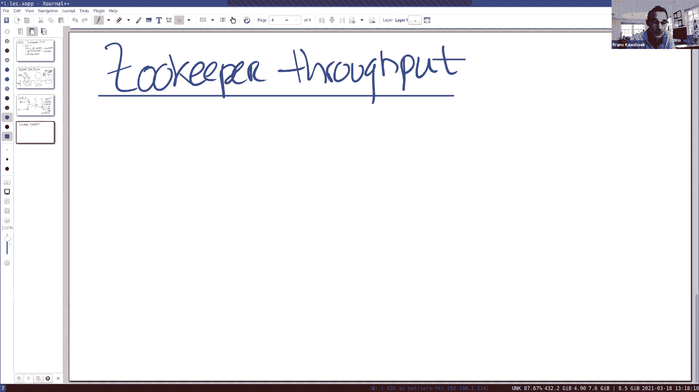


## 复制状态机基础


上一节我们介绍了 Zookeeper 的背景。本节中，我们来看看其底层架构的基础——复制状态机。

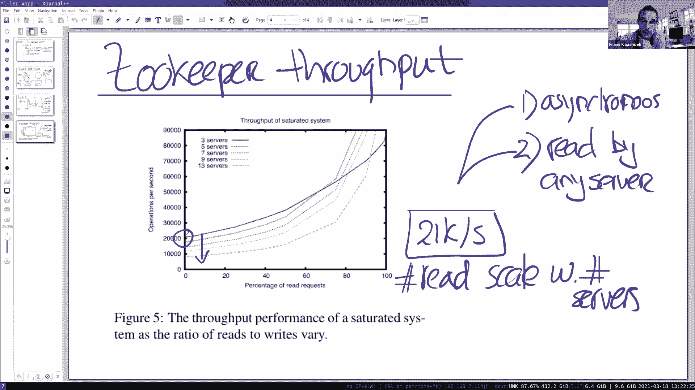

Zookeeper 服务器接收来自客户端的请求（例如创建 znode）。它使用一个独立的库（称为 ZAB，类似于 Raft 库）来分发这些操作。领导者将操作放入 ZAB，ZAB 与其他节点交互，创建一个在所有机器上保持一致的操作日志。然后，这个日志通过一个应用通道（apply channel）传递给服务，服务应用操作以响应客户端。

在实验3中，我们将在 Raft 之上实现一个键值存储服务，其操作是 `put` 和 `get`。Zookeeper 的结构略有不同，它由一棵 znode 树组成，但基本操作流程是相似的：底层的 ZAB 库对所有操作进行排序，并以相同的顺序应用到所有副本，从而确保每个副本的最终状态一致。


## 性能分析：简单方案 vs Zookeeper


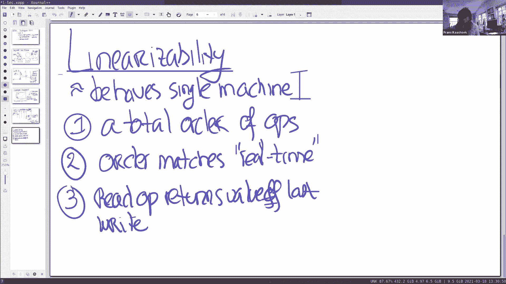

上一节我们介绍了复制状态机模型。本节中，我们来看看性能考量，并对比简单方案与 Zookeeper 的差异。

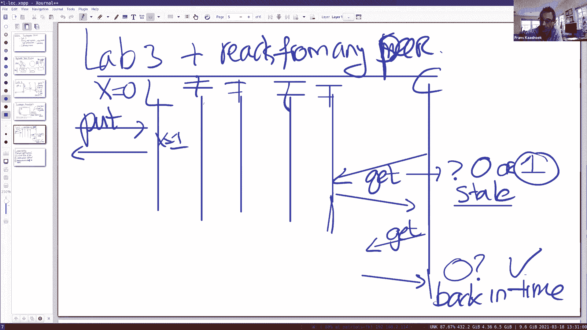

首先，考虑在实验3的简单方案中，一个 `put` 操作的性能。假设一切运行正常，领导者需要将操作写入自己的稳定存储，并发送给至少一个跟随者以形成多数派。这至少涉及一次网络往返和两次稳定存储写入（领导者和一个跟随者）。假设网络往返为1毫秒，每次SSD顺序写入为2毫秒，那么一次 `put` 操作大约需要5毫秒，即每秒约200次操作。

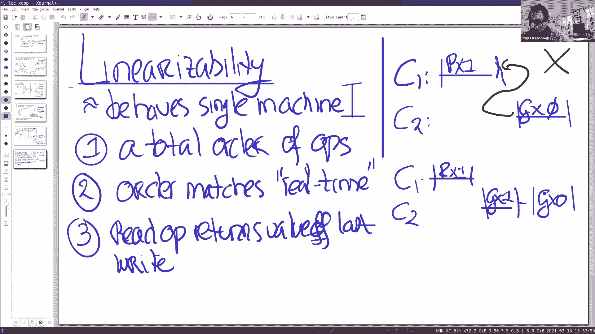


现在，让我们看看 Zookeeper 的性能。论文中的图表显示，对于纯写操作，3台服务器的吞吐量约为每秒21,000次操作；对于纯读操作，吞吐量可达每秒60,000-70,000次操作，并且读吞吐量随服务器数量线性扩展。写性能则随着服务器增加而下降，因为领导者需要联系更多服务器。


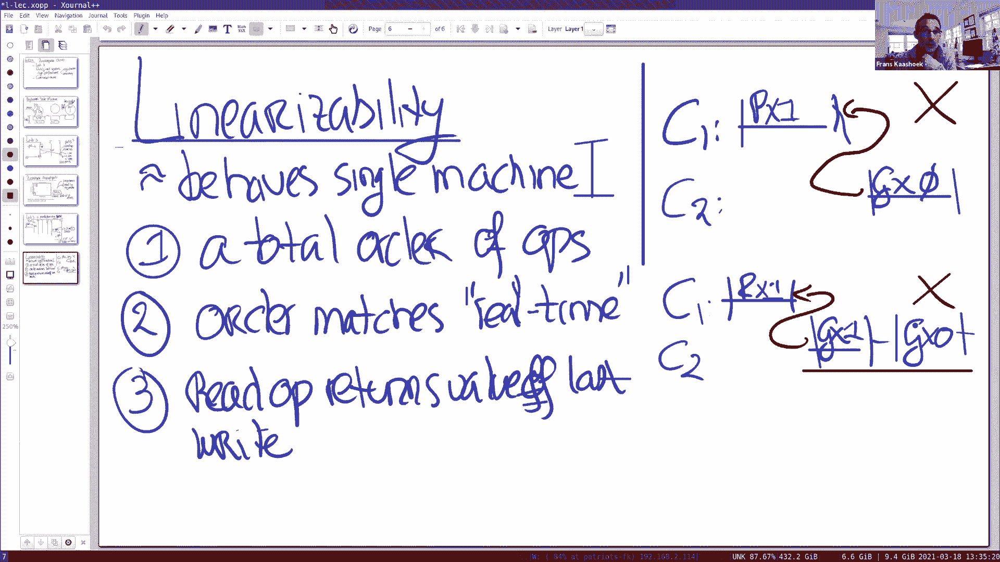


Zookeeper 实现高性能的两个关键思想是：
1.  **异步与批处理**：客户端可以异步提交多个操作，领导者可以将多个操作批量写入磁盘，减少磁盘I/O次数。
2.  **从任意副本读取**：读操作可以在任何服务器上处理，无需经过领导者，这极大地提升了读吞吐量和可扩展性。

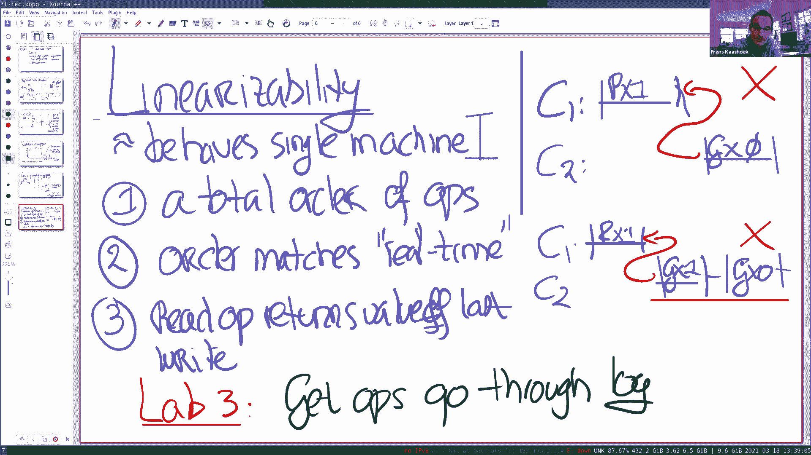

## 线性一致性 vs Zookeeper 的保证

上一节我们看到了从任意副本读取能带来性能提升。本节中，我们来看看这种“天真”的读取方案会带来什么问题，以及 Zookeeper 提供了何种一致性保证。

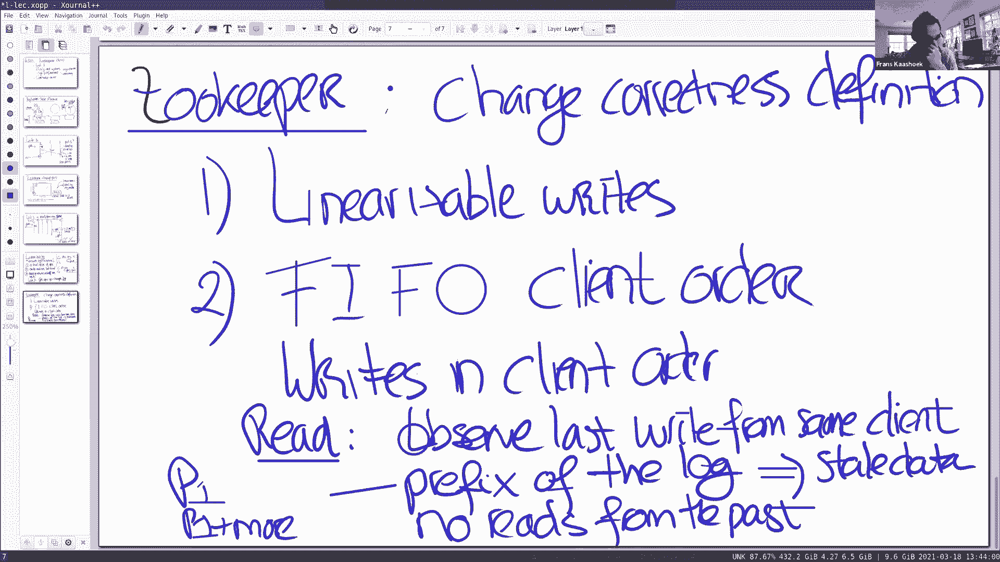


如果允许从任何跟随者读取，可能会出现两种问题：
1.  **读取过时数据**：读取可能无法看到最新的写入。
2.  **时间倒流**：客户端可能先读到新值，随后又读到旧值。

线性一致性要求系统表现得像一台单一机器，其正式定义包括：操作可以排列成一个整体顺序；该顺序需与真实时间匹配（如果一个操作在另一个开始前完成，则在前）；读操作必须返回最后一次写入的值。上述两种问题都违反了线性一致性。

在实验3中，为了保证线性一致性，简单的解决方案是让所有读操作（`get`）也通过领导者进行。但这牺牲了读性能的可扩展性。

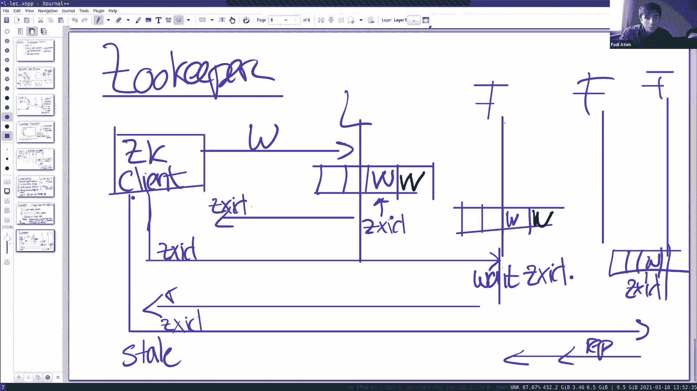

Zookeeper 没有提供线性一致性，它提供了一套不同的保证：
*   **线性化写入**：所有写入操作通过领导者并全局排序。
*   **FIFO 客户端顺序**：单个客户端发出的操作按其发送顺序生效。
*   **读取观察到某个一致前缀**：读操作可以返回日志的某个前缀状态，可能不是最新的。
*   **不读取过去**：对同一客户端，后续读取不能观察到比之前读取更旧的状态。

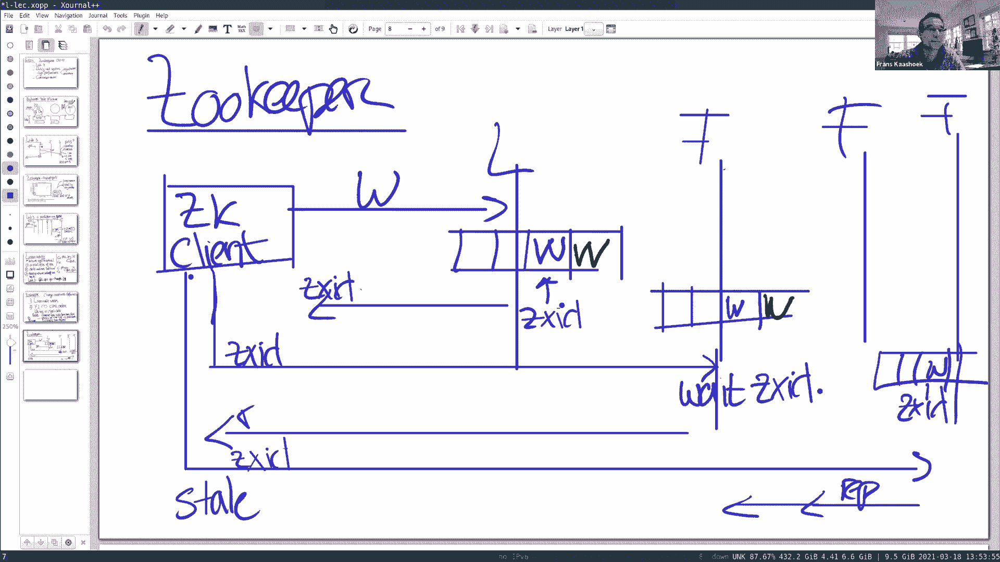


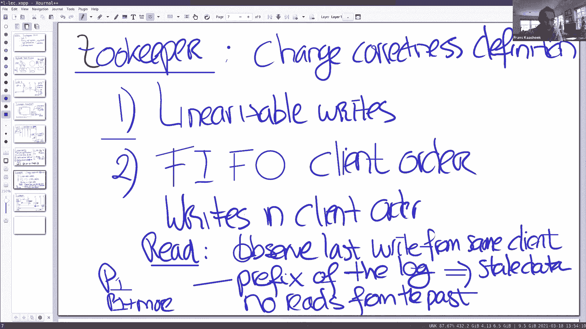

## Zookeeper 的实现机制

上一节我们了解了 Zookeeper 提供的一致性保证。本节中，我们来看看它如何实现这些保证。

Zookeeper 客户端与服务端建立会话（session）。当客户端执行写入时，领导者通过 ZAB 库将操作记录到日志中，并分配一个递增的 zxid（可视为日志索引）。提交后，领导者将 zxid 返回给客户端，客户端在其会话中记录该 zxid。


当客户端执行读取时，请求可以发送给任何跟随者，但会携带客户端已知的最后一次写入的 zxid。跟随者收到读请求后，会等待自己的日志至少应用到了该 zxid 所指示的位置，然后才回复读取结果。这确保了“不读取过去”的特性，但允许返回旧数据（即“读取观察到某个一致前缀”）。

## Zookeeper 的 API 与编程模型

上一节我们探讨了 Zookeeper 的实现机制。本节中，我们来看看其精心设计的 API 如何支持协调服务。


Zookeeper 的数据模型是一棵 znode 树。Znode 有三种类型：
*   **常规节点**：持久化存储。
*   **临时节点**：与客户端会话绑定，会话结束则节点自动删除。
*   **顺序节点**：创建时名字会自动附加一个单调递增的序列号。

其核心 API 包括：
*   `create(path, data, flags)`：创建节点。
*   `delete(path, version)`：删除节点（需指定版本号）。
*   `exists(path, watch)`：检查节点是否存在，并可设置监视（watch）。
*   `getData(path, watch)`：获取节点数据和版本号。
*   `setData(path, data, version)`：设置节点数据（需指定版本号，实现原子条件更新）。
*   `getChildren(path, watch)`：获取子节点列表。
*   `sync()`：强制同步，以实现线性化读取。


**版本号**是实现无锁式原子操作的关键。例如，实现一个原子递增计数器：

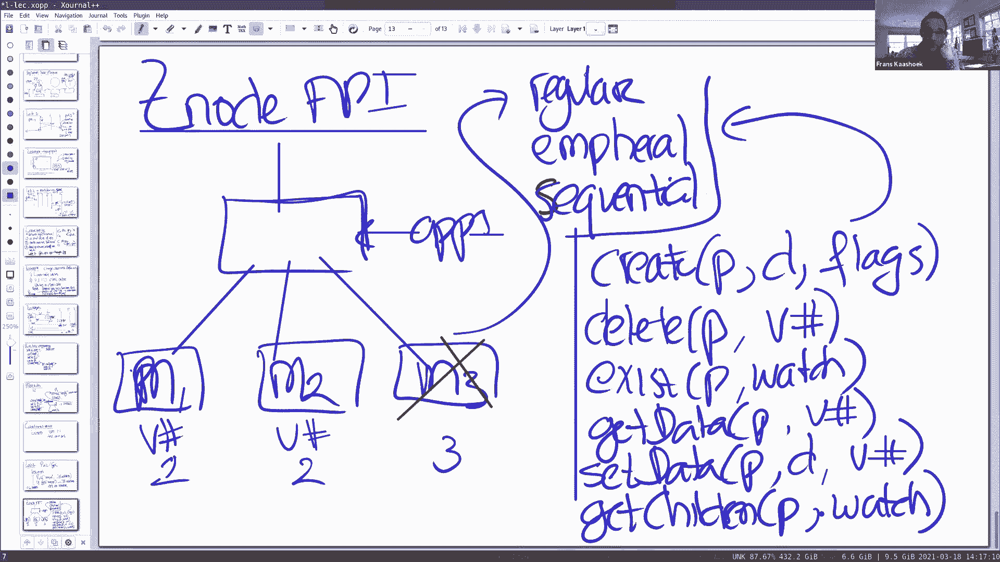

```python
while True:
    data, version = getData("/counter")
    new_value = int(data) + 1
    if setData("/counter", str(new_value), version):
        break # 成功
    # 版本号已变，重试循环
```

`setData` 操作只有在提供的版本号与当前节点版本号匹配时才会成功。这可以防止多个客户端基于过时状态进行更新，实现了类似 `test-and-set` 的原子操作。


**监视（Watch）** 机制允许客户端在节点发生变化时得到通知。Zookeeper 保证监视通知在触发它的变更操作之后、但在后续其他写入操作之前被传递。这有助于客户端在配置变更时做出正确响应，例如检测到主节点变更后，重新读取配置。

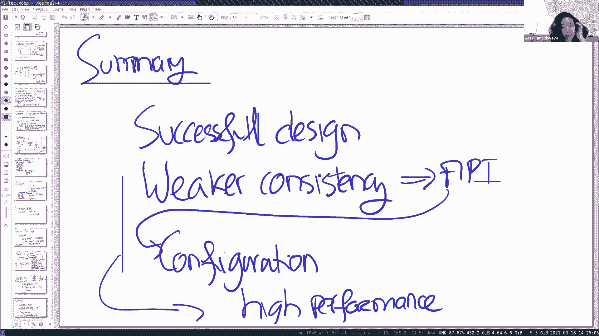

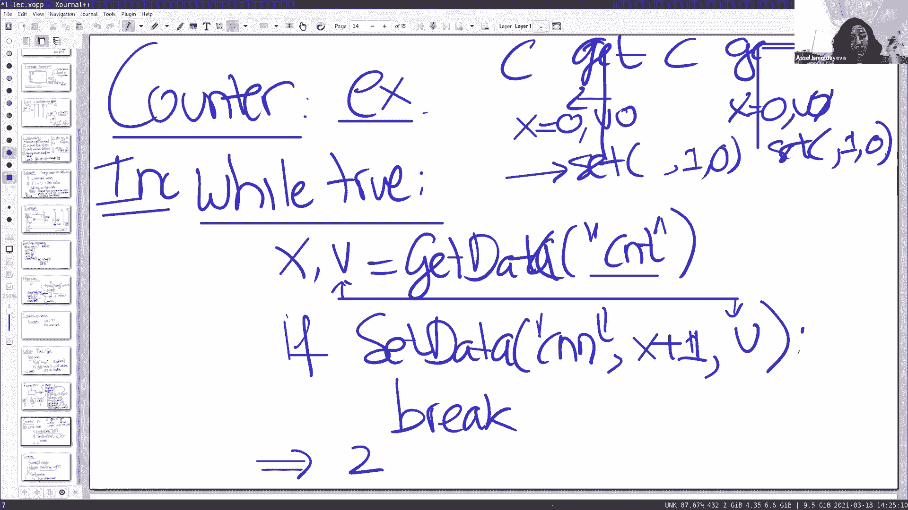


## 总结

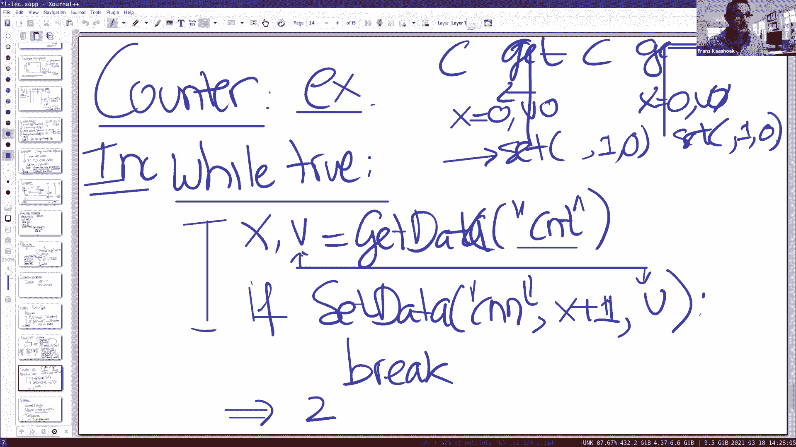

本节课中，我们一起学习了分布式协调服务 Zookeeper。它是一个非常成功且广泛使用的系统，其核心在于通过提供比线性一致性更弱但精心设计的一致性保证（线性化写入、FIFO客户端顺序、一致前缀读取）来换取高性能和高可扩展性。尽管编程模型比单一机器模型更复杂，但其精心设计的 API（如条件更新和监视机制）使得在其上构建正确的协调服务（如领导者选举、配置管理）成为可能。这种在一致性、性能和可编程性之间的权衡，是分布式系统设计中一个经典而重要的模式。