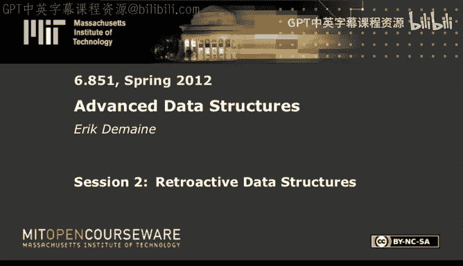
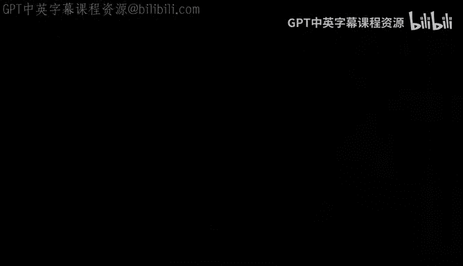

# 002：回溯数据结构 🕰️

在本节课中，我们将学习一种名为“回溯数据结构”的概念，它允许我们“穿越时间”，在过去的时间点插入或删除操作，并观察这些更改如何影响数据结构的当前状态。

## 概述

回溯数据结构让我们能够修改一个操作序列的历史。想象一条时间线，上面记录了所有对数据结构进行的更新操作（如插入、删除）。通常，我们只能在时间线的末尾（即“现在”）追加新操作。而回溯性允许我们回到过去的任意时间点，插入或删除一个操作，然后“快进”到现在，查看所有后续操作因这个改变而产生的连锁反应结果。这类似于电影《回到未来》中的时间旅行。

## 部分回溯性与简单情况

首先，我们定义“部分回溯性”。在这种模型中，我们可以在时间线的任意位置插入或删除更新操作，但**查询操作只能在时间线的末尾（即“现在”）进行**。

如果数据结构的更新操作满足以下两个性质，那么实现部分回溯性将变得非常简单：
1.  **交换性**：操作顺序不影响最终结果。即 `操作X` 后跟 `操作Y` 的结果，与 `操作Y` 后跟 `操作X` 的结果相同。
2.  **可逆性**：每个操作 `X` 都有一个对应的逆操作 `X⁻¹`，使得执行 `X` 后再执行 `X⁻¹` 等同于什么都没做。

**公式**：若更新可交换且可逆，则：
*   在时间 `T` **回溯插入**一个操作 `X`，等价于在现在（时间线末尾）执行 `X`。
*   在时间 `T` **回溯删除**一个操作 `X`，等价于在现在执行 `X⁻¹`。

**例子**：
*   **哈希表**：如果键是唯一的，那么插入和删除操作是可交换且互为逆操作。
*   **数组（仅加法）**：如果操作是“给数组元素加 Δ”，那么这些加法操作是可交换的，减法则是其逆操作。

上一节我们介绍了在简单条件下实现部分回溯性的方法。接下来，我们看看一种更强大但也更复杂的回溯性。

## 完全回溯性与可分解搜索问题

“完全回溯性”比部分回溯性更强：它允许在**任意时间点**进行查询，而不仅仅是现在。实现完全回溯性通常更困难。

然而，对于一类称为“可分解搜索问题”的数据结构，我们可以高效地实现完全回溯性，仅需付出对数级的时间开销。

一个**可分解搜索问题**需要维护一个对象集合 `S`，支持插入、删除和某种查询。关键特性在于其查询函数 `Q` 必须是“可分解”的：

**公式**：对于任意将集合 `S` 划分成的两个子集 `A` 和 `B`，存在一个可在常数时间内计算的组合函数 `F`，使得：
`Q(S) = F( Q(A), Q(B) )`

**例子**：
*   **最近邻搜索**：查询距离某个点最近的点。集合 `S` 的最近邻，等于子集 `A` 的最近邻和子集 `B` 的最近邻中更近的那个。
*   **后继查询**：在一维线上查找某个值的下一个元素。
*   **点定位**：后续课程会涉及。

对于可分解搜索问题，我们可以使用一种名为**线段树**的数据结构来实现完全回溯性。

### 线段树方法

我们构建一棵基于时间的平衡二叉搜索树。树的每个叶子代表一个时间点，每个内部节点代表一个时间区间。

**核心思想**：每个数据元素（例如，被插入后又删除的对象）存在于一个连续的时间区间内。我们将这个元素存储在线段树中**恰好能覆盖其存在区间的、数量为 O(log n) 的节点**里。

**操作**：
*   **回溯更新**：当插入或删除一个元素时，我们在线段树中对应的 O(log n) 个节点上，对**非回溯版本**的底层数据结构执行插入或删除。
*   **时间点查询**：要查询在某个时间 `t` 的状态，我们从代表时间 `t` 的叶子节点向上走到根，并查询路径上所有节点的底层数据结构。利用查询的可分解性，我们可以用函数 `F` 将这些部分结果合并，得到时间 `t` 的完整查询结果。

这种方法在时间和空间上都引入了 O(log n) 的乘性开销。

我们看到了对于可分解搜索问题，完全回溯性是可行的。那么，对于更一般的数据结构，情况如何呢？

## 通用方法的下界

不幸的是，对于任意的数据结构，高效的回溯性通常是不可行的。最直观的通用方法是“回滚法”：要修改过去，就先“回滚”到那个时间点，执行更改，然后重新执行（“重放”）之后的所有操作。这种方法需要 O(r) 的时间，其中 `r` 是从修改点到现在的操作数量。

研究表明，对于某些问题，这种线性的开销在理论上是最优的，无法被显著改进。这类似于一个哲学结论：像《回到未来》那样随意修改历史而不付出重历时间的代价，在计算上是困难的。

一个具体的下界例子是模拟一个简单的两寄存器计算机（寄存器 X 和 Y），支持设置 X、给 Y 加值、计算 X*Y 存入 Y 等操作。通过一系列操作可以计算多项式。如果回溯性地改变早期对 X 的赋值，那么在最坏情况下，重新计算当前 Y 的值需要的时间与多项式次数成正比，即 Ω(n)，即使每个原始操作本身是常数时间。

尽管存在这些下界，我们仍然可以在一些重要的、非平凡的数据结构上实现高效的回溯性。

## 案例研究：优先队列（部分回溯）

优先队列是一个经典例子，其操作（插入 `insert(k)` 和删除最小元 `delete-min`）不是可交换的。在时间线中插入一个过去的 `insert` 可能引发连锁反应，改变后续所有 `delete-min` 的结果。

然而，我们仍然可以实现**部分回溯性**（仅在现在查询），且每个回溯操作仅需 **O(log n)** 时间。

### 关键思想与数据结构

我们不显式维护所有元素随时间的完整状态变化（那会导致线性连锁更新），而是维护一些辅助信息来快速计算回溯操作对“现在”队列的影响。

**定义**：时间 `T` 是一个“桥”，如果在此时间点，队列中所有元素都将一直存在到时间线结束（即之后不会被删除）。桥是时间线上的“平静点”。

**引理**：要计算在时间 `T` 插入一个键 `k` 后，最终队列（“现在”）中会增加哪个元素，可以找到时间 `T` 之前的第一个桥 `T‘`。那么，新插入的元素将是：所有在 `T‘` 之后被插入、且最终不在队列中的键里面的最大值。

基于这个引理，我们维护以下数据结构：
1.  **最终队列 `Q_now`**：用一个平衡二叉搜索树维护当前时间点的所有元素。
2.  **按时间排序的插入操作树**：叶子是所有 `insert` 操作，按时间排序。每个节点维护一个值：该子树中所有**最终不在 `Q_now` 中的键**的最大值。
3.  **按时间排序的所有操作树**：叶子是所有操作（`insert` 和 `delete-min`）。为每个叶子赋予一个权值：若该 `insert` 的键最终在 `Q_now` 中，权值为 0；若不在，权值为 +1；`delete-min` 权值为 -1。每个节点维护子树权值和。

**操作**：
*   **查找前驱桥**：利用操作树的子树权值和，可以在 O(log n) 时间内找到任意时间点 `T` 的前一个桥 `T‘`（即前缀权值和为 0 的点）。
*   **执行回溯插入**：
    1.  找到插入时间 `T` 的前驱桥 `T‘`。
    2.  在插入操作树中，找到 `T‘` 之后所有插入操作对应的键的最大值（利用节点维护的 max 值）。
    3.  结合新插入的键 `k`，确定最终哪个键会进入 `Q_now`。
    4.  更新 `Q_now` 以及两棵辅助树中的相关信息。

所有步骤都能在 O(log n) 时间内完成。

## 其他数据结构的回溯性

以下是其他一些数据结构已知的回溯性结果：
*   **队列（FIFO）/栈（LIFO）**：部分回溯可达 O(1) 时间；完全回溯可达 O(log M) 时间。
*   **双端队列**：完全回溯可达 O(log M) 时间。
*   **并查集**：完全回溯的最佳已知结果是 O(log M) 时间。
*   **优先队列（完全回溯）**：这是一个开放问题，最佳已知结果是通过通用转换得到的 O(√M * log M) 时间。
*   **后继问题**：这是回溯性研究中的一个核心问题。作为可分解搜索问题，完全回溯可达 O(log² M) 时间。已有更复杂的结果将其优化至 O(log M) 时间。

## 非 oblivious 回溯性

前述的回溯性模型假设查询是“被动的”，即查询结果不会影响后续的更新操作。这被称为 **oblivious 回溯性**。

**非 oblivious 回溯性** 考虑了更现实的场景：算法根据查询结果来决定后续进行什么更新操作。在这种情况下，回溯性地修改一个过去的操作，不仅可能改变后续查询的结果，还可能改变后续的更新操作本身。

**目标**：数据结构需要能够报告，在进行了回溯修改后，**最早在哪个时间点出现了“错误”**——即某个查询或更新操作基于旧状态执行，而现在状态已改变。

**假设**：算法会以单调从左到右的方式修复错误：它找到第一个错误，在那里进行必要的回溯更改，然后继续寻找并修复下一个错误，直到所有操作与新的时间线一致。

**例子：优先队列的非 oblivious 回溯**
在这种情况下，我们需要支持回溯插入/删除三种操作：`insert`, `delete-min`, 以及 `query-min`。问题可以转化为在二维平面（时间 vs. 键值）上维护动态线段（元素的存在区间）和点（查询），并支持：
*   **向上射线查询**：在某个时间点进行 `query-min`，相当于从该时间点向上发射射线，找到碰到的第一条线段（最小键值）。这本质上是动态的后继查询。
*   **向右射线查询**：当删除一个删除操作时，需要知道一个水平线段向右延伸会碰到什么。这本质上是另一种方向的后继查询。

通过利用高效的动态射线射击/后继查询数据结构（如改进的完全回溯后继数据结构），可以实现所有非 oblivious 回溯操作在 O(log M) 时间内完成。

## 总结

本节课我们一起学习了回溯数据结构这一强大的概念：
1.  **部分回溯性**允许修改过去的更新，但只在现在查询。对于更新操作可交换且可逆的数据结构，这很容易实现。
2.  **完全回溯性**还允许在过去查询。对于**可分解搜索问题**，我们可以使用线段树技术，以 O(log n) 的开销实现它。
3.  对于通用数据结构，高效的完全回溯性通常不可能，最坏情况下需要线性时间来回滚和重放操作。
4.  我们深入探讨了**优先队列**的**部分回溯性**实现，它通过巧妙的辅助数据结构和“桥”的概念，在 O(log n) 时间内处理了潜在的线性连锁反应。
5.  最后，我们了解了**非 oblivious 回溯性**，它考虑了查询结果对后续操作流的影响，并通过将其转化为动态几何查询问题（如射线射击）来解决。

回溯性为我们提供了“调试”或“修正”算法历史的能力，是数据处理中一个非常深刻和有用的工具。