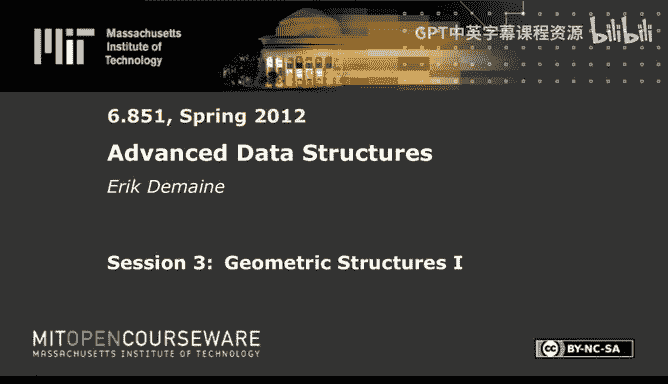

# 003：几何结构 I 🧭

在本节课中，我们将学习两种几何数据结构问题：平面点定位和正交范围搜索。我们将探讨两种核心技术：将静态数据结构动态化的权重平衡技术，以及听起来很酷但原理其实很简单的**分数级联**技术。我们还会看到它们与持久化和可回溯性之间的联系。

## 平面点定位 🗺️

平面点定位问题是指，给定一个平面地图（由互不相交的直线段构成的平面图），我们需要快速确定一个查询点位于地图中的哪个面内。这在地理信息系统（如GPS定位）和图形用户界面（如鼠标点击检测）中都有应用。

### 静态版本与扫描线技术

在静态版本中，地图是预先给定的。我们可以使用**扫描线技术**来解决一个相关的问题：垂直射线射击。想象一条垂直线从左向右扫描整个平面。在扫描过程中，我们用一个平衡二叉搜索树来维护当前与扫描线相交的所有线段，并按它们的Y坐标排序。

当我们遇到一条线段的左端点时，就将其插入树中；遇到右端点时，则将其删除。这样，对于任意X坐标（即扫描线的某个“时刻”），我们都能知道该位置垂直线上的线段顺序。

### 引入持久化

如果我们对这个二叉搜索树应用**部分持久化**，会发生什么？持久化允许我们查询数据结构在过去任意时刻的状态。这意味着，对于一个给定的查询点 `(x, y)`，我们可以“回到”X坐标为 `x` 的那个时刻，然后在对应的持久化二叉搜索树中，查询Y坐标 `y` 的前驱和后继线段。这正好回答了“从点 `(x, y)` 向上发射的垂直射线首先击中哪条线段？”这个问题，即**垂直射线射击查询**。

通过这种方式，我们仅用 `O(log n)` 的查询时间就解决了静态平面点定位问题。持久化巧妙地为我们增加了一个“时间”维度。

### 引入可回溯性

如果我们想让地图动态变化（即支持线段和顶点的插入与删除），该怎么办？这时可以使用**部分可回溯性**。对于由水平和垂直线段组成的正交地图，我们可以将线段的插入和删除视为对可回溯数据结构（如前驱查询结构）的“过去”进行修改。这样，我们就能在 `O(log n)` 时间内支持动态更新和查询。

然而，对于由任意方向线段组成的一般性地图，动态问题更加困难，目前最好的算法在更新和查询时间之间需要权衡。

---

## 正交范围搜索 📦

正交范围搜索是另一个经典问题：给定平面上的一组点，我们需要快速回答诸如“在这个矩形查询窗口内有多少个点？”或“列出矩形内的所有点”这样的查询。

### 一维范围树

我们先从一维情况开始。给定一组点（在一条线上）和一个区间查询 `[a, b]`，我们可以使用二叉搜索树，并将所有数据存储在**叶子节点**中。搜索 `a` 和 `b` 的过程会在树中定位到两个叶子节点，而答案（位于 `[a, b]` 区间内的所有点）就由这两个搜索路径之间的 `O(log n)` 棵子树隐含表示。我们可以通过存储子树大小来快速计算点的数量，或者按顺序遍历来列出前K个点。

### 多维范围树

对于二维情况，查询是一个矩形 `[x1, x2] × [y1, y2]`。一个直观的想法是构建一棵主**X范围树**，它按X坐标组织所有点。对于X树中的每个节点（代表一个X坐标区间），我们为其对应的点集再构建一棵辅助的**Y范围树**，按Y坐标组织。

查询时，我们首先在主X树中找到覆盖 `[x1, x2]` 区间的 `O(log n)` 棵子树。对于每一棵这样的子树，我们进入其对应的Y范围树，执行一次一维Y区间查询 `[y1, y2]`。这总共需要 `O(log² n)` 时间。空间上，每个点会出现在 `O(log n)` 棵Y树中，因此总空间为 `O(n log n)`。

这个思想可以推广到d维，得到 `O(log^d n)` 的查询时间和 `O(n log^{d-1} n)` 的空间。

### 分层范围树与分数级联

我们可以通过**分数级联**技术将二维查询时间优化到 `O(log n)`。其核心思想是**重用搜索**。

我们不再为每个X子树节点存储一棵完整的Y范围树，而是存储一个按Y排序的数组。关键技巧在于，我们从全局的Y排序数组（根节点）开始，进行一次二分搜索，找到 `y1` 和 `y2` 的位置。然后，当我们沿着X树向下遍历时，通过预存储的指针，可以在常数时间内确定在子节点的Y数组中 `y1` 和 `y2` 的新位置，而无需重新进行二分搜索。

这本质上是将全局的Y搜索信息“级联”到了局部。通过精心设计指针（例如，从“被提升”的元素指向其在相邻列表中对应的位置），我们可以在 `O(log n)`（用于最初的全局搜索）加上 `O(k)`（用于输出结果）的时间内完成查询。对于d维情况，此技术可以将最后一维的 `log n` 因子优化掉。

---

## 动态化：权重平衡树 ⚖️

上述的分层范围树结构是静态的。为了支持点的插入和删除，我们需要一种方法将其动态化。这里我们使用**权重平衡树**（如BB[α]树）。

### 定义与性质

在权重平衡树中，对于每个节点，我们要求其左子树和右子树的**大小**（节点数）至少是节点本身大小的一个常数比例 α（α < 1/2）。这比高度平衡条件更强，意味着树高是 `O(log n)`。

### 更新策略

插入或删除一个点时，我们像普通二叉搜索树一样在叶子层面进行操作。这可能会破坏从叶子到根路径上一些节点的权重平衡条件。

当检测到一个节点不再平衡时，我们采用的策略非常直接：**重建**以该节点为根的整个子树，将其重构成一棵完全平衡的树。重建的成本与子树大小成线性关系。

### 摊还分析

为什么这样做是高效的？关键点在于，如果一个子树被重建为完全平衡，那么需要 `Ω(|子树大小|)` 次更新才能再次使其变得不平衡。虽然一次更新可能影响 `O(log n)` 个祖先节点，但通过摊还分析，我们可以将重建成本分摊到导致不平衡的那些更新上。最终，每个更新操作的**摊还时间复杂度**为 `O(log n)`。

对于带有复杂augmentation（如我们分层范围树中的数组和指针）的结构，重建整个子树比尝试动态维护所有指针要简单得多。只要静态构建时间是 `O(size * polylog(size))`，动态更新就能达到 `O(polylog(n))` 的摊还时间。

将权重平衡树应用于分层范围树，我们可以在二维情况下实现 `O(log n)` 的查询时间和 `O(log² n)` 的摊还更新时间。

---

## 分数级联通论 🔗

最后，我们更一般地探讨**分数级联**技术。它解决的是这样一个问题：在多个有序列表 `L1, L2, ..., Lk` 中搜索同一个元素 `x`（即找到 `x` 在每个列表中的前驱和后继）。

### 朴素方法与改进目标

朴素的方法是进行k次独立的二分搜索，耗时 `O(k log n)`。分数级联的目标是将其优化到 `O(k + log n)`，这几乎是最优的。

### 核心思想：提升与级联

1.  **提升**：从最底层的列表 `Lk` 开始，我们取其中一部分元素（例如，每隔一个元素），并将它们“提升”到上一层列表 `L_{k-1}` 中，形成一个新的列表 `L'_{k-1}`。这个过程递归进行，每一层都从下一层提升一个常数比例（如1/2）的元素到本层。
2.  **指针**：在每个提升后的列表 `L'_i` 中，我们在“被提升的元素”（来自 `L_{i+1}`）和“原生元素”（原本在 `L_i` 中）之间建立双向指针。同时，每个元素也存储指向其在相邻列表（`L'_{i-1}` 和 `L'_{i+1}`）中对应位置的指针。

### 查询过程

查询时，我们只在最顶层的列表 `L'_1` 中进行一次二分搜索，找到 `x` 的位置。然后，利用存储的指针，我们可以在常数时间内确定 `x` 在下一层列表 `L'_2` 中的可能位置范围（因为该范围大小是常数）。通过几次局部比较，就能精确定位。以此类推，我们可以一路向下，在 `O(k + log n)` 的总时间内找到 `x` 在所有原始列表 `L_i` 中的位置。

### 推广到图结构

分数级联可以进一步推广到图结构。图中每个节点都有一个元素集合。边上有标签（值域区间），只有查询值 `x` 落在该区间内时，才能沿这条边移动。搜索的目标是从某个起始节点开始，沿着符合条件的边访问k个特定节点，并找到 `x` 在每个节点集合中的位置。只要每个节点的“入边”在任意 `x` 处的交集大小有常数上界（局部有界入度），分数级联技术就能同样实现 `O(k + log n)` 的搜索效率。这个强大的工具被用来解决许多几何查询问题，并获得了最优的时间复杂度。

---

本节课中，我们一起学习了平面点定位和正交范围搜索这两个几何数据结构问题。我们看到了如何利用持久化和可回溯性来解决点定位问题，并深入探讨了范围树及其通过分数级联和权重平衡树实现的优化与动态化。分数级联作为一种通用的搜索加速技术，其思想深刻而优雅，在众多领域都有广泛应用。