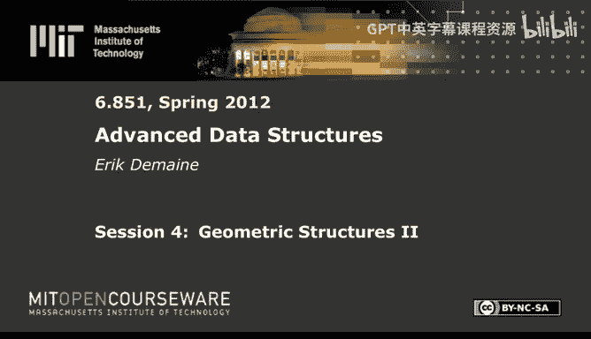
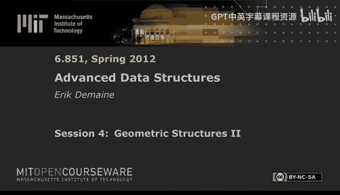

# 004：几何结构 II 🧮





在本节课中，我们将学习如何利用分数级联技术改进三维正交范围搜索，并介绍一种处理动态移动数据的新数据结构——动力学数据结构。

---

## 分数级联在三维正交范围搜索中的应用 🔍

上一节我们介绍了分数级联的基本概念，本节中我们来看看如何利用它来优化三维正交范围搜索。

分数级联允许我们在 K 个有序列表中搜索同一个元素 X，并在 O(log n + K) 时间内找到其在每个列表中的前驱和后继，而不是简单的 O(K log n)。当我们在一个有界度的图中导航，且每个节点都有一个这样的列表时，只要花费 O(log n) 时间启动，就能在常数时间内知道 X 在每个列表中的位置。

### 从二维受限查询开始

我们从一个二维受限的正交范围查询开始。具体来说，我们考虑一个在 Y 和 Z 坐标上的查询，其左端点不存在，即查询区域是一个延伸到 B2 和 B3 的二维象限。我们希望找到所有被点 (B2, B3) 支配的点（即 Y 和 Z 坐标都小于等于该点的点）。

我们可以用 O(log n + K) 时间解决这个问题，但更精确地说，其成本是：在 Z 坐标列表中搜索 B3 的时间，加上 O(K)。我们这样表述是为了后续应用分数级联。

### 转化为射线穿刺问题

接下来，我们将此问题转化为一种射线穿刺问题。假设我们有一些点，给定一个查询点，我们想找到所有在该查询点左下象限内的点。我们可以从查询点向左画一条水平射线，并从每个点向上画一条垂直射线。射线的交点就对应着在查询象限内的点。

我们希望预处理这些垂直射线，使得我们可以用一条水平射线进行穿刺。理想情况下，我们希望在 O(log n) 时间内启动，然后以常数时间处理每个交点。这可以通过对平面进行分解来实现：从每个点向右和向左延伸水平线段，直到碰到其他线段或无限远。这样就将平面分解成了许多“板条”或“砖块”。

### 应用分数级联思想

在这种分解中，一个面（face）的右侧可能有许多出边。为了在常数时间内确定走哪条边，我们可以应用分数级联的思想：将一半的边“提升”到左侧的面上。这样，每个面的出边度数就变成了常数，从而我们可以在常数时间内遍历。这个过程只增加线性的额外边，因此空间复杂度是线性的。

这样，我们就得到了一个解决二维象限查询的高效数据结构，为后续扩展到三维奠定了基础。

---

## 扩展到三维正交范围搜索 📦

上一节我们构建了高效的二维象限查询工具，本节中我们来看看如何将其扩展到三维。

### 处理带 X 区间约束的查询

假设我们现在有一个三维查询，其中两个区间（比如 Y 和 Z）的左端点是负无穷，但 X 坐标是一个常规区间 [A1, B1]。我们希望用 O(log n) 次搜索加上 O(K) 的时间来解决。

这可以通过一维范围树轻松实现：
*   在 X 坐标上建立范围树。
*   每个节点存储一个针对其子树中点的**二维**数据结构（即上一步构建的，用于处理 `(-∞, B2], (-∞, B3]` 查询）。
*   查询时，我们找到代表 X 区间 [A1, B1] 的 O(log n) 个节点，对每个节点存储的二维数据结构进行查询。
*   每个二维查询花费一次搜索（在 Z 列表中找 B3）加上 O(K_i) 时间，其中 K_i 是该节点输出的点数。总的 K_i 之和为 O(K)。

因此，总时间是 O(log n) 次搜索 + O(K)。关键点在于，这 O(log n) 次搜索都是在寻找同一个值 B3，这为应用分数级联创造了条件。

### 将单边区间转换为双边区间

目前我们的三维查询还有两个维度（Y 和 Z）是单边区间（-∞ 作为左端点）。接下来，我们展示一个巧妙的转换，可以将 Y 维度的单边区间 `(-∞, B2]` 转换为双边区间 `[A2, B2]`，且只增加空间开销，不增加查询时间。

我们在 Y 坐标上建立另一棵范围树：
*   每个节点 V 存储两个数据结构：
    1.  一个针对其**右子树**中点的**二维**数据结构（处理 `(-∞, B2], (-∞, B3]`）。
    2.  一个针对其**左子树**中点的、**Y 轴反转**的二维数据结构（处理 `[A2, +∞), (-∞, B3]`）。
*   查询时，我们从根节点开始，根据查询区间 `[A2, B2]` 与节点键值的关系向下遍历：
    *   如果节点键值在区间左侧，则向右子树走。
    *   如果节点键值在区间右侧，则向左子树走。
    *   如果节点键值被区间包含（即区间跨越该键值），那么我们**只**需要查询该节点存储的两个数据结构（一个针对右子树，一个针对左子树），然后停止递归。这只需要常数次（2次）对二维数据结构的调用。

这个转换的精妙之处在于，我们只进行了一次 O(log n) 的树遍历，并在遍历路径的“分叉点”进行了常数次工作，从而将 Y 维度的双边查询，转化为了常数个 Y 维度的单边查询。我们为此付出了 O(log n) 倍的空间开销。

### 完成三维双边查询

现在，我们对 Z 维度重复完全相同的转换过程：
*   在 Z 坐标上建立范围树。
*   每个节点存储两个**三维**数据结构（一个常规，一个 Z 轴反转），用于处理 `[A1, B1], [A2, B2], (-∞, B3]` 和 `[A1, B1], [A2, B2], [A3, +∞)` 的查询。
*   通过一次 O(log n) 的遍历和常数次对三维数据结构的调用，最终将 Z 维度也转换为双边查询 `[A3, B3]`。

至此，我们实现了完整的三维正交范围查询 `[A1, B1] x [A2, B2] x [A3, B3]`。

### 复杂度分析与分数级联的作用

整个查询过程可以看作在一个有常数度的图中导航：
1.  在 Z 范围树中启动，花费 O(log n)。
2.  触发常数次三维查询。
3.  每个三维查询在 Y 范围树中启动，花费 O(log n)，并触发常数次二维查询。
4.  每个二维查询最终触发 O(log n) 次对一维 Z 列表的搜索。

如果不加优化，总时间将是 O(log² n + K)。然而，注意到在整个调用链中，我们反复搜索的是同一个值（B3 或 A3）。虽然我们有常规和反转两种版本，但这只是常数因子。整个导航图具有常数度，因此**分数级联技术可以应用**。

应用分数级联后，所有搜索共享信息，使得总时间从 O(log² n + K) 降低到 **O(log n + K)**。空间复杂度为 O(n log² n)（由于两层范围树）。

这个结果非常出色，它将 D 维正交范围报告查询的时间从上一讲的 O(logᴰ⁻¹ n + K) 改进到了 O(logᴰ⁻² n + K)。对于 D=3，我们实现了 O(log n + K) 的查询时间。

---

## 动力学数据结构简介 ⏱️

上一节我们深入探讨了静态几何查询的优化，本节中我们来看看一种处理动态移动数据的新范式——动力学数据结构。

在动力学数据结构中，数据点不是静止的，而是随着时间运动，每个点有一个已知的运动轨迹（例如，位置是时间的函数）。我们需要支持三种操作：
1.  `advance(t)`：将当前时间推进到 t。
2.  `change(p, new_trajectory)`：改变点 p 的运动轨迹。
3.  `query(...)`：在**当前时间**进行查询（例如，范围查询、最近邻等）。

### 核心思想：证书（Certificates）

几乎所有动力学数据结构都遵循一个统一的框架：
1.  **存储当前数据结构**：维护一个在**当前时刻**正确的数据结构，使得查询可以快速进行。
2.  **存储证书**：同时存储一组称为“证书”的布尔条件。这些条件在当前时刻为真，并且只要它们保持为真，数据结构就保持正确。
    *   例如，在一个维护最小值的堆中，证书就是每个节点小于其子节点的关系。
3.  **预测失效时间**：对于每个证书，根据点的运动轨迹，计算出它将来会变为假的最早时间（失效时间）。
4.  **事件队列**：将所有证书的失效时间放入一个优先队列中。

### 算法流程

*   **查询**：直接在当前数据结构上进行，非常快。
*   **推进时间 `advance(t)`**：
    ```python
    while t >= priority_queue.min().failure_time:
        event_time = priority_queue.pop_min()
        # 处理事件：修复失效的证书和数据结构
        handle_event(event_time)
    current_time = t
    ```
*   **处理事件**：当一个证书失效时（例如，两个点的大小关系发生交换），我们需要：
    1.  更新数据结构以反映新的顺序（例如，在堆中交换两个节点）。
    2.  删除与已交换点相关的旧证书。
    3.  添加与新结构相关的新证书。
    4.  为这些新证书计算失效时间，并插入优先队列。

### 分析维度

评价一个动力学数据结构的优劣主要从以下几个维度考虑：
1.  **响应性**：处理一个事件所需的时间。通常希望是 O(log n) 或更好。
2.  **局部性**：每个数据点参与其中的证书数量。局部性好（如常数）通常意味着响应性好。
3.  **紧凑性**：证书的总数量。通常希望是 O(n) 或 O(n log n)。
4.  **效率**：这是最核心也最复杂的指标。它衡量在没有任何 `change` 操作、单纯从初始时间推进到无穷远的过程中，数据结构处理的事件总数，与问题本身固有的“外部事件”数量（如最小值改变的次数）之间的关系。理想情况下，我们希望效率高，即事件总数接近下界。

### 示例：动力学堆（Kinetic Heap）

让我们以维护最小值的动力学堆为例：

*   **数据结构**：一个标准的二叉最小堆。
*   **证书**：对于每个节点，其值小于等于其两个子节点的值。共有 O(n) 个证书，局部性为常数（每个点涉及最多3个证书：父节点和两个子节点）。
*   **事件处理**：当证书 `父节点 < 子节点` 即将失效时，交换这两个节点，并更新相关的证书（常数个）。
*   **效率分析**：可以证明，对于伪代数运动轨迹，事件总数是 **O(n log n)**。而最小值本身最多改变 O(n) 次。因此，这个动力学堆的效率因子是 O(log n)，被认为是高效的。

相比之下，如果我们用一个始终保持全局排序的动力学二叉搜索树来维护最小值，虽然也能工作，但其事件总数可能高达 Ω(n²)，效率很低。动力学堆通过维护局部堆性质，巧妙地减少了不必要的事件处理。

### 其他动力学问题

动力学数据结构的研究涵盖了许多几何问题：
*   **二维凸包**：事件数可达 O(n²+ε)，接近下界 Ω(n²)。
*   **最小包围圆**：目前最好的上界是 O(n³+ε)，下界是 Ω(n²)，仍有差距。
*   **Delaunay 三角剖分**：维护移动点集的 Delaunay 三角剖分是一个著名开放问题，上界 O(n³)，下界 Ω(n²)。
*   **碰撞检测**：是动力学数据结构的经典应用场景。
*   **最小生成树**：简单的动力学方法需要 Ω(n²) 事件，是否存在更优方法仍是未知数。

---

## 总结 🎯

本节课中我们一起学习了两个高级主题。

首先，我们深入探讨了如何利用**分数级联**技术，通过巧妙的层次化转换和射线穿刺模型，将三维正交范围报告查询的时间优化到了 **O(log n + K)**，展示了算法设计中“化繁为简”和“重用信息”的强大力量。

其次，我们介绍了**动力学数据结构**这一处理移动数据的框架。其核心在于通过维护**证书**和**事件队列**，在数据持续运动的情况下仍能快速回答当前时刻的查询。我们以动力学堆为例，分析了其设计方法和效率，并概述了该领域的一系列挑战与开放问题。

这两部分内容分别代表了静态数据查询的极致优化和动态数据维护的前沿思路，是高级数据结构中几何计算方向的精髓。