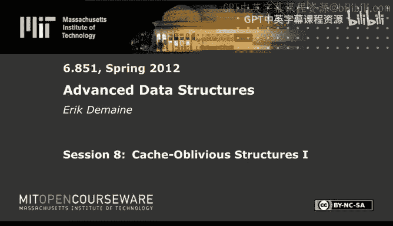
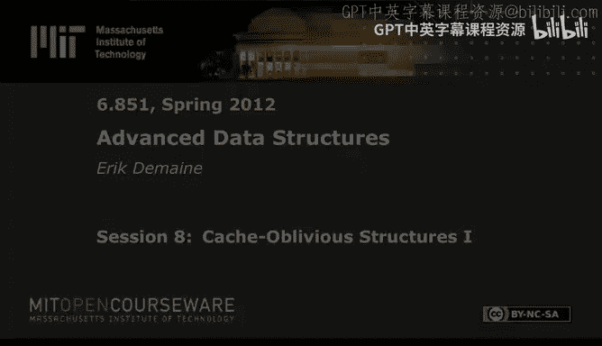

# 008：缓存无关结构 I

在本节课中，我们将学习两种重要的缓存无关数据结构。首先，我们将深入探讨有序文件维护问题，这是实现缓存无关B树的关键组件。接着，我们将了解一个密切相关的列表标记问题，它在完全持久化数据结构中扮演重要角色。最后，我们将介绍一种完全不同的缓存无关优先队列，它能同时适应块大小B和缓存大小M。

## 有序文件维护

上一节我们介绍了缓存无关B树，它能在不知道B的情况下实现所有操作（插入、删除、搜索）的O(log_B N)复杂度。其核心是一个存储在特定顺序（van Emde Boas顺序）下的二叉搜索树，底部是一个有序文件，我们当时将其视为黑盒。本节中，我们来看看如何实际实现这个有序文件，使其在每次插入和删除时仅需O(log² N)次数据移动。

### 问题定义

我们需要在一个数组中存储N个数据项，数组大小为Θ(N)。数组中的项按指定顺序排列，项与项之间留有常数大小的空隙。我们需要支持在该顺序中插入和删除项。

**目标**：每次更新（插入或删除）时，我们只在一个小区间内重新排列项，该区间大小为O(log² N)（均摊）。通过常数次交错扫描完成重排，从而在缓存无关模型中实现O(log² N / B)次内存传输（均摊）。这是实现缓存无关B树所需的关键步骤。

### 算法概览

基本思想很简单：当插入一个项时，我们找到一个包含该点的、密度既不太高也不太低的大小合适的区间，然后在该区间内均匀地重新分配所有项。

为了以一种可控的方式定义区间，我们构建一个概念上的二叉树。数组的底部被划分为大小为Θ(log N)的块。每个树节点代表其所有后代叶子节点对应的区间。

### 算法步骤

以下是更新（插入或删除）的算法：

1.  **更新叶子块**：首先，在包含目标项的叶子块（大小为Θ(log N)）内进行更新。我们可以直接重写整个块，因为O(log N)的代价在我们的目标O(log² N)范围内是可接受的。
2.  **向上遍历**：从该叶子节点开始，沿树向上遍历，直到找到一个“在阈值内”的节点（即其对应的区间）。
3.  **均匀重平衡**：一旦找到这样的节点，我们将其后代区间内的所有元素均匀地重新分配。

### 密度阈值定义

算法的关键在于“在阈值内”的定义，这由密度阈值决定。密度是指区间内实际元素数量与区间总容量（数组槽位数）的比值。

阈值不是固定的，而是取决于节点在树中的深度。设树的高度为H，节点深度为d（根节点深度为0，叶子节点深度为H）。我们要求节点的密度ρ满足：

*   **下界**：`ρ ≥ 1/2 - (1/4) * (d/H)`
*   **上界**：`ρ ≤ 3/4 + (1/4) * (d/H)`

这意味着：
*   在根节点（d=0），密度必须在`[1/2, 3/4]`之间，范围较窄。
*   在叶子节点（d=H），密度必须在`[1/4, 1]`之间，范围较宽。
*   随着深度增加（向根部移动），密度范围线性收紧。

这种线性插值的设置是为了在分析中实现所需的性能保证。

### 算法分析

当我们重平衡一个节点X时，我们将其区间内的元素均匀分布。这使得X的子节点不仅“在阈值内”，而且“远在阈值内”——它们的密度与阈值的绝对差距至少增加了`1/(4H)`。

由于H = Θ(log N)，且子区间大小为Θ(区间大小)，这意味着要使一个子节点再次“超出阈值”，需要至少`Ω(区间大小 / log N)`次更新操作。

因此，我们可以将重平衡的成本（Θ(区间大小)）分摊到这`Ω(区间大小 / log N)`次更新上，得到每个更新分摊O(log N)的成本。

然而，每次更新会影响从叶子到根路径上的所有log N个祖先区间。因此，每个更新最多被分摊O(log N)次，最终得到**均摊O(log² N)** 的区间大小（即操作成本）。

通过常数次交错扫描执行重排，在缓存无关模型中，这对应于**均摊O(log² N / B)** 次内存传输。

### 总结与延伸

这样，我们就完成了有序文件维护。这个结果可以追溯到1981年，并在2000年被引入缓存无关领域。一个开放问题是，在必须保持常数大小间隙和线性数组大小的限制下，O(log² N)是否是最优的。已知存在最坏情况复杂度版本，但更复杂。

接下来，我们通过放宽限制来探索一个密切相关的问题。

## 列表标记

有序文件维护要求数组大小严格线性，且物理移动项。如果我们放松对空间的要求，并允许只修改标签（相当于逻辑上移动项），就得到了列表标记问题。

### 问题定义

我们需要维护一个动态链表。每个节点存储一个整数标签。链表中的标签必须始终保持严格单调递增（沿着链表方向）。我们需要支持插入、删除节点，并且可以随时动态修改节点的标签以保持顺序。

这本质上与有序文件维护相同，只是“移动项”对应于修改一个整数标签，并且我们允许标签空间（即数组索引范围）是超线性的。

### 已知结果

列表标记的性能取决于允许的标签空间大小：

*   **线性空间 (或 1+ε 空间)**：最佳已知更新时间为 **O(log² N)**（均摊或最坏情况）。这与有序文件维护结果一致。
*   **多项式空间 (如 N²)**：最佳已知更新时间为 **O(log N)**。存在特定模型下的下界，表明这类数据结构至少需要Ω(log N)时间。
*   **指数空间 (如 2^N)**：可以轻松实现 **O(1)** 更新时间（通过不断对分区间），但标签会变得极大。

**关键思路**：当拥有多项式空间时，密度阈值可以设置为指数级变化（例如`1/α^d`，其中α>1），而不是线性插值。这消除了一个log N因子，因为现在密度有更大的变化范围，节点从“超出阈值”到“远在阈值内”所需的更新次数更多。

### 列表顺序维护

列表标记的一个变体是列表顺序维护问题，这正是我们在第一讲完全持久化中需要的黑盒。

**问题定义**：维护一个动态链表，支持插入、删除，以及**顺序查询**：给定两个节点X和Y，判断X是否在Y之前。

**目标**：所有操作（插入、删除、查询）达到**常数均摊时间**。

**解决方案**：使用分层结构。
1.  **顶层**：将大约 N/log N 个“组”的元数据，使用标签空间为N²的列表标记数据结构维护，更新时间O(log N)。
2.  **底层**：每个组实际包含Θ(log N)个节点。每个组内部使用标签空间为`2^(log N) = N`的列表标记（指数空间方案），实现常数时间操作。
3.  **复合标签**：一个节点的完整标签是`(顶层组标签, 组内标签)`。比较时，先比较顶层标签，若相同再比较组内标签。
4.  **更新策略**：插入时，放入对应组。如果组过大则分裂，过小则合并。组的分裂/合并会触发顶层数据结构的O(log N)时间更新，但每次分裂/合并由Θ(log N)次底层更新引起，因此成本可以分摊，最终实现常数均摊时间。

这与简单使用N³标签空间的列表标记不同，因为这里通过修改一个顶层标签，同时隐式地修改了其下所有log N个节点的部分标签，从而实现了高效性。

现在，让我们转向一个完全不同的数据结构。

## 缓存无关优先队列

之前我们介绍了缓存无关B树。如果不需搜索，只需删除最小元素，优先队列可以更快。本节介绍一种缓存无关优先队列，它能同时适应B和M。

### 性能目标

已知在缓存无关模型中，排序N个元素需要 `(N/B) * log_{M/B} (N/B)` 次内存传输。对于优先队列，我们希望每次插入和删除最小值的均摊成本为 `(1/B) * log_{M/B} (N/B)`。当B > log N时，这通常小于1，意味着我们平均每B次操作才需支付一次内存传输成本。

### 数据结构概览

该结构由一系列按大小递增的“层”组成，大小呈双重指数增长（例如，大小序列为 ..., x, x^(3/2), x^(9/4), ...）。最小元素在底部（大小恒定），较大元素在上层。

每一层（例如大小为`L = x^(3/2)`的层）包含：
*   **一个上缓冲区**：大小为`L`。存放正在“上浮”的元素。
*   **多个下缓冲区**：大约`L^(1/2)`个，每个大小为Θ(x)。存放已基本到达正确位置的元素，它们之间是排序的（即一个下缓冲区的所有元素小于下一个下缓冲区的所有元素）。

**关键不变量**：
1.  同一层内，所有上缓冲区中的元素都大于所有下缓冲区中的元素。
2.  不同层的下缓冲区之间，下层元素小于上层元素（对于已就位元素）。
3.  上缓冲区中的元素仍在寻找其最终位置，可能继续上浮。

数据在内存中按层顺序存储。

### 插入操作

1.  **插入底部**：新元素插入最底层的上缓冲区。
2.  **局部调整**：在底层内部，可能需要与下缓冲区交换元素以保持顺序（因为底层很小，可常数时间完成）。这可能导致底层上缓冲区大小增加。
3.  **上推**：如果某层（大小为x）的上缓冲区溢出（达到Θ(x)），则执行`Push(x)`操作：
    *   **排序**：对该上缓冲区的x个元素进行排序。成本为 `(x/B) * log_{M/B} (x/B)`。
    *   **分发**：将排序后的元素序列，按顺序扫描下一层（大小为`x^(3/2)`）的下缓冲区。将元素放入合适的下缓冲区，保持顺序。如果下缓冲区溢出，则将其分裂。如果下缓冲区数量过多，则将最后一个下缓冲区移入本层的上缓冲区。
    *   **递归**：如果本层的上缓冲区在分发后溢出，则递归地对上一层执行`Push`操作。

### 成本分析

`Push(x)`操作的主要成本在于排序。我们需要证明分发步骤的成本不超过排序。

**分析**：
*   假设“高缓存”条件：`M ≥ B²`（或更一般地`M = B^(1+ε)`）。
*   对于非常大的x（`x ≥ B²`），分发成本约为`x/B`，主导项是排序成本中的`(x/B)*log(...)`，因此分发相对免费。
*   对于非常小的x（`x < M`），整个层可放入缓存，成本为0。
*   关键是在过渡区（`x ≈ B^(4/3)` 到 `B²`）。此时，`x^(1/2)`（下缓冲区数量）≤ B。由于`M/B ≥ B`，我们可以将每个下缓冲区的末尾块保留在缓存中，使得访问这些块的成本消失，分发成本再次约为`x/B`。

因此，每次`Push(x)`的成本主要由排序步骤决定，即`O((x/B) * log_{M/B} (x/B))`。

### 分摊成本

一个元素可能被多次上推。但`Push(x)`操作处理x个元素，因此每个元素分摊到的成本是排序成本除以x，即`O((1/B) * log_{M/B} (x/B))`。

由于层大小双重指数增长，对不同层的x求和形成一个几何级数，最终每个插入操作的总分摊成本由最大层（大小≈N）决定，即 **`O((1/B) * log_{M/B} (N/B))`**。

删除最小元素操作类似，涉及“下拉”过程，分析也类似。

### 总结

本节课我们一起学习了三种重要的缓存无关技术：
1.  **有序文件维护**：通过维护密度阈值在概念二叉树区间内重平衡，实现了O(log² N / B)的更新效率，是缓存无关B树的基础。
2.  **列表标记与列表顺序维护**：通过放宽空间限制和改进阈值策略，获得了更好的更新复杂度；并利用分层结构，以常数均摊时间解决了完全持久化中的顺序查询问题。
3.  **缓存无关优先队列**：利用双重指数增长的层结构、上下缓冲区以及排序-分发策略，实现了适应B和M的高效插入和删除最小元素操作，均摊成本达到理论最优的`O((1/B) * log_{M/B} (N/B))`。

这些数据结构展示了在内存层次结构中，通过精心设计布局和操作顺序，即使在没有明确参数知识的情况下，也能实现高效数据访问的巧妙思想。