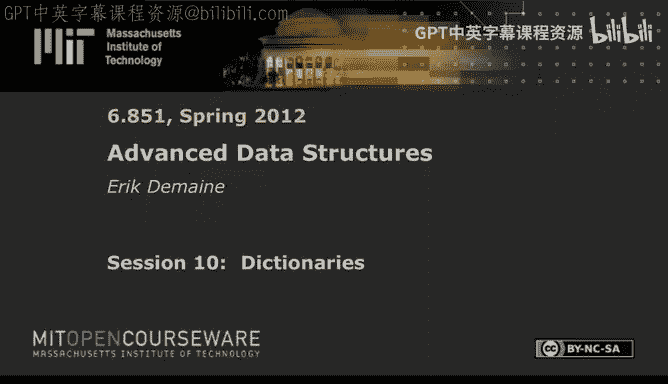

# 010：字典

在本节课中，我们将要学习哈希技术。哈希是计算机科学中最常见的数据结构之一，几乎出现在每一门算法课程中。我们将快速回顾一些你可能已经了解的知识，然后深入探讨一些你可能不知道的内容。首先，我们会介绍不同类型的哈希函数，包括K-独立性和一种近年来被广泛分析的新技术——简单列表哈希。接着，我们将探讨如何利用这些哈希函数构建数据结构，包括链式哈希、完美哈希、线性探测以及布谷鸟哈希。

## 哈希基础概念

哈希的基本思想是将一个巨大的键值全域映射到一个相对较小的表中。我们称哈希函数为 **h**，全域为从0到 **u-1** 的整数，记作 **U**。我们有一个表用于存储数据，其索引从0到 **m-1**，**m** 是表的大小。通常我们希望 **m** 大约等于 **n**，即实际存储在表中的键的数量。哈希函数将整数（或可映射为整数的对象）映射到表的槽位中。

理想情况下，我们希望使用完全随机的哈希函数。这意味着对于任何键 **x**，它映射到任何特定槽位 **t** 的概率是 **1/m**，并且所有键的映射都是独立的。这提供了理想的哈希性能，但问题在于，要存储这样一个完全随机的函数需要 **u * log m** 比特的信息，这通常过于庞大，无法实际存储。

## 通用哈希

为了克服完全随机哈希的存储问题，我们使用通用哈希。我们从一个较小的哈希函数族中均匀随机地选择一个哈希函数。这个族的大小远小于所有可能的函数，因此可以用更少的比特来编码。我们希望这个族满足以下性质：对于任意两个不同的键 **x** 和 **y**，它们发生碰撞（即 **h(x) = h(y)**）的概率大约为 **1/m**。这被称为通用哈希。

以下是两个通用哈希函数的例子：
*   **乘法取模法**：选择一个随机整数 **a**，计算 `h(x) = (a * x) mod p mod m`，其中 **p** 是一个大于 **u** 的质数。
*   **乘法移位法**：当 **u** 和 **m** 都是2的幂时，计算 `h(x) = (a * x) >> (log u - log m)`，这相当于取乘法结果的高位比特。

## K-独立性哈希

K-独立性是比通用性更强的性质。一个哈希函数族是 **K-独立** 的，如果对于任意 **K** 个不同的键 **x1, x2, ..., xK** 和任意 **K** 个槽位 **t1, t2, ..., tK**，有：
`P[h(x1)=t1, h(x2)=t2, ..., h(xK)=tK] = O(1 / m^K)`
这表示任意 **K** 个键的哈希值是（近似）独立的。K-独立性蕴含了通用性。

一个经典的K-独立哈希函数例子是使用随机系数的多项式：
`h(x) = (a_{k-1} * x^{k-1} + ... + a_1 * x + a_0) mod p mod m`
其中系数 **a_i** 是随机选取的。这种方法的计算成本是 **O(k)**。近年来，研究者们提出了更高效的K-独立哈希方案，例如：
*   **Thorup 和 Zhang (2004)**：实现了常数查询时间的对数阶独立性，但需要较大的存储空间。
*   **Siegel (2004)**：实现了常数查询时间的对数阶独立性，同样需要较大的空间。

## 简单列表哈希

简单列表哈希是一种既简单又强大的哈希技术。其思想是将一个整数键 **x** 分割成 **c** 个字符（每个字符是键的一部分）。然后，为每个字符位置维护一个完全随机的小型查找表 **T_i**。哈希值通过将这些表的输出进行异或运算得到：
`h(x) = T_1(x_1) XOR T_2(x_2) XOR ... XOR T_c(x_c)`
这种方法计算简单（**O(c)** 时间），并且已知它是3-独立的。然而，最近的分析表明，在许多哈希方案中，简单列表哈希的性能几乎与对数阶独立哈希一样好。

## 链式哈希

上一节我们介绍了哈希函数，本节我们来看看如何用它们构建第一个数据结构：链式哈希。这是最常见的哈希表实现方式。我们有一个哈希函数 **h** 将键映射到表的槽位。如果多个键映射到同一个槽位，我们将其存储在一个链表中（例如，链表）。

对于一个特定的槽位 **t**，其链表的期望长度是 **n/m**（负载因子）。如果我们通过表扩张保持 **m = Θ(n)**，那么期望链长就是常数。然而，我们更关心高概率下的性能。对于完全随机的哈希函数，最长链的长度高概率为 **O(log n / log log n)**。这个分析使用了切尔诺夫界。

一个有趣的现象是，如果我们考虑一个包含 **Θ(log n)** 次操作的批次，并假设有一个缓存能记住最近访问过的 **log n** 个项，那么链式哈希可以实现**常数分摊时间**（高概率）。这是因为在这个批次中，总共需要探查的链中元素数量高概率为 **O(log n)**，分摊下来每次操作就是常数时间。

对于通用哈希函数，期望链长仍然是常数。但要达到 **O(log n / log log n)** 的高概率链长，则需要 **Ω(log n / log log n)**-独立的哈希函数。简单列表哈希也能提供良好的链长性能。

## 完美哈希

为了消除链式哈希中的探查，我们可以使用完美哈希（也称为FKS哈希）。其思想是使用两级哈希。第一级使用一个哈希函数 **h** 将键分配到 **m** 个桶中。与链式哈希不同，每个桶 **i** 不再用链表存储，而是用一个次级哈希表 **T_i** 来存储所有落入该桶的键，并且保证这个次级哈希表内无碰撞。

次级哈希表的大小取为桶中键数量的平方，即 **Θ(c_i^2)**，其中 **c_i** 是桶 **i** 中的键数。根据生日悖论，如果哈希函数是通用的，那么在一个大小为 **c_i^2** 的表中不发生碰撞的概率至少是 **1/2**。如果发生碰撞，只需选择另一个哈希函数重试，期望常数次尝试后即可成功。

所有次级哈希表的总空间期望是线性的，因为键对碰撞的总数期望是 **O(n^2/m)**，当 **m = Θ(n)** 时是 **O(n)**。构建过程在期望线性时间内完成。查询时，只需计算两级哈希函数并访问两个位置，因此是**确定性常数时间**。通过巧妙的重建策略，插入和删除也可以实现分摊常数时间（期望或高概率）。

## 线性探测

线性探测可能是最简单的开放寻址哈希方案。要插入一个键 **x**，我们计算 **h(x)**。如果该槽位为空，则插入。如果被占用，则顺序检查下一个槽位（即 **h(x)+1, h(x)+2, ...**），直到找到空槽为止。

传统观点认为线性探测性能很差，因为“富者愈富”（长的连续占用区域更容易增长）。然而，理论分析表明，如果哈希函数足够好，线性探测的性能非常出色。对于完全随机的哈希函数，每次操作的期望时间是 **O(1/ε^2)**，其中 **ε** 是表空闲部分的比例（即 **m = (1+ε)n**）。当 **ε** 为常数时，期望时间就是常数。

关键在于所需的哈希函数独立性：
*   **5-独立性** 足以保证常数期望时间。
*   **4-独立性** 则不足，可能导致 **Ω(log n)** 的查询时间。
*   **简单列表哈希** 也能为线性探测提供常数期望时间。

线性探测在实践中性能极佳，部分原因是它具有良好的缓存局部性：一旦访问到某个内存区域，后续的连续探查很可能在同一个缓存块中。

我们可以通过一个基于二叉树概念的简洁证明来理解线性探测的性能。将哈希表数组想象成一棵隐式的二叉树。定义一个节点是“危险”的，如果映射到该节点对应区间的键的数量超过了区间长度的 **2/3**。对于完全随机哈希，一个高度为 **h** 的节点是危险的概率非常小（双指数衰减）。然后可以证明，任何长的连续占用区域（“运行”）必然覆盖至少一个危险节点。因此，长运行的概率也很小，从而期望运行长度是常数。

## 布谷鸟哈希

布谷鸟哈希是一种使用两个哈希表和两个哈希函数的方案。设两个哈希函数为 **g** 和 **h**，两个表为 **A** 和 **B**。一个键 **x** 可以存放在两个位置：**A[g(x)]** 或 **B[h(x)]**。

查询时，只需检查这两个位置，因此是**确定性常数时间**（两次探测）。插入时，首先尝试放入 **A[g(x)]**。如果为空，则插入。如果被占用，则“踢出”原有的键 **y**，将 **x** 放入 **A[g(x)]**。然后，尝试将被踢出的键 **y** 放入它的另一个位置 **B[h(y)]**。如果 **B[h(y)]** 也被占用，则重复这个过程，踢出另一个键，形成一连串的置换。如果这个过程持续进行了很多步（或者形成循环），则插入失败，需要选择新的哈希函数重建整个表。

对于完全随机或对数阶独立的哈希函数，插入的期望时间是常数。重建的概率很小（大约每插入 **Ω(n^2)** 个键才需要一次重建），因此分摊成本是常数。有趣的是，**6-独立性并不足以**保证常数期望时间，而**简单列表哈希**则能提供接近最优的失败概率（约 **1/n^{1/3}**）。

关于布谷鸟哈希插入路径长度的一个巧妙证明使用了信息论论证。如果存在一条很长的插入路径，那么我们可以用比标准编码更少的比特来编码哈希函数 **g** 和 **h**。但由于哈希函数是完全随机的，这种“节省”只可能以很小的概率发生，从而证明了长路径的概率是指数级小的。

## 总结

本节课我们一起学习了哈希技术的核心概念和多种数据结构。我们从哈希函数开始，介绍了通用哈希、K-独立性哈希和简单列表哈希。接着，我们探讨了如何利用这些函数构建高效的字典结构：链式哈希提供了基础的常数期望时间操作；完美哈希通过两级结构实现了确定性常数查询时间；线性探测在拥有良好哈希函数时，不仅理论性能优秀，而且具有极佳的缓存效率；最后，布谷鸟哈希以其独特的双表设计和确定性查询提供了另一种高效选择。每种方案都在理论保证、实现复杂度和实际性能之间有不同的权衡，理解这些将帮助我们为特定应用选择合适的哈希策略。