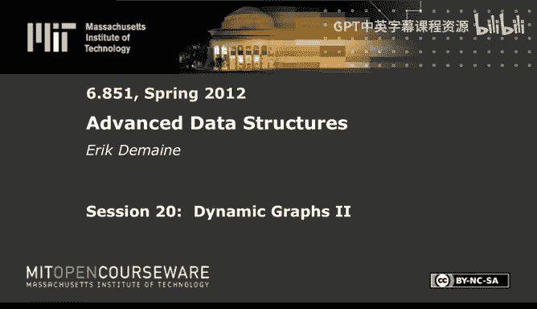
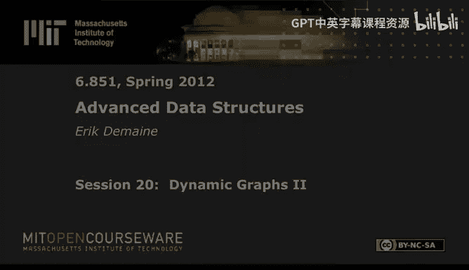

# 020：动态图 II

以下内容基于知识共享许可协议提供。您的支持将帮助麻省理工学院开放式课件继续免费提供高质量的教育资源。要捐款或查看来自数百门麻省理工学院课程的更多材料，请访问 MIT OpenCourseware 网站。

在本节课中，我们将继续探讨动态图这一主题。这是三讲中的第二讲，也是关于一般图上界的主要一讲。上一讲我们介绍了 Link-Cut 树，并基本解决了动态连通性问题。该问题允许插入和删除边，并需要知道哪些节点是连通的。对于树，我们已经解决了这个问题。今天，我们将再次以更简单的方式解决树上的问题，因为我们需要一种稍简单、能以不同方式增强的数据结构，称为欧拉序树。然后，我们将在只能删除边的设置下再次解决树的问题，从而将时间复杂度从 `O(log n)` 降低到 `O(1)`。我们仍将花相当多时间讨论树，但最终会转向一般图，并给出一个 `O(log² n)` 的解决方案。这比树的情况只多了一个对数因子。最后，我将概述动态图领域研究的其他问题。

## 问题定义

今天我们将主要关注动态连通性问题。目标是维护一个无向图，支持边的插入和删除操作，也可以插入和删除度为 0 的顶点。查询操作是连通性查询：给定两个顶点 `V` 和 `W`，询问是否存在从 `V` 到 `W` 的路径，即它们是否在同一个连通分量中。

在动态数据结构中，完全动态数据结构支持边的插入和删除。部分动态数据结构则只支持插入或只支持删除。只支持插入的称为增量动态，只支持删除的称为减量动态。对于减量动态，我们将在树上实现常数时间。对于完全动态，我们将在一般图上实现 `O(log² n)` 时间。

## 动态连通性研究现状

在深入算法之前，我们先了解动态连通性结果在文献中的位置。

对于树，已知的最佳结果是 `O(log n)` 时间，而减量动态可以达到 `O(1)` 时间。我们实际上已经知道如何使用 Link-Cut 树来处理树，但使用欧拉序树会更简单。

对于一般图，核心开放问题是能否实现 `O(log n)` 的更新时间。目前已知的最佳结果是 `O(log n * (log log n)³)` 的更新时间和 `O(log n / log log log n)` 的查询时间。另一个结果是 `O(log² n)` 的更新时间和 `O(log n / log log n)` 的查询时间。

对于增量动态（仅插入），这本质上是并查集问题，可以达到接近 `α(n)`（反阿克曼函数）的摊还时间，并且是最优的。对于减量动态（仅删除），在稠密图上可以达到 `O(log n)` 的摊还时间。

关于下界，已经证明对于动态连通性，更新时间和查询时间中至少有一个必须是 `Ω(log n)`。具体来说，存在更新时间和查询时间之间的权衡关系。这些下界即使对于路径图也成立，这意味着我们之前实现的 `O(log n)` 动态树操作是最优的。

本节课我们将专注于上界，即实现 `O(log n)` 的树操作和 `O(log² n)` 的一般图操作。

## 欧拉序树

首先，我们介绍一种更简单的动态树结构——欧拉序树，由 Henzinger 和 King 于 1995 年提出。与 Link-Cut 树的关键区别在于，欧拉序树允许我们处理子树，而不仅仅是路径。

### 数据结构构建

欧拉序树的思想是：对树进行欧拉环游（深度优先遍历，记录每次访问节点），将这个线性访问序列存储在一个平衡二叉搜索树中。每个节点存储指向其第一次和最后一次访问的指针。

**数据结构表示**：
*   将欧拉环游的节点访问序列按顺序存储在一个平衡二叉搜索树中。
*   每个树节点存储两个指针，分别指向该节点在 BST 中的第一次和最后一次访问位置。

### 操作实现

**查询根节点**：给定节点 `V`，取其任一访问位置（如第一次访问），在 BST 中向上走到根，再向左走到最左节点，该节点即为原树根节点的第一次访问，从而找到根。时间复杂度为 `O(log n)`。

**删除边**：要删除连接节点 `V` 与其父节点 `W` 的边。在欧拉序中，`V` 的子树对应一个连续的区间。我们在 BST 中 `V` 的第一次和最后一次访问位置进行分割操作，将子树对应的区间分离出来。然后，将剩余的两部分重新连接。同时，需要删除一个多余的 `W` 访问记录。这涉及常数次分割和连接操作，每次 `O(log n)`，总时间 `O(log n)`。

**添加边**：假设要将根节点为 `V` 的树作为 `W` 的新子节点。我们找到 `W` 在 BST 中的最后一次访问位置，在此处分割。然后，按顺序连接以下部分：`W` 最后一次访问之前的部分、一个新的 `W` 访问记录、`V` 的整个欧拉序 BST、以及 `W` 最后一次访问及之后的部分。这同样涉及常数次 `O(log n)` 的操作。如果 `V` 不是其所在树的根，可以先通过一次循环移位操作将其变为根，然后再进行连接。

**子树聚合**：由于子树对应欧拉序 BST 中的一个连续区间，我们可以通过在 BST 上维护区间聚合信息（如最小值、最大值、和），在 `O(log n)` 时间内回答子树查询。

欧拉序树提供了一种在 `O(log n)` 时间内支持动态树基本操作（增删边、查询连通性、子树查询）的简洁方法。

## 树的减量连通性

接下来，我们探讨一个更弱的问题：仅支持删除操作的树连通性。目标是实现常数摊还时间。

基本思想是使用间接寻址和查找表。我们通过修剪叶子节点，将树分解为顶层结构和多个底层结构。

**分解过程**：
1.  识别所有后代数量大于 `log n` 的节点，从这些节点下方切断。这样得到的顶层树最多有 `n / log n` 个“叶子”（即连接底层结构的节点）。
2.  每个底层结构的大小最多为 `log n`。
3.  顶层树中的长路径（不分支的部分）也被单独处理。

**查询处理**：
对于查询 `V` 和 `W`：
*   如果它们在同一底层结构中，则使用该底层结构查询。
*   否则，查询可能涉及在底层结构内部、顶层结构内部以及它们之间的连接。这可以转化为常数次对底层结构、路径结构和顶层压缩树的查询。

**底层结构**：
由于底层树大小最多为 `log n`，我们可以用位向量表示边是否被删除。每个节点预计算一个位向量，表示到根路径上的边。查询时，通过异或和掩码操作，可以在常数时间内判断路径上是否有边被删除。

**路径结构**：
对于长路径，我们将其分块，每块大小 `log n`。每块用一个位向量表示。同时维护一个“摘要”位向量，表示每块中是否有边被删除。摘要向量大小为 `n / log n`，我们可以对其使用 `O(log n)` 的动态树结构。查询时，结合块内查询和摘要向量查询，总时间为常数。

通过这种多层间接寻址，我们实现了在只允许删除边的树中，连通性查询的常数摊还时间。

## 一般图的完全动态连通性

最后，我们解决一般无向图的动态连通性问题，目标是 `O(log² n)` 的更新时间和 `O(log n / log log n)` 的查询时间。

### 高层思路

核心思想是维护一个最小生成森林，并对其进行层次分解。
*   为每条边分配一个级别，初始为 `log n`。`G_i` 表示级别 ≤ `i` 的边构成的子图。
*   为每个 `G_i` 维护一个生成森林 `F_i`，使用欧拉序树存储。
*   关键不变性：
    1.  `G_i` 的每个连通分量大小不超过 `2^i`。
    2.  森林是嵌套的：`F_i` 是 `F_{log n}` 在 `G_i` 上的限制。这要求 `F_{log n}` 是关于边级别的最小生成森林。

### 操作实现

**插入边**：
1.  将边添加到端点关联的边列表中。
2.  设置其级别为 `log n`。
3.  如果边的端点在不同连通分量中，则在 `F_{log n}` 中连接它们（欧拉序树插入）。

**查询连通性**：
在 `F_{log n}` 中对两个顶点查询根节点是否相同。为了加速查询，可以将顶层森林的欧拉序树实现为分支因子 `Θ(log n)` 的 B 树，这样查询根操作只需 `O(log n / log log n)` 时间。

**删除边**：
这是最复杂的操作。
1.  从边列表中移除边。
2.  如果边不在 `F_{log n}` 中，则结束。
3.  否则，从其级别开始向上，在所有包含它的森林 `F_i` 中删除它（欧拉序树删除）。
4.  然后，尝试寻找替代边。从被删除边的级别 `i` 开始循环：
    *   设 `T_V` 和 `T_W` 为删除边后 `F_i` 中包含两个端点的树，且 `|T_V| ≤ |T_W|`。根据不变性1，`|T_V| ≤ 2^{i-1}`。
    *   搜索 `T_V` 中所有级别为 `i` 的边。对于每条这样的边 `e'`：
        *   如果 `e'` 连接到 `T_W`，则找到替代边。将其插入 `F_i`，结束。
        *   如果 `e'` 的另一端仍在 `T_V` 内，则将其级别降为 `i-1`（这为搜索操作提供了“代价”）。
    *   如果本层未找到替代边，则 `i` 增加，继续到上一层搜索。
5.  搜索过程中，我们需要快速找到 `T_V` 中具有级别 `i` 的边的节点。这可以通过在欧拉序树节点上增强信息来实现，记录子树中是否存在级别 `i` 的边。

### 时间复杂度分析

*   **插入**：可能引发 `O(log n)` 次边级别下降，每次下降关联 `O(log n)` 的森林更新，摊还后为 `O(log² n)`。
*   **删除**：在最多 `O(log n)` 层中进行删除和搜索，每层成本 `O(log n)`，加上因边级别下降带来的摊还成本，总摊还时间为 `O(log² n)`。
*   **查询**：使用 B 树增强的欧拉序树，查询时间为 `O(log n / log log n)`。

## 动态图的其他问题

动态图领域还研究了许多其他问题：
*   **k-连通性**：询问两点间是否存在 `k` 条边不相交或点不相交的路径。对于 `k=2` 已有多项式对数时间算法，`k≥3` 仍是开放问题。
*   **最小生成森林**：维护带权图的最小生成森林，可通过额外对数因子归约到动态连通性。
*   **平面性测试**：动态判断图是否保持平面性，已知算法复杂度较高。
*   **有向图**：
    *   **动态传递闭包**：询问是否存在有向路径。更新时间和查询时间存在权衡，通常乘积与 `m * n` 相关。
    *   **动态全源最短路径**：维护所有点对之间的最短距离，比传递闭包更难。

## 总结

本节课我们一起学习了动态图的上界算法。我们首先介绍了欧拉序树，一种支持子树查询的动态树结构。然后，我们看到了如何利用间接寻址和位操作，在只允许删除的树上实现常数时间的连通性查询。最后，我们深入探讨了一般图完全动态连通性的 `O(log² n)` 算法，其核心是通过层次化分解最小生成森林，并巧妙地将搜索替代边的成本摊还给边的级别下降。这些算法展示了在处理动态变化图结构时，结合多种数据结构思想和摊还分析所能达到的优美结果。下节课我们将探讨动态图问题的下界。