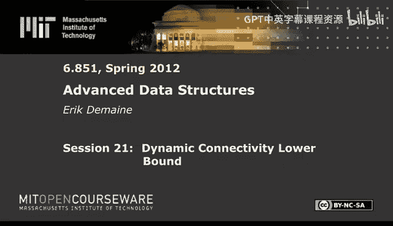
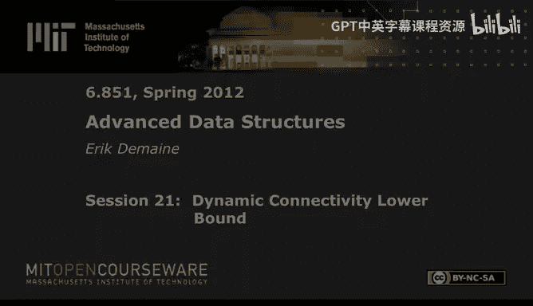

# 021：动态连通性下界证明 🧠

在本节课中，我们将学习如何证明动态连通性问题的一个下界。具体来说，我们将证明，即使在图的每个连通分量都是简单路径的情况下，任何支持边插入、删除和连通性查询的动态图算法，其每次操作（更新或查询）的摊销时间下界为 Ω(log n)。这个证明结合了信息论、平衡二叉树和精心设计的访问序列。

## 概述与问题设定

我们考虑一个动态图问题，其中需要支持三种操作：
*   **插入边 (u, v)**
*   **删除边 (u, v)**
*   **连通性查询 (u, v)**：查询顶点 u 和 v 之间是否存在路径。

我们的目标是证明，即使限制图的每个连通分量都是路径，任何正确的算法（即使是随机化的、摊销的）也必须满足：
`max(更新时间, 查询时间) = Ω(log n)`

这个下界在 **Cell Probe 模型** 中成立，这是一个非常强的计算模型，仅统计算法访问的内存单元（cell）数量。因此，该下界也适用于 RAM 模型和指针机模型。

## 证明思路总览

证明的核心思想是构造一个困难的实例，并将其规约到一个称为“部分和”的问题上。主要步骤如下：
1.  **构造特定图结构**：我们构造一个由 √n 条平行路径组成的图，每条路径连接两列各有 √n 个顶点的集合。连接两列顶点的完美匹配定义了一个排列。
2.  **定义批量操作**：我们将对整条路径（即整个排列）进行批量更新和验证查询，而不是单条边操作。
3.  **设计困难访问序列**：我们使用 **位反转序列** 作为访问这些批量操作的顺序。
4.  **在时间上构建平衡二叉树**：在位反转序列上构建一棵平衡二叉树，并分析其性质。
5.  **信息论论证**：通过分析算法在二叉树左右子树间必须传递的信息量，来导出时间下界。

接下来，我们详细展开每个部分。

## 构造图与批量操作

我们构造的图 `G` 的顶点集是一个 √n × √n 的网格。每一列有 √n 个顶点。在每两列之间，我们建立一个 **完美匹配**，这个匹配定义了一个从左侧顶点到右侧顶点的排列 π。

这样，从最左侧一列的任意顶点出发，沿着匹配边行走，都会形成一条唯一到达最右侧的路径。因此，整个图由 √n 条不相交的路径组成。

基于此结构，我们定义两种 **批量操作**：
*   **批量更新 Update(i, π)**：将第 `i` 个匹配（即连接第 `i` 列和第 `i+1` 列的边集）设置为新的排列 `π`。这需要通过 √n 次边的删除和插入来完成。
*   **验证查询 Verify-Sum(i, π)**：验证从第 1 个到第 `i` 个排列的复合结果是否等于给定的排列 `π`。这可以通过 √n 次连通性查询来实现（检查每条路径的端点是否映射正确）。

如果我们可以证明这些批量操作需要很高的复杂度，那么除以 √n 后，就得到了原始单条边操作的 Ω(log n) 下界。

## 困难的访问序列：位反转序列

我们选择 **位反转序列** 作为执行批量操作的顺序。对于一个长度为 √n（假设是 2 的幂）的序列，位反转序列能产生高度交错访问模式。

具体的坏访问序列如下：对于序列中的每个 `i`（按位反转顺序），我们依次执行：
1.  `Verify-Sum(i, π_correct)`：验证当前的前缀复合排列是否正确。
2.  `Update(i, π_random)`：将第 `i` 个排列更新为一个全新的随机排列。

由于验证总是基于当前正确的状态，所以查询答案总是“是”。算法的挑战在于需要快速验证这个“是”，同时还要处理紧随其后的随机更新。

## 在时间上构建平衡二叉树

我们在位反转序列（视为时间顺序）上构建一棵平衡二叉树。这个树不是数据结构，而是我们用于分析的工具。

对于树中的任何一个节点 `v`，考虑其左子树和右子树对应的时间区间。位反转序列的关键性质在于：**左子树中更新的索引集合，与右子树中查询的索引集合，是完美交错的**。

这意味着，右子树中的查询必须依赖于左子树中刚刚更新过的排列信息。因此，算法在执行右子树的查询时，必须去读取在左子树期间写入的内存单元。

## 核心下界论证

我们关注二叉树中任意一个节点 `v`。设其子树有 `L` 个叶子（即对应 `L` 个操作）。

**核心断言**：在节点 `v` 的右子树时间区间内，算法必须执行至少 `Ω(L√n)` 次 **Cell Probe**，并且这些探测读取的内存单元，其最后一次写入操作发生在左子树的时间区间内。

如果这个断言成立，我们就可以对树上所有节点求和。由于每个叶子出现在 `log n` 层中，总的此类“跨子树读取”次数至少为 `(√n) * log n`。考虑到每次批量操作对应 √n 次原始操作，我们就得到了每个原始操作 `Ω(log n)` 的下界。

因此，证明的核心就转化为证明上述断言。

### 信息论编码论证

我们使用反证法来证明断言。假设断言不成立，即这种“跨子树读取”的次数很少。那么我们将展示，可以利用这一点来 **编码** 左子树中发生的所有随机排列，而编码长度会小于这些排列本身的信息熵，从而产生矛盾。

**编码对象**：左子树中所有 `L/2` 个更新操作所使用的随机排列。这些排列的信息熵为 `Ω(L√n log n)` 比特（因为每个随机排列需要约 √n log √n 比特来描述）。

**编码构造**：
1.  我们 **显式存储** 所有“跨子树读取”涉及的内存单元地址及其内容。假设此类单元数为 `X`，存储成本为 `O(X log n)` 比特。
2.  为了在解码时能正确模拟右子树的查询，我们还需要一个 **分离器**。分离器是一个内存地址的集合 `S`，它满足：
    *   所有在右子树被读取但未在左子树写入的地址（即“已知旧数据”）都在 `S` 中。
    *   所有在左子树被写入但未在右子树读取的地址（即“无关新数据”）都不在 `S` 中。
    我们可以使用 **完美哈希函数族** 来构造一个小的分离器族，然后只需存储使用了哪个分离器，成本为 `O(|R| + |W| + log log U)` 比特，其中 `R` 和 `W` 分别是左右子树读写涉及的地址集合大小，`U` 是地址空间大小。

**解码过程**（模拟查询）：
为了解码出左子树的排列，我们尝试模拟右子树的所有 `Verify-Sum` 查询。对于每个可能的查询参数 `π`，我们运行查询算法。当需要读取一个内存单元时：
*   如果该单元在“显式存储”的列表中，我们使用存储的值。
*   如果该单元在分离器 `S` 中，我们将其视为“已知旧数据”（可以从初始状态推导）。
*   如果该单元不在分离器 `S` 中，那么根据分离器的性质，它一定是“无关新数据”。这意味着当前模拟的查询参数 `π` 肯定是错的（因为正确的查询不会读这个单元），我们立即中止当前模拟，尝试下一个 `π`。

最终，只有一个 `π` 能使模拟运行完毕并返回“是”，这个 `π` 就是正确的查询答案。知道了右子树所有查询的正确答案后，我们就可以逆向推导出左子树所有的更新排列。

**矛盾产生**：
如果断言不成立（`X` 很小），并且左右子树的读写总量 `|R|+|W|` 也不大，那么我们的总编码长度将小于 `Ω(L√n log n)` 比特。然而，我们却用这个短编码恢复出了信息熵很高的 `L/2` 个随机排列，这违反了信息论原理。因此，断言必须成立：要么 `X` 很大（即跨子树读取多），要么 `|R|+|W|` 很大（即子树内操作本身很多）。无论哪种情况，都贡献了我们需要的时间下界。

## 总结

本节课我们一起学习了动态连通性下界的证明。我们通过将动态图问题规约为排列的批量验证问题，并利用位反转序列在时间上构建平衡二叉树，最后通过精巧的信息论编码论证，证明了即使在连通分量仅为路径的简单情况下，任何动态连通性算法也必须花费 `Ω(log n)` 的摊销时间 per operation。

这个结果意味着像 Link-Cut Trees 和 Euler Tour Trees 这样的数据结构在指针机模型下是 **最优** 的。证明过程中融合了困难实例构造、二叉树分析、信息论和哈希函数等多种技巧，是高级数据结构下界证明的一个经典范例。