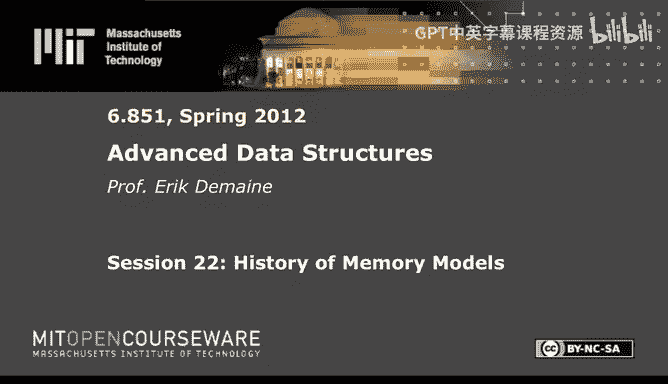
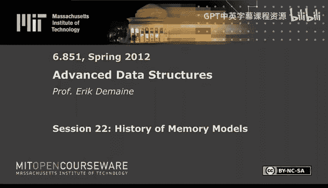

# 022：内存模型的历史 📚

在本节课中，我们将学习计算机内存层次结构建模的发展历程。我们将从早期的简单模型开始，逐步探讨如何更精确地模拟现代计算机中不同速度和容量的存储设备，并最终了解当前主流的I/O模型和缓存无关模型。

---

## 理想化的两级存储模型 (1972)

上一节我们介绍了课程背景，本节中我们来看看最早的内存层次结构模型之一。

1972年，Bob Floyd在一篇论文中提出了一个理想化的两级存储模型。该模型旨在模拟当时计算机（如PDP-11）中快速但容量小的核心内存与慢速但容量大的磁盘之间的差异。

该模型的核心概念如下：
*   **CPU**：可以进行本地计算。
*   **内存**：被划分为大小为 **B** 的块。每个块最多可容纳 **B** 个数据项。
*   **块操作**：在一步操作中，可以读取两个块中的所有数据项，选取其中的一部分（最多B个），然后将它们写入（覆盖）另一个目标块。模型假设数据项在块内的顺序可以自由重排。

该模型的主要定理是：若要对 **N** 个数据项进行随机排列（每个目标块都是满的），则平均至少需要 **N/B * log B** 次块操作。证明使用了基于信息熵的势能论证。

然而，这个上界并非最优。通过基数排序，可以实现 **N/B * log (N/B)** 次操作。当 **B** 很小时（例如 **B=1**），正确答案是 **N** 而非 **N log N**。这个问题在多年后才得到完全解决。

---

## 红蓝卵石游戏模型 (1981)

上一节我们了解了考虑分块的模型，本节中我们来看看一个考虑缓存容量但忽略分块的模型。

1981年，Hong和Kung提出了“红蓝卵石游戏”模型，用于分析计算过程中的I/O复杂度。该模型基于计算的有向无环图（DAG）。

模型规则如下：
*   **红卵石**：代表在高速缓存（Cache）中的数据。
*   **蓝卵石**：代表在磁盘（Disk）中的数据。
*   初始时，所有输入节点为蓝色。
*   可以放置红卵石在一个节点上，前提是其所有前驱节点已有红卵石（表示计算依赖）。
*   可以免费移除任何卵石（表示遗忘数据）。
*   关键操作：可以将一个红卵石变为蓝卵石（**写回磁盘**），或将一个蓝卵石变为红卵石（**从磁盘读入**），每次变色计为一次I/O操作。
*   目标：最终所有输出节点为蓝色，且过程中任何时候红卵石的数量不超过缓存大小 **M**。

该模型的目标是在给定缓存大小 **M** 的前提下，最小化I/O操作（即颜色切换）的次数。他们分析了许多经典算法（如矩阵乘法、FFT）在此模型下的I/O复杂度。

---

## 外部内存模型 (I/O模型) (1987)

上一节我们分别看到了考虑分块和考虑缓存的模型，本节中我们来看看将两者结合的主流模型。

1987年，Aggarwal和Vitter提出了外部内存模型（常称为I/O模型或磁盘访问模型）。它融合了前两个模型的核心思想，并成为该领域研究的基础。

模型定义如下：
*   **内存层次**：包含一个无限大的**磁盘**和一个大小为 **M** 的**缓存**。
*   **分块**：磁盘和缓存都被划分为大小为 **B** 的块。缓存可容纳 **M/B** 个块。
*   **操作**：
    1.  从磁盘读一个块到缓存（替换一个现有块）。
    2.  在缓存内进行免费计算。
    3.  将缓存中的一个块写回磁盘（替换磁盘上的一个块）。
*   **目标**：最小化内存传输（I/O）的次数。

以下是该模型中的一些基本结果和算法技术：

**扫描 (Scan)**
顺序读取或处理 **N** 个数据项，成本为 **O(N/B)** 次I/O，这是最优的。

**搜索 (Search)**
在有序数据中搜索，最优策略是使用 **B树**，成本为 **O(log_B N)** 次I/O。下界来自信息论：每次读入一个块，最多获得 **log(B+1)** 比特的信息，而确定元素位置需要 **log(N+1)** 比特信息。

**排序 (Sort)**
排序的紧确界是 **Θ((N/B) * log_{M/B} (N/B))** 次I/O。
*   **下界**：通过信息论论证，每次I/O最多能获得 **B * log(M/B)** 比特的排序信息。
*   **上界**：可通过多路归并排序实现。算法将数据递归分成 **M/B** 个子序列排序，然后一次性合并它们。

**置换 (Permutation)**
与排序问题类似，但有时直接随机访问放置每个元素（成本 **O(N)**）可能比排序界更优。

该模型还衍生出考虑**顺序访问**与**随机访问**成本差异的变体，其中顺序读写连续多个块的成本低于随机访问单个块。

---

## 层次化内存模型 (HMM) 及其他多层模型

上一节我们深入探讨了成功的外部内存模型，本节中我们简要回顾一些尝试建模多层内存层次的方法。

早期模型主要关注两层，但实际计算机有更多层次（L1/L2/L3缓存、主存、磁盘等）。一些模型试图捕捉这一点。

**层次化内存模型 (HMM, 1987)**
这是一个简洁的RAM模型变体。访问内存位置 **x** 的成本是一个函数 **f(x)**，例如 **f(x) = log x**。这模拟了数据越“远”（地址越大），访问成本越高的层次结构。他们提出了**均匀最优**算法的概念：一个算法在不知道具体层次参数的情况下，对所有可能的 **f(x)** 都能达到近似最优。

**BT模型 (1990)**
在HMM基础上增加了**块传输**操作，允许以一次“寻址”成本移动连续的一段数据，更贴近实际硬件行为，但分析变得复杂。

**UMH模型 (1993)**
试图描述一个通用的多级内存层次，每级有自己的缓存大小 **M_i**、块大小 **B_i** 和传输延迟 **t_i**。为了简化，通常假设这些参数按指数规律增长。尽管更真实，但模型复杂，得出的界限难以直观理解。

---

## 缓存无关模型 (1999)

上一节我们看到多层模型往往变得复杂，本节中我们来看一个优雅的解决方案：缓存无关模型。

1999年，Frigo等人提出了缓存无关模型。它建立在外部内存模型的基础上，但做了一个关键改变：**算法设计者不知道参数 B（块大小）和 M（缓存大小）**。算法在运行时由系统自动管理数据在缓存和磁盘间的移动（通常采用LRU等策略）。

**核心思想与优势**
*   **均匀性**：一个缓存无关算法自动适用于所有可能的 **B** 和 **M**。
*   **多层最优性**：理论证明，如果一个缓存无关算法在两层模型中是渐近最优的，那么它在任意多层内存层次中也是渐近最优的。
*   **鲁棒性**：适用于块大小变化、缓存被其他进程共享等真实场景。

**缓存无关算法技术**
许多外部内存算法可以转化为缓存无关算法。

**扫描**
顺序扫描自然就是缓存无关的，成本仍为 **O(N/B)**。

**搜索**
无法直接使用需要知道 **B** 的B树。替代方案是使用递归布局的**van Emde Boas树**结构。它将搜索树递归地分割，使得任何根到叶子的路径最多访问 **O(log_B N)** 个不同的内存块，从而实现 **O(log_B N)** 次I/O。

**排序**
可以实现与外部内存模型相同的排序界 **Θ((N/B) * log_{M/B} (N/B))**，但需要满足一个**高缓存假设**：**M = Ω(B^{1+ε})**，即缓存足够“高”而不是“宽”。这是必要的，否则无法达到该界限。

---

## 总结与未来方向 🚀

本节课中我们一起回顾了内存模型丰富的发展历史。
我们从Floyd的简单两级分块模型和Hong & Kung的红蓝卵石游戏模型出发，看到了它们如何融合成强大而简洁的**外部内存模型（I/O模型）**。为了处理多层内存，出现了HMM等模型，但往往牺牲了简洁性。最终，**缓存无关模型**通过要求算法不依赖具体参数，优雅地解决了多层和动态环境下的问题，并成为另一个极具影响力的模型。

目前，**外部内存模型**和**缓存无关模型**是理论研究和算法设计中最常用和成功的两个模型。未来的研究方向包括：
*   在这两个模型下解决更多图算法和几何计算问题。
*   **并行缓存无关计算**：如何将缓存无关思想有效地扩展到多核、众核环境，是当前非常活跃的研究领域。

---
*注：本教程内容整理自MIT《高级数据结构》(6.851)课程第22讲“内存模型的历史”。*