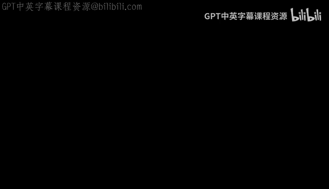
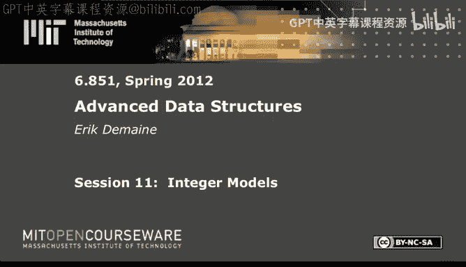
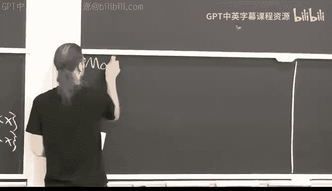

# 《高级数据结构｜6.851 Advanced Data Structures, Spring 2012》中英字幕（deepseek - P11：-11-11. Integer Models.zh_en - GPT中英字幕课程资源 - BV1FDFVzdEBA

The following content is provided under a creative Commons license。

 Your support will help M I T Open Coseware continue to offer high quality educational resources for free。

To make a donation or view additional materials from hundreds of MI T courses。

 visit Mi T OpenCourseware at O C W dot M I T dot E Du。

Alright， today is all about the predecessor problem。

 which is a problem we've certainly talked about implicitly。 say binary search trees。

 You want to be able to insert and delete into a set and compute the predecessor and successor of any given key。

So， maybe。Define that formally。And this is our， our。Not really our first。

 but it is an example of an integer data structure。 And for whatever reason。

 I don't brand hashing as an integer data structure justca it's its own beast。

 But in particular today， I need to be a little more formal about the models of computation we're allowing or I want to be in particular。

 because in the predecessor problem， which is。Answer it。Until they eat。Predecessor successor。

 there are actually lower bounds that say you cannot do better than such and such with hashing。

 there aren't really any lower bounds because you can do everything in constant time with high probability。

 So I mean， there are maybe some lower bounds on deterministic hashing。 that's harder。

 But if you allow randomization， there's no real lower bounds。 Where predecessor， there is。

And in general， predecessor problem。key thing I want to highlight is that we're maintaining here a set of S I。

The set is called S。Of。And elements。Which live in some universe。 U。 Its like last time。

 when you insert， you can insert an arbitrary element of the universe that probably shouldn't be an S or it'll get thrown away。

But the key thing is that predecessor and successor operate not just on the Elmson in S。

 but you can give it any key doesn't have to be in there。

 And it will find the previous key that is in S or the next key that is in S。

 So predecessor is the largest key that is less than or equal to X。That's in your set。

And successor is the smallest that is larger。Of course， if there is one。Okay。

 so those are the kinds of operations we want to do。 Now。

 we know how to do all of this in log n time。 No problem with binary search trees。

In the comparison model， but I want to introduce two more。

 say realistic models of computers that ignore the memory hierarchy。

 but think about regular RA machines， random access machines and what they can really do。

And it's a model we're going to be working in for the next， I think， five lectures。

So important to set the stage right。

So these are models for integer。Data structures。In general。We have a unifying principle。

 which is the or a unifying concept， which is a word of。Information， a word of data。

 a word of memory。 It's used all over the place， a word of input。A word。

Is the machine theoretic sense not like the linguistic sense。It's going to be a W bit integer。

And so this defines a universe， which is， I'm going to assume they're all unsine integers。

So this is2 to the W minus1。Those are all the unsigned integer you can represent with W bits。

 We'll also call this number2 to the W little U。 That is the size of the universe。Which is capital U。

 So this matches notation from last time。 But I'm really highlighting how many bits we have， just W。

Now。Here's where things get interesting。 I'm gonna get to a model called a word Ram。

 which is what you might expect more or less。 But before I get there。

 I want to define something called a trans dichotomous Ram。Tough word to spell。

Just means bridging a dichotomy， bridging two worlds， if you will。Ram is random access machine。

I've certainly mentioned the word RA before。But now we're going to get a little more precise about it。

 So in general， in the Ram， memory is an array， and you can do random access into the array。

 But now we're going to say。The cells of the memory， each slot of that array is a word。

 Everything's gonna be a word。 Every input， If you want all these X's are gonna be words。

 everything will be a word。 And in particular， the things in your memory are words。😊。

Let's say you have S of them， that's your space bound。In general， a trans dichotomous RAM。

 you can do any operation。That reads and writes。A constant number of words。In memory。

 and in particular， you can do random access into that memory。But in particular。

 we use words to service as pointers。Here's my。Memory of words。Each of them is W bits。ItS of them。

my guess。0 to S -1。 And if you have like the number。3 here。That is。

 can be used as a pointer to the third slot of memory，1，2，3。

You can use numbers as indexes into memory。 So that's what I mean by word service pointers。

 So in particular， you can implement a pointer machine。Which no surprise。 But for this to work。

We need a lower bound on W。This implies W has to be at least log of the space bound。 Otherwise。

 you just can't index your whole memory。And if you've got S -1 things。

 this2 to the W -1 better be at least S -1。So we get this lower bound。 So in particular， presumably。

 S is。At least your problem size N， you're trying to maintain n items。 You've got to store them。

So W is at least log。 N this relation。Is essentially a statement bridging two worlds， namely。

 you have， on the one hand， your model of computation， which has a particular word size。

 And in reality， we think of that as being 32 or 64 or maybe 1，28， Some fancy operations on。

 on Intel machines。 you can do 128 B。 So， and then there's your problem size。

 which we think of as an input。 Now this is relating the two。 It's a little weird。

 I guess you could say it's just a limitation for a given CPU。

 There's only certain problems you can solve。But it theoretically。

 it makes a lot of sense to relate these two， because if you want to。

 if you're in a Ram and you've got to be able to index your data。

 you need at least that many bits just to be able to talk about all those things。

 And so the claim is basically your machines， machines will grow to accommodate memory size。

 as memory size grows， you'll need more bits。 Now， in reality， I mean， there's only about2 that to 2。

56。We call them particles in the known universe。 So word size probably won't get that much bigger beyond 2。

56 should be okay， but。Theoretically， this is a nice way to formalize this claim that word sizes don't need to get too big unless memories get gigantic。

So it may seem weird at first， but it's very natural。

 And all real world machines have big enough words to accommodate that。 Word size could be bigger。

 That will give you essentially more parallelism。But should be at least that big。Alright， enough。

Proselytizing。Then the， that's the trans dichotomous Ram the end。

 And the word Ram is a specific version of the trans dichotomous Ram。

Where you restrict the operations to sea like operations。These are sort of the standard。

 their instructions on basically all computers， except， I mean。

 a few risk architectures don't have multiplication and division。But everything else。On everything。

So these are the operators， unless I missed one in C。They're all in Python and most languages。

 got integer arithmetic including mod。You've got bitwise， and， bitwise， or， bitwise， X or。

 bitwise negation， and shift left and shift right。These we all view as taking constant time。

 They take one or one or two integer inputs， words as inputs， they compute an answer。

 they write out another word。 Of course， you can， there's also random access， array de reference。

 I guess。Which you can， yeah。So that's the word Ram。 You restrict these operations。

 whereas trans dichotomous Ram， you can do weird things as long as they only evolve a constant number of words。

 Word Ram。 It's the regular thing。 So this is basically the standard model that all integer data structures use pretty much。

 If they don't use this model， they have to say so。Otherwise。

 this model has become accepted as the normal  one。

 It took several years before people realized that's a good model。

 good enough to capture pretty much everything we want。Okay。

 the cool thing about word Ram is it lets you do things on W bits in parallel。

 You can take the and of W bits Parawise all at once。 So you get some speed up。

 But it's a natural generalization of something like the comparison model， comparison model。

 I guess I didn't write those。 more operations less than greater than and so on。😊。

You can compare things Two numbers in constant time。

 get a Boolean output via a subtraction and computing the sign。啊。

And you think of comparisons taking constant time。 So why not all of these things。Cool。

One more model。Just kind of a weird one。It's called C Pro model。Which is。We just count。

The number of memory reads and writes。That we need to do。To solve a data structure or query。

 like you're looking at predecessor， I just want to know how much of the data structure do I have to read in in order to be able to answer the predecessor problem。

 how much do I have to write out to do an insertion， whatever。And so in this model。

 computation is free。And this is kind of like the。External memory model in the cache blivious models。

 there we're measuring how many block reads and writes there are。 Here blocks are actually our words。

 So there is a bit of a relation， except there's no real。

 you can either think of theres being no cache here because you're just reading in a constant number of words。

 doing something， spitting stuff out。Or in the cellpro model。

 you could imagine there being an infinite cache for this operation。

 but no cash from operation to operation。 It's just how much do I have to read in information theoretically to solve a particular predecessor problem。

 We'll deal with this a lot in a couple of lectures。 Not quite yet。

 This model is just used for lower bounds。It's not a realistic model。

 because you have to pay for computation in the real world。

But if you can prove that you need to read at least a certain number of words， then， of course。

 you have to do at least that many operations。So it's nice for lower bounds。 In general， we have。

This sort of hierarchy of models。Where this is the。Most powerful， strongest。And below cell probe。

 we have word Ram or sorry， trans dichotomous Ram。Then， word Ram。

Then just to fit it in context of what we've been doing below that pointer machine。

And below that would be binary search tree mentioned before。

 pointer machine is more powerful than binary search tree。 And， of course。

 we can implement a pointer machine on a word ramp。 So we have these relations。There are， of course。

 other models， but this is a quick picture of models we've seen so far。Okay。

So now we have this notion of a word。In the predecessor problem， these elements are words。

They're W bit integers。The universe is defined， and we want to be able to insert delete predecessor and successor over words。

So， that's the。Our challenge。啊。For context， of， I mean， in， in the binary search tree model。

 we know the answer to this problem is data log n。 In general。

 any comparison based data structure you need data log n。In the worst case， easy lower bounds。

But we're going to do better。On these other models in the word Ram。So here are some results。

First data structure is called venom Nebels。 You might guess it is by Vanom debos， Peter。啊。

It actually has a couple other authors in some versions of the papers。

 which makes a little bit confusing。 But for whatever reason。

 the data structure is just named F and deboas， and it achieves。huh。Log W per operation。

 I think I'll rewrite this。 This is log log U per operation， but it requires U space。

So think of use space as being like for every item in the universe I store， yes or no。

 I it in the set。 So that's a lot of space。Unless N and U are not too different。But we can do better。

But the cool thing is the running time。 This is really fast。😊，Log， log you。If you think about。

 for example， I don't know， universe being。Polynomial and N。

Or even if the universe is something like， you know， polynomial and n is the same as like this。

 right to the C log n， you can go crazy and say log to the C power。

 So like2 to the log to the fifth power。 All those things you take log twice， then log log U。

Becomes the。Log log in。So as long as your word size is not insane。You， you're getting log log n。

 iss not insanely large。 getting log log n performance。 So in general， when。What's a W is。

Order log polylo and。And we're getting this kind of performance。 And I think at most computers。

 W is polylogarithic。 We said it has to be at least log。

 It's also generally not so much bigger than log。 So log square is probably fine for most of the time。

 unless you have a really small。problem。Okay， so cool。 But the space is giant。

 So how do we do better than that？ Well， there's a couple answers。 One is that you can achieve。😊。

Log W with high probability。And order and space。With a slight tweak， basically。

 you combine be de Boas plus hashing。And you get that。

Don't actually know what the reference is for this result。 It's。

 it's been an exercise in various courses and so on。I can talk more about that later。

Then alternatively， there's another data structure， which in many ways is simpler。

It really embraces hashing。 It's called why fast trees， and it achieves the same bounds。 So log W。

 high probability。And linear space。 It's basically just a hash table。With some cleverness。

 we'll get there。 even though it's simpler， we're gonna start with this structure。 And then it。

 it was， historically， this is the way it happened。 Ven and Du Bois， then why fast Ra by Willard。

 Ill be kind of a nice finale。So if we take the， sorry。

 there's another data structure I wantan to talk about。

Which is designed for the case when W is very large。Closer， much bigger than polylo N。 In that case。

 is something called fusion trees。 And you can achieve log based W of N。I guess。

 with high probability。And linear space。The original fusion trees are static。

 and you could just do log based W ofN deterministic queries。

But there's a new later version that's dynamic， achieves this using hashing。For updates。

Inserions and deletions。Cool， so this is almost upside down。

 It's obviously always an improvement over N。 log based W event。m sorry。

 always an improvement over just log base2 event。😊。

But it's sometimes better and sometimes worse than log W。 In fact。

 kind of makes sense to take the min of them。When W is small， you want to use log W。 When W is big。

 you want to use log based W of N。They're gonna balance out when W is。系。F root。2 to the root log n。

 something like that。 The easy thing is when， when these balance out is when they're equal。

 and that will be when。This is log n divided by log W。

 So when log W equals log n are divided by log W， let's do that over here。OhW。Lo in over log W。

Then this is like saying log squared W equals log n or log W is root log n。So that was right。

 W is 2 to the root log n， which is a weird quantity。 But the easy thing to think about is this one。

 Lo W is root log n。 And in that case， the running time you get is root log n。

So it's always at most this。 and the， the worst cases when these things are balanced and then the men of these two or these two are the same。

 and they both achieve root log N。But if W is smaller or larger than this threshold。

 these structures will be even better than root log n。 But in particular。

 it's a nice way to think about， oh， we're doing sort of a square factor better than binary search trees。

And we can do this high probability。In linear space。So， that's cool。

Turns out it's also pretty much optimal。And that's not at all obvious。

And wasn't known for many years。So。There's a cell probe， lower bound。So these are all on the。

In the word RA model。All these results， the first one that actually kind of works in the pointer machine。

 I can I'll talk about that later。As lower bounds a little bit messy to state。

The bound is slightly more complicated than。T what we've seen。

 But I'm gonna restrict to a special situation， which is if you have N polylo n space。

 So this is a lower bound on static predecessor。 All you need to do is solve predecessor and successor or even just predecessor。

 There's no inserts and deletes。In that case， if you use lots of space like U space， of course。

 you can do constant time for everything。 You just store all the answers。

 But if you want space that's not much bigger than N。In particular。

 if you wanted to be able to do updates in polylo， this is the most space you could ever hope to achieve。

So assuming that， which is pretty reasonable。There's a bound of。The min of two things。

 log wastes W of N， which is fusion trees。And roughly log W， which is Vannon Du Bois。

 But it's slightly smaller than that。Yeah。Yeah， pretty weird。 Let me tell you the consequences。

Li easier to think about thanon debos is gonna be optimal。For the kind of the cases we care about。

 which is when W is polylog n。So， yeah， probably log in。And fusion trees are optimal。When w is big。

Square root log n。Log log n。Okay。Little messy。 And so there's this。

 there's this divided by log log w over log log n。 If， if， if W is poly log n。

 then this is just order log log n。 And so this cancels， this becomes constant。

 So in these situations， which are the ones I mentioned over here。 Ws poly log n。

 which is when we get log log n performance。 And that's kind of the case we care about venom Novo is the best thing to do。

Turns out this is actually the right answer。 You can do slightly better。That's almost an exercise。

 You can tweak van nebos and get this slight improvement。 But most word sizes。

 it really doesn't matter。 You're not saving much。嗯。Cool， so other than that little factor。

 these are the right answers。 You have to know about Vanom Duvos。

 You have to know about fusion trees。 And so this lecture is about Vanon Duvos。

 Next lecture is about fusion trees。u。This result is from。2006 and7。 so pretty recent。Okay。

So let's let's start random Neos。呃。Yeah， let's， let's dive into it。

 I'll talk about history a little later。 The central idea。

 I guess if you wanted to sum up venom debos in an equation。

 which is something we very rarely get to do in algorithms is to think about this recurrence。

 T of U T of square root of u plus order 1。What does it solve to？Log log you。Right， just think of。

Think of taking logs。 This is the same as T of W equals T of W over 2。Plus order one。

 I use the word size。And so， this is。LW， same thing。If we can achieve this recurrence， then boom。

 we get our bound of log W。So how do we do it？We split。universeverse。Into。Root U clusters。Each。

Of size root u。Okay， so if here's our universe。Then。And just split every squared of U items。

So each of these is root u long， the number of them is squared of u。And then somehow。

 I want to recurse on each of these clusters。And I only get through recursion one of them。

 So a pretty simple idea。Now啊。Okay。Yeah， so I'll talk about how to actually do that recursion in a moment。

 Before I get there， I want to define a sort of hierarchical coordinate system。This is a new。

Way of phrasing it for me。 So hope you like it。If we have a word X。

 I want to write it as two coordinates。C and I， I'm gonna use angle brackets。

 So it doesn't get too confusing。 C is which cluster you're in。 So this is cluster 0， cluster 1。

 cluster 2， cluster 3， I is your index within the cluster。 So this is 0，1，2，3，4。

5 up to root you-1 within this cluster， then 0，1，2，3，4，5， up to root you -1 within this cluster。

 So those are the。The eye is your index within the cluster。Like this。

 And C is which cluster you are in。Okay， pretty simple and there's easy。Arithmetic to do this。

 C is X integer divide root U， and I is x。In ager mod route。 you I use Python notation here。嗯。So。

Fine， I think you all know this Pre simple。 And if I gave you C And I。

 you could reconstruct X by just saying， oh， well， that's C times root you。Plus， I。

 so in constant time， you can decompose a number into its two coordinates。 That's the point。In fact。

 it's much easier than this。 You don't even have to do division if you think of everything in binary。

 which computers tend to do。 So the binary perspective。Is that X is， it's a word。

 So it's a bunch of bits， right，0，1，1。0，1，0，0，1， whatever。Divide that bit sequence in half。And this。

 then this part is C。 This part is I。And if you assume that W is a power of  two。

 these two are identical。 They're not a power of2。 I mean， you've got a round a little bit here。

 Does't。 It doesn't matter。 but you can use this definition instead of this one either way。

 So in this case。C is oh boy。X shifted right W over 2。 Basically。 So this is， this is W over 2。

W over2。wholehole thing is W bits。So if I shift right， I get rid of the low order bits。 If I want I。

 it's slightly more annoying， but I can do it as an and。With。1 shifted left。W over 2。Minus1。

That's the， that's probably how you do it and C。 I don't know if you're used to this。

 But if I take a 1 bit， I shift it over to here and I subtract1， then I get a whole bunch of1 B。

 And then you take， you mask with that bit pattern。 So I'm masking with 1，1，1，1。

 then I'll just get the lower order bits。Computers do these super fast。

 way faster than integer divisioncause， I mean， this is just like routing bits around。

 So this is easy to do on a typical CPU。 And this will be much faster than this code。

 even though it looks like more operations， typically。😊，Alright， so fine。 point is。

 I can decompose accent to C and I。 Of course， I can also do the reverse。

 This would be C shifted left， W over 2。Orored with I。Okay。It's a slight diversion。

Now I can tell you the actual recursion。And then talk about how to maintain it。So。

We're gonna define a recursive。Venom deboa structure。Of size。You and word size。W。

And what it's going to look like is we have a bunch of clusters。Each of psi squared of u。Okay。

 so this represents the first root U items。 This represents the next root U items。

 This represents the last root U items， so on。 So that's the obvious recursion from this。

 So this is going to be a randomom to bow structure of size root U。

And then we also have a structure up top， which is called the summary structure。

And the idea is it represents for each of these clusters。Is there， is the cluster empty or not。

Does this cluster have anybody any items in it。Yes or no。 If yes， then that。

 the name of this cluster is in the summary structure。So notice by this hierarchical decomposition。

 the cluster number and the index。Are valid names of items within these substructures。 Basically。

 we're going use the， the I part to talk about things within the clusters。

 or we're going to use the C part to talk about things within the summary structure。

 They're both the numbers between 0 and U -1， and so。We get this perspective。 alright， so。Formerally。

Or some notation。Cluster I。So we're going to have an array of clusters。

Is been in thebo thing of size。Square root U and word size。W over 2。

 This is slightly weird because the machine， of course， its word size remains W。

 It doesn't get smaller is your recur。 we're not gonna try to。

 you know spread the parallelism around or whatever。 So， but this is just a notational convenience。

 I want to say， the word size goes conceptually goes down to W over 2 So that this definition still makes sense because as。

 as I look at a smaller part of the word。 in order to divide it in half。

 I have to shift right by a smaller amount。 So that's the W that I'm passing into the structure。Okay。

 and then V that summary。Is the same thing。 It's also a vanvo thing of size group U。

Then the one other clever idea， which makes all of this work。Is that we store the minimum element。

And V dot min。And we do not store it recursively。So there's also one item here。Size 1。

Which is the min。It' just stored off to the side。 It doesn't live in these structures。

 Every other item lives down here。 And furthermore， if one of these is not empty。

 there's also a corresponding item up here。This it turns out to be crucial to make。Event into work。

And then。B dot max， we also need， but it can be stored recursively。

 So just think of it as a copy of whatever the maximum element is。Okay， so in constant time。

 we can compute them in and compute the max。 That's good。 But then I claim also in log W time， log。

 log U time， we can do insert delete predecessor successor。So let's do that。This data structure。

 I mean， the solution is both simple and a little bit subtle。

 And so this will be one of the few times I'm gonna write explicit pseudocode to exactly how to maintain this data structure。

It's short code， which is good。 Each， each algorithm is only a few lines。But every line matters。

 So I want to write them down so I can talk about them。And with this new hierarchical notation。

 I think it's even easier to write these down。See her。See how I do。Oh。Okay。

 so we'll start with the successor code。 predecessor is， of course， symmetric。

And it basically has two cases。But there's a special case in the beginning。

 which is if the thing you're querying happens to be less than the minimum of the whole thing， then。

 of course， the minimum is a successor。This has to be done specially because the min is not stored recursively。

 so you've got to check for the min every single level of the recursion。

But that's just a constant time。 No big deal。 Then the interesting thing is that we have recursions in both sides。

 in both， both cases， but only one。The key is we want this recurrence。

 T of U is one times T of root U。Plus， order  one。 that gives us log log U。 If there was a two here。

 we would get log U。It is no good。We want the one。 So in one case， we call successor on a cluster。

 In the other case， we call successor on the summary structure。But we don't want to do both。Okay。

 so let's just think about intuitively what's going on。 We've got this。

Because I can do it in the same picture。 I've got this summary and a bunch of clusters。

And let's say you want to compute。 what's the successor of this item。 So by via this transformation。

 we compute which cluster it lives in and where it is within the cluster。 That's I。

 So's some item here。 Now， it could be the successor is inside the same cluster。

 Maybe there's an item right there。Okay， then I want to recursse in here。Or it could be。

 it's in some future cluster。So in that case， okay， well， let's first， let's do the first case if。

Basically， we are less than the max of our own cluster。 That means the the answer is in there。Right。

 figure out what the max is in this structure， the right most item in S that's inside this cluster C。

This is C。If our index is less than the maxes index。Then if we recurs in here。

 we will find an answer。If we're bigger than the max， then we won't find an answer down here。

 We have to recurse somewhere else。So that's what we do。 If we're less than the max。

Then we just recursively find the successor of our index within cluster C。And then the answer。

 we have to add on the C in front， because successor within this cluster will only give a name or give an index within the cluster。

 And we have to preend the C part to give a global name。Okay， so that's case 1。 very easy。

 The other case is where we're slightly clever。InSome sense， we say， okay， well， if。

 if there's no successor within the cluster， maybe it's in the next cluster。 Of course。

 that one might be empty， in which case， it's in the next cluster， but that one might be empty。

 So look at the next cluster。 We need to find what is the next non empty cluster for that。

 We use the summary。Structure， so we go up to position C here。 We say， okay。

 what is the next non empty structure after C， because we know it's whatever that's going be where our answer lives for successor。

So that's going to give us basically a pointer to one of these structures， C prime。

Which all these guys are empty。 And so there's no successor in there。

 The successor then the men in the structure。So that's all we do。

 Comp the successor of C in the summary structure。And then in that cluster， C prime， find them in。

 which takes constant time。And then do C prime， prepen C prime to that to get a global name。

 And that's our。Sucor， yeah， question。Why men is not recursive， because looking at this。

 it looks like。O， sorry。 The question is， why is the minimum not recursive。

 The answer to that question is not yet clear。 It'll have to do with insertion。

 But I think what exactly this means I maybe didn't state carefully enough。

Every venan debo structure has a min， stores a min。Okay， in that， in that sense。

 this is done sounds funny， not so recursively， but everyone stores it。The point is that this item。

Doesn't get put into one of these clusters recursively， Just the item。

 But each of these has its own min， which is then not stored at the next level down。

 And each of those has its own min， which is not stored at the next level down。

 Think of this as kind of like a little buffer。The first time I insert into the structure。

 I just stick it in the min。 I don't touch anything else afterward。 Well。

 you'll see when we get to the insertion algorithm。 But things。

 it sort of slows things down from trickling。 is that。

So what that that prevents from That will prevent the insertion from doing two recursions instead of one。

So we'll see that in a moment。 This point， just successor is， is very clear。

 This would work whether the min is stored recursively or not。 But we do need。

 we need to know what the min is of every structure。 We need to know the max of every structure。

That at that point， I mean， at this point， you could just say that min and Max could be copies。

 No big deal。And we'd be happy。 And of course， predecessor does the same thing。Okay。

 so the slight cleverness here is that we use the min here。

 This could have been a successor operation with minus infinity as the query。

 but that would be two recursions。 we can only afford one。 Fortunately。

 it's the min item that we need， so。😊，We're done with successor。

 That was the easy case or the easy one。 insertst is slightly harder。Delete。Is just slightly messier。

 It's basically the same as insert。So。Insert， let me。Write the code again。

inserttion also has two main cases。 There's this case and the other case。 There's no else here。

 This happens in both cases。 And then there's some just annoying little details at the beginning。

 Just like over here， we had to check for the min special here。 we've got to update the min and max。

 And there's a special case I haven't mentioned yet。 V dot min。Will be special cases。

 it will be this value none if the whole structure is empty。

So this is another way to tell whether structure or is the obvious way to tell whether structure is empty。

 It has no min。Becauseuse if there's any items in there， there's going to be one in the mins slot。

So first thing we do is check is our structure empty。 If it's empty。

 the min and the max become the inserted item。 We're done。So that's the easy case。

 We do not store recursively in any of the。InIn here。

 that's what this means that this I element does not get stored in any of the clusters。

 If it's not the very first item or it's not the min item。

 then we're gonna recursively insert it into a cluster。

So we always insert if we have X and cluster C， we always insert index I into cluster C。That's。

 except if it's。The men。Okay， now it could be where structure is not empty。

 There is a min item there， but we are less than the min。 In that case， where the new min。

 we just swap those。 And now we have to recursively insert the old bin into the rest of the structure。

 So that's the simple case。 Then we also have to update V dot max just in the obvious way。

 This is the easy way to maintain a V dot max imvariant。That is the maximum item。 Okay。

 now we have the two cases。I mean， this is really the obvious thing to get to do insertion。

 We have to update the summary structure， meaning if the cluster that we are inserting into cluster C is empty。

 that means it was not yet in the summary structure， we need to put it in there。

 So we just insert C into V dot summary。 Pretty obvious。 And in all cases。

 we insert our item into cluster C。This looks bad， however， because there's two recursions。

 in some cases。 If this if doesn't hold， it's one recursion， everything's fine。

 So if the cluster was already in use， great， this is one recursion。 This is constant work。

 We're done。The worry is， if the cluster was empty before。Then this insertion is a whole recursion。

 That's， that's scary because we can't afford a second recursion。😰，But。

It's all okay because if we do this recursion， that means that this cluster was empty。

 which means in this recursion， we fall into this very first case。 right， that structure。

 its min is none。 That's what we just checked for。If it's none， we do constant work and stop。So。

Everything's okay。 We're only if we recurse in the summary structure。

 we will this recursion will be a shallow recursion。 just those one thing。 You could， of course。

 you could actually put this code into the else case if you preferred or sorry into this if case。

 and make this an else case。 That's another way to write the code。

 but this will be a very short recursion。 So either you just do this recursion。

 which could be expensive， or you just do this one， in which case， we know this one is cheap。

 if this happens， we know this will take constant time。 So in both cases。

 we get this recursion square root of U。Plus， constant。 And so we get log， log U insertion。

Do you want to see delete？ I mean， it's basically the same thing。It's in the notes。Same， I mean。

 you do the obvious thing， which is you delete in the cluster。 And then if it became empty。

 you also have to delete in the summary structure。So there's， again。

 a chance that you do two recursions。 But okay， I'm talking about it。 maybe I right a little bit。

Of the code。I think I won't write all the code， though， just the main stuff。So， if we want to delete。

Then basically， we delete。In cluster C， index I。And then， if。

The cluster be has become empty as a result of that。

Then we have to delete cluster C from the summary structure。

So that our predecessor and successor queries actually still work。Okay。

 so that's the bulk of the code。 I mean， that's where the action happens。 And the worry would be。

 in this， if case， we're doing two recursive deletes。The claim is。If we do this second delete。

 which is potentially expensive， this one was really cheap。

The claim is that emptying a N M debo's structure takes constant time。 Like。

 if you're deleting the last element。 why， Because when you're deleting the last element。

It's in the min right here。 There's nothing everything below it。

 All the recursive structures will be empty if there's only one item because it will be right here。

 you can check that from the insertion who was empty， all we did was change V dot man and V dot max。

 So the inverse， which I want right here， is just to clear out V dot man and V dot max。

 So if this ends up happening， this only took constant time。

You don't have to recurse when you're deleting the last item。 So in either case。

 you're really only doing one deep recursion。 So you get the same recurrence and you get log log U。

So for the details， check out the notes。 I w to go to other perspectives。A venom dev。

This is one way to think about it。 And amusingly， and this is probably the most taught way to do Veno Novo。

 It's in C L RRS described this way， because。In 2001， when I first came here。

 I presented Vanom debo like this in the undergrad algorithms class with more details。

 guysy are grad。 So I did it like three times faster than I would in 6，0，4，6， but。😊。

And then so now it's in textbooks and whatnot。 But this is not how Venom de Bois presented this data structure just out of historical interest。

 This is a way that I believe was invented by Michael Bennder and Martin Farch Colton。

 who were the co-authorors on Cashlo's Bearies。 And around 2001。

 they were looking at lots of old data structures and simplifying them。 I think this is a very clean。

 simple way to think about Venom de Bois， But I want to tell you the other way。

 which is the way it originally appeared in their papers。

 especially three papers about by Venom debos about this structure。Most。

 many papers appear twice once in a conference， once in a journal。 This one。

 there's three relevant papers。 There's conference version， journal version。

The only weird thing there is that the conference version has one author， venom deos。

 This journal version has three authors。B de Bos， Kass and Ziltra。

And they're acknowledged in the conference version。 So I guess they， they helped even more。

 in particular， they， I think， implemented this data structure for the first time。

 It's a really easy data structure to implement and very fast。啊。

Then there's a third paper by Van Dubos only in a journal which improves the space a little bit。

 So we'll see a little bit what that's about。But what I like about both of these papers is they offer an a simpler way to get this。

To get log， log you。Successor， predecessor。Let's not worry about insertions and deletions for a little bit and take what I'll call the simple。

Treeview。So I'm gonna draw a picture。0，1，0，0。0，0，0。O。This is what we call a bit vector。Meaning。

 here's item 0， item 1， item 2， and here is u-1。And I'll put a one if that element is in my set and a 0 otherwise。

Okay， so one is in the set。9， I think， is in the set，10 and 15 are in the set。嗯。

I kind of want to maintain this。 This is， of course， easy to maintain by insertions and deletions。

 I just flip a bit on or off， but I want to be able to do successor queries。

 If I want the successor of， say， this 0 finding the next 1。 I don't want to have to walk down。

 That would take order you time。 Very bad。 So obvious thing to do is build a tree on this thing。

And I'm going to put in here the orar of the two children。

Every node will store the ore of its children。Okay， and then keep building the tree。

now we have a binary tree。With bits， bits on the vertices。

And I claim if I want to compute the successor of this item。

 I can do it in a pretty natural way in log， log U time。 So keep in mind， this height here is W。

Right，Lo you。So I need to achieve log W。 So， of course， you could try just walking down this tree。

Or walking up and then back down。 that would take order W time。 That's like the obvious B。

 S T approach。 I want to do log W。So how do I do it， I'm gonna binary search。On the height。

How could I binary search on the height？ Well， if you look at what I really like to do。

 in some sense， if I， I look at the path of this node to the root， where's my red shockuck。So。

 here's the path。To the root。Okay， these bits are saying， is there anybody down here。Right，That's。

 that's what the or gives you。 So it's like the summary structure。If I want to search for this guy。

 well， if I walked up， eventually， I find a one。And that's when I find the first nearby element。 Now。

 in this case， it's not the successor I find。 it's really the predecessor I found When you get to the first one。

 the transition from 0 to 1， you look at your sibling， the other child of that one。

And down in this subte。There will be either the predecessor or the successor。In this case。

 we got the predecessor because it was to the left。 We take the max element in there。

 And that's the predecessor of this item。 If instead we had found this was our first one。

 Then we look over here， Take the min。 There's， of course， nothing here。 But in that situation。

 the min over there would be our successor。 So we can't guarantee which one we find。

 But we will find either the predecessor or the successor。

 if we could find the first transition from 0 to 1。

And we can do that via binary search because this string is monotone。

 It's a whole bunch of zeros for a while。 And then once you get a one。

 it's gonna continue to be one because those are or。 We keep that one will propagate up。Okay。

So this is the new idea to get log Lawview predecessor successor。Is to。Let's say。

Any route to leave path。Is monotone It's 0 for a while， and then it becomes one forever。

So we should be able to binary search。For the0 to one transition。And it either looks like this， or。

It looks like this。So our query was somewhere down here。In the zero part。

I'm assuming that our query is not a one， otherwise it's an immediate 0 to one transition。

That's a special case。 It's easy to deal with。 And then there's the other。Te。The other。

 the sibling of X， the other child of the one。And in this case， we want to take them in。

And that will give us our successor of X。And in this case， we want to take the max over here。

And that will give us the predecessor of x。So as long as we have minimumax of subtes。

 this is constant time。We find either the predecessor or the successor。 Now。

 how do I get the other one。Pretty easy。 Just store a linked list of all the items in order。

So I'm gonna to store a pointer from this one to this one and vice versa and this one to this one。

This is actually really easy to maintain because when you insert， if you， when you insert。

 if you can compute the predecessor and the successor， you can just stick it in the linked list。

 That's really easy。 We know how to do that in constant time。So once you do this。

 it's enough to find one of them as long as you know which one it is because then you just follow a point or。

 either a forward or a backward point or you get the other one。 So whichever one you wanted。

 you find both predecessor and successor at the cost of finding either one。

So that's a cute little trick。This is hard to maintain， dynamically。At the moment。 But this is。

 I think， where the ven endbo structure came from。 It's nice to think about it in the tree view。😊。

Now， let me and， so we get。We get log， log U。啊。Predecessor and successor。

I should say what this relies on is the ability to binary search on any route to node path。 Now。

 there aren't enough pointers to do that。So you have a choice either， you realize， oh。

 this is a bunch of bits in a complete binary tree。

 so I can store them sequentially in array And given a particular node position in that array。

 I can compute or what is the second ancestor or the fourth ancestor or whatever in constant time。

 I just do some arithmetic。 and I can compute from here， where to go to there。

 It's like the heap regular old heaps， but a little bit embellish because you have to divide by a larger power of two。

 not just one of them。So that's one way to do it。 So in a Ram， that all works fine。

When Venno Deos wrote this paper， though， the Ram didn't kind of existed。

 It just wasn't as well developed then。 And the hot thing at the time was the pointer machine。

And their data structure， I guess at that point， they called it the Pascal machine or or less。

 Pascal does have arrays。 And the funny thing is they does both does use arrays。

 but mostly itss pointers。 and you can get rid of the arrays from their structure。 essentially。

 in the end。😊，Venon depos， as presented like this， is in a pointer machine。

Let me tell you a little bit about that。So。Called this。Original vanonbo。

Which I'll call stratified trees。 That's what he called it。

It's basically this tree structure with a lot more pointers。 So in particular。

 each leaf or every node， actually，'s say stores。A pointer。To。The two to the Ih ancestor。Where I 0。

1 up to。W， I guess， no， log， log W。There's the two to the here。 So once you get。I mean， so， I mean。

 I the ancestor immediately above me， two steps above me，4 steps above me，8 steps above me。

 That's what I really need to do this binary search。 The first thing I need is halfway up。

And then if I have to go down， I'm gonna need a quarter of the way up。 And if I have to go down。

 I want an eighth of the way up。 whenever I go up from， if I decide， oh， there this is a 0。

 I've got to go above here， then I do the same thing from here。 I want to go halfway up from here。

From this node。 So as long as every node knows how to go up。And by any power of two， we're golden。

 we can do binary search。The trouble with this is it increases space。 This is U log W space。

It is a little bit bigger than you。 And the original venom de both paper conference and Journal version achieves this bound。

 not you。Little historical fun fact。 I not terribly well known。 Co。 So that's stratified trees。

I anything else。Alright， stratified tree， right。At this point， we have fast search， but slow update。

 Let me tell you about updates in a second。 Yeah， question。 So once you do the binary search。

How do you find？How do you walk back down。Oh， I didn't mention。

 but also every node store is made in Mac。So that lets me do the teleportation back down。

Every node knows the min and the max of its subree。 right One more thing。 I forgetting here。

 I say this a lot of pointers to store。 You can't store them all in one node。

 And in the Ven of devos paper， it's stored in an array， but doesn't really need that it's an array。

 It could just as well be a linked list。 And that's how you get。Poiner machine。

So this can be a linked list。And then this whole thing works in point of machine， which is。

Kind of neat。 And it's a little weird， because。If you use a comparison pointer machine。

 where all you can do is compare items， there's a lower bound of log n because you only have branching factor constant。

But here， the problem， the formulation， the problem is， when I say， give me the successor of this。

 I actually give you a pointer to this。Item， And then from there。

 you can do all this jumping around and find your predecessor or successor。 So in this world。

 you need at least use space even to be able to specify the input。嗯。So that's。

 that's kind of a limitation of the pointer machine。

 And you can actually show in the pointer machine。 Lo log U is optimal for。Any data structure。

 predecessor data structure in the pointer machine。 So there's a matching lower bound log， log。

You in this model。 and you need to use space。 So it's not very exciting。

 What we like is the word Ram there。 we can reduce space to N。 And that's what I wantan to do next。

 I believe。Almost next。 One more mention。Actual stratified trees。 I mean。

 here we got query fast update slow。 Stratified trees actually do update fast as well。 Essential。

 it's this idea。Plus， you don't recursively store them in。Which， of course。

 makes all these bits no longer accurate as it gets much messier。But in the end。

 it's doing exactly the same thing as this recursion。In fact， you can draw the picture。 It is。

This part up here。The top half of the tree， this is summary。And each of these bottom halves。

Is a cluster。There's root you clusters。Down here。So those are smaller structures。

 and there's one root you cluster up here， which is one root you size ven device structure。

 which is a summary structure。 These bits here are really the。

 it's the bit vector representation of the summary structure。 Is Is there anyone in this cluster。

 Is there anyone in this cluster and so on。This， of course。

 also looks a lot like the venom devo layout。 Take a binary tree， Cu it in half， do the top。

 Personal do the bottom。 So that's why I was called the venom deos layout。 is this picture。Okay。

 but if you take this tree structure and then you don't recursly store mins。

 and then the bits are not quite accurate。 It's messy。 And so stratified trees。

 if you try to read the original paper， it's a mess。 whereas this code， pretty clean。

And so once you say， oh， I'm just gonna store all these clusters as an array and not worry about keeping track of the tree actually gets a lot easier。

And that was the。Bendnder Fars calledton cleaning up， which never appeared in print。

 but it's appeared in lecture notes all over the place。And now CLRS， cool。

Wantna tell you about two more things。 It's actually gonna get easier。

 The more time we spend with this data structure。啊。All right。Dr a box。At this point。

 we've seen a clean way to get vent under a bus。 and we've seen a cute way in a tree to get search fast。

 but updates slow。 I want to talk a little more more about that。

 Let's suppose I have this data structure。 It achieves log W query， which is fast。😊。

But it only achieves W update， which is slow。Right， how do you update this structure。

 You update 1 bit at the bottom， and then you've got to update all the bits up the path。

 So you spend W time to do an update over here。If updates are slow， I just want to do less updates。

 We have a trick for doing this， which is you put little things down here of size theta W。

That and then only one item from here gets promoted into the top structure。

 We only end up having N over W items up here。And about one over W is many updates。

If I want to do an insertion， I do a search here to figure out which of these little call these chunks。

Which little chunk。It belongs in。 I do an insert there。If that structure gets too big。

 it's bigger than， say two times W or four times W， whatever。 then I'll split it。

And if I delete from something and gets too small， I'll merge with a neighbor。

 maybe resp just like bee trees。 We've done this many times by now。So， then。

 but only when it splits or I do emerge， do I have to do an update up here。

 Only when the set of chunks changes， do I need to do an a single insertion or deletion up here or constant number。

So this update time goes down by a factor of W。But I still。

 I have to pay whatever the update cost is here。 So what do I do with this data structure。

 I don't want to use vanom de Bo because this could be over a big universe Who knows what。

 I uses a binary search tree。Here， I can afford a binary search tree because then it's only log W。

 Lo W is the bound we're trying to get。So you can do these spider searchries。 It's trivial。

 Just do insert， delete， search。 Everything will be log W。Okay， so if I want to do a search。

 I search through here， which conveniently is already fast。 Lo W。

 And then I do a search through here， which is also log W。 It's nice and balanced。

 It think log W down here。If I want to do an insertion， do an insertion here， if it splits。

 I do an insertion here。 but that order W update cost。

 I charge to the W order W updates I would have had to do in this chunk before it got split。

So this is our good friend in direction。Technique we will use over and over in this class。

 Very helpful when you're almost at the right bound。

And it's actually in the follow up Van Nobo's paper， a similar indirect trick is in there。

So we can charge。Order W update。In top。To， that's the cost of the update to the order W。Updates。

That have actually been performed。In the bottom。Because when somebody gets split， it's nice in its。

 in its average state。 or when it gets merged， it's gonna be close to its average state。

 You have to do a lot of insertions or deletions to get it out of whack and cause a split or emerge。

So boom， this means the updates become。Log W searches are also log W。 So we've got Vanom devo again。

 in a new way。Bonus points。If you take this structure。Which okay， right， even this structure， if。

 if we did it in the array form， great， it was order U space。

 If we did it with all these pointers and we wanted a pointer machine data structure。

 we needed U log W space。But this indirect trick， you can also get rid of the log W and space factor。

It's a little less obvious。 But you take this here， we reduced n by a factor of W。

 You can also reduce U by a factor of W。 I'll just wave my hands。 That's possible。

 So U gets a little bit smaller。 And so when we pay U log W space。

 If you got smaller by a factor of W， this basically disappears。So you get M most order use space。

Okay， but order use is not order N。 I wantan to order n space， startarn it。So。Let's。Reduce space。

So said this is gonna get easier and easier。By the end， we will have very little of a data structure。

 but still we'll have log log U。I thought this was easy， but。Wait， there's more。Okay， right now。

 we have two ways to get log log U query and order use space。Does the one I'm erasing。

And there's this， take this tree structure with the very simple pointers， add in direction。

So admittedly， it's more complicated to implement， But conceptually， it's super simple。

 It's like do this obvious tree binary search on the level thing。And then at in direction。

 it fixes all your bounds magically。So conceptually very simple。 practically。

 you definitely want to do this much simpler。Now， what about saving space？Okay， very simple idea。

Which I think， again， comes from Michael Bennder Martin Farch Colton。啊。Don't store empty structures。

Okay， so in this picture。We had an array of all the clusters， but a cluster could be entirely empty。

 like this one。This entirely empty cluster。Don't store it。 It's a waste。If you store them all。

 you're gonna spend order use space。 If you don't store them all， just don't store the empty ones。

 I claim your order in space， done。So I'm going back to the structure I erased。

 ignore the tree perspective for a while。 don't。Store。Empty clusters。Okay， now this sounds easy， but。

 in reality， it's a little bit more annoying because。

We wanted to have an array of clusters so we could quickly find the cluster。 If you。

 if you store an array， you're going to spend at least square root of use space because at the very beginning。

 you say here， my you clusters， now some of them might be null pointers， but I。

 I can't afford to store that entire array of clusters。So don't use an array。

 Use a perfect hash table。So V dot cluster， instead of being an array， is now， let's say， dynamic。

 perfect hashing。And I'm going to use the version， which I did not present。 The version I presented。

 she's universal hashing was。Order 1 expected。 But we you know。

 or I said that it can be constant with high probability per operation。 It's a little bit stronger。

So now， I mean， everything's fine。 If I do an index V dot cluster C。

 that's still constant time with high probability now。

And I claim this structure is now order ends space。

Why is it order in space by simple amortization charge？Each。Table entry in that hash table。

To the men。The cluster。Right， every time。We're only storing non empty ones。 So if。

 if one of these guys exists in the hash table， we had to store a pointer to it。

 then that means the summary structure is non0。 It means， you know this guy is not empty。

 So it has an item in its min。 Char the space up here to store the pointer to that min guy。

Then each min， each item， each min item。Only gets charged once。

 because it only has one parent that has a pointer to it。So you only charge once， and therefore。呃。

Charge and table entry。Only charge each element once。And that means， and that's all your space。

 order end space。Done。Kind of crazy。 I guess if you want。

 there's also the pointer to the summary structure。 You could charge that to your own men。

 So then you're chargingdging twice。 but it's constant per item。So this is kind of funny。 Again。

 doesn't appear in print anywhere， except maybe as an exercise in C RRS now。

 but you get linear order end space。Just by adding hashing in the obvious way。 Now。

 for whatever reason， Willard didn't see this or wanted to do his own thing。

 And so he found another way to do order end space log log U query with hashing。Okay。

 but if you just take Van under de Bos of any， well。

 I guess also you had to think of it in this simple form。 It's harder to do this in the tree。

Can be done， I think， But this is a simpler view than the tree， I think。

 And then boom order end space。But it turns out there's another way to do it。

This is a completely different way to do Van and debo， actually not that completely different。

 It's another way to do this。And。With passion。And this is what's called。

 I'm going to start with what's called X fast trees。 And then we will modify it to get Y fast trees。

 That's Willard's terminology。Okay， so X fast trees is store this tree， but don't store the zeros。So。

Don't store zeros。Only store the ones。And the let me call this the simple tree view。

This is why I want， in particular， wanted to tell you about the simple tree view because it is really what X fast trees do。

 So what do I mean by only store the ones well。Think of them。Each of these ones has sort of a name。

What is the name of this item， Its name is 1， or in other words，0，0，0，1。 Each of these nodes。

 you can think of what is the path to get here， Like the path to get to this one is 1，0，0。

1 means right，0 means left。 Those names give you the binary indicator of where that node is in the tree。

 in some sense。So store the ones。诶。As binary strings。In a hash table。Again。

 a dynamic perfect hash table， let's a get constant with high probability。Okay。

 and if you're a little concerned， So what this means。

 the ones are exactly the prefixes of the paths to each of the items， right， This was item 1。

 And so I want to store this one， which is empty string， this one， which is 0， this one， which is 0。

0， this one， which is 0，0，0， this one， which is 0，0，0，1。 So it's。I take 0001。

 which is the item I want to store， and there's all these prefixes。

 which are the items I want to store。And for this， really， to make sense。

 you also need the length of the string。 I mean， strings of different lengths should be in different worlds。

 And so the way actually， X fast trees originally did it in the papers have a different hash table for strings of different lengths。

 That's probably an easier way to think about it。You store all the items themselves in a hash table。

 You store all the prefixes of all but the last bit in a separate hash table。

 all but the last two bits in a separate hash table and so on。 Now， what does this let you do。

It lets you do this。 binaryary search。For the 0 to one transition。Right， what we did here was， oh。

 I look at the bit。 Is it 0 or1。Instead of doing that， you do a query into the hash table and say。

 is it in the hash table， It's in the hash table， if and only if it is one。

 So looking at a bit in this conceptual tree is， the same thing as checking for containment in this hash table。

 But now we don't have to store the zeroes。Which is cool。So we can now do search。You know。

 predecessor or a successor。Fast。And log W time。V this old thing。Okay， again， you need to。

 you have to have mini max pointers as well。 Okay， so in this hash table。

 you store the min and the max of your subre。Or actually， from a one， you actually need the min of。

 need the max of the left subre。 and you need the min of the right subre。

 but the constant amount of information per thing。This is not perfect， however， in that it uses N。

NW space。And also， updates are slow。 It's order W updates。

But we're almost there cause we have fast queries， slow updates， non optimalmal space。 Take this。

Add in direction， done。And that's why fast trees。Yhy fast trees， you take x fast trees。

You add this indirect right here。And you get log W preparation。Order and space。Of course。

 this is with high probability because using hashing。Because we have， you know。

 we have factor W bad here。 factor W bad here。 You divide by W。 You're done。

Here you have n over W space n over W times W is n。Querries just like before， remain log W。

 but now boom updates， we've pay log W because of the binary searchries at the bottom， but。

Pretty cool。It's not neat。I've never seen this before。 I mean， okay。

 I've seen X fast trees and Y fast trees， but it's really just the same。

 We're doing taking venom de Bois， looking at it in the tree view。

 You can see where Willard got this stuff。 right， It's like， oh man。

 I really want to store all these bits。 But hey， it's way too big。 Just don't store the zeros。😊。

That means we should use a hash table。 hash table just gives you whether the bit is in or out。 Great。

 Now use indirect。 An indirection was already floating around as a concept at the time。

 slightlylight different parameters。 Fon debo had his under indirect to reduce the space from U times log W to U。

😊，But Willard did it。 Bo got down the end space in this way。But as you saw。

 you can also do it directly to Van device。 I mean all these ideas can be interchanged。

 You can combine any data structure you want with any space savingaving trick you want with indirect if you need to to speed things up and reduce space a little bit。

 But so as many， many ways to do this。 But in the end， you get log W preparation order end space。

 And that is sort of result one， it's probably the most useful predecess or data structure in general。

 But next time， we'll see fusion trees， which are good for when W is huge。😊。

