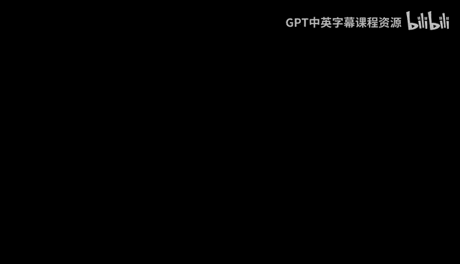
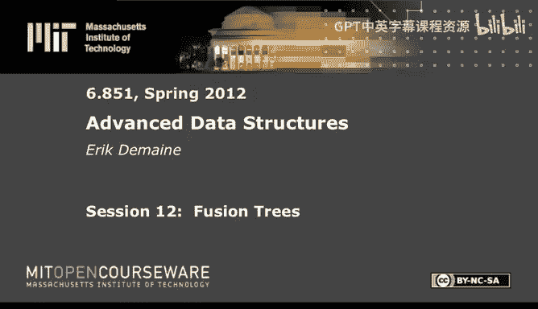

# 《高级数据结构｜6.851 Advanced Data Structures, Spring 2012》中英字幕（deepseek - P12：-12-12. Fusion Trees.zh_en - GPT中英字幕课程资源 - BV1FDFVzdEBA

The following content is provided under a creative Commons license。

 Your support will help M I T Open Coseware continue to offer high quality educational resources for free。

To make a donation or view additional materials from hundreds of MI T courses。

 visit Mi T OpenCourseware at O C W dot M I T dot E Du。

Today we continue our theme on integer data structures and we're going to cover one data structure called fusion trees。

 which introduce a bunch of cool concepts using might call bit tricks。

 using the word level parallelism to do lots of great things to do those great things we need to do something called sketching。

 which is taking essentially taking W bit integers and making them less than W bits。

 but still having enough stuff that we care about。And then we can actually compute those sketches using integer multiplication in a very clever way。

And given a bunch of these slightly less than W bit numbers。

 we can compare several for the price of one operation。 parallel comparison。

 and then a particularly nifty thing which is new this time I haven't covered it before is how to compute the leftmost one bit in a W bit integer in constant time。

All very cool。 And so we're gonna combine all these techniques and get fusion trees。

 What do fusion trees give us in the end。😊，Basically， the goal is to get log based W of M。

 predecessor and successor。So we're again talking about the predecessor。Problem we saw。

 we did log of W last time with Ven M debois and Y fastt trees。 So then。

With the two of them together， we get log W and log base W of N。

The men of those two things is always at most root login。But sometimes much better than that。

 So fusion trees are great when W is big， venom debo was good when W was smallish， like polylog N。

 venom debos is optimal。 here， we're thinking about W being closer to N。

Or maybe end to the epsilon or something， then we get constant time if it's end to the epsilon。

Anyway， the version we're gonna cover is static。And it's linear space。

And it runs on the good old word Ram。She may recall is。Regular C operations on W bit words。

 W is at least log n。 so you can do random access。Anything else。

Think that's the version we will cover。 And that is the original version of Fredman and Willard。

And it was invented in 1990， which was one year after the cold fusion debacle。

 So that's maybe where this name come came from。 There's other reasons it might be called fusion trees。

 which we'll get to。u。And cool。 So now there's other versions of fusion trees。

 which I will not cover。 But's just so you know about them。And in some sense。

 we will pseudo cover them。There's a version for an A C0 Ram。 This's a model we haven't talked about。

 It's another version of a trans dichotomous Ram somewhere off to the side next to word Ram。

 A C0 is a circuit model， and it's basically any constant depth。Circuit。

Of unbounded fan in and fan out。And so in particular。

 what AC0 forbids are operations like multiplication。

I think this used to be a bigger deal than it is today。

 I think multiplication used to be in order of magnitude slower than integer addition。

 I checked on current Intel architectures is about three times slower than an addition because of pipelining。

 A lot of things get cheaper， but。In in some theoretical sense。

 multiplication is worse than a lot of other operations because you need to have a log and depth circuit。

 So you can't quite get as much parallelism as you can with integer addition。

 If you don't know about circuit models， don't worry about it too much。

 But A C 0 means no multiplication， sort of simpler operations。

 The weird thing about the A C 0 Ram is it lets you do weird things。 which are a C 0。

 but are not in C。So you could you could look at the intersection of A0 Ram and word RA。

 and that would basically be word RA without multiplication。

But a C0 Ram allows other operations as long as there's some circuit that can compute them。

 Sometimes a reasonable operations like most significant set bit is an AC0 operation。

 So you don't have to do any work to get this operation。 So some sense， this makes your life easier。

 In other ways， it makes your life harder because there's no multiplication and we're going to use multiplication to compute sketches and other things。

So it's both better and worse。 This is by。Anderson and others。

AF years after the original fusion trees， more interesting is that there are。B of fusion trees。

More interesting are the dynamic versions of fusion trees。So， there's one。The， the first version。

It's actually first， it's actually published later。

There's a general trick for dynamizing static data structures。 We actually saw one。

 You may recall weight balance search trees was a way to dynamize a static data structure。

 Turns out it doesn't work so great on。Fusion tree。

 because the time to build a fusion tree is polynomial。 It's not linear。So that's kind of annoying。

 You polynomial time to build this thing。 So weight balance is not enough to slow down the rebuilds。

 There's another structure which we won't cover called exponential search trees。

 It has this log log n overhead。 But other than that， it， it gives you a nice dynamization。

So these are updates。There's another version which uses hashing。And achieves log based W。

Expected time。For updates。This is by。Raman。And so this gives you optimal， I mean， or matching。

 I should say， the fusion tree query bound， you can do inserts and deletes the same amount of time if you allow expect it。

 And essentially， the idea is to do sketches more like hashing。 I mean。

 think of sketching as just hashing down to a smaller universe and in expectation that will work well。

 although it's open actually whether you can achieve this bound with high probability。

So that's an interesting open question。呃。Cool。So that's sort of the various versions of fusion trees。

 But we're gonna just cover the static ones'ca they're interesting enough。

 Dy ones are not that much harder than。The regular。So how do we achieve log based W of N， Well。

 we've already seen B trees， which achieve log based B of N。 So presumably， it's the same idea。

 and indeed。That's what we'll do。What we want。Is a bee tree。With branching factor。Ideally， W。

We can't quite achieve W， though。So it's going to be W to some small constant power。

 And one fifth is the one that I'll use in this lecture。 You can improve it or make it worse。

 help to you。 But any constant up here will do， because then log base W to the one fifth is going to be five times log based W of N。

So， we have a node。Somehow， it has branching factor W to the one fifth。

So then the height of the tree， of course， is theta log based W of n。 So that's all good。

 But now what we need to do is doing a predecessor search， given a node。

 we need to decide in constant time which branch has our answer。So normally， in a B tree。

 you would read in all these keys。And then look， you know。

 compare your item to all of them and then decide which way to go。 because in a B tree。

 we can read all of these items in one operation。 Now， here， is that possible。 Think about it。

 You've got each of these keys is W bits long。 There's W to the one fifth。Of them。

 So the total number of bits in node。To store all those keys is w to the one plus 1 fifth。

Which is a lot。 There's no way you can read all those bits in constant time。

 You can only read order W bits in constant time。 So we can't look at them all。

 Some we still have to figure out which way to go correctly in constant time。

 So this is the idea of a B treat， or sorry， a a。Fusion tree node。We need to be able to store。诶。Okay。

Which is order W to the one5th keys。I'm going to give them some names x0 up to x K minus1。

Assume that they've been presorted。 We can pre process and do all those things。

 going to go constant time， predecessor and successor。And it's going to be linear space。

 and it's going to require polynomial preproces。And this is the annoying part。

 If this was just K preprocessing， it would be easy to make fusion trees dynamic。

 but it's K to squared or K cubed or something， depending on how fancy you are。

 It's not known how to do it in linear time。Cool， so that's really our goal。

 If we can implement fusion tree nodes and do prede constantine predecessor on this small。

 small value of n， basically when n is only w to the one fifth。If we can do constant time for that。

 then by plugging in B trees， we get the log based W of N for arbitrary。Arbitrary values of n。

 So it's really all about a single node。Doing that fast。Okay。

So the rest of the lecture will be about that。So I w to introduce this idea of sketching and。

To do that。Andna think about what it takes to distinguish。啊。The small number of keys。Okay。

 high level ideas well。We've got W to the one5 keys。 Each of them is W Bs。

 Do you really need all W bits for each of them。It seems a little excessive。

 If there's only W to the one fifthth， you should only need about W to the  one5th Bs of each to distinguish them all。

So that's the intuition。 And indeed， you can formalize that intuition by viewing each of the keys as a path in a binary tree。

So this represents the bit string 0，1。0，1，1，1，0，1，0 means left。1 means right。Yeah。

 this is a transformation we use a lot。 So maybe that's in your set。 maybe this other。呃。

Pit string is in your set， maybe。This bit string。W， Ive got to make these the same height。

 a little challenging。So maybe those are the three。 Supp you just have these three bit strings。

 W bit strings in your set。 So this is a tree of height W。Cause each of the keys has W bits。

So maybe k is 3。Those are your three keys。Okay， the idea is look at the branching notess。Is it color。

So you've got a branching node here。And a branching note here。Okay，'ca there's three leaves。

 There's only gonna be two branching nodes。So the idea is， well， I really only care about。

These two bits， or it would be enough to think about these two bits。Okay， we'll。

 we'll look at this more formally in a moment。 But by by storing this bit。

 I know whether the key is over here in the left or over here in the right。

 And then by storing this bit， I don't really care about it for this word。

 but it will distinguish these two words。 So if you just look at the bits that contain branching nodes in this try view。

 Then it's enough to distinguish all of the X I's。 So this is x 0。X1。X 2。Okay。

 let me formalize that a little bit。So we have K-1。Branching nodes。In this height W tree。Of the K。Ks。

Because there's k leaves， there's going to be K minus-1 branching nodes。

cause thecade leaves are distinct。So this means they're at most k minus-1 levels。Containing。

A branching node might be fewer， but。Maybe it's nice to add another key over here on the left。

 I mean， if I was lucky， there'd be another key over here。

 And then I'd be using this bit and getting two for the price of one。 If I'm less lucky。

 it'll be more like this。So， here's another。X value。And in this case。

 I I care about this branching now， so I care about another bit here。But if I have four keys。

 it'll be at most three bits。啊。Corsponding to these levels。So call these。

 these levels correspond to bits。 You know， this is the first bit， second bit， third bit， and so on。

 This is the most significant bit next。 and then the least significant is at the bottom。So。

 these correspond。These levels。Correspond to。Important bits。That's the definition。

And we're going to give these bits a name， be0。B1。Up to B R-1。 Those are bit indices。

Saying which bits we care about。And we know that R is less than k and K is ordered W to the one fifth。

So there are only w to the one fifth important bits。Overall， among these K keys。So the idea is。

 don't store all W bits for all the keys。 I mean， you have to store them， but don't look at them。

 Just look at these important bits for the keys。 And then life is good because there's only w to the one5th bits per key。

 There's only w to the one5th keys。 And so the total number of important bits。Among all K keys。

Is small。 It's only W to the two fits， which is less than W。 So it fits in a single word。

 And we can look at this in constant time。So that seems like good thing。

Let me tell you what properties。This has。That me also define the notion of a perfect sketch。

Of a word X。Is going to be。What you get。When you extract。Bits， B 0。To be R -1。From x。

So in other words， this is a。A bit string。An a string。Who's。I bit。Equals bit。B， I of x。Okay。

 so you've got bit string， which is X。 You say， oh， the important ones are this one， this one。

 this one and this one inside here is either a 0 or one。And there's other bits。

 which we don't care about，'cause they're not important。And we just compress this to a。4 bit string。

0，1，1，0。Okay， this is sketch of X。And to be a little bit more explicit about how labeling things。

 this is B 0。 This is B1。Me to。And B3， because。Yeah。Becauseuse you number bits。

 I think this is right。 and we'll see later。Gona number of bits from the right hand side。

 This is a  zeroth bit，1 first bit， second， third， fourth。Which is the opposite of this picture。

 unfortunately， sorry。This is bit0， bit1， anyway。This will be convenient， because。Yeah。Anyway。啊。Cool。

 so that's perfect sketch。For now， I'm going to assume that we can compute this in constant time。

This one answer is it's an AC0 operation。It's kind of that's not so obvious， but it's true。

 So in an A C0 Ram， you can just say， oh， this is an operation， right， It's given one word。 and well。

 okay， it's given this these description of bit numbers， but those will also fit in one word。

 and then it extracts， does this bit extraction。Okay， we're gonna see a reasonable way to do it。

 But for now， take that as an unreasonable way to do this。So。Perfect sketch is good， because。U。

It implies。Following nice property。If you look at the sketch of x 0。

 that's going to be less than the sketch of x1。And so on。Its gonna be less than the sketch。Of。X。

Kme -1。Okay， sketch preserves order。 We assume that。Where do we have it over here。

 X0 is less than x1 and is less less than x K-1。And because we're。

Keeping all the bits that where these Xs get distinguished。 when this one。

 it doesn't matter whether we kept here， It doesn't matter whether we kept these guys。

 But in particular， we keep the bits that have all the branching nodes that will preserve the order of the X I。

So we know that the order of the X size is preserved under sketching。 The trouble is the following。

Okay， suppose you want to do。A search。A predecessor search。Right， so you're given some query Q。

And you want to know， where does Q fit among the X Is because that will tell you which child to visit from here。

So， okay， you compute。Sketch of Q。Seeme as reasonable。ll move into sketch world。

And now you try to find where sketch of Q fits among these guys。 So you can do that。

 And I claim you can do that in constant time。 It's again， an Aces zero operation。

 But the nice thing is the sketches all fit in one word。 So also this single sketch fits in one word。

 No big surprise there。😊，So let's say you can find where sketch of Q fits among these items in constant time。

 The trouble is where the sketch of Q fits is not necessarily the same as where Q fits among the X I's。

Because Q was not involved in the definition of sketch。 Q is an arbitrary query。 They come online。

 You have no， I mean， any word could be a query。 not just the X'。

 So you've set everything up to distinguish all the X's。

 but Q is going to fall off this tree at some point。

And that kind of messes you up because if say Q fell off here， you don't have that bit。

 You won't notice。The Q fit there。So we have to do some work。And this is what I call。

De you sketchifying。And I kind of like a big board。Okay， let me draw a。

Some more methodical and smaller example。numberumb of levels。Attle bigger than my usual tree。

And get my red。Actually， maybe he's two colors。So here's a kind of real example。Now。

 it has four keys。 And here I'm in the lucky case where this is an important bit。

And I get sort of two for the price of 1。 I cared about this branching node。

 I cared about this branching node。And so I only have to store two bits in my sketch for these four nodes。

In general， it might be three bits， but this will just make the point。

 it's actually life is in some ways harder in this situation。Okay。

 so what are my bit strings here Over here， I've got 0，0，0，0。

Which corresponds to always going left and I've got 0，0，10。Over here， I've got 11，0，0。And one，1，1，1。

We drew these pictures for venom debois， right， the idea is we're gonna use some of the similar perspectives。

 at least。Okay， but the important bits were the very first， the leftmost bit， I should say。

 and then two Bs after that。So。These guys。And so the sketch here is 11，10。0，1。And 0，0。

 And you can see this is the minimal number of bits I need to keep them in order， but it does it。

 It works。 You can check。 this works in general。Okay， now comes the query。

 I have a problematic query。 I'd like to draw。And it is 0，1，0，1。So 01，0，1。 so here's my query queue。

Draw these as white。Okay， query is 0，1，0，1。 If we take the sketch。We get0，0。

OkayThose are the important bits。 So if I search for query of 00。

 I will find that it happens to match this key or it matches the sketch of this key。

But that key is neither the predecessor nor the successor of that query。This is bad news。

 I find the predecessor in sketch world， which is the red stuff。 I get the wrong answer。 in general。

 they could be very far away from each other。Here I've got it one away， but。

That's as big an example as I can draw。So how do we deal with this？This is the D sketchification。

 I claim。 So when I do this query， I end up finding this guy x 0。I claim that I can still use that。

For something， something interesting。Okay， let's say。

We have sketch of X I as the predecessor of the sketch。Of Q。

And so Sketch of  Q is sandwiched between St of X I and Sketch of X I plus1。First of all。

 we're assuming I can compute this in constant time。

 I can find where sketch of Q fits among these guys because it just fits in two words。 And for now。

 let's just assume all operations on a constant number of words are constant time。

 We will see how to do this。 This is parallel comparison。

As you figure out sketchketch of Q fits here。I want to learn something about where Q fits among the X eyes。

 It's obviously， these may be the wrong answer， but I claim I can do something useful by looking at the longest common。

Prefix。Of those words。So， I want to compare。Q， not sketch of Q， but the real value Q。And。Either。Xi。

Or X I plus  one。And I， what I want is the longest。

 So I look at the longest common prefix of Q and X I。

 I look at the longest common prefix of Q and X I plus 1， whichever of those is the longest。

That's my longest common prefix in the tree。 It's the longest common ancestor。

Or lowest common ancestor， sorry。Okay， so let's do it。 We've got。

We found that sketch of Q fit between， I guess these two guys。

The way I've written it with the inequalities is between x0 here and x1。So in this case。

 the longest common ancestor is or the lowest common ancestor of this node And Q is gonna be here。

 Also， this node and Q happens to also be here。 So this is the lowest we can go。

And what this means is that these guys。They， they shared the bit string up to here。

 We were on the blue substructure up till here。 This was the node where Q diverged。

 We followed a pointer here along a non blue edge。That's where we made a mistake。

 So this lets us find， in some sense， the， the first mistake， where we fell off the tree。

So that's some where we fell off the blue tree。 That's useful information。

Becauseuse now we kind of know， well， we went to the right。

 whereas all the actual data is over here in the left subte， there。

 there is no blue stuff in the right。So that tells us a lot if we want to now find the predecessor of Q。

 it's going to be whatever is the max in this subt。

So I just need to be able to find the max over here。So this is the idea。 Now， there's two cases。

 depending on whether we were in the right or in the left from that node。So。

So let me write this find。The node。Why。Where。Q。Fell off。The blue tree。

So this node Y we can think of as a bit number here。 the， the leftmost bit was still on。

 but then the next bit was off。And so， we look at。I'll call that bit Y plus one。

Or maybe size of y plus one。If that bit。Equals。One， that's the picture we have。

Then what I'm going to do is set a new quantity E。Which is gonna be， a new word。

 It's going be the bit string Y， followed by a 0， followed by lots of ones。Where our bit string Q。

Had a one here。And fell off the tree。What we're instead going to do is identify this node。

The rightmost node in this subt。That's not necessarily an X， but it's a thing。

And then we're going to do again， this search in sketch space。 But now using E instead of Q。

If we do that and what is， what is this node， let's label it 0，0，1，1。

If you do you look at the sketch bits， this has a sketch of 01。So if I did a search here。

 I would actually find that this is。This is the answer。 And that actually is a predecessor of Q。

 In general， this is gonna work well because essentially。

But some of these bits are gonna be sketch bits。 This one was not。And we made a mistake there。

 We went right。 We should have gone left。These ones， some of them are going to be sketch bits。

 some of them are not， but whichever ones get underlined， it's going to be a one。

 which means we're going to sort of do the right thing。 We want the very rightmost item in this tree。

 So if we always go right whenever there's a sketch bit。

 then we will find and then do a search in sketch space。

 we will find the rightmost item in this tree。So if we then do a search on E。

 we're always going get the right answer。So we're in the end。

 we're going to do two searches in sketchface once with Q to find this place where we fell off。

 then once with E。诶。Where we actually find the right answer。And there's a symmetric case。

 which is if we went left and we should have gone right， then we'd go right。

 and then we put a lot of zeros because then we want to find them in in that tree。Okay。

So back to search， we compute sketch of Q。 We find it。Among。The sketch of the X's。

This gives us this why。So， we find。Longest common prefix。Y equal as long as common prefix of。Q。

X I or X I plus1。Then， we compute。一。And then， we find。Sketchy。Among。Sketch of X size。

And the claim is that the predecessor。And successor。Of Sketchcher V。

Among sketch of X I's equals the predecessor and successor。Of。X。Sorry， Q。Our actual query。Among。

The X size。So this acclaimant needs proof， but it's what I've been arguing that E gives us the right structure。

 It fixes all the sketch bits that are potentially wrong。

 We found the first sketch bit that was wrong。We fixed that one。And then the remainder。

 as long as we go all the way to the right， we'll find the max。 Or in the other case， we went。

 we go want to go all the way to the left because we want to find the in。So that's this claim。

 You find the predecessor of sketch of V。I'm gonna sketch the X size， which is just this thing again。

So， again， we can do it in constant time。 Then we find， I mean。

 I have to be a little bit more precise here。 Of course， we find the predecessor and successor。

 We get a sketch of it X I。 We have to undo that sketch operation。 Really。

 the way to think of it is predecessor and success or really returning a rank。 What is。

 I want to know the eye that matters。 So if it fits between sketch of。X I and sketch of X I plus 1。

If sketch of E fits between those， then I know that Q will fit between X I and X I plus1。

So in terms of that rank， I。The index in the array。Does that make sense。This is kind of the。

The end of the。What's the right way to put it。 This is the big picture of fusion trees。Okay。

 at this point。Kind of should believe that everything works。 And overall， what are we doing。

 We're building a W to the one fifthth tree， It's not yet clear why W to the one fifthth。

 But so we have to implement these nodes that only have W to the one fifth keys。

 So we're looking at a single node and say， hey， look， there's a bunch of keys。

 Let's just look at the important bits that defines this sketch operation。Now。

 if we want to do a search， we do this double search。 we compute the sketch。

 find the sketch among the sketches， find our mistake， Comp our proper query。

 Comp the sketch of that， find that sketch among the sketches。

 and then that index in the array of sketches will be the correct index of our actual query queue among the Xs。

Okay， now， there are several things left to be done in a reasonable way。 One is。

 how do we compute sketches。How do we do this kind of operation of taking the bits we care about and bringing them all next to each other。

Second thing is， how do we do this fine， This is parallel comparison。

 So it's basically all the bullets up here。 We have， how do we do a sketch。

How do we do parallel comparison to find where one sketch fits among many sketches。

And there's also a most significant set bit。 Where did we do that in computing the longest common prefix。

So if you have two bit strings， you want to know， where do they first differ？

The natural way to do that is compute the X or。Which gives you all the differing bits and then find the first one bit from the left。

Okay， so this is really most significant set bit。So we need that operation。Okay。

So that we have our work cut out for us。 But the overall picture of fusion trees should now be clear。

 It just remains to do these three things。 And this is where sort of the， the engineering comes in。

 I would say。Any questions about the。Big picture。Alright。So the first thing I'm gonna do is sketch。

And as I've into that in the outline here， we're not gonna do a perfect sketch。

 We're gonna do an approximate sketch。This will probably be the most work among any of these operations。

 parallel comparison is actually quite easy。Sketching is， I think。

 the biggest insight in fusion trees。啊。So。Perfect sketch takes just the bits you care about。

Okay that we need。 We only want to look at the bits we care about。

 but it's easy to look at the bits we care about。 We can apply a mask and just and out the bits we care about。

 everything else we can  zero out。So that's easy。 The hard part is compression。

 taking these four bits。And making them for consecutive bits。

 But they don't really need to be consecutive。 If I added in some zeros here。In a consistent pattern。

That would still work。 I'd still preserve the order among the sketches。 And that's all I care about。

 And this is where I'm going to use the s I have。 because right now， I have W to the  one fifth keys。

 If I did perfect sketch， the total number of bits would only be W to the two5s。

 but I can go up to W。So what I'm gonna do is。Basically。Spread out the bits。The important bits。

In a predictable pattern。Of length。诶。W to the four Fs。

Predictable just means it doesn't depend on what x is。 So the when there are extra zeroes here。

You know， that's fine。But。There's always going be  two zeros here，1，0 here，3，0s here。

 no matter what x was。As long as it's predictable， I'm going to preserve order。

And as long as it' length order W to the four fifths， if I take W to the one fifth of them。

 that will still fit in a constant number of words。 It will be order W bits total。

So that's what I can afford， and now I'm going to do it。So， here's how。First thing， as I said。

 is we're gonna mask the important bits。I just want the important bits。

 I should throw away all the others。 And so this is going to be。X prime。Equals x。Fit wise， and。

And here's where we're going use the notation that the bits count from the right。

 I want the B I bit to correspond to the value 2 to the B I。Okay， this， this thing。

Is just a bit string。 Okay， it's it has ones wherever the important bits are。So if this is B 0。B1。

B2 and B3。I just want this bit string。Which is， mean you can think of this as one shifted left B times。

So I get ones in exactly the positions I care about。 And if I bitwise and that with x。

 it zeros out all the other bits。 This is what we call masking。Okay。

 so that's the obvious thing to do。And then the second idea is。Mulplication。And it's just like， well。

 you know， maybe we could do it with a multiply。 And then we'll just work it out。 And the answer is。

 yes， you can do it with a multiply。So。That I imagine was the big insight was see that multiplication is a very powerful operation。

So we're just going to do x prime times sum number M。

 And we're going to prove that there exists a number M that does what we need。

So I'm gonna write this out a little bit algebraically so we can think about what M might be。Now。

 X prime only has the important bits。 so we can write that as a sum I equals 0 to r -1。Of X， B， I。

2 to the B I。 So I'm introducing some notation here。 X B I is， is that important bit， B I 1 or 0。

This is just a dereference of the bit factor。I was a bit string。

And so you multiply that by that position to the， I mean。

 this is binary definition of binary notation， right。But we only care about the important bits。

 because only those are set。 So that's x prime。 And then we're multiplying that by M。 Now。

 M could have any bits set。So， I'm going to。But I'm going to write it like this。So really only R。Yes。

I'm going to assume that M only has R bits set， same as。

The number of important bits R is the number of important bits。啊。But I don't know where they are。

 So I'm just gonna suppose there it positions M0 M1 up to M R-1。

 So I've got to find what these M I should be， or MJs。

And now I'm just taking this product so we can expand out the product algebraically。

And see what we get。So。What's this product， sum I equals 0 to R -1。 sum J equals 0 to R -1 of X， B。

 I。2， to， the， I mean， just the product of these， the two to the B I plus MJ。Okay。

 that's the algebraic product of those two things。 That's why I wrote it out this way so I can see what's going on。

Point is， when you do multiplication， you're doing sort of these pairwise。Products。The。

 the guys that are going survive are the ones where the X Bs are one， of course。

But they survive in multiple places。Essentially， the MJs shift all of those bits by various amounts。

So it used to be at this position to to the BI， but now we're shifting it by MJ for all J。

So some of those bits might hit each other。 Then they add up。 That's really messy。

 We're going to avoid that and design the MJ so that all of these values are unique。Therefore。

 bits never hit each other。That's step one。And then furthermore， what we care about。Or what。

 what we're trying to do is to get all get the X Bs to appear in a nice little window。

Conecutive interval of W to the4，5th Bs。Somehow by setting the MJs。 So let me tell you the claim。

Whi we will approve。By induction。So we're given these B Is that we can't control。

 Those are the important bits。呃。And the claim is， we can choose。The Ms。

Such that three properties hold。First one。Is that B plus MJ？A distinct。For all I and J。

So that was that these bits don't collide with each other。 So there's no actual summation here。

 These sums could then be replaced by ors。Which makes it very easy to keep track of where the bits are going if we can achieve this property。

Property B。Is that。Turns out the bits I'm going to end up caring about are B 0 plus M0， B1 plus M1。

 and general B plus M in general， we have B plus M J for different values of I and J。

 I claim the ones I care about are the ones where I and J are equal。

 So I'm going to look at these bits。 And in particular， I want them to appear in order。

In the bit string。Okay。And then， third property。Yeah， I need some more space。

Is that if I look at the span of those bits。 So I look at B R-1 plus m R minus-1 minus B0 plus m0。

 that is the interval that these bits span。I want that。To be order。Are to the fourth power。

Because R was W to the one fifthth。So this would be order W to the four fifths。

 That's what I need for everything to fit in。In。So this is guaranteeing that these bits are the sketch that I need。

They appear in order， and they're not to。 they don't span a very large interval。

 just w to the four fifths。 This is what I need to prove if I can prove this。

 I have approximate sketching。So let's prove it。Proof happens in two steps。

 First thing I'm going to worry about is just getting these guys distinct。

Then I't worry about the order property。So here's how we get them distinct。And these are going be。呃。

The M primes， not quite the Ms that we want， but。They're all going to be antegers less than r cubed。

 greater than equal to 0。呃。And they're going to have the property that。The B Is plus MJ primes。

Are distinct。Moud。A cubed。So this is a stronger version of a。

 We really just need them to be distinct， but to make it easier for the other steps。

 we're gonna force them to be distinct mod are cubed。Okay， how do we do this。By induction。

So let's suppose that we've picked。M 0。Up to。M T-1。So suppose by induction that we've done that。

And now our goal is to pick MTt prime。Okay。So how do we choose。MT prime。Well。What can't it be。

MT prime has to avoid。诶。Basically， MI I prime。I believe， minus BJ。Plus。Be。I'm going to call it K。

 I guess so different K。If it avoids all expressions like this。Then。M T prime plus B。

J will be different from MI prime plus B， K。 In other words， all of these things will be distinct。

 So it has to avoid this modo R cube。If I can avoid all of these things。 So this is for all。IJK。If T。

 if I can choose M prime to avoid all those， then I'm happy。

Because then these things will continue to be distinct， and then I apply induction。Okay， well。

 how many choices are there for I J and K for I， there's， I guess， T choices。

Because M I can be any of these， any of the previous values for J。There's。

It's called R choices for K， there's R choices。That's how many important bits there are。

 So the total number of choices is T R squared。But T here is always less than R。

 So this is going be less than R cubed。So that means there's less than R cube things we have to avoid。

 but I have R cubed allowable choices。 I'm working modular R cubes。

 So I just pick anyone that avoids the collision。This is basically， deterministic caching。

In certain sense， we are choosing these values deterministically to avoid collisions in this simple hash function。

Okay， it takes time。 It's gonna take polynomial time to compute this thing。

 And you can imagine if you just plug in hashing， this will work with some probability。 and bh， blah。

lah， but I w to make it always work。Deterministically because we know what the X's are here。Alright。

 so we've avoided collisions。 There's enough space。 That's all。That was step one。Step 2， this will。

 this will solve property A， even modo R cubed。 Now we have a little bit of space We're allowed to go up to R of the fourth。

 And now we just need to spread out these bits。So。That's step 2。

Basically we're going to set MI to be these values that we chose。Plus， this weird thing。 W minus BI。

Plus， IR cubed。Rounded down。To a multiple。Of R cubed。

So I guess you could put this in parentheses if you want。

Rough idea is we want to take M I prime plus I R cubed because these M primes。

 they're all values between 0 and R cubed-1。 Okay， we got everything working modular R cubed。

If we could just add IR cube to each of these values， that will spread them out。Right。

 because each of these values used to fall just in this tiny range I R cubed。

 So if we can sp move the next one to the next position。

 move the next one to the next position and so on。 Sp them out to the left。

By adding on multiples of of R cubed， then that will achieve property B。Okay， the only。

 the annoying issue here is we don't want to mess things up。 modular R cubed。

 So we need to round things down to be a multiple of R cubed so that。

So that this is congruent to M I。Prime， that's what we want。

 We want it to stay congruent mod are cubed。Okay， well。

 why do we need to round down to a multiple of our cube we were adding on I R cubed？ Well。

 it's not quite M I that we care about。 It's M I plus B I。

Those are the bits that we want to be nicely ordered。And so we kind of need a minus BI here。

So that when we take M plus B， I， those cancel。Okay， but then B I is not a multiple of R cubed。

 So you've got to do this rounding down to R cubed。 Also， negative B I is a negative number。

 and we can't really deal with negative numbersca you can't go left of 0。

 So we have to add on this W just to make things work out。 Okay， so it's a little messy。And I don't。

 I don't want to spend too much time on wide this formula。Is works。

 But I think you have the essence of what's working。 This is just to avoid negative numbers。

 This negative B I is so that when you add it to MI I， you。Theig cancels。

 And so you end up with this I R。 You get these R cube separations。 In the end。

 let me draw a picture， perhaps。啊。Somewhere。In the end， if you look at the bit space。

So this is W bits。And you divide it up into multiples of R cubed。All of the M primes are over here。

These are MI primes。 you don't know in what order or anything。

 They're just kind of randomly in there。 shows them pretty much arbitrarily in the low end of the spectrum from 0 to R cubed -1。

And then what we want is for。诶。X 0 plus m0 to fall somewhere in this range。

 and then x1 plus M1 to fall somewhere in this range and x2 plus M2 to fall somewhere in this range。

Okay， if I do that。And it's weird becauseuse the bits are numbered from 0 to the left here。

 Then I will have this property。Okay， and I， I claim this assignment does that。

It's an exercise you can check。That， indeed。X， I plus M I will fall in this range。Okay。

 so this gives us property B。It also gives us property C， because we've been fairly tight here。

 There's R of these guys。And each R of these group of these intervals of size R cubed。

 And so the total range of these bits is going be R to the fourth。Okay， we started at x0 plus M0。

 We end at Xr minus1 minus plus MRR minus-1。 that's going to be somewhere here。

But if you look at just that interval of bits， So there， there are more bits actually over here。呃。

Yeah， in particular。Because of this W bit in part。This whole picture basically starts at bit W。

And then there's all this stuff。Its zero， so this is a more accurate picture of doing this multiplication。

The garbageage happens here。 We have no idea。 garbagebage happens here。 We have no idea。 Actually。

 garbage happens all over here。 But what we know is that these bits。Are what， the bits we care about。

These are the X I plus M bits。If you look at X I plus M， they give you X B。Okay。

They exist in other places。 But these bits will have the the important bits。 Now。

 the the bits are also like all over everywhere else。 but none of the bits hit each other。

 So these bits remain correct。Nothing else collides with it。And so if I just mask out those bits。

Again， so I have to do another mask。 I did one mask here。 I did a multiplication。

And then I have to do another mask。So why don't I write it over here。 So we mask。With。诶。And we and。

With some。I equals 0 to R minus1。Of。To， to the BI。Plus， am I。Those are the circled bits。

So if we grab those things and then we shift right。By。呃。Why am I running X。Sorry， these are all bees。

Too many letters。And we shift right by B0 plus M0。'cause we don't care about all those leading bits。

We shift this over to the left。 We did the mask。 Then we will just have the important bits。

 and they will occupy over here on interval of size at most。I's say order are cubed。

 order the fourth same。Clear。So this is approximate sketching。Its definitely。A bit complicated， but。

It works。Let me review briefly。Our algorithm was simple。 We mask。 We， we have a bit string X。

 We just want to get the important bits and compress them to a thing of size R to the fourth。 So。

 first of all， we threw away all the nonimportant bits with this mask。 That was easy。

 Then we just did an arbitrary multiplication。And we proved that there was a multiplication that avoided collision。

 So the sums basically turned into。Os or X or's。 I mean， you never get 2 1 B hitting each other。

 So you don't have to worry about that。 And we did that with the simple， inductive argument。

And then we also wanted the B， I plus Ms to be linearly ordered。

Becauseuse we need to preserve the order of the important bits。 we can't just。Permute them。

And we needed them to occupy a small range。 And we did that basically。

 by adding IR cube to each of them。 But it was a little messy Aanda W and blah，lah， blah。Okay。

 but in the end， we got our， our important bits to be nicely spaced out here by pretty much putting our cubed in between each one。

So those were our B， I plus M I bits。 They occupy this range of R to the fourth who mask out all the rest of the garbage because this multiplication made a quadratic number of bits。

 We only want these R bits。 There are squared 1 Bs in here。 maskask away all the others。

 Take these bits。 Shi them over。 Now， they occupy a nice interval at the beginning。

 sizeize order R cubed。 sorry， R of the fourth。And that's our approximate sketch。

 So sketch should only take R。But we're being sloppy。 I with this multiplication trick。

 the best we know is to get down R of the fourth。 And that's good enough。

And that's why I set everything to W to the one fifth， because this is W to the4 fifths。

 We're going have W to the one fifthth of them。 And so if you take these sketches and you concatenate them。

F them together， if you will。 And that's fusion trees。 Then the whole。

 the sketches of all of the keys， X 0 up to x。K -1 will occupy order one words。

Cause this's ordered W bits， W to the4 fifth times W to the1 fifth。Okay。

Which brings us to parallel comparison。I have all of these approximate sketches。

 so you could start forgetting approximate sketching。 Somehow we get these W to the4 fifth bits。

 We want to concatenate them together， and then in parallel， compare all of them to the sketch of Q。

Okay， the sketch of the X is， we can pre process。 We can actually spend a lot of time finding the sketch function。

 But then we have to fix the sketch function。 We have to be able to compute sketchch of Q in constant time。

 That's what we just did。 Sketch of Q is one and， one multiplication， and another and。😊。

So computing sketches is fast。That's the steps Comp sketch of Q。 Now。

 next step is find it among the sketch of the X Is。 So this is the next thing we want to make fast。

That's actually pretty easy。 You probably know you can compare two integers by subtracting one from the other。

 So we're just going to do that。 But in a clever way so we can do case subtractions for the price of one。

Much。I'm gonna define the sketch of a node to be the one bit。Followed by the sketch of x0。Dot， dot。

 dot1。Sketch。Of X K-1。And I'm going to define sketch。Of Q。To the cafe power， so to speak。

 to be a 0 bit followed by sketch of Q。Dot dot， dot，0 bit。Sketch of Q。Okay。

 this is aligning things so that if I did this subtraction and this one。

 I would basically be comparing Q with all the X at once。Okay， the point is these sketches。

 this is the thing that fits in order one words。Right these sketches are W to the4 fifthth bit。

And there's W to the one fifthth of them。 So this whole thing is order W bits。 So fits in one word。

This thing， also。Kay happens to be the same bits repeated many times， but also fits in one word。

How do I compute this thing？I can do it with a multiplication。It's sketch of Q。Times。0，0，0，0，0，01。

Zero， zero， zero， zero， zero。0ro1。Okay， so ahead of time， I'll just pre computeute this。

 this bit string that has ones at the rightmost slot for each of these K fields。

If I just take that multiply by sketch of Q， then I get this。

So this is easy to do in one multiplication。Now I take this thing， minus this thing。

Take the difference。And the key thing is because I put these 1 bits here。

I'm taking this minus this point is， either this 1 B will get borrowed when I do binary subtraction or it won't。

 It gets borrowed when this is bigger than this。Otherwise， it doesn't get borrowed。

 So I'm going get either a0 or a one here， and then some garbage。

 which I don't care about and a0 or a one here。 and then some garbage。And I'll just mask that out。

I'm adding。With。1，0，0，0，0。1，0，0，0，0，0。And so I end up just with the 0，1 Bs。And the rest zeros。Okay。

 and these bits。Get it right。 It's one if。The sketch of Q。Is less than or equal to。The sketch of Xi。

And it's 0。If the sketch of Q。Is greater than。Lets sketch of Xi。Because when it's greater。

 that's when the borrow happens。 And then the one turns into a0。

 So ones indicate unless the query is too small。Or this or they're just right。

 And zeros indicate that they're greater。Now， the Xs were in order。So probably x 0 is too small。

 And so this bit will end up being a 0。 Probably x K plus 1 is too big。 So this bit will be a1。

 in general， it's gonna be a monotone sequence of bits。 If you look at these bits。These 0，1 Bs。

 they are going to be monotone。They'll be 0 for a while。And then at some point。

 they'll switch to being once。And that transition from 0 to 1。 That's what we want to find。

These keys are too small， these keys are too big， this key is just right。So we。

 we fit between this would be position I and position I plus 1， and we fit between X I and X I plus1。

 Well， not actually X I and X plus1。 We fit between sketch of X I and sketch of X I plus1。Okay。

 that's what we need to find。 Now， that is， again， the problem of finding the most significant1 bit。

But in this case， I can， I don't need that operation。I can do it in a simpler way。

But we're almost done， right， We've done all this parallel comparison。

 We just need to find that transition between zeros and ones。Turns out there's a cool way to do it。

Cool way is multiply。That word， times。Good friend。 This thing，0，0，0，0，0，1。0，0，0，0，0，1。Okay。

 this is a little harder to think about。 But Take this bit string multiply by this。Okay。

 what that does is it takes this string。 It includes it because there's a one right there。

 It shifts it over by one field and includes it， shifts it over by another field includes it。

 So this repeats this thing。 and now collision happens because they're perfectly aligned If these 1 bits ever hit each other。

 they'll be summing。Now， some of them are0， some of them are1。

Instead of computing the position of the 0 to  one transition。

 we could equivalently just count how many ones are there。ca then that's， I mean。

 that's counting from the right。 Where is this counting from the left， whatever， same thing。

So if I could count how many ones， I'd be all set。 And in this case， if you look at。Right here。

This will be the number of one。I claim， because if this one was there， it will stay there。

And then all the other bits get shifted over and fall right here on top of this bit。

 So as they get added up， you'll get some carries。 and， you know， things will move over。

 But this is not very big because we're talking about。K bits。 So this is only gonna be width log K。

Okay， where this， this， I mean， there's tons of room here before we get to the next shift。Okay。

 so I just look at these bits。 I mask them out。 I shift them over。

 and that gives me the number of ones。This is a cute way to count the number of ones in a bit string when the bits are spread out nicely。

 they have to be at least log K away from each other。 Otherwise， you get collision。

 It doesn't work for an arbitrary bit string。 But for a bit string like this。 We're all set。

 we can count how many ones there are。 Then we figure out where this transition is。

Okay that is parallel comparison。One more thing to do。Which is。Most significant。Set that。

Place we needed this was we were taking the Xor of Q with X I。

 And then we wanted to find the first bit where they were differing。 So after you take the Xor。

 you've got some string that looks like this。You want to find this bit because that's the place you diverged。

 Then we would turn that to 0 and change the rest to ones。

 That's easy to do if we know where this bit is。And this is a generally useful operation。

 It's used all over。Computer science， I would say。So much so that most CPUs have it as an instruction。

 So on。Intel is called CLZ。And it has many names in the notes。

 Most compilers provide this to you as an operation on architectures that have it。 otherwise。

 they simulate it。They probably don't simulate it as well， as I'm going to tell you。

 because we're going to do this in constant time on a regular word Ram， just C operations。

Which does not seem to have made it into popular culture。 It's slightly complicated， which is why。呃。

But what's cool is we're gonna use， I'm gonna do this relatively quickly becauseuse I don't have a ton of time。

 We're gonna use all the things that we just did again。😊，Quickly， most of them just as black boxes。

All right。So here's what we're going to do。Maybe I should go somewhere new。So I'm gonna use sketches。

 not approximate sketches， but I'm gonna to use sketches。 I'm gonna to use multiplication。

 I'm gonna to use parallel comparison。And in some sense， I'm gonna use most significant set bit。

 All of these things I'm gonna use to solve the most significant set bit problem。

So here's what we do。 We split。Word。Andto root W clusters。Of root W。bitits。Sound familiar。

 This is exactly what we did in Venom Dubos。 So if Venom debos did this recursively。

 We're going to do it once。 We can only afford constant time。So here's an example。 X is 0，1，0，1。0，0。

0，0。1，0，0，0。1，1，0，1。Okay， so each of these is root W bits is root W of them。 It can， Yeah。

 it's approximate， doesn't it to be exactly， but we'll assume。X is a nice power of 2。

 so that works cleanly。嗯。All right。So the first thing。

 so what the high level idea is I need to find the first non empty cluster here。

 It happens to be the first cluster。 And then I need to find the first one bit within the cluster。

Okay， hard part is finding the first non empty cluster。Actually。

 the hard part or the messy part is finding which clusters are empty， Which clusters are not。

 This cluster is not empty。 This cluster is empty。 These are not empty。 So I want the。

 the summary vector， which is 1，0，1，1。Claim if I can do that。 Everything else is easy。

So let's spend some time on。Identifying。Non empty clusters。Okay。

 first thing I do is I take X and it with。呃。This thing， which I'm going to call F。1，0，0，0，1，0，0，0，1。

0，0，0，1，0，0，0， F for first。So I'm just seeing which of these first bits in each cluster are set。

So the result is， I get0。You know，0，0，0，0，0，0，0，1，0，0，0， and 1，0，0，0。 So this is， in particular。

 that tells me this cluster and this cluster are non empty。D because they have the first bit set。

 What about all those other bits， Well the other bits are gonna do in a different way。

Just the first bits。 I need a little bit of room。 I need。I need this bit of room。

I want to put these ones in。Okay， so I've gotta get rid of some bits to make room for that。

 So this deals with the first bits。 Now I'm gonna clear those out。 So I'm gonna take X。X or。This。

And that will give me。Everything with the first bits cleared。 So we've got 0，1，0，1。0，0，0，0。0，0，0，0。

And 0，1，0，1。Okay， these are the rest of the bits。 I've got to figure out this one's non empty and this one's not empty。

 How do I do it with subtraction。Okay， I take F。Minus that thing。This F has ones。

 and they're gonna get borrowed When I take F minus this。

 this one will get borrowed because there's something here。

 This one will not get borrowed because this is 0。 This one will not get borrowed because this is 0。

 This one will get borrowed because there's something here。That's it。 Just we're comparing with 0。

Everything。 so we're gonna get， in this case， zero and some garbage，1 and zeros，1。And。0。

 some garbage。 I just care about these bits。 These are the bits that tell me which ones were empty。

 The zeros are empty。 The ones are not empty。Okay， so I do a mask。 and I get 0 and some zeros。

1 and some zeros，1 and some zeros，0， some zeros。Okay。

 then I do an X or with F becauseuse I really want one for these guys and 0 for these guys。

 One means it's not empty。0 means it's empty。Got that right。

 So I'm just invering the 0 bit to 1 B and vice versa。 So one means this was not empty。

 One means this was not empty。 Those are the not empty guys。Okay， I take this。And I ore it。With。

This thing。Okay， this was the thing that told me which ones had the first bit set。

So if I take the oe of those， two， I learn， are any bits set。

 because this was dealing with all of the other bits。I threw away this bit。

 but I had to remember that it was not empty。 Okay， so I take that o。 Now。

 this tells me those three blocks were not empty。 This one was empty。

So now here I have the bits that I care about。Sadly， they're spread out。

 I'd really like them compressed。 So I do that with sketch。I w to compress them to 1，0，1，1。

Weve fit in one little thing here becauseuse this is root W。 There's root W of them。 Sadly。

 I can't use approximate sketch because I don't have enough space。 This is W to the one half。

 If I use approximate sketch， I get W。 you know， I'd lose this factor 4 and be bigger than W。😔。

I really need it to be perfectly sketched。Conveniently。

 you can do perfect sketch in this regime before the B Is were arbitrary things。

 we had no idea how they were spread out Here， B I is you know， root W -1。

 That's the first one plus I times root W。 They're nicely uniformly spaced by I root W。 in this case。

😊，Run out of time。I claim you can use MJ equal to W root W-1。Minus J root W。Plus J。

 and I won't go through the proof。 There's a sketch in the notes。 if you do this。

 this is a nice setting of MJ。 Turns out you will get。B， I， if we look at B， I plus M I。This cancels。

This cancels because I equals J。 You're left with W plus J。So in other words。

 if you look at B I plus M I， you get from bit W。To bit W plus root W， I guess， -1。

These bits will be exactly the bits you care about。 So you take those， you mask out the others。

 You shift it over to the right。And you have exactly your perfect sketch。

 The thing you need to prove here is that B， I plus M J are all distinct。 So there's no collisions。

 But in this case， it's easy to avoid collisions。 all your bits nice and consecutive。

 Now you've got it down to this thing。Okay， not quite done， though。Only one more minute。Say， well。

 that was step 1， identify non empty clusters。Step 2 was sketch。Step 3 is。Find。

The first non empty cluster。I claim。This is easy。I take this sketch vector。 It only has root W bits。

So I use parallel comparison。What do I compare to， I'm gonna compare many copies of this thing。2，0，0。

0，1，0，0，1，0，0，1，0，0，1，0，0，0， the powers of 2。Okay， so I take this。 I put them in a vector。

 like the sketch of a node。And I take the K， or I guess root W copies of the sketch of the summary vector。

 That's this 1，0，1，1。 So I compare four copies of this to each of these。

 And I learn which power of 2 it is greater than。 In other words。

 what is the most significant set bit。😊，That's why when I told you how to do。Over here。

 when I told you how to do parallel comparison， I didn't want to use most significant bit as a subrine because this is a subroutine to most significant bit。

OkayOver here， we could just do this multiplication and boom。

 We found what the most significant set bit was as long as there was room to fit all this stuff in a word。

 And because I've reduced everything beside size root W。

 and then normally there's root W of these things to compare to because that's the width of one of these fields。

 This all fits in a word。 I can do this parallel comparison boom。

 I find the first one bit in this bit string， which happens to be the first bit。😊，That tells me。

That this cluster。It's a cluster I care about。 So I take those bits out。 I mass them out。

 Shi them over， and I find。The first one bit。In that cluster， how do I do it in exactly the same way。

 clusterlus， again， rootot W bits。 I can use parallel comparison to compare it to all these things。

 In constant time， I find where the first one bit is there。 And then it's。I take this cluster C。

 I take this bit， D， and my answer is C， root W。Plus， D。

That is the final index of the most significant1 bit in constant time using all those fusion tricks once again。

 And that， in the end， gives you fusion trees on a word ra static。It's complicated。

Probably impractical， but pretty cool。And we're going to use these bit tricks again。

