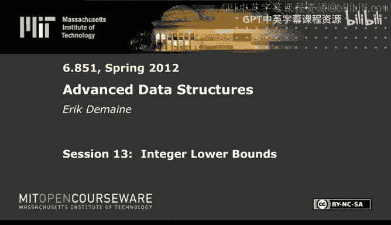
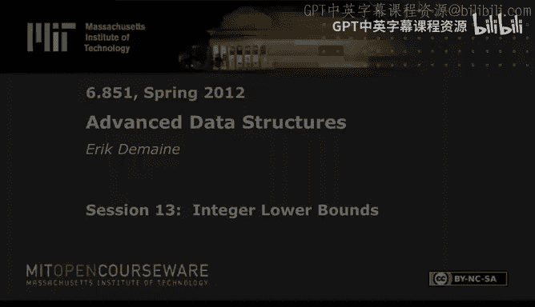
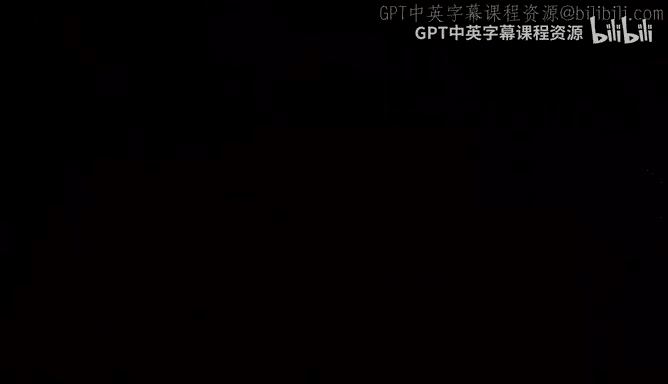

# 《高级数据结构｜6.851 Advanced Data Structures, Spring 2012》中英字幕（deepseek - P13：-13-13. Integer Lower Bounds.zh_en - GPT中英字幕课程资源 - BV1FDFVzdEBA

The following content is provided under a creative Commons license。

 Your support will help M I T Open Coseware continue to offer high quality educational resources for free。

To make a donation or view additional materials from hundreds of MI T courses。

 visit Mi T OpenCourseware at O C W dot M I T dot E Du。

Alright， today is our last lecture on the predecessor problem。 And we've。

 we did two lectures on U bounds， started with Venom debos， X fast， Y fast trees。 and then。

Fussion trees is last class。 This time， we're going to show that those bounds are essentially optimal。

 and we're going to prove this bound。 So we currently have min of log W and log base W of n as an upper bound that was ven devos and fusion trees。

 We're going prove an almost matching lower bound。 There's a log log W factor here。

 And this bound holds for any even a static predecessor data structure with no updates as long as the data structure has polynomial space。

 which if you have any hope of making something dynamic， you definitely want polynomial space。 Now。

 it's known that this log log factor is not real。 if you have essentially linear space or n log n space or something like that。

 But that's much harder to prove。 So this is where we will end our coverage of predecessor。

 but I'm going to start out with an overview of what's known。

And this proving this lower bound is actually pretty cool because at this point。

 especially seeing fusion trees， you might think Bitrix are kind of all about magic and doing crazy things and using these operations in bizarre ways they weren't intended。

 Bitris are necessary as an upper bound tool given our weird historical precedent。

 which is computers are built to do arithmetic。 And why not do bid operations， too。

 And so it's sort of an artifact of computers， as we know them today。 That's why we have the word ra。

 because it's based on C， because it's based on computers that exist now。 So it is。

 and that's legitimate and that that's the computers we have。 we might as well try to use them。

 The lower bounds， on the other hand， are。😊，In some ways。

 more beautiful because they're just about how much information has to go between。Alice and Bob。

 actually， it will be this is the communication complexity perspective of data structures。

 and it's nice。 we will get sort of in some ways， cleaner。

 simpler arguments because in lower band land， you don't have to worry about oh。

 can I use this operation this operation to do。 It's just is there any operation at all to do it And then it's just about information is just about information theory and it's in some ways cleaner。

 And this proof in particular， using technique called round elimination is actually simple。

 and we will see in it the concepts of venom debos and fusion trees again。

 but without having to do any bit trickx to actually make them happen so。If you were。

 if you felt like all these bit tricks are kind of weird， you know。

 what is the real essence of the problem， this in some sense provides an answer。 And it says， well。

 really， those were the right answers。 That's what you should have been getting。

So let me start with the survey。Historical， its more of a historical survey。So， the first bound。

For predecessor problem， first lower bound as by Iai in 1988。And he proved that。For every word size。

There's a problem size。Such that there's an omega square root log n sorry。

 square root log W lower bound。You can compare that with this one。 This is log W over log log W。Now。

 this is a bound that works for all values of N and W， which is more interesting。 here。

 we're saying that if you just want a bound in terms of W。You need at least square root log W。

Actually， the original paper claimed log W， but that's not true in general。 But the。

 the proof actually establishes square root log W。 And this proof is complicated。

 It The first one got the field started。 There's been many papers since then。

 Next one was by Milterson。We've cited a few times。And so this is a few years later。

 Milterson essentially took the same proof， presented it in in a more coherent way and sort of really got to the essence of what the proof was showing and could prove the same bound。

But also。A complementary bound。 because there is a symmetry between word size and problem size。

 which we will see。When we get to the communication complexity perspective。

 which will be right after this survey。It's not completely symmetric。

But Miltersen proved this lower bounded for every problem size。 There is a machine。

 There is a word size where you need omega cube root of log n。 Now。

 we know how to get order square root of log n by taking them in。So this is。You know。

Maching up to the exponent。And we know how to do log W。 if I have N and de Bos。

 So this is matching up to the exponent。 So it's progress。

 but doesn't give a complete picture of W versus N。

And this is the paper that introduced this communication complexity idea that this will be a useful concept for。

Predecess or lower bounds。Then。The following year。There's a bit of a breakthrough。

So here we got the idea of using communication complexity。

 Then Milchson and others had the idea of round elimination。

And so just treat that as a black box for now， we'll explain what it is in a moment。

But they' proved exactly the same result。 But in a clean way using round elimination。

 These proofs are messy。 This proof is pretty simple。And it's， well， the beginning of。

The proof that we will cover。But we're gonna to prove stronger bounds than this。All right。

 let me go to another board next we have。Bemon thick。

This now is about the time when I entered the world of data structures。

 and so this was Bea and F was the state of the art or came out just when I was starting。1999。

And this proved。诶。From all W exists in N。So log W over log log W。

 which is the same thing we're going to prove。Except this only proves it。For certain values of N。

Whereas we're gonna prove it for all values of n where this is smaller than that。Okay。

 so this is a bit more special。Not covering the whole WN trade off。

And then there's a symmetric version。It's going to be a lot of log log ends today。So get ready。啊。

Or log logs in general。 So for every end， there exists a W。

Such that there's an omega root log n over log log n。

 So this is almost matching the min of fusion trees and Ven and debo。

 which is order square root log n。They also proved did a little bit on the upper bound side。

 they found a static data structure。Achieving。呃。I'm just going to cheat new Samaris。

So they achieved the men of these two。So in a certain sense， this is tight。

 This is not exactly what you'd want， because the data structures is achieving the min。

 What you'd like is a lower bound of the min。And it's not quite that。

 It's saying there are there's a particular pair of W and n values where this is optimal。

 There's another pair of n and W values where this is optimal with respect to either one of these parameters。

But there are other value pairs of values of W and N where may or may not be optimal。

 So it's kind of matching， but not quite。The way to say it is that these are the best。

 this is the best pure W bound you could hope for， and this is the best pure N bound that you could hope for。

And it's the best mix of two pure bounds。Okay， then we go back in time a little bit。Which is th。

 there's， there's a funny。Chain here， which is this paper，1995， cites this paper of 1999。

 This paper cites this paper of 1992。Okay， that， that's normal。 This one's a little bit out of order。

 bit of time travel。 So I think this one was in draft for a long time and took a while to finish it。

 But this Zo paper before 1995， is's not cited by this paper。 What's interesting about it。

 is it proves both of these lower bounds。😊，I don't think it proves the upper bounds。So。

 but these were independently discovered by Beaman F in the future of this paper。

 This is actually a Ph D thesis。 So I think it was lost or not known about for a long time。

 but it ends up establishing the same bounds。 And then so the real contribution here was that that those were the best bounds that are purely W and N。

 But still not full story。啊。Okay， next up is。Sen。In 2003。

Which gave a round elimination proof of the same result。

And whereas both the beamment F and the Zhao proof are messy。

This round elimination proof is very slick and clean。

 and this is the proof we're going to cover today。And it's going to prove。

It will imply these pure W and N lower bounds。But it will， in some sense， a stronger set。

 in a stronger way， prove this bound， which is a real min thing。And so we're just off by this log。

 log factor。 Otherwise， we are proving exactly the fusion trees and or the min of fusion trees in Vanomibbus is optimal。

Getting rid of the log log factor is messier。That's the next paper， which is the last。

 it's two papers actually。The final papers in this story。I buy Petraku and Thoror。2006 and 7。

 the two papers。 and they give a tight。诶。N versus W versus space。Trade off。

Think I can fit it on this board。 Let's try。So the men。Of four terms。

The first term is nice log based W of N。Thats our good friend， fusion trees。Next one is。Log。

Roughly log W。So it's roughly venom debo， but it turns out you can do a little better。

 Now I need to define a This。 I'm going to assume here the space is n times2 to the a。Okay。

 that's the notation they use。 It's a little bit。Weird。

 but it makes this bound a little bit easier to state。 So， of course。

 you need linear space to store the data。 This is measuring words。 So the question is。

 how much more than linear space do you have。If you want polylo update， then this better be polylo N。

And so because this is about static data structures。So if you want poly log n。

 then a has to be order log log n。So you can think of a being order log log n。

 or you can think of a being constant if you want linear space。 then this stuff。 I mean。

 this then this is basically log W。Okay。So that's roughly vanon Duvois。Next we get two crazier terms。

Okay， these ones I have， I can't give you intuition for。 I'm afraid。 You see， there's the log W。

 There are again， versions of Vanom debos like things。

 but they're improving by some factors that make you better when a is large。 and in particular。

I mean， they should match this thing at some points。 So when a is order log n。

 that's when you have polynomial space， which would be very difficult to update。

You need polynomial time updates。 but that's what this。

 this static data structure uses polynomial space。And so with polynomial space plug plug n equals log n。

 you end up improving by a log log n factor。 And so this， that's where we。

Or I guess should be a square root in there somewhere。 Now， this is log W over log log W。

 This is the part that diverges a little bit from Ven into bus。

 And this really is achievable if you have polynomial space instead of like N or N poly log。Okay。

 so for static， yes， you can get these log login improvements。 We won't cover them here。 I mean。

 they're small improvements。And we're mostly interested in dynamic。Data structures。

 and for dynamic data structures。These things don't turn out to help。So let me state the consequence。

 which is what I stated a couple classes ago。If you have N poly log n space。

 So if you have poly logarithmic update， which is usually the situation we care about， then。

We get men。Of。Log base W of N。 And I'd like to say log W， but you can actually do slightly better。

Yeah， oh God。 indeed。 I did。 I think I stated this two lectures ago。

 So log W is what we know how to do。 This is a very small improvement。

 Let me state another consequence of this， which is。😊，V and de Boas。Is optimal。For。W。Polyloggan。

Okay that's when it gets log log n performance。 and so you can check in that case。

 this term doesn't buy you anything right that's log W would be order log log n if you're polylo so this disappears and you just get log W。

So that's one thing， fusion trees。Are optimal。4。诶。Log W。Order。Square root log n。Times， log， login。

Okay， so this is saying W is at least2 to the root log n， or actually log n to the root log n。

You want to include that term。So that's a fairly large W。 So for large W。

 fusion trees are optimal for small W N and device is optimal in between。This thing is optimal。

That's that's the reality of it。 It's a little messy， but this is tight， so this is the right answer。

I think most of the time， situations you care about W is probably gonna be small。

 so you should use Vanom debos。 W is really large。 You should use fuion trees in between。

 you could consider this trade off， but。It's not A， It's not much better than Men device， so。

Take that for what it is。 So that's what's known。 As I said， we're going to cover this send proof。

 which will be tight up to this log log factor。And this holds。

 no matter as long as your space is polynomial。So it doesn't assume very much about space。

And it's going to be a lower bound for a slightly easier problem。

If you can prove a lower bound on an easier problem。

 that implies a lower bound on the harder problem。Easier problem is called colored predecessor problem。

And colored predecessor。Each element。Is red。Or blue。I should say blue。Anyway。No team forress of fans。

 I guess。Each fine。 And now a query。Just reports the color。Of the predecessor。

You don't need to report the key value， just whether it is red or blue。So again。

 you've got your universe。 Some of the items are present。

And your query is an arbitrary universe element， and you want a predecessor go this way。

 and this guy is either red or blue and you just want to report which one is it。So this is。

 of course， easier because you could just have a lookup table， a hash table， for example。

 that once you determine the key， you could figure out whether it's red or blue It's a static data structure。

 so don't even you could use perfect hashing， could be totally deterministic once you' set it up。

And so， okay， just reporting the colors， of course， easier than reporting the key。

 One interesting thing about this problem is it's very easy to get a correct answer with probability 50%。

 You flip a coin。Heads is red， tails is blue。And we're gonna， this lower bound， we prove。

 will actually apply to randomized data structures that work with some probability。

 but it has to be probability greater than a half。Of succeeding。Okay。

 and this will be useful because we're gonna take our problem and we're gonna modify a little bit and sort of make it simpler and simpler。

 And it's easier to preserve this colored property than to preserve actual key values。Okay。

 so that's common predecessor。 Now we get to。TheCommunication complexity perspective。So， this is。

Pretty cool。And it brings us to the idea around elimination。So， communication。Okay。

 why don't I tell you the。Generic communication complexity picture。I haveAl and Bob。

 And then I'll tell you how it relates to data structures。 They're both simple。

 but I've got to do something first。So let's say Alice is one。One person。Who knows some value X。

Over here， we have Bob。Who knows。Some value y。The goal。Is to。

 maybe I'll move this a little bit to the left。Their collective goal。 They're trying to cooperate。

Their goal is to compute some function of x and Y。The trouble is only Alice knows X and only Bob knows Y。

 So how did they do it， They have to talk to each other。 Ideally。

 Alice sends Bob X or Bob sends Alice Y。 one of them could compute it， sendend back the answer。

That's one possibility， But maybe X and Y are kind of big。 And you can't just send it in one message。

So， here's the。Restriction。Alice can send messages。With。Less than or equal to little a bits。

 a for Alice。Bob can send messages。呃。With。Lesson are equal to little B， bits B for Bob。

So that's the constrain。 And potentially X is much larger than A And， or Y is much longer than B。

 And so you're going have to spend many messages。And let's restrict to protocols of the form。

 Alice talks to Bob。 Then Bob talks to Alice and back and forth。 So rounds of communication。

 And you want to know how many rounds does it take to compute F of X， Y。 And， of course。

 it depends on F。Okay， that's the totally generic picture。 And there's techniques for。

 which we're gonna use for lower bounds on how long these protocols have to be。

 How does this relate to。Colored predecessor。 And remember， also， there's the model of computation。

 I should mention， cell pro model。Sell pre model， we just count。The number of。In this case。

 because it's a static data structure， we don't really change it。The same memory word。Reads。

We want to know how many words of the data structure do we need to read in order to answer a colored predecessor data structure。

 if we can prove a lower bound on this， of course， it implies lower bound on the word RA or pick your favorite model that works with words。

Trans dichotomous Ram， whatever。Okay， so I want to cast that cell probe picture in terms of this picture。

So here's the idea。 Maybe I'll switch colors。Alice。Is。

I guess what do you want to call it the algorithm？The query algorithm。

Al is the for soul who has to compute the color of a predecessor。And so what's x x is the query。Hey。

 we're used to that。That is the input to the predecessor。 So it's a。It's a single word。

Which is I want to know the predecessor of some value。啊。Bob， the other hand， is the data structure。

That's the static。Thing， or Bob represents the data structure。 Why actually is the data structure。

Okay， I guess， sorry， if I wan to be a little bit more。Prosaic or something。 Bob。

 you can think of as memory。Ill call it RA to be a little more。Space saving。

 So Bob is the memory which you can access in random， random random access。

 And what it knows is the data structure。 I mean， that's what it's storing。 That's all it's storing。

That's why。Now， what are these rounds。They are memory reads。Okay， so what's a。

A is a log of the size of the data structure。Becauseuse that's how many bits you need in order to specify which word you want to read。

So if you have， let's say S words of space， a is going to be log S。Okay， you could make it larger。

 but it doesn't help you。 So we're gonna make it as small as possible because that will let us prove things。

It's fine to let A B log S because this is Bob is not very intelligent， right， P， you just say， look。

 I would like word 5， please and says， here's word 5。 So it's not doing any computation。

 Alice can do lots of computation。 what not， In fact， free computation。 We don't count that。

The question is just， how many things do you have to read from Bob。 Now， in this picture。

 Bob could potentially compute stuff。But we know in， in reality， it won't。

 But lower bounds aren't gonna to use that fact。 but that's why we can set a to just be log S because Bob wouldn't do anything with the extra information。

How big is B， B is just W， because the response to a word read is a word。And， so this is the picture。

Query can probe the data structure， says， give me word。Something， which is only log S bits。

 The response is W bits。 and you go， repeat this process over and over。

 And then somehow Alice has to compute F of X， Y。In this model， Bob doesn't need to know the answer。

 Of course， it's just a single bit。 What is F of X， Y， This is colored predecessor。X is the query。

 Y is the data structure， and F of x Y is what is it red or blue。

 Is the predecessor of x in this data structure and the set represented by this data structure。

 red or blue。 So it's one bit of information。 Alice could then tend to tell the bit to Bob。

 But actually in this model， we just want Alice to know the answer。Okay。

So if you can prove a lower bound on how many rounds of communication you need。

 then you prove a lower bound on the number of memory reads。

Each round corresponds to one word read from memory。Claire。So a very simple idea。But a powerful one。

 as we will see。Cause it lets us talk about。An idea which makes sense when you're thinking about protocols。

 rounds of communication， but does not really make sense from a data structure perspective。Well。

 I mean。Not as much sense。Round elimination is a concept that makes sense for any。啊。

For any communication style protocol， Okay， not just the red one， but the generic white picture。So。

 here's what。I need to define a little bit before I can get to the claim。This will。

 this will seem weird and arbitrary for a little while until I draw the red picture。

 which is what it corresponds to in the predecessor problem。Okay， but just bear with me for a minute。

 Imagine this weird variation on whatever problem you're starting with。So we have some problem F。

 which happens to be color predecessor。 We're going to make a new version of that problem called F to the K。

And here is the setup。It's gonna be a little different from this。And kind of fits the same framework。

 But now Alice has K inputs。X1。X 2。Up to X， K。Bob。Has。Why as before。And。It has an integer。Aye。

Which is between1 and k。Also。This is a technicality because we'll need it for colored predecessor。

We won't see that for a few minutes， but。Bob happens to know。All the excs。Up to X -1。Okay。

And the goal。Is to compute。F。Of X， I， comma Y。Maybe I should。Draw a picture。This。We have Alice。

Alice has。啊。X1。Up to。X k。Bob。Has y and I。Same communication setup and the goal。To compute F of X， I。

 comma Y。before it was x comma Y。And now we're saying， well， actually， x consists of these K parts。

 We really just care about the I part。 So this function does not depend on any other of the X Js。

 just X I。So naturally， Alice should just communicate to Bob about X I。 troubleuble is。

 Alice doesn't know what I is。 Only Bob knows what I is。

So if you think about a communication protocol or initially， Alice sends a message。

 then Bob responds。That first message that Alice sends is probably useless。I mean。

 probably the first question is， what's I。 That has no information。

 It's just every time in the beginning And you say what's I。 Then Bob says， here's I。 And then Al。

 And then after that one round， Alice can， you know， just just think about X I from then on。Okay。

I wanna one message may seem like nothing， but。It's like every time you put a penny in the jar。

 after you do that enough times， you have a lot of money。 So one message may seem like very few。

 but we just need to prove a lower bound of like log W over log log W messages。

 So you do this a few times。 eventually， you'll get rid of all the messages。Now。

 if we get rid of all the messages。 It may seem crazy。

 but it turns out you can iterate this process of， of eliminating that first message。

 If we get rid of all the messages， the best we could hope for is an algorithm that is correct with 50% probability。

 if you， if Alice can do nothing， and then the best Alice could do is flip a coin。😊。

So we will get a contradiction if we get a zero message protocol that wins with more than 50% probability。

That's what we're gonna to try to do。But what does it mean to eliminate this first message。

Let me formalize the round elimination Le a little bit。Over here。So。呃。Here's the round elimination。

 Lemma。Again， works for any function F。So if there's a protocol。For this F to the K problem。

 and Alice speaks first。Then that first message is going to be roughly useless。啊。

So let's suppose it has error probability。Delta， so there's some probability。

 it gives the wrong answer。And let's suppose。That it uses M。Messages。Then。There exists a protocol。

For F。Where Bob speaks first。嗯。The error probability goes up slightly。And it uses one fewer message。

Okay， ultimately， we care about rounds， which are pairs of messages， but。

We're going to count messages and then， of course， divide by two， you get rounds。

So the idea is you can eliminate that first message is that Alice sent。

The difference is before you are solving this F to the K problem。If you start with Bob， then。

 of course， you know what I is。 And so then your problem just reduces to computing this F on X I comma Y。

 So you don't get a protocol for F to the K anymore， but you get a protocol for F。So we're gonna。

 and we're gonna iterate this process and eventually eliminate all the messages。 That's the plan。

Let me give you some intuition for why this lemma is true。It's a little messy for us to prove。

 I'm not gonna give a proof here。If there's time at the end， I'll give a little bit more of a proof。

 but it will still use some information theory that we will not prove。

And some communication complexityy， which we won't prove。

 because it's a little bit involved to prove this。 But once you have this lemma。

 this lower bound is actually quite easy and intuitive and nice。So， that's。

Where I want to get to today。But let's start with some intuition why this should be true。

Why there's this extra error term。Yeah， question。ItDoes doesn't matter who reports the answer or it。

There seems to be symmetry there right， Does it matter who has the answer， Alice or Bob。

 Let's just say you're done when anyone knows the answer， either Alice or Bob。 I think， I mean， yeah。

 that would be cleaner。 Otherwise you'd have to send a message at the end to then tell it to Alice or something。

 So let's make it symmetric by saying either Alice or Bob knows it。 Then the protocol can end。

Good question。That way， we won't pay for an additive one every time we only pay for it at the end。

Other questions。Alright， so there's this， there's an issue here。 right， said， oh。

 Alice's message is probably useless。 but maybe Alice gets lucky and sends X I。

 Then that message is useful。What's the chance that AllNs X I。Well， one out of K。

So something going on there。 Alice doesn't just have to send an entire X J， though。啊。

Alice could send some mix of these guys。Maybe it send the X or of all the XJs。

 or it could be anything。嗯。But there's a limit， right。

 There's only a bits being sent from Alice to Bob。So the idea is。

 if the total number of bits here is much bigger than a。

Then very few of the bits that you send are going to be about a particular element X I。You know。

 in expectation。 So this is a probabilistic thing。呃嗯。So the， just imagine this。For the moment。

Basically， because we're in lower bound world， we get to essentially set up the input however we want。

 And so in particular， we're going to prove a lower bound that in expectation。

 So we're gonna have a probability distribution of。Data structure or not data structures。

 but of sets of values that are in the set。And the claim is that in expectation。

 any data structure must do at least log W over log log W Min with。Log based W of N。

Quries on that in expectation。 So we get to assume that the input is random。

But we'll see why in a bit。So in this world， we can assume that I has chosen uniformly at random。

And given that assumption。You would expect。呃。Exactly， A over K bits。区别。About。Xi。

That would be the best you could hope to do。 sort of you have a bits。

 you spread them out evenly talk about all the X's that you can。

 So you get to communicate a little bit of information about the particular Xi that you that Bob will care about。

 You don't know which one that is。 So you have to communicate about all of them。

 So it's gonna to be a over K in expectation。So here's the idea。we， we want to remove that message。

 So Alice can't communicate those A over K bits。 So what's Bob gonna do， Bob is going to guess them。

By flipping coins。So guess them uniformly。Randomly。A over K bits。What's the probability？

That Bob is right。Well。It's going to be like 1 over2 to the A over K。Seems not so big， but if K。

Hows it go， if K is much larger than a。Then this is actually a good thing。 So let me。

So this was the probability of being correct。So the probability of being right or sorry。

 of being incorrect。It's going to be 1 minus that。And we're interested in we had some probability Delta failing before。

 And now there's this new way that we can fail。 So we I'm using a union bound here saying， well。

 we could fail the old way or the failed the new way。 Maybe they're correlated。 Maybe not。

 But the worst cases is at most the sum of the two errors。 So the increase in error is at most。

1 minus this thing。Now， this one minus1 over something to the power， something。

 if this something is large。There's this fun fact， 1 minus1 over e to the x is approximately x。Okay。

 so this is going to be approximately。A over K。If K is large enough。So this is for large xs。Right。

 small X， sorry。Thank you。K is large， and so a over K is small。Very close to zero。嗯嗯。Thank you。

So if this were true。Then the error increase would be order A over K。 I mean， there's E versus 2。

 So there's a constant factor I'm losing there。It's it's not quite that good。

 So this is only intuition。 The real bound has a square root here， and it's necessary。

 And I don't have a great intuition why it's square root iss just a little bit worse than this intuition。

I mean， the main issue is。What does it mean for bits to be about something？

 And can you really just guess those bits， Actually。

 you have to guess the message that Bob sends it's a little bit more than just the bits that sorry that Alice sent。

 So you lose a little bit more， but it won't make a huge difference to us。 of a square root。Alright。

 so that's some rough intuition for round elimination。 Let's see why it is so cool。😊。

To have round elimination。How it lets us prove。A pretty strong lower bound on predecessor。

On colored predecessor in the cell probe model。Okay， okay， Mr。Claim somewhere here。

This is the lower bound we're going to prove。And it's nice and symmetric。 Lob A of W， logb， B of N。

 This is kind of perfectly symmetric in All and Bob。Right， Alice。I guess you could。 well。

 I which one represents and apparently， Alice represents W。

It's Alice's got A bits to communicate with to Bob。And somehow it wants to， I mean， the input。

 I guess， is of size W， right， That's the query。Bob， on the other hand， knows all the data。 So it's。

 in some sense， represents the N side。 It's able to communicate with B bits of information。

 So log base， B of N， somehow enough to communicate N。 I don't。It's not a great intuition for this。

 but at least it's nice and symmetric。 Now， let's work out what it actually corresponds to。

this is a bound for。This is a lower bound on colored predecessor。So， for any。Colored。Even static。

Colored predecessor。Data structure。Static。Can be randomized。

And this will be a lower bound on the expected performance。Okay。

 so what this implies for polynomial space， which is kind of the。

The case we care about for polynomial space data structure， A is going to be。Order log n。Okay。

 in fact， we only need A to B polyloin。For what I'm about to say to be true。So then this becomes min。

Bg。I went in。I guess。It's not what I wrote over there。 I don't even remember。I wrote log， log W。

I guess I'm going to write log log in。The right answer。Okay。Fine， so we get。A， I mean， B is just W。

 So that's a log based W of N。 That's just fusion trees。This one ideally， would be log W。

 but we're off by this log log factor if a is log n。Okay。

 that's the best we'll be able to prove today。So this is slightly less beautifulcause it's both W and N。

 But， you know， so was this one。And this is not the true answer。 The true answer has no log log。

 Okay， but that's what we get from this nice symmetric bound。For polynomial space。

You can also use this to prove。The beam thick lower bounds， which I have by now erased。

Which are the pure the for all n there exists a W for all W， there exists in n。

And don I briefly cover that。So。Again， let's assume that a is order log n with polynomial space。Then。

 the lower bound。Will be largest。Wen。The two terms in the min are equal。So。u。Log。

Base a of W equals log， base B of n。That's these two guys。So this is log W over A is order log n。

 so this is going to be order log log n。And I want this to be equal。To log n over log W。

So we can cross multiply， get log squared W。Equals log n。Log again。And so log W。

Its equal to square root。Login。I I go again。And。Let's see。 You can also take logs。

 And from this conclude。That log， log W。Equals。Log， log in。

Right this two I'm throwing away constant factors。 And when I say equal here， I mean。

 up to constant factors for throughout this half board。Okay， so you take logs。

 you get two log log W on the left hand side over here。 you get log log n plus log log log n。

 So it's dominated by log log n。 So in this scenario where these two things are roughly equal。

 get log log W roughly equal to log log n。And so from this bound or from this equality。

 we should get the old beam thick bounds， which let me。Write them again。So they are。I mean。

 we want to compute what was this bound。 withve loggged W divided by log。A。

 we log W divided by log log M。So log W by， by log log n。 But log log n now is log log W。

 So this is going to be log W over log log W。Which was one of the。Being thick bound。 So for all。W。

 there exist N， such that omega。This thing holds。Okay， on the other hand。

 we have log n divided by log。W。Log W is now square root of log n log log n。So this is log n。

About it by square root of login。Log， log n。So the square root log n cancels with this。

 We end up with skirt of log n on the top。And we keep the square of log log n on the bottom。

And so we get the other beam thick bound。Being thick， J bound for all and there exists a W。

 such that omega this holds。And when you just need existence。

 then we get to choose the relationship between N and W however we want。

 So you don't have to believe me that its largest when they're equal happens to be true， but。We just。

 the point is， there is a choice of W and N namely this choice。 log W equals root log n， log log n。

 where you get a lower bound of this。And there's another choice for N versus W， where this happens。

Okay， so this implies the beam beam thick Zhao bounds， but I kind of prefer this form。

cause it's clear up to this log log n factor。 we understand the complete tradeoff between W and N。

 assuming polynomial space。Okay， so we're gonna prove this bound。Whichimp all this stuff。

Using round elimination Lamma。So，roving。This claim here。Omega mean log base A of W， log base， B of N。

For any colored predecess or data structure。So let's suppose you have a colored predecessor data structure。

And it can answer queries in T cell probes。W which in the communication complexity perspective。

 that's rounds of communication。Or colored。Predecessor。Our goal。Is to do T round eliminations。Okay。

S discrepancy in terminology here around elimination Lamma is really about eliminating one message。

 which is half around。 But you do it twice。 Youll eliminate around。

And so we need to do two T calls to this lemma。 We will eliminate all messages。

 Then there's  zero communication， then the。呃。The best you could hope to do is by flipping a coin。

Maybe you're worse than that。 but the error has to be at least probability of error has to be at least a half。

So we'll either get a contradiction or we're going to set things up to the errors at most a third。

And therefore， this will prove that T has to be large。So you couldn't eliminate all the messages。

 Anyway， we'll see that in a moment。So we're gonna， we have a setup like this。And there's。

 in our case， there's an with， you know， this picture， there's an asymmetry between Alice and Bob。

 I mean， yeah， the picture is nice and clean。 But we， in reality。

 this has to represent a colored predecessor problem。 So in reality。

 Bob is a data structure and is not very smart。 just， just does random access。 Alice。We don't know。

 and it could be very smart。And it just has Alice just has a single word。

So there's an asymmetry between Alice and Bob。 So when we eliminate a message from Alice to Bob。

 it's gonna be different from eliminating message from Bob to Alice。 This F to the K thing。

Here is gonna have to be different。When we're doing an Alice to Bob message versus doing a Bob to Alice message。

And what's， and that's where we're going get them in。When we go from Alice to Bob。

 we're gonna be essentially contributing to this term。

 When we go Bob to Alice we're gonna be contributing to this term， I think， almost or the reverse。

We'll find out in a second。So let's do first Alice to Bob。

Because that's the first type of message we need to eliminate。

So let's suppose as we eliminate things。W and N are going to decrease。So I'm going to suppose。

At this point。Alice's input。Has W prime bits left。Initially W prime is W。

 but I want to do the generic case， so I don't have to repeat anything。here's the concept。Remember。

 we， we're provingrov a lower bound。 We get to set up the set of elements， however we want。

We're going to define a distribution on the set of elements。And we're going to do that by。呃。

Breaking this input。W prime bits。Into a lot of pieces。Okay， Alice is input。 you think of as x。

I don't necessarily want to call it X， I'm not sure we can call it X。It is。

What I'd like to do is break that input into chunks。 X1 up to X， K。

 This is basically what round illlimination tells me I should do。

 If I want to view my problem as an F to the K problem。 somehowhow， my input is not just one thing。

 It's K things。 Well， in reality， the input is a single word。

 So I'm going to have to split it into sub words In the usual way。Right。

 Van Under debos would split it in half。We're going split it into more pieces because we need to guarantee that this error is small。

 We need K to be large for this error to be small。Okay， I claim this is the good choice of K。

And so now this is， you know， this is X 1。 This is X 2。This is X， K。 These。

 the low order bits are X K， The high order bits are X1， or the reverse doesn't actually matter。Okay。

So why is this a good choice of K， Because if we then look at。The error increase we get from here。

A increase is square root of a divided by k。So， error。Increase。Which is order A over K。

Is going be K is now this。 So the A' is cancel。And we get- oh sorry， square root of a over k。

A over K is the wrong analysis。 square root of a over K is the correct bound。 Still the A's cancel。

 So K has an a factor。And so we get order square root of1 over t squared。Also known as one over T。

This is good。 And I get， there's a constant here。 And if I tune all these， this constant， correct。

 I can make this constant less than a third。And so if I start with a protocol。

 let's say that's completely correct。 You don't have to。

 You can start with one that's correct with at least probability  three quarters or something。

 Well let's just say for simplicity， the initial data structure is completely correct。

 If every time I do an elimination。Of a message， I guess I should set it to be 1，6 times 1 over T。

 And I do this two times T times。In the end， the error will be only one third。

 so I'll be correct with two/ third probability。Okay， so it doesn't never mind the constants。 I。

 I can set this constant right。 So this is some epsilon times1 over T。

 So after I do this two T times， I end up with an error that's only epsilon or two epsilon or whatever。

So that would be a contradiction。 So that's why this is a good choice。

 I'm basically balancing the error I get from every message elimination。

 I want them all to be order  one over T。 So it's nice and balanced。

 That will give me the best lower bound。 it turns out。Okay， but what does this mean， I mean， somehow。

You know， I have， I have to have an F to the K problem。Meaning， really。

 I should only care about one X I。Here that all the interesting stuff is these bits。

 But Alice doesn't know which is I。 Only Bob knows which is I。 What does that mean。

 Bob knows the set of elements in the data structure。So basically， the set of elements might。

 maybe they all differ in these bits， or maybe they all differ in these bits or these bits or these bits。

 but only one of these。So that's a distribution of inputs。Okay。

 there's one class of inputs where they all differ in the X 1 part。

 but then they're identical for the rest。There's another。For each XI。

 there's a set of inputs where they all differ in the Xs and nowhere else， let's say。

But Alice doesn't know which setting she's in。Alice just knows X。

And so Alice is kind of in troublecause you can only send a few bits。

 You can only send a bits out of this thing。 so you can't communicate very much。Let's go。

I went to race。Yeah， over here。I need the bound。 Don't need the corner there。

So let me draw a picture for Alice。Or for what the data looks like。So there's some initial segment。

Just shared by all elements。Then they all differ in this middle chunk。And then they all have。

 I don't really care what they have after that。So these are the elements in the data structure。

And I've， this is our usual picture of a binary tree， except it didn't drop binary。

 I drew it with some branching factor so that the height of this tree。Is theta A T squared。

So I set the base of my。Of my representation so that you branch whatever W divided by A T squared here。

 That's my branching factor。So。Cool， that's my picture。 And this。Is is depth I。

So Bob knows this picture。 Bob knows what all the elements are， so we can build this picture。

 or whatever。 Bob knows where， which is the relevant depth that they differ。 But in the lower bound。

 we're going to say a is chosen uniformly at random。 So Alice has no idea。Which bits to send。

 And so probably， you know， Alice is gonna say， oh， you know。Here's you know， I know these bits。

 But Bob already knew those bits of Bob learned nothing。

 And so that's why you can eliminate the round。 That's the intuition。 Anyway。 The proof is， well。

 you just apply round elimination。You see that the problem now becomes to compute predecessor on this node。

 just like infusion trees at every step of the way。

 the hard part was to compute predecessor at the node。Here， by， I mean。

 if Bob is allowed to do computation， then really， Alice just needs to say what are， you know。

 what are the things here or together， Alice and Bob somehow have to figure out what is the predecessor at this note of X I。

Which way the query goes， which could be in between one of these， that is X I。

The rest of the of the Xj is don't matter。 Only Xi matters。

And so the problem reduces the computing predecessor here。

 And that matches the definition of F to the K。 So we have successfully set up an f to the K problem。

 The only thing you need to do to solve the overall predecessor problem is to find your predecessor in the node because there's only one element within each subt。

 That's enough to figure out your overall predecessor。Okay， if you could make， yeah。Frank。Okay。

Tempth I， A squared。嗯。I guess you can think of this as why。That's the part。That Bob knows these are。

 in some sense， x1 up to x K -1。And this is why we had to say over here that Bob already knew X1 up to X I -1。

Cause it Bob already knows that the shared prefix among all the items。So sorry， not K -1。 I -1。

And so all the content is here in this node， which is y。

 And so it reduces to a regular predecessor problem。

 which is what F will always denote color predecessor of X I comma Y。Cool。Okay， what happens here。

In terms of N and W， we have a smaller problem here。 right， We threw away all this stuff。

What got reduced is our word size。For here， we started with something of size W prime。

And now we end up with something of this size， which was W prime divided by A T squared。Up to theta。

Okay， so this reduction。Reduces。this round elimination reduces w prime to W prime divided by A squared theta that。

Okay I think that's all I need to say at this point。

The claim is that this picture is kind of like Vanom de Bois。And in the following sense， Venon de Bo。

Is essentially binary searching on which level matters， right， it goes too low。 Things are empty。

 It goes too high。 There's too many items。 So it's binary searching for that critical point where you basically。

 you have a predecessor and you have a node and nothing else。And that's why I took log W。So here。

 one level matters。And the goal is to figure out which one。 And it's not exactly binary search here。

 We're losing a larger factor。 A T squared at each step。 So we're not reducing W to W over 2。

 like we did with van devo。 But， and this is why we're losing a little bit。

 We reduce by a factor of8 squared。So it's kind of like the venom de Bos opera bound。

 But here we're setting up a lower bound picture so that， you know。

 this is still an arbitrary predecessor problem。 But figuring out which level matters that's tricky。

 And you really can't do much better than than Venom de Bos style binary search。 Okay。

 maybe you can do A squared way binary search instead of binary search， but。Okay。

So that was eliminating a message from Alice to Bob。

 Eliliminating a message from Bob to Alice is gonna look like fusion trees。That's the cool thing。

So let's do that。Next page。Okay。Let's suppose。So this is gonna get slightly confusing notationally because you have to reverse A And B。

 the picture I set up。Over here。 and for the round elimination， Lamma F to the K。

And around elimination， Lamma are all phrased in terms of eliminating the Alice to Bob message。

 You've got to invert everything。 So we're gonna get square root of B over K error。

If I don't relabel things， so you can restate this， if Bob speaks first and then Alice speaks next。

 you get square root of B over K error。 the F to the K problem is now that Bob has K inputs。

 maybe call them Y1 to Y K。 Alice has an input X and the integer I。 So now Alice。

 the queryier knows what I is， but Bob doesn't。 The data structure doesn't know it。Okay。

 so it just reversed everything。 So let me state it。Over here， Bob。Has the input。Now， in general。

 what Bob knows is a bunch of integers， and integers in general。

 N prime integers because n is also going to increase。And。Let's say each of them is W prime bits。

That's what Bob knows， that's why。Okay， so what do we have to do to phrase an F to the K problem。

 Well， just like this， we've got to break that input into B， T squared equal sized chunks。

So let's just think about what that means。So that's going to be y1。Up to y。Okay。

Okay is theta B T squared。 Again， we want B T squared because then you plug it into this root B over K formula and you get。

That the error increase。Is order 1 over t？Which is what we need to do T round eliminations。So now。

 before our input was a single word， Now our input is a whole bunch of integers。

 So it's natural to split it up into different integers。Okay。啊。Here's how I'm going to do that。

Goll just draw the picture。So this was the Alice to Bob。Elimination。I will do the bob。To P。是。

So what I'd like to do is split up all the inputs。 What's the natural way to do that， Well， have。

A tree at the top。Let's just make it a binary tree。

 so I'm drawing the usual picture I draw when I draw a bunch of elements。嗯。And。Fine。

 then there's some elements left over in each of these subtes。Each of these is a predecessor problem。

Okay， I'm just I'm constraining the inputs。To sort of differ a lot in the beginning in the early bits。

 the most significant bits。 This is the most significant at next most significant so on bits。

 I want the number of leaves here。To be theta B T squared。Orre not leaves。

 but a number of intermediate nodes here。And therefore， there are theta B， T squared subrees。Each。

 and I want to set up the N items to be uniformly distributed。 So each of these has n divided by B。

 T squared。Items。Okay， so we used a few bits up top here。How many bits was this， Just log。Of B。

 T squared。 So if you look at one of these sub problems， we have reduced W slightly。

 but only by this additive amount。Okay wont basically won't matter。

 The big thing we change is we used to have n items to search among。 or this is n prime， I guess。

 now we have N divided by B T squared items。 So we reduced n substantially。

And this is what fusion trees do， right， They look at the root first and say， okay， look。

 I can distinguish， W to the epsilon different things in constant time。 Okay， here。

 it's not w to the epsilon， but it's B it's B T squared。

 And we haven't figured out what B and T are yet。 So， I mean， B is W。 So that's close to W factor。

 a W fold search。 And then you determine am I in this sub or this sub or this sub。

 This is exactly what fusion trees do。Okay， but we're setting up a lower bound instance where that is the right thing to do。

 where you have to know which， what the early bits are before you can figure out which subte you're in。

Okay， now reverse rolls。Alice knows what these bits are。The data structure of relevance。

 let's suppose you fit here because you are011 in the beginning。 this is our YI problem。

Alice knows what I is。 Alice knows what those leading bits are。 Bob doesn't。And Bob speaking first。

 So Bob could try to summarize this entire data structure， but there's basically no hope， right。

 Bob needs to know what are those early bits。 So the first message from Bob is going be useless。

 Alice can then send the bits， and then you can restrict your problem to a regular predecessor problem in here。

 So you' eliminated this sort of root node， your entire problem is a predecessor problem in here。

 So again， we have an f to the K style problem。 We reduce to a predecessor problem on a smaller。

 In this case， Y and X are reversed。 But we end up with a smaller problem。

 mainly in the fact that and got smaller。Let me go back。To this board。What happens is that we reduce。

N prime to N prime divided by。呃。B T squared。care。😔，There's a theta。We also reduced W prime。

W prime becomes W prime minus log B T squared。Okay， but in particular。

 this is going to be at least W prime over 2。Most of the time till the very end。 And over here。

 we're reducing W primeed by a big factor， something bigger than a constant。

 So we don't really care about losing a factor of  two because we alternate between these。

 And so factor of 2， you know， it just falls into the theta。

So it's gonna be at least that as long as， you know， W prime is， I don't know， at least log。

I wanna say here。Log W would be enough。啊。This is log W。 T squared is going to be at most log W。

 So it's。This is gonna be log W plus log log W。 Lo log W goes away。 Okay， you know what is T。

 whole point is to prove a lower bound on T， But we know from an upper bound perspective。

 T is at most log W because phom debo exists。 So we're never gonna prove a lower bound bigger than log W。

 So whatever T is gonna be， is it most log W。 So this is just log W。So you're fine。Okay。

 but at some point we， we we have to stop。 Okay， we start with some W and N。

N prime is racing down at this rate。 W prime is racing down at this rate。

When W prime gets down to log W， then we're in trouble。 if n prime gets down to。2，1，0。

 one of those constants。 When N prime gets down to a constant， we're in trouble。

 you can no longer evenly divide things。Okay， so when does that happen。

 That's when this is where we're going to get a lower bound。 so I guess we can go back over here。

We have to。呃。So if you do a round elimination。You decrease W prime by this factor。

 and you decrease n prime by this factor。 Do both of these in sequence。 then you repeat it。So。

 we have to stop。When。W prime。It's s W。Or。When N prime。Hits2， let's say。

This is not really gonna make a difference。 You can also think of that as two。呃。So in fact。

 I'll just do that。Just to clean up， clean the arithmetic a little bit。Fine。Now。

 if we succeed in eliminating all the messages， we get a contradiction because we set up our errors to add up to only one third。

And we know that the error has to be at least one half if you eliminate all the messages。

 which means we didn't eliminate all the messages。Now， we will not eliminate the。

 all the messages if T is large。So when， when would we eliminate all the messages。

 Let's compute that， And then T has to be at least that big。T has to be。

 at least the point has to be greater than the point at which we would eliminate all the messages。

 Otherwise we get a contradiction。So。This is where we get a min。

 is kind of cool because we have to stop when W prime gets too small or when N prime gets too small。

 whichever happens first。😊，And so it's gonna be a min。Of the thing relating to W。

Which is going to be log base A T squared of W， because we're reducing W by factor of A squared each step。

 So that's when it's going to bottom out。And then there's the thing for N。

 which is log based B T squared。A then。That's when n will bottom out because we're reducing by a factor Bt squared each step。

Okay， so。That's the bound we get。Now。It doesn't look quite like the bound that we want。

 which is this very simple log base A of W， logb B of N。

 But I claim that it's basically the same thing。Why。Cheat here。 speed things up a little bit。

 I claim that A T squared。Is order a cubed。Why。Because a is at least log n。 Remember。

 a is log of space。 It's gotta have。 you， you have to be able to。 you have to store the data。

 So you need at least n words of space。A is log of that。 So it's got to be at least log n。

 And furthermore， T。Is it most login？Why， because there is a predecessor data structure that runs in log n time per operation。

 namely balanced binary search trees。 Okay， there's a theta order。 big O。 Okay。

 but A T squared is at most a cubed。Okay， on the other hand。This thing。B， T squared。Is order B cubed。

Why， because T。诶。Is order。Log W， B is W。 That's definition of B。

T is order log W because Vanom Nebo exists。 And so this is actually at most W times log squared W。

 But in particular， it's most W cubed。Okay，Because and that we don't care about that constant。

 because it's in a log。 So it just comes out as a factor of a third or whatever。

 And so this is the same thing。As log base A of W。Log base B of N， mint。

And that's the nice symmetric bound that you get at of random thelimination。 Pretty cool。Now。

 if you look in the notes， I'll just mention this briefly。

 There's a couple more pages that give you a little bit of flavor of what the round elimination and that。

 and that vague proof sketch， which gave the wrong answer by a square root， really means。You know。

 we said， oh。Alice can only communicate， in some sense， A over K bits about X I。

And you can formalize that by talking about distributions of inputs and saying talking about the expected amount of entropy。

That of。Of X I communicated by that first message。And so there's。

 it's very simple definitions of entropy and shared information。

 But just in terms of probabilistic quantities。 and at least gives you a sense of how you might prove something like this。

 Where talking about information about something is kind of vague， talking about entropy。

 which is about， you know， some of probabilities times log of probabilities。

 is a clean probabilistic notion。 So it becomes a purely probabilistic statement。

And about error probabilities。 And that's how you argue this。

 But even these notes do not give a proof。 They just give a hint of how you formalize what this means or how that。

 what the proof sketch means。And then you have to do its several pages to actually prove it。

 So a bit beyond this class。 But once you have it， because it's very clean， I'd say。

 kind of beautiful lower bound。 not quite the right answer， but up to log log factors。

 The right answer for predecessor。😊，So and that's the end of predecessor in this class。

