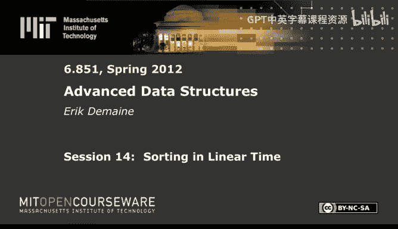
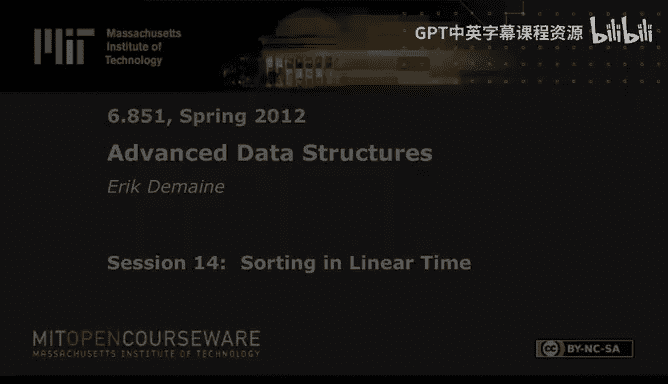

# 高级数据结构：14：线性时间排序





在本节课中，我们将学习如何在线性时间内对整数进行排序，特别是当机器字长（W）较大时。我们将探讨签名排序（Signature Sort）这一核心算法，它结合了哈希、压缩字典树和打包排序等多种技术，最终实现在特定条件下的线性时间排序。

---

## 概述

排序是计算机科学中的基础问题。对于字长为 W 的机器上的 N 个 W 位整数，我们能否实现 O(N) 的排序时间？这是一个重要的开放性问题。本节课将介绍签名排序算法，它在字长 W 至少为 log²⁺ᵉ N 时，可以实现线性时间排序。该算法巧妙地利用了大字长的优势，通过哈希压缩、构建压缩字典树和递归排序等步骤解决问题。

---

## 算法核心思想

签名排序的核心思想是将大整数分解为多个“块”（chunk），然后利用哈希函数将这些块映射到更小的空间，从而减少后续排序的复杂度。接着，算法构建这些哈希值的压缩字典树，并通过递归排序来修正字典树中节点的顺序，最终得到完全排序的序列。

---

## 详细步骤

### 步骤一：分割与哈希

首先，我们将每个 W 位整数分割成 L = logᵉ N 个块。每个块的大小为 W / L 位。由于可能的块值数量（2^(W/L)）远大于实际出现的块值数量（最多 N * L），我们可以使用哈希函数将每个块映射到 O(log N) 位的空间。这样，我们就能将每个块的大小从 W/L 位减少到 O(log N) 位。

**公式**：设块大小为 B = W / L，哈希后块大小为 B' = O(log N)。

### 步骤二：打包排序

哈希之后，我们得到了 N * L 个较小的块（每个块 O(log N) 位）。由于 W 足够大，我们可以将这些小块打包到机器字中，并使用打包排序算法在 O(N) 时间内对它们进行排序。打包排序要求 W ≥ B * log N * log log N，而我们的设置满足这个条件。

**代码示意**：将多个小块打包到一个机器字中。
```
word = (chunk1 << offset1) | (chunk2 << offset2) | ... | (chunkk << offsetk)
```

### 步骤三：构建压缩字典树

接下来，我们利用排序后的哈希块序列构建一个压缩字典树。压缩字典树通过合并非分支节点来减少树的大小，使得节点数量与叶子数量（即整数数量 N）成线性关系。构建压缩字典树可以在 O(N) 时间内完成。

**过渡**：上一节我们介绍了如何通过哈希和打包排序获得有序的哈希块序列。本节中，我们将利用这个序列构建压缩字典树，为后续的排序修正做准备。

### 步骤四：递归排序修正

我们构建的压缩字典树基于哈希值，因此节点的子节点顺序是混乱的。为了得到正确的排序顺序，我们需要对每个节点的子节点按照原始块值（而非哈希值）进行排序。我们通过递归排序来实现这一点：为每个节点生成一个包含节点ID、原始块值和边索引的三元组，然后对这些三元组进行排序。排序后，我们就能得到每个节点子节点的正确排列顺序。

**列表**：以下是递归排序修正的关键步骤：
1.  为字典树的每条边生成一个三元组 (node_id, original_chunk_value, edge_index)。
2.  对这些三元组进行排序，主要依据是 node_id 和 original_chunk_value。
3.  根据排序结果，对每个节点的子节点进行重排。

### 步骤五：中序遍历输出

在修正了压缩字典树中所有节点的子节点顺序后，树的结构就完全正确了。此时，我们只需对树进行一次中序遍历，并输出叶子节点对应的原始整数，即可得到完全排序的序列。

**过渡**：通过递归排序，我们修正了字典树的结构。最后，我们通过简单的中序遍历来输出最终结果。

---

## 算法复杂度分析

签名排序算法的主要步骤（哈希、打包排序、构建字典树、递归排序、中序遍历）都可以在 O(N) 时间内完成。递归的深度是常数级别的（约为 1/ε），因此总时间复杂度保持为 O(N)。该算法需要字长 W 至少为 log^(2+ε) N * log log N 的条件。

**公式**：总时间复杂度 T(N) = O(N)。

---

## 总结

本节课我们一起学习了签名排序算法。该算法通过将整数分块、哈希压缩、构建压缩字典树和递归排序等步骤，在机器字长较大的条件下，实现了对 N 个整数的线性时间排序。签名排序展示了如何利用大字长的并行处理能力和哈希技术来解决复杂的排序问题，是高级数据结构中一个非常精妙的算法。

尽管对于所有字长 W 的线性时间排序仍然是一个开放性问题，但签名排序及其相关技术为我们处理大整数排序提供了强大的工具，并深化了我们对整数数据结构与算法设计的理解。