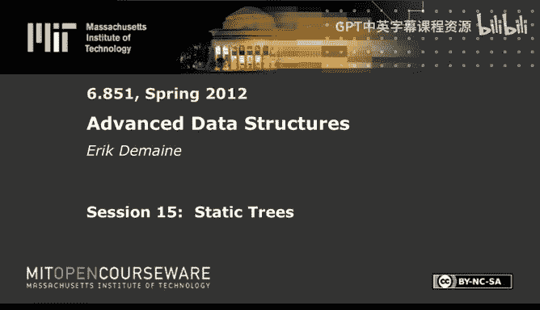
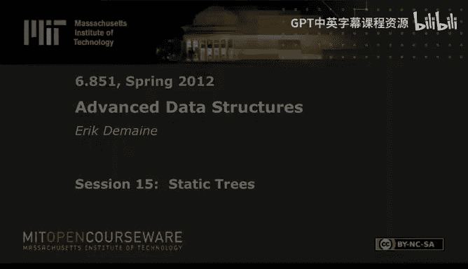

# 《高级数据结构｜6.851 Advanced Data Structures, Spring 2012》中英字幕（deepseek - P15：-15-15. Static Trees.zh_en - GPT中英字幕课程资源 - BV1FDFVzdEBA

The following content is provided under a creative Commons license。

 Your support will help M I T Open Coseware continue to offer high quality educational resources for free。

To make a donation or view additional materials from hundreds of MI T courses。

 visit Mi T OpenCourseware at O C W dot M I T dot E Du。

Alright， today we're going to look at some kind of different data structures for static trees。

 So we have， at least in the second two problems， we have a static tree。

 We want to preprocess it to answer lots of queries。

 and all the queries we're going to support today。 We'll do in constant time for operation。

 which is pretty awesome and linear space。 That's our goal。

 it's going to be hard to achieve these goals。 But in the end。

 we will do it for all three of these problems。 So let me tell you about these problems。

Arangnge minimum queries。You're given an array of numbers。And the kind of query you want to support。

We call RMQ of I J。Is to find the minimum in a range。So we have AI。Up to AJ。

And we want to compute the minimum in that range。 So I and J are the form the query。

I think it's pretty clear what this means。 I give you an interval that I care about。Ij。

I want to know in this range， what's the smallest value and a little more subtle。

 this will come up later。 I don't just want to know the value that's there。

 like say this is the minimum among that shaded region， but I also want to know the index J oh。

 sorry， K between I and J。Of that element， Of course， if I know the index。

 I can also look up the value。 So it's more interesting to know that index。Okay。

 this is a non tree problem， but it will be closely related to a tree problem。Namely LCA。

So LCA problem is you want to pre process。A tree。Say a rooted tree。And the query is。L c a。

Of two nodes。Which I think you know， or I guess I call them x and Y。So it has two nodes。

 x and y in the tree。I want to find their lowest common ancestor， looks something like that。

At the first， at some point， they have shared ancestors， and we want to find that lowest one。

And then another problem we're going to solve is level ancestor， which again。

 pre processs a rooted tree。And the query is。A little different。Given a node and an integer K。

Positive integer。I want to find the。Kith ancestor of that note。She might write parent to the K。

 meaning have a node X。The first ancestor is its parent。Eventually， wanna get to。The Cath ancestor。

 So I want to jump from X to there。So it's like teleporting to a target height above me。Obviously。

 k cannot be larger than the depth of the node。So these are the three problems we're gonna solve today。

 RM Q。LCA and LA。嗯。Using somewhat similar techniques。

 we're gonna use a nice technique called table lookup。

 which is generally useful for a lot of data structures。 We are working in the word Ram。Throughout。

 but that's not as essential as it has been in our past integer data structures。Now。

 the fun thing about these problems is while LC C A and L A look quite similar。I mean。

 they even share two letters out of three。 They're quite different as far as I know。

 you need fairly different techniques to deal with， or as far as anyone knows。

 you need pretty different techniques to deal with both of them。

The original paper that solved level ancestors kind of lamented on this。RM Q， on the other hand。

 turns out to be basically identical to LC CA。So that's the more surprising thing。

 And I want to start with that。Again， our goal is to get constant time linear space for all these problems。

Constant time is easy to get with polynomial space。 You could just store all the answers。

 There's only n squared。Different queries for all these problems。 So quadratic space is easy。

Linear space is the hard part。So let me tell you about a nice reduction。From an array to a tree。

Very simple idea It's called the Cartesian tree。 It goes back to Gabo， Bentley and Tjan 1984。

 it's an old idea， but it comes up now and then and in particular provides the equivalence between RMQ and LCA or one direction of it。

I just take。A minimum element。It's called it AI。Of the array。Let that be the root of my tree。

And then。The left subre。Of tea。Was is going to be。A Cartesian tree。

On all the elements to the left of I。 So a less than I。And then， the right subre。Is gonna be。诶。

Greater than I。So let's do a little example。Suppose we have。8，7，2，8，6。9，4，5。

So the minimum in this rate is2， so it gets promoted to the root。

 which decomposes the problem into two halves。Le half and the right half。 So drawing the tree。

 I put two， maybe over here is actually nicer two at the root。On the left side，7 is the smallest。

 And so it's going to get promoted to be the root。 And so the left side will look like this。

On the right side， the minimum is4。So。4 is the。Right root， which decomposes into left half there。

 the right half there。 So the right thing is just five。Here the minimum is6。

 so we get a nice binary tree on the left here。This is not a binary search tree。 It's a min heap。

Yeah。Cartesian tree is a min heap。But Cartesian trees have a more interesting property。

 which I've kind of alluded to a couple times already。

Which is that LCcas in this tree correspond to RMQs in this array。Okay， so let's do some examples。

 Let's say I do LCC A of 7 and 8。 That's 2。 Anything from the left and the right subt， the LCA is 2。

And indeed， if I take， any interval that spans 2， then the RMQ is2。If I don't span two。

 I'm either in the left or in the right， let's say I'm on the right。

 say I do an LCCA between 9 and 5。 I get four because yeah， RMQ between 9 and 5 is four。Make sense。

 same problem， really。Because。It's all about which mins， I mean， in the sequence of mins。

 which min's do you contain if you contain the first min you contain the highest min you contain。

 that is the answer。And that's what LCA in this tree gives you。So LC。I and J in this tree T。

Equals RMQ。In the original array。Of the corresponding elements。

 So there's a bijection between these items。And so INJ here represents nodes in here corresponding to the corresponding items in A。

Okay， so this says if you wanted to solve RMQ， you can reduce it to an LCA problem。quick note here。

 which is。Yeah， there's a couple different versions of Cartesian trees when you have ties。

 So here I only had one two。 if there was another two。

Then you could either just break ties arbitrarily and you get a binary tree or you could make them all one node。

 which is kind of messier。 And then you get a non binary tree， I think I'll say。

We disambiguate arbitrarily， just pick any men。And then you get a binary tree。

 It won't affect the answer。But I think the original paper might do it a different way。啊。Okay。

Let's see。 So then let me just mention a fun fact about this reduction。

 which is that you can compute it in linear time。This is a fun fact we basically saw last class。

 although in a completely different setting， it's not at all obvious。

But you may recall we had a method last time for building a compressed try in linear time。

 basically the same thing works here， although it seems quite different。The idea is。

 if you want to build this， if you build a cartesian for according to this recursive algorithm。

 you will spend analog log n time or actually maybe even quadratic time。

 if you're computing minute with a linear scan。So don't use that recursive algorithm。

 Just walk through the array left to right one at a time。 So first you insert 8。 Then you insert 7。

 you realize， oh，7 would have would have won。 So you put 7 above 8。Then you insert two， you say。

 oh that's even higher than 7。 so I'll have to put it up here。

 Then you insert 8 so that you'll just go down from there and you put eight as a right trial of two。

Then you insert 6， you say， whoops，6 actually would have gone in between 2 and 8。

And the way you'd see that is。I mean， at that moment， your tree looks something like this。

 You've got two。8， and there's other stuff to the left。 but I don't actually care。

 I just care about the right spine。 say， oh， I'm inserting 6。6 would have been above 8。

 but not above 2。 Therefore， it fits along this edge。 And so I convert this tree。Into。This pattern。

 and it will always look like this。8ight becomes a child of seven， sorry，6。s。Thanks。Not seven。

 seven was on the left。 this is the guy I'm inserting next because here。So， I mean， it doesn't。

 there's no， well， I guess it's a left channel because it's the first one。So we insert6 like this。

 So now the new right spine is26。 and from then on we will always be working to the right of that。

 We'll never be touching any of this left stuff。Okay。

 so how long did it take me to do that in general， I have a right spine of the tree。

 which are all right edges。And I might have to walk up several steps before I discovered whoops。

 this is where the next item belongs， and then I convert it into this new entry。

 which has a left child， which is that stuff， but this stuff becomes irrelevant from then on because now this is the new right spine。

And so if this is a long walk， I charge that to the decrease in the length of the right spine。

 just like that algorithm last time， slightly different notion of right spine。So same amortization。

 you get linear time and you can build a Cartesian tree。

 This is actually where that algorithm comes from。 This one was first belief。Questions。 So this is。

 I mean， It not worrying too much about build time， how long it takes to build these data structures。

 but they can all be built in linear time。 And this is one of the。Cooler algorithms。

 and it's a nice tie into last lecture。So that's a reduction from RMQ to LC。

 So now all of our problems are about trees in some sense， but we， I mean。

 there's a reason I mentioned RMQ not just that it's a handy problem to have solved。

 but we're actually going to use RMQ to solve LC。 So we're going to go back and forth between the two。

A lot。Actually， we spend most of our time in RMQ land。

 So let me tell you about the reverse direction。If you want to reduce。LCA to RMQ。That also works。

And you can kind of see it。In this picture。If I gave you this tree。

 how would you reconstruct this array， Pop quiz。How do I go from here to here？In order traversal。

 yep， just do it in order traversal， write those guys down。 I mean， yeah。Pretty easy。 Now。

 not so easy because in the LC A problem， I don't have numbers in the nodes。

 So if I do an intro or walk and I write stuff， it's like， what should I write for each of the nodes。

Any suggestions？はい。The height， not quite the height， the depth。That will work。So let's。

 let's do it just so。It's clear。Take the same tree。the same tree。Yep， so all right the depths。0，1，1。

2，2，2。3，3。 It's either height or depth and you try them both。 This is depth。So I do an in order walk。

 I get 2，1，0。I can't even read my writing，3，2。3，1，2。

 It's funny doing it in order traversal and something that's not a binary search tree。

 But there it is。 That's the order in which you visit the nodes。And。You stare at it long enough。

 This sequence will behave exactly the same as this sequence。 Of course。

 not in terms of the actual values returned。But if you do the argument version of RM Q。

 you just ask for， what's the index that gives me the min。If you can solve RMQ on this structure。

Then that that argument， RMQ will give exactly the same answers as this structure。Just kind of nifty。

Cause here I had numbers。 They could be all over the place。 Here， I have very clean numbers。

 They will go between 0 and the height of the tree。So in general， at most0 to n minus-1。

 So a fun consequence of this is you get a tool for universe reduction。In RMQ。

 the tree problems don't have this issue because they don't involve numbers。 They involve trees。

And that's why this reduction does this。 But you can start from an arbitrary ordered universe。

And having an RMQ problem on that。And you can convert it to LCA。And then you can convert it to。

A nice， clean。Unniverse RNQ。Just by doing the Cartesian tree and then doing the in order traversal of the depths。

This is kind of nifty because if you look at these algorithms， they only assume a comparison model。

 So these don't have to be numbers。 They just have to be something from a totally ordereded universe that you can compare in constant time。

 You do this reduction。 And now we can assume they are integers， nice small integers。

 and that will let us solve things in constant time using the word Ram。

So you don't need to assume that about the original values。Cool。So time to actually solve something。

 We've done reductions。 We nano RMQ and LCCR are equivalent。 Let's solve them both。

Kind of like the last。The sorting we saw， there's gonna be a lot of steps。

 They're not sequential steps。 These are like different versions of a data structure for solving RMQ。

And they're gonna be getting progressively better and better。So。LC。Relies。I am kia。

This is originally solved by Harold and Tarrgent in 1984， but is rather complicated。

And then what I'm going to talk about is a version from 2000。By Bender and Farch Colton。

 same authors from the Cashle' Beries。That's a much simpler presentation。So。First step。

Is I want to do this reduction again from LCA to RMQ， but slightly differently。

And we're going to get a more restrict problem called plus or minus-1 RMQ。

What is plus or minus1 RMQ just means that you get an array with all adjacent values。Differ。

By plus or minus1。Hey， if you look at the numbers here， a lot of them differ by plus or -1。

These all do。 but then there' are some big gaps like this has a gap of three。 This has a gap of two。

 This is plus or -1。It's almost right。 And if you， if you just stare at this idea of。

 of tree walk enough。You'll realize a little trick to make the array a little bit bigger。But。

Give you plus or -1s。If you've done a lot of tree traveral， this will come quite naturally。

This is a depth first search。This is how the death first search order of visiting a tree in order。

This is usually called an elearian tour。 A concept we'll come back to。In a few lectures。

But order two just means you visit every edge twice。In this case， and so you some。

 if you look at the node visits I'm visiting this node here。Here and here， three times。

But it's amortized constant because every edge is just visited twice。Okay。

 what I'd like to do is follow an Euler tour， and then write down。呃。All the notes that I visit。

But with repetition。So in that picture。I will get。0。1，2，1。 That's I go 0，1，2， back to 1， back to 0。

Then over to the one on the right， then to the two， then to the three， then back up to the two。

 then down to the other three， then back up to the two。

 back up to the one back down to the last node on the right and back up and back up。

This is what we call oyer tour， so with multiple visits， for example。

 here's all the places that the route is visited。Here's。All the places that this node is visited。

Then this node is visited three times。 It's gonna be visited once per incident edge。Okay。

 I think you get the pattern。I'm just going to store this。And what else am I going to do？

Let's see each node。In the tree。Stores。Let's say the first。Visit in the array。

Prety sure this is enough。You could maybe store the last visit as well。

 We can only store a constant number of things。And。I guess each。呃。Array item。

Store is a pointer to the corresponding node in the tree。Okay。

 so each instance of the zero stores appointed to the root and so on。

Its kind of what these horizontal bars are indicating。 But those aren't actually stored。Okay。

 so I claim still RM Q in here is the same as LC C A over there。It's maybe a little more subtle。

But now when if I'm， if I wantan to compute the LC CA of two nodes。I look at their first occurrences。

 so let's do， I don't know， two and three。Here these two， this two and this three。

 And I didn't label them。 So but I happen to know where they are。 Two is here。

 And it's the first three。So now here， they happen to only occur once in the tour。

 So it's a little clear。 but I compute the RMQ。 I get this0， this0， opposed to the other zeros。

 but this  zero points to the root。 So I get the LC C A。

Let's do ones that do not have unique occurrences。 So like this guy and this guy。

 the first one and the first two be this one。And this one。 So in fact。

 I think any of the twos would work doesn't really matter。 to pick one of them。

 So I pick the leftmost one for consistency。 Then I take the RM Q again， I get 0。

 You can test that for all of them。 I think the slightly more subtle cases。

 when one node is an ancestor of another。 So let's do that。 One here and three there。

Here you have to be。 I think here， you do need to be leftmost or right most consistently。

So I take the one and I take the second three。Okay， I take the RM Q of that。 I get one。

 which is the higher of the two。Okay， so seems to work。Actually。

 I think it would work no matter which guy you pick。 I just pick the first one。Okay， no big deal。

 This is， and we're not gonna to see why this is useful for a little bit until step 4 or something。

 but we've slightly simplified our problem to this plus or -1 RM Q。

 otherwise identical to this in order traveral。 So not a big deal， but we'll need it later。Okay。

That was a reduction。 Next， we're finally going actually solve something。 I'm gonna do constant time。

En log n space。RMQ。This data structure will not require plus or minus1 RMQ， it works for any RMQ。

It's actually a very simple idea。 And it's almost what we need。

 But we're going to have to get rid of this log factor。 That will be step 3。Okay， so here's the idea。

 you've got an array。And now someone gives you an arbitrary interval from here。So， here。idealally。

 I just store the mins for every possible interval， But there's n squared intervals。 So instead。

 what I'm gonna do。Is store the answer not for all the intervals， but for all intervals of length。

 the power of two。Trick you've probably seen before。This is the easy thing to do。

 and then the interesting thing is how you make it actually get down a linear space。呃。Length。

Power of two。Okay， there are only log n possible powers of two。

 There's still n different start points for those intervals。 So total number of intervals is n log n。

 So this is n log n space because I'm storing one I'm sting an index for each of them。Okay。

 and then if I have an arbitrary query， the point， let's call it length K。Then I can cover it。

By two intervals。Of length， a power of  two。 It will be the same length。

They will be length2 to the floor of log K。 The next smaller power of 2 below K。

 maybe k is a power of  two， in which case is's just one interval or two equal intervals。

But in general， you just take the next smaller power of two that will cover more than half of the thing of the interval。

 And so you have one that's left aligned， one that's right aligned together。

 those will cover everything。 And because the min operation has this nifty feature that you can take the min of all these。

 the min of all these take the min of the two， you will get them in overall。

It doesn't hurt to have duplicate entries。 That's kind of important。Property of men。

It holds for other properties， too， like Max。But not everything。 Then boom， we've solved arm Q。 Okay。

 I think this's clear。 You do two queries， take the min of the two。 Actually。

 you have to restore the arguments。 So it's a little more work。 but constant time。Cool。

 that was easy。Weeave LC up there。Okay， so we're almost there， right， Just a log factor off。

So what technique do we have for shaving log factors。Indirection， Yeah， our good friend indirection。

Indirection comes to our rescue yet again， but we won't be done。The idea is， well。

 we want to remove a log factor before we remove log factors from time。

 But there's no real time here， right， Everything's constant time。

 But we can use indirect to shave a log factor in space， too。Let's just divide。So this is， again。

 for。RMQ。So I have an array。 I'm going divide the array into groups。Of size。I believe half log n。

It be the right magic number。 It's gonna be theta log n， but I need a specific constant for step 4。

So what does that mean。I have the first half login entries。In the array。

 then I have the next half log entries。And then I have the last half log n entries。Okay。

 that's easy enough。啊。But now I'd like to tie all of these structures together。

 A natural way to do that is with a big structure on top。Of size。 and over log n。

I guess with a factor two out here。And over half login。How do I do that？ Well。

 this is an RMQ problem。 So a natural thing to do is just take the min of everything here。

So the red here is going to denote taking them in。And take that the one item that results by taking them in in that group and promoting it to the next level。

 This is a static thing we do ahead of time。Now if I'm given a query， like say this interval。

What I need to do is first compute the min in this range within a bottom structure。

Maybe also compute them in within this range， the last bottom structure。

 And then these guys are all taken in entirety。 So I can just take the corresponding interval up here。

Take， and that will give me simultaneously the mins of everything below。 So now a query。

Is going to be the men。Of。Two bottoms。And one top。In other words。

 I do one top armM Q query for everything between strictly between the two ends。

 Then I do a bottom query for the one end， a bottom query for the other end。

 Take the min of all those values and relate its the arg min。Cl。

 so it would be constant time if I can do bottom and constant time。

 if I can do top and constant time。But the big win is that this top structure only has to store n over log n items。

 so I can afford an n log n space data structure because the logs cancel。

So I'm going to use structure 2。For the top， that will give me constant time up here， linear space。

So all that's left is to solve the bottoms individually。Again。

 similar kind of structure to N M devos。 We have a summary structure。

 and we have the details down below， but the parameters are way out of whack。

 It's no longer root n root n。 Now， these guys are super tiny because we only needed this to be a little bit smaller than N。

 And then this would work out to linear space。Okay， so step 4 is going to be。

 how do we solve the bottom structures。So step 4。This is where we're going to use technique of lookup tables。

For bottom。Groups。啊。This is gonna be slightly weird to phrase because on the one hand。

 I want to be thinking about an individual group， But my solution is actually going solve all groups simultaneously。

 and it's kind of important。 But for now， let's just think of one group。

So it has size n prime and N prime is half log n。I need to remember how it relates to the original value of N。

 So I know how to pay for things。 The idea is there's really not many different problems of size。

 half log n。And here's where we're gonna use the fact that we are in plus or -1 land。Okay。

 we have this giant。String of integers。 And now we're looking at log n of them say， okay， this here。

 this is a sequence 0，1，2，3。啊。You know， over here as 0，1，2，1。 There's all these different things。

 Then there's other things like 2，3，2，3。诶。So one， there， there's a couple annoying things。

 One is it matters what value you start at， maybe， And then it matters what the sequence of plus and minus- ones are after that。

I claim it doesn't really matter what value you start at。Because。RMQ。This query。Is invariant。Under。

Adding。Some value X to。All entries， all values in the array。If I add 100 to every value。

 then the minimums stay the same in position。 So again， I'm here。

 I'm thinking of RM Q as an argument。 So it's giving just the index of where it lives。

So in particular， I'm going to add。Minus the first value of the array。To all values。

I should probably call this。 well， yeah。Here I， I'm just thinking about a single group for now。

 So in a single group saying， well， it starts at some value。

 I'm just going decrease all these things by whatever that value is。 Now。

 some of them might become negative。 but at least now we start with a0。

 So starting what we start with is irrelevant。What remains the。

 the remaining numbers here are completely defined by the gaps between or you know。

 the dis between consecutive items and the dis are all plus or -1。So， now。The number of possible。

A raise。呃。In a group。So in a single group。Is equal to the number of plus or -1 strings。Of length。

And prime， which is half log n。The number of plus or -1 strings of length n prime is 2 to the n prime。

So we get two to the half log n， also known as square root of N。Squared event is small。

 We aim for a linear space。 This means that for every， not only for every group。

There's N over log n groups， but actually， most， many of the groups have to be the same。

 There's N over log n groups， but there's only root n different types of groups。So on average。

 like root then over log n， occurrences of each。So we can kind of compress things down and say， hey。

 I would like to just like store a lookup table for each one of these。

 but that would be quadratic space。 but there's really only square root of n different types。

 So if I use a layer of indirect， I guess different sort of indirect。

 if I just have for each of these groups， I just store a pointer to the type of group。

 which is what the plus or minus1 string is。And then for that type。

 I store a lookup table of all possibilities。 That will be efficient。 Let me show， show that to you。

This is a very。Handy idea in general， when you have something of size lot。

 if you have a lot of things of size， roughly log n， lookup tables。Are a good idea。

And this naturally arises when you're using in direction。

 because usually you just need to shave a log or two。So here we have these different types。

 So what we're gonna do is store。A lookup table。啊。That says， for each group type。Well。

 I'll just say a lookup table of。All answers。And do that for each。Group type。

Group type meaning the plus or -1 string。 It's really what is in that group after you do the shifting。

Okay， now there's squared of n group types。What does it take to store the answers？ Well。

 there's I guess， half log n。Squared different queries。Because N prime is half log n。

 And so and a query is defined by the two end points。 So there's at most of this many queries。

Each query to store the answer is going to take order， log， log n bits。 This is if you're fancy。

Because the answer is an index into that array of size half log n。

 So you need log log n bits to write down that。So the total size of this lookup table。

Is the product of these things？There's， we have to write root end lookup tables。 each has size。

Has stores log squared and different values， and the values require log n bits。

So a total number of bits is this thing， and this thing is little O of n。So smaller than linear。

 So it's irrelevant。Can store it for free。Now， if we have a bottom group。

 the one thing we need to do is store a pointer from that bottom group to。

The corresponding section of the lookup table for that group type。So each group。Sore is a pointer。啊。

Let's say into lookup table。I'm of two minds， whether I think of this as a single lookup table that's parameterized first by group type and then by the query。

 So it's like a two dimensional table or three dimensional， depending how you count。

 Or you can think of there being several lookup tables， one for each group type。

 and then you're pointing to a single lookup table。 however you want to think about it same thing。

Same difference， as I say。This gives us linear space。 These pointers take linear space。

 The top structure take linear space， linear number of words。

And constant query time because lookup tables are very fast。 You just look into them。

 They give you the answer。 So you can do a lookup table here， lookup table here。 And then over here。

 you do the covering by two powers of two intervals。 Again。

 we have a lookup table for those intervals。 So it's like we're looking into four tables。

 Take them into of them all done。😊，That is RMQ。And also， LC C A。 Actually。

 it was really LC that we solved because we needed this。 we solve plus or -1 RM Q。

 which solved LC C A。But by the this。The Cartesian tree reduction that also sells R M Q。So。Now。

 we solved two out of three of our problems。Any questions。 so level ancestors are going to be harder。

啊。little bit harder。Similar number steps。I'd say they're a little more clever。

 This is kind of what this， I feel is pretty easy， very simple style of indirection。

 very simple style of， of enumeration here。 It's gonna be a little more sophisticated and a little bit more representative of the general case。

For love ancestors。Definitely fancier。Level ancestors is a similar story was solved a while ago。

But it was kind of complicated solution。 And then Bennder and Farch Colton found it and said， hey。

 we can simplify this。 and I'm going give you this simplified version。So， this is。Level ancestors。

 So it was originally solved by Berkman and Vishkin in 1994。 Okay， not so long ago。

And then the new version is from 2004。Ready。Level ancestors。 What was the problem again。Here it is。

 I give you a rooted tree。Give you a node。And a level that I want to go up。And then I level up by K。

Go to the Cafe ancestor。A parent to the K。This may seem superficially like LC C A。

 but it's very different。 I mean，ca as you can see， RM Q was very specific to LC C A。

 It's not gonna let you solve love ancestors， in any sense。

I don't think maybe you could try to do the cartesian tree reduction， but。

Solution we'll see is completely different。Although it' similar in spirit。So。Step  one。

This one's gonna be a little bit less obvious that we will succeed。 Okay here。

 we started with n log n space。 It's just shaving a log。 No big deal Here。

 I'm gonna give you a couple of strategies that aren't even constant time。 They're log time or worse。

 And yet， you combine them and you get constant time。It's crazy。Again。

 each of the pieces is gonna be pretty intuitive， not。Not super surprising。

But it's one of these things where you， you take all these ingredients that are all kind of obvious。

 You stare at them for a while。 like， oh， put them together。 and it works。 It's like magic。😊，Alright。

 so first goal is gonna be N log n space log N query。

So here's a way to do it with the technique called jump pointers。In this case。

 nodes are gonna to have log n different pointers。And they are going to point to the two to the I ancestor。

For all I。I guess some maximum possible I would be log n。 can never go up more than n。So， I mean。

 ideally， you'd have a pointer to all your ancestors in an array boom in quadratic space。

 you solve your problem in constant time。 But it's a little more interesting Now， every。

 every node only has pointers to log in different places。 That's looking like。😊，This。

This is the ancestor path。So analog log N space。 And I claim with this。

 you can roughly do a binary search if you wanted to。Now。

 we're not actually gonna use this query algorithm for anything。

 but I'll write it down just so we're。So it feels like we've accomplished something。

 namely log n query time。So。What do I do， I set X to be the two to the floor log K。Ancestor of X。

Okay remember， we're given a node X。And it， and a。Value K that we want to rise by。

 So I take the power of 2 just below K。 that's2 to the floor log K。 I go up that much。

 And that's my new X。 And then I set K to be K minus to that value。That's how much I have left to go。

Okay， this thing will be less than K over 2。Right，cause， I mean， the next previous power of two is。

 is at least is bigger than half of the thing。 So we got more than halfway there。

 And so after log n iterations， we'll actually get there。That's pretty easy。That's jump pointers。2。

2 logs that we need to get rid of。And， yes， we will use indirect， but not yet。First。

 we need some more ingredients。This next ingredient is kind of funnycause it will seem useless。But。

 in fact， it is useful。As a step towards ingredient3。So next trick is called long path decomposition。

General， this class covers a lot of different treaty compositions。

We did preferred path decomposition for tango trees。 We're gonna do long path now。

 We'll do another one called heavy path Later。 There's， there's a lot of them out there。

 This one won't seem very useful at first，cause， well， it will achieve linear space。

It will achieve the amazing square root of end query。Which I guess， is new。 I mean。

 we don't know how to do that yet with linear space。啊。Not so obvious how to get Ro in。 But anyway。

 that don't， don't worry about the query time。It's more the concept of long path。 That's interesting。

 It's a step in the right direction。So here's what， here's how we're gonna decompose a tree。

 First thing we do is find the longest。Root to leaf path。In the tree。G if you look at a tree。

 it has some。You know， wavy bottom， take the deepest node， take the path。

 the unique path from the root to that node。Okay， when I do that。

 I could imagine deleting those nodes or I mean， that， there's that path。

 and then there's everything else， which means there's all these triangles hanging off of that path。

 some on the left， some on the right。Actually。I haven't talked about this。

 but both LC C A and level ancestors work not just for binary trees。 They work for arbitrary trees。

And somewhere along here， yeah， here。 this reduction of using the oiler tour works for non binaryary trees。

 too。 That's actually another reason why this reduction is better than in order traversal by itself。

 In order traversal works only for binary trees。 This thing works for any tree。 In that case。

 in an arbitrary tree， you visit the node many， many times， potentially。😊，Okay。

 but it'll still be linear space， and everything will still work here。 Also。

 I w to handle non binary trees。 So I'm gonna draw things hanging off。 But， in fact。

 there might be several things hanging off here， each their own little tree。Yeah， but the point is。

Just my red。There was this one path in the beginning， the longest path。

And then there's stuff hanging off of it。 So just recursing all the things hanging off of it。

Recursively decompose those， those subrees。Okay。Not clear what this is gonna give you。 In fact。

 it's not gonna be so awesome， but it will be a starting point。 Now。

 you can answer a query with this as follows。😊，Qury。Oh， sorry。

 I should say how we're actually storing these paths。 Here's， here's the。

 the cool idea with this path thing。Here have this path。 I'd like to be able to jump around on。

 at least， you know， supposeuppose your tree was a path。 Suppose your tree were a path。

 Then what would you want to do Store the nodes in an array ordered by depth。

Cause then if you're at position I and you need to go to position I minus K boom。

 That's just a lookup into array。 So I'm gonna store each path as an array。As。An array。啊。Of nodes。

Or node pointers， I guess。Ordered by depth。So if it happens。

 so if my query value x is somewhere on this path。And if this path encompasses where I need to go。

 So if I need to go K up and I end up here， then that's instantaneous。 The trouble would be。

 is if I have a query， let's say， over here。And so there's going to be a path that guy lives on。

But maybe the Ca ancestor is not on that path。 It could be on a higher up path。

 it could be on the red path。 And I can't jump there instantaneously。Nonetheless。

 there is a decent query algorithm here。Allright。So。嗯。That's what we're gonna do。If。

K is less than or equal to。The index， I。Of node。X on its path。

So every node belongs to exactly one path。 This is a path decomposition。

 It's a partition of the tree into paths。Not all the edges are represented。

 but all the nodes are there。All the nodes belong to somepath。

And so and we're going to store for every node， store what its index is and where it lives in its array。

Okay， so look at that index in the array。If K is less than or equal to that index。

 then we can solve our problem instantly。By looking at the path array。At position。I minus K。

 That's what I said before。If it's with， if our An Kate' ancestor is within the path。

 then that's where it will be。 And that's gonna work as long as that is non negative。

When I get to negative， that means it's another path。Okay， so that's the good case。The other case。Is。

We're just going to do some recursion， essentially。

So we're going to go as high as we can with this path。

 We're going to look at path array at position 0。Go to the parent of that。

 Let's suppose every node has a parent pointer。 That's easy。 regularular tree。And then， decrease。

Okay， by。1 plus I。Okay， so the， the array let us jump up I steps。 That's this part。

And then the parent stepped us up one more step。 That's just to get to the next path above us。Okay。

 so how much did this decrease K by， I'd like to say a factor of 2 and get log n。 But， in fact， no。

 it's not very good。 doesn't decrease K by very much。 It does decrease K， guaranteed by at least one。

 So it's definitely linear time。And there's a bad tree， which is。This。It's like a grid。 who， sorry。

Okay， here's a tree。 It's a binary tree。 And if you set it upright， this is the longest path。

 And then when you decompose， this is the longest path。 this is the longest path。

 this is the longest path。 if you query here。You'll walk up to here and then walk up to here and walk up to here and walk up to here。

 So this is a。Squared of n lower bound for this algorithm。So not a good algorithm yet。

 but the makings of a good algorithm。Makings of step 3。It's called ladder decomposition。

Ladder decomposition is something I haven't really seen anywhere else。

I think it comes to the parallel algorithms world， in general。And now we're going to achieve。

Linear space。Loan。Query。Now， this is an improvement。 So we have at the moment。

 N log n space log N query or end space root end query， basically taking the min of the two。

That's so we're getting。Linear space log N query， still not perfect。 We want constant query。

That's when we'll use indirect。I think。Yeah， basically， a new type of indirect， but。Okay。

 so linear space log and query。 Well， the idea is just to fix long paths。And it's a crazy idea。 Okay。

 let me tell you the idea。 and then。It's like， where does that， Why would that be useful。

 But it's obvious that it doesn't hurt you。Okay， when we。We have these paths。 Sometimes they're long。

 Sometimes they're not long enough。Just take each of these paths and extend them upwards by a factor of 2。

Sa天。Extend， so take number  two， extendt each path。Upward。2 x。So that gives us call。A ladder。Okay。

 what happens？ Well， paths are gonna overlap。Fine。Lader ladderders overlap。

 The original paths don't overlap。 Ladders overlap。 I don't really care if they overlap。

 How much space is there。It's still linear space because I'm just doubling everything。

 So I most doubled space relative to long pathy composition。 I didn't mention it explicitly。

 but long pathy composition is linear space。 We're just partitioning up the tree into little pieces。

Doesn't take much。 We have to store those arrays， But， you know。

 there's every node appears in exactly one cell here。 Now。

 every node will appear in on average 2 cells。In some weird way， like what happens over here。

 I have no idea。So this guy's length 1 is going to grow to length 2。 This one's length 2。

 So now it'll grow to length 4。This one's length three。

 and it depends how you count counting nodes here。 So it's going to go here all the way the top。

H interesting。And all the others will go to the top。 So if I'm here， I walk here。

 then I can jump all the way to the top， then I can jump all the way to the root。Not totally obvious。

 but it actually will be log n。Steps， let's。Prove that it's again。

 something we don't really need to know for the final solution， but。Kind of nice。

 kind of comforting to know that we've gotten down the login query。 So it's at most double the space。

Is it still linear？呃。Now。Oh， there's one catch。Over in this world， we said each。I didn't say it。

 I meant， or I mentioned it out loud。 Every node stores what array it lives in。Now。

 a node lives in multiple arrays。Okay， so which one do I store pointer to？ Well。

 there's one obvious one to store pointer2。There's this。

 that whatever node you take lives in one path in that long path the competition still lives in one path。

 St pointer into that ladder。Okay， so node。Storys a pointer。You could say to the latter。

That contains it in the lower half。That corresponds to the one where it was an actual path。

 and only one ladder will contain a node in its lower half。The upper half was the extension。

I guess it's like those folding ladders you extend。Okay。Cool。

 so that's what we're gonna do And also store its index in the array。Now。

 we can do exactly this query algorithm again， except now instead of path that says ladder。

 So you look at the index of the node in its ladder。If that index is larger than K than boom。

 that ladder array will tell you exactly where to go。 Otherwise。

 you go to the top of the ladder and then you take the parent pointer and you decrease by by this。

 But now I claim that decrease will be substantial。Why。啊。If I have a node of height H。Remember。

 height of a node is the length of the longest path from there downward。诶。It will be。On a ladder。

Of height。At least2 H。Why， because if you look at a node of height H， like say。

 I don't know this node。It lives it you know， the longest path from there is， you know， substantial。

 I mean， if it's height H， then the longest path in there is length at least H。

 So every node of height H will be on a path of length， at least H。 and from there down。

 And so you look at the ladder， well， that's gonna be double that。

 So the ladder will be height at least 2 H。 which means if you， if your query starts a height H。

After you do one step of this ladder search， you will get to height at least 2 H and then 4 H and then 8 H。

 And you're increasing your height by a power of 2 by a factor of two every time。 So in log n steps。

 you will get to wherever you need to go。Okay， you don't。

 It's you don't have to worry about overshooting，cause that's the case when the array tells you exactly where to go。

Okay。Time for the climax。This won't be the end， but it's the climax in the middle of the story。

 So we have， on the one hand， jump pointers。 Remember those jump pointers。Made small steps。

 initially。And got。Actually， no， they made it it， this is what it looks like for the data structure。

 But if you look at the algorithm， actually， it makes the a big step in the beginning。

 It gets more than halfway there。 Then it makes smaller and smaller steps。

 exponentially decreasing steps。 Finally， it arrives at the。Intended note。

Laadder decomposition is doing the reverse。 If you start at low height。

 you're going to make very small steps in the beginning。 As your height gets bigger。

 you're going be making bigger and bigger steps。 And then when you jump over your node。

 you found it instantly。So it's kind of the opposite。Of jump pointers。

 So what we're gonna do is take jump pointers。And add them。To latter decomposition。好。This is。

 I guess， very from four。Combine。Jump pointers。From one。And ladders。From3。Forget about 2。

2 is just a warm up for three。Long paths， defined ladders。Okay。

 so we've got one way to do log n query。 We've got another way to do log n query。 I combine them。

 and I get constant query。'cause log n plus log n equals 1。 I du't know。Okay。Here's the idea。

 On the one hand， jump pointers make a big step and then smaller steps。Alright， yeah， like that。

 And on the other hand， ladders make small steps。It's hard to draw。Okay。What I'd like to do。

ITo take this step and this step， that would be good。 Only two of them。So。Quary。

It's going do one jump。Plus， one ladder。In that order。Co， see。

 the thing about ladders is it's really slow in the beginning because your height is small。

 I really want to get large height。Jump pointers give you large height。

 The very first step you get almost half the height you need。That's it。So when we do a jump。We will。

We do one step of the jump algorithm。What do we do， We reach。あ系い。At least K over 2 above X， right。

 We get halfway there。So our height is a little complex。 Let's say X has height H。Okay。

 so then we get to height。 This is saying we get to height H plus K over 2。Okay， that's good。

 This is a big height。Halfway there。 I mean， halfway of the remainder after H。Now。

 ladders double your height in every step。So ladder step， this is the jump step。

If you do one ladder step， you will reach height。Double that。 So it's at least 2 H plus K。

Which is bigger than what we need。 We need H plus K。 That's where we're trying to go。

 And so we're done。Isns that cool。So this first step gets you， I mean， so the the annoying part is。

 you know， there's this extra part here。 This is the H part。 And that's， you know。

 we start at some level。 We don't know where。 This is X。

 the worst case is maybe when it's very small， but whatever it is。We do this step。 we， you know。

 this is our target up here。 This is height H plus K。In one step。

 we get more than halfway there with a jump pointer。

And then the ladder will carry us the rest of the way， because this is a ladder。

 We basically go horizontally to fall on this ladder。And it will cover us beyond where we need to go。

  beyond our wildest imaginations。 This is K over 2。Because not only will it double this。

 which is what we need to double， it will also double whatever is down here， this H part。

So it gets us way beyond where we need to go。 I mean， it could be H 0。

 Then it gets us to exactly where we need to go。But then the latter tells us where to go。

 So two steps， constant time。Now， one annoying thing is we're not done with space。

So this is the antilimimax part。 It's still gonna be pretty interesting。

 We've got to shave off a log factor in space。 But hey， we're experienced。

 We already did that once today question。😊，Your target。啊。So it's okay， So jump pointer。

 The question was， why is it okay to go past our target。

 Jump pointers aren't allowed because they only know how to go up。 They can't overshoot。

 That's why they went less than halfway or more than halfway， but less than the full way。

 Lader decomposition can go beyond。Cause as soon as the point is， as soon as here's you X。

 and here's your case ancestor。 this is the answer。 As soon as you're in a common ladder。

 then the array tells you where to go。 So even though the， the top of the ladder overshot。

 the ladder， there will be a ladder connecting you to that top of the ladder。

 So as long as it's somewhere in between， is's free。Yeah， so that's why it's okay。

 this goes potentially too high。So it's good for ladders， not good for jumps。

 but that's exactly where we have it。Other questions。Yeah。滚当。啲系啊。Of them nothing in the truth that。

There just one path。Oh， interesting question。 So would it be enough to do jump pointers plus long path。

 My guess is， no。So long jump pointers get you up to。 So think of the case where H is 0。 initially。

 you're at height 0。I think that's gonna be a problem。 You jump up to height K over 2。

With a jump pointer。Now， in long path decomposition， you know that the path will have at length。

 at least K over 2。But you need to get up to K。 And so you may get stuck in this kind of situation where maybe you jump。

 maybe you're trying to get to the root and you jump to here。But then you still。

 then you have to walk。 So I think the long paths aren't enough。 You need that factor of two。

 which the ladders give you。You can see where ladders come from now， Right？ I mean。

 we got up to height K over 2。 Now we just need to double it。 Hey。

 we can afford to double every path， but I think we need to。Other questions。Okay。

So last thing to do is to shave off this log factor of space。

And we're going to do that within direction。 of course， constant time and log n space。

But it's not our usual type of indirection。Use this board。In direction。 So last time。We did indirect。

It was with an array。And actually， pretty much every indirect we've done。

 It's been with an array like thing。 We could decompose into groups of size log N。

 And the top thing was n over log n。 So it's kind of clean。😊。

This structure is not so clean because it's a tree。

How do you decompose a tree into little things at the bottom of size log n and the top thing of size N over log n。

Suppose， for example， your'。Ti。😔，Is a path。不是。Bad news。 bad news。 My tree were a path。Well， you know。

 I could trim off bottom thing of size log n。 But now the rest is of size n minus log n。

Not n divided by log n。 That's bad。 I need to shave a factor of log n， not an additive log n。

Can you tell me a good thing about a path。I mean， obviously when we can put in an array。

But can you quantify the goodness or the path likeedness of a tree。I era this board。

It's kindin of a vague question，Good thing about a path。Is that it doesn't have very many leaves。

 That's one way to quantify pathness。 A small number of leaves， I claim life's not so bad。I actually。

 need to do that before。Before we get to indirection。Step 5。Is let's tune jump pointers a bit。

I wanna make them。So they're the problem， right， That's where we get n log n space。

 They're the only source of our n log n space。So what I'd like to do is。

In this situation where the number of leaves is small， We'll see what small is in a moment。

 I would like。Jump pointers to be linear size。Okay， here's the idea。first idea is。

 let's just store jump pointers from leaves。Okay， so that would imply。L log and。Space， I guess。

 plus linear。W。Instead of n log n， now we just pay for the leaves。

 except we kind of messed up our query。 First thing query did was at the node to follow a jump pointer。

B not so bad。Here we are at x。There's some leaves down here。We want to jump up from here， from X。

How do I jump up from x？ Well， if I could somehow go from x to really any leaf。

The ancestors of X that I care about are also ancestors of any leaf descendant of X。

 So all I need to do is store for each node any leaf descendant。Single pointer， this will be linear。

From。Every node。Okay， so I started X。 I jumped down to an arbitrary leaf， say this one。And now。

 I mean。So I have to do a query。Jump down。And let's say I jumped down by D。Then， my。Kay。

Becomes K plus D。Right， if I went down by D， then， and I want to go up by K from my original point。

 now， I have to go up by K plus D。 But hey， it's just， I mean， we know how to go up from any node。

That has jump pointers。 So now we have a new node。A leaf。 So it has a jump pointer。

Has jump pointers upward。So we follow that one one jump pointer to get us halfway there from our new starting point。

 We follow one latter thing， and we can get to the level ancestor， K plus D。From the leaf。

 And that's the level ancestor K from x。Okay， this is like a reduction to the leaf situation。

 We really don't have to support queries from arbitrary nose。

 Just go down to a leaf and then solve the problem from the leaf。Okay。Okay。

 so now if the number leaves is small， My space will get small。

 How small does L have to be and divided by log N， interesting。

If I could get the top structure to not have n over log n nodes， that's not possible。

 I can at best get to n minus log n nodes。 If I could get it down to n over log n leaves。

 that would be enough to make this linear space。 And indeed， I can。

This is a technique called tree trimming， or I call it that。 I don't know if anyone else does。Right。

I think I've called it that in enough papers that were allowed to call it that， so。对。

It's originally invented by Altriip and others for particular data structure。

There's many versions of it。 We will see other versions in future lectures。

 But here's the version you need for this。For this problem。Okay， heres the plan。I have。A tree。嗯。

And I want to identify all the maximally deep nodes。That have at least log n nodes below them。

will seem weird because we really care about leaves and so on。 So， you know。

 there's stuff hanging off here。Whatever， I guess I'm thinking of that as one big tree。No， actually。

 I'm not。Okay， I do。 I do need to separate these out。

But one of these nodes could have arbitrarily many children。 We have no idea。 It's arbitrary。

And what I know is that each of these triangles has size less than quarter log n。Because otherwise。

 this node was not maximally deep。Okay， so if， if。Yeah。

If this head size is greater than equal to quarter log n。

 then that would have been the node where I cut not this one。

 So I'm circling the nodes that I cut below。 So meaning I cut these edges。Okay。

 so these things exercise size less than a quarter log n。

 But these nodes have at least a quarter log n nodes below them。

So how many of these circled nodes are there。Well。啊。At most。For and over log n。Such notes。

Because I can charge this node to at least a quarter log n nodes that disappear in the top structure。

So if there's at most now， but these things become the leaves。Right。

 if I cut all the edges going down from there， that makes it leak。And they're the only leaves。

They they only leaves。 Yeah， I mean， if you look at us， if you look at a leaf。

 then it has size less than the quarter log n。 So you will cut above it somewhere。

 So every old leaf will be down here。And all the only new leaves will be the cutnots。Okay。

 so we have。Order and over log in。Leaves， yes， good。It's funny。

 We're cutting according to counting nodes， descendants。

 not leaves won't work if you cut with leaves， cut with nodes。

 But then the thing that we care about is the number of leaves went down。That will be enough。Great。

So， up here。We can afford to use。5， the tunes jump pointer， combined with ladder structure。

Because this only costs L log n。L is now n over log n。 So the log ns cancel。

 So linear space to store the jump pointers。From these circled nodes。

So if our query is anywhere up here。Then we go to a descendant leaf in the top structure。

 and we can go wherever we need to go。If our query is in one of the little trees at the bottom。

 which are small， they're only quarter log n， so we're going to use a lookup table。

Either our answer is inside the triangle， which case we really need to query that structure。

 or it's up here。If it's up here， we just need to know basically if every node down here stores a pointer to the dot above it。

Then we can first go there。 see is that too high， If it's too high， then our answer is in here。

 If it's not too high， then we just do the corresponding query in structure 5。Okay。

 so the last remaining thing is to solve a query that stays entirely within a triangle。

 a bottom structure。That's where we use。Look up tables。Again。

 things are gonna be similar to last time。For now， just step 7。啊。

But it's a little bit messier because instead of arrays， we have trees。 And here it's like we。

 we graduate from baby combinatoroxal， which is how many plus or -1 strings there are power 2 to how many trees are there。

Anyone know how many trees on end nodes there are？It's one word answer。😀No， nice。😊。

That is a correct one word answer。 Very good。Not the 1 I had in mind， but。啊。Anyone else。Nope。

 you're thinking n to the N， that would be， that would be bad。

 We could not afford thatcause log n to the log n is super polynomial。Fortunately， it's not that big。

It's roughly 4 to the end。 The correct answer。 I mean。

 the exact answer is called the nth Catalan number， which didn't tell you much。

 I didn't write it down， but I'm pretty sure it is to n prime， choose n prime。1 over N prime。

Plus one ish。Don't quote me on that。 It's roughly that。It mightight be exactly that。

 Someone with Internet can check。But it is at most four to the n prime。

 so that the computer science answer is4 to the N， indeed。It's just some asymptotics here。

 Why is it 4 to the n，4 to the N， you could also write as 2 to the two n prime。Which is first。

 let's check this is good。 and then I'll explain why this is true in a computer science way。

 So we've got a quarter log n up here。 So that one，2 cancels with  one，2 up here。

 So we have two to the half log n。 So this is our good friend。 Ro N。

 Ro n is just something that's end the something， but enter the something less than one。

 So we can afford some log factors。Why are there only two to the two n prime trees？

 One way to see that is you can encode a tree using two n bits。 If I have an n node tree。

 I can encode it with two n Bs。 How do an oiler tour。

And all you really need to know from an oiler tour to reconstruct the tree is at each step。

 did I go down or did I go up， Those are the only things you can do。 if you went down。

 it's to a new child。 If you went up， it's to an old node。

 So if I told you a sequence of bits for every step in the Oer tour， did I go down or did I go up。

 you can reconstruct the tree。Now， how many bits do I have to do？ Well。

 twice the number of edges in the tree。Because the length of an oil tour is twice the number of veegs in the tree。

 So two n bits are enough to encode any tree。 That's the computer science information the way to prove it。

You could also do it from this formula。 But then you'd have to know why the formula is correct。

 and that's messier。Cool。So're almost done。 We have root n possible different structures down here。

 We've got an over log n of them。 Or maybe I don't it's a little harder to know exactly how many of them there are。

 But I don't care there， there's only root n different types。

 And so I only need to store a lookup table for each type。 The number of queries。Is。

Order log squared n again。Because our structures are of size。Order log n。And the answer to a query。

Is again， order log log n。bitits。Becauseuse there's only log n different nodes to point to。And so。

 the total space。Is。Order root end。Lg n squared log log n。For the lookup table。And then。

 each of these。Triangles stores a pointer， or I guess every node in here stores a pointer to。What。

Tree we're in or what type of tree we have。 And also what node in that tree we are in。

 So every every guy in here because that's now part of the query has to store not only a little bit more specific pointer into this table。

 it actually tells you what the query part is。 or the first part of the query， the node X。

 then the table also is parameterized by K。 So one of these logs is by is which node you're query。

 the other log is now the value K， but again， you'd never go up higher than log n。

 if you went up higher than log n， then you'd be in the5 structure。

 And so if you just do a query up there， you don't need a query in the bottom。Okay。

 so there's only that many queries。 And so space for this lookup table is little of and again。

And so we're dominated by the space for these pointers and for the space up here， which is linear。

 So linear space， constant query。Bom。Any questions。I have an open question。 Maybe I think it's open。

So。What if you wanted to do dynamic？30 seconds of dynamic for LC C A。

 it's known how to do dynamic LCA constant operations。 The operations are add a leaf。

You can add another leaf， given an edge， subdivide that edge into。That and also the reverse。

 so I can erase a guy， put the edge back， delete a leaf。Those sorts of things。

 those operations can all be done in constant time。For L C， A， what about level ancestor。

 I have no idea。 Maybe we'll work on it today。That's it。

