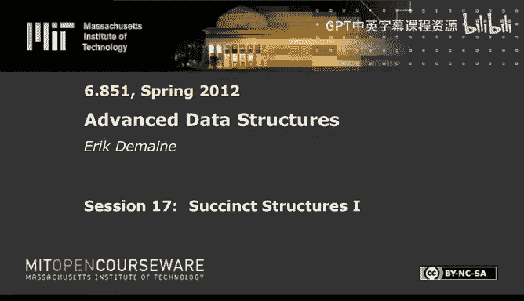
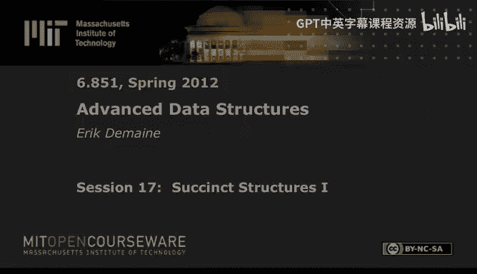

# 高级数据结构：17：简洁数据结构 I

在本节课中，我们将学习简洁数据结构。我们的目标是使用极小的空间来存储数据结构。我们将重点关注静态数据结构，并定义“小空间”的三个层次：隐式、简洁和紧凑。今天，我们将主要探讨如何为二叉字典树和位向量实现简洁表示，并学习实现快速查询的关键操作：`rank` 和 `select`。

## 空间效率的三个层次

在简洁数据结构领域，我们追求三种不同层次的空间效率。

*   **隐式**：使用最优比特数加上一个常数。例如，二叉堆和有序数组。
*   **简洁**：使用最优比特数加上 `o(opt)` 比特。这是我们的主要目标。
*   **紧凑**：使用 `O(opt)` 比特。这通常意味着比传统的线性空间数据结构节省了因子 `W`（字长）。

## 简洁二叉字典树

上一节我们定义了空间效率的目标，本节我们来看一个具体的数据结构：二叉字典树。我们的目标是使用接近最优的 `2n + o(n)` 比特来表示一个有 `n` 个节点的二叉字典树，并支持常数时间的遍历操作（左孩子、右孩子、父节点）。

### 层序遍历表示法

一种简单的表示方法是按层序遍历节点，并为每个节点记录其左孩子和右孩子是否存在。

以下是具体步骤：
1.  从根节点开始，按层序（广度优先）访问每个节点。
2.  对于每个访问到的节点，输出两个比特：第一个比特表示左孩子是否存在（1存在，0不存在），第二个比特表示右孩子是否存在。

例如，对于一个二叉字典树，我们可能得到比特串 `11 01 11 01 01 00 00`。对于 `n` 个节点，我们恰好产生 `2n` 个比特。

### 在层序表示中导航

为了在常数时间内找到左孩子、右孩子和父节点，我们需要一个关键的引理。

**引理**：在层序比特串中，第 `i` 个内部节点（即第 `i` 个“1”比特，代表一个真实节点）的左孩子位于整体数组的位置 `2i`，右孩子位于位置 `2i+1`。

**证明思路**：可以通过对 `i` 的归纳来证明。由于是层序遍历，节点 `i` 的孩子会紧接在节点 `i-1` 的孩子之后出现。

根据这个引理：
*   **左孩子**：位置 = `2 * rank(i)`
*   **右孩子**：位置 = `2 * rank(i) + 1`
*   **父节点**：位置 = `select(floor(i/2))`

这里，`rank(i)` 返回位置 `i` 之前（含）`1` 比特的数量，`select(j)` 返回第 `j` 个 `1` 比特的位置。因此，实现常数时间遍历的关键在于实现常数时间的 `rank` 和 `select` 操作。

## 位向量的 Rank 操作

上一节我们看到了 `rank` 和 `select` 操作对于导航层序二叉字典树的重要性。本节中，我们来看看如何为位向量实现常数时间的 `rank` 查询，同时仅使用 `o(n)` 的额外空间。

我们的目标是：给定一个长度为 `n` 的比特串 `B` 和一个索引 `i`，快速计算 `B[1..i]` 中 `1` 的个数。

### 间接寻址与查找表

我们使用两级间接寻址将问题规模减小到可以使用查找表解决。

**第一级：大块**
1.  将比特串划分为大小为 `log² n` 的块。
2.  在每个块的边界存储累积的 `rank` 值（即到该块之前为止 `1` 的总数）。存储每个值需要 `log n` 比特。
3.  总空间开销：块数 `(n / log² n)` × 每个值大小 `(log n)` = `n / log n` 比特，属于 `o(n)`。

**第二级：小块**
1.  在每个 `log² n` 的大块内部，进一步划分为大小为 `(1/2) log n` 的小块。
2.  在每个小块的边界，存储其在大块内部的累积 `rank` 值。由于值不超过 `log² n`，存储每个值只需 `log log n` 比特。
3.  总空间开销：小块边界总数 `(n / log n)` × 每个值大小 `(log log n)` = `(n log log n) / log n` 比特，仍属于 `o(n)`。

**查找表**
1.  预处理所有长度为 `(1/2) log n` 的可能比特串。
2.  对于每个这样的短串，预先计算每个位置的 `rank` 答案并存储。
3.  表大小：`2^{(1/2) log n} = √n` 个条目 × 每个条目 `O(log log n)` 比特 ≈ `O(√n log log n)`，属于 `o(n)`。

**查询过程**
要计算 `rank(i)`：
1.  找到 `i` 所在的大块，读取该块起始处的累积 `rank1`。
2.  找到 `i` 所在大块内的小块，读取该小块起始处在大块内的累积 `rank2`。
3.  定位 `i` 在小块内的具体位置，使用查找表获得在小块内的 `rank3`。
4.  最终结果：`rank(i) = rank1 + rank2 + rank3`。

所有步骤均为常数时间，总额外空间为 `o(n)`。

## 位向量的 Select 操作

我们已经实现了 `rank`，现在来处理它的逆操作 `select`。给定一个索引 `j`，`select(j)` 返回第 `j` 个 `1` 比特的位置。这个操作稍微复杂一些。

### 处理稀疏和密集情况

我们根据 `1` 比特的分布情况采取不同策略。

**第一级：按1的数目分组**
1.  将比特串划分为每组包含 `log n log log n` 个 `1` 比特的组。每组大小可能不同。
2.  存储一个数组，记录每组起始位置。给定 `j`，通过除法可定位到对应组。

**处理组内查询**
对于每个组，设其长度为 `r` 比特（包含 `log n log log n` 个 `1`）。
*   **情况A：稀疏组** (`r ≥ (log n log log n)²`)
    *   组内 `0` 很多。我们可以直接存储组内所有 `1` 的位置（相对偏移）。
    *   空间分析：每组存储一个大小为 `(log n log log n)` 的数组，每个条目需 `log n` 比特。这样的组最多有 `n / (log n log log n)²` 个。总空间约为 `n / log log n` 比特，属 `o(n)`。
*   **情况B：密集组** (`r < (log n log log n)²`)
    *   组相对较小，我们将其标记为“待简化”位向量。

**第二级：简化处理**
对所有“待简化”的组（每个长度 `< (log n log log n)²`）重复类似 `rank` 中的两级间接寻址过程：
1.  在组内，每 `(log log n)²` 个 `1` 比特设一个子组边界，存储相对偏移（只需 `log log n` 比特）。
2.  对于每个子组，再次判断稀疏（长度 ≥ `(log log n)⁴`）或密集。
    *   若稀疏，存储子组内所有 `1` 的位置。
    *   若密集，此时子组长度已降至 `(log log n)⁴`，可直接使用查找表解决。

**查询过程**
要计算 `select(j)`：
1.  `j1 = floor(j / (log n log log n))` 找到所属大组，跳转到其起始位置。
2.  检查该组是稀疏还是密集。
    *   若稀疏，使用组内存储的查找表直接得到答案。
    *   若密集，在组内进行第二级查询：计算 `j2 = j % (log n log log n)`，找到对应的子组，同样判断稀疏/密集并查表或继续查找。
3.  所有操作均在常数时间内完成，总额外空间为 `o(n)`。

## 平衡括号表示法

层序表示法无法高效支持子树大小查询。本节我们介绍一种更强大的表示法：平衡括号表示法。它能支持所有导航操作以及子树大小查询。

### 从二叉字典树到有序根树

首先，我们建立二叉字典树与有序根树之间的双射关系。
*   **转换**：将二叉字典树中每个节点的右脊柱（从该节点开始，不断访问右孩子形成的链）旋转45度，作为其父节点的一串有序孩子。
*   **结果**：每个二叉字典树唯一对应一棵有序根树，反之亦然。因此，它们都有 `Catalan(n)` 棵。

### 从有序根树到平衡括号序列

接着，将有序根树转换为平衡括号序列。
*   **方法**：对树进行深度优先遍历（前序）。访问节点时输出“（”，离开节点时输出“）”。
*   **表示**：一个有 `n` 个节点的树产生长度为 `2n` 的平衡括号序列。我们可以用 `0` 表示“（”，`1` 表示“）”。

### 在平衡括号表示中导航

现在，我们需要在平衡括号序列上实现二叉字典树的操作。这需要一些基本原语操作，如找到匹配的括号、找到某个括号的“封闭括号对”等。这些操作都可以通过扩展 `rank/select` 的技术在常数时间和 `o(n)` 额外空间内完成。

基于这些原语：
*   **左孩子** ↔ 第一个孩子：对应当前位置的下一个字符（如果是“(”）。
*   **右孩子** ↔ 下一个兄弟：对应匹配右括号的下一个字符。
*   **父节点**：对应前一个字符。如果是“)”，则找其匹配的“(”（得到前一个兄弟）；如果是“(”，则它就是父节点。

### 支持子树大小查询

平衡括号表示法的最大优势是能高效计算子树大小。
*   在二叉字典树/有序根树中，一个节点的子树包含它和它的所有右兄弟。
*   在平衡括号序列中，这对应于从一个左括号到其“封闭括号对”的右括号之间的所有括号。
*   **子树节点数** = （封闭右括号位置 - 左括号位置） / 2。
*   **子树叶子数**：可以通过计算该区间内匹配的括号对数量（即一种扩展的 `rank` 查询）得到。

所有这些查询都可以在常数时间内完成。

## 总结

本节课中，我们一起学习了简洁数据结构的基本概念。我们首先定义了隐式、简洁和紧凑三种空间效率目标。然后，我们深入探讨了如何为二叉字典树构建简洁表示。
*   我们学习了**层序遍历表示法**，它将导航操作归结为位向量上的 `rank` 和 `select` 操作。
*   我们详细设计了**常数时间、`o(n)` 额外空间**的 `rank` 和 `select` 数据结构，关键思想是**多级间接寻址**和**查找表**。
*   最后，我们介绍了更强大的**平衡括号表示法**，它不仅能实现常数时间的导航，还能支持**子树大小查询**，为下节课实现简洁后缀树奠定了基础。

通过使用这些技术，我们可以用近乎最优的空间存储大量数据，同时保持高效的查询性能。