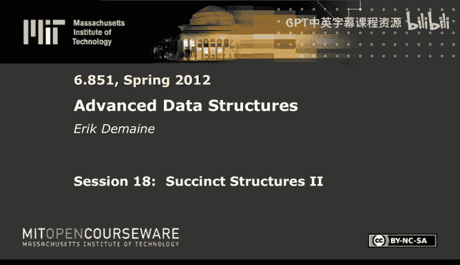
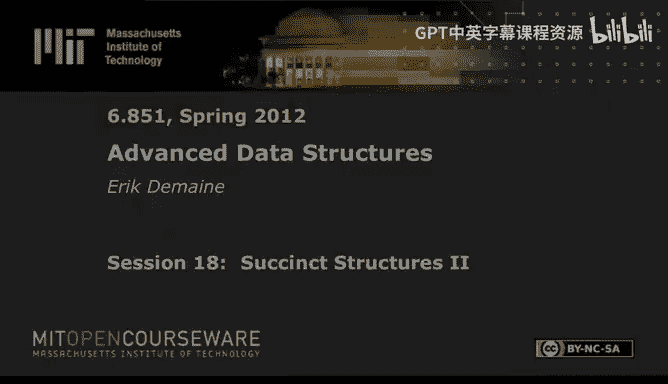

# 高级数据结构：18：简洁结构 II





## 概述

在本节课中，我们将学习如何将之前了解的字典树知识应用于一个核心应用：后缀树。我们将展示后缀树和后缀数组在空间视角下也是等价的。具体来说，如果你能简洁地表示一个后缀数组，那么只需增加少量额外空间，你就能构建一个后缀树，并以我们熟悉的时间复杂度（即 `P` 加上输出大小）进行搜索。虽然我们会损失一些对数因子，但这主要是由于转换过程中增加的 `log log n` 项。我们将从改进空间复杂度开始，最终目标是达到线性空间。

## 研究现状概览

在深入具体数据结构之前，我们先简要了解一下该领域已知的研究成果。

以下是关于紧凑和简洁后缀数组及后缀树的一些关键成果：

*   **Grossi-Vitter (2000)**: 这是第一个实现紧凑后缀数组的成果。其空间复杂度为 `O((1/ε) * n log σ)` 比特，查询时间复杂度为 `O((P + occ) * log^ε n)`。它允许通过调整 ε 在空间和时间之间进行权衡。
*   **FM-Index (2000)**: 该索引实现了 `O(5 * H_k(T) * T + o(T log σ))` 比特的空间复杂度，其中 `H_k(T)` 是文本的 k 阶经验熵。这使得它在文本可压缩时能获得更好的空间效率。查询时间复杂度为 `O((P + occ) * log^ε n)`。
*   **Sadakane (2003)**: 该结构空间复杂度为 `O((1+ε) * H_0(T) * T + o(T log σ))`，对大字母表处理得更好，但查询时间增加了一个对数因子。
*   **Grossi-Gupta-Vitter (2003)**: 这是第一个实现简洁后缀树的成果，空间复杂度为 `O(H_k(T) * T + o(T log σ))`，查询时间复杂度为 `O((P log σ + occ log^2 n / log log n) * log σ)`。
*   **Ferragina-Manzini-Mäkinen-Navarro (2007)**: 该成果也达到了 `O(H_k(T) * T + o(T))` 比特的空间复杂度，查询时间复杂度为 `O(P + occ * log^(1+ε) n)`，并且能在 `O(P)` 时间内完成计数查询。

这些结构大多是静态的，但也有关于动态构建和文档检索等扩展研究。本课程将重点讲解最简单易懂的 Grossi-Vitter 方法。

## 压缩后缀数组问题

我们的目标是能够回答形式为 `SA[k]` 的查询，即在所有后缀按字典序排序后，第 `k` 个后缀在原始文本中的起始位置。利用这个功能，我们可以进行搜索。

核心思想是采用递归分治的策略来表示后缀数组。

### 递归结构定义

我们定义递归的文本和后缀数组：
*   设 `T_0` 为原始文本，长度为 `n_0 = n`，其对应的后缀数组为 `SA_0`。
*   在递归的第 `k` 层，我们通过合并相邻字符来构建新文本 `T_{k+1}`：`T_{k+1}[i] = (T_k[2i], T_k[2i+1])`。因此，`T_{k+1}` 的长度为 `n_{k+1} = n / 2^{k+1}`。
*   后缀数组 `SA_{k+1}` 可以通过提取 `SA_k` 中对应偶数起始位置的后缀索引，并除以 2 得到。

我们的表示策略是自底向上的：假设我们已经简洁地表示了 `SA_{k+1}`，然后在此基础上表示 `SA_k`。

### 关键辅助函数

为了建立 `SA_k` 和 `SA_{k+1}` 之间的联系，我们需要定义两个辅助函数：

1.  **偶后继 (Even Successor)**: 对于后缀数组 `SA_k` 中的第 `i` 个后缀（起始位置为 `SA_k[i]`）：
    *   如果 `SA_k[i]` 是偶数，则 `even_successor(i) = i`。
    *   如果 `SA_k[i]` 是奇数，则 `even_successor(i)` 等于那个起始位置为 `SA_k[i]+1`（即下一个偶数位置）的后缀在 `SA_k` 中的排名 `j`。
2.  **偶排名 (Even Rank)**: `even_rank(i)` 表示在 `SA_k` 的前 `i` 个后缀中，起始位置为偶数的后缀数量。

### 核心递推公式

利用上述定义，我们可以用 `SA_{k+1}` 来表示 `SA_k[i]`：

```
SA_k[i] = 2 * SA_{k+1}[ even_rank( even_successor(i) ) - 1 ] - (1 - is_even_suffix(i))
```

其中 `is_even_suffix(i)` 是一个指示函数，当 `SA_k[i]` 为偶数时值为 1，否则为 0。

**公式解释**:
*   `even_successor(i)`: 将当前后缀（可能为奇数起始）规整到其后的偶数起始后缀。
*   `even_rank(...)`: 获取该偶数后缀在 `SA_{k+1}` 中对应的新索引。
*   `SA_{k+1}[...]`: 在下一层递归中查找该后缀的起始位置（相对于 `T_{k+1}`）。
*   `2 * ...`: 将 `T_{k+1}` 中的位置转换回 `T_k` 中的位置（因为每个 `T_{k+1}` 字符对应 `T_k` 的两个字符）。
*   `- (1 - is_even_suffix(i))`: 如果原始后缀是奇数起始的（`is_even_suffix(i)=0`），我们需要减去 1 以补偿 `even_successor` 所做的 +1 偏移。

### 递归深度与查询

我们不需要递归到常数大小。只需进行 `L = log log n` 层递归。在底层（`SA_L`），文本长度 `n_L = n / log n`，我们可以直接使用普通的 `O(n_L log n_L)` 比特的空间存储显式的后缀数组，这部分空间是 `o(n)` 的。

要回答一个 `SA_0[i]` 的查询，我们只需自顶向下应用上述公式 `L` 次，最终在底层的显式数组中查找，然后逐层返回结果。如果所有辅助函数都能在常数时间内计算，那么总查询时间为 `O(log log n)`。

## 实现 `O(n log log n)` 比特的后缀数组

现在，关键问题是如何高效地存储辅助函数 `is_even_suffix`、`even_rank` 和 `even_successor`。

### 简单部分的存储

*   **`is_even_suffix`**: 直接存储一个长度为 `n_k` 的比特数组，1 表示对应后缀起始位置为偶数。总空间为 `O(n)` 比特（几何级数求和）。
*   **`even_rank`**: 这正是我们在上一讲中学到的针对比特向量的 `rank1` 查询结构。我们可以使用 `O(n_k / log n_k)` 或更优的额外空间来实现常数时间查询。总空间也是 `o(n)`。

### 高效存储 `even_successor`

这是最具技巧性的部分。我们只关心 `SA_k[i]` 为奇数的情况下的 `even_successor(i)` 值。对于这些“奇数后缀”，我们需要存储其对应的 `even_successor` 值（一个索引 `j`）。

关键的观察是：如果我们按照 `i`（即后缀的字典序）来列出这些（奇数后缀，`even_successor` 值）对，那么这些对的排序顺序实际上等同于按照（该奇数后缀的第一个字符，其 `even_successor` 值）这个二元组进行排序。

利用这个性质，我们可以用一种差分编码来存储这些 `even_successor` 值。我们将每个 `even_successor` 值看作一个比特串，分为高 `log n_k` 位和剩余的 `2^k` 位（因为 `T_k` 中一个字符对应原始文本的 `2^k` 位）。

*   **高位的存储**: 对于排序后的 `even_successor` 值序列，我们存储其高位部分的差分值的一元编码（unary differential encoding）。具体来说，我们写入 `v1` 个 0，然后一个 1，再写入 `(v2-v1)` 个 0，然后一个 1，依此类推。由于高位最多变化 `n_k` 次，且共有 `n_k/2` 个值，所以这个比特串的总长度约为 `(3/2) * n_k`。
*   **低位的存储**: 我们将每个值的低位部分（`2^k` 位）显式地存储在一个数组中。这部分的总空间是 `(n_k/2) * 2^k = n/2` 比特（对所有层求和后为 `O(n log log n)`）。

要查询第 `i` 个奇数后缀对应的 `even_successor` 值的高位，我们首先计算 `odd_rank = i - even_rank(i)`。然后，在存储高位的一元编码比特串中，找到第 `odd_rank` 个 1 的位置（使用 `select1`），并计算从开头到该位置的 0 的数量（使用 `rank0`），这个数量就是所需的高位值。低位值可以直接从显式数组中读取。合并高低位即得到完整的 `even_successor` 值。

### 空间与时间分析

将所有层的空间成本相加：
*   `is_even_suffix`: `O(n)` 比特
*   `even_rank`: `o(n)` 比特
*   `even_successor` 的高位存储: `O(n)` 比特
*   `even_successor` 的低位存储: `O(n log log n)` 比特
*   底层显式后缀数组: `o(n)` 比特

因此，总空间复杂度为 `O(n log log n)` 比特。查询时间复杂度为 `O(log log n)`。

## 改进到紧凑后缀数组 (`O(n)` 比特)

`O(n log log n)` 的空间瓶颈在于 `even_successor` 的低位存储。为了达到线性空间，我们不能存储所有递归层。

我们只存储稀疏的层：第 0 层，第 `εL` 层，第 `2εL` 层，...，直到第 `L` 层（`L = log log n`）。总共存储 `O(1/ε)` 层。

在查询时，要从 `SA_{k}` 跳转到 `SA_{k+εL}`，我们不能像之前那样一步到位。我们需要定义一个更一般的 **后继 (Successor)** 函数：从当前后缀开始，不断移动到下一个后缀（即 `SA` 中的下一个索引），直到遇到一个起始位置能被 `2^{εL}` 整除的后缀。这个过程最多需要 `2^{εL} = log^ε n` 步。

然后，我们递归到下一层 `SA_{k+εL}` 进行查询，得到结果后，再乘以 `2^{εL}` 并减去之前走过的步数，以补偿偏移。

这个思路与之前完全相同，只是将“偶数”的概念推广到了“能被 `2^{εL}` 整除”，并且将单步跳转替换为了最多 `log^ε n` 步的迭代。`successor` 函数的存储可以采用与 `even_successor` 类似但更通用的编码技巧。

### 空间与时间分析

由于我们只存储了 `O(1/ε)` 层，每层的空间成本为 `O(n)`，因此总空间复杂度为 `O((1/ε) * n)` 比特。查询时，在每一层我们可能需要进行最多 `O(log^ε n)` 次迭代来找到“可整除”的后缀，因此总查询时间复杂度为 `O((1/ε) * log^ε n) = O(log^ε n)`（假设 ε 为常数）。

通过一些优化（例如，第 0 层的 `successor` 结构可以简化；使用更高效的稀疏比特向量表示 `is_even_suffix`），可以将主导常数优化到接近 1，最终空间复杂度为 `O((1/ε) * n + o(n))` 比特。

## 从后缀数组到后缀树

最后，我们简要介绍如何将紧凑的后缀数组转换为紧凑的后缀树。这里我们概述 Grossi-Vitter 方法的一个简化版本。

### 紧凑版本

1.  **存储树形结构**: 对于二进制字母表，后缀树可以看作一棵二叉树（有 `O(n)` 个节点）。我们使用上一讲中提到的平衡括号表示法来存储这棵树的拓扑结构，这需要 `O(n)` 比特。
2.  **省略边长信息**: 我们不在树中显式存储边的长度（即跳过的字符数）。
3.  **查询时计算边长**: 在搜索过程中，当我们需要知道从当前节点到子节点的边的长度时，我们这样做：
    *   找到该子树中最左边和最右边的叶子节点（在平衡括号表示中可通过 `rank/select` 操作高效实现）。
    *   这两个叶子节点对应后缀数组中的两个索引 `i` 和 `j`。
    *   通过查询后缀数组 `SA` 获得这两个后缀在文本中的起始位置。
    *   计算这两个后缀从当前深度开始的最长公共前缀 (LCP) 的长度，这个长度就是所需边的长度。
4.  **搜索成本**: 在最坏情况下，我们可能需要在每个搜索步骤中都计算一次 LCP，每次计算需要常数次后缀数组查询。因此，总搜索时间为 `O(P * (后缀数组查询时间))`，即 `O(P * log^ε n)`。

### 简洁版本

为了进一步减少树结构本身的空间（达到 `o(n)` 比特），我们可以使用“采样”思想：
*   我们只保留每隔 `B` 个叶子节点（`B` 是一个缓慢增长的函数，如 `log log log n`）的叶子，以及它们的最小公共祖先构成的树。这棵树的节点数是 `O(n/B)`。
*   存储这棵采样树只需要 `O(n/B)` 比特。
*   在搜索时，我们可能无法直接定位到精确的叶子，但可以定位到距离目标叶子不超过 `B` 的范围内。
*   然后，我们可以利用一个大小为 `O(2^B)` 的预计算查找表，在这个小范围内并行模拟对所有可能后缀的搜索，从而在 `O(P + B)` 时间内找到正确结果（再乘以后缀数组查询时间）。

通过将 `B` 设置为一个很小的值（如 `log^ε n`），我们可以使树结构的空间成为 `o(n)`，同时查询时间增加一个可接受的附加项。

## 总结


本节课我们一起学习了简洁数据结构在后缀树和后缀数组中的应用。我们从问题定义出发，了解了该领域的主要研究成果。然后，我们深入探讨了 Grossi-Vitter 方法的核心思想：通过递归分治和巧妙的差分编码，用 `SA_{k+1}` 来表示 `SA_k`。我们首先实现了 `O(n log log n)` 比特的后缀数组，然后通过稀疏化递归层将其改进为 `O(n)` 比特的紧凑后缀数组，查询时间为 `O(log^ε n)`。最后，我们概述了如何利用这种紧凑的后缀数组，结合平衡括号表示和采样技术，构建出紧凑乃至简洁的后缀树。这些技术展示了如何用近乎最优的空间来存储和查询复杂的字符串索引结构。