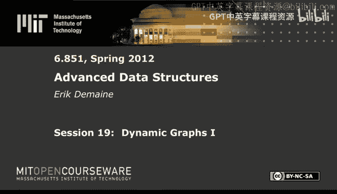
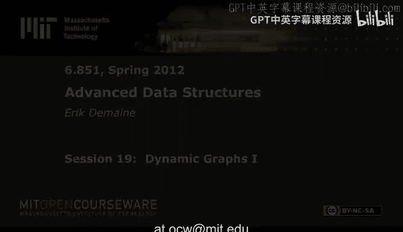
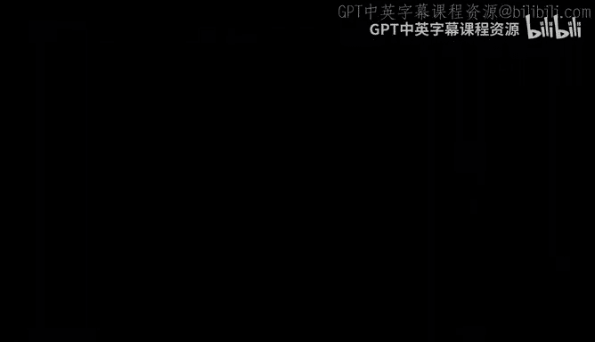

# 《高级数据结构｜6.851 Advanced Data Structures, Spring 2012》中英字幕（deepseek - P19：-19-19. Dynamic Graphs I.zh_en - GPT中英字幕课程资源 - BV1FDFVzdEBA

The following content is provided under a creative Commons license。

 Your support will help M I T Open Coseware continue to offer high quality educational resources for free。

To make a donation or view additional materials from hundreds of MI T courses。

 visit Mi T OpenCourseware at O C W dot M I T dot E Du。

So today， we're going to cover a data structure called link cut trees。

 It's a cool way of maintaining dynamic trees。 and it begins our study of dynamic graphs where in general。

 we have a graph， usually undirected。 You want to support insertion and deletion of edges。

 So we're going to do that in the situation where at all times， our graphs are trees。 So in general。

 we have a forest of trees。 And we want to maintain them。😊，So。

That will be our only data structure today because it's a bit complicated it's going to use。

Fancy amortization and two techniques for splitting trees into paths。

1 we've seen already in the context of tango trees and lecture 6 preferred paths and another。

 which we haven't seen is probably my favorite。Technique in data structures， actually。

 heavy light decomposition。 I've used， it's the technique in data structures I've used the most outside of data structures。

 It's it's very useful in lots of settings。 Whenever you have an unbalanced tree and you wanna make it balanced。

 like with link cut。It's it's the go to tool。So in general， we want to maintain。Forest of trees。

And these are going to be rooted。Unordered trees。So arbitrary degree。this。

And we have a bunch of operations we want to do， basically insertion and deletions of edges and some queries。

And we want to do all of those operations in log N time for operation。That's the hard part。So。

We have some kind of getting started operation makere。This is going to be make a new vertex。

In a new tree， return it， so this is how you add node to the structure。

And's we're not going to worry about doing deletions。 Once you add something， it stays there forever。

Though you could you could do that。 It's no big deal。 You could throw away a tree。Then we have link。

 which is essentially an insertion of an edge。So here we're given two vertices B and W and that are in different trees。

 That's a precondition。So V has to be the root of its tree。W can be any node。

So here we have another tree and we have some node W inside V。

And the link operation adds V as a child of W。So we add this edge。that， of course。

 combines two trees into one tree。And the requirement is V And W have to be in different trees。

 Otherwise you'd be adding a cycle that doesn't satisfy that we're always a forest of trees。

Then we have a cut operation。Which is basically the reverse。So， let me。Dr it， we have V。Subre parent。

And whatever the whole tree up here。And what we want to do is remove that edge。

So that splits one tree into two trees by deleting the edge from V to its parent。Okay。

 so those are our updates。 Prety obvious in the setting of dynamic graphs。Of course。

 it's the first time we see them。Now we have some queries。

 there are lots of different queries that link countries can support。One of them。

 so most basic is find the root。Of。A vertex， so。Let me just draw a picture of it。

You have some vertex v。You want to return the root of the tree。Okay， so find R。

And that's pretty easy to do。 We'll actually see in next class， next lecture。

 if you want to do make tree link cut and find root。

 there's a really easy way to do them in logarithic time。

 Link cut trees are a harder way to do it in log end time。

 but they support a lot of other operations。 and in particular。诶。Something called path aggregation。

This is kind of the essence of why link countries are cool。Let's suppose。Have a tree。

You have a vertex v。There's a route to V path。And let's suppose that every node or every edge doesn't matter。

 has a weight on it。 just some real number。Then path aggregation can do things like the min or the max or the sum。

Or the product or whatever of weights on that path。And this is a powerful thing。

 And it's actually the reason link countries were originally invented for doing network flow algorithms faster。

 If you know network flow algorithms or maybe you've seen them in advanced algorithms。

 this is sort of the key thing you need to do， you find。

 I think the min weight edge along along one of these paths。

 And that's the max you can push in a push rela strategy。

 I don't want to get into that because that's algorithms， not data structures。

 But this is why they're invented。 And in general， link cut have a very strong kind of path thing。

 If you want to know anything about a route to V path for any node V。

 link countries can do whatever you want in log n time。 This is just sort of an example of that。😊。

And yeah。Cool， so that's what link cut trees are able to do All these operations in log n。 And the。

 the main point here is that the trees are storing are probably not balanced。 It could be a path。

 It could be very， It could be depth N this path that we're talking about could be length order N。😊。

Really bad。 And yet， we can do all these operations in long end time。 And we're gonna do that。

 essentially， by storing。The unbalanced tree that you're trying to represent， which we call。

 we call this the represented tree。 We're going store it using essentially a balanced tree。

 In one version of link cut trees。 Indeed， we store all the nodes in a log n height tree。

The version we're going cover here。's there's several versions of link cut trees。

 originaligin are biased later in Tjn in 1983。 And then Tarjn wrote a book。

 one of a few books on data structures。 very thin book。 usually call it Tarjn's little book 1984。

 And it has a different version of link cut trees。 And that's the version we're going cover。

 It uses s trees as a subroutines。 So it's not going to be perfectly balanced。 It's going to be。

Balanced in an amortized sense， ver vaguely balanced， roughly balanced， whatever。

But there is a version that does everything in log n worst case per operation If there's time。

 I'll sketch that for you at the end。But the simplest version I know is the play tree version。

 And it's also kind of fun because the version willll see。😊，Doesn't really look like it should work。

 And yet it does。 So thanks to display trees， essentially。So it's a little。

 it's fun and surprising in that sense。As I said， link cut trees are all about。Pads in the tree。

 And so somehow we want to split a tree up into paths。 And we've already seen a way to do this。

 The preferred path decomposition。So， let me。It's kind of reminding you。

 but I'm also gonna to slightly redefine it， if I recall correctly。It's just a minor。

Minor difference， I and talk about a second。 There's a notion of a preferred child of a node。

 and it's gonna be two cases。There aren't going to be any。

 there's a preferred child if the last access。And。These subre。Is V。So we have some node V。 Now。

 this is relative to the represented tree。so we have some note to V。

 We don't care about accesses outside of that subre。

 but if the last access within the subre was V itself， then there's no preferred child。Otherwise。

 the last access within the subre was in one of these child subtes and whichever one it was。

 we sayW is the preferred child。So if the last axis in V subree。诶。Is in。W trail， Ws。Subary。Okay。

 I think last time we defined preferred children in the context of tanggo trees。

 We just had the second part。 So if there was an access to V， we ignored it。

 and we just consider what the last child access was。

 I don't think this actually would affect tango trees， but I think it does affect link cut trees。

 So I want to define it this way。 It'll make life cleaner， basically。

It probablyb not a huge difference， either way。Okay， once you have preferred children。

 that gives you one outgoing edge， downward edge from every node。 And so we get preferred paths。

By repeatedly following preferred child pointers， now we may stop at some point because we reach a nun I'm going to use none as like null pointers in this lecture。

But， you know， in general， we have some tree and you follow for a while。

 And then there's gonna be a bunch of things like this。 We decompose。呃。The nodes。

In the represented tree。Partition the notess。Every node belongs with some preferred path。

 So basic idea is we're going store the preferred paths in kind of balanced binary searchries。

 s trees。 and then we're gonna connect them together because those that's not all the edges in the tree。

There's。Some edges that sort of connect them connect the paths together。

 that's where the tree part comes in。That's what we're going to do。 this thing is unbalanced。

 We're going to take each of these white lines and compress it into a s tree。

And preserve the red pointers。rite that down。These are called auxiliary trees。

This was exactly the idea in tango trees。And I'm using tango tree terminology to keep it consistent with that notation。

 that it wasn't called preferred paths in the link cut tree papers。

 or it wasn't called auxiliary trees， but。Same difference。 So auxiliary trees we're gonna to store。

 represent。Each preferred path。By a display tree。With tango trees。

 we use red black trees or whatever。Could use s trees， Actually。

 if you use tango trees use s trees for each preferred path。 It's called a multispplay tree。

 Multiplay trees are almost identical to link cut trees， but they're used for different setting。

 The use for proving log log and competitiveness here。

 we're doing it to represent a specific tree with tango trees the tree we're representing was just a perfect binary tree。

 As you may recall P Here it has some meaning， and it's going to be changing。

 and we care about how it's changing。Okay， another difference is we're going to key the nodes。

By depth。This is what we wanted to do with tango trees。

 but we weren't allowed to because we had to be a binary search trees and the keys were given to us。

Here， there are no keys， so we need to specify them。 And the most convenient one is by depth。

So we're just taking a path like this。Let's say 0，1，2，3，4。

 And then we're turning it into a nice balanced tree like this，0，1，2。2。3。Po。Okay。啊。

And it's a display tree， so it's not guaranteed to be balanced at any moment。

 but amortized it's going to have log n performance per operation。Okay， and then this is sort of。

 that's representing each of these white pads。 But then we also need the red pointers。

 So what we're gonna do is say the root。Each auxiliary tree。abbreviate oxxre。Stors。

 what I'll call the path parent。Which are these red pointers。And the definition is this is。The paths。

Top nodes。Parent。And the represented tree。Okay， very soon， it's gonna get confusing。

and I'm going to always make it explicit。 Am I talking about the represented tree。

 the thing we're trying to represent， or am I talking about auxiliary trees because you。

 notion of parent is different in the two。So in auxiliary tree。

 a parent is just whatever it happens to be stored in the s tree， when you do display operations。

 you care about those parents when you're doing when you're thinking about the tree you're trying to represent。

 you care about parents in the represented tree。Now， how do you see that here well。

Following parent is like doing predecessor over here。

 So we kind of know how to do predecessor and binary search tree。 But when we get to0。

 which is the leftmost node in this tree corresponds to the top of the path。 we'd like to。

 if we want to do the parent， that's going up from this path。 that's going to be the path parent。

And it's saying the path's top node， that's this guy zero。It's parent in the representative。

 We're just going to store that pointer。 The only weird thing is we're not going store the pointer here。

 We're gonna store the pointer here。That's the path， parent。

 We're gonna put it at the root of the s tree， basically because it's really easy to get to the root of a tree。

 You could。 You could probably store it here。 You just have to go left every time。

 And it's kind of annoying。 Ana will get messier。 So we'll put it at the root。And so in particular。

 if I do a rotation， like if I rotate the tree like this and make one the root。

 that path parent pointer has to move to one， but it's still representing。

 essentially for this whole display tree representing this path。

 what was the parent pointer from there？So this is the represented tree。And this is the ox tree。Okay。

 now， if I take all the ox trees plus these parent pointers。

 I get something called the tree of ox trees。And this is our representation。

So there's the represented thing versus our representation。

 I'm not going to use the word representation because it sounds almost like represented。

So it's going to be represented versus treee of ox trees。 Te of ox trees is what we store。

 representeded is what we want to store。It's what we're trying to represent。So。

That's the terminology。Basically， we want the tree of ox trees to be balanced。

 And if there's s trees， it'll be kind of balanced。And whereas the representative tree is unbalanced。

Cool。So now I wanna give you some code and how we're going to manipulate these things。

 And then we'll be able to analyze the code and that。Both will take a little while。

The main operation。Maybe。Go over here。Sure。The main operation I'm gonna talk about is actually just a helper operation。

 So first， I w to tell you。诶。What it is， how it works。 It's like an access in a tango tree。

 tango trees。 We just wanted to touch item X I and then go into the next item X I plus one。

 So I'm gonna think about that world。 Well， all all I'm trying to do is touch nodes。

 What's interesting about touching nodes is it changes。 this notion of preferred edges。

 As I said it's the last access in that subte blah， blah， blah。 So access。😊。

Does access mean in reality， what I mean is the last time that node was used as like a link or a cut or a find operation。

 but in fact， I'm going to make that explicit。 Every operation is going to start by calling this function access on its arguments question。

通のし。Can you say that the display trade is key by death？Yes。Okay， so the。

 the transformation from this path in the representative tree to the display tree is just， I look。

 these nodes have depth。Within that path， I mean， they're just ordered along the path。

 What I mean is I want to store them in as a binary search tree ordered by that value。So that's。

 that's what， yeah。So that's s trees have some key on the nodes。

 they maintain the binary search tree property。 My key is just going to be the depth。

 the position along the path。Right， if I do an introtroversal here， I'll get the path back， yep。

No problem。That's gonna be important to understand。 Okay， so to do an access。

 access is gonna do two things。 The first thing it has to do。 and the。

 the other thing is gonna make our life easy。You'll see once we've defined access。

 all operations become trivial。 So it's gonna be a really cool helper function。😊。

The first thing we have to do when we access an node V is say， well， that， then by definition。

 the path to V from the root， Well V to root。I guess sort of， but probably more root to be。

Should be preferred。 That's the definition of preferred。 because now it's the latest thing accessed。

呃。So we've got to fix that。But we're gonna do a little bit more。 We're also going to。Make。

The root of its ox tree。Which will mean because that ox tree is now the topmost ox tree because that ox tree contains the root。

 and it contains V。So in fact， V is the root。Of the tree of ox trees。 It's the overall root。

For this tree of ox trees。Why do we do that？ Well， it's sort of gonna just be a consequence of。

 of using displaycause whenever you displayplay something， you move it to the root in this。

 in the zigzaggy way。 But it'll actually be really helpful to have this property。

 And That's why these are， the simplest link cut， I know。Okay， so how do we do this。

So you're given the node V somewhere in this world。

 And we've basically got to fix a lot of preferred child pointers。

And whereas tango trees basically walked from the top down。

Navigating one preferred path until it found the right place to exit and then fixing that edge。

 We're gonna be working bottom up because we already know where the vertex is。 We're given it。

 and we need to walk our way up the tree and kind of push V to the root overall。

So the first thing to do is play V。Okay， so that now， when I say Sp V， I mean， within its ox tree。

Doesn't make sense to do it in any global sense。In some sense。

 access is going to be our global version of S。 When I say displayplay a node， I mean。

 just within its ox tree。 That's going to be the definition Splay tree。

 So it's the you may recall from lecture 6。 There's zig zig case and zigzag case。

 you do some rotation， double rotation， whatever。 in the end， maybe one more rotation。

 And then V becomes the root。So what does the picture look like。

 We've got V at the root of its ox tree。 Then we've got things in the left subree。

 which have smaller depth。And then we've got things in the right sub tree， which have bigger depth。

Deps bigger than v。So we just pulled V to the root。 So in the represented tree。

 what we have is a path， Theres V。 These are the things of smaller depth。

 These are the things of larger depth。Now， if you look at the definition of preferred child。

When we access V， V now no longer has a preferred child。 This preferred child is now none。

If you look at this picture， this is a preferred path。Currently， V has a preferred child。

 We want to get rid of that。 That's our first。Operation， kept the red chalk。

First thing we wanna do is get rid of that edge。 It's no longer a preferred edge。

So that essentially corresponds to this edge。Becauseuse that's the connection from V to deeper things。

 I mean， in fact， this node right below us， let's call it X。It is right here。

It's the smallest depth among the nose with larger depth。Than V。

 But if we kind of kill that connection， then now this path is its own thing。

 The par O V separate from V and above。So that's what we're going to do first。Remove。These。

Preferred child。And I'm going to elaborate exactly the pointer arithmetic that makes that happen。

This is the kind of tedious part of， well， really any point of machine data structure。

This is gonna all work on a point machine， by the way。Nos here none。Okay， so basically。

 I'm obliterating this edge。 So I make， I'm going to make this vertex here have a path parent pointer。

To V。Because and otherwise obliterate this edge， it will no longer have a parent。

 V no longer has a right child。So it's gonna be， V is， has a left thing and no right pointer。

But this separate tree is gonna have a parent pointer to V。This， of course， if it exists。

 if V dot right is， is nothing already， then you don't do any of this。

But if there is a right pointer， then you've got to do this。

So this is a place where we're gonna set path parents pretty obvious， though。

The only thing to check is that this is really in the right place。

 This thing is the root of this ox tree。Which is where the parent pointer path parent is supposed to be。

 And it points to V， meaning that the parent of x is V in the representative tree。

 And that's exactly what this picture is。 This is the representative tree。 Parent of x is V。

 And so that's the correct definition of path parent。Cool。Okay， now。Fun part。

Now we're going to walk up the tree。See everything on the outline except this heavy light decomposition。

 We'll come to that soon。Okay， so。Now， we've got to walk up the tree and add new， preferred。

Child pointers。 This is the one that we had to remove all because it's the stuff below V。

 But up the path， if we walk up to the root here to the leftmost node of V。

 then there's a path parent from there。 We w to make that not a path parent， but a regular parent。

Because that right now， V is living in its own little preferred path。

 but we want that preferred path to extend all the way to the root。

By the definition of preferred child after doing an access。So we're going to do a loop。Until the。

Pathth parent。Its none。I'm gonna let。WB。Vs path parent。Save some。Say some writing。

And then we're going to display W。Okay， I think at this point， I should draw a picture。So。

So many pictures to draw。 So we have， let's say， a node W。As a child V， this is the represented tree。

Has some other child X， and I can have many children。Let's suppose that right now。

 the preferred child from W is X。It's not V because we just followed a path parent pointer to go from these path。

 which is something here。To W's path， the W's path is going be something like this。

So it goes to some other guy X， we want to change that。That pointer， instead of being that。

 we want to go here。Okay， that's in the represented tree。 Now。

 what does this look like in the tree of ox trees。Well， W lives in something。呃。W is there。

 X is its successor in there。 So maybe it's like a right child or whatever。呃。

Somewhere somewhere else in the tree。 And then separately， we have， we've already built this thing。

 V， it has a left child。 It has no right child。Because there's nothing deeper than V in its own prefer。

 its own preferred path。And then we have a path parent pointer that goes like this。

I want to fix that。 The first thing I'm gonna do is play W。 So the W is in the root of its own tree。

So then， it's gonna look like。W。It's gonna have a left child， left subre。

 right subree X is going be the its successor。 So it's the leftmost thing in there。

And we still have the。With its left child。And this pointer。It's not in the tree。 So if two ox trees。

 now I want to basically merge these two ox trees， but also get rid of this stuff。

Just like we did up here。 actually， first， I have to destroy this preferred。Child。

 and then make a new one， which is V。 So how do I do it。

 I just replace the right pointer from W to be V instead of whatever this thing is。That's it。So。Sa。

 switch。W's preferred child。To be V。And。What we do is say W。First， we clip off。The existing guy。

We say this nodes W do writes path parent is now going to be W。

 because we still want to have some way to get from here back up to W， just like we did up here。

This code is going to look very similar to these two lines。 We set it's parent to none。And we said。

W dot right。U here， we set it to none。 Now， we know it actually needs to be V。

And then we set the reverse pointer。 So v parent is now W。And V no longer has a path parent。

It essentially the reverse of these operations of these operations。

 So we remove this preferred trial pointer， and we add this one in。

 So the new picture will be we have W has its left subree just like before。

 It right subre is now V with its left subt。 And then we also have this other tree hanging out。

Not directly connected except by a path parent pointer。There。

 So whereas before V was linkededIn with a path parent pointer。 Now。

 this thing is linked in with a path parent pointer。 and sort of the primary connection。

 the white connection is direct from W to V。 And that's exactly what corresponds to clipping off this portion of the preferred path and concatenating on this portion of the preferred path。

More or less clear。 you can double check this at home， but。That's， that's what we need to do。

You have to go back and forth between these two worlds。

 the represented world and the tree of ox trees world， but。Is doing the right thing。 Again。

 you can check that this preferred this path parent is indeed the right thing。

 It's essentially saying the parent of x equals W， which is indeed the case。The leftmost thing here。

Its parent is W。Cool， last thing we do。It's kind of a。Lme way to say it， but I want to play the。

Within its oxre。 Now， V is a child of the root。 So this is just， this just means rotate V。So。

What it's going to look like？Is V becomes the root， left child is W。That left child is whatever。

 That right child is whatever V will still have no right child。

 because V is the deepest node in its preferred path。 So there's nothing deeper than it。

 There's nothing to the right of V。 So these two triangles go to here。 Of course。

 there's still the old triangle with X in it， and it's still going to prefer。

 It's still going to point to W。But we want V to eventually end up to be the very， very root。

 So I'd like to make V the root again after I did this concatenation。And so there you go。

 You can think of this as a second display， if you want， or as a rotation。Either way。And now。

 we're gonna loop。Okay， the one thing I didn't make explicit is that when we do a display or that when we do a rotation。

The you have to carry along the path parent pointer。 So like right now， sorry in this picture。

 W has some path parent pointer because it's the root of its ox tree。 After we do the rotation。

 V is the root。 And so it's going to have the path parent pointer。

 You can just define rotate to preserve that information。So now V has some new path parent。

 and we do the loop as long as there's not， there's something there， we're gonna displayplay it。

 stick it， stick them together。 Reat。 We're gonna the number of times we repeat is equal to the number of preferred child。

Changes。So that's how we're going to analyze the thing。

 how many times does a preferred child have to change in this world？Okay。Clear， more or less。

 that is， that's the hard， the hard operation access。

One thing to note is V will have no right child at the end。

 and it will be the root of the tree of ox treeses。 Why the tree of ox trees when we stop。

 we have no path parent。 that means we are the overall root。So that's the end。Cool。Now。

 let me tell you how to do。Think first， I'll do the queries， and then I'll do the updates。 link cut。

 makere is pretty trivial。'll think you know how to do makere。 So let's start with find root。So。

 for find root。First thing we're going to do is access V。So what that gives us is V， no right child。

 some left child。The this is these ox tree。But the root of the overall tree is right here。This is R。

Because。In the end， we know that the， I mean， the root ox tree always contains the root node of the tree and the access operation makes it also contain V。

So。What's the high， What's the highest node in that path from R to V。

 What's the leftmost node in the thing？ So you just walk left。To find。The root R。

And then we are gonna to do one more thing， which is S R。If we didn't display。

 R we'd be in trouble because this is a splay tree。

 If you say this R might be extremely deep in the tree。

 And so if you just repeatedly said find root of V， find root of V for the same V。

 you don't want to have to walk down a linear length path every single time。

 So we're gonna displayplay it every time we touch the root。

So that very soon R will be near the root of the tree of ox trees。

 and so this operation will become fast， so amortized it will always be odor loggan。

And we need to do that。Okay， that's fine root。Let's do path aggregate。

Heth aggregates basically the same。Actually even easier， first thing we do。

 like all of our operations is access V， so we get that picture。

So remember what this corresponds to this， this is the an ox tree。That represents a path。

 ending in V。So this is in the representative tree。

And the goal of a path aggregate is to compute the min or the max or the sum over those things。

So I basically have this tree that represents exactly the things I care about。

 and I just need to do a sum or min or max or whatever。

 So easy way to do it is augment all the ox trees to have sub subtre sums or mins or maxes。

 whatever operations you care about。And so then it's just。Return。V dot。Subre。Man Max， whatever。It's。

You have have to check when we do Lincolning cuts that it's easy to maintain augmentation like this。

 but it is。 And now， the subte aggregations are relative to your own ox tree。 You don't。

 you don't go deeper In fact， there's no way to go deeper because if you look at the structure。

 there's no way to go down。 We store these path parents。

 but we can't afford to store path children because a node may have a zillion path children So it's kind of awkward to store them and we don't have to。

Because this aggregation is just within the ox tree。

 That's exactly what we care about because it represents that path and nothing more。

So you see access makes our life pretty darn easy。It makes once that path is preferred。

 we can do whatever we need to with that path。 we can compute aggregations， the root， anything。

Pretty much instantly once we have access。Okay， I claim also link and cutter really easy。

So let me show you that。So let's start with cut。First thing we do。You guessed it， access V。呃。So。

Think about this picture a little bit。 So we have V。 We have this stuff。

What this corresponds to this is the ox tree in the represented tree。

 This is a path from the root to V。And our goal in the cut operation is to separate V from its parent in the representative tree。

 So we want to remove this edge above V。 That basically corresponds to this edge。

Connection from V to all the things less deep than it。So this is the preferred path。 of course， in。

 in reality， there's some subre down here。 and that's going to correspond to things that are linked in here by path parent pointers。

 So they will， they'll come along for the ride because they， what they know is they're attached to V。

And so all we need to do is delete the s when we're done。It's kind of。Kind of crazy。Go it works。

So what we do， say V。Left。Parent。It's none。See left。It's none。That's it。 gone。

That edge has disappeared。What we'll be left with is。V， all by itself， It has no left child。

 no right child。 It still has。Some things that link into it via path parent pointers。Right。

V is alone in its ox tree。After you do a cut。This thing will now live in a separate world。

 In particular， This node becomes the new root of the tree of ox trees for this tree。

 After we do the cut， there's two trees。 So there's two trees of ox trees。 There's the one with V。

 V will remain the root of its tree of ox trees。In the other one， this thing called it X。

Becomes its own root of its own tree of oxt trees。So there's nothing else to do。

 It doesn't need a path Powerpointer because it's not linked to anything about it。The end。Okay。

 X corresponds to some node up here。Kin of the median note。Okay。So there you go。 That's a cut。

 It's like super short code。You have to stare at it for a while and make sure it does all the right things。

 but it does。How about a link？ Well， first thing we do in a link is access V and access W。

These don't interfere with each other because precondition is that V And W are in different trees of ox trees。

 They're in different represented trees。So they're completely independent。

 The result will be that we have。Should be consistent， so ox trees are on the left。

We're gonna have W。 It's gonna have a left thing。 We're gonna have V。Clame all by itself。

 becauseuse remember what a link does。 right here， V is assumed to be a root note。

So if you do an access on the root node。Then the path from the root to V is a very short path。

 It is just V itself。 So the ox tree containing V will just be V itself。When you do access fee。Yeah。

 so this is the picture。In， in represented space。And so when we access V， we're gonna have this。

 of course， the stuff pointing into it。 We're going access W。 So it's going to look like this。

 And then this path is going be what's over here。 And there's， of course。

 more stuff linked from below into those。 Our goal is to add this edge between V and W。

Which corresponds to。Adding this edgech。So that's what we're going to do。V dot left equals W。

W dot parent equals V。If you want， you could instead make V a child， the right child of W。

 And that looks much more s。 I like it this way because it looks kind of insane。

 This is not balanced or anything。 But spries will fix it。 So you don't have to worry。

 this is the carefree approach to data structuring。

 And you just leave it to the analysis to make sure everything here is gonna be log n amortized。

But you can check this is doing the right thing because V is V is deeper than W。 right。

 So we had this path from the root over here to W。 We're extending the path by one node V。

 And so V should be to the right of everything。 So either it goes down here。' the right child of W。

 That would also work， or we make it the parent of W on the right that that works。

 It's in the correct order by your search tree order。Okay。

 so you can see link links and cuts are easy。 In fact。

 the most complicated was fine route where we had to do a walk and a。But basically。

 everything reduces to access。 If access is fast， all these operations will be fast because they spend essentially constant time plus a constant number of accesses。

Except for find route， it also does a displayplay， but we're going to show displayplays are efficient as well as part of access because access does a ton of splays。

So if this is log and amortized， surely one play is log n amortized， and indeed， that will。

 that will be the case。所。Here， I'm treating displayplay not as an access。

 So I'm gonna define access to mean calling this function。The bar is already。So access starts split。

Okay， so over here， access first displays V display displays various things。 It might not display R。

Yeah， I'm saying curl access cards a displayer that would affect。Oh， good。

That might simplify my analysis。 I'll just change this line to access R。Why not。啊。Yeah。

 that seems like a good way。Okay， it you could， I think you could do that。

 It might simplify conceptually what's going on。 The one thing I find annoying about it is just。

 it's just。It's an aesthetic。 Let's say。 So here I was talking about the last access。

 And if you define the last access to mean access， that's fine。

 But also another intuitive notion of the last access is the last time it was given to any of these functions。

 cut link， find root path aggregate。 And so R is not really given to the functions。 Of course。

 it's the output of find root。 So maybe you think of that as an access。

You could say find root is accessing the route。Either way， this should work either way。

But I think I like that。You have to redefine things a little。Okay， let's do some analysis。

 This is the data structure。 Algothms are all up there。 and they're gory detail。 This is， of course。

 the glorious。That's。Yeah。You know， erased the。The API。This makes me think of Google versus Oracle。

Any following that case？It's interesting。Okay。Pretty clear。

 this implementation is much more significant than the API anyway。

 we have first goal is to prove log squared。 This is just like a warm up。

 This is actually trivial at this point。 We've done all the work to do a log squared bound。 In fact。

 you just replace the s tree with a red black tree。😊，And you know that each of these operations。

Is log n。All displays that we do。 I mean， you can do essentially like a display in a binary in a balanced binary search。

 you can still move it to the root。 You can still maintain that the temporarily and maintain the height is order log n。

 It's one way to view it。 Or you can observe the display tree analysis that gives you log n。

 which we haven't actually covered in this class。 still applies in this scenario。

 even though it's not one display tree。 It's a bunch of display trees。

 You can show each of displays is order log n。 So what that gives you。Is that？So we have。

 let's just say it's order login amortized per display。

If you use play trees or use regular balanced search trees， it's definitely log n。

 So then if we do M operations。It's going to cost。We're not actually going to be done。

Order log n times M plus。Total。Number。Of preferred child changes。

This bound should be clear because every operation reduces to accesses plus constant amount of work。

 maybe one more display。 but display is just another log n。And the。um。Yeah。

 total number of preferred child changes comes from this access thing。

 We're doing one display per preferred child change。 So if that thing is reasonable。

 you just take it multiply by log n。 we're done。 So the remaining thing is， at this point。

 just claim。Total number of preferred trial changes is order， M log， N。

So if you take this whole thing divide by M。You get log squared amortized。

So that sounds kind of lame。 Lo square is not such a good bound， but it's a warm up。 And in fact。

 we need to prove this anyway。 We need this for the log n analysis。

 So first thing I'm gonna do is prove total number preferred child changes is log squared。

Before I do that， I need heavy light decomposition。 So to prove this。

 we're gonna use heavy light decomposition。 And this， I think， is where things get pretty cool。

So heavy light decomposition。This is another way to decompose。A tree into paths。

So heavy light decomposition is again， going to apply to the represented tree。Not the tree box trees。

 it's like an intrinsic thing。It's very simple。We define the size of a node。To be。

The number of nodes in that subte， we've done this many times， I think。And。

Then we're going to call an edge。From V。To its。Parent。Heavy or light。It's heavy。If。Size of the。

Is more than half of the size of its parent。And otherwise it's called light。Okay， so we have parent。

Some child B。Has loads of other children。I just want to know， is V the heaviest of all your children。

 That's one way to define it。 But in particular， is it bigger than half of the total weight of P。

 So it might not be any heavy child according to this definition。 Maybe it's nicely evenly balanced。

Everybody's got a third。 But if somebody's got bigger than a half， I call it heavy。

 Everybody else is light。 So there's going to be at most one heavy edge from every node。 Therefore。

 heavy edges decompose your world into paths。Heavy paths。Decompose the tree。呃。Nos。

 every node lives in some heavy path。It may be a note it has no heavy trials， but at most one。

This may seem kind of silly。 but， in fact， because you know， most of your， maybe all edges are light。

 This might not do anything。 Every notice in its own path。 That's actually a really good case。

 Light edges are good。Why are they good， Because then the size of V is at most half the size of its parent。

 Mean every time you follow a light edge， the size of your sub went down by a factor of 2。

 How many times can that happen， log n times Start with everything at the root as you walk down。

 if youre decreasing your size of a factor 2 every time you can only follow log n light edges。

 This is what we call the light depth of a node。This is the number of light edges。On a route to。

V path。And it is always， at most， log n。Now， the number of heavy edges could be huge。

 Maybe you follow， maybe your tree is a path， Then every edge is heavy。

 and you follow N of them to get from the root to V。But， so we can't bound the number of heavy edges。

 but the number of light edges we can bound as log n。This is where。

The heavyav light decomposition is useful。So we've got preferred path decomposition。

 Our data structure。 we're not gonna change it。 It's still following the preferred path decomposition。

 But our analysis is gonna think about which edges are heavy and which are light。In general。

 an edge can have four different states。 It could be preferred or not preferred， and it could be。

 sorry， preferred or not preferred。 It could be heavy or light。

All four of those combinations are possible because one of them has to do with the access sequence。

 The other has to do with the structure of the tree。 These are basically orthogonal to each other。

Okay。So。Let's maybe go。Here。This page。So next thing I'm going to do is use heavy light composition to analyze total number of preferred child changes by looking at not only whether an edge is preferred or not。

 but whether it is heavy or light。Yeah。We're going to get an order。M log n bound。On。Preferred。Child。

Change this。So here's the， the big idea。Okay。In order for a child， I prefer child to change。 I mean。

 when you change for a child of Onene from this to this。

I'm going think of this edge as being destroyed from its preferredness。

 and this one is being created in its preferredness。Okay， so， I mean， of course， if we count。

 we could count preferred edge creations， that would be basically the same as preferred child changes。

Or we could count preferred edge de destructions。 That would be basically the same as the number of changes。

Okay， so that's the idea。 If you ignore this part。 I want to look at preferred edge creations or preferred edge destructions。

 But then I also care about whether that edge is light or heavy。So if I could。

 it turns out for the light edges， it's gonna be easier to talk about the creations or to bound the creations for heavy edges。

 it's gonna be easier to bound the destructions。If I do both of those and add them up。

 that in total is basically the number preferred edge changes。

 according to whether it's light or heavy。 you need to add in a little bit more because an edge might get created。

 but never destroyed， And if it's heavy， then it won't get counted here or an edge might get destroyed because it exists originally never got created。

 but it got destroyed over the operations。 And if it was light， then it wouldn't be counted here。

 So just add on n plus1 for all the edges might get a bonus point。 but otherwise this will bound it。

So we're gonna look at light edge creations， heavy， light preferred edge creations。

 heavy preferred edge destructions。And it can be destroyed because it becomes no longer heavy or no longer preferred。

 and it can be created because it becomes light or becomes preferred。 and was already the other one。

Okay， so all we need to do is think about in all these operations， access link cut。Just the updates。

 So access link and cut。How can this change。So let's start with access。So。Access， the hard one。U。

Well， there's all this implementation， which is dealing with the tree of ox trees。 But really。

 an access does a very simple thing。 It makes the path from the root to V preferred。That's its goal。

 so there's the root。Its path to V。This becomes preferred， whether it was before or not。

 Some of it was before。 Some of it wasn't。So some of these might be newly preferred。

It does not change which edges are heavy or light。 It does not change the structure of the tree when you do an access。

 Only link and cut change the structure of the tree。So it's， it makes some of these edges preferred。

 What that means， of course， is that some other edges used to be preferred and are no longer preferred。

 That's those are the preferred child changes。So if we look at this。

 first concern is that we're creating new preferred edges。

 So maybe we create some new light preferred edges。

How many new light preferred edges could we create along this path。At most log n。

 whatever the light depth of V is is an upper bound。So。嗯。Make。At most， log n。

Like preferred edges because they all live on a single path。

And it would be really hard to bound how many heavy preferred edges we make。

That's but we don't have to。 We only have to worry about heavy preferred edges being destroyed。 Now。

 those edges could be these ones。 These edges used to be preferred。 Now， they're not。

 if they were heavy， then I have to pay for them。But。The number of these edges is equal to。

 or is it most the number of these edges。 I mean， if， if this edge was heavy。

 every node has only one heavy down pointer。 So if this edge is heavy hanging off。

 then this one is light。 And we know there's only log and light edges here。

So the number of heavy edges coming off here can also be at most log n。So， we destroy。At most。Login。

Heavy edge， heavy preferred edges。I mean， in fact， we yeah。That's it。

Some sense we don't even really care about the word preferred here。But of course。

 we're not making them light， so anyway。Should put that in。Is that clear。 Now。

 there's actually one more edge that could change， which is there used to be a preferred edge from V。

 Now， there isn't。 We destroyed that in the very beginning of operation。

So maybe plus one might have destroyed one more heavy edge。But overall， order log n。So actually。

 really easy。To analyze access。Any questions about that。Okay， Lincoln cut。Very much to say here。Yeah。

So link and cut don't really change what's preferred。 I'm， I'm analyzing。

 I'm gonna think about what link does after it access is V And W because access we've already analyzed。

 So link is just。These two operations， are add a single pointer。

 So if you look at what that's doing in the represented tree， which was V was the root。

And we made it to be a new child of W。Which lived in some tree。Over here。

That's in the representative tree what happens。啊。What happens is that。W gets heavier。

I guess also this gets heavier。 All the nodes on this route to W path get heavier。

That's all that happens in terms of heavy light。 Pre paths don't change just about heavy and light changing。

Okay， in fact， this will be a preferred path from the root to V。Because we just access those guys。呃。

是。So we're heavying edges， which means we might create new， heavy preferred edges。

 but we don't care about heavy preferred edges being created。

 We only care about them being destroyed。So does anything change well？

There might have been a heavy edge hanging off of here。That possible。Yeah， so this might turn light。

Because this one became heavier。So this edge might become light， which means we might have。

Potentially lost。 This could have been preferred before。 Well no， It wasn't preferred。 So who cares。

If we've already done the axises， these edges are already not preferred。 So not a big deal。

 So can anything happen， I think not。Some of the edges on the path might become heavy。

 but we don't care because they are preferred， some of the edges off the path might become light。

 but we don't care because they're not preferred done。So this actually costs zero。In this。

And just analyzing a number of preferred child changes。 cut， it's not quite so simple。

When we do a cut。We're lightning stuff。 We V all the path from the root to V in the represented tree。

 that wiggggly line up there becomes lighter。Because we cut off that whole sub containing V。

So we might create light preferred edges on that path。

 And that's something we actually want to count。 We will count number of light preferred edges created。

 But again， they're all in a path。 So it's at most log n。😊，Let's log in light。Preferred edges。

Created。We don't care about edges hanging off that path because they're not preferred anymore。

 So nothing to talk about。So that's it， that proves M log n preferred child changes。

It's amortized because we're doing this creation destruction business。 If This thing is worst case。

 log n preparations is quantity， but。When you sum it up。

 then you actually get a bounded number preferred child changes overall。Cool。

So if you plug that into this bound， we get a log square n bound。Big deal。

But with a little bit more work， we can actually get a log endbound。For this。

 we need to actually know a little bit about s tree analysis。She didn't cover in lecture  six。I mean。

 probably would have forgotten it by now anyway。 So let me give you what little you need to know about。

Splay analysis。 First， I need to define a slightly weird quantity。It's not。

 it's kind of like the weight of a node。 Thiss the capital W， but a little bit。Weird。Oh。Okay。

 this now we're thinking about the tree of ox trees。 for the analysis， we need that。

 This is a tree of s trees。 And what I'm looking at is in that tree of ox trees。

 How many nodes are in the subtree of V。 That's what I'm going call W V。

 whereas size of V was thinking in the， in the represented tree。

 So it's a totally different world here。 we're thinking about the tree of ox trees。

So one way you can rewrite this count， as as the sum。Of all nodes， W in the ox tree。Containing V。

It's a weird notation， but look at all the other nodes in the Austria。Is that right， sorry。No。

I should say， W。In these subt。In these ox tree。Is awkward to say。

 But what I mean is there's an ox tree containing a node V。And I want to look in that subte。

 all knows W just within the ox tree， though。And for all those nodes， I take one plus the。Size of。

Ox trees hanging off。So a total number of nodes。 And when I say hanging off， I mean。

V path parent pointers。So down here， there are trees。 Add up all their sizes。

 total number of nodes in them。 Add one for W itself。 That's another way of writing this。

I'll just mention that。This part。Is what's normally considered in s trees。

 This is a bonus thing that basically doesn't matter。I'll justify that in a second。

So we define a potential function for our amortization。飞。Which is sum over all nodes V of log。

 this quantity， W of V。This thing。So just think， think of this as an abstract quantity。

Which for every node， it has some number associated with it。

 S trees allow you to sign an arbitrary weight to every node。

 Use this potential function and prove a bound， which is called the access Lamma。The axis Lama is。

 says， is that for this potential function， the amortized cost of doing a display operation。

A displayplay a V。Is it most。3。Times。Log。W。Of。Root。Of these ox tree。Minus。Log。The W of the。Plus， one。

啊，Okay。So this is something called the Access Lamma it's used to prove， for example。

 display trees have log n performance amortized， it's also used to prove that they have a working set bound。

 which you may recall from lecture 6， but we never actually mentioned the access Lamma， it's a tool。

 it's an analysis tool。It you get to define matter this works， no matter how the W's are defined。

And remember， we're thinking of splaying just within a single ox tree。

 So these the size of the ox trees hanging off don't change during a sp。

 They just come along for the ride。So this analysis， the old analysis of s trees。

 I haven't proved this lemma to you， but still applies in this setting。And given my lack of time。

 I will just say in words。The way you prove this lemma is very simple。 You do。

 you analyze each operation of display separately。 There's a zig zig case and a zigzag case。

 And you argue that。Every time you do such an operation。

 you pay three times log of w of V after the operation， minus log of W V before the operation。

 So you just see how W V changes when it goes up after you do display operation。

And it turns out it's a most three times log of that。

 and it has to do with concavity of log and others just basic checking。Once you have that。

 you get a telescoping sum， each operation is log W new minus log W old。

 Those cancel in turn until you get the final log W of V minus the original log W of V。

 The final log W V is whatever。 I mean， V becomes the root。 And so it has everybody below it。

So that's the axis lemma。So。Assuming the axis Lama， I want to prove to you a log n bound。Maybe over。

Here。😔，Okay， another thing to note， when we change preferred children， it does not affect W。

 W is defined。啊。On the tree of ox trees。 So if you turn a path parent pointer into a regular parent pointer or vice versa。

 it doesn't care。It looks the same from the tree of ox trees perspective。 All that changes。

 All that matters is when you dos， this stuff happens。

 But display analysis tells us how splays behave。 So we're kind of good。If you look at。

What we did over here。When we， we splayed V， then we splayed W。

Then we did a little bit of manipulation， which doesn't matter in this analysis。

 and then we splitplayed V one more time。How much does that cost， According to the access Lama。

 It's basically gonna cost you order， log。W of little W minus log W of V plus1。Because。I。Well。

 is it clear？呃。When we do the first play of V going up to the root， that costs log of。

 of W of the whole tree containing V minus log of W of V。 But if you just look at log， I mean。

 W is higher than the root of V。So if we take log of W of this whole of the whole thing from W downwards。

 minus log W of V， that includes the cost that we did for the initial display of V。

Then when we split W， well， that's basically the same thing。 but the next level up。

So if you look at log of w， log of w of w minus log of W of the next level up。

That's what it's going to cost display W display V again。 Well again cost this bound。

 The point is we sum this up over all the V's that where we have over all the preferred child changes。

 And what we get is a telescoping scum again。Same as in display analysis。

 So we end up with order log， W of everything， which N。Minus。

 I guess the log the W of the original V， but we don't really care about that plus the number of preferred child changes。

And now we're golden because before the obvious bound was number preferred child changes times log n。

 Now it's number preferred child changes plus log n for an entire access。And so we pay log n here。

 We already know the amortized number of preferred trial changes is log n per operation。 So overall。

 the amortized cost per operation is log n。And we're done。

So I'll just mention the worst case version of link countries instead of the amortized display based version。

Actually use， they actually store the heavy light decomposition。

 they don't use preferred path decomposition at all， which makes all the algorithms messy。

But you can just maintain the heavy li composition dynamically as the tree is changing。

And then you use a kind of weight balance trees， like we saw in the strings lecture， where if you。

 you store nodes， the depth of a node is sort of related to log of its size。Or inversely related。

 I guess。 So you try to put all the heavy things near the root because they're more likely to be accessed。

 And then you guarantee that the overall tree of ox trees has log n depth。

By skewing each the of the ox trees to match。So it can be done。

 but all the operations are messier because you no longer have the convenience of preferred paths to make it easy to link and cut things。

That's it。

