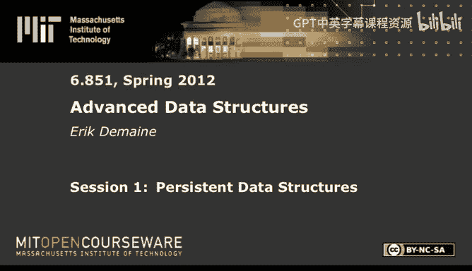

# 高级数据结构：1：持久化数据结构



## 概述
在本节课中，我们将学习持久化数据结构。这是一种能够“记住”所有历史版本的数据结构，允许我们查询或修改过去的版本，而不会丢失任何信息。我们将从模型定义开始，逐步探讨不同级别的持久化技术及其实现。

## 模型定义：指针机
在深入持久化之前，我们需要定义计算模型。本课程中一个重要的主题是计算模型至关重要。我们将使用一种称为**指针机**的模型。

指针机模型对应于面向对象或结构体编程的思想。它包含一系列节点，每个节点有恒定数量的字段。这些字段可以是指向其他节点的指针，也可以是存储的数据（例如整数）。计算操作包括创建节点、查看或设置字段值等。所有操作都通过一个称为“根”的节点开始进行。

**指针机模型示例代码结构：**
```cpp
struct Node {
    int data;
    Node* field1;
    Node* field2;
    // ... 其他字段
};

Node* root; // 根节点
```

## 持久化简介
持久化数据结构的核心思想是**记住一切**。具体来说，我们希望保留数据结构在每次更新操作后的所有版本。每次更新操作都会基于一个指定版本创建一个新版本，而不会破坏旧版本。然后，所有数据结构的操作（查询或更新）都是相对于某个指定版本进行的。

持久化有四个级别：
1.  **部分持久化**：只能更新最新的版本，版本呈线性顺序。
2.  **完全持久化**：可以更新任何版本，版本形成一个树形结构。
3.  **汇合持久化**：可以合并两个版本来创建新版本，版本形成一个有向无环图。
4.  **函数式持久化**：在纯函数式世界中，不允许修改任何节点，只能创建新节点。

上一节我们介绍了计算模型，本节中我们来看看持久化的具体目标和分类。

## 部分持久化
部分持久化是最容易实现的级别。在此模型中，版本是线性排列的，我们只能更新最新的版本，但可以查询任何旧版本。

### 定理与实现思路
对于任何满足“任何节点的入度有常数上界”的指针机数据结构，都可以被转化为部分持久化版本，且仅需付出常数倍的摊销时间开销和每次修改的常数附加空间。

实现基于两个核心思想：
1.  **存储反向指针**：每个节点记录所有指向它的指针，由于入度有界，这只需要常数空间。
2.  **存储修改记录**：每个节点附带一个“修改列表”，用于记录对该节点字段的更改，而不是直接覆盖原值。每个修改记录包含版本号、被修改的字段以及新值。每个节点只存储常数数量的修改记录。

### 操作细节
*   **读取字段**：给定版本V，查看节点本身的字段值，然后按版本顺序检查修改列表，应用所有版本号≤V的修改，最后生效的修改即决定了该字段在版本V的值。由于修改列表大小为常数，此操作耗时O(1)。
*   **修改字段**：
    *   **简单情况**：如果节点的修改列表未满，则直接添加一条新的修改记录。
    *   **复杂情况**：如果节点的修改列表已满，则创建一个新节点。将原节点修改列表中的所有修改应用到新节点的字段上，并清空新节点的修改列表。然后，需要将所有指向原节点的指针（在最新版本中）更新为指向新节点。这通过反向指针找到这些指针的位置，并递归地更新它们（这本身也是一个字段修改操作）。

### 摊销分析
使用势能法进行分析。定义势能为所有“存活”（属于最新版本）节点中已占用修改槽位的数量乘以某个常数C。
*   添加修改记录时，势能增加C。
*   当节点已满需要创建新节点时，原节点的修改列表被清空（势能大幅下降），这为递归更新指针的操作提供了“信用”。
通过精心设置常数，可以证明每次修改的摊销时间复杂度为O(1)。

## 完全持久化
完全持久化允许更新任何版本，从而形成一个版本树。这带来了两个新挑战：
1.  反向指针需要在所有版本中维护。
2.  版本不再是线性序，而是树形结构。

### 处理版本树：线性化
为了高效处理版本间的祖先关系查询，我们将版本树进行线性化。对版本树进行深度优先遍历，为每个版本V记录其开始访问时间`B(V)`和结束访问时间`E(V)`。这样，版本U是版本V的祖先，当且仅当区间`[B(U), E(U)]`包含区间`[B(V), E(V)]`。

我们需要动态维护这个线性顺序。这可以通过一个**顺序维护数据结构**来实现，该数据结构支持：
*   `insert(x, y)`: 在项y之前或之后插入新项x。
*   `order(x, y)`: 判断项x和y在顺序中的前后关系。
这两个操作都可以在O(1)时间内完成。利用这个数据结构，我们可以动态维护所有`B(V)`和`E(V)`的顺序，从而在O(1)时间内判断任意两个版本的祖先关系。

### 读取与修改的调整
*   **读取字段**：给定版本V，我们需要找到所有适用于V的修改（即修改发生的版本是V的祖先）。利用线性化后的顺序，我们可以通过常数次祖先关系检查来找到决定字段值的最近一次修改。
*   **修改字段**：基本策略与部分持久化类似，但当节点修改列表已满时，策略有所不同。我们不能简单地创建新节点并丢弃旧节点，因为旧节点可能在未来被再次修改。相反，我们需要将节点的修改列表（对应一个版本子树）分割成大致平衡的两部分，并创建一个新节点来承担其中一部分。这涉及到更复杂的树分割操作和指针更新，但通过类似的势能分析（势能定义为所有节点中空闲修改槽位总数的负值），仍然可以证明每次修改的摊销时间复杂度为O(1)。

## 汇合持久化与函数式持久化
汇合持久化允许合并两个版本，这使得数据结构的规模可能指数级增长（例如，反复将数据结构与自身连接）。因此，实现高效的汇合持久化更加困难。

### 已知结果
*   **通用转换**：Fiat和Kaplan在2003年提出了一种通用转换方法，其时间与空间开销是`O(log U + 有效深度)`的乘积，其中U是操作次数，有效深度是版本DAG的某种度量。在最坏情况下，这可能达到线性开销O(U)。
*   **受限情况**：在“不相交合并”的假设下（即被合并的两个版本不共享节点），可以获得更好的`O(log U)`开销。
*   **下界**：存在需要Ω(有效深度)倍空间开销的例子，表明在某些情况下线性开销可能是不可避免的（如果只考虑更新操作的成本）。

### 函数式持久化
在函数式持久化中，任何节点都不能被修改，只能创建新节点。这自然实现了完全持久化甚至汇合持久化。一些数据结构可以高效地以函数式方式实现：
*   **平衡二叉搜索树**：通过“路径复制”技术，在修改时复制从根到目标节点路径上的所有节点，耗时O(log n)。
*   **双端队列**：支持在两端进行插入删除，以及常数时间的连接操作。
*   **具有固定拓扑结构的树**：例如版本控制系统中的目录树，可以支持高效的子树复制和合并。

函数式实现有时会比允许修改的实现慢一个对数因子，这是目前已知的最坏情况分离。


## 总结
本节课我们一起学习了持久化数据结构。我们从指针机模型出发，详细探讨了部分持久化和完全持久化的通用转换技术，它们都能在常数摊销开销内实现。我们还简要介绍了更具挑战性的汇合持久化和函数式持久化的现状与结果。持久化数据结构是时间旅行概念在计算机科学中的精彩体现，它为需要访问历史状态的应用提供了强大的基础。