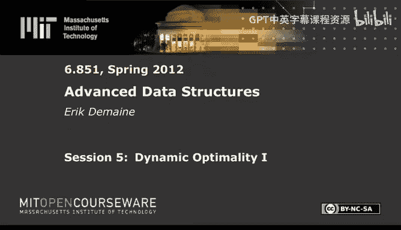

# 高级数据结构：6.851：动态最优性 I 🧠

在本节课中，我们将探讨一个数据结构领域的核心开放性问题：动态最优性。我们将学习是否存在一种“最优”的二叉搜索树，能够适应任何访问序列，并理解衡量其性能的各种标准。课程将从基本概念入手，逐步深入到几何视角，最终介绍一个被认为可能达到动态最优的算法。

## 概述

动态最优性问题的核心是：是否存在一种二叉搜索树，对于任何给定的访问序列，其性能都能在常数因子内匹敌最优的离线算法？这是一个自上世纪80年代起就备受关注的问题，至今仍未完全解决。本节课我们将首先明确二叉搜索树的计算模型，然后介绍一系列衡量性能的“分析性界”，如工作集性质和动态手指性质。接着，我们将引入一个强大的几何视角，将二叉搜索树的执行过程映射为二维平面上的点集，并探讨其满足的“树状”性质。最后，我们将介绍“贪心算法”，它被认为是实现动态最优性的有力候选者。

## 二叉搜索树模型

为了形式化地讨论问题，我们首先需要定义二叉搜索树的计算模型。这个模型比一般的指针机模型更为受限。

*   数据必须存储在一个二叉搜索树中，树中的节点存储着键值。
*   允许的基本操作包括：
    *   跟随指针：可以沿左孩子、右孩子或父节点指针移动，每次操作花费常数时间。
    *   旋转：可以旋转一个节点与其父节点之间的边。如果节点 `x` 是其父节点 `y` 的右孩子，旋转 `x` 会使其成为 `y` 的父节点，同时保持二叉搜索树的性质。反向旋转 `y` 可以恢复原状。

在这个模型中，搜索一个键值 `x` 的过程是：从根节点开始，通过上述操作（移动和旋转），最终必须访问到键值等于 `x` 的节点。我们通常假设搜索总是成功的，并且暂时不考虑插入和删除操作，以简化问题。

对于包含 `n` 个节点的树，最坏情况下（例如，对手总是选择树中最深的节点进行访问），每次搜索的成本至少是 `O(log n)`。然而，动态最优性的目标不是针对最坏情况，而是针对**每一个特定的访问序列**，都尽可能达到最优。

## 超越 O(log n)：分析性界

对于某些访问序列，我们可以做得比 `O(log n)` 好得多。以下是几个重要的性能衡量标准（“界”），它们描述了在特定类型的访问序列下，我们期望达到的摊销成本。

### 顺序访问性质

如果访问序列是按键值顺序进行的（例如，连续访问 1, 2, 3, ..., n），那么理想情况下，每次访问的摊销成本应为 `O(1)`。这可以通过将树结构调整为类似链表的形式来实现。

### 动态手指性质

对于访问序列 `x1, x2, ..., xm`，如果当前访问的键 `xi` 与前一个访问的键 `xi-1` 在键值空间中的距离为 `k`（即 `|xi - xi-1| = k`），那么理想情况下，本次访问的摊销成本应为 `O(log k)`。当访问在空间上连续时，这个性质能带来很好的性能。

### 工作集性质

对于每次访问键 `x`，设 `t` 为自上次访问 `x` 以来，所访问过的**不同**键的数量。那么，访问 `x` 的理想摊销成本应为 `O(log t)`。这意味着，如果你最近频繁访问一小部分键，那么访问它们的成本就会很低。

### 统一界

统一界试图结合动态手指性质和工作集性质。其思想是：如果你访问的键 `x` 在空间上接近一个**最近**访问过的键 `y`，那么访问 `x` 的成本应该较低。形式化地说，对于在时间 `j` 访问键 `xj`，定义其成本为 `O(log(min_{i<j} (|xi - xj| + (在时间 i 和 j 之间访问的不同键数)) + 2)`。目前尚不清楚是否存在二叉搜索树能达到统一界，但已知存在指针机数据结构可以实现它。

## 动态最优性：终极目标

上述性质都是针对特定类型访问序列的。动态最优性提出了一个更宏大、更根本的目标：

> 是否存在一个（在线的）二叉搜索树算法，使得对于**任何**访问序列 `X`，其总成本都在一个**常数因子**内，最优的（离线的）二叉搜索树算法对于同一序列 `X` 的总成本？

这里，“最优的离线算法”是指预先知道整个访问序列 `X`，并可以为其量身定制最优的二叉搜索树策略。而“在线算法”则不知道未来的访问。这个问题目前仍然是开放的。

尽管无法证明常数竞争性，但我们已知一些接近的结果。例如，存在 `O(log log n)` 竞争的在线二叉搜索树算法，这比简单的平衡二叉搜索树（`O(log n)` 竞争）要指数级地好。

## 候选的最优算法：伸展树与几何视角

有两个二叉搜索树被猜想是动态最优的，但均未被证明。第一个是经典的**伸展树**。伸展树在每次搜索后，会将访问的节点通过一系列旋转移动到根节点。已知伸展树具有工作集性质（从而也具有熵界）和动态手指性质，但它是否满足统一界或达到动态最优性，仍是悬而未决的问题。

接下来，我们将介绍一个更具启发性的**几何视角**，它能将二叉搜索树的执行过程转化为一个二维点集，并引出一个被称为“贪心算法”的候选最优算法。

### 几何表示法

*   **坐标轴**：设横轴为键值空间（1 到 n），纵轴为时间。
*   **访问点**：对于在时间 `t` 访问键值 `k`，我们在坐标 `(k, t)` 处画一个点。
*   **触摸点**：在二叉搜索树模型中，为了访问目标节点，算法在搜索路径上会“触摸”一系列节点（包括通过指针移动或旋转访问的节点）。我们将所有在时间 `t` 被触摸的节点 `k`，都表示为点 `(k, t)`。

这样，一个二叉搜索树算法对某个访问序列的执行过程，就对应了二维平面上的一个点集，其中包含访问点（必须有的）和额外的触摸点。

### 树状满足性质

一个关键定理指出：一个点集 `P` 对应某个二叉搜索树算法的执行过程，**当且仅当**它满足“树状满足性质”。

**树状满足性质**：对于点集 `P` 中任意两个不共水平线也不共垂直线的点 `(x1, y1)` 和 `(x2, y2)`，以它们为对角顶点形成的矩形内，必须包含 `P` 中的另一个点（可以在边界上）。

直观上，这个性质意味着点集是“树状”的，不能存在空洞。如果存在一个不满足该性质的“空矩形”，则无法用二叉搜索树的操作来解释对应的触摸模式。

### 动态最优性的几何重构

根据这个定理，动态最优性问题有了一个清晰的几何表述：

> 给定一个访问序列对应的点集（只有访问点，没有触摸点），我们需要添加最少数量的额外点（触摸点），使得整个点集满足树状满足性质。这个最小添加点数（乘以一个常数因子）就等于最优离线二叉搜索树算法的成本。

因此，寻找动态最优的二叉搜索树，等价于寻找一个在线算法，能根据已出现的访问点，决定添加哪些触摸点，并使总添加点数接近上述离线的最优解。

## 贪心算法

基于几何视角，一个非常自然的算法浮出水面，我们称之为**贪心算法**。

**算法过程**：我们按时间顺序处理访问点。在时间 `t`，添加当前访问点 `(x, t)`。然后，检查所有新形成的、不满足树状性质的“空矩形”。对于每个这样的矩形，我们在其**顶部边**（即当前时间 `t` 的水平线上）添加一个点来“填补”它（具体位置在矩形的左边界和右边界对应的键值之间）。重复此过程，直到当前时间线对应的点集满足树状性质，然后处理下一个时间点。

这个算法在几何上看是在线的，因为它只依赖过去的信息。可以证明，通过一种称为“分裂树”的数据结构进行模拟，这个几何贪心算法可以被转化为一个真正的**在线二叉搜索树算法**。

贪心算法极其简洁和直观，被认为很有可能是动态最优的。然而，证明其常数竞争性仍然是一个巨大的挑战，也是当前研究的前沿。

## 总结

本节课我们一起深入探讨了动态最优性这个迷人而困难的问题。我们首先定义了二叉搜索树的计算模型，并回顾了诸如工作集、动态手指等分析性性能界。然后，我们引入了强大的几何视角，将树的操作转化为二维点集的满足性问题，从而对最优成本有了新的理解。最后，我们介绍了基于该视角的贪心算法，它是在线且被推测为最优的有力候选者。尽管尚未得到证明，但这些概念和工具为我们理解和逼近二叉搜索树的终极性能极限提供了清晰的框架。下节课，我们将探讨与此相关的下界理论。